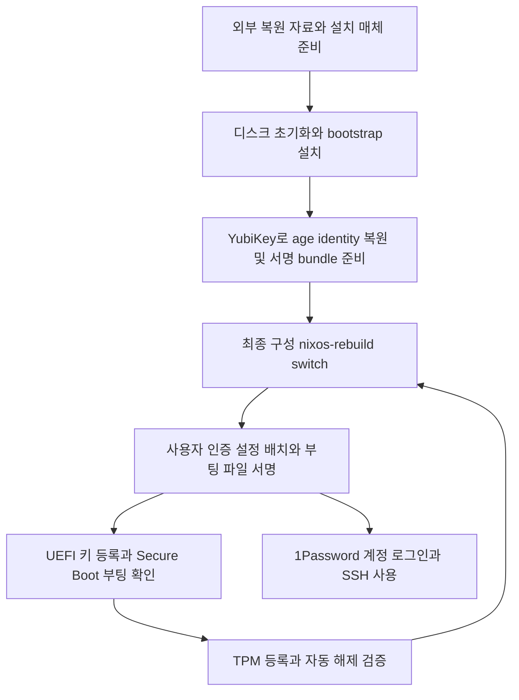
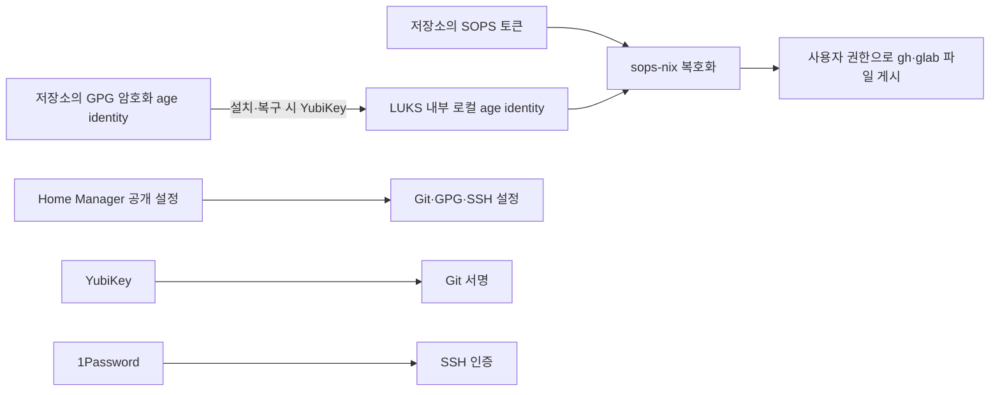

# ThinkPad NixOS declarative environment - Plan

## Goal Capsule

- Objective: 이 ThinkPad를 새로 설치한 뒤 필요한 개발 도구와 인증 환경을 복원하고, 반복 적용 시 수동 인증과 스크립트 실패 때문에 환경이 불완전해지는 일을 줄인다.
- Means: Flake 기반 NixOS 구성과 설치·프로비저닝·복구 가이드를 만든다.
- Product authority: 아래 Product Contract가 범위를 정의한다. 최초 대상은 사용자의 ThinkPad X1 Carbon Gen 11 한 대이며, macOS와 일반 Linux는 후속 범위다.
- Open blockers: 요구사항 결정을 막는 항목은 없다. 구현의 검증 경계는 Verification Contract에서 다룬다.

---

## Product Contract

### Summary

ThinkPad X1 Carbon Gen 11을 NixOS unstable과 기본 Plasma 환경으로 새로 설치하는 저장소를 만든다.
핵심 개발 도구와 인증 설정은 시스템 재빌드로 함께 적용하고, 최초 설치와 보안 키 등록은 별도 가이드로 제공한다.

### Problem Frame

기존 chezmoi 환경은 많은 설치·인증 스크립트를 순서대로 실행한다.
사용자는 매 적용의 리소스 사용과 반복해서 달라지는 오류를 겪었으며, 1Password 잠금이나 중간 sudo 인증 실패가 뒤의 작업을 막는 사례를 제시했다.
현재 저장소에는 Nix 구현이 없고, 기존 dotfiles에는 Fedora 시스템 튜닝부터 에이전트 설정까지 이번 이전에 필요하지 않은 기능도 많다.

### Key Decisions

- **한 대의 핵심 환경부터 이전한다.** Governs R1, R4. (session-settled: user-directed — chosen over migrating all platforms and existing features: 현재 사용하는 노트북에서 필요한 기능만 먼저 복원한다.)
- **Plasma 기본 환경을 유지한다.** Governs R2. (session-settled: user-directed — chosen over copying existing desktop customization: 기존 꾸미기와 튜닝은 필요하지 않다.)
- **YubiKey는 Git 서명과 최초 설치·복구에만 사용한다.** Governs R6, R10–R12. (session-settled: user-directed — chosen over requiring the card on every rebuild: 일상적인 적용은 카드와 PIN에 의존하지 않는다.)
- **새 설치를 전제로 한다.** Governs R13. (session-settled: user-directed — chosen over preserving the installed OS or data: 사용자가 기존 데이터 보존이 불필요하다고 확인했다.)
- **1Password는 SSH 키 제공자로 유지한다.** Governs R8, R9. (session-settled: user-directed — chosen over moving SSH authentication to YubiKey: 기존 SSH 에이전트 설정을 유지하며 자동 계정 로그인은 필요하지 않다.)
- **사용자 인증 설정도 재빌드에 포함한다.** Governs R5, R6. (session-settled: user-directed — chosen over a separate manual user-provisioning stage: 설치 가이드의 사용자 프로비저닝을 재빌드가 수행해야 한다.)

### Requirements

**Platform and applications**

- R1. 이번 구현은 ThinkPad X1 Carbon Gen 11의 x86_64 NixOS 환경을 대상으로 한다.
- R2. Nixpkgs는 `nixos-unstable`을 사용하고 `flake.lock`으로 적용 버전을 고정하며, 데스크톱은 NixOS의 기본 Plasma 구성을 사용한다.
- R3. 호스트명은 DMI `system-version`을 기반으로 정하며, 이 장비의 `ThinkPad X1 Carbon Gen 11`은 `ThinkPad-X1-Carbon-Gen-11`로 사용한다.
- R4. zsh, Git, Ghostty, Claude Code, Codex, omp, GitHub CLI, GitLab CLI, 1Password 데스크톱 앱, Google Chrome을 설치한다.

**Rebuild and authentication**

- R5. 초기 신뢰 설정을 마친 환경에서 `sudo nixos-rebuild switch --flake .#ThinkPad-X1-Carbon-Gen-11` 한 번으로 시스템과 사용자 설정을 함께 적용한다.
- R6. R5의 적용 과정은 `gh`·`glab` 인증정보 배치, Git credential helper, GPG 공개키·서명 설정, SSH 에이전트 연결과 키 선택 설정까지 자동으로 수행한다.
- R7. GitHub와 Gist는 `gh`, GitLab.com과 `git.jpi.app`은 `glab` credential helper를 사용하며, Git 커밋과 태그는 기존 사용자 신원의 GPG 키로 서명한다.
- R8. SSH에는 기존 dotfiles의 `IdentityAgent ~/.1password/agent.sock`과 1Password SSH 키 선택 설정을 이전한다.
- R9. 1Password의 최초 계정 로그인과 실제 SSH 요청의 사용자 승인은 자동화하지 않으며, 앱이 잠겼거나 로그인되지 않았다는 이유로 R5를 차단하지 않는다.
- R10. 이전 대상 토큰은 저장소에 암호화해서 보관한다. 최초 설치·복구에서 YubiKey로 로컬 복호화 키를 복원하며, 평문 secret을 Git·Nix store·빌드 산출물·로그에 남기지 않는다.
- R11. YubiKey는 Git 커밋·태그 서명과 최초 설치·복구 시 secret 복원에만 사용한다. 복호화 키를 복원한 이후 R5는 YubiKey·PIN·로그인 세션 없이 동작한다.
- R12. 로컬 복호화 키 또는 secret이 부족하면 필요한 조치를 명확히 알리고 인증 프로비저닝 완료로 처리하지 않으며, 같은 재빌드 명령으로 재시도할 수 있어야 한다.

**Installation and boot**

- R13. 내부 NVMe를 초기화하는 새 설치를 지원하되, 디스크 초기화 명령은 일상적인 재빌드와 분리한다.
- R14. 루트 및 사용자 데이터는 LUKS2로 암호화하고, 정상 부팅 시 TPM2로 자동 해제하며 복구 암호 또는 복구 키로도 접근할 수 있게 한다.
- R15. Secure Boot를 지원하고 초기 키 등록 이후 시스템 업데이트에서 필요한 부팅 파일 서명을 자동으로 수행한다.
- R16. 초기 설치·키 등록·복구에 필요한 원본 자료를 대상 디스크를 지우기 전에 외부에서 다시 확보할 수 있어야 한다.

**Operator guide and repeatability**

- R17. 설치 가이드는 설치 매체·네트워크 준비, 대상 디스크 확인, LUKS 구성, NixOS 설치, Secure Boot 키 등록, TPM 등록을 순서대로 설명한다.
- R18. 사용자 프로비저닝 가이드는 최초 신뢰 설정과 R5의 자동 적용을 구분하고, `gh auth login`·`glab auth login`·GPG 수동 가져오기를 일상적인 후속 단계로 요구하지 않는다.
- R19. 운영·복구 가이드는 업데이트·롤백·TPM 해제 실패·YubiKey 분실 또는 교체·서명 키 복원을 다루고, 각 절차에 성공 확인 방법을 제공한다.
- R20. 동일한 선언을 반복 적용해도 인증 등록이나 설치 작업을 불필요하게 반복하지 않으며, 개별 작업이 중간에 sudo 인증을 다시 요구하는 구조를 피한다.
- R21. secret이 없어도 구성 평가와 빌드를 할 수 있도록 하고, 인증정보를 실제로 필요로 하는 적용 단계와 구분한다.

### Key Flows

- F1. 새 설치. 사용자가 외부 복원 자료를 준비하고 설치 환경으로 부팅한 뒤, 디스크 구성과 NixOS 설치를 실행한다. 이후 보안 키를 등록하고 부팅을 검증한다. Covers R13–R17.
- F2. 최초 사용자 환경 구성. YubiKey로 로컬 복호화 키를 한 번 복원한 뒤 R5를 실행한다. 앱과 인증 구성이 함께 배치되며, 1Password 계정 로그인은 사용자가 별도로 수행한다. Covers R5–R11, R18.
- F3. 반복 적용과 갱신. 설정 또는 암호화한 토큰을 변경하고 R5를 실행한다. CLI 인증과 Git 설정이 갱신되며 1Password 세션은 적용의 전제조건이 아니다. Covers R5–R12, R20, R21.
- F4. 복구. 자동 디스크 해제가 실패하면 복구 수단으로 부팅하고 해당 장비의 TPM 또는 서명 설정을 복구한다. YubiKey를 분실해도 기존 장비의 재빌드는 유지된다. 재설치 시에는 외부 복구 자료나 대체 수신자가 필요하며, 그것도 없으면 토큰 재발급과 새 서명 키 설정이 필요하다. Covers R12, R14–R16, R19.

### Acceptance Examples

- AE1. **Covers R2, R4, R5.** 새 시스템에 R5를 적용하면 기본 Plasma에서 지정한 앱을 실행할 수 있고, 에이전트별 설정 이전 없이 실행 파일이 준비된다.
- AE2. **Covers R5–R9.** 1Password가 잠겼거나 아직 로그인되지 않은 상태에서도 준비된 토큰으로 `gh`·`glab`과 Git 인증 구성을 적용한다. SSH 연결 설정은 존재하지만 실제 SSH 사용은 1Password 인증 정책을 따른다.
- AE3. **Covers R6, R7, R10, R11.** 로컬 복호화 키를 복원한 뒤 YubiKey가 없어도 R5로 인증정보와 서명 설정을 배치한다. 실제 Git 서명에는 YubiKey가 필요하다.
- AE4. **Covers R10–R12.** 로컬 복호화 키가 없거나 잘못되면 R5가 인증 적용 실패를 보고한다. 키를 복구하고 같은 명령을 실행하면 재시도한다. YubiKey 부재나 잠긴 Secret Service는 이 경로에 영향을 주지 않는다.
- AE5. **Covers R10, R20, R21.** 같은 선언을 두 번 적용했을 때 불필요한 인증 등록을 반복하지 않으며, secret 없이 실행한 평가·빌드 산출물에는 평문 인증정보가 없다.
- AE6. **Covers R13, R20.** 일상적인 R5 실행은 파티션을 다시 만들거나 LUKS를 포맷하거나 기존 보안 키를 초기화하지 않는다.
- AE7. **Covers R14, R15, R19.** 초기 등록 후 정상 재부팅에서는 Secure Boot가 활성화되고 LUKS가 자동 해제된다. TPM 정책이 맞지 않는 경우에는 복구 수단으로 부팅할 수 있다.
- AE8. **Covers R15, R19.** 커널 업데이트 후 서명된 새 구성이 부팅되고, 지원되는 이전 세대로의 복구 절차를 가이드로 따라갈 수 있다.
- AE9. **Covers R16–R19.** 사용자가 기존 Fedora 환경을 삭제해도 저장소·복원 자료·가이드만으로 설치와 사용자 프로비저닝을 이어갈 수 있다.

### Scope Boundaries

- macOS와 일반 Linux 지원은 후속 작업이다.
- 코딩 에이전트의 로그인·설정·플러그인·MCP·스킬 이전은 제외한다.
- 기존 KDE 꾸미기, Fedora 전용 시스템 튜닝, 얼굴·지문 인증, 최대절전 설정, 소스 저장소 garden, 추가 앱 전체 이전은 포함하지 않는다.
- R6–R8에 명시되지 않은 기존 secret이나 서비스 인증은 이전하지 않는다.
- R9에 따라 1Password 자동 계정 로그인은 제외한다.
- 계획 작성과 저장소 구현은 실제 디스크 초기화·UEFI 변경·시스템 설치를 수행하지 않는다.

<!-- ce-section: work-relationships -->
### How This Work Fits Together

이번 작업은 한 노트북에서 설치부터 반복 재빌드까지 이어지는 환경을 완성한다.
다음 관계는 현재의 후속 작업 구분이며 확정된 로드맵은 아니다.

- 일반 Linux·macOS 지원은 이번에 정리한 사용자 환경을 공유할 수 있으나, 이번 설치 완료의 조건이 아니다.
- 에이전트 설정 이전은 이번 실행 파일 설치를 활용하는 별도 작업이다.

### Hardware Evidence

2026-09-21에 현재 장비를 읽기 전용으로 조사했고, 추가 관리자 명령 결과는 사용자가 제공했다.

| 항목 | 관측값 | 범위에 주는 근거 |
|---|---|---|
| 모델 | Lenovo 21HMCTO1WW, ThinkPad X1 Carbon Gen 11 | R1, R3의 대상 |
| CPU·RAM | i7-1370P, 약 62 GiB 가용 표기 | x86_64, 장착 RAM 64 GB |
| 저장장치 | KIOXIA 512 GB NVMe 1개, 약 476.9 GiB | 새 설치 대상은 내부 디스크 |
| 기존 파일시스템 | ESP 600 MiB, ext4 boot 2 GiB, LUKS2와 Btrfs | 기존 레이아웃을 보존할 필요 없음 |
| 부팅 | UEFI x64, Secure Boot enabled/user, Fedora GRUB·shim | 새 NixOS 부팅 경로의 키 등록 필요 |
| TPM | TPM 2.0, 기존 systemd-tpm2 토큰 2개 | 두 토큰 모두 SHA256 PCR 7에 연결 |
| 그래픽 | Intel Iris Xe 8086:a7a0, i915 | 실제 장비 ID 기준으로 설정 검증 |
| 무선·오디오 | Intel Wi-Fi, AX211 Bluetooth, Intel SOF 오디오 | 설치 후 기능 검증 대상 |
| 절전 | s2idle, 현재 swapfile 약 64 GiB | 최대절전 지원을 추정하지 않음 |

기존 LUKS2에는 키 슬롯 3개와 TPM 토큰 2개가 있지만, 새 설치의 키 슬롯 구성을 그대로 복제할 근거는 없다.
관측 시 USB 목록에 YubiKey는 없었으므로 카드 모델·OpenPGP 기능·PIN 및 touch 정책은 아직 실측하지 않았다.
Fedora에서 동작한다는 사실만으로 NixOS에서 절전·Wi-Fi·오디오까지 검증됐다고 보지 않는다.

### Dependencies and Assumptions

- 초기 설치에는 네트워크와 패키지 공급원이 필요하다. 저장소와 YubiKey로 복원한다는 목표가 오프라인 설치나 외부 SSH 키 공급자의 제거를 의미하지 않는다.
- 사용자는 기존 Git 사용자 신원, 유효한 GitHub·GitLab 토큰, 사용할 YubiKey와 1Password 계정을 제공할 수 있다고 가정한다. 토큰 발급 자체는 설정 관리가 수행하지 않는다.
- Git 서명의 PIN 자동 입력은 기존 사용자 Secret Service 캐시를 사용할 수 있다. 카드의 touch 정책은 별개이며, 어느 것도 재빌드의 전제조건이 아니다.
- R20은 NixOS·사용자 파일·외부 앱의 모든 변경을 하나의 트랜잭션으로 보장한다는 뜻이 아니다. 실패 단계와 재시도 방법을 명확히 해야 한다.
- LUKS 복구 자료를 잠긴 해당 디스크 안에만 보관하지 않는다. R16의 외부 복원 준비는 디스크 초기화 전에 완료한다.

### Sources and Research

기존 dotfiles 기준 커밋은 `6e14fe842d2257793995cf0a07742ffab2f5368f`이다.
아래 파일 경로는 각 항목에 표시한 저장소 기준이다.

- 기존 `hyperlapse122/dotfiles`의 `.install-prerequisites.sh:61–138,1368–1393,1511–1552,1713–1794,1852–1935,2143–2147`: 1Password 선행 인증, GPG 공개키·카드 stub, PIN 저장의 실제 구현. `home/.chezmoi.toml.tmpl:12–18`의 private-key import 주석은 현재 구현과 달라 근거로 사용하지 않는다.
- 기존 dotfiles의 `home/dot_config/git/config.tmpl:1–55`: GPG 서명과 도메인별 `gh`·`glab` helper.
- 기존 dotfiles의 `home/dot_ssh/.config_linux:1–2`, `home/dot_config/1Password/ssh/agent.toml:1–13`: SSH 소켓 연결과 키 선택 설정.
- 기존 dotfiles의 `home/.chezmoidata/commands.yaml:32–89`, `home/dot_config/zsh/`, `home/dot_config/ghostty/config.tmpl`: 기본 앱 선정 근거.
- [NixOS LUKS 매뉴얼](https://nixos.org/manual/nixos/stable/#sec-luks-file-systems): 암호화 볼륨과 토큰 등록의 구분.
- [Lanzaboote 설정](https://nix-community.github.io/lanzaboote/getting-started/prepare-your-system.html), [UEFI 키 등록](https://nix-community.github.io/lanzaboote/getting-started/enable-secure-boot.html): Flake 통합과 최초 펌웨어 등록 절차.
- [disko](https://github.com/nix-community/disko): 선언형 디스크 구성 후보.
- [systemd-cryptenroll](https://github.com/systemd/systemd/blob/main/man/systemd-cryptenroll.xml): TPM·복구 키·PCR 정책의 근거.
- [1Password SSH 설정](https://www.1password.dev/ssh/agent/config): 키 선택 파일은 앱 로그인이나 에이전트 활성화 설정 자체와 별개다.
- [nixos-hardware X1 Carbon Gen 11 모듈](https://raw.githubusercontent.com/NixOS/nixos-hardware/master/lenovo/thinkpad/x1/11th-gen/default.nix): 모듈의 `i915.force_probe=a7a1`은 관측 GPU `a7a0`과 달라 그대로 복사하지 않는다.

## Planning Contract

### Key Technical Decisions

- KTD1. Flake는 nixpkgs unstable, Home Manager, disko, sops-nix, Lanzaboote를 고정한다. Home Manager는 NixOS 모듈로 통합하고 nixpkgs를 공유한다. 호스트 이름은 관측한 문자열에서 정규화한 상수이며 평가 중 DMI를 읽지 않는다. Covers R1–R5, R21.
- KTD2. 디스크는 GPT, 2 GiB FAT32 ESP, 나머지 LUKS2의 Btrfs로 구성한다. subvolume은 root/home/nix/log이며 압축은 zstd, swap은 zram이다. 최대절전과 impermanence는 도입하지 않는다. 설치 시 확인한 정확한 by-id 경로만 허용하며 rebuild에서 포맷을 호출하지 않는다. Covers R13, R14, R20.
- KTD3. 최초 부팅용 `ThinkPad-X1-Carbon-Gen-11-bootstrap` 출력은 systemd-boot와 공개 설정만 제공한다. 최종 출력은 Lanzaboote v1.1.0을 기준으로 검증하고 unsigned 부팅 파일을 허용하지 않는다. 부팅 서명 키는 LUKS 안의 런타임 디렉터리에 두며 Nix store로 가져오지 않는다. Covers R15–R17, R21.
- KTD4. TPM2 등록은 Secure Boot 최종 키 등록과 정상 부팅 확인 이후 수행한다. 첫 구현은 SHA256 PCR7 정책과 복구 암호를 사용한다. PCR7은 Secure Boot 정책을 보호하며 특정 커널이나 루트 파일시스템의 신원을 증명하지 않는다. Microsoft 인증서 유지의 호환성과 신뢰 범위를 가이드에 명시한다. PCR11 서명 정책과 pcrlock은 후속이다. Covers R14, R15, R19.
- KTD5. 전용 age identity를 만들고 그 공개 수신자로 SOPS 토큰 파일을 암호화한다. identity의 외부 복원본은 YubiKey의 OpenPGP 암호화 수신자로 암호화해 저장소에 둔다. 최초 복원 결과는 LUKS 내부 런타임 경로 `/var/lib/sops-nix/key.txt`에 root:root 0600, 상위 디렉터리 0700으로 저장한다. 복원 시 공개 수신자를 검증하고 원자적으로 설치한다. 일반 재빌드는 이 파일만 읽는다. Covers R10–R12, R16. (session-settled: user-directed — chosen over card decryption during every rebuild: YubiKey의 사용 범위는 최초 복원과 Git 서명이다.)
- KTD6. sops-nix의 NixOS systemd activation을 사용한다. 자동 SSH 키 탐색과 age 키 생성을 끄고 복원한 identity만 지정한다. 기존 `sops-install-secrets` oneshot의 `RemainAfterExit=false`와 동기식 `ExecStartPost` 게시 단계를 검증한다. 목표는 동일 세대 재적용에서도 복호화·파일 복구·실패 재시도가 실행되는 것이다. 이 수명주기 선택은 소스에 근거한 추론이며 U5 VM 검증을 통과해야 채택한다. Covers R5, R6, R12, R20.
- KTD7. gh/glab 파일은 SOPS 템플릿에서 생성하되 사용자 소유의 쓰기 가능한 일반 파일로 배치한다. 게시 helper는 home 경로를 열기 전에 h82 권한으로 내려가며 0600 임시 파일 검증 후 파일별 rename을 수행한다. 두 파일의 동시 트랜잭션은 보장하지 않는다. 실패하면 적용 실패로 보고하고 재실행으로 복구한다. 템플릿 치환에 사용되는 토큰의 형식과 직렬화를 검증한다. Covers R6, R7, R10, R12.
- KTD8. GPG는 사용자 agent 하나와 기존 PC/SC·PIN wrapper를 사용한다. 공개키와 서명 설정은 카드 없이 배치하며 card stub 학습은 최초 카드 사용 또는 bootstrap에서 수행한다. PIN 캐시는 사용자 Secret Service에만 두고 root 프로비저닝과 분리한다. SSH는 기존 1Password 소켓·키 선택 파일을 이전한다. Covers R6–R9, R11.

### High-Level Technical Design

다음 그림은 KTD5–KTD8의 데이터 이동과 최초 설치 순서를 설명한다. 구현 파일의 세부 분할은 각 단위의 검증 결과에 맞춰 조정할 수 있다.

#### Data Flow and Ownership

저장소가 gh hosts와 glab config의 인증 관련 내용을 소유하며, 해당 파일의 수동 변경은 다음 성공한 재빌드에서 덮어쓴다. 사용자명과 프로토콜은 공개 선언으로 관리한다. GitHub/Gist는 gh helper, GitLab.com/git.jpi.app은 각 호스트별 glab helper를 사용한다. 온라인 토큰 검증이나 CLI login 명령은 activation에 넣지 않는다. 로컬 배치 성공과 서비스에서 토큰이 유효하다는 것은 별개다.

실제 토큰, age identity, PIN, Secure Boot 개인키는 평가·빌드 입력으로 읽지 않는다. 평문 토큰은 런타임 파일에만 존재하며 로그·명령 인자·테스트 fixture에 기록하지 않는다. 테스트에는 가짜 자격 증명을 사용한다. bootstrap 암호화 파일에는 개인키를 담지만 Git에는 암호문만 저장한다.

사용자 h82의 계정·그룹·셸은 선언한다. 최초 로컬 로그인 암호는 설치 중 별도 설정하여 secret 복원이 실패해도 콘솔과 sudo로 복구할 수 있게 한다. 1Password 계정 로그인과 앱 내부 SSH agent 활성화는 가이드의 일회성 사용자 단계다.

#### Installation Sequence

1. Fedora를 지우기 전에 공개 GPG 키, 실제 카드의 서명·암호화 기능, 암호화 토큰과 bootstrap identity 복원을 확인한다. 저장소와 복원 자료는 공개 HTTPS 또는 별도 매체로 다시 가져올 수 있어야 한다.
2. 복구 암호를 준비하고 설치 매체에서 디스크의 모델·크기·by-id를 확인한다. 필요하면 Secure Boot를 일시적으로 끄고 명시적으로 disko를 실행한다.
3. bootstrap 출력을 설치하고 로컬 계정 암호를 설정한다. LUKS 암호로 최초 부팅한다.
4. YubiKey로 age identity를 복원하고 Secure Boot 서명 bundle을 생성하거나 복원한다. 최종 출력으로 재빌드하면 사용자 인증 설정 배치와 부팅 파일 서명이 수행된다.
5. 서명 결과를 확인하고 UEFI Setup Mode에서 필요한 인증서를 등록한다. dbx를 무작정 삭제하지 않는다. Secure Boot 활성 상태로 최종 NixOS가 부팅되는지 확인한다.
6. 최종 부팅 상태에서 TPM2를 등록하고 복구 암호 슬롯을 유지한다. 자동 해제·복구 암호 부팅을 각각 확인하고 변경된 LUKS header와 서명 bundle의 암호화 외부 백업을 보관한다.

키 생성·UEFI 등록·TPM enrollment·디스크 포맷은 명시적 최초 작업이다. 이들은 재빌드에 숨기지 않는다. 사용자 인증 파일 배치는 R5에 포함하며 별도 CLI 로그인 단계로 돌리지 않는다.

### Risks and Evidence Boundaries

- YubiKey의 실제 암호화 subkey와 touch 정책은 아직 미확인이다. U4는 공개 정보 확인과 복원 검증을 설치 전 필수 조건으로 문서화한다. 유일한 카드를 분실하고 다른 복원 자료도 없으면 암호문만으로 복구할 수 없다.
- 로컬 age 키는 LUKS가 열린 시스템의 root가 읽을 수 있다. 이는 편리한 재빌드를 위한 의도된 신뢰 경계다. 유출 시 age 수신자 변경과 토큰 재암호화만으로 이미 노출된 서비스 토큰이 폐기되지는 않는다.
- Fedora shim으로 현재 Secure Boot가 된다고 새 NixOS 부팅 경로도 신뢰되는 것은 아니다. 펌웨어/db/dbx 변경 시 TPM 해제가 실패할 수 있으며 복구 암호가 필요하다.
- NixOS switch는 전체 시스템·사용자 변경을 원자적으로 롤백하지 않는다. 인증 배치 실패를 숨기지 않고 실패 지점과 같은 명령의 재시도를 안내한다.
- 실제 장비의 부팅·절전·무선·오디오는 VM 검사와 별도로 검증한다. nixos-hardware의 다른 GPU force_probe 값을 그대로 복사하지 않는다.

## Implementation Units

### U1. Flake와 호스트 기반

- Goal: 비밀정보 없이 평가·빌드 가능한 단일 호스트를 만든다.
- Requirements: R1–R5, R21; AE1, AE5; KTD1.
- Files: `flake.nix`, `flake.lock`, `hosts/ThinkPad-X1-Carbon-Gen-11/default.nix`, `hosts/ThinkPad-X1-Carbon-Gen-11/hardware.nix`, `modules/nixos/base.nix`, `.gitignore`.
- Approach: 최소 flake outputs와 명시적인 unfree 허용을 구성한다. 계정 h82와 Home Manager 통합, Intel 그래픽·무선·SOF의 필요한 기반만 선언한다. 장비 생성 hardware config와 선언한 disko 파일시스템의 중복 소유를 피한다.
- Test Scenarios: 외부 secret 없이 bootstrap/final 평가; hostname 정규화; 특정 GPU 강제 파라미터 미유입.
- Verification: V1, V2. Depends on: 없음.

### U2. 디스크와 부팅 구성

- Goal: 초기 설치와 이후 서명된 업데이트 경로를 분리한다.
- Requirements: R13–R17, R19–R21; F1, F4; AE6–AE9; KTD2–KTD4.
- Files: `hosts/ThinkPad-X1-Carbon-Gen-11/disko.nix`, `modules/nixos/boot.nix`, `modules/nixos/bootstrap.nix`, `tests/boot-layout.nix`.
- Approach: bootstrap/final 출력을 제공하고 initrd systemd와 TPM crypttab 옵션을 선언한다. ESP 파일 권한을 제한하고 부팅 세대 수는 5개로 시작한다. 일반 switch에 포맷·enrollment 부작용이 없는 구조를 유지한다.
- Test Scenarios: 임시 VM 디스크 설치와 LUKS 암호 부팅; bootstrap에 개인키와 토큰이 없어도 빌드; final이 누락된 서명 bundle을 성공으로 숨기지 않음.
- Verification: V1–V3, 실제 부팅은 V5. Depends on: U1.

### U3. Plasma와 사용자 도구

- Goal: 기본 데스크톱과 핵심 개발 도구를 준비한다.
- Requirements: R2, R4–R9; F2; AE1, AE2; KTD1, KTD8.
- Files: `modules/nixos/desktop.nix`, `home/h82/default.nix`, `home/h82/shell.nix`, `home/h82/git.nix`, `home/h82/ssh.nix`, `home/h82/terminal.nix`, `config/1password/agent.toml`.
- Approach: NixOS 1Password GUI 모듈과 polkit 소유자를 구성한다. zsh는 기본 completion/history 및 기존 핵심 플러그인만 이전한다. Ghostty 꾸미기와 에이전트 설정은 추가하지 않는다. Codex와 같은 버전의 code-mode helper를 포함하는 패키지를 확인하고 도구 자체 updater가 선언 버전을 덮어쓰지 않게 한다.
- Test Scenarios: 지정 실행 파일 존재; helper의 호스트별 reset; SSH 소켓과 키 선택 설정 동일; 잠긴 1Password로 공개 설정 적용 성공.
- Verification: V1, V2, V4. Depends on: U1.

### U4. 최초 secret 복원과 GPG 서명

- Goal: 카드가 필요한 최초 복원과 서명 경로를 제공한다.
- Requirements: R6, R7, R10, R11, R16, R18, R19; F2, F4; AE3, AE9; KTD5, KTD8.
- Files: `.sops.yaml`, `secrets/README.md`, `secrets/bootstrap/`, `keys/`, `home/h82/gpg.nix`, `scripts/restore-age-identity`, `scripts/pinentry-card`, `tests/pinentry-card.sh`.
- Approach: 공개 수신자·fingerprint만 선언한다. 원본 dotfiles의 PIN proxy를 최소한으로 이전하고 실제 GnuPG 프로토콜 fixture와 retry 방지를 유지한다. 복원 helper는 한 번의 명시적 권한 상승 아래 결과를 검증하고 설치하며 중간 sudo를 호출하지 않는다. 실제 secret은 사용자가 준비할 때 암호문만 추가한다.
- Test Scenarios: 잘못된 수신자·손상된 암호문이 기존 identity를 덮어쓰지 않음; PIN 오류와 낮은 재시도 횟수에서 자동 반복 중지; 카드 부재는 일반 공개 설정 적용에 영향 없음.
- Verification: V1, V4; 실제 카드 복원·서명은 V5. Depends on: U1, U3.

### U5. 재빌드에 통합된 토큰 배치

- Goal: 카드와 사용자 세션 없이 인증 파일을 적용하고 실패를 재시도한다.
- Requirements: R5–R7, R10–R12, R20, R21; F2, F3; AE2–AE5; KTD5–KTD7.
- Files: `modules/nixos/secrets.nix`, `scripts/publish-cli-auth`, `secrets/tokens.yaml`, `tests/auth-provisioning.nix`, `tests/fixtures/`.
- Approach: gh 현재 multi-account schema와 glab 호스트별 schema를 생성한다. glab keyring 사용은 끈다. 시스템 사용자·로컬 파일시스템·home mount 이후에 동작하도록 정렬하며 Home Manager 서비스나 그래픽 세션을 기다리지 않는다. 두 파일의 구문을 게시 전에 검증한다. 누락된 실제 암호문은 bootstrap만 허용하며 최종 인증 구성이 성공한 것처럼 처리하지 않는다.
- Test Scenarios: 로그인 세션·YubiKey·1Password 없는 첫 부팅; 같은 세대 연속 적용; 파일 삭제 후 복원; age 키 누락/손상 실패와 복원 후 동일 세대 재시도; 잘못된 템플릿에서 비밀정보 없는 오류; 사용자 home symlink를 통한 root 쓰기 방지.
- Verification: V1–V4. KTD6의 lifecycle 추론은 VM으로 입증하거나 같은 계약을 만족하는 더 단순한 방식으로 교체한다. Depends on: U1, U3, U4.

### U6. 설치·운영·복구 가이드

- Goal: 기존 OS를 지운 뒤에도 가이드와 복원 자료로 설치를 이어간다.
- Requirements: R13–R21; F1–F4; KTD2–KTD8.
- Files: `README.md`, `docs/install.md`, `docs/provisioning.md`, `docs/recovery.md`, `docs/verification.md`.
- Approach: Installation Sequence를 실행 가능한 절차로 작성한다. 각 명령에 실행 환경, 대상 mount, 필요한 권한과 성공 확인을 명시한다. 토큰 갱신, 로컬 age 키 교체, LUKS 복구, 서명 bundle 유실, 카드 분실, 부팅 세대 rollback을 다룬다. 1Password 수동 로그인과 agent 활성화는 재빌드 완료와 구분한다.
- Test Scenarios: 빈 디스크부터 가이드의 선행자료 순환 의존성 없음; 저장소를 가져오는 데 미설정 SSH agent 불필요; 복구 자료가 잠긴 디스크에만 존재하지 않음; 시스템 변경 없는 문서 검토와 VM 설치 연습.
- Verification: V3, V5 절차 완성; 실제 하드웨어 확인 여부를 정직하게 기록한다. Depends on: U2–U5.

## Verification Contract

현재 저장소에는 검증 명령이 없다. 구현은 다음 flake checks를 제공하며, 이 계획 작성 단계에서 빌드·VM·실제 설치가 수행되었다고 주장하지 않는다.

- V1. `nix flake check --no-build`로 전체 평가 후 `nix flake check`로 구현된 검사 실행. `nix fmt -- --check`가 지원되도록 formatter를 지정하거나 해당 formatter의 정확한 check 명령을 README에 제공한다.
- V2. 두 호스트 출력의 `config.system.build.toplevel`을 `nix build --no-link`로 빌드한다. secret 파일을 평가 시 읽지 않는지, 공개 설정과 가짜 fixture만 store에 들어가는지 검사한다. 실제 token·키를 검색 인자로 넘기지 않는다.
- V3. `nix build .#checks.x86_64-linux.auth-provisioning` 및 `nix build .#checks.x86_64-linux.boot-layout`. root 권한·디스크 작업은 VM의 임시 디스크에만 수행한다. 특히 동일 세대 재적용의 서비스 재실행과 실패 exit status를 검증한다.
- V4. PIN proxy 프로토콜 회귀 검사와 gh/glab 파일 파서 검증을 flake checks에 연결한다. 실제 외부 API 인증은 activation이나 CI에서 실행하지 않는다.
- V5. 설치 전 실제 YubiKey 복원 확인, 설치 후 Secure Boot 상태·TPM 자동 해제·복구 암호·새 세대와 rollback·Plasma·Wi-Fi·Bluetooth·오디오·s2idle·Git 서명·각 호스트 CLI 인증·1Password SSH를 사람이 확인한다. 데이터 삭제와 UEFI 변경은 실행 시 별도 명시적 사용자 지시가 필요하다.

## Definition of Done

- U1–U6의 파일과 문서가 구현되고 R1–R21을 검사·가이드 항목으로 추적할 수 있다.
- V1–V4를 통과하며 실패 재시도와 YubiKey 없는 재빌드가 VM에서 입증된다. 빌드만 성공한 경우 설치 성공으로 보고하지 않는다.
- 실제 암호문과 카드가 아직 제공되지 않았다면 준비에 필요한 입력을 명시하고 사용자 인증 복원 완료로 보고하지 않는다.
- V5는 실제 장비 이행 완료 조건이다. 저장소 구현 인계 시 아직 실행하지 않은 하드웨어 항목은 분명히 표시한다.
- 실험 후 폐기한 코드·중복 agent·특수 target·평문 fixture를 제거하고 diff에 secret이 없는지 검토한다.

## Appendix

### Implementation Sources

- [sops-nix NixOS 모듈](https://github.com/Mic92/sops-nix/blob/master/modules/sops/default.nix), [템플릿](https://github.com/Mic92/sops-nix/blob/master/modules/sops/templates/default.nix), [secret installer](https://github.com/Mic92/sops-nix/blob/master/pkgs/sops-install-secrets/main.go): KTD5–KTD7. 구현 시 lock에 고정한 소스로 옵션과 수명주기를 재확인한다.
- [NixOS switch 구현](https://github.com/NixOS/nixpkgs/blob/master/pkgs/by-name/sw/switch-to-configuration-ng/src/main.rs): sysinit-reactivation과 실패 보고의 근거. KTD6의 실제 동작은 V3가 판정한다.
- [Home Manager NixOS 통합](https://github.com/nix-community/home-manager/blob/master/nixos/default.nix): 사용자 세션 없이 공개 설정 적용.
- [Lanzaboote v1.1.0](https://github.com/nix-community/lanzaboote/blob/v1.1.0/nix/modules/lanzaboote.nix): KTD3. measured boot의 pcrlock과 PCR11 서명 정책을 혼동하지 않는다.
- [GitHub CLI config](https://github.com/cli/cli/blob/trunk/internal/config/config.go), [GitLab CLI config](https://docs.gitlab.com/cli/config/): KTD7의 파일 schema.
- 기존 dotfiles `docs/solutions/test-failures/self-written-stubs-certify-gnupg-formats-that-never-occur.md`: PIN proxy의 실제 Assuan/GnuPG 형식과 카드 식별자 검증.
- 기존 dotfiles `docs/solutions/integration-issues/fedora-mok-import-sudo-prompt-inside-expect-pty.md`: PTY 내부 sudo 재인증을 피하고 권한 경계를 진입점으로 모은다.
