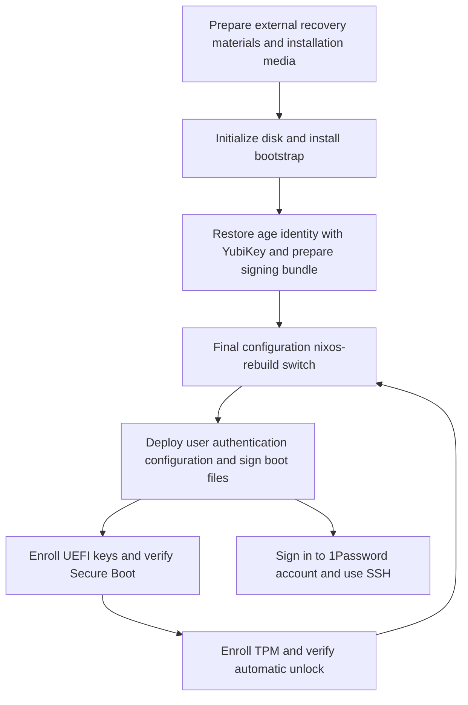
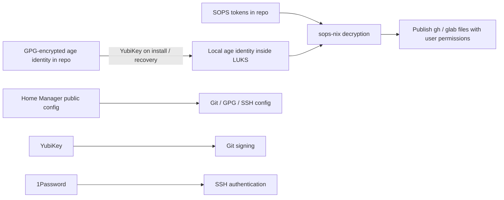

# ThinkPad NixOS declarative environment - Plan

## Goal Capsule

- Objective: Restore required development tools and authentication environments after a fresh installation on this ThinkPad, minimizing environment inconsistencies caused by manual authentication and script failures during repeated applications.
- Means: Build a flake-based NixOS configuration along with installation, provisioning, and recovery guides.
- Product authority: The Product Contract below defines the scope. The initial target is a single ThinkPad X1 Carbon Gen 11 machine; macOS and generic Linux are future scope.
- Open blockers: None blocking requirement decisions. Implementation verification boundaries are addressed in the Verification Contract.

---

## Product Contract

### Summary

Create a repository for a fresh installation of ThinkPad X1 Carbon Gen 11 with NixOS unstable and the default Plasma desktop environment.
Core development tools and authentication settings are applied together via system rebuilds, while initial installation and security key enrollments are provided as separate guides.

### Problem Frame

The existing chezmoi environment executes numerous installation and authentication scripts sequentially.
The user experienced heavy resource usage and inconsistent errors on each application, noting cases where 1Password lockouts or intermediate sudo authentication failures blocked subsequent tasks.
Currently, this repository contains no Nix implementation, and the existing dotfiles include many features not needed for this migration, ranging from Fedora system tuning to AI coding-agent configurations.

### Key Decisions

- **Migrate the core environment for one machine first.** Governs R1, R4. (session-settled: user-directed — chosen over migrating all platforms and existing features: restore only features required on the currently used laptop first.)
- **Preserve the default Plasma desktop.** Governs R2. (session-settled: user-directed — chosen over copying existing desktop customization: existing theming and tuning are not required.)
- **Use the YubiKey only for Git signing and initial installation or recovery.** Governs R6, R10–R12. (session-settled: user-directed — chosen over requiring the card on every rebuild: routine rebuilds do not depend on the card or PIN.)
- **Assume a fresh installation.** Governs R13. (session-settled: user-directed — chosen over preserving the installed OS or data: the user confirmed preserving existing data is not required.)
- **Keep 1Password as the SSH key provider.** Governs R8, R9. (session-settled: user-directed — chosen over moving SSH authentication to YubiKey: maintain existing SSH agent configuration; automatic account login is not required.)
- **Include user authentication setup in rebuilds.** Governs R5, R6. (session-settled: user-directed — chosen over a separate manual user-provisioning stage: system rebuild must handle user provisioning from the installation guide.)

### Requirements

**Platform and applications**

- R1. The target of this implementation is the x86_64 NixOS environment on a ThinkPad X1 Carbon Gen 11.
- R2. Nixpkgs uses `nixos-unstable` pinned with `flake.lock`, and the desktop uses the default NixOS Plasma configuration.
- R3. The hostname is based on the DMI `system-version`, mapping `ThinkPad X1 Carbon Gen 11` on this machine to `ThinkPad-X1-Carbon-Gen-11`.
- R4. Install zsh, Git, Ghostty, Claude Code, Codex, omp, GitHub CLI, GitLab CLI, 1Password desktop app, and Google Chrome.

**Rebuild and authentication**

- R5. In an environment with initial trust established, apply both system and user configurations in one step using `sudo nixos-rebuild switch --flake .#ThinkPad-X1-Carbon-Gen-11`.
- R6. The application process of R5 automatically configures `gh`/`glab` credentials deployment, Git credential helpers, GPG public key and signing setup, and SSH agent socket connection and key selection.
- R7. GitHub and Gist use the `gh` credential helper; GitLab.com and `git.jpi.app` use the `glab` credential helper; Git commits and tags are signed with the existing user identity's GPG key.
- R8. SSH migrates `IdentityAgent ~/.1password/agent.sock` and the 1Password SSH key selection configuration from existing dotfiles.
- R9. Initial 1Password account sign-in and user approval of actual SSH requests are not automated, and R5 is not blocked when the app is locked or unauthenticated.
- R10. Target migration tokens are stored encrypted in the repository. The local decryption key is restored via YubiKey during initial installation or recovery, leaving no plaintext secrets in Git, the Nix store, build outputs, or logs.
- R11. The YubiKey is used solely for Git commit/tag signing and secret recovery during initial installation or recovery. Once the decryption key is restored, R5 operates without requiring a YubiKey, PIN, or login session.
- R12. If the local decryption key or secrets are missing, clearly report required remediation, do not treat authentication provisioning as complete, and allow retrying with the same rebuild command.

**Installation and boot**

- R13. Support a fresh installation that initializes the internal NVMe disk, keeping disk initialization commands separate from routine rebuilds.
- R14. Root and user data are encrypted with LUKS2, unlocked automatically via TPM2 during normal boot, and accessible via recovery passphrase or recovery key.
- R15. Support Secure Boot and automatically perform required boot file signing during system updates after initial key enrollment.
- R16. Ensure original materials required for initial installation, key enrollment, and recovery can be obtained externally before erasing the target disk.

**Operator guide and repeatability**

- R17. The installation guide details installation media and network preparation, target disk verification, LUKS configuration, NixOS installation, Secure Boot key enrollment, and TPM enrollment in sequence.
- R18. The user provisioning guide distinguishes initial trust setup from automatic R5 application, without requiring `gh auth login`, `glab auth login`, or manual GPG import as routine follow-up steps.
- R19. The operations and recovery guide covers updates, rollbacks, TPM unlock failures, lost or replaced YubiKeys, and signing key recovery, providing verification steps for each procedure.
- R20. Repeatedly applying the same declaration does not redundantly repeat authentication registration or installation tasks, avoiding architectures where individual tasks re-prompt for sudo authentication mid-run.
- R21. Allow configuration evaluation and builds without secrets, separating evaluation/build from application stages that actually require credentials.

### Key Flows

- F1. Fresh installation. The user prepares external recovery materials, boots into the installation environment, and executes disk configuration and NixOS installation. Security keys are then enrolled and boot is verified. Covers R13–R17.
- F2. Initial user environment setup. Restore the local decryption key once using the YubiKey, then execute R5. Applications and authentication configurations are deployed together; 1Password account sign-in is performed separately by the user. Covers R5–R11, R18.
- F3. Repeated applies and updates. Modify configuration or encrypted tokens and execute R5. CLI authentication and Git configuration are updated; a 1Password session is not a prerequisite for application. Covers R5–R12, R20, R21.
- F4. Recovery. If automatic disk unlocking fails, boot via recovery methods and restore TPM or signing configuration for the machine. Even if the YubiKey is lost, rebuilds on the existing machine continue to work. During reinstallation, external recovery materials or an alternative recipient are required; if neither exists, reissue tokens and configure a new signing key. Covers R12, R14–R16, R19.

### Acceptance Examples

- AE1. **Covers R2, R4, R5.** Applying R5 on a new system allows running specified applications in default Plasma, with executables ready without migrating agent-specific configurations.
- AE2. **Covers R5–R9.** Even when 1Password is locked or not yet signed in, apply `gh`/`glab` and Git authentication configuration using prepared tokens. SSH connection configuration is present, but actual SSH usage follows 1Password authentication policies.
- AE3. **Covers R6, R7, R10, R11.** After restoring the local decryption key, deploy credentials and signing configuration via R5 without a YubiKey present. Actual Git signing requires the YubiKey.
- AE4. **Covers R10–R12.** If the local decryption key is missing or invalid, R5 reports authentication application failure. Recovering the key and running the same command retries successfully. The absence of a YubiKey or a locked Secret Service does not affect this path.
- AE5. **Covers R10, R20, R21.** Applying the same declaration twice does not redundantly repeat authentication registration, and evaluation/build outputs run without secrets contain no plaintext credentials.
- AE6. **Covers R13, R20.** Routine R5 execution does not repartition, format LUKS, or reset existing security keys.
- AE7. **Covers R14, R15, R19.** In normal reboots after initial enrollment, Secure Boot is enabled and LUKS unlocks automatically. When TPM policies do not match, the system can boot using recovery methods.
- AE8. **Covers R15, R19.** After a kernel update, the new signed configuration boots, and recovery procedures to supported earlier generations can be followed using the guide.
- AE9. **Covers R16–R19.** Even after erasing the existing Fedora environment, the user can proceed through installation and user provisioning using only the repository, recovery materials, and guides.

### Scope Boundaries

- Support for macOS and generic Linux is future work.
- Migration of coding-agent logins, settings, plugins, MCP, and skills is excluded.
- Existing KDE customizations, Fedora-specific system tuning, face/fingerprint authentication, hibernation configuration, source repository gardens, and migration of miscellaneous additional applications are not included.
- Existing secrets or service authentications not specified in R6–R8 are not migrated.
- In accordance with R9, automated 1Password account login is excluded.
- Plan creation and repository implementation do not perform actual disk formatting, UEFI modifications, or system installations.

<!-- ce-section: work-relationships -->
### How This Work Fits Together

This work completes the end-to-end environment from fresh installation to repeatable rebuilds on a single laptop.
The following relationships represent current divisions of future work and are not a finalized roadmap:

- Generic Linux and macOS support can share the user environment established here, but is not a prerequisite for completing this installation.
- Migration of coding-agent configurations is a separate task building on top of the executable installations provided here.

### Hardware Evidence

On 2026-09-21, the current machine was surveyed via read-only inspection, with additional administrative command outputs provided by the user.

| Item | Observed value | Basis for scope |
|---|---|---|
| Model | Lenovo 21HMCTO1WW, ThinkPad X1 Carbon Gen 11 | Target of R1, R3 |
| CPU / RAM | i7-1370P, ~62 GiB indicated available | x86_64, 64 GB installed RAM |
| Storage | 1x KIOXIA 512 GB NVMe, ~476.9 GiB | Fresh installation targets the internal disk |
| Existing filesystems | ESP 600 MiB, ext4 boot 2 GiB, LUKS2 with Btrfs | No requirement to preserve existing layout |
| Boot | UEFI x64, Secure Boot enabled/user, Fedora GRUB / shim | Key enrollment required for new NixOS boot path |
| TPM | TPM 2.0, 2 existing systemd-tpm2 tokens | Both tokens bound to SHA256 PCR 7 |
| Graphics | Intel Iris Xe 8086:a7a0, i915 | Validate configuration against actual hardware ID |
| Wireless / Audio | Intel Wi-Fi, AX211 Bluetooth, Intel SOF audio | Post-installation functional verification targets |
| Sleep | s2idle, current swapfile ~64 GiB | Hibernation support is not assumed |

Although existing LUKS2 has 3 key slots and 2 TPM tokens, there is no basis to duplicate the exact key slot layout for the new installation.
No YubiKey was present in the USB list during observation, so the card model, OpenPGP capabilities, and PIN / touch policies have not been measured on hardware yet.
Working on Fedora does not imply that sleep, Wi-Fi, and audio are validated on NixOS.

### Dependencies and Assumptions

- Initial installation requires network connectivity and package sources. The goal of restoring via repository and YubiKey does not imply offline installation or removal of external SSH key providers.
- Assumes the user can provide the existing Git user identity, valid GitHub and GitLab tokens, the YubiKey to be used, and a 1Password account. Configuration management does not handle token issuance itself.
- Automatic PIN entry for Git signing can use the existing user Secret Service cache. Card touch policy is independent, and neither is a prerequisite for rebuilds.
- R20 does not imply that all NixOS, user file, and external app changes are guaranteed in a single atomic transaction. Failure stages and retry methods must be clear.
- Do not store LUKS recovery material exclusively inside the locked target disk. External recovery preparation in R16 must be completed before disk initialization.

### Sources and Research

The baseline commit for existing dotfiles is `6e14fe842d2257793995cf0a07742ffab2f5368f`.
The file paths below are relative to the repository indicated in each entry.

- Existing `hyperlapse122/dotfiles` `.install-prerequisites.sh:61–138,1368–1393,1511–1552,1713–1794,1852–1935,2143–2147`: real implementations of 1Password pre-authentication, GPG public key/card stubs, and PIN storage. The private-key import comments in `home/.chezmoi.toml.tmpl:12–18` differ from current implementation and are not used as a basis.
- Existing dotfiles `home/dot_config/git/config.tmpl:1–55`: GPG signing and domain-specific `gh`/`glab` helpers.
- Existing dotfiles `home/dot_ssh/.config_linux:1–2`, `home/dot_config/1Password/ssh/agent.toml:1–13`: SSH socket connection and key selection configuration.
- Existing dotfiles `home/.chezmoidata/commands.yaml:32–89`, `home/dot_config/zsh/`, `home/dot_config/ghostty/config.tmpl`: basis for default application selection.
- [NixOS LUKS manual](https://nixos.org/manual/nixos/stable/#sec-luks-file-systems): distinction between encrypted volumes and token enrollment.
- [Lanzaboote setup](https://nix-community.github.io/lanzaboote/getting-started/prepare-your-system.html), [UEFI key enrollment](https://nix-community.github.io/lanzaboote/getting-started/enable-secure-boot.html): Flake integration and initial firmware enrollment procedures.
- [disko](https://github.com/nix-community/disko): candidate for declarative disk partitioning.
- [systemd-cryptenroll](https://github.com/systemd/systemd/blob/main/man/systemd-cryptenroll.xml): basis for TPM, recovery key, and PCR policies.
- [1Password SSH configuration](https://www.1password.dev/ssh/agent/config): key selection file is independent of app sign-in or agent enablement settings.
- [nixos-hardware X1 Carbon Gen 11 module](https://raw.githubusercontent.com/NixOS/nixos-hardware/master/lenovo/thinkpad/x1/11th-gen/default.nix): the module's `i915.force_probe=a7a1` differs from observed GPU `a7a0` and is not copied directly.

## Planning Contract

### Key Technical Decisions

- KTD1. The flake pins nixpkgs unstable, Home Manager, disko, sops-nix, and Lanzaboote. Home Manager integrates as a NixOS module sharing nixpkgs. The hostname is a constant normalized from the observed string and does not read DMI during evaluation. Covers R1–R5, R21.
- KTD2. The disk layout is GPT with a 2 GiB FAT32 ESP, and the remainder in LUKS2 formatted with Btrfs. Subvolumes are root/home/nix/log with zstd compression; swap uses zram. Hibernation and impermanence are not introduced. Only the exact by-id path confirmed during installation is allowed, and formatting is never invoked during rebuilds. Covers R13, R14, R20.
- KTD3. The initial boot `ThinkPad-X1-Carbon-Gen-11-bootstrap` output provides only systemd-boot and public configuration. The final output is verified against Lanzaboote v1.1.0 and does not permit unsigned boot files. Boot signing keys reside in a runtime directory inside LUKS and are never imported into the Nix store. Covers R15–R17, R21.
- KTD4. TPM2 enrollment is performed after final Secure Boot key enrollment and verification of normal boot. The initial implementation uses a SHA256 PCR7 policy and a recovery passphrase. PCR7 protects Secure Boot policy and does not attest the identity of a specific kernel or root filesystem. The compatibility and trust implications of retaining Microsoft certificates are documented in the guide. PCR11 signing policies and pcrlock are future work. Covers R14, R15, R19.
- KTD5. Create a dedicated age identity and encrypt the SOPS token file with its public recipient. The external recovery copy of the identity is encrypted with the YubiKey's OpenPGP encryption recipient and stored in the repository. Initial recovery saves to the in-LUKS runtime path `/var/lib/sops-nix/key.txt` with ownership root:root 0600 and parent directory 0700. Recovery validates the public recipient and installs atomically. Routine rebuilds read only this file. Covers R10–R12, R16. (session-settled: user-directed — chosen over card decryption during every rebuild: YubiKey scope is limited to initial recovery and Git signing.)
- KTD6. Use sops-nix NixOS systemd activation. Disable automatic SSH key scanning and age key generation, specifying only the recovered identity. Verify `RemainAfterExit=false` on the existing `sops-install-secrets` oneshot alongside a synchronous `ExecStartPost` publishing step. The goal is to ensure decryption, file recovery, and failure retries execute even when reapplying the same generation. This lifecycle choice is an inference based on source code and will only be adopted after passing U5 VM verification. Covers R5, R6, R12, R20.
- KTD7. Generate gh/glab files from SOPS templates but deploy them as user-owned writable regular files. The publishing helper drops privileges to h82 before opening the home directory, validates 0600 temporary files, and performs per-file atomic renames. Simultaneous transactions across both files are not guaranteed. On failure, report application failure and recover by re-running. Validate token format and serialization used in template substitution. Covers R6, R7, R10, R12.
- KTD8. GPG uses a single user agent alongside existing PC/SC and PIN wrappers. Public keys and signing configurations are deployed without requiring the card; card stub learning occurs during initial card use or bootstrap. PIN caching remains exclusively in the user Secret Service, separated from root provisioning. SSH migrates existing 1Password socket and key selection files. Covers R6–R9, R11.

### High-Level Technical Design

The diagram below illustrates data flow and the initial installation sequence for KTD5–KTD8. Detailed partitioning across implementation files may be adjusted based on verification results for each unit.

#### Data Flow and Ownership

The repository owns authentication-related contents of gh hosts and glab config; manual changes to these files are overwritten by the next successful rebuild. Usernames and protocols are managed via public declarations. GitHub/Gist uses the gh helper, while GitLab.com/git.jpi.app uses the respective host-specific glab helper. Online token verification or CLI login commands are not included in activation. Successful local deployment is distinct from token validity on remote services.

Actual tokens, the age identity, PINs, and Secure Boot private keys are never read as evaluation or build inputs. Plaintext tokens exist only in runtime files and are never recorded in logs, command arguments, or test fixtures. Tests use fake credentials. The bootstrap encrypted file contains a private key, but only ciphertext is stored in Git.

User h82's account, groups, and shell are declared. The initial local login password is set separately during installation so that the system can be recovered via console and sudo even if secret recovery fails. 1Password account sign-in and in-app SSH agent enablement are one-time user steps described in the guide.

#### Installation Sequence

1. Before erasing Fedora, verify the public GPG key, the physical card's signing and encryption functions, encrypted tokens, and bootstrap identity recovery. The repository and recovery material must be retrievable via public HTTPS or separate media.
2. Prepare a recovery passphrase and verify the disk's model, size, and by-id path from the installation media. If necessary, temporarily disable Secure Boot and run disko explicitly.
3. Install the bootstrap output and set the local user password. Boot for the first time using the LUKS passphrase.
4. Recover the age identity with the YubiKey and generate or restore the Secure Boot signing bundle. Rebuilding to the final output deploys user authentication configuration and signs boot files.
5. Verify signing results and enroll required certificates in UEFI Setup Mode. Do not carelessly delete dbx. Confirm that the final NixOS boots with Secure Boot enabled.
6. In the final booted state, enroll TPM2 while preserving the recovery passphrase slot. Verify automatic unlocking and passphrase booting individually, and preserve encrypted external backups of the modified LUKS header and signing bundle.

Key generation, UEFI enrollment, TPM enrollment, and disk formatting are explicit initial operations. They are not hidden inside rebuilds. User authentication file deployment is included in R5 and not relegated to a separate CLI login step.

### Risks and Evidence Boundaries

- The YubiKey's actual encryption subkey and touch policy remain unverified on hardware. U4 documents public information verification and recovery testing as mandatory pre-installation prerequisites. If the sole card is lost with no other recovery materials, recovery from ciphertext alone is impossible.
- The local age key is readable by root once LUKS is unlocked. This is an intentional trust boundary for rebuild convenience. If leaked, changing the age recipient and re-encrypting tokens does not revoke already-exposed service tokens.
- The fact that Secure Boot currently works via Fedora's shim does not mean the new NixOS boot path is automatically trusted. Changes to firmware/db/dbx can cause TPM unlocking to fail, requiring the recovery passphrase.
- NixOS switch does not transactionally roll back all system and user changes. Do not hide authentication deployment failures; report the point of failure and guide retries with the same command.
- Actual hardware boot, sleep, wireless, and audio must be validated separately from VM tests. Do not blindly copy other GPU force_probe parameters from nixos-hardware.

## Implementation Units

### U1. Flake and host foundation

- Goal: Create a single host evaluable and buildable without secrets.
- Requirements: R1–R5, R21; AE1, AE5; KTD1.
- Files: `flake.nix`, `flake.lock`, `hosts/ThinkPad-X1-Carbon-Gen-11/default.nix`, `hosts/ThinkPad-X1-Carbon-Gen-11/hardware.nix`, `modules/nixos/base.nix`, `.gitignore`.
- Approach: Configure minimal flake outputs and explicit unfree allowances. Declare user account h82, Home Manager integration, and necessary baselines for Intel graphics, wireless, and SOF audio. Avoid overlapping ownership between machine-generated hardware configurations and declared disko filesystems.
- Test Scenarios: Evaluate bootstrap/final without external secrets; normalize hostname; prevent injection of specific GPU forced parameters.
- Verification: V1, V2. Depends on: None.

### U2. Disk and boot configuration

- Goal: Separate initial installation from subsequent signed update paths.
- Requirements: R13–R17, R19–R21; F1, F4; AE6–AE9; KTD2–KTD4.
- Files: `hosts/ThinkPad-X1-Carbon-Gen-11/disko.nix`, `modules/nixos/boot.nix`, `modules/nixos/bootstrap.nix`, `tests/boot-layout.nix`.
- Approach: Provide bootstrap/final outputs and declare initrd systemd and TPM crypttab options. Restrict ESP file permissions and initialize boot generation limits to 5. Maintain a structure where routine switch invocations carry no formatting or enrollment side effects.
- Test Scenarios: Temporary VM disk installation and LUKS passphrase boot; build bootstrap without private keys or tokens; ensure final does not mask missing signing bundles as successes.
- Verification: V1–V3, physical boot is V5. Depends on: U1.

### U3. Plasma and user tools

- Goal: Prepare the default desktop and core development tools.
- Requirements: R2, R4–R9; F2; AE1, AE2; KTD1, KTD8.
- Files: `modules/nixos/desktop.nix`, `home/h82/default.nix`, `home/h82/shell.nix`, `home/h82/git.nix`, `home/h82/ssh.nix`, `home/h82/terminal.nix`, `config/1password/agent.toml`.
- Approach: Configure the NixOS 1Password GUI module and polkit policies. Migrate only basic completion/history and core plugins for zsh. Do not add Ghostty theming or agent configurations. Verify packages containing the code-mode helper matched to Codex version, ensuring internal updaters do not overwrite declared versions.
- Test Scenarios: Specified executables present; host-specific reset for helpers; identical SSH socket and key selection configurations; successful application of public configurations with 1Password locked.
- Verification: V1, V2, V4. Depends on: U1.

### U4. Initial secret recovery and GPG signing

- Goal: Provide initial recovery and signing paths that require the card.
- Requirements: R6, R7, R10, R11, R16, R18, R19; F2, F4; AE3, AE9; KTD5, KTD8.
- Files: `.sops.yaml`, `secrets/README.md`, `secrets/bootstrap/`, `keys/`, `home/h82/gpg.nix`, `scripts/restore-age-identity`, `scripts/pinentry-card`, `tests/pinentry-card.sh`.
- Approach: Declare only public recipients and fingerprints. Minimally migrate the PIN proxy from original dotfiles while maintaining actual GnuPG protocol fixtures and retry protection. The recovery helper validates and installs results under a single explicit privilege elevation without calling intermediate sudo. When users prepare actual secrets, add only ciphertext.
- Test Scenarios: Invalid recipients or corrupted ciphertext do not overwrite existing identities; PIN errors and low retry limits abort automatic repeats; card absence does not affect routine public configuration applies.
- Verification: V1, V4; actual card recovery and signing is V5. Depends on: U1, U3.

### U5. Rebuild-integrated token deployment

- Goal: Deploy authentication files without the card or user sessions, allowing failed attempts to be retried.
- Requirements: R5–R7, R10–R12, R20, R21; F2, F3; AE2–AE5; KTD5–KTD7.
- Files: `modules/nixos/secrets.nix`, `scripts/publish-cli-auth`, `secrets/tokens.yaml`, `tests/auth-provisioning.nix`, `tests/fixtures/`.
- Approach: Generate gh current multi-account schema and glab host-specific schemas. Disable glab keyring usage. Order execution after system users, local filesystems, and home mounts, without waiting for Home Manager services or graphical sessions. Validate syntax of both files prior to publishing. Missing actual ciphertext is permitted only in bootstrap; do not treat final authentication configuration as having succeeded.
- Test Scenarios: First boot without login session, YubiKey, or 1Password; consecutive applies of the same generation; restoration after file deletion; missing or corrupted age key failure with retry in the same generation after recovery; sanitized error reporting on invalid templates without secret leakage; prevention of root writes via user home symlinks.
- Verification: V1–V4. Lifecycle inference of KTD6 is validated via VM or replaced with a simpler mechanism fulfilling the same contract. Depends on: U1, U3, U4.

### U6. Installation, operations, and recovery guides

- Goal: Continue installation using guides and recovery materials even after erasing the existing OS.
- Requirements: R13–R21; F1–F4; KTD2–KTD8.
- Files: `README.md`, `docs/install.md`, `docs/provisioning.md`, `docs/recovery.md`, `docs/verification.md`.
- Approach: Author the Installation Sequence as executable procedures. For each command, specify execution environment, target mounts, required privileges, and success criteria. Cover token rotation, local age key replacement, LUKS recovery, lost signing bundles, lost cards, and boot generation rollbacks. Distinguish manual 1Password login and agent activation from rebuild completion.
- Test Scenarios: No circular dependencies on prerequisite materials from a blank disk; cloning the repository does not require an unconfigured SSH agent; recovery materials do not exist solely on the locked disk; documentation reviews without system changes and VM installation drills.
- Verification: V3, V5 procedures completed; honestly record whether actual hardware checks were performed. Depends on: U2–U5.

## Verification Contract

Currently the repository has no verification commands. The implementation provides the following flake checks, and does not claim that builds, VMs, or actual installations have been executed at this plan authoring stage.

- V1. Evaluate entirely with `nix flake check --no-build`, then run implemented checks with `nix flake check`. Specify a formatter supporting `nix fmt -- --check` or provide the exact check command for that formatter in the README.
- V2. Build `config.system.build.toplevel` for both host outputs with `nix build --no-link`. Verify that secret files are not read during evaluation, and only public configurations and fake fixtures enter the store. Never pass real tokens or keys as search arguments.
- V3. `nix build .#checks.x86_64-linux.auth-provisioning` and `nix build .#checks.x86_64-linux.boot-layout`. Root privileges and disk operations are performed solely on temporary VM disks. Specifically verify service reactivation and failure exit statuses on same-generation reapplies.
- V4. Wire PIN proxy protocol regression tests and gh/glab file parser validations into flake checks. Never run actual external API authentication during activation or CI.
- V5. A human operator verifies actual YubiKey recovery before installation, and verifies Secure Boot state, TPM automatic unlock, recovery passphrase, new generation and rollback, Plasma, Wi-Fi, Bluetooth, audio, s2idle sleep/wake, Git signing, per-host CLI authentication, and 1Password SSH after installation. Data erasure and UEFI changes require explicit, separate operator instructions when executed.

## Definition of Done

- Files and documentation for U1–U6 are implemented, and R1–R21 can be traced across check and guide items.
- Pass V1–V4, with failure retries and rebuilds without a YubiKey demonstrated in VMs. Successful builds alone must not be reported as successful installations.
- If real ciphertext and physical cards have not yet been provided, explicitly state the inputs required for preparation and do not report user authentication recovery as complete.
- V5 represents criteria for completion of physical machine migration. Clearly mark hardware items not yet executed when handing over repository implementation.
- Remove experimental scratch code, duplicate agents, special targets, and plaintext fixtures, and verify that diffs contain no secrets.

## Appendix

### Implementation Sources

- [sops-nix NixOS module](https://github.com/Mic92/sops-nix/blob/master/modules/sops/default.nix), [templates](https://github.com/Mic92/sops-nix/blob/master/modules/sops/templates/default.nix), [secret installer](https://github.com/Mic92/sops-nix/blob/master/pkgs/sops-install-secrets/main.go): KTD5–KTD7. Re-verify options and lifecycles against the source pinned in lock file during implementation.
- [NixOS switch implementation](https://github.com/NixOS/nixpkgs/blob/master/pkgs/by-name/sw/switch-to-configuration-ng/src/main.rs): basis for sysinit-reactivation and failure reporting. V3 determines actual behavior of KTD6.
- [Home Manager NixOS integration](https://github.com/nix-community/home-manager/blob/master/nixos/default.nix): deploy public configuration without user sessions.
- [Lanzaboote v1.1.0](https://github.com/nix-community/lanzaboote/blob/v1.1.0/nix/modules/lanzaboote.nix): KTD3. Do not confuse pcrlock for measured boot with PCR11 signing policies.
- [GitHub CLI config](https://github.com/cli/cli/blob/trunk/internal/config/config.go), [GitLab CLI config](https://docs.gitlab.com/cli/config/): file schemas for KTD7.
- Existing dotfiles `docs/solutions/test-failures/self-written-stubs-certify-gnupg-formats-that-never-occur.md`: validation of actual Assuan/GnuPG formats and card identifiers for the PIN proxy.
- Existing dotfiles `docs/solutions/integration-issues/fedora-mok-import-sudo-prompt-inside-expect-pty.md`: avoid sudo re-authentication inside PTYs and consolidate privilege boundaries at entrypoints.
