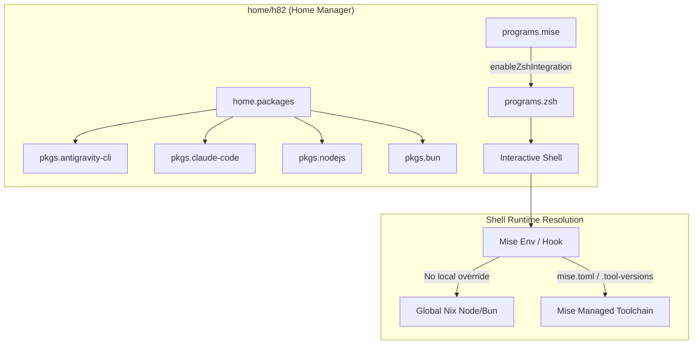

## Goal Capsule

- **Objective:** User `h82` has coding agents (`claude-code`, `antigravity-cli`) and modern JavaScript/TypeScript runtimes (`nodejs`, `bun`) readily available across interactive shells, backed by `mise` for per-project runtime version overrides.
- **Means:** Declare `antigravity-cli`, `nodejs`, and `bun` alongside existing `claude-code` in Home Manager packages, and enable `programs.mise` with Zsh shell integration (KTD1, KTD2).
- **Product Authority:** User `h82` on ThinkPad X1 Carbon Gen 11. System configuration outside user tools and desktop shell customization are non-goals.
- **Open Blockers:** None.

---

## Product Contract

*Product Contract preservation: Product Contract unchanged.*

### Summary

Add `antigravity-cli`, `nodejs`, and `bun` to Home Manager for user `h82` alongside the existing `claude-code` package, and enable `programs.mise` with automatic Zsh shell activation for project-level runtime version management.

### Problem Frame

The developer environment on the ThinkPad X1 Carbon currently packages system infrastructure tools (`git`, `age`, `sops`) and a subset of CLI utilities (`claude-code`, `codex`, `gh`, `glab`) in Home Manager. Daily development workflows require modern JavaScript runtimes (`node`, `bun`), the Google Antigravity agent CLI (`antigravity-cli`), and a runtime manager (`mise`) to support disparate project toolchain requirements without manual or unmanaged binary installations.

### Key Decisions

- **Install Node.js and Bun as declarative Nix packages** (session-settled: user-directed — chosen over dynamic mise management and declarative globalConfig in mise: provides reliable, reproducible baseline CLI runtimes out-of-the-box in Nix while preserving mise's flexibility for project-specific overrides). Governs R3, R4, R5.
- **Manage developer tooling exclusively in Home Manager.** Keeps `modules/nixos/base.nix` focused on OS, hardware, and system security while isolating developer runtimes to user `h82`. Governs R1, R2, R3, R4, R5.
- **Enable automated Zsh shell activation for Mise.** Uses Home Manager's built-in `programs.mise.enable = true` to register shell activation and environment hooks into `programs.zsh`. Governs R5, R6.

### Requirements

**Coding Agents**

- R1. User `h82` has `antigravity-cli` available on PATH from Home Manager packages.
- R2. User `h82` retains `claude-code` availability on PATH from Home Manager packages.

**Language Runtimes**

- R3. User `h82` has Node.js (`pkgs.nodejs`) available globally on PATH via Home Manager.
- R4. User `h82` has Bun (`pkgs.bun`) available globally on PATH via Home Manager.

**Toolchain & Version Management**

- R5. User `h82` has `mise` enabled via Home Manager with automatic Zsh shell integration.
- R6. Project-level version configuration files (`.tool-versions` or `mise.toml`) take precedence in subdirectories without conflicting with global Nix-installed runtimes.

### Acceptance Examples

- AE1. Coding agent execution
  - **Covers R1, R2.**
  - **Given:** An interactive Zsh shell session for user `h82`.
  - **When:** `antigravity --version` and `claude --version` are executed.
  - **Then:** Both tools execute successfully and output their version strings without auto-updater warnings.

- AE2. Baseline runtime execution
  - **Covers R3, R4.**
  - **Given:** A working directory containing no mise tool configuration.
  - **When:** `node -v` and `bun -v` are executed.
  - **Then:** The system executes the Nix store-provided Node.js and Bun binaries.

- AE3. Per-project runtime override
  - **Covers R5, R6.**
  - **Given:** A project directory containing a `.tool-versions` or `mise.toml` specifying an overridden runtime version.
  - **When:** The user enters the directory and runs the overridden tool.
  - **Then:** Mise hooks resolve the project-specified runtime instead of the baseline Nix store binary.

### Scope Boundaries

- **Declarative global tool pinning in `programs.mise.globalConfig`:** Out of scope; project-level toolchains manage versions per-repo.
- **System-wide package declarations in `modules/nixos/base.nix`:** Out of scope; developer toolchains remain isolated to user Home Manager.
- **Desktop, editor, or IDE extensions:** Out of scope; limited to CLI tooling and shell activation.

### Sources / Research

- `home/h82/default.nix:17-24`: Existing `home.packages` definition with `claude-code`, `codex`, `gh`.
- `home/h82/shell.nix:3-22`: Existing `programs.zsh` configuration.
- Nixpkgs unstable: Verified availability of `pkgs.antigravity-cli`, `pkgs.mise`, `pkgs.nodejs`, `pkgs.bun`.

---

## Planning Contract

### Key Technical Decisions

- KTD1. Declare `antigravity-cli`, `nodejs`, and `bun` in `home.packages` in `home/h82/default.nix`. Preserves the alphabetical package list and user-level scope. Governs R1, R2, R3, R4.
- KTD2. Enable `programs.mise = { enable = true; enableZshIntegration = true; };` within `home/h82/shell.nix`. Home Manager natively injects `eval "$(mise activate zsh)"` into Zsh initialization, activating shims and environment variables cleanly. Governs R5, R6.

### High-Level Technical Design



### Assumptions & Constraints

- `pkgs.antigravity-cli`, `pkgs.mise`, `pkgs.nodejs`, and `pkgs.bun` exist in `nixos-unstable` and build on `x86_64-linux`.
- Existing `home.sessionVariables.DISABLE_AUTOUPDATER = "1"` in `home/h82/default.nix` remains active to prevent coding agent self-update attempts on read-only Nix store binaries.
- NixOS base configuration (`modules/nixos/base.nix`) remains untouched, preserving the system vs user package separation.

---

## Implementation Units

### U1. Add `antigravity-cli`, `nodejs`, and `bun` to Home Manager packages

- **Goal:** Declare `antigravity-cli`, `nodejs`, and `bun` in `home.packages` for user `h82`.
- **Requirements:** R1, R2, R3, R4.
- **Files:** `home/h82/default.nix`.
- **Approach:** Add `antigravity-cli`, `nodejs`, and `bun` in alphabetical order to `home.packages` in `home/h82/default.nix`. Ensure `claude-code` remains in the list.
- **Test Scenarios:**
  - Evaluate `nixosConfigurations.ThinkPad-X1-Carbon-Gen-11.config.home-manager.users.h82.home.packages` and assert `antigravity-cli`, `bun`, `nodejs`, and `claude-code` are present in the list.
- **Verification:**

  ```sh
  nix eval --raw .#nixosConfigurations.ThinkPad-X1-Carbon-Gen-11.config.home-manager.users.h82.home.packages
  ```

### U2. Enable `programs.mise` with Zsh integration

- **Goal:** Enable `programs.mise` with automatic Zsh shell integration in Home Manager.
- **Requirements:** R5, R6.
- **Files:** `home/h82/shell.nix`.
- **Approach:** Add `programs.mise = { enable = true; enableZshIntegration = true; };` to `home/h82/shell.nix`.
- **Test Scenarios:**
  - Evaluate `nixosConfigurations.ThinkPad-X1-Carbon-Gen-11.config.home-manager.users.h82.programs.mise.enable` and assert `true`.
  - Evaluate `nixosConfigurations.ThinkPad-X1-Carbon-Gen-11.config.home-manager.users.h82.programs.mise.enableZshIntegration` and assert `true`.
- **Verification:**

  ```sh
  nix eval .#nixosConfigurations.ThinkPad-X1-Carbon-Gen-11.config.home-manager.users.h82.programs.mise.enable
  ```

### U3. Format, check, and build NixOS configurations

- **Goal:** Validate formatting with `nix fmt`, verify flake checks, and build both production and bootstrap toplevel configurations.
- **Requirements:** R1, R2, R3, R4, R5, R6.
- **Files:** All modified files.
- **Approach:** Run `nix fmt` to ensure compliance with tree formatting rules, run `nix flake check`, and execute both system toplevel builds without links.
- **Test Scenarios:**
  - `nix fmt -- --ci` succeeds with exit 0.
  - `nix flake check` succeeds with exit 0.
  - Both `nixosConfigurations` build cleanly.
- **Verification:**

  ```sh
  nix fmt -- --ci
  nix flake check
  nix build --no-link .#nixosConfigurations.ThinkPad-X1-Carbon-Gen-11.config.system.build.toplevel
  nix build --no-link .#nixosConfigurations.ThinkPad-X1-Carbon-Gen-11-bootstrap.config.system.build.toplevel
  ```

---

## Verification Contract

| Phase | Target | Command | Success Signal |
| --- | --- | --- | --- |
| Evaluation | Nix package presence | `nix eval .#nixosConfigurations.ThinkPad-X1-Carbon-Gen-11.config.home-manager.users.h82.programs.mise.enable` | Output is `true` |
| Formatting | Nix formatting | `nix fmt -- --ci` | Zero diff, exit 0 |
| Checks | Flake checks | `nix flake check` | All tests pass, exit 0 |
| Production Build | Toplevel build | `nix build --no-link .#nixosConfigurations.ThinkPad-X1-Carbon-Gen-11.config.system.build.toplevel` | Build completes, exit 0 |
| Bootstrap Build | Toplevel build | `nix build --no-link .#nixosConfigurations.ThinkPad-X1-Carbon-Gen-11-bootstrap.config.system.build.toplevel` | Build completes, exit 0 |

---

## Definition of Done

- All requirements R1–R6 are met.
- `antigravity-cli`, `claude-code`, `nodejs`, `bun` are defined in `home/h82/default.nix`.
- `programs.mise` is enabled with Zsh integration in `home/h82/shell.nix`.
- `nix fmt -- --ci` passes cleanly.
- `nix flake check` passes cleanly.
- Both `nixosConfigurations.ThinkPad-X1-Carbon-Gen-11` and `nixosConfigurations.ThinkPad-X1-Carbon-Gen-11-bootstrap` build to completion.
- No abandoned or experimental code remains in the diff.
