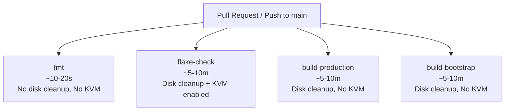

# Split Nix CI Checks into Parallel Jobs - Plan

## Goal Capsule

- **Objective:** Developer pull requests receive quick formatting feedback within seconds, and test evaluations and host builds complete in parallel without serial queueing.
- **Means:** Decompose `.github/workflows/check.yml` into four discrete parallel jobs with isolated resource prerequisites (KTD1).
- **Product Authority:** Pull request validation and check status reporting in `.github/workflows/check.yml`.
- **Open Blockers:** None.

---

## Product Contract

Product Contract unchanged.

### Summary

Refactor `.github/workflows/check.yml` from a single sequential CI job into four independent parallel jobs: `fmt`, `flake-check`, `build-production`, and `build-bootstrap`. Each job provisions only the disk space, Nix features, and permissions it requires, allowing lightweight formatting checks to finish in seconds and host builds to run concurrently.

### Problem Frame

Currently, `.github/workflows/check.yml` executes `nix fmt`, `nix flake check`, and `nix build` sequentially in a single `check` job. Formatting errors or simple syntax issues are only discovered after waiting for closure downloads, runner disk cleanup, or VM test executions, resulting in turnaround times of 10–15+ minutes. If one check fails late, earlier checks must be re-run on subsequent commits, obscuring fast-fail signals and wasting runner capacity.

### Key Decisions

- **KD1. Explicit discrete jobs over matrix builds**: Decompose the workflow into four explicitly named top-level jobs (`fmt`, `flake-check`, `build-production`, `build-bootstrap`) (session-settled: user-directed — chosen over matrix builds and an all-checks aggregator: provides clear, individually named PR status checks without matrix abstraction). Governs R1, R2, R3, R4, R5.
- **KD2. Targeted prerequisite isolation per job**: Gate runner disk cleanup (`sudo rm -rf ...`) to jobs that download and build substantial closures (`flake-check`, `build-production`, `build-bootstrap`), and gate KVM enablement (`sudo chmod 666 /dev/kvm`) and KVM Nix system-features exclusively to `flake-check`. Governs R2, R3, R4.
- **KD3. Workflow-level concurrency cancellation**: Cancel superseded runs on pull requests automatically when newer commits are pushed (`concurrency: cancel-in-progress: true`), preventing redundant runner consumption. Governs R6.

### Requirements

**Job Decomposition & Execution**

- R1. `.github/workflows/check.yml` runs four independent, parallel jobs on `ubuntu-24.04`: `fmt`, `flake-check`, `build-production`, and `build-bootstrap`.
- R2. The `fmt` job runs `nix fmt -- --ci` with minimal runner setup (checkout and Nix installation only), completing in seconds without running disk cleanup or configuring `/dev/kvm`.
- R3. The `flake-check` job runs `nix flake check --print-build-logs` with disk cleanup, KVM permissions (`sudo chmod 666 /dev/kvm`), and Nix system-features configured for `nixos-test benchmark big-parallel kvm`.
- R4. The `build-production` and `build-bootstrap` jobs build their respective host toplevels (`.#nixosConfigurations.ThinkPad-X1-Carbon-Gen-11.config.system.build.toplevel` and `.#nixosConfigurations.ThinkPad-X1-Carbon-Gen-11-bootstrap.config.system.build.toplevel`) with disk cleanup and Nix system-features configured for `big-parallel benchmark` without requiring KVM permissions.
- R5. Each job reports its own distinct check status on GitHub pull requests and branch pushes to `main`.

**Runner Efficiency & Concurrency**

- R6. The workflow configures concurrency grouping keyed by workflow and ref (`${{ github.workflow }}-${{ github.ref }}`) with `cancel-in-progress: true` so stale in-flight runs are cancelled when new commits are pushed.
- R7. The `fmt` job enforces a 10-minute timeout, while `flake-check`, `build-production`, and `build-bootstrap` retain a 60-minute timeout.

### Acceptance Examples

- AE1. Formatting failure fast-fail
  - **Trigger:** A PR is opened with a formatting violation in a `.nix` file.
  - **Covers:** R1, R2, R5
  - **Expected:** The `fmt` job fails within ~30–60 seconds, marking the `fmt` check as failed, while `flake-check` and build jobs proceed independently without waiting on or being blocked by `fmt`.
- AE2. Hardware virtualization isolation
  - **Trigger:** `fmt`, `build-production`, and `build-bootstrap` execute on standard GitHub runners.
  - **Covers:** R2, R4
  - **Expected:** None of these three jobs attempt `sudo chmod 666 /dev/kvm` or declare `kvm`/`nixos-test` system-features; only `flake-check` requests KVM access.
- AE3. Concurrency cancellation
  - **Trigger:** A developer pushes a new commit to a PR while previous CI jobs are still in-flight.
  - **Covers:** R6
  - **Expected:** Active jobs from the previous commit are cancelled immediately and replaced by jobs for the new commit.

### Scope Boundaries

- External binary cache infrastructure (such as Magic Nix Cache or Cachix auth tokens) is out of scope and deferred.
- A consolidated status aggregator job (`ci-passed` or `all-checks`) is out of scope per user direction.
- Modifying flake check derivations, NixOS VM tests, or host configuration modules is out of scope.

### Sources / Research

- `.github/workflows/check.yml`: baseline monolithic sequential CI definition.
- `flake.nix`: definitions for checks (`pinentry-card`, `restore-age-identity`, `boot-layout`, `auth-provisioning`, `publish-cli-auth`), hosts (`ThinkPad-X1-Carbon-Gen-11`, `ThinkPad-X1-Carbon-Gen-11-bootstrap`), and formatter (`pkgs.nixfmt-tree`).
- `AGENTS.md`: verification commands and host configuration build targets.

---

## Planning Contract

### Key Technical Decisions

- KTD1. Isolated step composition per job: Rather than sharing a monolithic setup script or composite action, declare independent steps tailored to each job (`fmt` runs minimal steps; `flake-check` runs full disk cleanup + KVM setup; `build-*` run disk cleanup + standard Nix build) to eliminate unnecessary overhead and maintain readable YAML. (session-settled: user-directed — chosen over matrix builds and an all-checks aggregator: provides clear, individually named PR status checks without matrix abstraction). Governs R1, R2, R3, R4, R5.
- KTD2. Concurrency group naming and behavior: Set `concurrency: group: ${{ github.workflow }}-${{ github.ref }}, cancel-in-progress: true` at workflow level. For pull requests, this cancels superseded commits automatically; for pushes to `main`, each push runs through unless superseded by a rapid push on the same branch. Governs R6.
- KTD3. Timeout and Nix system-features tuning: Assign `timeout-minutes: 10` to `fmt` and `timeout-minutes: 60` to `flake-check`, `build-production`, and `build-bootstrap`. For `fmt`, configure `extra_nix_config` without KVM features; for `flake-check`, configure `system-features = nixos-test benchmark big-parallel kvm`; for builds, configure `system-features = big-parallel benchmark`. Governs R2, R3, R4, R7.

### High-Level Technical Design

### Assumptions

- NixOS toplevel configuration builds (`.#nixosConfigurations.*.config.system.build.toplevel`) do not require `/dev/kvm` hardware virtualization access, as they compile packages and generate boot closures without launching QEMU virtual machines.
- Standard GitHub Actions `ubuntu-24.04` runners have sufficient disk space for `fmt` without running `rm -rf /usr/local/lib/android ...`.

---

## Implementation Units

### U1. Decompose check.yml into parallel jobs and configure concurrency

- **Goal:** Replace sequential steps in `.github/workflows/check.yml` with four discrete parallel jobs (`fmt`, `flake-check`, `build-production`, `build-bootstrap`) with resource gating and concurrency cancellation.
- **Requirements:** R1, R2, R3, R4, R5, R6, R7
- **Dependencies:** None
- **Files:** `.github/workflows/check.yml`
- **Approach:**
  1. Add `concurrency` block under `on:` with `group: ${{ github.workflow }}-${{ github.ref }}` and `cancel-in-progress: true`.
  2. Rewrite `jobs:` to define `fmt`: runs on `ubuntu-24.04`, `timeout-minutes: 10`, checkouts code, installs nix via `cachix/install-nix-action` (without kvm system-features), and runs `nix fmt -- --ci`.
  3. Define `flake-check`: runs on `ubuntu-24.04`, `timeout-minutes: 60`, checkouts code, runs disk cleanup (`sudo rm -rf /usr/local/lib/android /usr/share/dotnet /opt/ghc`), installs nix with `system-features = nixos-test benchmark big-parallel kvm`, sets `sudo chmod 666 /dev/kvm`, and runs `nix flake check --print-build-logs`.
  4. Define `build-production`: runs on `ubuntu-24.04`, `timeout-minutes: 60`, checkouts code, runs disk cleanup, installs nix with `system-features = big-parallel benchmark`, and runs `nix build --no-link .#nixosConfigurations.ThinkPad-X1-Carbon-Gen-11.config.system.build.toplevel`.
  5. Define `build-bootstrap`: runs on `ubuntu-24.04`, `timeout-minutes: 60`, checkouts code, runs disk cleanup, installs nix with `system-features = big-parallel benchmark`, and runs `nix build --no-link .#nixosConfigurations.ThinkPad-X1-Carbon-Gen-11-bootstrap.config.system.build.toplevel`.
- **Patterns to follow:** Existing `.github/workflows/check.yml` actions and commit SHAs (`actions/checkout@fbc6f3992d24b796d5a048ff273f7fcc4a7b6c09`, `cachix/install-nix-action@13d8dd58da0234aa297dedd986986ccb8e7f3e24`).
- **Test scenarios:**
  - Covers AE1. Verify `fmt` job configuration: `fmt` step runs `nix fmt -- --ci`, does not depend on other jobs, has `timeout-minutes: 10`, and does not include disk cleanup or `/dev/kvm` commands.
  - Covers AE2. Verify virtualization isolation: only `flake-check` includes `chmod 666 /dev/kvm` and `kvm` in `system-features`. Neither `build-production` nor `build-bootstrap` contains `/dev/kvm`.
  - Covers AE3. Verify concurrency: top-level `concurrency` specifies `cancel-in-progress: true` keyed by `${{ github.workflow }}-${{ github.ref }}`.
- **Verification:** Validate `.github/workflows/check.yml` syntax with YAML parser and verify that formatting passes locally (`nix fmt -- --ci`).

---

## Verification Contract

| Command | Purpose | Expected Outcome |
| --- | --- | --- |
| `nix fmt -- --ci` | Local formatting check | Exits 0 with no formatting diffs |
| `python3 -c "import yaml; yaml.safe_load(open('.github/workflows/check.yml'))"` | YAML syntax validation | Exits 0, valid YAML structure |
| `nix flake check` | Local checks and VM tests | Passes all declared checks |
| `nix build --no-link .#nixosConfigurations.ThinkPad-X1-Carbon-Gen-11.config.system.build.toplevel` | Production build | Builds successfully |
| `nix build --no-link .#nixosConfigurations.ThinkPad-X1-Carbon-Gen-11-bootstrap.config.system.build.toplevel` | Bootstrap build | Builds successfully |

---

## Definition of Done

- `.github/workflows/check.yml` contains four independent parallel jobs: `fmt`, `flake-check`, `build-production`, `build-bootstrap`.
- Workflow concurrency is enabled with `cancel-in-progress: true`.
- Only `flake-check` runs `chmod 666 /dev/kvm` and requests KVM Nix features.
- `fmt` does not run closure disk cleanup and has a 10-minute timeout.
- All YAML is syntactically valid and matches project conventions.
- Git working tree is clean with all changes committed.
