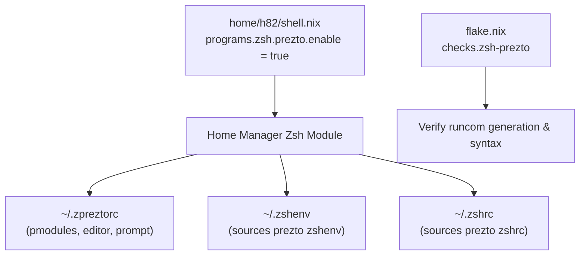

# Add Prezto Zsh Framework to User Environment - Plan

## Goal Capsule

- **Objective:** Enable and integrate the Prezto Zsh configuration framework (`sorin-ionescu/prezto`) into the user's interactive shell environment declaratively through Home Manager.
- **Means:** Configure `programs.zsh.prezto.enable = true;` in `home/h82/shell.nix` and add an automated verification check to `flake.nix`.
- **Product Authority:** Home Manager Zsh configuration in `home/h82/shell.nix` and flake checks in `flake.nix`.
- **Open Blockers:** None.

---

## Product Contract

### Summary

Integrate the Prezto Zsh framework (`https://github.com/sorin-ionescu/prezto`) into the declarative user environment on NixOS for user `h82`. Home Manager provides native support via `programs.zsh.prezto` using nixpkgs package `pkgs.zsh-prezto`. Enabling this module provisions Prezto's runcoms (`.zpreztorc`, `.zshenv`, `.zprofile`, `.zlogin`, `.zlogout`, and `.zshrc` integration) while preserving user-defined history, fpath completions, syntax highlighting, autosuggestions, and mise tool integrations.

### Problem Frame

The user requested adding Prezto (`https://github.com/sorin-ionescu/prezto`) to Zsh. Currently, `home/h82/shell.nix` configures basic Zsh options (history, autosuggestions, syntax highlighting, mise integration, custom site-functions fpath), but lacks Prezto's curated environment settings, directory aliases, editor keybindings, and prompt themes.

### Key Decisions

- **KD1. Use Home Manager's native `programs.zsh.prezto` module**: Enable Prezto declaratively through `programs.zsh.prezto.enable = true;` backed by nixpkgs `pkgs.zsh-prezto` (session-settled: user-directed — chosen over manual git checkout or manual dotfile symlinks: fully declarative, reproducible, and managed by NixOS/Home Manager). Governs R1, R2, R3.
- **KD2. Maintain existing shell extensions and integrations**: Retain existing `history`, `initContent` (custom site-functions fpath), `mise`, `autosuggestion`, and `syntaxHighlighting` configurations in `home/h82/shell.nix`, allowing Prezto and existing integrations to coexist harmoniously. Governs R2, R4.
- **KD3. Automated regression check in `flake.nix`**: Register a fast derivation check `zsh-prezto` in `flake.nix` verifying that Prezto configuration files (`.zpreztorc`, `.zshenv`, `.zshrc`) are generated with proper runcom sourcing. Governs R5.

### Requirements

- R1. `home/h82/shell.nix` enables `programs.zsh.prezto.enable = true;`.
- R2. Prezto runcoms (`.zpreztorc`, `.zshenv`, `.zprofile`, `.zlogin`, `.zlogout`) are generated in Home Manager files for user `h82`.
- R3. `.zshrc` sources Prezto's interactive initialization cleanly alongside user environment variables, mise activation, and ghostty integration.
- R4. NixOS configurations (`ThinkPad-X1-Carbon-Gen-11` and `ThinkPad-X1-Carbon-Gen-11-bootstrap`) build without errors or warnings.
- R5. `flake.nix` includes an automated check verifying Prezto file generation and integration.

### Acceptance Examples

- AE1. Prezto enabled in Home Manager
  - **Trigger:** Evaluate `programs.zsh.prezto.enable` on `nixosConfigurations.ThinkPad-X1-Carbon-Gen-11`.
  - **Covers:** R1
  - **Expected:** Evaluates to `true`.
- AE2. Prezto runcoms generated
  - **Trigger:** Inspect `home.file` for user `h82`.
  - **Covers:** R2, R3
  - **Expected:** `./.zpreztorc` contains prezto module declarations (`environment`, `terminal`, `editor`, `history`, `directory`, `spectrum`, `utility`, `completion`, `prompt`) and theme configurations.
- AE3. System toplevel builds
  - **Trigger:** Run `nix build --no-link .#nixosConfigurations.ThinkPad-X1-Carbon-Gen-11.config.system.build.toplevel`.
  - **Covers:** R4
  - **Expected:** Builds cleanly and successfully.
- AE4. Flake check passes
  - **Trigger:** Run `nix flake check`.
  - **Covers:** R5
  - **Expected:** The `zsh-prezto` check runs and passes.

### Scope Boundaries

- Modifying default prompt themes beyond Prezto's defaults is out of scope.
- Replacing Zsh with another shell or reconfiguring Plasma terminal defaults is out of scope.

### Sources / Research

- `home/h82/shell.nix`: Current Home Manager Zsh configuration.
- `flake.nix`: NixOS host configurations and checks.
- `nixpkgs#zsh-prezto`: Nixpkgs package packaging `sorin-ionescu/prezto`.
- `modules/programs/zsh/plugins/prezto.nix`: Home Manager upstream implementation of `programs.zsh.prezto`.

---

## Planning Contract

### Key Technical Decisions

- KTD1. Declarative Prezto configuration via `programs.zsh.prezto`: Set `programs.zsh.prezto.enable = true;` in `home/h82/shell.nix`. (session-settled: user-directed — chosen over external plugin managers). Governs R1, R2, R3.
- KTD2. Flake regression check derivation: Add `checks.${system}.zsh-prezto` in `flake.nix` checking the presence of Prezto module styles in `.zpreztorc` and runcom sourcing in `.zshenv` and `.zshrc`. Governs R5.

### High-Level Technical Design

### Implementation Units

- **U01: Enable Prezto in Home Manager shell module**
  - **Description:** Update `home/h82/shell.nix` to enable `programs.zsh.prezto.enable = true;`.
  - **Files:** `home/h82/shell.nix`
  - **Tasks:**
    - Add `prezto.enable = true;` under `programs.zsh`.
  - **Dependencies:** None.
  - **Verification:** `nix eval --json .#nixosConfigurations.ThinkPad-X1-Carbon-Gen-11.config.home-manager.users.h82.programs.zsh.prezto.enable` returns `true`.

- **U02: Add Zsh Prezto check to flake.nix**
  - **Description:** Add `zsh-prezto` check derivation to `checks.${system}` in `flake.nix`.
  - **Files:** `flake.nix`
  - **Tasks:**
    - Register `checks.${system}.zsh-prezto` that validates the presence of Prezto runcoms and styling in home-manager files.
  - **Dependencies:** U01.
  - **Verification:** `nix build --no-link .#checks.x86_64-linux.zsh-prezto`.

- **U03: Build verification and formatting**
  - **Description:** Format Nix files with `nix fmt` and run both host toplevel builds and `nix flake check`.
  - **Files:** `home/h82/shell.nix`, `flake.nix`
  - **Tasks:**
    - Run `nix fmt`.
    - Run `nix flake check`.
    - Run `nix build --no-link .#nixosConfigurations.ThinkPad-X1-Carbon-Gen-11.config.system.build.toplevel`.
    - Run `nix build --no-link .#nixosConfigurations.ThinkPad-X1-Carbon-Gen-11-bootstrap.config.system.build.toplevel`.
  - **Dependencies:** U01, U02.
  - **Verification:** All builds and checks succeed with return code 0.

---

## Verification Plan

### Automated Tests

- `nix fmt -- --ci` to ensure compliance with repo formatting rules.
- `nix flake check` to run all flake checks including the new `zsh-prezto` check.
- `nix build --no-link .#nixosConfigurations.ThinkPad-X1-Carbon-Gen-11.config.system.build.toplevel`
- `nix build --no-link .#nixosConfigurations.ThinkPad-X1-Carbon-Gen-11-bootstrap.config.system.build.toplevel`

### Manual Verification

- Inspect generated `.zpreztorc` and verify default modules (`environment`, `terminal`, `editor`, `history`, `directory`, `spectrum`, `utility`, `completion`, `prompt`).
- Confirm no collisions with existing `programs.zsh` options.
