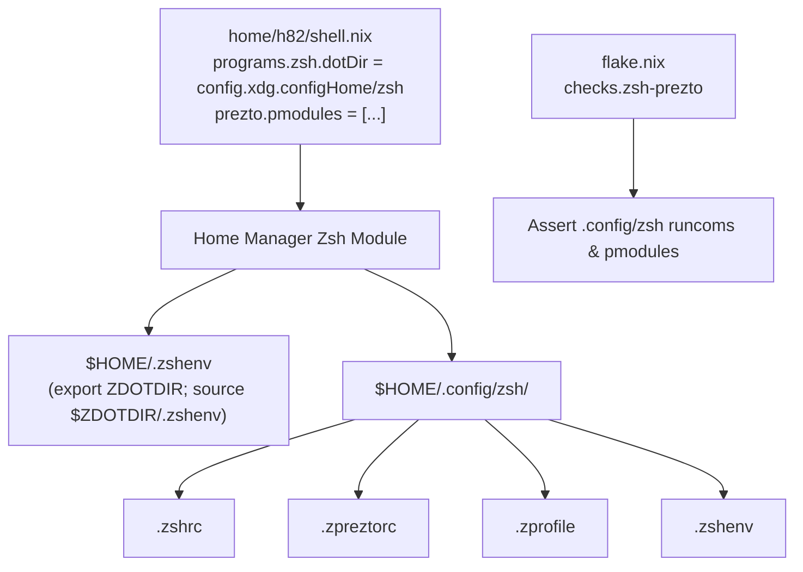

# Relocate Zsh Configuration to XDG Directory - Plan

## Goal Capsule

- **Objective:** User shell dotfiles are stored cleanly in the standard XDG configuration directory `~/.config/zsh` without polluting `$HOME`.
- **Means:** Set `programs.zsh.dotDir = "${config.xdg.configHome}/zsh"` in Home Manager, declare explicit Prezto `pmodules` matching the user's active environment, and update flake check assertions (KTD1, KTD2, KTD3).
- **Product Authority:** `home/h82/shell.nix` and `flake.nix`.
- **Open Blockers:** None.

---

## Product Contract

### Summary

Relocate declarative Zsh configuration files (`.zshrc`, `.zprofile`, `.zshenv`, `.zpreztorc`) from `$HOME` to `~/.config/zsh` using Home Manager's `programs.zsh.dotDir`. Configure Prezto's `pmodules` to match the module set from the user's current environment, and update flake regression test paths in `flake.nix`.

### Problem Frame

Currently, `home/h82/shell.nix` enables `programs.zsh` and `programs.zsh.prezto` using default directory paths, placing dotfiles directly under `$HOME`. The user's active configuration isolates all Zsh dotfiles into `~/.config/zsh` via `ZDOTDIR`, keeping `$HOME` clean and following the XDG Base Directory specification. Furthermore, the existing Prezto configuration relies on upstream defaults rather than explicitly declaring the modules used in the active environment.

### Key Decisions

- **KD1. Relocate Zsh dotfiles to `~/.config/zsh` via Home Manager `dotDir`**: Set `programs.zsh.dotDir = "${config.xdg.configHome}/zsh"`, using Home Manager's native support for generating Zsh runcoms in `$ZDOTDIR` alongside a minimal bootstrap `~/.zshenv` trampoline (session-settled: user-directed — chosen over keeping files in `$HOME` root: cleanly isolates user shell configuration into XDG-compliant config directory). Governs R1, R2.
- **KD2. Restrict scope to dotfile directory relocation and Prezto module list**: Retain existing prompt and keybinding defaults, focusing exclusively on dotfile placement and module selection (session-settled: user-directed — chosen over full prompt and editor configuration sync: user explicitly scoped work to directory relocation and module list). Governs R3, R4.
- **KD3. Exclude macOS-specific modules from Prezto pmodules**: Drop the `osx` module from the Prezto `pmodules` list since the target platform is NixOS on a ThinkPad X1 Carbon Gen 11 laptop (session-settled: user-approved — chosen over copying raw module list: target host is Linux). Governs R3.
- **KD4. Preserve XDG state path for Zsh history**: Keep `programs.zsh.history.path = "$HOME/.local/state/zsh/history"` instead of moving history into `~/.config/zsh/.zsh_history` (session-settled: user-approved — chosen over storing history in config directory: separates mutable runtime history state from declarative configuration). Governs R5.
- **KD5. Update regression check paths in `flake.nix`**: Adapt the `zsh-prezto` check in `flake.nix` to assert file generation under `.config/zsh/` rather than `./`. Governs R6.

### Requirements

#### Directory and Configuration Layout

- R1. `home/h82/shell.nix` configures `programs.zsh.dotDir = "${config.xdg.configHome}/zsh"`.
- R2. Home Manager generates `.zshrc`, `.zprofile`, `.zshenv`, and `.zpreztorc` inside `$HOME/.config/zsh`, with a minimal `$HOME/.zshenv` exporting `ZDOTDIR`.

#### Prezto Modules and Integrations

- R3. `home/h82/shell.nix` defines `programs.zsh.prezto.pmodules` containing `environment`, `terminal`, `editor`, `history`, `directory`, `spectrum`, `git`, `utility`, `completion`, `syntax-highlighting`, `history-substring-search`, `autosuggestions`, and `prompt`.
- R4. Existing completions (`site-functions`) and `mise` integration continue to load properly within `.zshrc`.

#### State and Flake Verification

- R5. Command history path remains configured at `$HOME/.local/state/zsh/history`.
- R6. `flake.nix` check `zsh-prezto` verifies runcom generation under `.config/zsh/` for user `h82`.

### Acceptance Examples

- AE1. Relocated dotfiles in Home Manager
  - **Trigger:** Evaluate `home.file` definitions for user `h82` on `nixosConfigurations.ThinkPad-X1-Carbon-Gen-11`.
  - **Covers:** R1, R2
  - **Expected:** Keys `.config/zsh/.zshrc`, `.config/zsh/.zshenv`, `.config/zsh/.zprofile`, and `.config/zsh/.zpreztorc` exist in `home.file`, and `.zshenv` exports `ZDOTDIR`.
- AE2. Prezto module list configuration
  - **Trigger:** Inspect generated `.config/zsh/.zpreztorc`.
  - **Covers:** R3
  - **Expected:** File contains `zstyle ':prezto:load' pmodule` with the specified 13 modules, excluding `osx`.
- AE3. Flake check passes
  - **Trigger:** Run `nix flake check`.
  - **Covers:** R6
  - **Expected:** The `zsh-prezto` check validates without missing file errors.

### Scope Boundaries

- Customizing Prezto prompt themes (`sorin`) or editor keymaps (`emacs`) is deferred.
- Moving Zsh history file into `.config/zsh` is outside scope; history remains in `.local/state/zsh`.
- macOS-specific modules (`osx`) are excluded from Linux configuration.

### Sources / Research

- `home/h82/shell.nix`: Current Home Manager Zsh configuration.
- `flake.nix`: NixOS host configurations and `checks.${system}.zsh-prezto`.
- Current PC configuration: `~/.config/zsh/.zpreztorc` and `~/.zshenv`.
- Nixpkgs Home Manager Zsh module (`modules/programs/zsh/default.nix` and `plugins/prezto.nix`).

---

## Planning Contract

### Key Technical Decisions

- **KTD1. Set `programs.zsh.dotDir` via `config.xdg.configHome`**: Use `programs.zsh.dotDir = "${config.xdg.configHome}/zsh";` in `home/h82/shell.nix`. Home Manager resolves this to an absolute path, preventing relative path deprecation warnings and generating dotfiles directly under `.config/zsh/`. (session-settled: user-directed — chosen over root dotfiles: isolates shell files in XDG config path). Governs R1, R2.
- **KTD2. Explicitly define Prezto `pmodules`**: Declare `pmodules` under `programs.zsh.prezto` in `home/h82/shell.nix` with the 13 required modules (`environment`, `terminal`, `editor`, `history`, `directory`, `spectrum`, `git`, `utility`, `completion`, `syntax-highlighting`, `history-substring-search`, `autosuggestions`, `prompt`), omitting `osx`. Governs R3.
- **KTD3. Update flake check paths**: In `flake.nix`, update `checks.${system}.zsh-prezto` to inspect `host.config.home-manager.users.h82.home.file.".config/zsh/.zpreztorc"` and `.zshrc`, while reading `.zshenv` from `.config/zsh/.zshenv`. Governs R6.

### High-Level Technical Design

---

## Implementation Units

### U1. Relocate Zsh dotfiles and configure Prezto pmodules in Home Manager

- **Goal:** Update `home/h82/shell.nix` to place Zsh dotfiles in `~/.config/zsh` and define the required Prezto `pmodules`.
- **Requirements:** R1, R2, R3, R4, R5
- **Files:** `home/h82/shell.nix`
- **Approach:**
  - Import `config` in `home/h82/shell.nix` argument set: `{ config, ... }:`.
  - Set `programs.zsh.dotDir = "${config.xdg.configHome}/zsh";`.
  - Set `programs.zsh.prezto.pmodules` to the explicit 13-module list.
  - Preserve `history`, `initContent` (site-functions fpath), and `programs.mise`.
- **Test Scenarios:**
  - Evaluates `programs.zsh.dotDir` to `"/home/h82/.config/zsh"`.
  - Evaluates `home.file.".config/zsh/.zpreztorc"` and `home.file.".config/zsh/.zshrc"`.
- **Verification:**
  - `nix eval --impure --expr 'let f = builtins.getFlake (toString ./.); in f.nixosConfigurations.ThinkPad-X1-Carbon-Gen-11.config.home-manager.users.h82.programs.zsh.dotDir'`

### U2. Update flake regression check in flake.nix

- **Goal:** Update `checks.x86_64-linux.zsh-prezto` in `flake.nix` to assert file generation under `.config/zsh/`.
- **Requirements:** R6
- **Files:** `flake.nix`
- **Approach:**
  - Modify `zpreztorc`, `zshenv`, and `zshrc` bindings in `checks.zsh-prezto` to point to `.config/zsh/.zpreztorc`, `.config/zsh/.zshenv`, and `.config/zsh/.zshrc`.
  - Verify that `pmodules` assertion matches the newly declared module set.
- **Test Scenarios:**
  - Flake check derivation `checks.x86_64-linux.zsh-prezto` builds successfully.
- **Verification:**
  - `nix build --no-link .#checks.x86_64-linux.zsh-prezto`

### U3. End-to-end build verification and formatting

- **Goal:** Verify tree formatting and toplevel system builds.
- **Requirements:** R1, R2, R3, R4, R5, R6
- **Files:** `home/h82/shell.nix`, `flake.nix`
- **Approach:**
  - Run `nix fmt` to ensure compliance with repo formatting rules.
  - Run `nix flake check` to execute all flake checks.
  - Build both toplevel system configurations (`ThinkPad-X1-Carbon-Gen-11` and `ThinkPad-X1-Carbon-Gen-11-bootstrap`).
- **Test Scenarios:**
  - `nix fmt -- --ci` returns 0.
  - `nix flake check` returns 0.
  - Both `system.build.toplevel` builds succeed without errors.
- **Verification:**
  - `nix flake check`
  - `nix build --no-link .#nixosConfigurations.ThinkPad-X1-Carbon-Gen-11.config.system.build.toplevel`
  - `nix build --no-link .#nixosConfigurations.ThinkPad-X1-Carbon-Gen-11-bootstrap.config.system.build.toplevel`

---

## Verification Contract

| Test / Gate | Command | Applicability | Done Signal |
| --- | --- | --- | --- |
| Nix format check | `nix fmt -- --ci` | Tree formatting | Exit code 0 |
| Flake checks | `nix flake check` | Regression & syntax checks | Exit code 0 |
| Production toplevel build | `nix build --no-link .#nixosConfigurations.ThinkPad-X1-Carbon-Gen-11.config.system.build.toplevel` | System build | Exit code 0 |
| Bootstrap toplevel build | `nix build --no-link .#nixosConfigurations.ThinkPad-X1-Carbon-Gen-11-bootstrap.config.system.build.toplevel` | Bootstrap host build | Exit code 0 |

---

## Definition of Done

- Zsh dotfiles (`.zshrc`, `.zpreztorc`, `.zshenv`, `.zprofile`) are defined under `~/.config/zsh` via Home Manager `dotDir`.
- Prezto `pmodules` explicitly includes the 13 required modules, excluding `osx`.
- `flake.nix` check `zsh-prezto` passes and verifies the `.config/zsh` paths.
- Tree formatting complies with `nix fmt`.
- `nix flake check` and both system toplevel builds succeed cleanly.
- No dead-end or experimental code remains.
