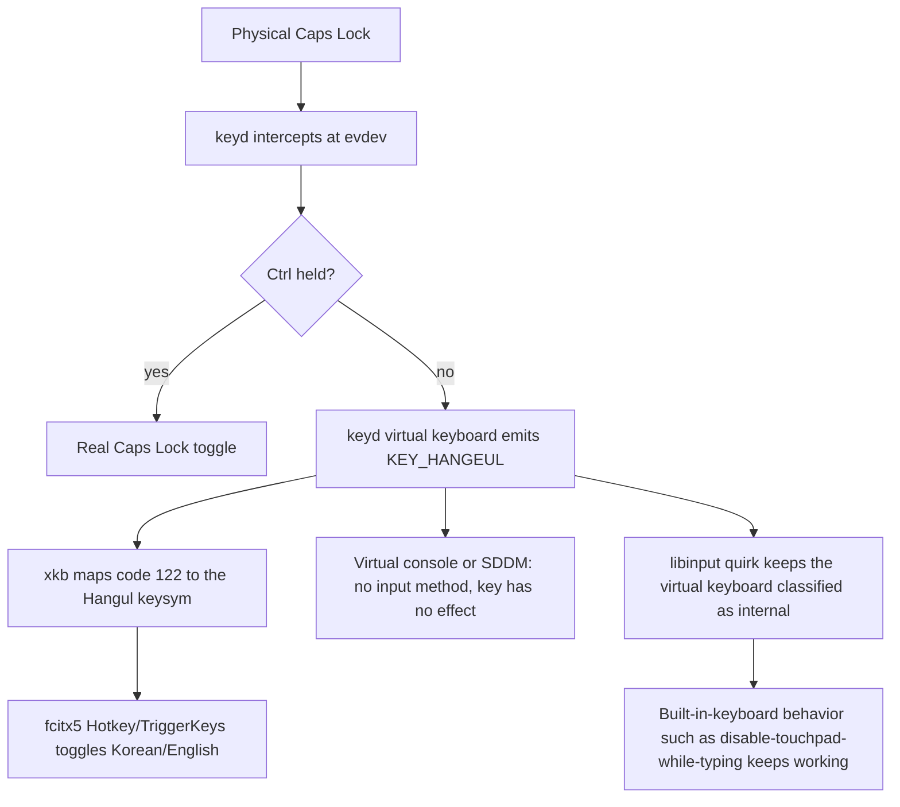
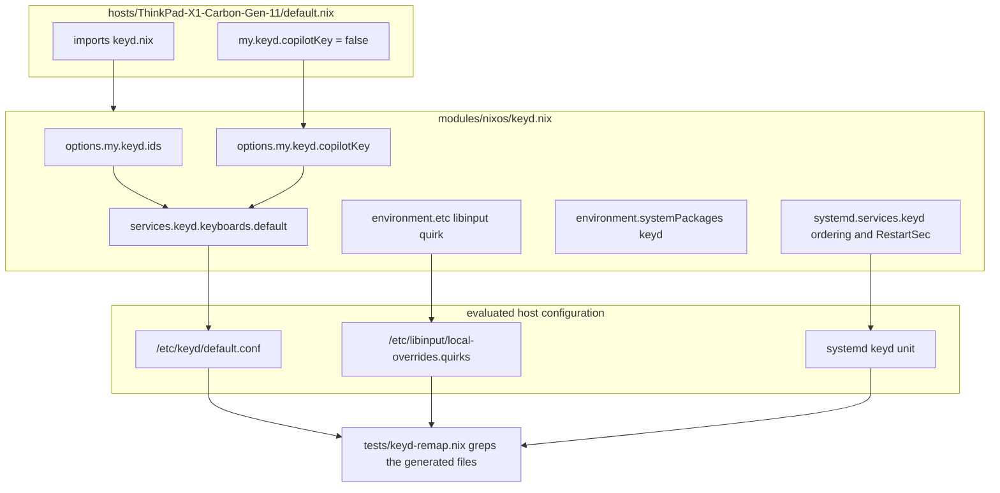

# Caps Lock to Hangul Remap via keyd - Plan

## Goal Capsule

- **Objective:** Pressing Caps Lock alone on the ThinkPad switches between Korean and English input wherever an input method is running, real Caps Lock stays reachable through Ctrl+Caps Lock, and the remap is applied uniformly by the system rather than per session.
- **Means:** A `keyd`-based NixOS module with host-settable options, mirroring the proven configuration from the user's chezmoi dotfiles (KD1, KD3, KTD1).
- **Product Authority:** `modules/nixos/`, `hosts/ThinkPad-X1-Carbon-Gen-11/`, `flake.nix`, `docs/verification.md`.
- **Execution profile:** Configuration change. Prove it with the new flake check and both host builds; the physical key behavior is confirmed on hardware and reported separately per `docs/verification.md`.
- **Stop conditions:** Stop and report if the generated configuration cannot be asserted from the evaluated host config, or if `keyd check` rejects the generated file. Do not run `nixos-rebuild switch` as validation and do not install to the physical laptop without an explicit instruction.
- **Who finishes:** The implementer lands U1-U4 and the repository checks. The hardware checklist items in U4 are completed by the person at the machine, after installation.
- **Open Blockers:** None.

**Product Contract preservation:** changed — R9 extended (suspend/resume confirmation and a recovery note added to the hardware checklist items it requires), R10 added (keyd CLI availability, without which R9's checklist is not executable), AE3 clarified to name the SDDM greeter alongside the virtual console, and the Dependencies section corrected: the Hangul-keysym item is now verified evidence rather than an assumption. No requirement was weakened and no scope was removed.

---

## Product Contract

### Summary

Introduce a declarative key-remapping layer to this flake: `keyd` rewrites Caps Lock to the Hangul key at the evdev level, Ctrl+Caps Lock keeps the original Caps Lock behavior, and an optional Copilot-key correction is available for hosts that need it. A libinput quirk keeps keyd's virtual keyboard classified as an internal keyboard, and a repository check asserts the generated configuration.

### Problem Frame

This ThinkPad has a US physical layout with no dedicated 한/영 key, so Korean/English switching has no natural home on the keyboard. The fcitx5 side already expects one: `modules/nixos/desktop.nix:41-44` binds the input-method trigger to the `Hangul` keysym, and `home/h82/fcitx5.nix:16-17` mirrors it. Nothing in this flake produces that keysym — a repository-wide search finds no `keyd`, `libinput`, or console-keymap configuration, and the only xkb-adjacent entries are the inert `OverrideXkbOption=False` / `CustomXkbOption=` defaults in `home/h82/fcitx5.nix:56-57`.

This ThinkPad also cannot be served by an xkb option: `rules/evdev.lst` in xkeyboard-config 2.48 offers `korean:ralt_hangul` and `korean:rctrl_hangul` but no `caps:` counterpart, so Caps Lock to Hangul has no stock xkb expression at all.

The user already runs a working remap on other machines through chezmoi, driven by a shell script that detects the keyboard, installs `keyd` per distribution, writes `/etc/keyd/default.conf`, and reloads the service. On NixOS that entire imperative path is unnecessary and unreproducible; the same outcome belongs in the flake.

### Key Decisions

- KD1. **Remap at the evdev layer with `keyd`**: keyd rewrites the key before any session sees it, so the same binding holds in the Plasma Wayland session, at the SDDM login screen, and in a virtual console (session-settled: user-directed — chosen over an xkb layout option: no stock xkb option maps Caps Lock to Hangul, and xkb options do not apply outside a graphical session). Governs R1, R2.
- KD2. **Port all three dotfiles bindings, not a subset**: the flake reproduces the dotfiles configuration one-to-one so both environments stay comparable (session-settled: user-directed — chosen over porting only the Caps Lock binding: keeping the two setups identical is the point). Governs R2, R3, R4.
  - *Conflict call-out:* external research recommends dropping `leftshift+leftmeta+f23` on this machine — the X1 Carbon Gen 11 predates the Copilot key, and a keyd chord on `leftshift`+`leftmeta` carries a default 50 ms chording interval that can add latency or misfires to ordinary Shift and Super use. Proceeding as settled. The cost does not land on this host because KD4 leaves the binding off here; a host that enables it accepts the chording interval on Shift and Super.
- KD3. **One shared module with host-settable option flags**: the module always provides the Korean remap and the Caps Lock escape hatch; the host supplies the target keyboard ids and whether the Copilot-key correction applies (session-settled: user-directed — chosen over writing the configuration directly under `hosts/` or exposing a free-form binding map: matches the existing repo-local `my.*` option precedent at `hosts/ThinkPad-X1-Carbon-Gen-11/default.nix:13-17` and keeps the asserted surface narrow). Governs R5, R6.
- KD4. **Copilot-key correction defaults off**: it exists for Copilot+ machines that ship a Copilot key in place of the right Meta key, which this ThinkPad does not have (session-settled: user-approved — chosen over always emitting the binding: a dead binding on every host obscures which hosts actually need it). Governs R4, R6.
- KD5. **Target the internal keyboard only by default**: the default id list names the internal AT keyboard instead of nixpkgs' `["*"]` wildcard, so attaching an external keyboard does not silently change its Caps Lock behavior (session-settled: user-directed — chosen over covering all connected keyboards: a host that wants an external keyboard covered adds its id). Governs R5.
- KD6. **Ship the libinput quirk alongside the remap**: without it libinput classifies keyd's virtual keyboard as a non-internal keyboard, which unsettles behavior that assumes a built-in keyboard, such as disable-touchpad-while-typing (session-settled: user-approved — chosen over relying on libinput's default classification: the dotfiles carry this quirk for the same reason). Governs R7.
- KD7. **Verify by asserting the generated configuration, plus a hardware checklist**: a build-time check catches regressions in what the module emits; the physical key behavior is confirmed on hardware and reported separately (session-settled: user-directed — chosen over a NixOS VM test that injects key events: the VM cost and flakiness outweigh the extra confidence, and `docs/verification.md:30` already requires hardware results to be reported separately). Governs R8, R9.
  - *Conflict call-out:* the learnings pass recommends modelling the check on `tests/auth-provisioning.nix`, a VM test that exercises real runtime behavior, on the grounds that this repo has already been bitten by a service whose file-level state looked correct while a real consumer broke. Proceeding as settled. The residual gap is real and named in Risks: no repository check proves the key actually reaches fcitx5, which is exactly what R9's hardware items cover.

### Requirements

#### Key behavior

- R1. The system runs `keyd` as an enabled service that starts at boot.
- R2. Caps Lock pressed alone emits the Hangul key (`KEY_HANGEUL`, code 122), which the existing fcitx5 trigger at `modules/nixos/desktop.nix:41-44` consumes as the Korean/English toggle.
- R3. Caps Lock pressed with Ctrl performs the original Caps Lock toggle.
- R4. The Copilot-key correction, which turns `leftshift+leftmeta+f23` into a Meta layer, appears in the generated configuration only when the host enables it.

#### Host configuration

- R5. The set of target keyboard ids is host-settable, defaulting to the internal AT keyboard rather than to every connected keyboard.
- R6. The ThinkPad X1 Carbon Gen 11 host is configured with the Copilot-key correction disabled.

#### Input stack integration

- R7. The configuration marks keyd's virtual keyboard as an internal keyboard for libinput.

#### Verification

- R8. A repository check registered in `flake.nix` asserts R1, R2, R3, R4, R5, and R7 against the built host configuration and runs under `nix flake check`.
- R9. `docs/verification.md` gains hardware checklist items covering the Caps Lock Korean/English toggle, Ctrl+Caps Lock capitalization, the toggle still working after a suspend/resume cycle, the behavior at the SDDM greeter where no input method runs, and the diagnostic and recovery path to follow if the toggle stops working.
- R10. The `keyd` command-line tool is available on the installed system, so the R9 checklist items can be carried out.

### Acceptance Examples

- AE1. Copilot correction disabled
  - **Covers R4, R6.**
  - **Given:** The ThinkPad host, with the Copilot-key correction left at its default.
  - **When:** The host configuration is built.
  - **Then:** The generated keyd configuration contains the Caps Lock bindings and no `f23` binding.
- AE2. Copilot correction enabled
  - **Covers R4.**
  - **Given:** A host that sets the Copilot-key correction on.
  - **When:** That configuration is built.
  - **Then:** The generated keyd configuration additionally contains the `leftshift+leftmeta+f23` Meta-layer binding.
- AE3. Caps Lock where no input method runs
  - **Covers R2, R3.**
  - **Given:** A virtual console or the SDDM login screen, where no input method runs.
  - **When:** Caps Lock is pressed alone, then pressed with Ctrl.
  - **Then:** The first press produces no visible effect and leaves the Caps Lock LED off, because nothing consumes the Hangul key; the second press toggles capitalization.
- AE4. External keyboard attached
  - **Covers R5.**
  - **Given:** The ThinkPad host at its default id list, with an external USB keyboard connected.
  - **When:** Caps Lock is pressed on the external keyboard.
  - **Then:** It behaves as an ordinary Caps Lock, because the remap covers the internal keyboard only.

### Scope Boundaries

- External keyboards are not remapped by default; a host that wants one covered adds its id (R5).
- No other key is remapped — the Hanja key, the right Alt key, and the function row are untouched.
- fcitx5 configuration is not changed; the remap targets the trigger fcitx5 already expects.
- Adding a second host to this flake is out of scope. The option flags exist so a later host can set them, not as a migration to a multi-host layout.
- The imperative chezmoi script's responsibilities — package installation, hardware detection, service enablement, group membership, reload — are not reproduced; the Nix module subsumes them.

#### Deferred to Follow-Up Work

- Per-application remapping through `keyd-application-mapper`, which the nixpkgs module cannot configure from `settings` today (nixpkgs#241557).
- Covering a dock or external keyboard, which needs a second `keyboards.*` entry rather than a wider `ids` list, because a device id may appear in only one keyd config file.

### Dependencies and Assumptions

- The pinned nixpkgs revision provides `services.keyd` with `keyboards.<name>.ids`, `.settings`, and `.extraConfig`; its `ids` default is `["*"]`, which R5 narrows. Top-level `services.keyd.ids` and `.settings` are removed options and must not be used.
- keyd 2.6.0, the version in the pinned nixpkgs, names the Korean key `hangeul` and maps it to code 122, matching Linux `KEY_HANGEUL` (`src/keys.h`, `src/keys.c`).
- Verified, not assumed: code 122 reaches a session as the `Hangul` keysym under a plain `us` layout with no extra xkb option. xkeyboard-config 2.48 defines `<HNGL> = 130` in `keycodes/evdev` and `key <HNGL> {[ Hangul ]}` in the default `pc` section of `symbols/pc`, which every layout includes; `symbols/us` does not override it.
- Assumption: the internal keyboard's id is `0001:0001`, taken from the dotfiles declaration and consistent with keyd's own ThinkPad documentation. Confirm on hardware with `keyd monitor` (R10 makes that command available).
- Enabling `services.keyd` implicitly sets `hardware.uinput.enable`, which loads the `uinput` kernel module, creates a `uinput` group, and installs a udev rule. This is new system state for this flake and is accepted.
- A new module file takes effect only once it is added to the explicit import list at `hosts/ThinkPad-X1-Carbon-Gen-11/default.nix:3-11`; there is no auto-import.

### Outstanding Questions

**Deferred to Planning** — all resolved; see Key Technical Decisions.

---

## Planning Contract

### Key Technical Decisions

- KTD1. **Emit the bindings through `services.keyd.keyboards.default.settings`, not `extraConfig`.** The module renders `settings` with `lib.generators.toINI`, so the generated `/etc/keyd/default.conf` is a predictable target for the R8 check. Two consequences bind the check: `toINI` writes `key=value` with no surrounding spaces, and it orders sections alphabetically, so `[control]` precedes `[main]`. Both are predefined keyd layers, so their order does not matter. Governs R2, R3, R4.
- KTD2. **Declare `my.keyd.*` options inside the new module, following `modules/nixos/secrets.nix:33-57`.** That file's `options.my.cliAuth` block is the repo's shape for a module-owned option namespace: `lib.mkEnableOption` for the switch, `lib.mkOption` with an explicit `type` and `default`, `lib` from the module arguments rather than `with lib`. Instantiates KD3; governs R5, R6.
- KTD3. **Do not gate keyd on `my.bootstrap`.** Both host outputs are built from the same module list and differ only by that flag, which exists to avoid private boot keys and user authentication secrets. keyd depends on neither, and Korean input is more useful at an installer console, not less. Stated explicitly so a reviewer does not add the gate reflexively.
- KTD4. **Order the keyd service before `display-manager.service`.** The nixpkgs module sets only `wantedBy = [ "multi-user.target" ]`, leaving a boot race in which SDDM can start before keyd grabs the device. The ordering is one line and narrows the race. It does not close it: the unit is `Type=simple`, so the ordering guarantees only that keyd was spawned before SDDM, not that it has grabbed the keyboard.
- KTD5. **Raise `RestartSec` and document the real recovery path.** keyd's upstream escape hatch — the `backspace+escape+enter` panic sequence — is neutralized by the module's `Restart = "always"` with systemd's 100 ms default, which restarts the daemon with the same configuration. A longer `RestartSec` gives the panic sequence a usable window. Note that a rejected configuration is already fail-open: keyd exits, the kernel releases its `EVIOCGRAB`, and the unmodified keyboard returns, so total lockout is not a realistic failure mode. Governs R9.
- KTD6. **Do not create a `keyd` group.** The group governs only keyd's IPC socket, and creating it makes the daemon crash on this module because its `CapabilityBoundingSet` lacks `CAP_SETGID` (nixpkgs#290161). The resulting `failed to set effective group` startup warning is cosmetic; `keyd monitor` needs root or the `input` group, not this group.
- KTD7. **Install `pkgs.keyd` into `environment.systemPackages`.** The module sets only `ExecStart`, so `keyd check`, `keyd monitor`, and `keyd reload` are otherwise absent from the system. Governs R10.
- KTD8. **Put the check body in `tests/keyd-remap.nix` and register it in `flake.nix`.** The `zsh-prezto` check at `flake.nix:97-111` is the pattern for grepping evaluated host output, but it lives inline because it makes four assertions against one configuration. This check must assert both states of the Copilot flag, which means evaluating a second configuration, so it follows the `boot-layout` / `auth-provisioning` shape of a `tests/*.nix` file imported from `flake.nix`. That import needs `self` in addition to `{ pkgs, inputs }`, since the host configuration comes from `self.nixosConfigurations`. Instantiates KD7; governs R8.
- KTD9. **Keep the libinput quirk in the same module as the remap.** It is not a second concern: the quirk exists only because keyd introduces a virtual keyboard, and separating them invites a later reader to delete it as cosmetic. It matters concretely because `AttrKeyboardIntegration=internal` is what keeps libinput pairing keyd's virtual keyboard with the built-in touchpad for disable-while-typing, the behavior KD6 names. Governs R7.

### High-Level Technical Design

### Assumptions

These are planning bets, recorded because the scoping confirmation was skipped for an autonomous run.

- The keyd keyboard attribute is named `default`, matching the dotfiles' `/etc/keyd/default.conf` and keeping the generated path stable for the check.
- The new module is imported into the host between `fonts.nix` and `secrets.nix`, preserving the existing alphabetical order of `modules/nixos/` entries.
- `RestartSec` is set to five seconds — long enough for the panic sequence to be usable, short enough that a transient failure still self-heals.
- The check asserts the Copilot-enabled case by evaluating a second configuration inside `tests/keyd-remap.nix`, rather than adding a second `nixosConfigurations` output that would then need building in CI.
- New `environment.etc` content is written with English comments, per `AGENTS.md`, even though existing blocks in `modules/nixos/desktop.nix` carry Korean ones.

### Risks and Dependencies

- **No repository check proves the key reaches fcitx5.** The check asserts what the module generates, not what the keyboard does. A correct-but-wrong key name would pass every repository check and fail only on hardware. The xkb evidence in Dependencies makes this unlikely; R9's checklist items are the control.
- **keyd sits below the compositor and affects every seat, including SDDM.** A wrong `ids` value or key name degrades the built-in keyboard at the login screen with no graphical fallback. Narrowing `ids` to the internal keyboard limits the blast radius; the fail-open behavior in KTD5 limits the consequence; booting the previous generation is the backstop.
- **Both host outputs receive the service.** `AGENTS.md` requires both toplevels to build before shipping, so both builds are part of the gate.
- **keyd's device-id rule.** A device id may be listed in only one keyd config file, so a later external-keyboard entry must be a separate `keyboards.*` attribute rather than an addition to this `ids` list.
- **Upstream suspend/resume reports exist but do not apply.** keyd's tracked suspend breakage (keyd#497) is FreeBSD-specific and concerns USB devices disappearing on resume; the internal AT keyboard is a platform device. R9 still confirms the toggle after a resume.

### Sources and Research

- `modules/nixos/desktop.nix:41-44` — fcitx5 `Hotkey/TriggerKeys` is already `Hangul`; `home/h82/fcitx5.nix:16-17` mirrors it at the Home Manager layer.
- `hosts/ThinkPad-X1-Carbon-Gen-11/default.nix:3-11` — explicit module import list; `:13-17` — the `options.my.bootstrap` precedent. `modules/nixos/secrets.nix:33-57` — the module-owned `options.my.cliAuth` block that KTD2 mirrors.
- `flake.nix:97-111` — the `zsh-prezto` check, the pattern for grepping evaluated host output; `flake.nix:85-86` — the `tests/*.nix` import shape KTD8 follows; `tests/boot-layout.nix:1-9` — the file-header comment convention documenting a test's import interface.
- `modules/nixos/desktop.nix:117-131` — existing `environment.etc` usages, the idiom for installing the libinput quirk; the pinned nixpkgs has no dedicated libinput-quirks option.
- nixpkgs `nixos/modules/services/hardware/keyd.nix` at the pinned revision — file generation through `environment.etc."keyd/<name>.conf"`, `restartTriggers`, `Restart = "always"`, `SupplementaryGroups`, and the implicit `hardware.uinput.enable`.
- xkeyboard-config 2.48 `keycodes/evdev`, `symbols/pc`, `rules/evdev.lst` — the Hangul keysym chain, and the absence of any `caps:` Korean option.
- keyd 2.6.0 `docs/keyd.scdoc` and CHANGELOG — modifier-layer semantics (bindings are unaffected by the modifiers of the layer that defines them), the panic sequence, the 50 ms chording interval, and the `keyd check` subcommand.
- nixpkgs#290161 (creating a `keyd` group crashes the daemon), keyd#723 and the keyd README FAQ (the libinput quirk), keyd#497 (FreeBSD-only suspend breakage).
- `.compound-engineering/artifacts/solutions/integration-issues/sops-service-umask-blocks-user-secrets.md` — precedent for verifying a system service's real activation behavior rather than trusting declared configuration alone.
- Reference implementation: `home/.chezmoiscripts/30-linux/run_onchange_after_install-system-24-keyd.sh.tmpl` and `system/linux/etc/libinput/local-overrides.quirks` in https://github.com/hyperlapse122/dotfiles, with the keyboard id declared in `home/.chezmoidata/system.yaml`.

---

## Implementation Units

### U1. keyd remapping module with host-settable options

- **Goal:** A new system module that enables keyd with the ported bindings, exposes the host-settable options, installs the libinput quirk, and makes the keyd CLI available.
- **Requirements:** R1, R2, R3, R4, R5, R7, R10. Implements KD1, KD3, KD4, KD5, KD6 through KTD1, KTD2, KTD4, KTD5, KTD6, KTD7, KTD9.
- **Dependencies:** None.
- **Files:** `modules/nixos/keyd.nix` (create).
- **Approach:**
  1. Declare `options.my.keyd` with `ids` (a list of strings defaulting to the internal AT keyboard) and a Copilot-key enable switch defaulting off, following the option style in `modules/nixos/secrets.nix:33-57`.
  2. Set `services.keyd.enable` and one `keyboards.default` entry whose `ids` comes from the option and whose `settings` carries the `control` and `main` sections per KTD1. Quote the chord attribute name; it is not a valid bare Nix identifier.
  3. Add the Copilot binding to the `main` section only when the flag is on, so AE1 and AE2 differ in the generated file.
  4. Install the libinput quirk through `environment.etc` per KTD9, with the four lines from the dotfiles reference and an English comment explaining why keyd's virtual keyboard must be classified as internal.
  5. Add `pkgs.keyd` to `environment.systemPackages` (KTD7) and set the service ordering and `RestartSec` (KTD4, KTD5).
- **Patterns to follow:** `modules/nixos/secrets.nix` for the `cfg = config.my.<feature>` plus `options` / `config` layout; `modules/nixos/desktop.nix:117-131` for `environment.etc` text blocks.
- **Execution note:** This is configuration. The useful first proof is `nix build` of the host toplevel plus a read of the generated `/etc/keyd/default.conf` in the closure, not unit coverage.
- **Test scenarios:** Test expectation: none in this unit -- pure configuration with no test file of its own; the behaviors it introduces are proven by U3's scenarios.
- **Verification:** Both host toplevels build, and the generated `keyd/default.conf` in the closure contains the `[ids]`, `[control]`, and `[main]` sections with the expected entries.

### U2. Wire the module into the host

- **Goal:** The ThinkPad host imports the module and pins the Copilot-key correction off.
- **Requirements:** R6. Implements KD4, and KTD3's decision not to gate on `my.bootstrap`.
- **Dependencies:** U1.
- **Files:** `hosts/ThinkPad-X1-Carbon-Gen-11/default.nix` (modify).
- **Approach:**
  1. Add `../../modules/nixos/keyd.nix` to the existing `imports` list, keeping the alphabetical order of the `modules/nixos/` entries.
  2. Set the Copilot-key option to false explicitly rather than relying on the module default, so the host states which machine class it is.
  3. Do not add a `my.bootstrap` condition; keyd applies to both host outputs (KTD3).
- **Patterns to follow:** The existing `config.my.cliAuth.enable` line in the same file shows how the host sets a module-owned option.
- **Test scenarios:** Test expectation: none in this unit -- a two-line host wiring change; U3's check proves the resulting configuration.
- **Verification:** `nix build --no-link .#nixosConfigurations.ThinkPad-X1-Carbon-Gen-11.config.system.build.toplevel` and the bootstrap variant both succeed, and the bootstrap closure also contains the keyd configuration.

### U3. Regression check for the generated configuration

- **Goal:** A flake check that fails if the generated keyd configuration or the libinput quirk drifts from what the requirements state, in both states of the Copilot flag.
- **Requirements:** R8. Covers AE1, AE2, and the file-level portion of R1, R2, R3, R4, R5, R7. Implements KD7 through KTD8.
- **Dependencies:** U1, U2.
- **Files:** `tests/keyd-remap.nix` (create), `flake.nix` (modify).
- **Approach:**
  1. Write `tests/keyd-remap.nix` as a function of `{ pkgs, inputs, self }` returning a `runCommand` derivation, with a header comment documenting that import interface as `tests/boot-layout.nix:1-9` does.
  2. Read the host's generated files from `self.nixosConfigurations.ThinkPad-X1-Carbon-Gen-11.config.environment.etc`, using `.source` for grep targets.
  3. Evaluate a second configuration with the Copilot flag on to produce the AE2 fixture, rather than adding a second flake output.
  4. Register the check in `flake.nix` next to the existing entries as `keyd-remap`, naming the derivation `keyd-remap-tests`.
  5. Grep for `toINI` output shape — `key=value` with no spaces — per KTD1.
  6. Run `keyd check` against both generated fixtures inside the derivation, so the Goal Capsule's `keyd check` stop condition is produced by this check rather than by an ad-hoc invocation. The subcommand is parse-only, so it needs no device or uinput access in the build sandbox.
- **Patterns to follow:** `flake.nix:97-111` for reaching evaluated host output; `flake.nix:85-86` and `tests/boot-layout.nix` for the imported-test-file shape.
- **Test scenarios:**
  - Covers AE1. With the Copilot flag at its default, the generated keyd configuration contains `capslock=hangeul` under `[main]` and contains no `f23` binding.
  - Covers AE2. With the Copilot flag enabled, the generated configuration additionally contains the `leftshift+leftmeta+f23` entry mapping to the Meta layer.
  - The generated configuration contains a `[control]` section whose `capslock` entry maps to `capslock`, proving the escape hatch survives an edit to the module.
  - The `[ids]` section contains `0001:0001` and does not contain the `*` wildcard, proving the narrowed default survives.
  - The generated libinput quirk contains `MatchName=keyd virtual keyboard` and `AttrKeyboardIntegration=internal`.
  - The evaluated host configuration has the keyd systemd service enabled.
  - `keyd check` accepts both generated configurations, proving the file is structurally valid and not merely grep-matching.
- **Verification:** `nix build --no-link .#checks.x86_64-linux.keyd-remap` succeeds, and `nix flake check` includes it.

### U4. Verification documentation

- **Goal:** The hardware checklist tells the person at the machine what to confirm and what to do when the toggle stops working.
- **Requirements:** R9.
- **Dependencies:** U1, U3.
- **Files:** `docs/verification.md` (modify).
- **Approach:**
  1. Append checklist items in the file's existing form — flat unchecked boxes, one imperative English sentence each, keeping the closing paragraph last: the Caps Lock Korean/English toggle in a Plasma session; Ctrl+Caps Lock capitalization; the toggle still working after a suspend/resume cycle; and, at the SDDM greeter, a lone Caps Lock press having no visible effect and leaving the LED off while Ctrl+Caps Lock still toggles capitalization.
  2. Add one item confirming the internal keyboard id with `keyd monitor` before trusting the default, since the repository check cannot verify it.
  3. Add a short diagnostic and recovery note naming `systemctl status keyd`, `journalctl -u keyd`, and booting the previous generation, and stating that a rejected configuration is fail-open rather than a lockout (KTD5).
  4. Name the new `keyd-remap` check in the prose paragraph that already describes the other checks.
- **Patterns to follow:** `docs/verification.md:19-28` for the checklist item form; the line-13 prose paragraph for how checks are described.
- **Test scenarios:** Test expectation: none -- documentation change with no behavior.
- **Verification:** The hardware section still ends with its existing closing paragraph, and every new item is a single unchecked box in English.

---

## Verification Contract

| Gate | Command | Applies to |
|---|---|---|
| Formatting | `nix fmt -- --ci` | U1, U2, U3 |
| New regression check | `nix build --no-link .#checks.x86_64-linux.keyd-remap` | U3 |
| All declared checks | `nix flake check` | U1-U4 |
| Production host build | `nix build --no-link .#nixosConfigurations.ThinkPad-X1-Carbon-Gen-11.config.system.build.toplevel` | U1, U2 |
| Bootstrap host build | `nix build --no-link .#nixosConfigurations.ThinkPad-X1-Carbon-Gen-11-bootstrap.config.system.build.toplevel` | U1, U2 |
| Hardware confirmation | The `docs/verification.md` checklist items added by U4 | R2, R3, R9 |

Do not run `nixos-rebuild switch` as validation, and do not install to the physical laptop without an explicit instruction. Hardware results are reported separately from repository results, per `docs/verification.md:30`.

## Definition of Done

- R1-R10 are satisfied by the code in U1-U4, or explicitly deferred in Scope Boundaries.
- Every row of the Verification Contract that applies to repository work passes; the hardware row is handed to the person at the machine rather than claimed.
- The generated keyd configuration matches the dotfiles reference one-to-one for the enabled bindings, with the Copilot correction off on this host.
- `modules/nixos/keyd.nix` is imported by the host and both host outputs build.
- No abandoned or experimental configuration remains in the diff.
- The hardware checklist additions are in `docs/verification.md` and the new check is named in its prose paragraph.
