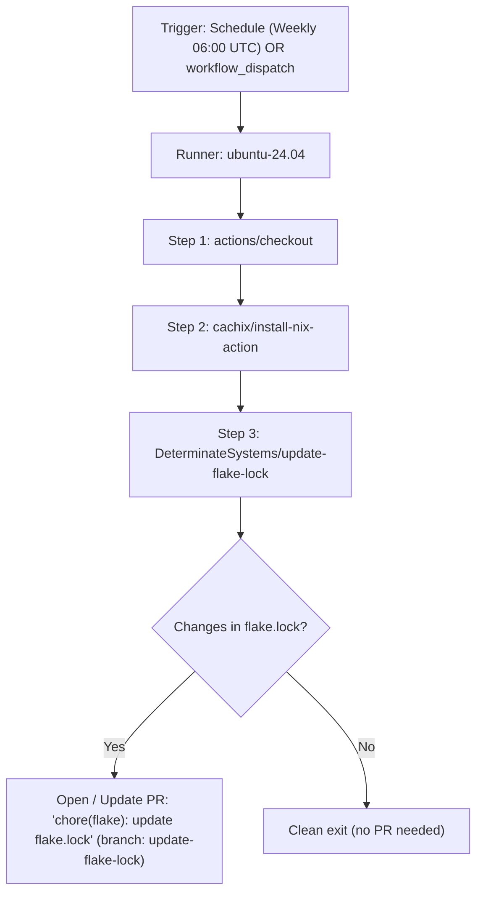

# GitHub Workflow for Updating Flake Lock to Channel Latest - Plan

## Goal Capsule

- **Objective:** Automate periodic and on-demand updates of `flake.lock` against upstream channel revisions (`nixos-unstable` and input repositories), opening a standardized pull request for review and CI validation.
- **Means:** Create `.github/workflows/update-flake-lock.yml` utilizing `actions/checkout`, `cachix/install-nix-action`, and `DeterminateSystems/update-flake-lock` with Conventional Commit formatting and flexible dispatch inputs (KTD1).
- **Product Authority:** Continuous Integration and automation workflows in `.github/workflows/`.
- **Open Blockers:** None.

---

## Product Contract

### Summary

Add a dedicated GitHub Actions workflow (`.github/workflows/update-flake-lock.yml`) that automatically checks for and updates Nix flake dependencies to their latest upstream channel revisions. The workflow runs weekly on a cron schedule and supports manual on-demand execution via `workflow_dispatch`. When changes are detected, it opens a pull request with Conventional Commit formatting (`chore(flake): update flake.lock`), automated labels, and an informative diff summary.

### Problem Frame

The repository manages a NixOS configuration tracking `nixos-unstable` along with follow-inputs for Home Manager, Disko, sops-nix, and Lanzaboote. Currently, updating `flake.lock` requires manual developer intervention (`nix flake update`), manual branch management, and manual pull request submission. Without an automated workflow, security patches and upstream channel improvements can languish unnoticed until manually pulled, increasing maintenance friction and the surface for stale dependencies.

### Key Decisions

- **KD1. Dedicated workflow file over modifying existing check.yml**: Place the update automation in `.github/workflows/update-flake-lock.yml` rather than combining it with PR verification jobs in `check.yml` (session-settled: user-directed — chosen over monolithic workflow: isolates trigger events, security permissions, and schedule cadences). Governs R1, R2.
- **KD2. Use DeterminateSystems/update-flake-lock action**: Leverage the community standard `DeterminateSystems/update-flake-lock` action pinned to v28 (SHA `834c491b2ece4de0bbd00d85214bb5e83b4da5c6`) alongside existing `cachix/install-nix-action` (chosen over custom git/gh shell scripts: handles PR creation, existing PR reuse/re-basing, branch management, and Markdown input diff generation out-of-the-box). Governs R3, R4, R5.
- **KD3. Conventional Commits and standard PR labeling**: Title PRs and commits with `chore(flake): update flake.lock` to conform with repo guidelines in `AGENTS.md` (imperative, lowercase conventional subject under 50 characters). Label PRs with `dependencies` and `automated`. Governs R4, R5.
- **KD4. Dual trigger with flexible dispatch input**: Support both weekly cron schedule (`0 6 * * 1` - Mondays at 06:00 UTC) and manual `workflow_dispatch` with an optional `target_inputs` parameter allowing targeted or full updates. Governs R2.
- **KD5. Token flexibility for downstream CI triggers**: Accept `secrets.GH_TOKEN_FOR_UPDATES || secrets.GITHUB_TOKEN` so a repository-configured fine-grained PAT or GitHub App token can automatically trigger downstream CI checks on generated PRs, while falling back gracefully to the default runner token. Governs R6.

### Requirements

**Workflow Structure and Execution**

- R1. `.github/workflows/update-flake-lock.yml` is created with explicit runner specifications on `ubuntu-24.04` and `timeout-minutes: 30`.
- R2. The workflow triggers on a weekly schedule (`cron: '0 6 * * 1'`) and on manual invocation via `workflow_dispatch`.
- R3. The manual trigger accepts an optional `target_inputs` string input to allow selective input updates (e.g. `nixpkgs`), defaulting to updating all flake inputs when omitted.
- R4. Concurrency is configured (`group: update-flake-lock`, `cancel-in-progress: true`) to prevent concurrent workflow executions from creating race conditions or duplicate branches.

**Pull Request and Commit Conventions**

- R5. When `flake.lock` has updates, the workflow commits changes using the commit message `chore(flake): update flake.lock` on branch `update-flake-lock`.
- R6. The created pull request is titled `chore(flake): update flake.lock` and tagged with `dependencies` and `automated` labels.
- R7. The workflow requests `contents: write` and `pull-requests: write` permissions, and passes `secrets.GH_TOKEN_FOR_UPDATES || secrets.GITHUB_TOKEN`.

**Documentation**

- R8. `docs/recovery.md` notes the automated workflow alongside manual `nix flake update` instructions.

### Acceptance Examples

- AE1. Scheduled or manual trigger execution
  - **Covers:** R1, R2, R3, R4
  - **Given:** A scheduled cron event or a `workflow_dispatch` event on `main`.
  - **When:** The GitHub workflow executes.
  - **Then:** Nix is installed with flakes enabled, `update-flake-lock` evaluates flake inputs, and updates are determined.
- AE2. Dependency change pull request creation
  - **Covers:** R5, R6, R7
  - **Given:** Upstream channel `nixos-unstable` has advanced past the current `flake.lock` commit.
  - **When:** The action completes the lock update.
  - **Then:** A PR is opened with branch `update-flake-lock`, title `chore(flake): update flake.lock`, commit `chore(flake): update flake.lock`, and labels `dependencies, automated`.
- AE3. No changes no-op
  - **Covers:** R1, R5
  - **Given:** `flake.lock` is already at the latest channel revision.
  - **When:** The workflow executes.
  - **Then:** No branch or pull request is created; the step exits cleanly with a status indicating inputs are up to date.

### Scope Boundaries

- Modifying the branch or channel pinned in `flake.nix` is out of scope (`nixos-unstable` remains the channel).
- Auto-merging the created PR without human approval or CI check verification is out of scope.
- Hardware-specific testing or enrollment is out of scope.

### Sources / Research

- `.github/workflows/check.yml`: Reference for runner version (`ubuntu-24.04`), checkout action (`actions/checkout@fbc6f3992d24b796d5a048ff273f7fcc4a7b6c09`), and Nix installer (`cachix/install-nix-action@13d8dd58da0234aa297dedd986986ccb8e7f3e24`).
- `flake.nix`: Inputs definition tracking `github:NixOS/nixpkgs/nixos-unstable` and followed inputs.
- `AGENTS.md`: Conventional Commits guideline (`chore:` prefix, lowercase, imperative, <50 chars).
- `docs/recovery.md`: Existing documentation regarding `flake.lock` updates and verification.

---

## Planning Contract

### Key Technical Decisions

- KTD1. **Workflow step pinning and action versioning**: Pin `actions/checkout@fbc6f3992d24b796d5a048ff273f7fcc4a7b6c09 # v5`, `cachix/install-nix-action@13d8dd58da0234aa297dedd986986ccb8e7f3e24`, and `DeterminateSystems/update-flake-lock@834c491b2ece4de0bbd00d85214bb5e83b4da5c6 # v28` by commit hash with version comments for supply-chain security and repo consistency. Governs R1, R5, R6.
- KTD2. **Conditional inputs forwarding**: Pass `inputs: ${{ inputs.target_inputs || '' }}` to `update-flake-lock` so that manual dispatches can target specific inputs when requested while defaulting to a complete flake update. Governs R3.
- KTD3. **Dedicated branch naming**: Set `branch: update-flake-lock` so that subsequent runs update the existing PR rather than opening duplicate pull requests. Governs R5.

### High-Level Technical Design

### Assumptions

- The repository runner environment has network access to GitHub and Nix cache servers.
- The default `GITHUB_TOKEN` or configured `GH_TOKEN_FOR_UPDATES` possesses workflow and pull request creation permissions in the repository.

---

## Implementation Units

### U1. Create `.github/workflows/update-flake-lock.yml`

- **Goal:** Implement the GitHub Actions workflow for scheduled and on-demand `flake.lock` updates.
- **Files to Create:**
  - `.github/workflows/update-flake-lock.yml`
- **Dependencies:** None.
- **Verification:** Validate YAML syntax, ensure required action SHAs match repository standards, and verify step options (`pr-title`, `commit-msg`, `branch`, `pr-labels`, `token`, `inputs`).

### U2. Update Documentation in `docs/recovery.md`

- **Goal:** Reference the automated update workflow in `docs/recovery.md` as an alternative to manual `nix flake update`.
- **Files to Modify:**
  - `docs/recovery.md`
- **Dependencies:** U1.
- **Verification:** Verify markdown rendering and clarity of documentation.
