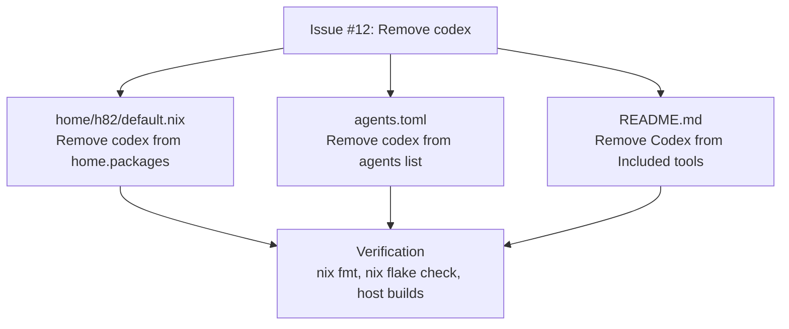

# Remove Codex CLI from Home Packages - Plan

## Goal Capsule

- **Objective:** Remove the unusable `codex` CLI package from user `h82` Home Manager configuration and clean up related project references to prevent closure weight and user profile bloat.
- **Means:** Remove `codex` from `home.packages` in `home/h82/default.nix`, remove `"codex"` from `agents.toml`, and update `README.md` (KTD1).
- **Product Authority:** User environment packages in `home/h82/` and repository agent configuration.
- **Open Blockers:** None.

---

## Product Contract

### Summary

Remove the `codex` package from `home/h82/default.nix`, clean up its entry in `agents.toml`, and update `README.md` documentation to match.

### Problem Frame

The `codex` CLI package is unusable in practice on this machine. Retaining it adds unnecessary closure weight and dead binaries to the user's Home Manager profile. Removing it frees resources and simplifies agent configuration.

### Key Decisions

- **KD1. Remove codex from home packages**: Remove `pkgs.codex` from `home.packages` in `home/h82/default.nix` (session-settled: user-directed via issue #12). Governs R1.
- **KD2. Clean up agents.toml and README.md**: Remove `codex` from `agents.toml`'s active agent roster and from `README.md`'s list of included tools (session-settled: user-directed via issue #12 knock-on effects). Governs R2, R3.
- **KD3. Rely on default Compound Engineering peer fallback**: Do not force an explicit `cross_model_peer` in `.compound-engineering/config.yaml`, allowing the review pass to fall back to the next available tool or local adversarial reviewer naturally per issue #12 guidance. Governs R4.

### Requirements

- R1. `home/h82/default.nix` does not declare `codex` in `home.packages`.
- R2. `agents.toml` does not include `"codex"` in its `agents` array.
- R3. `README.md` does not list `Codex` under the "Included tools" section.
- R4. Nix formatting, flake checks, and both host builds (`ThinkPad-X1-Carbon-Gen-11` and `ThinkPad-X1-Carbon-Gen-11-bootstrap`) evaluate and build cleanly without regressions.

### Acceptance Examples

- AE1. Profile closure and package check
  - **Covers:** R1
  - **Given:** Home Manager configuration for user `h82`.
  - **When:** Evaluated via Nix flake check and host builds.
  - **Then:** `codex` is absent from `home.packages` and the toplevel build completes without error.
- AE2. Agent configuration consistency
  - **Covers:** R2
  - **Given:** Project `agents.toml` file.
  - **When:** Loaded by agent runtimes.
  - **Then:** `agents` contains only `["claude", "opencode", "pi"]`.

### Scope Boundaries

- Other coding agents (`antigravity-cli`, `claude-code`, etc.) remain installed.
- Historical plan files mentioning codex remain unchanged.

### Sources / Research

- Issue #12: `https://github.com/hyperlapse122/nix-config/issues/12`
- `home/h82/default.nix`: line 23 `codex`
- `agents.toml`: line 2 `agents = ["claude", "codex", "opencode", "pi"]`
- `README.md`: line 13 tool enumeration

---

## Planning Contract

### Key Technical Decisions

- KTD1. **Remove `codex` from `home.packages`**: Edit `home/h82/default.nix` to drop `codex`. Governs R1.
- KTD2. **Update `agents.toml`**: Edit `agents.toml` to remove `"codex"`. Governs R2.
- KTD3. **Update `README.md`**: Edit `README.md` to remove `Codex, ` from the tool enumeration. Governs R3.
- KTD4. **Verification via standard checks**: Run `nix fmt -- --ci`, `nix flake check`, and both host toplevel builds. Governs R4.

### High-Level Technical Design

### Assumptions

- No other system modules or custom scripts depend on the `codex` binary being present in PATH.

---

## Implementation Units

### U1. Remove codex package declaration and project references

- **Goal:** Remove `codex` from `home.packages`, `agents.toml`, and `README.md`.
- **Files to Modify:**
  - `home/h82/default.nix`
  - `agents.toml`
  - `README.md`
- **Dependencies:** None.
- **Verification:**
  - `nix fmt -- --ci`
  - `nix flake check`
  - `nix build --no-link .#nixosConfigurations.ThinkPad-X1-Carbon-Gen-11.config.system.build.toplevel`
  - `nix build --no-link .#nixosConfigurations.ThinkPad-X1-Carbon-Gen-11-bootstrap.config.system.build.toplevel`
