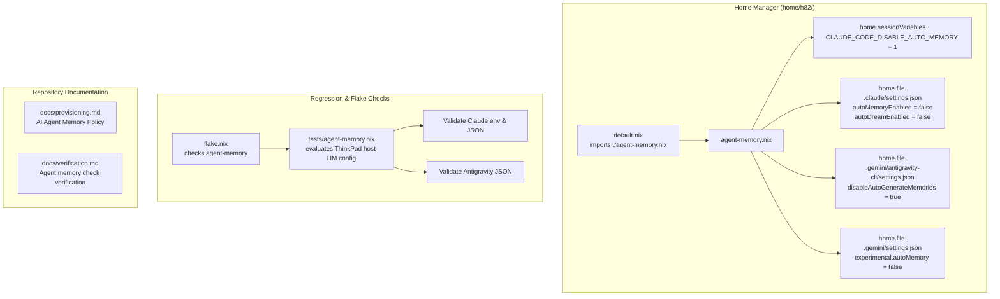

# Disable AI Agent Memory - Plan

## Goal Capsule

- **Objective:** Prevent coding-agent harnesses (`antigravity-cli` and `claude-code`) from reading, writing, or persisting implicit cross-session memory and knowledge items, eliminating undeclared mutable user state and preserving declarative determinism.
- **Means:** Declare `CLAUDE_CODE_DISABLE_AUTO_MEMORY = "1"`, `~/.claude/settings.json` (`autoMemoryEnabled: false`, `autoDreamEnabled: false`), and `~/.gemini/antigravity-cli/settings.json` (`disableAutoGenerateMemories: true`) via a dedicated Home Manager module `home/h82/agent-memory.nix`, add a mutation-tested regression check in `tests/agent-memory.nix` registered in `flake.nix`, and record the behavior in repository docs (KTD1, KTD2, KTD3, KTD4, KTD5).
- **Product Authority:** Home Manager user configuration (`home/h82/`), flake checks (`tests/`, `flake.nix`), and repository documentation (`docs/`).
- **Open Blockers:** None.

---

## Product Contract

### Summary

Add declarative settings under `home/h82/agent-memory.nix` to disable cross-session memory for `antigravity-cli` and `claude-code`. Register a flake check in `flake.nix` asserting the generated configuration, verify it via mutation testing, and document the behavior and decision on existing memory stores.

### Problem Frame

Coding-agent harnesses ship persistent, cross-session memory features (such as Claude Code's Auto Memory and Antigravity's automated memories / knowledge indexing) that write notes and context implicitly during normal use. In this repository, the harnesses are installed declaratively in `home/h82/default.nix`, but their memory features remained unmanaged, leaving mutable state in user directories outside the flake and causing agent behavior to depend on undeclared historical artifacts.

### Key Decisions

- **KD1. Scope restricted to installed harnesses**: Target `antigravity-cli` (`home/h82/default.nix:20`) and `claude-code` (`home/h82/default.nix:22`). `codex` is removed, and `opencode`/`pi` are dotagents targets not packaged in this flake (session-settled: user-directed via issue #18). Governs R1, R2.
- **KD2. Dedicated module in `home/h82/agent-memory.nix`**: Keep coding-agent memory settings consolidated in one single-concern module rather than scattered across general shell or package lists (session-settled: user-directed via issue #18). Governs R3.
- **KD3. Defense-in-depth memory opt-out for Claude Code**: Configure both the environment variable `CLAUDE_CODE_DISABLE_AUTO_MEMORY = "1"` (top-level kill switch) and declarative configuration file `~/.claude/settings.json` with `"autoMemoryEnabled": false` and `"autoDreamEnabled": false` (session-settled: user-approved). Governs R1.
- **KD4. Declarative memory opt-out for Antigravity CLI**: Configure `~/.gemini/antigravity-cli/settings.json` with `"disableAutoGenerateMemories": true` (the Cortex user setting governing automated memory generation) and `~/.gemini/settings.json` with `"experimental": { "autoMemory": false }` (session-settled: user-approved). Governs R2.
- **KD5. Leave existing historical memory stores untouched**: Do not run destructive `rm -rf` scripts during Home Manager activation. With memory features explicitly disabled, neither harness reads or writes to memory directories; avoiding destructive scripts prevents accidental data loss and preserves activation idempotency (session-settled: user-approved). Governs R4.
- **KD6. Flake check with mutation testing**: Add `tests/agent-memory.nix` registered as `checks.${system}.agent-memory` in `flake.nix`, and verify that the check fails when each setting is mutated/removed per repository learnings (session-settled: user-directed via issue #18). Governs R5.
- **KD7. Note behavior in repository documentation**: Document the declarative agent memory policy, opt-out mechanisms, and scope extension in `docs/provisioning.md` and `docs/verification.md` (session-settled: user-directed via issue #18). Governs R6.

### Requirements

- R1. `claude-code` memory is disabled via `home.sessionVariables.CLAUDE_CODE_DISABLE_AUTO_MEMORY = "1"` and `home.file.".claude/settings.json"` specifying `autoMemoryEnabled = false` and `autoDreamEnabled = false`.
- R2. `antigravity-cli` memory is disabled via `home.file.".gemini/antigravity-cli/settings.json"` specifying `disableAutoGenerateMemories = true` and `home.file.".gemini/settings.json"` specifying `experimental.autoMemory = false`.
- R3. The declarative settings reside in `home/h82/agent-memory.nix` and are imported into `home/h82/default.nix`.
- R4. Existing memory files on disk are left untouched; no destructive activation script is executed.
- R5. `flake.nix` registers an `agent-memory` check defined in `tests/agent-memory.nix` validating the generated Home Manager configuration files and session variables.
- R6. The check assertions are mutation-tested (verified to fail when assertions are broken).
- R7. Repository documentation in `docs/provisioning.md` and `docs/verification.md` explains the memory disablement mechanism, the existing store retention decision, and the verification procedure.

### Acceptance Examples

- AE1. Generated Claude Code configuration
  - **Covers:** R1, R3
  - **Given:** Evaluated ThinkPad host configuration.
  - **When:** Inspecting `config.home-manager.users.h82.home.sessionVariables` and `.claude/settings.json`.
  - **Then:** `CLAUDE_CODE_DISABLE_AUTO_MEMORY` equals `"1"`, `autoMemoryEnabled` is `false`, and `autoDreamEnabled` is `false`.
- AE2. Generated Antigravity configuration
  - **Covers:** R2, R3
  - **Given:** Evaluated ThinkPad host configuration.
  - **When:** Inspecting `config.home-manager.users.h82.home.file.".gemini/antigravity-cli/settings.json"`.
  - **Then:** `disableAutoGenerateMemories` is `true`, and `.gemini/settings.json` has `experimental.autoMemory` set to `false`.
- AE3. Regression check passes cleanly
  - **Covers:** R5
  - **Given:** Unmutated repository tree.
  - **When:** Executing `nix build --no-link .#checks.x86_64-linux.agent-memory`.
  - **Then:** The check succeeds with exit code 0.
- AE4. Mutation testing catches missing opt-out
  - **Covers:** R6
  - **Given:** Mutated configuration where `autoMemoryEnabled` is set to `true` or `disableAutoGenerateMemories` is set to `false`.
  - **When:** Executing `nix build --no-link .#checks.x86_64-linux.agent-memory`.
  - **Then:** The check fails with a descriptive error message and non-zero exit code.

### Scope Boundaries

- Out of scope: Packaging or configuring memory for `codex` (removed), `opencode`, or `pi` (not installed by this flake).
- Out of scope: Modifying the developer's non-NixOS host files or running `nixos-rebuild switch`.
- Out of scope: Deleting historical session logs, shell history, or other non-memory state.

### Sources / Research

- GitHub Issue #18: `feat: disable memory for all AI agent harnesses`
- `home/h82/default.nix`: package roster (`antigravity-cli`, `claude-code`)
- Claude Code binary analysis: `CLAUDE_CODE_DISABLE_AUTO_MEMORY` environment flag, `autoMemoryEnabled`, `autoDreamEnabled` in `~/.claude/settings.json`
- Antigravity CLI binary analysis: `disableAutoGenerateMemories` / `disable_auto_generate_memories` in Cortex UserSettings / `~/.gemini/antigravity-cli/settings.json`, `experimental.autoMemory` in `~/.gemini/settings.json`
- `.compound-engineering/artifacts/solutions/best-practices/mutation-testing-reveals-decorative-nix-check-assertions.md`: check assertion design guidelines (no `! cmd`, explicit error exits, mutation verification)

---

## Planning Contract

### Key Technical Decisions

- KTD1. **Create `home/h82/agent-memory.nix`**: Define Home Manager module managing `home.sessionVariables` and `home.file` for `.claude/settings.json`, `.gemini/antigravity-cli/settings.json`, and `.gemini/settings.json` (session-settled: user-directed — chosen over editing user home directory manually: ensures purely declarative NixOS/Home Manager configuration). Governs R1, R2, R3.
- KTD2. **Import module in `home/h82/default.nix`**: Add `./agent-memory.nix` to `imports` in `home/h82/default.nix` alongside existing modules (session-settled: user-directed). Governs R3.
- KTD3. **Retain existing stores without destructive activation scripts**: Add explicit documentation explaining that disabling the memory engine renders historical stores inert, avoiding non-idempotent or hazardous deletion logic in NixOS activation (session-settled: user-approved — chosen over `rm -rf` in activation scripts: prevents accidental loss of files and avoids breaking activation on read-only/locked files). Governs R4.
- KTD4. **Implement check in `tests/agent-memory.nix`**: Write Nix derivation check with `jq` and `gnugrep` inspecting the evaluated `home-manager.users.h82` files and environment variables, using explicit `if ... then exit 1; fi` branches (session-settled: user-directed — chosen over bare inverted grep: prevents decorative passing assertions under `set -e`). Governs R5.
- KTD5. **Register check in `flake.nix`**: Register `agent-memory = import ./tests/agent-memory.nix { inherit pkgs self; };` in `checks.${system}` (session-settled: user-directed). Governs R5.
- KTD6. **Document in `docs/provisioning.md` and `docs/verification.md`**: Note the memory opt-out in agent provisioning and the flake check in verification steps (session-settled: user-directed). Governs R7.

### High-Level Technical Design

### Assumptions

- The ThinkPad host configuration (`nixosConfigurations.ThinkPad-X1-Carbon-Gen-11`) evaluates `home-manager.users.h82`.
- `jq` and `gnugrep` are available in `nixpkgs` for the check derivation.

---

## Implementation Units

### U1. Implement declarative agent memory Home Manager module

- **Goal:** Create `home/h82/agent-memory.nix` configuring memory opt-out for `claude-code` and `antigravity-cli`, and import it into `home/h82/default.nix`.
- **Files to Create/Modify:**
  - `home/h82/agent-memory.nix` (create)
  - `home/h82/default.nix` (modify)
- **Approach:**
  - Declare `home.sessionVariables.CLAUDE_CODE_DISABLE_AUTO_MEMORY = "1";`.
  - Declare `home.file.".claude/settings.json".text` with `builtins.toJSON { autoMemoryEnabled = false; autoDreamEnabled = false; }`.
  - Declare `home.file.".gemini/antigravity-cli/settings.json".text` with `builtins.toJSON { disableAutoGenerateMemories = true; }`.
  - Declare `home.file.".gemini/settings.json".text` with `builtins.toJSON { experimental = { autoMemory = false; }; }`.
  - Import `./agent-memory.nix` in `home/h82/default.nix`.
- **Dependencies:** None.
- **Verification:**
  - `nix eval .#nixosConfigurations.ThinkPad-X1-Carbon-Gen-11.config.home-manager.users.h82.home.sessionVariables.CLAUDE_CODE_DISABLE_AUTO_MEMORY`
  - `nix eval --raw .#nixosConfigurations.ThinkPad-X1-Carbon-Gen-11.config.home-manager.users.h82.home.file.".claude/settings.json".text`
  - `nix eval --raw .#nixosConfigurations.ThinkPad-X1-Carbon-Gen-11.config.home-manager.users.h82.home.file.".gemini/antigravity-cli/settings.json".text`

### U2. Create regression check and register in flake.nix

- **Goal:** Write `tests/agent-memory.nix` asserting the generated Home Manager configuration and register it as `agent-memory` in `flake.nix`.
- **Files to Create/Modify:**
  - `tests/agent-memory.nix` (create)
  - `flake.nix` (modify)
- **Approach:**
  - Follow the architecture of `tests/keyd-remap.nix`: accept `{ pkgs, self }`.
  - Evaluate `host = self.nixosConfigurations.ThinkPad-X1-Carbon-Gen-11;`.
  - Extract `claudeSettings = host.config.home-manager.users.h82.home.file.".claude/settings.json".text;`, `agySettings = host.config.home-manager.users.h82.home.file.".gemini/antigravity-cli/settings.json".text;`, `geminiSettings = host.config.home-manager.users.h82.home.file.".gemini/settings.json".text;`, and `sessionVars = host.config.home-manager.users.h82.home.sessionVariables;`.
  - In `runCommand "agent-memory-tests"`, use `jq` to assert:
    - `.autoMemoryEnabled == false` and `.autoDreamEnabled == false` in `.claude/settings.json`.
    - `.disableAutoGenerateMemories == true` in `.gemini/antigravity-cli/settings.json`.
    - `.experimental.autoMemory == false` in `.gemini/settings.json`.
    - `CLAUDE_CODE_DISABLE_AUTO_MEMORY == "1"` in session variables.
  - Register `agent-memory = import ./tests/agent-memory.nix { inherit pkgs self; };` in `flake.nix`.
- **Dependencies:** U1.
- **Verification:**
  - `nix build --no-link .#checks.x86_64-linux.agent-memory`

### U3. Perform mutation testing on regression check

- **Goal:** Mutate each asserted setting to verify that `tests/agent-memory.nix` catches missing or inverted values and fails appropriately.
- **Files to Inspect:**
  - `home/h82/agent-memory.nix`
  - `tests/agent-memory.nix`
- **Approach:**
  - Mutate `autoMemoryEnabled = true` -> check must fail. Restore.
  - Mutate `disableAutoGenerateMemories = false` -> check must fail. Restore.
  - Mutate `CLAUDE_CODE_DISABLE_AUTO_MEMORY = "0"` -> check must fail. Restore.
  - Confirm all assertions are live and non-decorative.
- **Dependencies:** U2.
- **Verification:**
  - Mutation commands confirm non-zero exit on mutation and clean pass on restore.

### U4. Document agent memory policy and update verification docs

- **Goal:** Update `docs/provisioning.md` and `docs/verification.md` to document the declarative memory disablement, why existing memory stores are left untouched, and how to verify.
- **Files to Modify:**
  - `docs/provisioning.md`
  - `docs/verification.md`
- **Approach:**
  - Add section to `docs/provisioning.md` detailing coding-agent configuration, explaining the declarative opt-out for `antigravity-cli` and `claude-code`, and noting that existing memory stores are left untouched on disk because the harnesses will not interact with them.
  - Add `agent-memory` check to `docs/verification.md`.
- **Dependencies:** U1, U2.
- **Verification:**
  - Documentation review.

---

## Verification Contract

Run the repository verification suite:
1. `nix fmt -- --ci`
2. `nix build --no-link .#checks.x86_64-linux.agent-memory`
3. `nix flake check`
4. `nix build --no-link .#nixosConfigurations.ThinkPad-X1-Carbon-Gen-11.config.system.build.toplevel`
5. `nix build --no-link .#nixosConfigurations.ThinkPad-X1-Carbon-Gen-11-bootstrap.config.system.build.toplevel`

---

## Definition of Done

- [ ] `home/h82/agent-memory.nix` exists and is imported into `home/h82/default.nix`.
- [ ] Memory opt-outs for `claude-code` and `antigravity-cli` are declared.
- [ ] `tests/agent-memory.nix` is created and registered in `flake.nix`.
- [ ] Mutation testing proves the check fails when memory opt-out settings are removed or altered.
- [ ] Existing memory stores are explicitly decided to be left untouched and documented.
- [ ] `docs/provisioning.md` and `docs/verification.md` are updated.
- [ ] All verification builds and checks (`nix fmt -- --ci`, `nix flake check`, and both host toplevel builds) pass cleanly.
