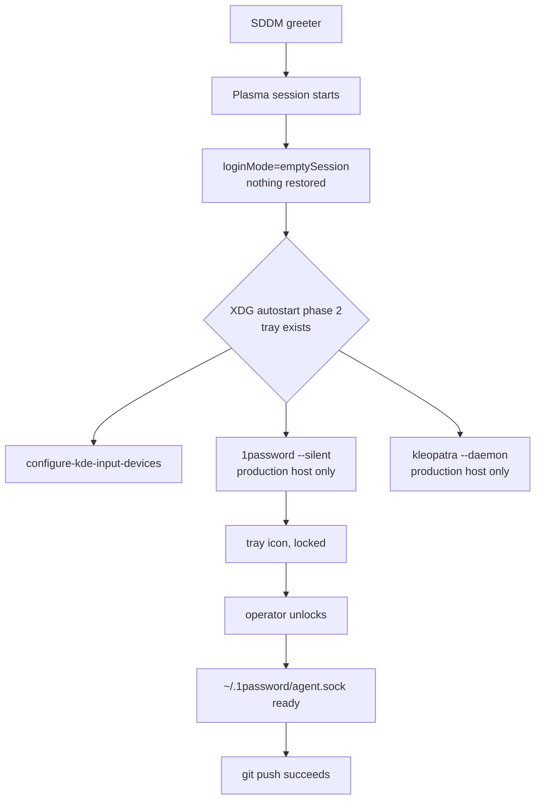
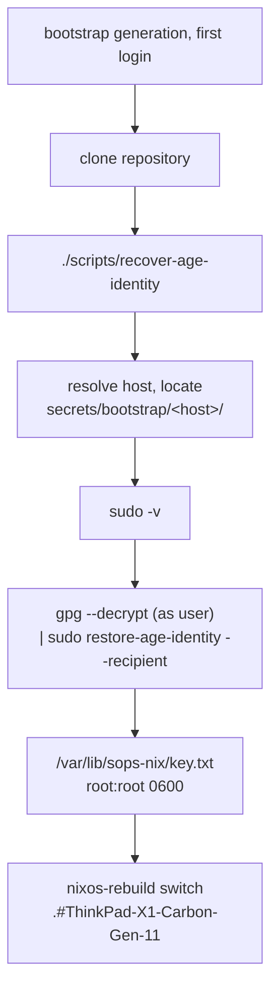

# Desktop CLI and Provisioning Helpers - Plan

## Goal Capsule

- **Objective:** the operator reaches a working desktop session and a recovered machine identity without typing a remembered multi-step command or launching an app by hand. After login the password manager and the key GUI are already running; a rebuild is one short command that says what changed; recovering the age identity on a fresh host is one script that resolves the host itself.
- **Means:** enable the packaged 1Password CLI module, add a host-gated XDG autostart module, add a packaged `nr` rebuild helper with zsh aliases, and replace the hand-typed GPG-to-installer pipe with two repository shell helpers over a host-scoped secret layout (KTD1, KTD3, KTD6, KTD9).
- **Authority:** the repository's `AGENTS.md` governs style, checks, and lifecycle constraints. Where this plan and `AGENTS.md` disagree, `AGENTS.md` wins. The five GitHub issues supply scope; where an issue's stated mechanism is contradicted by evidence from the pinned packages, the evidence wins and the plan records why.
- **Stop conditions:** stop and report rather than guess if `nix flake check` fails for a reason outside the changed files, if a mutation round goes red at evaluation time instead of inside a builder, or if any change would require partitioning, formatting, firmware/TPM key enrollment, or `nixos-rebuild switch` on the developer's host.
- **Execution profile:** configuration and packaging work. Prefer build-time checks plus recorded hardware verification over unit coverage; runtime desktop behavior is not reachable from a check.
- **Finishes and ships:** `ce-work` implements and verifies locally; the calling pipeline opens and lands the pull request.

---

## Product Contract

### Summary

Five open issues share one theme: the machine is declaratively configured but still demands manual steps at the edges. `op` is absent, 1Password and Kleopatra must be launched by hand every session, every rebuild is a long `sudo nixos-rebuild --flake <path>#<host>` line, and recovering the age identity means reproducing a three-line GPG-to-sudo pipe from a README. This change set closes all five: it enables the 1Password CLI module beside the existing GUI module, adds a host-gated autostart module for both tray apps, ships a packaged `nr` rebuild helper with generation diffing and an untracked-file warning, and replaces the hand-typed recovery pipe with two repository helpers over a host-scoped bootstrap secret layout.

### Problem Frame

The flake configures one laptop well but leaves four recurring manual steps in place. Two of them are per-session: nothing starts 1Password, so `~/.1password/agent.sock` is missing until the operator launches it and the first SSH or Git operation of the session fails; nothing starts Kleopatra, and `home/h82/kde/session.nix` sets `loginMode=emptySession`, so KDE restores neither. One is per-rebuild: the full flake-and-attribute command is long enough that it gets shortened by hand, and a newly added module that is still untracked is silently invisible to Nix. One is per-host and the most costly: the age identity recovery pipe is hardcoded to a single host's filenames and must be transcribed correctly under time pressure during installation. Separately, `op` is not installed at all, so no secret can be read from a shell even though the desktop app and its SSH agent are already configured.

### Key Decisions

- **All five issues land as one change set on one branch.** Provenance: user-directed — chosen over five separate pipeline runs: the caller asked for a single `lfg` run over the five issue URLs. Governs R1-R21.
- **An issue's stated mechanism yields to evidence from the pinned packages.** Two issue bodies name a mechanism the evidence contradicts (R2's group membership, and #24's untouched assumption that the flag exists). The plan follows the evidence and records the correction. Governs R2, R6.

### Requirements

**1Password CLI (#26)**

- R1. `op` is installed on the production host through the NixOS module, so it arrives with the setgid wrapper the desktop app requires rather than as a bare package.
- R2. No user is added to the `onepassword-cli` group. The setgid wrapper supplies the effective group; membership is unnecessary. This corrects the issue's third acceptance criterion.
- R3. `op` is available on the bootstrap host too, because both hosts share `modules/nixos/desktop.nix` and the existing GUI module is already unconditional there.
- R4. The manual in-app step ("Settings > Developer > Integrate with 1Password CLI") and the desktop-session-only limitation are documented, because no build-time check can reach either.

**Login autostart (#16, #24)**

- R5. 1Password starts at login on the production host, to the system tray, without a visible window.
- R6. Kleopatra starts at login on the production host, as a UI server with no main window.
- R7. Neither entry is present on the bootstrap host, so the first-boot age-identity recovery is not competing with a card-touching UI server or an account-less password manager.
- R8. Both entries run in KDE autostart phase 2, so they do not race the Plasma system tray and become running-but-unreachable.
- R9. Both entries are declarative; no file under `~/.config/autostart` is edited by hand, and no activation fails on a file the desktop apps' own "start at login" toggles may already have written, however many times they rewrite it.
- R10. The in-app "start at login" toggles become inert once Home Manager owns the paths; this is documented.

**Rebuild workflow (#9)**

- R11. `nrs`, `nrb`, `nrt`, and `nrd` run `nixos-rebuild switch`, `nixos-rebuild boot`, `nixos-rebuild test`, and a no-link toplevel build against the resolved flake directory and host.
- R12. The target host defaults to the running machine's hostname and is overridable.
- R13. The flake directory is resolved from the current working directory's git top level when it contains a `flake.nix`, and the helper fails with a message naming the override rather than guessing.
- R14. Untracked files under the flake directory produce a warning that names them before the build starts, because Nix will not see them.
- R15. A switch, boot, or test reports what changed between the previous and the new system generation.
- R16. Running the helper while booted into the bootstrap variant says so, because the hostname alone cannot distinguish the two configurations.

**Age identity provisioning (#8)**

- R17. Bootstrap age material is stored per host, so a second host can be added without renaming anything.
- R18. A repository script recovers the current host's age identity, resolving the hostname with an override, and preserves the existing boundary exactly: GPG runs as the invoking user, and only `restore-age-identity` crosses into root, on the right-hand side of the pipe.
- R19. A repository script prepares a new host's age identity during onboarding, writing plaintext only into a private per-user runtime directory, never into the repository or the Nix store.
- R20. The recovery helper runs on a freshly installed bootstrap system from a clone, before any development shell is entered. The preparation helper runs on the pre-migration host from the development shell, which is where `docs/provisioning.md` already puts the identity-generation step.
- R21. The rename is naming only. One `tokens.yaml` with one recipient remains, and `secrets/README.md` states that only the host holding that identity can decrypt it.

### Success Criteria

- `nix fmt -- --ci`, `nix flake check`, and both host toplevel builds pass.
- Every new check fails inside its builder, with its own message, under a removal mutation, a content mutation, and a wiring mutation, with a passing baseline round. A round that goes red at evaluation time is not a pass.
- The recovery helper reproduces the exact command `secrets/README.md` documents today, with the filenames resolved rather than typed.

### Scope Boundaries

**In scope:** the twenty-one requirements above, their checks, and the documentation they make stale — including the stale claims in `secrets/README.md` that sit inside prose U9 is already rewriting.

Only zsh is configured for this user: `modules/nixos/base.nix` sets `shell = pkgs.zsh` and no bash or fish Home Manager module exists. Issue #9's cross-shell bullet is therefore satisfied by the packaged `nr` binary being on `PATH` in any shell, with aliases declared for zsh alone.

**Deferred to Follow-Up Work**

- Per-host `tokens.yaml` and per-host `.sops.yaml` creation rules. The rename makes this possible; nothing here needs it while one host exists (R21). Until that work lands, a host prepared by the preparation helper cannot decrypt `secrets/tokens.yaml`, and U9 says so at the point an operator would hit it.
- A fallback for the window between login and 1Password's SSH agent becoming ready. `home/h82/ssh.nix` sets `IdentityAgent` for `Host *` with no fallback, so a Git operation before the agent is serving still fails. How long that window is depends on whether the socket appears while the app is running but locked or only after the operator unlocks it, which U9's hardware check records; autostart removes the manual launch either way, and does not remove the window. Documented, not engineered.
- `op` usage from a non-graphical context (SSH, a tty, a systemd unit). That needs a service-account token, which is a different provisioning story.
- `op` shell completion in `home/h82/shell.nix`. Issue #26 raises it as an open point; the setgid wrapper plus the existing `enableCompletion = true` deliver that issue's acceptance criteria without it, so it is left out of this change set deliberately rather than overlooked.
- The pre-existing `docs/verification.md` claim that the `agent-memory` check asserts `autoDreamEnabled = false`, which `tests/agent-memory.nix` does not assert. No requirement here makes it stale, and correcting it inside a pull request that already closes five issues would widen the diff for an unrelated reason.

**Outside this product's identity**

- Automating a 1Password account sign-in or storing its credentials. Out of scope by the migration plan's R9, and restated here because enabling the CLI invites it.
- Moving the existing `configure-kde-input-devices` autostart entry out of `home/h82/kde/input.nix`. It works; relocating it is churn.

### Dependencies

- `nvd` 0.2.4 exists in the pinned nixpkgs at `pkgs/by-name/nv/nvd` with `pname = "nvd"`, so the `python3-runtime` check shape applies to it unchanged.
- The pinned home-manager NixOS module passes the NixOS configuration into Home Manager modules as `osConfig` (`nixos/common.nix`: `osConfig = config;`), which is how R7's gate reaches `my.bootstrap` without new `flake.nix` plumbing.

---

## Planning Contract

### Key Technical Decisions

- KTD1. **Enable `programs._1password` in `modules/nixos/desktop.nix`, and add nothing else for R1-R3.** The pinned module installs the package, allocates the `onepassword-cli` group, and registers the setgid `op` wrapper. It adds no user to that group, and it does not need to: the wrapper is setgid, so `op` runs with the effective group regardless of membership. The existing `polkitPolicyOwners = [ "h82" ]` on the GUI module is the setting that actually gates CLI integration on Plasma. `nixpkgs.config.allowUnfree` is already true in `modules/nixos/base.nix`, so the unfree CLI package needs no new allowance.
- KTD2. **Do not gate the CLI on `my.bootstrap`.** Both hosts already receive `programs._1password-gui` unconditionally; gating only the CLI would be an inconsistency with no benefit. Rejected alternative: a `lib.mkIf (!config.my.bootstrap)` wrapper, which buys nothing because the bootstrap host is a transient install target and `op` is inert without an account.
- KTD3. **Put both autostart entries in a new `home/h82/kde/autostart.nix`, gated on `osConfig.my.bootstrap`.** The module is a pure `xdg.configFile` declaration with no `home.activation` block, because a `.desktop` file is static state. Gating is what keeps a card-touching UI server and an account-less password manager out of the one first-boot flow that must not fail. Rejected alternative: extending `home/h82/kde/session.nix`, which owns `ksmserverrc` rather than freedesktop autostart.
- KTD4. **Interpolate store paths into `Exec=`, and set `X-KDE-autostart-phase=2`.** Store paths match the one existing precedent at `home/h82/kde/input.nix` and are the only form a build-time check can assert. Phase 2 is what keeps a tray-only app from starting before the Plasma system tray exists; without it the app runs with no reachable window, which is the exact failure #16 exists to prevent. Rejected alternative: a bare `Exec=1password --silent` resolved from `PATH`, which survives a package upgrade without a rebuild but cannot be asserted by any check and would let a missing binary fail silently at login.
- KTD5. **Set `force = true` on the two autostart entries, and change no global Home Manager setting.** 1Password's and Kleopatra's own "start at login" toggles write the same two paths Home Manager is about to own, so without this the activation aborts with "Existing file is in the way". The pinned home-manager's `modules/files/check-link-targets.sh` names this remedy itself ("Set 'force = true' on the related file options", with `xdg.configFile."mimeapps.list".force = true` as its example). Rejected alternative: `home-manager.backupFileExtension` in `mkHost`, which clears only the *first* collision — the same script fails with "Existing file '$backup' would be clobbered by backing up '$targetPath'" once a backup exists — and changes activation semantics for every Home Manager file on both hosts to do it. Also rejected: a documented manual `rm` before the first switch, which fails silently for anyone who does not read the note.
- KTD6. **Ship the rebuild logic as one packaged `nr` script with thin zsh aliases, not as zsh functions.** The script can be shell-checked, unit-tested like `scripts/pinentry-card`, and asserted by a check; a shell function can only be grepped out of a generated `.zshrc`. The aliases are then trivial (`nrs = "nr switch"`), which answers the objection that an alias cannot snapshot the old generation — the script does that, before it invokes `nixos-rebuild`.
- KTD7. **Warn about untracked files; do not block, and do not switch to `--flake path:`.** `path:` would remove the failure mode but copies the entire directory into the store, including gitignored trees such as `.claude/worktrees/`. Warning names the invisible files before the slow build starts, which is what the issue asks for. Rejected alternative: blocking, which breaks the common case of unrelated scratch files.
- KTD8. **Add `/etc/nixos-host-variant`, and make a bootstrap-variant run a hard stop rather than a notice.** `modules/nixos/base.nix` hardcodes the same `networking.hostName` for both hosts, so hostname detection alone would let `nrs` switch a freshly installed bootstrap machine straight onto the Secure Boot and sops configuration that `docs/install.md` deliberately sequences later. A printed warning does not prevent that — `nr` is non-interactive, so the line scrolls past and the switch proceeds — so the marker only earns its cost if the helper refuses and makes the operator name `--host`. Rejected alternative: a notice that leaves the target unchanged, which pays for the marker without buying the protection (R16).
- KTD9. **Write both provisioning helpers as `bash` scripts under `scripts/`, invoked from the clone.** The recovery helper's whole job is a two-stage pipeline whose left side must run unprivileged, and `bash` gives `set -o pipefail` so a GPG failure on that left side is not masked by the installer's exit status. The repository's existing Python scripts are single-process tools with no pipeline to guard, so the convention does not reach this case. Rejected alternative: Python, which would have to reimplement the pipeline's failure propagation and the privilege split by hand. Python is *not* unavailable here — `home/h82/default.nix` lists `python3` in `home.packages` and `home-manager.useUserPackages = true` puts it on the user's `PATH` on both hosts — so availability is not the reason.
- KTD10. **Host-scope the bootstrap material as `secrets/bootstrap/<hostname>/age-key.asc` and `secrets/bootstrap/<hostname>/recipient.txt`; leave `.sops.yaml` and `tokens.yaml` alone.** A directory per host is unambiguous and lets the recovery script list available hosts by listing directories. Nesting breaks `.gitignore`'s `secrets/bootstrap/*.key` pattern, so that rule is widened in the same change. Rejected alternative: per-host `tokens.yaml` files and multiple `.sops.yaml` creation rules, which is real multi-host support and is deferred (R21).
- KTD11. **`restore-age-identity` gains no arguments.** The recovery wrapper resolves the host and the filenames; the root installer keeps its single `--recipient` argument, its stdin-only identity, and its fixed target. Widening the root-side contract would move host resolution across the privilege boundary for no gain.
- KTD12. **New checks assert the materialized outcome, not the attribute that usually implies it.** Every new check reads `enable` beside `text`, resolves `target` with `lib.any` over `lib.attrValues` rather than testing attribute names, guards each config-resolved interpolation behind `lib.optionalString`, opens its builder with `set -x`, writes negative assertions as `if ...; then echo >&2; exit 1; fi`, and asserts over both hosts. The first three rules come from the two captured learnings under `.compound-engineering/artifacts/solutions/best-practices/`. The `enable`-and-`target` rules do not: an `environment.etc` or `xdg.configFile` entry carries an `enable` flag beside its `text`, and Home Manager resolves each entry's destination from `target`, which merely defaults to the attribute name — so a check that reads only `text`, or only tests for an attribute name, stays green while the file is never written or is written by a differently-named entry. Neither gap is reachable by mutating a value, which is why the wiring mutation is required in every round below. Rejected alternative: asserting on attribute names and `text` alone, as the shortest correct-looking check would; it passes every value mutation and still misses a disabled entry and a retargeted one.

No Bake-off ran. The forks this plan resolved — script language, alias-versus-function, warn-versus-block — are each cheap to reverse and settle on evidence already in hand rather than on material that would need developing.

### Assumptions

- Gating the autostart entries off the bootstrap host is the right default. The card-contention risk during first-boot recovery is reasoned from `home/h82/gpg.nix`'s zero-TTL card pinentry and the unregistered Secret Service PIN cache, not observed. Reversing it means removing the `mkIf` gate in `home/h82/kde/autostart.nix` **and** dropping the bootstrap-absence assertion and its mutation scenario from `tests/desktop-autostart.nix`; the check locks the assumption in, so the reversal is two files, not one line.
- Warning rather than blocking on untracked files is the right default for a single-operator machine.
- One `tokens.yaml` remains correct while one host exists.

### High-Level Technical Design

Login-time ordering is the part of this change that prose carries poorly, because R7 and R8 are both about *when* things start.

On the bootstrap host the two gated branches are absent, so first boot reaches the recovery flow with no card-touching process running:

---

## Implementation Units

### U1. Enable the 1Password CLI module

- **Goal:** `op` and its setgid wrapper exist on both hosts.
- **Requirements:** R1, R2, R3
- **Dependencies:** none
- **Files:** `modules/nixos/desktop.nix`
- **Approach:** add `programs._1password.enable = true;` immediately beside the existing `programs._1password-gui` block. Add nothing to `users.users.h82.extraGroups`; see KTD1 for why membership is unnecessary. The module header stays `{ pkgs, ... }`.
- **Patterns to follow:** the adjacent `programs._1password-gui` block in the same file.
- **Test scenarios:** covered by U3; this unit is a two-line option enable with no behavior of its own. Test expectation: none -- pure configuration, asserted by U3's check.
- **Verification:** both host toplevel builds succeed and `config.programs._1password.enable` is true on each.

### U2. Host-gated autostart module for 1Password and Kleopatra

- **Goal:** both tray apps start at login on the production host, in autostart phase 2, and on no other host.
- **Requirements:** R5, R6, R7, R8, R9
- **Dependencies:** none
- **Files:** `home/h82/kde/autostart.nix` (new), `home/h82/kde/default.nix`
- **Approach:**
  1. Create `home/h82/kde/autostart.nix` taking `{ pkgs, lib, osConfig, ... }` and wrapping its body in `lib.mkIf (!osConfig.my.bootstrap)`.
  2. Declare `xdg.configFile."autostart/1password.desktop"` and `xdg.configFile."autostart/kleopatra.desktop"`, each with `text` and `force = true` (KTD5). The 1Password `Exec=` interpolates `osConfig.programs._1password-gui.package`, **not** `pkgs._1password-gui`: the pinned NixOS module declares that option with `apply = pkg: pkg.override { inherit (cfg) polkitPolicyOwners; }`, so the bare package is a different derivation that ships no polkit policy, and launching it would undercut the PolKit integration KTD1 depends on. The Kleopatra `Exec=` interpolates `pkgs.kdePackages.kleopatra`, which is the same derivation `home.packages` installs.
  3. Give both entries `Type=Application`, a `Name`, `Hidden=false`, `NoDisplay=true`, and `X-KDE-autostart-phase=2`; append `--silent` to the 1Password command and `--daemon` to the Kleopatra command.
  4. Add `./autostart.nix` first in `home/h82/kde/default.nix`'s alphabetical `imports` list.
- **Patterns to follow:** the verbatim `.desktop` shape at `home/h82/kde/input.nix`, including `Hidden=false`, `NoDisplay=true`, and the phase-2 line. Do not copy its `home.activation` block; a `.desktop` file needs no activation hook.
- **Execution note:** this is desktop configuration; prefer build-time assertions plus the recorded hardware checks in U9 over any attempt at runtime proof. U3 turns the scenarios below into the check.
- **Test scenarios:** these state what must be true of the generated configuration; U3 implements them as assertions and adds its own mutation rounds.
  - The production host's Home Manager configuration declares `autostart/1password.desktop` with `enable` true and an `Exec=` line ending `/bin/1password --silent`.
  - That `Exec=` path is the store path of `osConfig.programs._1password-gui.package` — the configured, polkit-carrying build — and not of `pkgs._1password-gui`.
  - The production host's configuration declares `autostart/kleopatra.desktop` with `enable` true and an `Exec=` line ending `/bin/kleopatra --daemon`.
  - Both entries carry `X-KDE-autostart-phase=2` and `Type=Application`.
  - Both `Exec=` paths are Nix store paths, not bare command names.
  - Both entries set `force = true`, so an activation meeting a pre-existing `~/.config/autostart/1password.desktop` overwrites it instead of aborting, and keeps doing so if the app rewrites it later.
  - The bootstrap host's configuration declares neither entry.
- **Verification:** both host toplevel builds succeed; the production host's Home Manager configuration carries both entries, the bootstrap host's carries neither.

### U3. Checks for the CLI and the autostart entries

- **Goal:** a removal or rewiring of U1 or U2 fails a check, inside the builder, with its own message.
- **Requirements:** R1, R3, R5, R6, R7, R8, R9
- **Dependencies:** U1, U2
- **Files:** `tests/desktop-autostart.nix` (new), `flake.nix`
- **Approach:**
  1. Write `tests/desktop-autostart.nix` as `{ pkgs, self }`, opening with the repository's `/* Check interface: ... Verifies: ... */` block comment.
  2. Bind both `self.nixosConfigurations` and assert `programs._1password.enable` on each.
  3. For each autostart entry, read the Home Manager `xdg.configFile` attribute with `or null`, assert its `enable` is true and its `force` is true, resolve its destination by `lib.any` over `lib.attrValues` on the resolved `target` rather than trusting the attribute name, and `grep -Fxq` the exact `Exec=` line and the exact `X-KDE-autostart-phase=2` line out of its `.source`.
  4. Build the expected 1Password `Exec=` line from `osConfig`-equivalent state — `host.config.programs._1password-gui.package` — so the assertion tracks the configured build rather than a second evaluation of `pkgs._1password-gui`.
  5. Assert the bootstrap host declares neither entry, written as an `if ...; then echo >&2; exit 1; fi` block.
  6. Guard every store-path interpolation behind `lib.optionalString`, split absent/present, with `exit 1` in the absent branch.
  7. Register the check in `flake.nix`'s `checks.${system}` at the end of the attrset.
- **Patterns to follow:** `flake.nix`'s `kleopatra-gui` for the absent/present `optionalString` split; `ghostty-font` for reading an `xdg.configFile` `.source`; `tests/nix-ld.nix` for asserting across both hosts and for the numbered-assertion builder style.
- **Execution note:** mutation-test this check before trusting it. Run a baseline, then a removal mutation (delete an entry from `home/h82/kde/autostart.nix`), a content mutation (point an `Exec=` at a path the package does not ship), and a wiring mutation (set the entry's `enable = false`, and separately give it a `target` that differs from its attribute name). Read *where* each round went red: a failure raised by the evaluator before any builder ran is a false pass of that round.
- **Test scenarios:**
  - Baseline: the unmutated tree passes.
  - `programs._1password.enable` removed from `modules/nixos/desktop.nix`: red in the builder, naming the option and the host.
  - The 1Password autostart entry deleted: red in the builder with the absent-branch message, not a null-coercion evaluation error.
  - The Kleopatra `Exec=` changed to a binary the package does not ship: red in the builder naming the expected line.
  - `X-KDE-autostart-phase=2` removed from either entry: red in the builder.
  - An entry given `enable = false` beside its `text`: red in the builder, because the check reads `enable`, not only `text`.
  - An entry renamed and given an explicit `target` that still resolves to the same autostart path: still detected, because the check resolves `target` rather than matching attribute names.
  - `force = true` removed from either entry: red in the builder naming the entry, because a collision with the app's own autostart file would otherwise abort activation.
  - The 1Password `Exec=` repointed at `pkgs._1password-gui` instead of the configured package: red in the builder, because the two store paths differ whenever `polkitPolicyOwners` is non-empty.
  - The `mkIf` gate inverted so both entries land on the bootstrap host: red in the builder on the bootstrap assertion.
- **Verification:** `nix build --no-link .#checks.x86_64-linux.desktop-autostart` is green on the unmutated tree, and every scenario above goes red inside the builder.

### U4. Host-variant marker

- **Goal:** a running system can say which of the two configurations built it.
- **Requirements:** R16
- **Dependencies:** none
- **Files:** `modules/nixos/base.nix`
- **Approach:** declare `environment.etc."nixos-host-variant".text` as `bootstrap` or `production`, selected from `config.my.bootstrap`. This requires adding `config` and `lib` to the module header, which is currently `{ pkgs, ... }`.
- **Patterns to follow:** the existing `environment.etc."xdg/*"` declarations in `modules/nixos/desktop.nix`.
- **Test scenarios:** U6 implements these as assertions.
  - The production host declares `/etc/nixos-host-variant` with `enable` true and content `production`.
  - The bootstrap host declares the same entry with content `bootstrap`.
  - The content is derived from `config.my.bootstrap`, so flipping that option flips the marker rather than leaving a hardcoded string.
- **Verification:** both host toplevel builds succeed and each carries the expected marker content.

### U5. `nr` rebuild helper, packaging, and aliases

- **Goal:** `nrs`, `nrb`, `nrt`, and `nrd` work from any directory, name what they target, warn about invisible files, and report what changed.
- **Requirements:** R11, R12, R13, R14, R15, R16
- **Dependencies:** U4
- **Files:** `scripts/nr` (new), `packages/nix-tools.nix` (new), `home/h82/default.nix`, `home/h82/shell.nix`
- **Approach:**
  1. Write `scripts/nr` as a `bash` script with `set -euo pipefail`. Subcommands: `switch`, `boot`, `test`, `build`. Flags: `--host <name>` and `--flake-dir <path>`. Two test seams, both defaulting to production values so ordinary use is unaffected: an environment-variable override for the host-variant marker path (default `/etc/nixos-host-variant`), and a dry-run mode that prints the fully resolved command instead of executing it. Without these the U6 scenarios cannot be written — a `runCommand` builder cannot write `/etc`, and no test may invoke `nixos-rebuild`.
  2. Resolve the flake directory from `--flake-dir`, else the current directory's `git rev-parse --show-toplevel` when that directory contains a `flake.nix`, else exit with a message naming `--flake-dir`.
  3. Resolve the host from `--host`, else the running machine's hostname. When the marker reads `bootstrap` and no `--host` was given, `switch`, `boot`, and `test` exit non-zero naming `--host` rather than proceeding: the hostname is identical on both configurations, so defaulting would switch a freshly installed bootstrap machine onto the Secure Boot and sops configuration that `docs/install.md` sequences later, and a printed warning cannot stop a non-interactive command (KTD8). `build` is unprivileged and does not stop.
  4. Warn on untracked files: run `git status --porcelain` in the flake directory and, for any `??` entries, print them to stderr under a line saying Nix will not see them. Continue (KTD7).
  5. Snapshot the current generation before invoking `nixos-rebuild`, then diff after success. `switch` and `test` activate, so their snapshot and comparison both use `/run/current-system`. `boot` does **not** activate — the system keeps running the previous configuration until reboot — so its comparison uses `/nix/var/nix/profiles/system`, the profile `nixos-rebuild boot` does update. Run `nvd diff` unprivileged.
  6. `build` runs `nix build --no-link` on the host's toplevel and takes no sudo and no diff, matching the two commands in `AGENTS.md`.
  7. Prime credentials with `sudo -v` before a privileged subcommand so the sudo prompt does not collide with later output.
  8. Package it in a new `packages/nix-tools.nix` taking `{ pkgs }`, following `packages/gpg-tools.nix`'s `stdenvNoCC.mkDerivation` shape with `dontUnpack`, `install -Dm755`, `substituteInPlace --replace-fail` for the `nvd` and `git` store paths, `patchShebangs`, and `meta.mainProgram`. Do **not** substitute a `nixos-rebuild` store path: the pinned `nixos-rebuild` attribute is an alias for `nixos-rebuild-ng`, and the NixOS module builds the system's own copy with `override { nix = config.nix.package; }`, so a baked path would invoke a build wired to a different nix than the running system's. Call `nixos-rebuild` from `PATH` so the running system's copy is used.
  9. Add the packaged helper to `home.packages` in `home/h82/default.nix`, keeping the list alphabetical. `nvd` does not go in `home.packages`: its store path is substituted into the script, so a `home.packages` entry would be an unused proxy rather than the thing R15 depends on.
  10. Add `programs.zsh.shellAliases` to `home/h82/shell.nix` mapping `nrs`, `nrb`, `nrt`, `nrd` onto the four subcommands.
- **Patterns to follow:** `packages/gpg-tools.nix` for the packaging idiom and the `@TOKEN@` substitution convention; `home/h82/git.nix`'s absolute-store-path interpolation for reaching other binaries.
- **Execution note:** run `shellcheck` on `scripts/nr`; it is already in the dev shell.
- **Test scenarios:**
  - `nr build --flake-dir <fixture>` resolves the host from the fixture's hostname source and prints the resolved flake reference.
  - `nr switch --host other-host` uses the override rather than the detected hostname.
  - Run from a directory outside any git repository with no `--flake-dir`: exits non-zero with a message naming `--flake-dir`.
  - Run from a git repository that has no `flake.nix`: same failure, not a silent fallback.
  - A fixture flake directory containing one untracked file: the file's path appears on stderr and the command still proceeds.
  - A fixture flake directory that is clean: no untracked-file warning is printed.
  - A marker fixture reading `bootstrap` with no `--host`: `switch`, `boot`, and `test` each exit non-zero with a message naming `--host`, and no rebuild command is emitted.
  - A marker fixture reading `bootstrap` with an explicit `--host`: the command is emitted normally.
  - A marker fixture reading `bootstrap` with the `build` subcommand: emitted normally, because it is unprivileged.
  - The marker absent: no stop, no failure.
  - `switch` emits a diff against `/run/current-system`; `boot` emits a diff against `/nix/var/nix/profiles/system`.
  - An unknown subcommand: exits non-zero with usage.
- **Verification:** the shell test in U6 passes and `shellcheck scripts/nr` is clean.

### U6. Tests and check for the rebuild helper

- **Goal:** the helper's resolution, warning, and dispatch logic are covered, and the declarative wiring is asserted.
- **Requirements:** R11, R12, R13, R14, R15, R16
- **Dependencies:** U4, U5
- **Files:** `tests/nr.sh` (new), `tests/nixos-rebuild-helper.nix` (new), `flake.nix`
- **Approach:**
  1. Write `tests/nr.sh` taking the script under test as `$1`, following `tests/pinentry-card.sh`'s `fail()`/`pass()` helpers and its `<name>: FAIL: ...` / `<name>: ok - ...` output. Drive it through U5's dry-run mode and marker-path override, so no test invokes `nixos-rebuild` or touches `/etc`.
  2. Write `tests/nixos-rebuild-helper.nix` as `{ pkgs, self }` asserting the four aliases resolve to the four subcommands, that the packaged helper is in `home.packages`, that the built script carries the substituted `nvd` store path and its diff invocation, and that `/etc/nixos-host-variant` is enabled with the right content on both hosts. Assert the built script rather than a `home.packages` entry for `nvd`: a package list entry is a proxy the script does not read, which is the substitution KTD12 exists to reject. Apply KTD12 throughout.
  3. Register both in `flake.nix`: the shell test as an inline `pkgs.runCommand` following the `pinentry-card` shape, the Nix check as an `import ./tests/nixos-rebuild-helper.nix { inherit pkgs self; }`.
- **Patterns to follow:** `flake.nix`'s `pinentry-card` for running a shell test over a copied script; `python3-runtime` for the `pname` membership assertion; `kleopatra-gui` for the `optionalString` guard.
- **Execution note:** mutation-test the Nix check: remove an alias, change an alias's target, remove the packaged helper from `home.packages`, drop the diff invocation from `scripts/nr`, and set the `environment.etc` entry's `enable = false`. The last one is the round that separates a check on the output from a check on the declaration.
- **Test scenarios:** the scenarios listed in U5, driven through `tests/nr.sh`, plus:
  - Alias `nrs` removed from `home/h82/shell.nix`: the Nix check goes red in the builder naming the alias.
  - Alias `nrt` repointed at `nr switch`: red, because the check asserts the mapping and not merely the key's presence.
  - The packaged helper removed from `home.packages`: red in the builder, not a null-coercion evaluation error.
  - The `nvd diff` invocation deleted from `scripts/nr`: red in the builder, so R15 cannot be dropped silently.
  - `environment.etc."nixos-host-variant".enable = false`: red in the builder.
- **Verification:** both new checks are green on the unmutated tree and red inside the builder for every mutation above.

### U7. Host-scoped bootstrap secret layout

- **Goal:** bootstrap age material is addressed by host, and the ignore rules still cover it.
- **Requirements:** R17, R21
- **Dependencies:** none
- **Files:** `secrets/bootstrap/ThinkPad-X1-Carbon-Gen-11/age-key.asc` (moved), `secrets/bootstrap/ThinkPad-X1-Carbon-Gen-11/recipient.txt` (moved), `.gitignore`
- **Approach:**
  1. Move `secrets/bootstrap/thinkpad-age-key.asc` to `secrets/bootstrap/ThinkPad-X1-Carbon-Gen-11/age-key.asc` and `secrets/recipient.txt` to `secrets/bootstrap/ThinkPad-X1-Carbon-Gen-11/recipient.txt`, preserving contents byte for byte.
  2. Widen both plaintext guards to the nested layout — `secrets/**/*.key` and `secrets/**/*.plain.*` — because a gitignore `*` does not cross a directory separator, so the existing `secrets/bootstrap/*.key` and `secrets/*.plain.*` patterns both stop at the depth the new per-host directories add.
  3. Leave `.sops.yaml` and `secrets/tokens.yaml` untouched (KTD10, R21).
- **Patterns to follow:** the existing `.gitignore` entries for `secrets/`.
- **Test scenarios:** no behavior changes and no `.nix` file or test references either old path, so the move is inert to the build. Test expectation: none -- a file move with no consumer in the evaluated configuration; U8's script tests cover the new layout's resolution and U9 covers the documentation that does reference it.
- **Verification:** `nix flake check` and both builds still pass; `git grep` finds no surviving reference to either old path outside historical plan artifacts.

### U8. Recovery and preparation helpers

- **Goal:** one command recovers the current host's identity, and one command prepares a new host's.
- **Requirements:** R18, R19, R20, R21
- **Dependencies:** U7
- **Files:** `scripts/recover-age-identity` (new), `scripts/prepare-age-identity` (new), `tests/age-identity-helpers.sh` (new), `flake.nix`
- **Approach:**
  1. `scripts/recover-age-identity`: `bash`, `set -euo pipefail`. Refuse to run when `id -u` is 0, naming the boundary — GPG must run as the invoking user, and `sudo ./scripts/recover-age-identity` is the likely reflex because the pipeline it replaces contains `sudo` and the surrounding `docs/install.md` steps are privileged. Resolve the host from `--host`, else the machine's hostname. Locate `secrets/bootstrap/<host>/age-key.asc` and `.../recipient.txt` relative to the script's own repository root. When the directory is missing, exit non-zero listing the hosts that do have one. Prime with `sudo -v`, then run exactly the documented pipeline: `gpg --batch --no-tty --decrypt -- <asc>` as the invoking user, piped into `sudo -- /run/current-system/sw/bin/restore-age-identity --recipient "$(cat <recipient>)"`. `pipefail` is what makes a GPG failure visible rather than masked by the installer's status. Provide the same two test seams U5 defines — a dry-run mode that prints the resolved pipeline, and an override for the `restore-age-identity` binary path — because the hardcoded `/run/current-system/...` path cannot be stubbed through `PATH`.
  2. `scripts/prepare-age-identity`: `bash`, `set -euo pipefail`, `umask 077`. Refuse to run as root, so the identity and both output files cannot be written into the operator's clone by root. Create a private directory under `/run/user/$(id -u)`, generate the identity there with `age-keygen`, write the recipient to `secrets/bootstrap/<host>/recipient.txt`, and encrypt the identity to the card's OpenPGP encryption subkey into `secrets/bootstrap/<host>/age-key.asc`. Before the exit trap removes the runtime directory, decrypt that `.asc` back through GPG and compare its derived age recipient against the generated one; on mismatch, fail and remove both written files. `secrets/README.md` already makes a verified decrypt a precondition of installing, and with one recipient for the whole repository an unopenable `.asc` loses the machine identity and every token encrypted to it — so the check belongs in the helper, not only in prose. Refuse rather than overwrite when the host directory already exists. Never write plaintext into the repository, and never pass the identity as an argument.
  3. Write `tests/age-identity-helpers.sh` covering both scripts against fixture directories and fake keys, in the `tests/pinentry-card.sh` style, driving them through the dry-run mode and path overrides so no test touches a card, `sudo`, or `/var/lib`.
  4. Register the shell test in `flake.nix` following the `pinentry-card` shape.
- **Patterns to follow:** the exact pipeline in `secrets/README.md` lines 44-48 — the wrapper resolves filenames and changes nothing else about it; `scripts/restore-age-identity`'s injectable-parameter style for testability; `tests/pinentry-card.sh` for shell-test structure.
- **Execution note:** the security boundary is the point of this unit. The wrapper must never be invoked wholly under `sudo`; GPG stays on the user's side of the pipe. Use only fake keys in tests, per `AGENTS.md`.
- **Test scenarios:**
  - `recover-age-identity` with a fixture host directory present: emits the exact two-stage pipeline with the resolved paths, GPG on the left of the pipe and `sudo` on the right.
  - `recover-age-identity --host <name>` with no matching directory: exits non-zero and lists the available host directories.
  - `recover-age-identity` in the rescue context where the hostname is `nixos` and no directory matches: the same failure path, with the message naming `--host`.
  - A GPG failure on the left of the pipe: the script exits non-zero rather than reporting the installer's status.
  - `prepare-age-identity` with a fixture recipient: writes both files under `secrets/bootstrap/<host>/` and leaves no plaintext behind.
  - `prepare-age-identity` where the written `.asc` does not decrypt back to the generated identity: the helper fails and leaves neither output file behind.
  - `prepare-age-identity` interrupted after key generation: the trap removes the temporary directory.
  - `prepare-age-identity` for a host whose directory already exists: refuses rather than overwriting existing material.
  - Each script invoked with an effective uid of 0: exits non-zero naming the boundary, before any GPG or file write.
  - Neither script prints key material on success or on any failure path.
- **Verification:** the shell test passes, `shellcheck` is clean on both scripts, and a dry read of the emitted recovery command matches `secrets/README.md`'s documented pipeline token for token apart from the resolved paths.

### U9. Documentation

- **Goal:** every document that describes a step this change set removed or changed is correct again.
- **Requirements:** R4, R10, R17, R18, R21
- **Dependencies:** U1, U2, U5, U7, U8
- **Files:** `secrets/README.md`, `docs/provisioning.md`, `docs/install.md`, `docs/recovery.md`, `docs/verification.md`, `README.md`
- **Approach:**
  1. `secrets/README.md`: replace the hand-typed pipeline with the recovery helper invocation, keep the security-boundary paragraph verbatim because it states the invariants U8 must preserve, keep the verified-decrypt-before-installing requirement because U8 now enforces it, re-point the filenames to the host-scoped layout, state that one `tokens.yaml` means only the host holding that identity can decrypt it (R21), and fix the stale claims that `recipient.txt` and the `.asc` are absent and that the `.sops.yaml` recipient is a placeholder — all three are committed and populated today.
  2. `docs/provisioning.md`: replace the `age-keygen`/`gpg --armor --encrypt` block with the preparation helper, **keeping the `nix develop` line** — that block runs on the pre-migration host, where `age` is not otherwise installed (R20). Re-point the `sops --encrypt` recipient path. State that a host prepared by the helper cannot decrypt `secrets/tokens.yaml` until that file is re-encrypted to its recipient, cross-referencing the deferred per-host `.sops.yaml` work. Add one sentence beside the existing "Settings > Developer" SSH-agent paragraph covering the 1Password CLI integration toggle and the fact that `op` authorizes only inside a desktop session (R4).
  3. `docs/install.md`: point the "Prepare local decryption and signing keys" section and prepare-list item 1 at the recovery helper.
  4. `docs/recovery.md`: state that `--host` is required in the rescue path, because inside the installation media and `nixos-enter` the hostname is not the configuration name.
  5. `docs/verification.md`: append the new checks to the single descriptive paragraph in registration order, and add hardware checklist items for `op --version`, an `op` read authorized through the desktop app, and Kleopatra's tray icon after login. For the SSH agent, record the observed behavior rather than assuming it: whether `~/.1password/agent.sock` exists while 1Password is running but still locked, or only after the operator unlocks it — that answer sizes the window the Scope Boundaries deferral describes. Note that the in-app "start at login" toggles are now inert (R10).
  6. `README.md`: add the 1Password CLI and Kleopatra to the user-visible software list.
- **Patterns to follow:** each document's existing heading shape, unwrapped one-paragraph-per-line prose, and flat `- [ ]` checklist style.
- **Test scenarios:** documentation only. Test expectation: none -- prose changes with no evaluated behavior; the hardware items they add are recorded manually per `docs/verification.md`.
- **Verification:** every command shown in the docs matches what the scripts actually accept, and no document still names `secrets/bootstrap/thinkpad-age-key.asc` or `secrets/recipient.txt`.

---

## Verification Contract

| Gate | Command | Applies to |
| --- | --- | --- |
| Formatting | `nix fmt -- --ci` | all units |
| Evaluation and checks | `nix flake check` | all units |
| Production build | `nix build --no-link .#nixosConfigurations.ThinkPad-X1-Carbon-Gen-11.config.system.build.toplevel` | all units |
| Bootstrap build | `nix build --no-link .#nixosConfigurations.ThinkPad-X1-Carbon-Gen-11-bootstrap.config.system.build.toplevel` | all units |
| Autostart and CLI check | `nix build --no-link .#checks.x86_64-linux.desktop-autostart` | U1, U2, U3 |
| Rebuild helper checks | `nix build --no-link .#checks.x86_64-linux.nr` and `.#checks.x86_64-linux.nixos-rebuild-helper` | U4, U5, U6 |
| Provisioning helper test | `nix build --no-link .#checks.x86_64-linux.age-identity-helpers` | U7, U8 |
| Shell lint | `shellcheck scripts/nr scripts/recover-age-identity scripts/prepare-age-identity` | U5, U8 |

Every new check is mutation-tested per KTD12 before it is trusted: a baseline round, a removal round, a content round, and a wiring round, each read for *where* it went red. A round that failed at evaluation time proves nothing and is repeated with the guard in place.

Hardware verification is recorded separately and never substituted by a build, per `AGENTS.md` and `docs/verification.md`. `nixos-rebuild switch` is not run as validation, and nothing here partitions, formats, or enrolls keys.

---

## Definition of Done

- All twenty-one requirements are implemented.
- Every gate in the Verification Contract passes.
- Every new check has been mutation-tested in all four rounds, with the failing round's message read out of the builder rather than inferred from the exit code.
- No document names a path or a command this change set removed.
- No plaintext key material is committed, printed, or written outside a private per-user runtime directory.
- Abandoned or experimental code from approaches that did not work out is removed from the diff.
- The pull request reports check and build results and closes all five issues.

---

## System-Wide Impact

- **Privilege boundary.** U8 is the only unit near it. The boundary `secrets/README.md` states — GPG as the invoking user, one crossing into root for `restore-age-identity`, identity on stdin, recipient in argv — is preserved verbatim; the wrapper resolves filenames on the user's side and nothing else moves. `restore-age-identity` gains no arguments (KTD11), so the root-side attack surface is unchanged.
- **Host parity.** Three units now differ by host: U2's autostart entries are absent on bootstrap by design, U4's marker differs by content, and U1 is deliberately identical on both. Every new check asserts both configurations, because a module gated on `my.bootstrap` with a production-only check leaves the bootstrap system unguarded while the check stays green.
- **Home Manager file ownership.** U2 makes Home Manager the owner of two paths the desktop apps themselves write, so after this change the in-app "start at login" toggles are inert. `force = true` is scoped to those two entries (KTD5), so activation behavior for every other Home Manager file is unchanged, and an app that rewrites its autostart file later is overwritten again rather than colliding.
- **Session startup ordering.** U2 adds two entries to a phase that previously held one. The `X-KDE-autostart-phase=2` requirement is what keeps them from racing the tray; the High-Level Technical Design diagram carries the ordering.
- **Secret layout consumers.** U7 moves two files that no `.nix` file and no test reference by name; the only consumers are prose in `secrets/README.md` and `docs/provisioning.md`, plus the new U8 scripts. `.sops.yaml` and `my.cliAuth.sopsFile` are untouched, so `tests/auth-provisioning.nix` needs no new case.
- **Check registration surface.** Four new checks join `flake.nix`'s `checks.${system}`, which lengthens `nix flake check`. All four are evaluation-and-`runCommand` checks, not VM tests, so they add no `/dev/kvm` requirement.

---

## Risks & Dependencies

- **Activation after U2 overwrites whatever the apps wrote** to the two autostart paths, by design (KTD5). An operator who had customized either file by hand loses that edit. Detection is immediate and the content is two declarative lines in the repository.
- **The bootstrap gate depends on `osConfig`.** The pinned home-manager passes it (`nixos/common.nix`), but if that changed, U2 fails at evaluation rather than silently — an acceptable failure mode, and the build gates catch it.
- **`nvd` output is not a stable interface.** U5 only invokes it; nothing parses its output, so an upstream format change is cosmetic.
- **`--flake path:` is deliberately not used** (KTD7), so a rebuild still cannot see untracked files. The warning makes that visible rather than fixing it; the operator stages the file.
- **The SSH socket race survives this change** (Scope Boundaries). Autostart narrows the window; it does not remove it.

---

## Sources & Research

- Pinned nixpkgs `nixos/modules/programs/_1password.nix`: the module installs `_1password-cli`, allocates `users.groups.onepassword-cli`, and registers a setgid-only `security.wrappers."op"`. It adds no user to the group — the evidence behind R2 and KTD1.
- Pinned 1Password 8.12.34 `share/1password/resources/app.asar`: the application's own argument parser declares `--silent` as "open to the system tray without showing the main window" — the evidence behind R5.
- Pinned Kleopatra 26.08.1 binary: the option name `daemon` is present with the description "Run UI server only, hide main window" — the evidence behind R6.
- 1Password documentation, CLI app integration: the "Settings > Developer > Integrate with 1Password CLI" toggle is a manual in-app step, and a running PolKit authentication agent is required — the evidence behind R4.
- NixOS Wiki, 1Password: the recommended configuration is `programs._1password.enable` plus `programs._1password-gui` with `polkitPolicyOwners`, with no group membership; PolKit integration is what CLI integration needs on Plasma.
- Pinned home-manager `nixos/common.nix` line 30 (`osConfig = config;`): the mechanism behind U2's bootstrap gate.
- Pinned home-manager `modules/files/check-link-targets.sh`: line 30 fails with "Existing file '$backup' would be clobbered by backing up '$targetPath'" once a backup exists, and lines 96-101 name `home-manager.backupFileExtension` and `force = true` as the two remedies, with `xdg.configFile."mimeapps.list".force = true` as the example — the evidence behind KTD5's choice of the scoped remedy over the global one.
- Pinned nixpkgs `nixos/modules/programs/_1password-gui.nix`: the `package` option carries `apply = pkg: pkg.override { inherit (cfg) polkitPolicyOwners; }`, so `pkgs._1password-gui` and `config.programs._1password-gui.package` are different derivations — the evidence behind U2's `Exec=` source.
- `nixos-rebuild boot` sets the system profile and bootloader without activating, so `/run/current-system` still points at the old generation afterwards — the evidence behind U5's split diff target.
- `home/h82/default.nix` and `flake.nix`'s `home-manager.useUserPackages = true`: `python3` reaches the user's `PATH` on both hosts, which is why KTD9 does not rest on Python being unavailable.
- `.compound-engineering/artifacts/solutions/best-practices/mutation-testing-reveals-decorative-nix-check-assertions.md`: negative assertions must be `if ...; then echo >&2; exit 1; fi`, never `! cmd`; whole-file greps are section-blind.
- `.compound-engineering/artifacts/solutions/best-practices/unguarded-derivation-interpolation-defeats-nix-check-mutation-testing.md`: guard every config-resolved store-path interpolation behind `lib.optionalString` so a removal mutation fails inside the builder.
- `.compound-engineering/artifacts/solutions/integration-issues/sops-service-umask-blocks-user-secrets.md`: the permission boundaries `scripts/restore-age-identity` enforces, and the `auth-provisioning` VM check that already covers recovery through the packaged installer.
- `modules/nixos/base.nix` line 9: `networking.hostName` is identical for both hosts — the evidence behind KTD8.
- `flake.nix` `kleopatra-gui`, `ghostty-font`, `python3-runtime`, and `tests/nix-ld.nix`: the four check shapes U3 and U6 follow.
