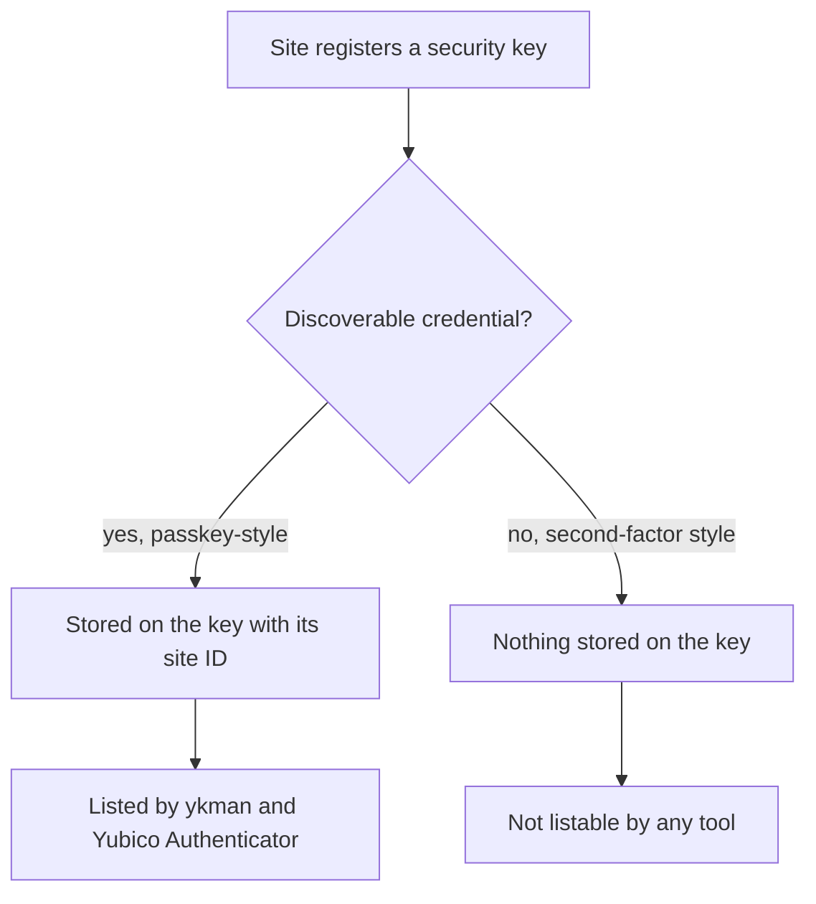
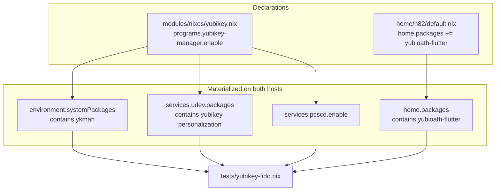

# YubiKey FIDO Credential Inventory Tooling - Plan

## Goal Capsule

- **Objective:** h82 can find out which sites a YubiKey holds FIDO credentials for, from an ordinary terminal or from the desktop, without entering the development shell and without any manual permission setup.
- **Means:** Declare the upstream Yubico tools in this flake — the `ykman` CLI through the `programs.yubikey-manager` NixOS module (KTD1) and Yubico Authenticator as a Home Manager user package (KTD5). Write no helper script.
- **Product authority:** This plan owns how those tools reach the user and what the user is promised about the result. It does not own the OpenPGP card PIN handling in `scripts/pinentry-card`, the age identity recovery path, or any FIDO credential lifecycle operation.
- **Stop conditions:** Stop and report rather than guessing if a new check cannot be made to fail for its own reason during mutation testing, if enabling the module makes either host's `toplevel` build fail, or if any existing check turns red.
- **Execution profile:** Declarative NixOS and Home Manager configuration plus one repository check. No runtime code. Activation on the developer's machine is explicitly out of bounds — see Scope Boundaries.
- **Who finishes:** `ce-work` implements and verifies through the Verification Contract; the hardware checklist entries are performed later by the person holding the cards.

---

## Product Contract

**Product Contract preservation:** no requirement text, R-ID, or settled decision changed. Two corrections landed on evidence gathered during planning: the Outstanding Questions are resolved — the module-versus-manual choice into KTD1, the desktop-entry question into KTD5, the check-shape question into KTD6 — and the Problem Frame's claim that missing udev rules would block the CLI was found to be false and rewritten, with the mechanism that actually satisfies R4 moved into KTD7 and the Assumptions.

### Summary

Make the two upstream YubiKey tools first-class parts of this configuration: `ykman` available system-wide instead of only inside `nix develop`, and Yubico Authenticator installed as a desktop app for h82. Both read the discoverable FIDO credentials on an inserted key and name the site each one belongs to.

### Problem Frame

The repository already carries `yubikey-manager`, but only as a development-shell entry (`flake.nix:258-269`). Answering "which sites are on this key?" therefore means remembering that the tool exists, entering `nix develop`, and running a command — three steps for a question that comes up while doing something else entirely, usually away from a checkout of this repo.

Device access looks like a second gap but is not one. FIDO goes through hidraw rather than the smart-card path GPG uses, and the `yubikey-manager` package ships no udev rules — the upstream NixOS module says so in its own comment and pulls rules from `yubikey-personalization` to compensate. Those rules are not what grants FIDO access: systemd already tags any hidraw device declaring the FIDO usage page and hands the seat's logged-in user access to it, whatever the vendor. What remains true is that the two access paths are independent, which is the split recorded in `.compound-engineering/artifacts/solutions/integration-issues/tmpfs-gnupghome-card-provisioning-traps.md`, where `ykman info` succeeded on a card `gpg` could not select — so a working credential listing is never evidence that signing still works.

There is also a hard limit on what any tool can answer. A FIDO credential is either discoverable, stored on the key with its relying-party ID, or non-discoverable, in which case the key keeps no record of it at all and the site is unlistable by construction. Second-factor registrations are commonly the latter. Unless that limit is stated where the user will meet it, a missing site reads as a broken tool.

### Key Decisions

- **Ship the upstream tools as they are; write no wrapper script.** `ykman fido credentials list` already prints the relying-party ID and username for every discoverable credential, so a helper in `scripts/` would carry maintenance without adding information. (session-settled: user-directed — chosen over a packaged helper script following the `scripts/` + `packages/` + `tests/` pattern: the upstream output already answers the question.) Governs R1, R2.
- **The CLI is declared at system level, the GUI as a user package.** FIDO access needs udev rules, which only a system-level option can install, so the CLI departs from this repository's convention that user applications are declared under `home/h82/`. The GUI keeps that convention. Governs R1, R2, R4.
- **Yubico Authenticator is the GUI.** `yubikey-manager-qt` was removed from nixpkgs on 2025-06-07 after upstream archived it, and its removal message names `yubioath-flutter` as the replacement. (session-settled: user-approved — chosen over the older Qt application, which no longer exists in the pinned nixpkgs.) Governs R2.
- **Inventory only.** The immediate need is reading one inserted key, and the Secret Service entries this repository already maintains hold the OpenPGP User PIN, which the FIDO2 application does not use — so extending them is new work rather than reuse. (session-settled: user-directed — chosen over a wrapper that also automates the FIDO2 PIN, compares the three cards, and deletes credentials.) Governs R7.

### Requirements

**Availability**

- R1. `ykman` runs from an ordinary login shell and from a desktop session without entering the development shell.
- R2. Yubico Authenticator is installed for h82 and appears in the Plasma application launcher.
- R3. The development shell keeps shipping `ykman`, so the existing `yubikey-manager-shell` check keeps guarding a real guarantee.
- R4. An inserted YubiKey is reachable by both tools with no manual permission step after a rebuild: device access rules and the smart-card daemon are part of the declared configuration.

**Honest reporting of the limit**

- R5. The repository documentation states that only discoverable credentials can be listed, so a site that does not appear is read as expected behavior rather than a fault.

**Non-regression**

- R6. Git signing, automatic card PIN entry, and routine rebuilds behave exactly as they do today, including a rebuild that succeeds with no YubiKey inserted.
- R7. No FIDO2 PIN is stored, prompted for outside the tools' own prompts, or written into any keyring entry.

**Verification**

- R8. Each new declaration is guarded by a flake check in the style the repository already uses for package presence, and `docs/verification.md` records what a human must confirm against real hardware.

### Key Flows

- F1. Read the sites on an inserted key
  - **Trigger:** h82 wants to know which sites a particular YubiKey covers.
  - **Steps:** Insert the key in any session. Run the credential-listing command, or open Yubico Authenticator and go to its passkey view. Enter the FIDO2 PIN when the tool asks. Read the site list.
  - **Outcome:** Every discoverable credential on that key is shown with its site and username.
  - **Covered by:** R1, R2, R4, R5

### Acceptance Examples

- AE1. **Covers R1, R4.** Given a fresh login shell with no development shell entered, when h82 inserts a YubiKey and lists its FIDO credentials, then the tool reaches the key's FIDO application with no permission error. An empty list passes, and so does a refusal naming an unset FIDO2 PIN: neither setting a PIN nor creating a credential is in scope, so neither absence counts against R1 or R4.
- AE2. **Covers R5.** Given a site whose security key was registered as a non-discoverable credential, when the credential list is shown, then that site is absent, and the documentation the user was pointed at says this is expected.
- AE3. **Covers R6.** Given no YubiKey inserted, when the configuration is rebuilt and activated, then the rebuild succeeds and needs no card.
- AE4. **Covers R6.** Given a registered card inserted, when h82 signs a Git commit, then signing proceeds through the existing PIN proxy without a new prompt, whether or not the GUI is running.

### Scope Boundaries

- FIDO2 PIN automation, and any reuse or extension of the existing `gnupg-card-pin` Secret Service entries.
- Comparing credentials across the three cards, or detecting a site registered on one card but missing from another.
- Creating, renaming, or deleting credentials; changing, setting, or resetting a FIDO2 PIN.
- Managing the OATH, PIV, or OTP applications, even though both tools can reach them.
- Any attempt to surface non-discoverable credentials. The key stores nothing for them, so no tool can list them.
- Autostarting Yubico Authenticator at login. `home/h82/kde/autostart.nix` stays untouched.
- Activating the change on the developer's machine. AGENTS.md forbids `nixos-rebuild switch` as validation; building both `toplevel` outputs is where this plan's automated proof ends.

#### Deferred to Follow-Up Work

- Retiring `ykman` from the development shell, which would also retire the `yubikey-manager-shell` check and its clause in `docs/verification.md`. KTD4 keeps it for now.

### Dependencies and Assumptions

- Assumed: at least one card has a FIDO2 PIN set. Listing discoverable credentials requires one, and a key with no FIDO2 PIN set will refuse the listing rather than return an empty list.
- Unverified: whether the three cards currently hold any discoverable credentials at all. Nothing in this repository records FIDO usage, so the first listing may legitimately come back empty.
- Verified rather than assumed: the logged-in user's access to the key's FIDO interface comes from systemd, not from anything this plan declares. `60-fido-id.rules` sets `ID_SECURITY_TOKEN` on any hidraw device declaring the FIDO usage page, and `70-uaccess.rules:52` turns that into `uaccess`; both are installed on this host now. `yubikey-personalization`'s `69-yubikey.rules` sets the same variable only for a fixed list of USB product IDs, and that list covers the OTP-bearing interface combinations while omitting the FIDO-plus-CCID one — so it is not the mechanism R4 rests on, and a card with OTP disabled would not match it at all. AE1 confirms the grant on real hardware; no repository check can reach it.
- The GUI and GPG both reach the card through PC/SC. `home/h82/gpg.nix:56-59` already sets `pcsc-shared`, which is what makes concurrent access plausible. The repository's recorded learning covers scdaemon-versus-pcscd contention only, never a third PC/SC client held open during a signature, so coexistence is an assumption this plan carries and AE4 tests on hardware.
- Package availability is pinned: `yubikey-manager` 5.9.2 and `yubioath-flutter` 7.4.1 exist in the locked nixpkgs revision `20b1ddd1aa5ace70c9468305030aa4f9ef79671b`; `yubikey-manager-qt` in that same revision is a removal stub that fails evaluation.

### Sources and Research

- `flake.nix:258-269` — `yubikey-manager` in the development shell package list.
- `flake.nix:176-199` — the `yubikey-manager-shell` check, which resolves the package by `pname` from the development shell and asserts `bin/ykman`, guarded by `lib.optionalString`.
- `flake.nix:200-228` — the `kleopatra-gui` check, the `home.packages` variant of the same pattern, which additionally asserts a `.desktop` file under `share/applications`.
- `tests/nix-ld.nix:18-22` — the existing precedent for asserting on both evaluated hosts through `self.nixosConfigurations.<name>.config`.
- `tests/desktop-autostart.nix` — the multi-host, mixed boolean-and-store-path check, and the precedent for resolving Home Manager entries by resolved `target` rather than attribute name.
- `flake.nix:34-59` — `mkHost`, which builds both hosts from the same module tree and differs only in `my.bootstrap`.
- `modules/nixos/base.nix:40-53` — `services.pcscd.enable = true` and `environment.systemPackages`.
- `modules/nixos/nix-ld.nix` — the precedent that a single `programs.X.enable` earns its own module file.
- `home/h82/default.nix:3-13,21-35` — Home Manager imports and `home.packages`, where `kdePackages.kleopatra` already sits.
- `home/h82/gpg.nix:46-59` — the gpg-agent pinentry wiring and `scdaemon.conf`.
- `docs/provisioning.md:3` — the sentence scoping YubiKey use to Git signing and installation or recovery, which R5 requires revising.
- `docs/verification.md:13` — the single paragraph documenting every check in registration order.
- `.compound-engineering/artifacts/solutions/integration-issues/tmpfs-gnupghome-card-provisioning-traps.md` — `ykman` and `gpg` reach the card by independent paths, so a working `ykman` is not evidence that signing still works.
- `.compound-engineering/artifacts/solutions/best-practices/nix-check-reads-option-value-not-materialized-output.md` — assert the materialized outcome, not the declared option; cover every host.
- `.compound-engineering/artifacts/solutions/best-practices/unguarded-derivation-interpolation-defeats-nix-check-mutation-testing.md` — guard store-path interpolation so a removal mutation fails inside the builder.
- `.compound-engineering/artifacts/solutions/best-practices/mutation-testing-reveals-decorative-nix-check-assertions.md` — no negated shell assertion under `set -e`.
- `.compound-engineering/artifacts/solutions/best-practices/converged-fixture-state-defeats-nix-check-mutation-testing.md` — a fixture whose sources hold the same value cannot distinguish a bug from its fix.
- nixpkgs at the locked revision: `nixos/modules/programs/yubikey-manager.nix` installs the package, enables the smart-card daemon, and adds device-access rules from `yubikey-personalization`, with a comment stating those rules are absent from the `yubikey-manager` package itself. `pkgs/by-name/yu/yubikey-personalization/package.nix:53-55` installs `69-yubikey.rules` into `lib/udev/rules.d`. `pkgs/by-name/yu/yubioath-flutter/package.nix:51-71` installs `share/applications/com.yubico.yubioath.desktop`, a hicolor icon, and `bin/yubioath-flutter`. `pkgs/top-level/aliases.nix:3110-3111` records the 2025-06-07 removal of `yubikey-manager-qt`.
- `lib/types.nix:376-382` and `lib/options.nix:500-512` — `types.bool` merges through `mergeEqualOption`, which errors only when definitions differ. This is what makes KTD1 safe.
- The device-access chain, read on this host rather than assumed: `/etc/udev/rules.d/60-fido-id.rules` imports `fido_id` for every `hidraw` device and tags anything it identifies with `ID_SECURITY_TOKEN`; `/etc/udev/rules.d/70-uaccess.rules:52` maps `ID_SECURITY_TOKEN` to `TAG+="uaccess"`. `yubikey-personalization` 1.20.0's `lib/udev/rules.d/69-yubikey.rules` sets `ID_SECURITY_TOKEN` only for `idVendor` 1050 and a fixed `idProduct` list, and sets no mode, group, or tag of its own. Together these are the basis for KTD7.

---

## Planning Contract

### Key Technical Decisions

- KTD1. **Enable the upstream `programs.yubikey-manager` module rather than hand-declaring the package.** One line puts `ykman` on the system and carries whatever else upstream decides a working install needs, so that knowledge tracks nixpkgs instead of being copied here. Its `services.pcscd.enable = true` coexists with the existing definition in `modules/nixos/base.nix:40` because `types.bool` merges through `mergeEqualOption`, which errors only on differing definitions. The module's `yubikey-personalization` udev rules ride along but are not what satisfies R4 — see KTD7. Governs R1.
- KTD2. **Give the toggle its own file, `modules/nixos/yubikey.nix`, imported from the host.** `modules/nixos/nix-ld.nix` already establishes that a single `programs.X.enable` earns a module file here, and AGENTS.md asks each module to hold one concern. Governs R1.
- KTD3. **Let both declarations reach the bootstrap host; gate neither on `my.bootstrap`.** The bootstrap host is where card-backed recovery happens, so the device rules are wanted there, and a gate would add a second code path plus an asymmetric assertion for no benefit. This follows `kdePackages.kleopatra`, whose package is unconditional while only its autostart entry is gated. Governs R1, R2.
- KTD4. **Keep `ykman` in the development shell as well.** Removing it would retire `yubikey-manager-shell` and its documentation clause while the shell is still the only tool source on a checkout whose system has not been rebuilt. The redundancy costs nothing. Governs R3.
- KTD5. **Install Yubico Authenticator as a Home Manager user package in `home/h82/default.nix`.** The package ships its own `.desktop` entry and hicolor icon, so membership in `home.packages` is the whole integration — nothing under `home/h82/kde/` needs touching. (session-settled: user-approved — chosen over `yubikey-manager-qt`: that package was removed from nixpkgs on 2025-06-07 after upstream archived it, and its removal message names `yubioath-flutter` as the replacement.) Governs R2.
- KTD6. **One new check in `tests/yubikey-fido.nix` asserts the materialized output on both hosts, not the declared option values.** Reading `programs.yubikey-manager.enable` would stay green while a `mkIf` elsewhere, or a sibling `enable` flag, kept the packages and rules out of the built system. Store-path interpolation stays inside `lib.optionalString` guards so a removal mutation fails inside the builder rather than aborting evaluation. Governs R8.
- KTD7. **Write no udev rule of this plan's own; R4 already holds without one.** systemd's `60-fido-id.rules` runs `fido_id` against every hidraw device and sets `ID_SECURITY_TOKEN` for anything declaring the FIDO usage page, and `70-uaccess.rules` turns that into access for the seat's logged-in user. Both are installed on this host today, so a rule added here would duplicate a grant that already exists and then have to be maintained against systemd's. Governs R4.

### High-Level Technical Design

The check reads the right-hand column. Nothing in it reads the left-hand column, which is the point of KTD6.

### Assumptions

- The module's `services.pcscd.enable = true` and the existing line in `modules/nixos/base.nix:40` merge without error. Verified against `lib/types.nix` and `lib/options.nix` at the locked revision; the `toplevel` builds in the Verification Contract are the empirical confirmation.
- `nix flake check` on this machine can evaluate both host configurations, since existing checks already do.
- No check in this plan proves that a key is actually reachable — that is a hardware check by the definition in `CONCEPTS.md`, and R8 routes it to `docs/verification.md`.

### Sequencing

U1 and U2 are independent of each other. U3 depends on both, because it asserts on what they materialize. U4 depends on U3 only for the sentence naming the new check; its documentation edits otherwise stand alone.

---

## Implementation Units

### U1. Declare the YubiKey tooling at system level

- **Goal:** `ykman` and the device-access rules are part of both hosts' built systems.
- **Requirements:** R1, R4; per KTD1, KTD2, KTD3.
- **Dependencies:** none.
- **Files:**
  - `modules/nixos/yubikey.nix` (new)
  - `hosts/ThinkPad-X1-Carbon-Gen-11/default.nix` (add the import)
- **Approach:**
  1. Create the module with `programs.yubikey-manager.enable = true;` and a short comment recording the non-obvious constraint — that the `yubikey-personalization` udev rules the module drags in are *not* what grants FIDO access, which systemd already does (KTD7) — since AGENTS.md asks for comments that explain constraints a reader cannot infer. Without that note the next reader assumes those rules are load-bearing.
  2. Add the import beside the existing `modules/nixos/*` imports in the host file.
  3. Leave `services.pcscd.enable = true` in `modules/nixos/base.nix:40` in place; do not move or delete it (KTD1).
  4. Add no `lib.mkIf` gate (KTD3).
- **Patterns to follow:** `modules/nixos/nix-ld.nix` for the shape of a one-concern module carrying a single program toggle.
- **Test scenarios:** `Test expectation: none -- pure declarative configuration; U3 carries the assertions that prove it materialized.`
- **Verification:** both `toplevel` builds succeed, which also proves the two `services.pcscd.enable` definitions merge.

### U2. Add Yubico Authenticator as a user package

- **Goal:** h82's Home Manager profile ships the GUI and its desktop entry.
- **Requirements:** R2; per KTD5, KTD3.
- **Dependencies:** none.
- **Files:**
  - `home/h82/default.nix`
- **Approach:** Add `yubioath-flutter` to the `with pkgs; [ … ]` list in `home.packages`, keeping the list's alphabetical order. Add nothing under `home/h82/kde/` — the package's own `.desktop` file is the launcher integration, and autostart is out of scope.
- **Patterns to follow:** `kdePackages.kleopatra` in the same list — an unmodified nixpkgs GUI declared as a plain entry, with no wrapper derivation.
- **Test scenarios:** `Test expectation: none -- package list membership; U3 asserts the resolved package and its desktop entry.`
- **Verification:** both `toplevel` builds succeed.

### U3. Guard both declarations with a repository check

- **Goal:** a check fails if either declaration stops reaching either host's built configuration.
- **Requirements:** R8, and by extension R1, R2, R4; per KTD6.
- **Dependencies:** U1, U2.
- **Files:**
  - `tests/yubikey-fido.nix` (new)
  - `flake.nix` (register the check)
- **Approach:**
  1. Follow `tests/nix-ld.nix`'s file shape: an interface comment block with a `Verifies:` bullet list, then `host` and `bootstrapHost` bound from `self.nixosConfigurations.<name>`.
  2. For each of the two hosts, assert on the materialized values, not the declared ones (KTD6):
     - `environment.systemPackages` contains a derivation whose `pname` is `yubikey-manager`, and that derivation ships `bin/ykman`;
     - `services.udev.packages` contains a derivation whose `pname` is `yubikey-personalization`, and that derivation ships `lib/udev/rules.d/69-yubikey.rules`;
     - `services.pcscd.enable` is `true`. Include this one as a standing precondition, not as a guard on anything this plan declares: `modules/nixos/base.nix:40` already sets it unconditionally on both hosts, so no mutation in this unit can turn it red, and the assertion is documentation of a dependency rather than proof of a change.
  3. For h82's Home Manager configuration on each host, resolve `yubioath-flutter` out of `home.packages` by `pname` and assert it ships `bin/yubioath-flutter` and `share/applications/com.yubico.yubioath.desktop`.
  4. Wrap every store-path interpolation in `lib.optionalString` split into an absent branch that prints a message and exits and a present branch that tests the path, so a removed package fails inside the builder rather than during evaluation.
  5. Write every shell assertion as `if <condition>; then echo … >&2; exit 1; fi`. Use no `! grep` form — a negated command is exempt from `set -e` and can never fail the builder.
  6. Register the check in `checks.${system}` next to the other YubiKey-adjacent entries, and note the registration position, because U4's documentation sentence must sit at the matching point in `docs/verification.md`.
- **Patterns to follow:** `tests/nix-ld.nix:18-22` for reaching both evaluated hosts; `flake.nix:176-199` for the `findFirst`-plus-`optionalString` guard; `flake.nix:200-228` for the `home.packages` and `.desktop` assertions; `tests/desktop-autostart.nix` for combining plain booleans and store-path assertions in one check.
- **Execution note:** this unit's value is entirely in whether the check can fail, so treat the mutation rounds below as the unit's real proof, not the green baseline.
- **Test scenarios:**
  - Covers R8. Baseline: the check builds green against the tree as U1 and U2 leave it.
  - Removal mutation: delete `yubioath-flutter` from `home.packages`. The check must go red **inside the builder**, printing its own message. Read `nix log` to confirm the failure did not come from the evaluator; an evaluation error means the guard is missing and the round proves nothing.
  - Removal mutation: remove the `modules/nixos/yubikey.nix` import from the host. The check must go red inside the builder for the systemPackages and udev-packages assertions. The pcscd assertion stays green and that is correct — `modules/nixos/base.nix:40` sets it independently, so treat a red pcscd assertion here as a bug in the check rather than a successful round.
  - Materialization mutation: leave `programs.yubikey-manager.enable = true` and instead filter the tool back out of what the host actually builds, by forcing `environment.systemPackages` to the same list minus the entry whose `pname` is `yubikey-manager`. This is the round that separates a check on the built system from a check on the declared option: an assertion reading the option stays green here, and only the materialized-output assertion goes red. A round that sets the option to `false` proves nothing, because both kinds of check fail it.
  - Wiring mutation: gate the module on `lib.mkIf (!config.my.bootstrap)`. The production host stays green and the bootstrap host must go red, proving the check covers both hosts rather than only the production one.
  - Content mutation: point the udev assertion at a rules filename the package does not ship. The check must go red, proving the assertion reads the package's actual output rather than only its presence.
- **Verification:** every mutation round above went red for its own reason, with the origin of each failure read from the build log rather than inferred from the exit code, and the tree restored afterward.

### U4. Document the new capability and its limit

- **Goal:** the repository states what the tools are for, what they cannot show, and what a human must confirm on hardware.
- **Requirements:** R5, R8; per the Key Decision on inventory-only scope.
- **Dependencies:** U3 (for the check's name and registration position).
- **Files:**
  - `docs/provisioning.md`
  - `docs/verification.md`
- **Approach:**
  1. In `docs/provisioning.md`, revise the opening sentence that scopes YubiKey use to Git signing and installation or recovery (line 3) so it also covers reading the key's discoverable FIDO credentials. Do not leave the old sentence standing beside a new one.
  2. Add a short section to the same file giving the listing command and the GUI's equivalent view, and stating plainly that only discoverable credentials are stored on the key, so a site registered as a non-discoverable credential will never appear. Name the FIDO2 PIN as separate from the OpenPGP User PIN the `gnupg-card-pin` entries hold, so no one looks for it there.
  3. In `docs/verification.md`, add one clause for the new check to the single descriptive paragraph, inserted at the position matching its registration order in `flake.nix` rather than appended.
  4. Add hardware checkboxes near the existing card entries. State the pass condition for the listing one explicitly, because the plan's own assumptions make a bare "prints the credentials" wording unpassable: the check passes when the tool reaches the key's FIDO application from a plain login shell without a permission error, and an empty list or a refusal naming an unset FIDO2 PIN both count as passes for R1 and R4, since neither setting a PIN nor creating a credential is in scope. Add a second entry confirming the access grant directly — with the key inserted, its hidraw device carries `ID_SECURITY_TOKEN`, which is what KTD7 says makes R4 hold. Then: signing a commit still works with the GUI running and the card inserted (AE4); the expected credential list appears in the GUI's passkey view.
- **Patterns to follow:** the existing one-paragraph check catalogue and the `- [ ]` hardware checklist in `docs/verification.md`; the recorded convention that hardware results are reported separately from build evidence.
- **Test scenarios:** `Test expectation: none -- documentation only. The R5 claim is verified by a human performing AE2, not by a build.`
- **Verification:** the check paragraph names every registered check in `flake.nix` order, and a reader who has never used a security key can tell from `docs/provisioning.md` alone why a familiar site might be missing from the list.

---

## Verification Contract

Run from the repository root, in this order. What AGENTS.md requires before shipping is `nix flake check` plus both host builds — the third, fifth, and sixth rows. The formatting gate, the evaluation-only pass, and the single-check build are this plan's own additions, the last of them to isolate the new check while iterating on it.

| Gate | Command | Applies to |
|---|---|---|
| Formatting | `nix fmt -- --ci` | U1–U4 |
| Evaluation | `nix flake check --no-build` | U1–U3 |
| All checks | `nix flake check` | U1–U3 |
| This plan's check | `nix build --no-link .#checks.x86_64-linux.yubikey-fido` | U3 |
| Production build | `nix build --no-link .#nixosConfigurations.ThinkPad-X1-Carbon-Gen-11.config.system.build.toplevel` | U1, U2 |
| Bootstrap build | `nix build --no-link .#nixosConfigurations.ThinkPad-X1-Carbon-Gen-11-bootstrap.config.system.build.toplevel` | U1, U2 |

Two rules bound what these prove. Every existing check must stay green, `yubikey-manager-shell` included — KTD4 keeps the development shell entry precisely so that check keeps guarding something. And no repository check proves a key is reachable: `CONCEPTS.md` separates a repository check from a hardware check, and AE1, AE2, and AE4 are hardware checks that `docs/verification.md` records for later. `nixos-rebuild switch` is not a validation step here.

---

## Definition of Done

Global:

- Both host `toplevel` outputs build, and `nix flake check` is green with no existing check regressed.
- `nix fmt -- --ci` reports no changes.
- The new check has been mutation-tested through every round in U3, each failure's origin read from the build log, and the tree restored.
- `docs/provisioning.md` no longer claims the YubiKey is only for signing and recovery, and states the discoverable-credential limit.
- `docs/verification.md` documents the new check in registration order and carries the new hardware checkboxes.
- No wrapper script, no FIDO2 PIN handling, and no `home/h82/kde/autostart.nix` change entered the diff.
- Any code written while exploring an approach that was abandoned is removed rather than left in the diff.

Per unit:

- U1 — both hosts' built systems carry the tool and the device rules; no `mkIf` gate was added.
- U2 — h82's profile carries the GUI; nothing under `home/h82/kde/` changed.
- U3 — the check exists, is registered, and has been shown to fail for its own reason on removal, wiring, and content mutations, on both hosts.
- U4 — both documents are updated, and the check paragraph's order matches `flake.nix`.
