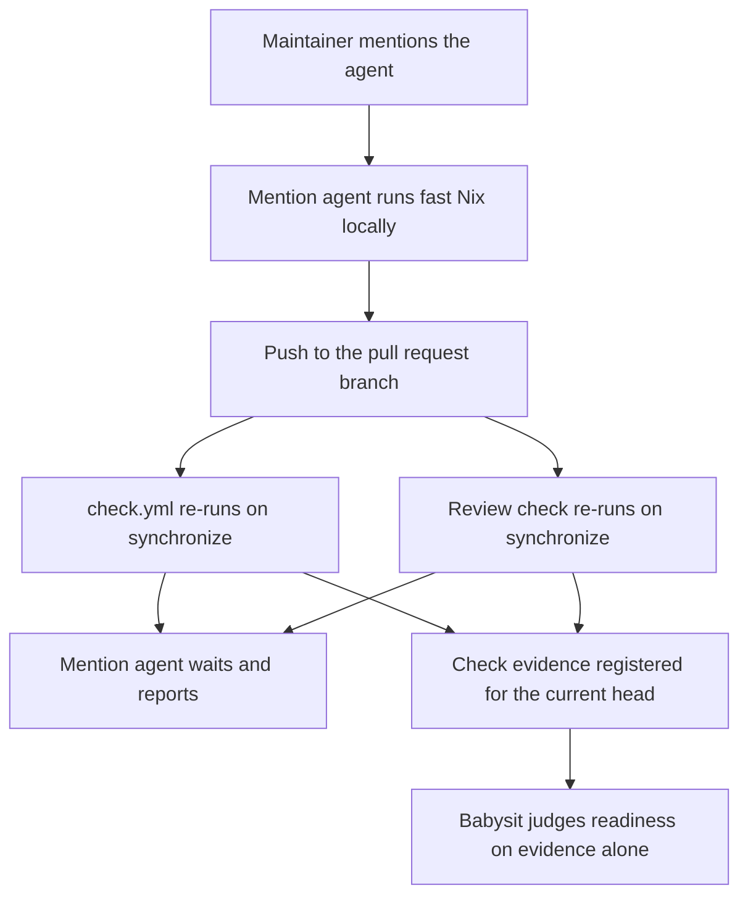
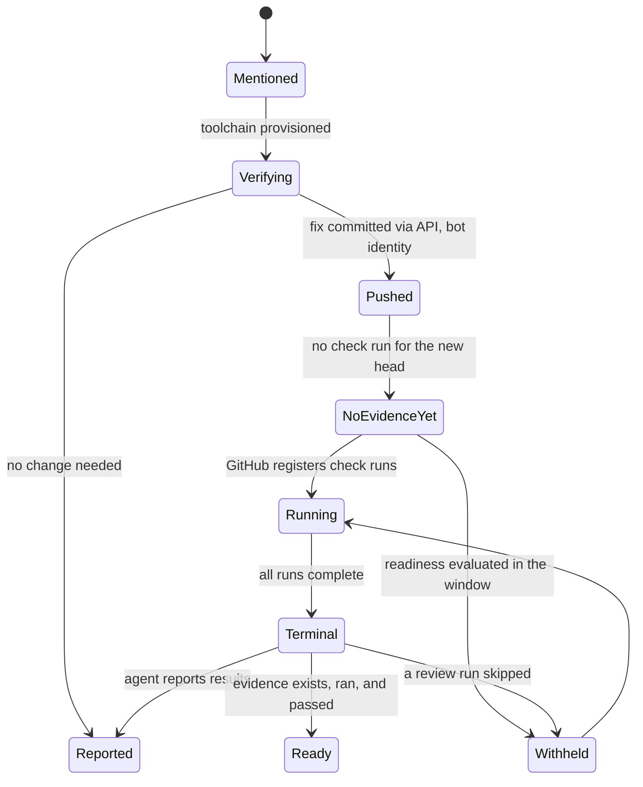

# Claude Workflow Toolchain and Settle Window - Plan

## Goal Capsule

- Objective: an agent invoked on a pull request in this repository can produce the repository's own verification evidence and act on it, and a pull request whose evidence is complete is reported ready on that evidence rather than after a quiet period.
- Means: give the mention-triggered workflow the project toolchain and write access, let the checks its push already re-triggers supply the evidence, and record the readiness rule as a tracked project instruction (KD1, KD4, KD6).
- Product authority: closes issue #30. Single-maintainer repository; the agent that pushes is the agent that watches.
- Stop conditions: stop if the readiness instruction cannot express the evidence conditions R15 states, or if hardening either agent workflow would require a secret this repository does not already hold.
- Execution profile: four independent edits to CI and repository instructions, each landable as its own commit. `ce-work` implements; the maintainer merges.
- Open blockers: none.

---

## Product Contract

### Summary

Give the `@claude` mention workflow the repository's toolchain so an invoked agent can check its own work with Nix, let it commit and push fixes to the pull request branch and wait for the checks that push re-triggers, and replace the babysit settle timer with a tracked instruction that judges readiness on check evidence that actually exists for the current head.

### Problem Frame

On pull request #29 every readiness condition was met — mergeable, clean merge state, terminal checks, all checks passing, no open threads, comments, or human-needed flags, no base or branch-currency blocker — and readiness still could not be reported, because a push and a description edit had restarted a 300-second quiet timer. Nothing was being waited on; the timer was the only remaining gate.

The window exists to cover two possibilities: a review still on its way, and a pull request still moving. When the reviewer reports as a check, the first is observed directly — the review finished is the check being terminal, and the review found nothing is the zero-backlog condition readiness already requires. The second does not apply to a repository with one contributor whose agent both pushes and watches.

There is a second, quieter cost. The agent invoked by a mention has no toolchain: `check.yml` installs Nix, but the mention workflow checks out the repository and nothing else. An agent asked why an evaluation fails, or asked to fix a formatting error, can read the diff and reason, but cannot evaluate, build, or format. Its answers are inferences about a system whose ground truth is one command away.

### Key Decisions

- KD1. Toolchain goes to the mention workflow only, not the reviewer (session-settled: user-directed — chosen over giving both workflows Nix: the reviewer reads a diff and finishes in seconds, so paying Nix setup on every pull request buys nothing). Governs R1, R2, R5.
- KD2. Fast operations run locally; whole-suite verification stays with `check.yml` (session-settled: user-directed — chosen over unrestricted local Nix and over caching the Nix store: no binary cache exists here, `check.yml` already owns the expensive suite, and the Actions cache budget cannot hold this repository's NixOS closures). Governs R3, R4.
- KD3. The invoked agent may commit and push to the pull request branch (session-settled: user-directed — chosen over verify-and-comment only: the point of the toolchain is that the agent can finish the fix it just verified). Governs R6, R7.
- KD4. The agent waits for the checks its own push re-triggers; it does not dispatch them (session-settled: user-directed — chosen over having the agent re-run the checks itself, and over teaching the babysit loop to detect stale checks: the action pushes with a GitHub App installation token, which is exempt from GitHub's workflow loop-prevention rule, so the checks re-run without any dispatch machinery). Governs R8.
- KD5. Readiness requires evidence that exists and ran, not merely evidence that is terminal (session-settled: user-approved — chosen over R14's original claim that removing the timer weakens nothing else: the babysit engine's terminal-checks condition reads vacuously true when no check has been registered for the head yet, so the removed timer was silently covering that window). Governs R15.
- KD6. The readiness rule is a tracked instruction in `AGENTS.md` (session-settled: user-directed — chosen over patching the vendored skill, forking the compound-engineering plugin, or landing an upstream configuration key: the skill tree is generated and gitignored, so a patch does not survive the next install, while `AGENTS.md` is tracked, reviewable, and read by the agent that follows it). Governs R13.
- KD7. The mention workflow adopts the conventions `check.yml` sets, which issue #30 asked only of the reviewer. A toolchain makes this job capable of running for an hour, so an explicit bound stops being optional. Governs R10.

### Actors

- A1. Maintainer — invokes the agent by mentioning it on a pull request or issue, and decides when to merge.
- A2. Mention agent — the agent the mention workflow runs; reads, verifies, fixes, pushes, and waits for the resulting checks.
- A3. Review check — the workflow that reviews every pull request automatically and posts findings as inline comments.
- A4. Babysit agent — the local agent that watches a pull request and reports when it is ready.

### Requirements

**Toolchain in the mention workflow**

- R1. The mention workflow provisions Nix, so A2 can run the repository's Nix commands without setup steps of its own.
- R2. The mention workflow provisions mise and installs the project-managed tooling, so A2 works with the same agent tooling the maintainer has locally.
- R3. A2 runs fast Nix operations in its own job: formatting, evaluation, and individual derivation builds.
- R4. A2 does not run the whole verification suite in its own job, and reports a failure it cannot reproduce locally as one for `check.yml` to settle rather than guessing at it.
- R5. The review check gains no toolchain and stays diff-only.

**What the invoked agent may change**

- R6. A2 may commit and push to the pull request branch it was invoked on, and never to `main`.
- R7. A commit A2 pushes is attributed to a bot identity, so the pull request shows at a glance which commits a human wrote.
- R8. After pushing, A2 waits for the checks that its push re-triggers and reports their result, rather than reporting success against the previous commit's evidence.

**Workflow conventions**

- R10. Both agent workflows follow the conventions `check.yml` sets: third-party actions pinned by commit SHA with a version comment, a pinned runner image, an explicit per-job timeout, and a concurrency group scoped to the pull request or issue the run belongs to.
- R11. The review check holds the permissions posting its findings requires.
- R12. The review check posts its findings before its job reports completion, so a completed review check implies the findings are already visible on the pull request.
- R16. Neither agent workflow starts a job in response to its own output or another bot's comment.

**Readiness without the settle window**

- R13. `AGENTS.md` states that in this repository pull request readiness is judged on check evidence rather than a quiet period, and how the babysit watch is invoked accordingly.
- R14. Removing the wait weakens nothing else: the zero-backlog conditions, the human-needed flag, and the base and branch-currency blockers all keep their current force.
- R15. The readiness rule states what counts as evidence: at least one check run registered against the current head, every such run terminal, and a review check that skipped treated as absent evidence rather than as a clean review.

**Regression guard**

- R17. A repository check fails when either agent workflow drifts from the conventions R10 states.

### Key Flows

- F1. Invoked agent fixes and re-verifies
  - **Trigger:** A1 mentions the agent on a pull request.
  - **Actors:** A1, A2
  - **Steps:** The workflow provisions the toolchain; A2 reproduces the problem with a fast Nix command, or states that it cannot and defers to `check.yml` (R4); A2 pushes the fix to the pull request branch; the push re-triggers `check.yml` and the review check; A2 waits for them and reports what it changed and what they said.
  - **Covered by:** R1, R2, R3, R4, R6, R8

- F2. Readiness on evidence
  - **Trigger:** A4 is watching a pull request whose checks have gone terminal.
  - **Actors:** A3, A4
  - **Steps:** A3's findings are already visible when its check completes; A4 confirms that check runs exist for the current head, that they are terminal and passing, that no review check merely skipped, that the backlog conditions are empty, and that no base or branch-currency blocker stands; A4 reports ready without waiting out a quiet period.
  - **Covered by:** R12, R13, R14, R15

### Acceptance Examples

- AE1. Review found nothing
  - **Covers R12, R13, R14, R15.**
  - **Given** a pull request whose review check ran against the current head and completed with no findings, and whose other checks are terminal and passing,
  - **When** the babysit agent evaluates readiness,
  - **Then** it reports the pull request ready without waiting out a quiet period.

- AE2. Review found something
  - **Covers R12, R14.**
  - **Given** a pull request whose review check posted findings,
  - **When** the babysit agent evaluates readiness,
  - **Then** the findings hold readiness through the existing backlog condition, and removing the timer changes nothing about that.

- AE3. Fix pushed by the invoked agent
  - **Covers R6, R8, R15.**
  - **Given** the invoked agent has pushed a fix to the pull request branch,
  - **When** readiness is evaluated before GitHub has registered any check run for the new head,
  - **Then** readiness is withheld because no evidence exists for that head — not granted on a vacuously terminal check set.

- AE4. Review check that skipped
  - **Covers R15.**
  - **Given** a pull request that edits the agent workflows, where the review check skipped because the action's token exchange rejected a workflow absent from the default branch,
  - **When** readiness is evaluated,
  - **Then** the skipped run is treated as missing review evidence rather than as a review that found nothing.

- AE5. Ordering between the review check and its comments
  - **Covers R12.**
  - **Given** the review check has just reported completion on a pull request that does not edit the workflows,
  - **When** the pull request's comments are read at that moment,
  - **Then** the findings are already present — verified against a real post-merge run, not assumed.

### Scope Boundaries

- Binary cache infrastructure — Cachix, FlakeHub Cache, or caching the Nix store through the Actions cache. Deferred deliberately in `.compound-engineering/artifacts/plans/2026-09-21-1205-perf-split-nix-ci-parallel-jobs-plan.md`, and this repository's NixOS closures exceed the Actions cache budget.
- A `workflow_dispatch` trigger on `check.yml`, and any agent-driven dispatch of it. Removed from scope once the push was confirmed to re-trigger the checks on its own (KD4).
- Forking the compound-engineering plugin, or landing a settle-window configuration key upstream. Either remains open later; neither is needed for R13.
- Giving the review check a toolchain, or making it do anything beyond reading the diff.
- Branch protection and rulesets on `main`. None exist today, so R6's boundary rests on the action's own behavior rather than on enforcement; adding a ruleset is a separate decision (see Risks).
- Making the Nix checks themselves faster.

### Dependencies / Assumptions

- The action pushes with a Claude GitHub App installation token obtained by OIDC exchange, not with `GITHUB_TOKEN`, and removes the credential `actions/checkout` persisted. App-token pushes are exempt from GitHub's loop-prevention rule, which is what makes R8 work without a dispatch.
- The token exchange fails with a warning and the job skips — it does not fail — when the workflow file is absent from the default branch. The changed workflows therefore cannot be exercised from the pull request that introduces them, and the same holds for any later pull request that edits them. R15 and AE4 exist because of this.
- No binary cache exists in this repository, so any Nix work in the mention job pays full cost. This is what R3 and R4 bound, and what makes R10's timeout load-bearing.
- `.claude`, `.agents`, `.opencode`, and `agents.lock` are gitignored; only `agents.toml`, `mise.toml`, and `mise.lock` are tracked. The vendored skill is generated on every install and its version is not pinned here, which is why R13 is an instruction rather than a patch.
- `AGENTS.md` is a tracked instruction file that agents read, so R13 depends on an agent following an instruction rather than on an enforced setting.

### Outstanding Questions

**Deferred to Planning — resolved**

- Which Nix operations A2 may run: resolved by R3, R4, and KTD3's tool allowlist.
- How `check.yml` is re-run and waited on: resolved by KD4 — the push re-triggers it.
- How a commit is marked machine-produced: resolved by KTD5 — bot identity plus API-signed commits.

**Deferred to Implementation**

- The mention job's timeout value: the agent's own Nix work on a cold runner plus the wait R8 requires. The first real runs calibrate it.

### Sources / Research

- Issue #30 — the #29 readiness stall, the two reasons the window exists, and the acceptance conditions this contract inherits.
- Pull request #32 — landed both agent workflows in their current unpinned, toolchain-free form.
- `.github/workflows/check.yml` — the convention R10 adopts: SHA-pinned actions, `ubuntu-24.04`, a concurrency group with cancel-in-progress, and per-job timeouts of 10 to 60 minutes.
- `.github/workflows/update-flake-lock.yml` — the repository's only precedent for CI that writes to the repository: workflow-level `contents: write` plus `pull-requests: write`, and a token chosen so the resulting pull request triggers downstream CI.
- `tests/bootstrap-recipients.nix` and `flake.nix` — the precedent for a check that reads tracked repository files directly, which R17 follows.
- `.compound-engineering/artifacts/solutions/best-practices/` — the four mutation-testing learnings `AGENTS.md` requires reading before adding a check; they govern U4.
- `anthropics/claude-code-action` v1 sources (`src/github/token.ts`, `src/github/operations/git-config.ts`, `src/github/operations/branch.ts`, `src/create-prompt/index.ts`, `scripts/git-push.sh`) — the token exchange, the credential swap, checkout of the existing pull request branch, the default tool allowlist, and the hardened push wrapper.

---

## Planning Contract

**Product Contract preservation.** Changed: R7 — its original clause justified the marker by the commits being unsigned, which KTD5 makes false; the requirement now rests on bot attribution. R8 — the agent waits for the checks its push re-triggers instead of dispatching them (KD4). R14 — its claim that removing the timer weakens nothing else was falsified by the babysit engine's terminal-checks logic; the claim is narrowed to the conditions it does hold for, and R15 carries what the evidence requires. Removed: R9 — the on-demand dispatch trigger is unnecessary under KD4; the ID is retired, not reused. Added: R15, R16, R17.

### Key Technical Decisions

- KTD1. Install Nix with the action `check.yml` already pins, and mise with `jdx/mise-action`, as two ordinary steps in the mention job. Reuses a dependency the repository already trusts rather than introducing a second installer. Governs R1, R2.
- KTD2. Add the `Make room for NixOS closures` step to the mention job. `ubuntu-24.04` runners leave roughly 14 GB free, and this is the step `check.yml` already uses for the same reason. Governs R3.
- KTD3. Express the fast-operations boundary as a tool allowlist rather than as prose alone: `claude_args: --allowedTools` naming the specific Nix command prefixes. The list adds to the action's base tools rather than replacing them, so the comment and commit tools stay available. It constrains the command name only: a named prefix does not stop `--impure`, `--expr`, or a whole-suite target, so it bounds the ordinary path rather than containing a determined one. Governs R3, R4.
- KTD4. Do not add any git tool to the allowlist. With commit signing enabled per KTD5 the action grants no git write tool at all, only its API-backed file-ops commit tools; a git tool added here would route commits around signing and produce unsigned bot commits, which is the invariant KTD5 exists to keep. Governs R6.
- KTD5. Enable the action's commit signing so commits are created through the GitHub API under the bot identity and land verified. Keeps the repository's every-commit-is-signed invariant without storing a signing key in Actions secrets; the cost is that the agent commits through the file-ops tool instead of arbitrary git operations (session-settled: user-approved — chosen over accepting unsigned bot commits: the maintainer's whole history is signed, and the alternative needs no new secret). Governs R7.
- KTD6. Key the mention workflow's concurrency group on the issue or pull request number, and do not cancel in-progress runs. `issue_comment` events carry no meaningful `github.ref`, so copying `check.yml`'s key verbatim would let one pull request's mention cancel another's; and cancelling a mention run that has already pushed leaves a commit with no report behind it. Governs R10.

  Conflict call-out on KD7: the settled decision was to adopt `check.yml`'s conventions, which include `cancel-in-progress`. This plan adopts the convention's intent — a bounded, non-overlapping run — and deliberately departs on the key and the cancellation, because the literal convention misbehaves on this trigger.
- KTD7. Gate the job in the `if:`, rather than relying only on the action's default of not responding to bots — the default stops the agent from acting, the gate stops the job from starting. The gate is expressed per trigger and must never test the pusher or `github.actor`, because the agent's own bot push has to keep re-triggering the review check for R8 and R15 to work. On the mention workflow it tests the author of the text that becomes the prompt: not a bot, and the repository owner. That second clause closes the `issues: [assigned]` path, where the action validates the maintainer who assigned the issue rather than the outsider who wrote its body. On the review workflow, which fires only on `pull_request`, it tests the pull request author's type. Governs R16.
- KTD9. The agent's standing behavior — wait for the checks the push triggers, defer a locally unreproducible failure to `check.yml` — is written into `AGENTS.md`, not into the workflow. The action runs in mention-response mode only while its `prompt` input is unset; setting `prompt` switches it to automation mode, where it runs on every trigger regardless of the mention. Governs R4, R8.
- KTD8. Write R17's guard as a `pkgs.runCommand` check that reads `.github/workflows/*.yml` from the tracked tree, following `tests/bootstrap-recipients.nix`. There is no YAML tooling in the flake and none is needed to assert what R10 names. The check reads only the two agent workflows: `check.yml` and `update-flake-lock.yml` pin `cachix/install-nix-action` with no version comment, so a repository-wide version-comment assertion would fail on day one. Governs R17.

### High-Level Technical Design

The evidence path is what this change rearranges, so it is worth seeing whole. Before: the agent had no toolchain, and readiness waited out a timer that stood in for evidence. After: the agent produces a commit, GitHub's own triggers produce the evidence, and the readiness rule reads that evidence directly — with the two states that used to hide inside the timer now named.

### Assumptions

- The maintainer is the only person who invokes the agent, but the text that becomes its prompt is not always theirs — KTD7's owner clause covers the paths where those differ.
- `jdx/mise-action` runs `mise install` itself and adds `--locked` when a lockfile is present, so R2 needs no separate install step. That install fires this repository's `postinstall` hook, which needs npm and network access and regenerates the gitignored agent tooling inside the runner; if it fails, the job can still go green while R2 is unmet.
- The agent observes the re-triggered runs through the action's CI-status tool, which `additional_permissions: actions: read` already grants. Nothing in the allowlist sleeps, so the wait is a poll loop with a token cost proportional to its length.

### Risks & Dependencies

- Nothing enforces R6's "never to `main`". With no ruleset on the default branch, the boundary rests on the action's documented behavior of pushing only to the branch it was invoked on. A ruleset requiring pull requests on `main` would make it real, and is out of scope by decision — worth revisiting if the agent is ever invoked by anyone but the maintainer.
- A push by the agent re-triggers the review check, which may post new findings, which may prompt another fix. Nothing in this change bounds the number of rounds. The babysit engine's trajectory detection catches the repeating case and routes it to a human, and each round is visible to the maintainer as a commit followed by a comment burst — a backstop and a signal, not a bound. Add a bound only if the rounds are observed to repeat in practice.
- The agent's prompt is assembled from pull request and issue text that people without write access can author, and the mention job then runs pull-request-branch Nix code in the same job as its write credentials. KTD7's owner clause and the action's write-access check on the invoking actor are what keep that closed; both are behavioral, not enforced by GitHub.
- The first pull request that lands these workflows cannot exercise them. Expect the agent jobs to skip with a warning rather than fail, and treat the behavioral acceptance examples as post-merge verification.

### Sequencing

U1 and U2 are independent. U3 depends on nothing but is most useful landed with them. U4 asserts what U1 and U2 produce, so it lands after both.

---

## Implementation Units

### U1. Harden the review workflow

- **Goal:** bring `.github/workflows/claude-code-review.yml` to the repository's workflow conventions and give it the permission its posting needs.
- **Requirements:** R5, R10, R11, R16
- **Dependencies:** none
- **Files:** `.github/workflows/claude-code-review.yml`
- **Approach:**
  1. Pin `actions/checkout` to `fbc6f3992d24b796d5a048ff273f7fcc4a7b6c09 # v5` and `anthropics/claude-code-action` to `cfc3eb22bfed5c26ef66e3223c982af27e4524de # v1.0.231`, matching the SHA-plus-comment form `check.yml` uses.
  2. Pin the runner to `ubuntu-24.04` and set a `timeout-minutes` sized to a diff-only review.
  3. Add a concurrency group keyed on the pull request number, per KTD6.
  4. Raise `pull-requests` to `write` so the inline-comment tool can post (R11); leave `contents` at `read` (R5).
  5. Gate the job on the pull request author's type not being a bot, per KTD7. Do not gate on `github.actor` or the pusher — the mention agent's own push must still re-trigger this check.
- **Patterns to follow:** `.github/workflows/check.yml` for pinning, runner, concurrency, and timeout shape.
- **Test scenarios:**
  - Covers R10. The repository check from U4 passes against the edited file.
  - Covers R11. The declared `pull-requests` permission matches what the configured inline-comment tool requires.
  - Covers R5. No Nix or mise step appears in this workflow.
- **Verification:** the file declares every convention R10 names plus the author gate, and the workflow still parses as valid YAML.

### U2. Give the mention workflow the toolchain and write access

- **Goal:** `.github/workflows/claude.yml` provisions Nix and mise, lets the agent commit and push to the pull request branch under a bot identity, and is bounded.
- **Requirements:** R1, R2, R3, R4, R6, R7, R8, R10, R16
- **Dependencies:** none
- **Files:** `.github/workflows/claude.yml`
- **Approach:**
  1. Apply the same pinning, runner, and concurrency treatment as U1. Size `timeout-minutes` for the agent's own Nix work *plus* the wait R8 requires — the checks it waits on are bounded at 60 minutes each — and gate the job per KTD7 on the author of the triggering text being a non-bot repository owner.
  2. Add the disk-space step, then `cachix/install-nix-action` pinned to `13d8dd58da0234aa297dedd986986ccb8e7f3e24 # v31.11.1`, then `jdx/mise-action` pinned to `c2a87611a18de5b3828c5652fe268e992400cb5c # v4.3.0`, before the action step.
  3. Raise permissions to `contents: write`, `pull-requests: write`, `issues: write`, keeping `id-token: write` and `actions: read`.
  4. Add `claude_args` with an `--allowedTools` list naming the fast Nix command prefixes, per KTD3; add no git tool, per KTD4. The list extends the action's base tools, so the commit and CI-status tools the agent needs for R6 and R8 remain available.
  5. Enable commit signing, per KTD5.
  6. Leave the `prompt` input unset so the workflow stays in mention-response mode; the agent's standing behavior for R4 and R8 lands in `AGENTS.md` under U3, per KTD9. That behavior includes a wait ceiling shorter than this job's timeout, and what the agent reports when it expires: the commit it pushed, the runs still in flight, and where to watch them — never a result it did not see.
- **Patterns to follow:** `check.yml`'s `Make room for NixOS closures` step verbatim; `update-flake-lock.yml` for the shape of a workflow that writes to the repository.
- **Test scenarios:**
  - Covers R10. The repository check from U4 passes against the edited file.
  - Covers R3, R4. The allowlist contains the fast Nix prefixes and does not contain the whole-suite commands.
  - Covers R6, KTD4. No git tool appears in the allowlist, and commit signing is enabled.
  - Covers R16, KTD7. The job condition tests the author of the triggering text, not the pusher.
  - Covers R1, R2. Both installer steps precede the action step.
  - Covers R16. The job condition excludes bot-authored events.
- **Verification:** the file declares the toolchain, the permissions, and the bounded run; the workflow parses as valid YAML. Behavioral verification waits for merge, per Risks.

### U3. Record the readiness rule in AGENTS.md

- **Goal:** `AGENTS.md` carries the tracked instructions that pull request readiness is judged on check evidence, and that an agent invoked in CI waits for the checks its push triggers.
- **Requirements:** R4, R8, R13, R14, R15
- **Dependencies:** none
- **Files:** `AGENTS.md`
- **Approach:**
  1. Extend `## Commit and pull request guidelines`, whose last clause already makes check results the pull request's currency.
  2. State the readiness rule and the three evidence conditions R15 carries, and name the concrete invocation: arm the babysit watch with `--settle-seconds 0`. Say explicitly that this repository's rule supersedes the vendored skill's instruction not to pass that flag on the ordinary arm, and its guidance to re-arm at a longer window after a rejected merge-ready wake — otherwise the agent reads both and the skill's more operational text wins, and the 300-second window stays in force.
  3. State what the rule does not relax, per R14, and the two behaviors the removed window used to cover: when evidence is missing for the current head, re-arm to wake on a new check run or a new head rather than re-evaluating on every poll; and when a review run skipped, report it as a named missing-review-evidence residual and hand back to the maintainer rather than withholding readiness forever with no report.
  4. State the agent's standing behavior after a push — wait for the checks the push triggers and report them, hand a locally unreproducible failure to `check.yml` rather than guessing, and on hitting the wait ceiling report the commit, the runs still in flight, and where to watch them — per KTD9.
  5. Match the file's existing voice: bare imperative declaratives, backticked identifiers, no headings below `##`.
- **Patterns to follow:** `AGENTS.md`'s own prose style; the four-link citation sentence at the end of the security section for how it references artifacts.
- **Test scenarios:** Test expectation: none — this unit changes instruction prose, and R17's check covers workflow files rather than `AGENTS.md`.
- **Verification:** an agent reading only `AGENTS.md` can state the three evidence conditions and how to invoke the watch.

### U4. Add a repository check for workflow conventions

- **Goal:** a registered check fails when either agent workflow drifts from the conventions R10 names.
- **Requirements:** R10, R17
- **Dependencies:** U1, U2
- **Files:** `tests/github-workflow-conventions.sh`, `flake.nix`, `docs/verification.md`
- **Approach:**
  1. Read the two agent workflow files from the tracked tree, following `tests/bootstrap-recipients.nix`'s use of repository files as check input. The other two workflows are not asserted against, per KTD8.
  2. Assert, per agent workflow: every `uses:` names a 40-character SHA followed by a version comment; the runner is pinned; the `concurrency` group key references the pull request or issue number; every job sets `timeout-minutes`; the job carries the author gate KTD7 defines; and the declared permission block matches what its unit grants — `contents: read` for the review workflow, the write set for the mention workflow.
  3. Write each assertion as an explicit `if … then echo >&2; exit 1; fi`, never as `! cmd`, and scope the greps to the file under test rather than the whole tree.
  4. Register the check in `flake.nix` beside the existing ones and add it to the enumeration in `docs/verification.md`.
- **Execution note:** mutation-test each assertion before trusting it — break the file in the specific way the assertion exists to catch, and confirm the failure message is the assertion's own, not a Nix evaluation error. The four learnings `AGENTS.md` cites govern this unit.
- **Patterns to follow:** `tests/bootstrap-recipients.nix` for reading tracked files; the inline `pkgs.runCommand` checks in `flake.nix` for registration shape; the `/* Check interface: … Verifies: … */` header every test in this repository opens with.
- **Test scenarios:**
  - Covers R17. A workflow with a floating action tag fails the check, with the assertion's own message.
  - Covers R17. A workflow with `runs-on: ubuntu-latest` fails the check.
  - Covers R17. A workflow with no `concurrency` block fails the check.
  - Covers R17. A job with no `timeout-minutes` fails the check.
  - Covers R17. A SHA pin with no trailing version comment fails the check.
  - Covers R17. A concurrency key that does not reference the pull request or issue number fails the check.
  - Covers R17. Removing the author gate, or widening the review workflow's `contents` to `write`, fails the check.
  - Covers R17. Both agent workflow files pass once U1 and U2 have landed, and the two Nix workflows are not read at all.
  - A mutation that deletes an assertion's target line fails inside the builder rather than at evaluation time.
- **Verification:** `nix flake check` runs the new check, and each assertion has been shown to fail for its own reason.

---

## Verification Contract

| Command | Purpose | Expected outcome |
|---|---|---|
| `nix fmt -- --ci` | formatting unchanged | no diff |
| `nix flake check` | all registered checks including U4's | passes |
| `nix build --no-link .#nixosConfigurations.ThinkPad-X1-Carbon-Gen-11.config.system.build.toplevel` | production host still evaluates | builds |
| `nix build --no-link .#nixosConfigurations.ThinkPad-X1-Carbon-Gen-11-bootstrap.config.system.build.toplevel` | bootstrap host still evaluates | builds |

Pre-merge verification stops there by necessity: the agent workflows skip rather than run on the pull request that edits them, so AE1 through AE5 cannot be exercised before merge. Verify them on the first pull request after this one lands — mention the agent, confirm it can run a fast Nix command, confirm its push produces fresh check runs, and confirm the review check's findings are visible the moment its check completes (R12).

---

## Definition of Done

- Both agent workflows declare SHA-pinned actions with version comments, a pinned runner, a per-job timeout, a concurrency group keyed on the pull request or issue, and the author gate KTD7 defines.
- The mention workflow provisions Nix and mise, holds write permissions, signs its commits, and carries a tool allowlist that admits the fast Nix operations and no git tool.
- `AGENTS.md` states the readiness rule, its three evidence conditions, the `--settle-seconds 0` invocation and what it supersedes, and the agent's post-push behavior.
- `nix flake check` passes with the new workflow-conventions check registered, and every one of its assertions has been mutation-tested to fail for its own reason.
- `docs/verification.md` names the new check.
- The working tree is clean and no exploratory or abandoned code remains in the diff.
- The post-merge verification above is recorded as the remaining step rather than claimed as done.
