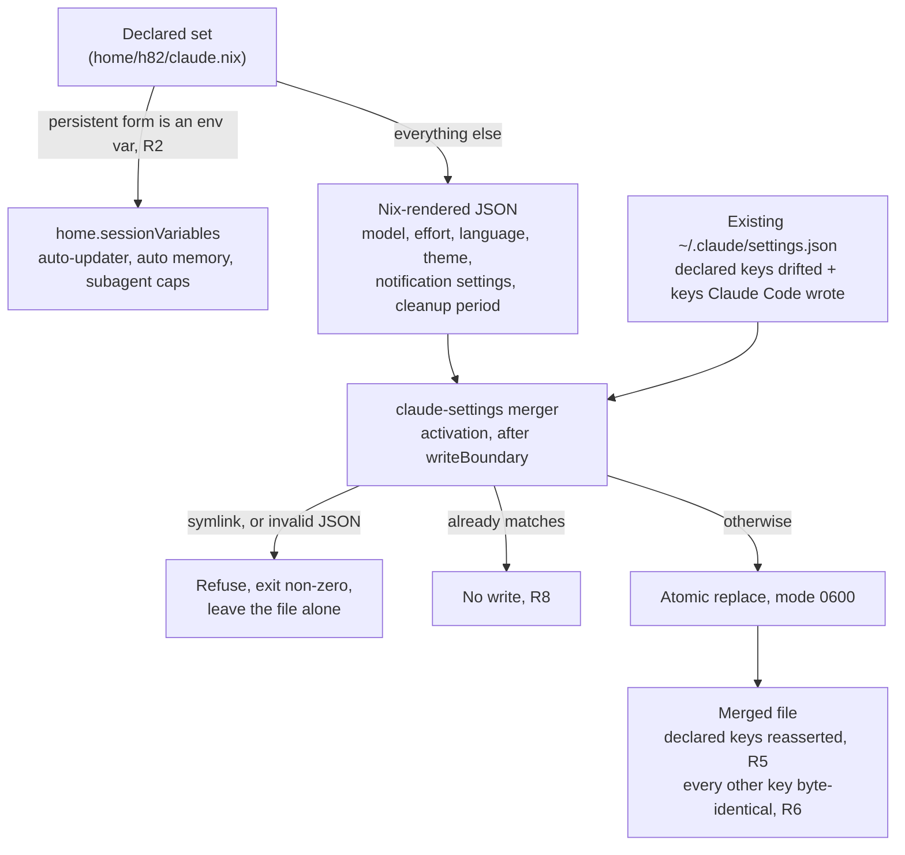

# Claude Code Settings Tier Ownership - Plan

## Goal Capsule

- **Objective:** After a rebuild, the ThinkPad starts Claude Code with the scalar settings this repository declares, and every setting the repository does not declare stays the user's to change. Claude Code's other configuration surfaces are not active scope; see How This Work Fits Together.
- **Means:** Merge the declared keys into Claude Code's own user settings file during Home Manager activation, and delete the managed-settings module (KTD1, KTD3).
- **Product authority:** This plan supersedes the tier decision recorded in `.compound-engineering/artifacts/plans/2026-09-21-1914-feat-claude-managed-defaults-plan.md`, which claimed authority over issue #19. See KD7.
- **Execution profile:** `ce-work` implements the units below; verification is `nix flake check` plus both host builds, and one hardware check on the laptop.
- **Open blockers:** None.
- **Product Contract preservation:** Outstanding Questions is gone — its five Deferred-to-Planning items are answered in KTD2, KTD5, KTD6, and KTD7, and in assumption A1. R2 is sharpened so a session-only override no longer routes a persistent setting out of the settings file (KTD6); no scope change. Everything else is unchanged.
- **Stop conditions:** Stop and report if the merge cannot keep the settings file user-writable, or if `nix flake check` cannot distinguish a merging writer from a whole-file writer (KTD7).

---

## Product Contract

### Summary

Give the repository a way to declare Claude Code settings that the user can still change during a session, by setting the declared keys in the user settings file at activation instead of locking them system-wide. Reassign the three settings that live in the managed-settings tier today and retire that tier. Record which tier owns which setting, so the split stops being implicit in module code.

### Problem Frame

Claude Code rewrites `~/.claude/settings.json` itself whenever a `/config` option changes, so Home Manager cannot place a read-only store symlink there. The repository worked around that by putting its three declared settings in `/etc/claude-code/managed-settings.json` (`modules/nixos/claude.nix:10-17`), the one tier Claude Code only reads.

That tier buys determinism at a price the repository did not choose deliberately: it is system-wide rather than per-user, it outranks every user and project value, and it blocks a change even inside a running session. Any setting the user must still be able to adjust has nowhere to go, so everything else stayed manual mutable state and `README.md:13` still says so.

Nothing in the repository writes into `~/.claude/` today. The closest precedents solve adjacent problems: `scripts/publish-cli-auth:48-71` replaces whole files atomically under `~/.config`, and five modules under `home/h82/kde/` use `home.activation` to mutate config files another program owns. Neither one merges keys into a file its owner keeps rewriting.

### Key Decisions

- KD1. **Write declared keys into the user settings file at activation, rather than declaring them in the managed-settings tier.** The managed tier blocks a change even inside a session and does not scale to settings the user must still be able to adjust. (session-settled: user-directed — chosen over keeping the managed tier and over expressing everything as environment variables: the managed tier is the status quo the issue rejected, and most declared keys have no environment-variable form.) Governs R5, R6.
- KD2. **Reassert every declared key on every activation.** Determinism without a state file, at the cost that a runtime change to a declared key lasts only until the next rebuild. (session-settled: user-directed — chosen over a three-way merge against the previous generation and over a one-time seed: a merge needs persisted state, and a seed never delivers a changed declaration to a host that is already provisioned.) Governs R5.
- KD3. **Retire the managed-settings tier and reassign its three settings.** (session-settled: user-directed — chosen over leaving them where they are: the user asked for the existing structure to migrate too, not only for new settings to use the new mechanism.) Governs R4, R14.
- KD4. **Scope is the user-tier scalar settings only.** Permissions, hooks, MCP servers, plugins, skills, subagents, and `~/.claude/CLAUDE.md` are not settings-file scalars and each needs its own mechanism. (session-settled: user-directed — chosen over covering all the surfaces issue #23 lists.) Governs R11, Scope Boundaries.
- KD5. **The declared set covers reproducibility values and the owner's personal defaults.** A rebuilt machine should come up already familiar, not merely functional. (session-settled: user-directed — chosen over a minimal reproducibility-only set and over a single demonstration key.) Governs R11, R12, R13.
- KD6. **Build no shared module across coding-agent harnesses.** The Gemini and Antigravity settings files are not rewritten by their own agent, so the store symlinks at `home/h82/gemini.nix:5-15` already work, and `omp` has no module at all. The merge mechanism has one consumer. Governs Scope Boundaries.
- KD7. **This plan reverses the prior tier decision on changed premises, not on disagreement.** That decision rejected writing the user settings file because Claude Code rewrites it and a read-only store symlink cannot live there. An activation-time key merge writes a user-owned regular file, so the objection does not reach it. Governs R5, R7.

<!-- ce-section: work-relationships -->
### How This Work Fits Together

This plan covers one area of issue #23: the scalar settings in Claude Code's user settings file, and the tier decision that says where a declared setting belongs. The breakdown below is how the surrounding work is understood today, not a committed roadmap. A later plan may revise, split, merge, or discard any of it.

- Permission allowlists and hooks
  - Depends on this plan for the tier rule, then needs its own mechanism, because hooks are a place other tools write at runtime rather than a scalar the user picks.
- MCP server definitions
  - Depends on this plan for the tier rule. Still to decide: how server definitions reach the host without a token entering the Nix store, which R10 forbids.
- Plugins, marketplaces, skills, and subagents
  - Can proceed independently of this plan. These are content assets deployed into a directory, not keys in a settings file, so they share neither the write conflict nor the merge mechanism.
- `~/.claude/CLAUDE.md`
  - Can proceed independently of this plan. Nothing rewrites it at runtime, so the store-symlink pattern at `home/h82/gemini.nix:5-15` likely covers it.

Scope Boundaries below, not this list, is the authority for what this plan excludes.

### Requirements

**Tier ownership**

- R1. Every Claude Code setting the repository declares is assigned to exactly one tier, and `docs/provisioning.md` records the assignment together with the reason for it.
- R2. A setting whose persistent form is an environment variable is declared through Home Manager session variables rather than written into the settings file; a variable that only overrides one session does not move that setting out of the file.
- R3. A setting the repository does not declare is left untouched by activation and stays the user's to change permanently.
- R4. The repository declares no value in the managed-settings tier, and `docs/provisioning.md` records that the tier is deliberately unused and why.

**Write mechanism**

- R5. Activation sets each declared key in the user settings file to its declared value, replacing whatever value the file held, on every rebuild that produces a new Home Manager generation.
- R6. Activation preserves every key it does not declare, including keys Claude Code wrote itself, so the write is a key merge rather than a whole-file replacement.
- R7. The settings file stays a user-owned, user-writable regular file after activation, and activation refuses to write through a symlink.
- R8. Activation leaves the file unchanged when every declared key already holds its declared value.
- R9. Activation creates the file, and its parent directory, when either is absent.
- R10. The mechanism places no token, credential, or PIN into the Nix store or into the settings file.

**Declared set**

- R11. The declared set contains two categories only: values that must be identical on any rebuild of this environment, and the owner's personal defaults. A setting in neither category is not declared.
- R12. The declared set is exactly the table below, and nothing outside it is declared. The tier column shows where R2 places each entry.

  | Setting | Tier | Category |
  | --- | --- | --- |
  | Auto-updater disabled | Environment variable | Reproducibility |
  | Auto memory disabled | Environment variable | Reproducibility |
  | Subagent concurrency cap | Environment variable | Reproducibility |
  | Subagent spawn-depth cap | Environment variable | Reproducibility |
  | Model | User settings file | Personal default |
  | Effort level | User settings file | Personal default |
  | Interface language | User settings file | Personal default |
  | Theme | User settings file | Personal default |
  | Notification flags | User settings file | Personal default |
  | Transcript cleanup period | User settings file | Personal default |

- R13. The declared theme follows the terminal's own colors rather than pinning a light or dark palette.

**Migration**

- R14. The three settings currently in the managed-settings tier move to the tier R1 assigns them, and a user who makes no runtime change sees no change in their effective values.
- R15. The auto-memory setting is declared once, not in both the environment-variable tier and the settings file as it is today.
- R16. After the change, an already-provisioned host carries no `/etc/claude-code/managed-settings.json` that would keep outranking the new tier.

**Documentation and checks**

- R17. `README.md:13` states what is and is not migrated in terms that match the shipped behavior.
- R18. `flake.nix` registers checks that fail when a declared key is absent from the generated configuration, when any `home.file` entry targets the settings file, and when the merge would drop an undeclared key.
- R19. `nix flake check` passes and both host configurations build.
- R20. `docs/verification.md` records the hardware check for this work: a session started after activation shows the declared values.

### Acceptance Examples

- AE1. **Covers R5, R6.** Given the settings file holds a declared key the user changed at runtime plus keys Claude Code wrote itself, when activation runs, then the declared key returns to its declared value and every other key keeps its contents.
- AE2. **Covers R3.** Given the user changed a key the repository does not declare, when activation runs, then that key keeps the user's value.
- AE3. **Covers R8.** Given every declared key already holds its declared value, when activation runs, then the file is not rewritten.
- AE4. **Covers R7.** Given the settings path is a symlink, when activation runs, then it refuses and reports the path instead of writing through it.
- AE5. **Covers R9.** Given no settings file exists, when activation runs, then it creates one containing the declared keys and nothing else.
- AE6. **Covers R14.** Given a user who makes no runtime change, when the migration lands, then a newly started session reports the same model and effort level as before it.
- AE7. **Covers R16.** Given a host provisioned before this change, when it is rebuilt afterwards, then the managed-settings file is gone and the user tier decides each declared key.

### Scope Boundaries

Deferred, and recorded in `docs/provisioning.md` as intentionally unmanaged:

- Permission allowlists and hooks.
- MCP server definitions and their enablement state.
- Plugins, marketplaces, skills, subagents, and `~/.claude/CLAUDE.md`.
- Three-way merge and seed-once semantics for declared keys, both rejected in KD2.
- A module shared across coding-agent harnesses, rejected in KD6.

Out of scope as a different surface: the Claude Code permission allowlist in CI at `.github/workflows/claude.yml:59,72`. It is a workflow declaration, not a user-tier setting, and this work neither reads nor changes it.

### Dependencies / Assumptions

- This flake is the only manager of `~/.claude` on `ThinkPad-X1-Carbon-Gen-11`. No dotfile manager is applied there, so no second writer competes for the file.
- A Claude Code session running during activation may write the file again before the user observes the declared values. The observable criterion is therefore the next session start, not the rebuild itself. R20 states the check in those terms.
- The managed-settings tier accepts any settings key, so it was never the reason the declared set stayed small. Retiring it costs no expressiveness.

### Sources / Research

Repository state, verified during this brainstorm:

- `modules/nixos/claude.nix:10-17` — the whole managed-settings declaration: `autoMemoryEnabled`, `model`, `effortLevel`.
- `home/h82/claude.nix:7-9` — the only user-tier declaration today, one session variable.
- `tests/claude.nix:37-39,80-83` — asserts that no `home.file` entry targets the settings file; registered at `flake.nix:87`. The assertion survives this change, because an activation merge does not use `home.file`.
- `scripts/publish-cli-auth:48-71` — atomic whole-file replacement under `~/.config`, invoked from `modules/nixos/secrets.nix:110`. The discipline transfers; the whole-file shape does not.
- `home/h82/kde/{apps,plasma,session,input,kwin}.nix` — five `home.activation` blocks mutating config files another program owns.
- `home/h82/gemini.nix:5-15` — store symlinks, the pattern this work cannot use.
- `README.md:13`, `docs/provisioning.md:100`, `docs/verification.md:48` — the three places that encode the current tier decision.

Prior artifacts:

- `.compound-engineering/artifacts/plans/2026-09-21-1914-feat-claude-managed-defaults-plan.md` — the decision KD7 supersedes; its line 71 already deferred "declarative management of Claude Code's other settings".
- `.compound-engineering/artifacts/solutions/best-practices/nix-check-reads-option-value-not-materialized-output.md` — a check that reads an option value rather than the materialized output stays green while the host has no file at all.
- `.compound-engineering/artifacts/solutions/best-practices/unguarded-derivation-interpolation-defeats-nix-check-mutation-testing.md` — guard every lookup so a mutation reaches the builder instead of failing evaluation.

Issue #23 supplied the problem statement. Its file names are stale: `agent-memory.nix` and `tests/agent-memory.nix` are now `claude.nix` and `tests/claude.nix`, and the `model` and effort defaults it defers to issue #19 have already landed.

Claude Code's published settings schema (`https://www.schemastore.org/claude-code-settings.json`, read 2026-09-22) is the authority for every key name, enum, and environment-variable name this plan commits to. It confirms the `theme` enum, that `effortLevel` is the string enum `low|medium|high|xhigh`, that `cleanupPeriodDays` is an integer with minimum 1, that `preferredNotifChannel` accepts `ghostty`, and that `CLAUDE_CODE_DISABLE_AUTO_MEMORY`, `DISABLE_AUTOUPDATER`, `CLAUDE_CODE_MAX_CONCURRENT_SUBAGENTS`, and `CLAUDE_CODE_MAX_SUBAGENT_SPAWN_DEPTH` are all real. It carries no `modelSettings` property, which is the evidence behind A6's top-level effort declaration.

NixOS `nixos/modules/system/etc/setup-etc.pl:57-78` removes `/etc` symlinks into `/etc/static` that the current configuration no longer declares, and `:140-148` deletes obsolete copied files. That is the evidence behind KTD5.

---

## Planning Contract

### Key Technical Decisions

- KTD1. **Do the write from a Home Manager activation block that invokes a packaged Python merger, not from `home.file`.** A store symlink cannot live at a path its owner rewrites; an activation block writes a real file the user keeps. Instantiates the product decision governing R5, R6, R7. (session-settled: user-directed — chosen over keeping the managed-settings tier: the managed tier blocks a change even inside a session.)
- KTD2. **Run it as `lib.hm.dag.entryAfter [ "writeBoundary" ]`, not a systemd user unit.** All five existing activation blocks in `home/h82/kde/` use that form for the same shape of problem; the only systemd precedent (`modules/nixos/secrets.nix:110`) exists because it needs decrypted secrets, which R10 forbids here.
- KTD3. **Delete `modules/nixos/claude.nix` outright rather than emptying it to `{}`.** An emptied file still exists and still outranks every other tier, which R16 forbids. Governs R4, R14, R16.
- KTD4. **Write the merger in Python, reusing `scripts/publish-cli-auth`'s discipline.** That script already does atomic temp-file replacement, mode pinning, and an identical-content short-circuit — three of the behaviors R7, R8, and R9 ask for. Its symlink refusal covers the *directory* only (`private_directory`, `scripts/publish-cli-auth:18-21`); a symlinked destination file falls through to `os.replace` at `:57` and is silently replaced, so R7's file-level refusal is new behavior modelled on `private_directory`, not copied from the write loop. Rejected `jq` in a shell block: it would have to reimplement all of them, and a shell pipeline cannot fail closed on malformed JSON without more care than the Python branch costs.
- KTD5. **Add no removal step for the managed-settings file.** NixOS removes obsolete `environment.etc` entries on switch, so deleting the module is sufficient; a hardware check confirms it on the real laptop instead. Governs R16.
- KTD6. **Route a setting by whether its environment variable is the persistent form, not by whether one exists.** `model` and `effortLevel` both have environment variables, but those are runtime and session-only overrides, so the persistent declaration belongs in the settings file. This sharpens R2, which as written would have mis-routed both.
- KTD7. **Prove the merge with a sandboxed fixture test, not by reading the activation script's text.** Asserting that the generated script mentions a key proves a declaration, one level above what activation writes. The fixture starts divergent — declared keys holding different values, plus undeclared keys — so a whole-file writer and a correct merger cannot produce the same output. Rejected a NixOS VM test in the `tests/auth-provisioning.nix` style: it would prove the same thing through a full `switch-to-configuration` run, needs `/dev/kvm`, and this repository already reserves VM checks for boot and secrets work.

### Assumptions

These are planning-time choices made without the user present. Each is cheap to change in one line.

- A1. `theme` is `dark-ansi`. The schema offers two terminal-palette themes (`dark-ansi`, `light-ansi`) and no single "terminal default" value; the repository declares no Ghostty palette either way, so this picks the dark variant. Serves R13.
- A2. `language` is `korean`. The owner works in Korean throughout this repository's sessions.
- A3. The notification row of R12's table is three keys: `preferredNotifChannel` is `ghostty`, the terminal this repository installs (`home/h82/terminal.nix`), and both push-notification toggles are pinned at their documented default of `false`. Pinning the toggles follows A4's reasoning rather than excluding them for needing Remote Control, which would leave the row's plural undelivered.
- A4. The two subagent caps are pinned at Claude Code's documented defaults — concurrency 20, spawn depth 1. Pinning them changes no behavior today and makes the environment survive an upstream default change, which is the reproducibility category's whole point.
- A5. `cleanupPeriodDays` is `30`, the schema default, pinned for the same reason as A4.
- A6. `model` stays `opus[1m]` and `effortLevel` stays `medium`, the values the managed tier holds today, so R14 holds by construction. Effort is declared at the top level rather than per model, because the schema carries no `modelSettings` property.

### High-Level Technical Design

The declared set fans out to two destinations, and only the settings-file branch has a write conflict to solve. Everything the user changed that the repository did not declare survives because the merger reads the file it is about to write.

### Implementation Constraints

- C1. A project-level `.claude/settings.json` outranks the user tier, so a declared key can still be overridden per project. This is a real limitation of the chosen tier that the managed tier did not have; `docs/provisioning.md` must state it.
- C2. Every check asserts against both `ThinkPad-X1-Carbon-Gen-11` and `ThinkPad-X1-Carbon-Gen-11-bootstrap`. Both come from `mkHost` over the same host module (`flake.nix:58`), and the learnings record that reading only the production host left one host unguarded.
- C3. No assertion may be a negated command. POSIX exempts a `!`-inverted command from `set -e`, so `! grep -Fxq …` never fails a Nix builder. Use explicit `if … then exit 1`.
- C4. Every option lookup carries `or null` / `or ""`, and each absent branch reports from inside the builder via `lib.optionalString`. A removal mutation must reach the builder as shell, not abort evaluation.
- C5. Checks collect failures and exit once, so one mutation round yields evidence about every assertion rather than only the first.
- C6. All declared settings-file keys are top-level scalars. The merger assigns top-level keys and never descends into an object, so it refuses an object- or list-valued declaration rather than replacing the user's whole object wholesale. Code review established that leaving this as a comment let a future declaration destroy a permission allowlist with every check green, so the merger now fails closed on it.

### Sequencing

U1 builds the merger and its test. U2 wires it in and moves the environment-tier settings. U3 removes the managed tier. U2 and U3 must land together with U4, because `tests/claude.nix` asserts the managed values today and goes red the moment U3 lands. U5 is documentation and depends on U2 through U4 being settled.

---

## Implementation Units

### U1. Settings merger script and its fixture test

- **Goal:** A packaged command that sets declared top-level keys in a JSON file while preserving every other key, writes atomically, and does nothing when the file already matches.
- **Requirements:** R3, R5, R6, R7, R8, R9, R10.
- **Dependencies:** none.
- **Files:** `scripts/claude-settings` (new), `packages/claude-tools.nix` (new), `tests/test_claude_settings.py` (new).
- **Approach:**
  1. Write `scripts/claude-settings` as a Python script taking `--settings <path>` and `--declared <path-to-json>`, mirroring the argparse shape of `scripts/publish-cli-auth`.
  2. Refuse to act when the settings path is a symlink; report the path and exit non-zero.
  3. Create the parent directory with mode 0700 when absent; treat an absent settings file as `{}`.
  4. Fail without writing when the existing file is not valid JSON, rather than replacing user state.
  5. Assign each declared top-level key over the parsed object, leave every other key untouched (per C6).
  6. Return without writing when the result equals the parsed input, so R8 holds.
  7. Otherwise write through `tempfile.mkstemp` in the destination directory, fsync, `chmod 0o600`, and `os.replace`.
  8. Package it in `packages/claude-tools.nix` following `packages/nix-tools.nix`: `stdenvNoCC.mkDerivation`, `install -Dm755`, `patchShebangs`, `meta.mainProgram`.
- **Patterns to follow:** `scripts/publish-cli-auth:48-71` for the atomic, idempotent, mode-pinned write, and `:18-21` (`private_directory`) for the shape of a symlink refusal — that script refuses a symlinked directory but replaces a symlinked destination file, so step 2 is new behavior rather than a copy (KTD4); `packages/nix-tools.nix:4-16` for the derivation shape; `tests/test_publish_cli_auth.py` for the test shape.
- **Test scenarios:**
  - Covers AE1, AE2. Given a file holding a declared key at a different value plus undeclared scalar and object keys, when the merger runs, then the declared key holds the declared value and every undeclared key is byte-identical.
  - Covers AE3. Given a file already holding every declared value, when the merger runs, then the file's modification time is unchanged.
  - Covers AE5. Given no file, when the merger runs, then it creates one containing exactly the declared keys, mode 0600, with the parent directory mode 0700.
  - Covers AE4. Given the settings path is a symlink to another file, when the merger runs, then it exits non-zero, reports the path, and neither file changes.
  - Given a file containing invalid JSON, when the merger runs, then it exits non-zero and leaves the file untouched.
  - Given a declared key whose name is a prefix of an undeclared key, when the merger runs, then only the exact key is assigned.
  - Running the merger twice in succession leaves the file unchanged on the second run.
- **Verification:** the `claude-settings` check that U4 registers passes, and its fixture fails when the merger is changed to write only the declared keys.

### U2. Declare the settings and wire the activation block

- **Goal:** Home Manager declares the full set from R12 and applies the settings-file half at activation.
- **Requirements:** R1, R2, R5, R11, R12, R13, R15.
- **Dependencies:** U1.
- **Files:** `home/h82/claude.nix`, `home/h82/default.nix`.
- **Approach:**
  1. Build the declared object in Nix and render it with `pkgs.writeText` and `builtins.toJSON`, using the values in A1 through A6.
  2. Add `home.activation.claudeSettings = lib.hm.dag.entryAfter [ "writeBoundary" ]` invoking the packaged merger with `--settings` pointing at `${config.home.homeDirectory}/.claude/settings.json`, guarded by `[ -x … ]` as the KDE blocks are. Let the merger's non-zero exit propagate and fail activation — do not append `|| true` as `home/h82/kde/input.nix:97` does — so a symlinked or malformed settings file stops the rebuild loudly instead of leaving the declared values silently unapplied.
  3. Add the two subagent caps to `home.sessionVariables` beside the existing `CLAUDE_CODE_DISABLE_AUTO_MEMORY`, and leave `autoMemoryEnabled` out of the settings file so R15 holds.
  4. Move `home.sessionVariables.DISABLE_AUTOUPDATER = "1"` out of `home/h82/default.nix:19-20` into this module, so the whole declared set lives in one place and the Definition of Done's single-module claim holds.
  5. Replace the module comment: it currently points at `modules/nixos/claude.nix` as the home of the declarative settings, a tier that no longer exists. State the tier rule and its reason instead, in the `CONCEPTS.md` vocabulary.
- **Patterns to follow:** `home/h82/kde/session.nix:1-28` for the activation block and the `[ -x ]` guard; `home/h82/kde/input.nix:95-97` for invoking a packaged helper from an activation block; `home/h82/kde/apps.nix:1-9` for taking `config` as a module argument.
- **Test scenarios:** `Test expectation: none -- declaration only; U4 asserts every declared value on both hosts.`
- **Verification:** both host configurations build, and the rendered activation script names the merger's store path.

### U3. Remove the managed-settings tier

- **Goal:** The repository declares nothing in the managed-settings tier.
- **Requirements:** R4, R14, R16.
- **Dependencies:** none; lands with U2 and U4.
- **Files:** `modules/nixos/claude.nix` (delete), `hosts/ThinkPad-X1-Carbon-Gen-11/default.nix`.
- **Approach:** Delete the module and its import at `hosts/ThinkPad-X1-Carbon-Gen-11/default.nix:8`. Both hosts share that file, so one removal covers both. Add no removal step for the file itself, per KTD5.
- **Test scenarios:** `Test expectation: none -- removal only; U4 asserts the absence on both hosts.`
- **Verification:** `nix eval` shows no `environment.etc."claude-code/managed-settings.json"` on either host.

### U4. Replace the checks

- **Goal:** `nix flake check` fails when the declared set drifts, when the managed tier returns, when a store symlink is reintroduced, or when the merger stops merging.
- **Requirements:** R18, R19.
- **Dependencies:** U1, U2, U3.
- **Files:** `tests/claude.nix`, `tests/test_claude_settings.py`, `flake.nix`.
- **Approach:**
  1. Rewrite `tests/claude.nix` against the new mechanism, keeping its `/* Check interface: … Verifies: … */` header and naming why each proxy is the deciding one.
  2. Keep the existing assertion that no `home.file` entry resolves a `target` of `.claude/settings.json`. It now guards the mechanism rather than contradicting it; say so in the header.
  3. Assert per host (C2): the session variables carry their declared values; the Nix-rendered declared-settings JSON holds every settings-file entry of R12's table at the values A1 through A6 fix; `home.activation.claudeSettings` exists, sits after `writeBoundary`, and its script text names the merger's store path; no `environment.etc` entry for `claude-code/managed-settings.json` exists.
  4. Register the fixture test in `flake.nix` beside the `claude` entry, following the `publish-cli-auth` idiom at `flake.nix:91-100`: copy script and test into the sandbox, `export PYTHONDONTWRITEBYTECODE=1`, run `python tests/test_claude_settings.py`.
- **Patterns to follow:** `tests/claude.nix:21-39` for `esc` and the resolved-`target` lookup; `tests/yubikey-fido.nix` for collecting failures and exiting once; `flake.nix:91-100` and `flake.nix:247-256` for registering a fixture-driven check.
- **Test scenarios:**
  - Changing a declared value in `home/h82/claude.nix` without updating the check turns the check red on both hosts.
  - Covers AE7. Reintroducing `environment.etc."claude-code/managed-settings.json"` on either host turns the check red.
  - Adding a `home.file` entry whose `target` resolves to `.claude/settings.json` turns the check red.
  - Removing the activation block, or moving it before `writeBoundary`, turns the check red on both hosts.
  - Replacing the merger's merge with a whole-file write turns the fixture check red because an undeclared key disappears.
- **Execution note:** Run one mutation round per class above and read `nix log` for each, not the exit code. A failure raised by the evaluator before the builder ran is not evidence about the assertion.
- **Verification:** every mutation round turns the intended check red, with the failure text coming from that check's own message.

### U5. Update the documentation

- **Goal:** The repository's documentation states the tier decision, its reason, and what stays unmanaged.
- **Requirements:** R1, R4, R17, R20.
- **Dependencies:** U2, U3, U4.
- **Files:** `README.md`, `docs/provisioning.md`, `docs/verification.md`.
- **Approach:**
  1. Rewrite `docs/provisioning.md:104` and `:107`: name each declared setting's tier and the reason for the assignment, in the `Settings tier` and `Declared set` vocabulary `CONCEPTS.md` defines. State C1 — a project-level settings file still outranks these values.
  2. State there that the managed-settings tier now carries no declared value, and why it was retired: it blocks a change even inside a running session (R4).
  3. List the intentionally unmanaged surfaces: permissions and hooks, MCP server definitions, plugins and marketplaces, skills, subagents, and `~/.claude/CLAUDE.md`. Note that the CI allowlist in `.github/workflows/claude.yml` is a separate surface.
  4. Add the recovery note for a failed activation: when the merger refuses, remove the symlink at the settings path or repair the file's JSON, then rebuild (U2 step 2).
  5. Rewrite `README.md:13` so the migration statement matches what ships.
  6. Update the `claude` check sentence in `docs/verification.md:13` and replace the hardware item at `:48`: a session started after activation shows the declared values, a key the user changed at runtime that the repository does not declare survives a rebuild, and `/etc/claude-code/managed-settings.json` is gone.
- **Patterns to follow:** `docs/provisioning.md:80` for the "Home Manager owns this file and overwrites it on activation, so the app's own toggle is inert" sentence shape.
- **Test scenarios:** `Test expectation: none -- documentation only; R19's build gate covers regressions.`
- **Verification:** no documentation sentence describes the managed tier as carrying values.

---

## Verification Contract

- `nix fmt -- --ci` reports no formatting drift.
- `nix flake check` passes, including the rewritten `claude` check and the new fixture check.
- `nix build --no-link .#nixosConfigurations.ThinkPad-X1-Carbon-Gen-11.config.system.build.toplevel` succeeds.
- `nix build --no-link .#nixosConfigurations.ThinkPad-X1-Carbon-Gen-11-bootstrap.config.system.build.toplevel` succeeds.
- One mutation round per class in U4, each read from `nix log` rather than the exit code.
- Hardware check, reported separately per `docs/verification.md`. Covers AE6, AE7: after activation on the laptop, a fresh session reports the same model and effort level as before the migration, an undeclared key changed at runtime survives a rebuild, and `/etc/claude-code/managed-settings.json` no longer exists.

## Definition of Done

- Every requirement R1 through R20 is either implemented or, for R19 and R20, demonstrated by the commands above.
- The declared set in `home/h82/claude.nix` matches R12's table, with A1 through A6 as its values.
- `modules/nixos/claude.nix` and its import are gone, and no check still asserts managed-tier values.
- The fixture test fails when the merger is changed to overwrite instead of merge.
- `README.md`, `docs/provisioning.md`, and `docs/verification.md` describe the shipped behavior, including the project-tier limitation in C1.
- No dead code from abandoned approaches remains in the diff.
- The hardware check is recorded as outstanding rather than claimed, since it cannot run in CI.
