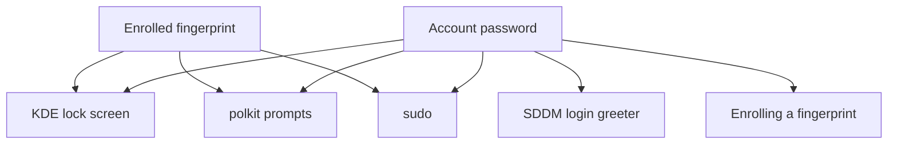

# Fingerprint Authentication - Plan

## Goal Capsule

- **Objective:** h82 clears the screen lock and authorises privileged actions on this laptop without typing the account password, while the login greeter stays password-only, the password remains accepted everywhere, and the fingerprint never becomes a credential for enrolling more fingerprints.
- **Means:** Enable the upstream `fprintd` module, withhold the factor from every greeter-reachable PAM service by naming them (KTD3), and prove the result from the rendered PAM files (KTD5, KTD6).
- **Product authority:** This plan owns which authentication surface gains the fingerprint factor, what the user is promised when it fails, and where enrollment state lives. It does not own the LUKS passphrase or the TPM enrollment, the Secure Boot key material, the YubiKey signing and recovery paths, the age identity handling in `modules/nixos/secrets.nix`, or any change to the Plasma desktop.
- **Stop conditions:** Stop and report rather than guessing if the factor cannot be withheld from the greeter by configuration alone; if an unenrolled or unavailable reader can cause a correct password to be refused (R6); if the fingerprint cannot be withheld from *every* path that reaches `fprintd`'s enroll and delete methods (R13, KTD13) — report it rather than narrowing R13 to the helper; if a new check cannot be made to fail for its own reason during mutation testing; or if either host's `toplevel` stops building.
- **Execution profile:** Declarative NixOS configuration, one packaged helper script, repository checks, and documentation. Enrollment and every surface's behaviour are hardware checks performed later on the laptop. Running `nixos-rebuild switch` as validation is out of bounds.
- **Who finishes:** `ce-work` implements and verifies through the Verification Contract; the hardware-check entries are performed later on the laptop.

---

## Product Contract

**Product Contract preservation:** changed, by user direction. The face factor was removed from the plan after the security review, so KD1 was replaced with the decision that removed it, R3 narrowed to the fingerprint, and R4 and R12 were deleted with their subject. R2 gained a qualifier, R5 was corrected on a point of fact, R7 became a closed-world assertion after review showed a rooted guard could not see a newly added service, and R13 and R14 are new requirements the security review made necessary. The former Outstanding Questions were resolved into Key Technical Decisions; the two blocking product questions the review opened are resolved by KD1.

### Summary

Give this laptop's KDE lock screen, polkit prompts, and `sudo` an enrolled fingerprint as an alternative to typing the account password. The login greeter is untouched, every surface still accepts the password, and enrolling a fingerprint always requires the password.

### Problem Frame

This is a single-user laptop whose account password is typed many times a day — at every screen unlock, every `sudo`, and every 1Password or system-settings prompt. The first migration into this repository deliberately left biometrics out; the implementation plan for it lists "face/fingerprint authentication" among the things not included, so the capability has been absent since the machine was installed rather than considered and rejected.

The hazard is that the safe configuration and the obvious one are not the same configuration. `fprintAuth` defaults to on for every PAM service the moment `fprintd` is enabled, and SDDM's auth stack is `substack login`, so simply enabling the daemon hands the login greeter a fingerprint factor. That is the one place it must not go: authenticating the first login of a session with a fingerprint leaves KWallet locked behind the account password, which the user then has to type anyway. Nothing about the obvious configuration looks wrong while it is being written.

What the factor is worth matters more here than on a typical laptop. The production host binds its LUKS key to the TPM at PCR 7, so the disk unlocks itself at boot and the screen lock is the real at-rest boundary. Root holds `/var/lib/sbctl`, the Secure Boot signing keys, and `/var/lib/sops-nix/key.txt`, the age identity behind every service token. A factor that reaches `sudo` is therefore a credential for all of it, which is why the factor's strength and what it may authorize are decided here rather than inherited.

### Key Decisions

- KD1. **The fingerprint is the only biometric factor; face recognition is not part of this work.** (session-settled: user-directed — chosen over Howdy face authentication at `sudo`: under the `sufficient` control flag that keeps it from denying a correct password, a face grants root on the user's mere presence rather than on a deliberate act, and root on this machine reaches the Secure Boot signing key.) Governs R3, R5.
- KD2. **The login greeter stays password-only.** Authenticating the first login of a session with a fingerprint leaves KWallet locked behind the account password. (session-settled: user-directed — chosen over including SDDM in the covered set.) Governs R5, R7.
- KD3. **Biometrics are an additional factor, never a replacement.** No surface may become biometric-only, so a dead sensor or an unenrolled user degrades to the current behaviour rather than to a lockout. Governs R6.
- KD5. **Enrollment stays manual, behind a packaged helper.** Fingerprint templates live on the sensor itself, so they cannot be declared. (session-settled: user-approved — chosen over documenting the procedure in prose alone: the repository's existing helper-plus-package-plus-test pattern gives the manual step a tested entry point.) Governs R9, R10.
- KD6. **The surface scoping is enforced by the build, not by care.** Because the unsafe configuration is the default one, a check that reads the materialized PAM files is the only thing that keeps a later unrelated edit from re-enabling the factor everywhere. Governs R7.
- KD7. **The bootstrap host carries no biometric factor.** It is an installer console with no enrolled finger, so the factor could only add latency to the install. Governs R11.
- KD8. **The fingerprint is a convenience credential of lower strength than the password.** The sensor link is unauthenticated on Linux — libfprint implements no SDCP — so match-result spoofing against a USB sensor is a documented attack on this class of hardware. Putting it on the lock screen lowers that surface from a secret in the user's head to the weaker of that secret and a USB device, knowingly. Governs R1, R3.
- KD9. **The fingerprint may not authorize enrolling a fingerprint through unprivileged paths.** A single successful match would otherwise mint a permanent second credential that lives outside the declared set and that no repository check can see. (Root is exempt because the fingerprint reaches `sudo` on this host; this boundary closes the unprivileged path and guards against accident.) Governs R13.
- KD10. **Enrollment state is deliberately outside the declared set.** Templates cannot be declared without putting biometric data where it does not belong, so the cost — state that survives module removal, generation rollback, and erasing the disk — is paid in documented procedure instead. Governs R10, R14.

### Requirements

**Coverage**

- R1. The KDE lock screen accepts an enrolled fingerprint in place of the account password.
- R2. A polkit authorisation prompt accepts an enrolled fingerprint in place of the account password, without a visible fingerprint prompt, because the KDE polkit agent renders only a password field.
- R3. `sudo` accepts an enrolled fingerprint in place of the account password.
- R5. The SDDM login greeter accepts the account password only, and gains no biometric factor. Disk unlock is unchanged by this work.

**Fallback and safety**

- R6. Each surface named in R1 through R3 accepts the account password whatever the fingerprint outcome, including when no finger is enrolled and when the reader is unavailable. No fingerprint result may cause an otherwise-correct password to be refused.
- R7. A repository check reads the PAM service files materialized by the built system, for both hosts, and fails unless the exact set of files carrying the fingerprint module equals an allowlist the check states independently. A service that allowlist does not name — including one a future nixpkgs or Plasma release introduces — turns the build red rather than inheriting the factor unnoticed.
- R13. Enrolling or deleting a fingerprint on unprivileged surfaces is authorized by the account password alone. A fingerprint may not authorize an enrollment or a deletion through those surfaces. (Privileged enrollment via root/`sudo fprintd-enroll` is unaffected because the fingerprint reaches `sudo`).

**Provisioning and state**

- R9. A packaged helper enrolls a fingerprint for the invoking user, run by hand once per machine, and reports an absent reader distinctly from a failed capture.
- R10. `docs/` records the enrollment procedure, the recovery path when the authentication stack refuses, and the hardware checks that confirm each surface, kept separate from repository-check evidence.
- R14. `docs/` records a destruction procedure for the on-sensor templates, and states that erasing the disk does not remove them.

**Host scope**

- R11. The bootstrap host builds with no fingerprint module on any PAM service.

### Acceptance Examples

- AE2. The greeter never sees a fingerprint.
  - **Covers R5, R7.**
  - **Given:** `fprintd` is enabled.
  - **When:** the check inspects every PAM file the built system materializes, following each greeter-reachable service's includes.
  - **Then:** nothing reachable from the greeter carries the fingerprint module, the covered surfaces do carry it, and the check fails the build if either stops holding.
- AE3. Nothing is enrolled yet.
  - **Covers R6.**
  - **Given:** a freshly rebuilt machine on which the helper has not been run.
  - **When:** h82 locks the screen and unlocks it, and runs `sudo`.
  - **Then:** both prompt for the account password and accept it, with no error beyond the absence of an enrolled factor.
- AE4. The installer console.
  - **Covers R11.**
  - **Given:** the bootstrap host configuration.
  - **When:** its system is built.
  - **Then:** no PAM file it materializes carries the fingerprint module.
- AE5. Enrollment demands the password.
  - **Covers R13.**
  - **Given:** a fingerprint is already enrolled and the reader is working.
  - **When:** the enrollment helper runs.
  - **Then:** the account password is demanded before a finger is written, and no fingerprint match substitutes for it.

### Key Flows

- F2. Returning to a locked session
  - **Trigger:** h82 wakes the laptop or dismisses the lock screen.
  - **Steps:** the fingerprint reader is live alongside the password field; either satisfies the unlock.
  - **Outcome:** the session resumes.
  - **Covered by:** R1, R5, R6.

### Scope Boundaries

- Face recognition, Howdy, and the infrared emitter, per KD1. The camera's infrared node and this machine's verified emitter calibration remain available if the decision is ever revisited; see Deferred to Follow-Up Work.
- The LUKS passphrase and the TPM enrollment. The factor does not run in the initrd, so this work does not change how the disk unlocks — see System-Wide Impact for what that existing arrangement means for the factor being added.
- The SDDM login greeter, per KD2.
- A declared root password or a debug shell. Both would be new standing credentials; the recovery path R10 documents is the boot menu.
- Storing fingerprint templates or receipts in this repository. They are not secrets this repository manages and must not enter `secrets/`.
- Any change to the Plasma desktop beyond what enabling the factor requires.

#### Deferred to Follow-Up Work

- Face authentication. If it is ever revisited, the work already done is not lost: the infrared node is `/dev/v4l/by-path/pci-0000:00:14.0-usb-0:8:1.2-video-index0`, greyscale-only, and this camera's emitter calibration — unit 7, selector 6, value `1 3 2 0 0 0 0 0 0`, marked to start — was verified on this machine's previous installation. The upstream interactive configuration fails on this camera, so that value is the only known path to a working emitter.
- Narrowing the fingerprint factor away from the remaining services that inherit it by default and that neither mutate credentials nor reach the greeter — `vlock`, `systemd-user`, `runuser`, and the non-setuid user-administration tools. KTD3 denies the credential-mutating ones explicitly; R7's allowlist is what keeps the rest from growing silently.

### Dependencies and Assumptions

- The reader is the Synaptics device at USB `06cb:00fc`, which libfprint's `synaptics` driver lists. It is a match-on-chip sensor: the template lives in the sensor's flash and `/var/lib/fprint/` keeps only a receipt, so an enrollment can neither be restored from backup nor destroyed by erasing the disk.
- `plasma6.nix` already sets `kde.fprintAuth = false` as a plain assignment, with an upstream comment explaining that fingerprint in the `kde` stack can block password login, and routes the lock screen's fingerprint through a separate `kde-fingerprint` service when `fprintd` is enabled. R1 is satisfied by that wiring, not by anything this plan adds.
- `pam_fprintd` is `sufficient` in the upstream default rules and returns promptly when no finger is enrolled, so R6 holds without a control-flag override. This is a claim about upstream behaviour that no repository check holds; it is re-verified by hardware check after any flake bump touching fprintd or pam.
- Fingerprint unlock is known to fail after suspend until the screen locker is recycled, because fprintd restarts on resume while the preserved locker keeps a stale PAM connection (nixpkgs#432276). This is upstream behaviour, recorded as a limitation rather than chased.
- KTD13's polkit denial disables enrollment from the KDE fingerprint settings page and from a bare `fprintd-enroll`. That is the intended cost of R13: the packaged helper becomes the only enrollment path, which KD5 already made the sanctioned one.
- A repository check can prove only what the configuration generates. That every surface behaves as R1 through R6 describe is a hardware check, per `CONCEPTS.md`.

---

## System-Wide Impact

This change makes a new credential into a key for everything root can reach on this machine, and root reaches more here than on a typical laptop.

The production host binds its LUKS key to the TPM at PCR 7 (`modules/nixos/boot.nix`), so a powered-off machine decrypts itself at boot with no human secret. The screen lock is therefore this machine's at-rest boundary, not the passphrase — and R1 puts the new factor on it. PCR 7 measures Secure Boot policy, not the kernel or the initrd, so any image signed by the keys in `/var/lib/sbctl` will be handed the disk key. Root holds those keys, because `boot.lanzaboote.pkiBundle` points at that directory. Root also holds `/var/lib/sops-nix/key.txt`, the age identity behind every token in `secrets/tokens.yaml`, whose ciphertext is in git history.

The chain that follows is: a fingerprint at `sudo` yields root; root yields the Secure Boot signing key; a signed image yields the disk key from the TPM, permanently, and unaffected by changing the account password. `docs/recovery.md` already carries the shape of the repair — re-key `sbctl` and re-enroll the TPM under the new policy — but it is written for a lost key, not for a compromised one. That is what KD8 accepts knowingly and what KD9 keeps from becoming persistent.

One further surface moves: `programs._1password-gui.polkitPolicyOwners = [ "h82" ]` puts 1Password's vault unlock on the polkit path R2 adds the fingerprint to.

---

## Planning Contract

### Key Technical Decisions

- KTD3. **The factor is withheld by naming services, because there is no global lever.** `fprintAuth` defaults directly to `services.fprintd.enable` per service with no intermediate switch, so every service using default rules inherits it. The module denies two groups explicitly: the greeter-reachable ones (`login`, `sddm`, `sddm-greeter`, `sddm-autologin` — SDDM's auth stack is `substack login`, so the greeter inherits through `login`), and the credential-mutating ones (`passwd`, `chpasswd`, `chsh`, `chfn`, `su`). The second group matters because `nixos/modules/programs/shadow.nix` declares `passwd = { }` with default rules, so a fingerprint would otherwise satisfy `passwd`'s auth phase and set a new account password without the old one — promoting the weaker credential into the stronger one that KD8 treats as the anchor. Governs R5, R7.
- KTD5. **The guard check reads `config.environment.etc."pam.d/<name>".source`.** That attribute is the materialized file inside the single `pam.d` derivation — the bytes that land in `/etc`. `security.pam.services.<name>.text` is a module option value that also exists for services never materialized, which is the weaker assertion this repository's learnings warn against. Governs R7.
- KTD6. **The check is closed-world: the set of files carrying the factor must equal a stated allowlist.** A guard rooted at a fixed list of greeter services can only look down from roots it already knows, so a service a future nixpkgs or Plasma release adds would arrive with `fprintAuth` on and stay invisible to both the module's deny list and the check's expectations. Comparing the whole set against an allowlist makes any new carrier red by default, which is what KD6's "by the build, not by care" actually requires. Entries are resolved by `target` rather than attribute name — the mistake `tests/nixos-rebuild-helper.nix` and `tests/claude.nix` both comment on — and the collected set is asserted non-empty so nothing passes over nothing. Include closure still matters for the greeter, since `sddm` carries no rules of its own. Governs R7.
- KTD8. **One module, gated per host.** `modules/nixos/fingerprint.nix` keeps one concern; the host enables it with `!config.my.bootstrap`, following the `my.cliAuth` precedent. Governs R11.
- KTD9. **One enrollment helper, with a small documented exit-code set.** Environment overrides in the style of `scripts/nr` give it a stubbed test surface; tests assert the stderr message alongside the code, since this repository's convention is `die()` printing to stderr rather than signalling by code alone. Governs R9.
- KTD13. **Enrollment is closed to unprivileged polkit sessions, and reopened only through a fingerprint-free PAM service the module owns.** Making the `fprintd` polkit actions "demand a password" cannot work: `nixos/modules/security/polkit.nix` declares one `polkit-1` PAM service for every action, R2 deliberately gives that service the fingerprint factor, and upstream fprintd ships `net.reactivated.fprint.device.enroll` as `auth_self_keep` — so a swipe satisfies enrollment and the grant is then cached. A helper-side prompt alone does not close it either, because `fprintd-enroll` and the KDE fingerprint page reach the same D-Bus method directly. The mechanism is therefore a polkit rule denying the enroll and delete actions to non-root sessions, plus a dedicated `enroll-fingerprint` PAM service carrying neither the fingerprint nor the smartcard factor, which the helper authenticates against before reaching `fprintd` via `sudo` with the privilege that denial now requires. (Because fingerprint reaches `sudo`, root may enroll directly; this rule and helper close the unprivileged route, not the privileged one.) Verification is unaffected — `net.reactivated.fprint.device.verify` is untouched, so R1, R2 and R3 still hold. Governs R13.

### Implementation Constraints

- **The service lists are duplicated on purpose.** The module's `fprintAuth = false` lists and the check's allowlist are independent literals. Deriving one from the other would let a single edit change both and turn the guard green — the trap `converged-fixture-state-defeats-nix-check-mutation-testing.md` and `nix-check-assertion-on-unconditional-option-folds-to-a-constant.md` both describe. A later simplification pass will try to remove this duplication; the module and the check each carry a comment saying not to.
- **Negative assertions are explicit branches.** `! grep …` is exempt from `set -e`, so an inverted assertion in a Nix builder is a comment. Write `if grep -q …; then echo >&2; exit 1; fi`, slice the `auth` stack before asserting, accumulate failures rather than exiting at the first, and `set -x` the builder.

---

## Implementation Units

### U1. Fingerprint factor, its greeter boundary, and the guard that proves it

- **Goal:** `fprintd` is enabled, the factor reaches the lock screen, polkit and `sudo` and nothing else, and the build fails if that stops holding.
- **Requirements:** R1, R2, R3, R5, R6, R7, R11, R13; KTD3, KTD5, KTD6, KTD8, KTD13.
- **Dependencies:** none.
- **Files:** `modules/nixos/fingerprint.nix` (new), `hosts/ThinkPad-X1-Carbon-Gen-11/default.nix`, `tests/pam-fingerprint.nix` (new), `flake.nix`.
- **Approach:**
  1. Declare `options.my.fingerprint.enable` and put everything under `lib.mkIf cfg.enable`, following `modules/nixos/podman.nix`.
  2. Enable `services.fprintd`. Leave `kde` and `kde-fingerprint` to the Plasma module.
  3. Set `fprintAuth = false` explicitly on the greeter-reachable services (`login`, `sddm`, `sddm-greeter`, `sddm-autologin`) and the credential-mutating ones (`passwd`, `chpasswd`, `chsh`, `chfn`, `su`), per KTD3, with the duplication comment from Implementation Constraints.
  4. Declare the `enroll-fingerprint` PAM service with `fprintAuth = false` and `p11Auth = false`, and add the polkit rule denying `net.reactivated.fprint.device.enroll` and `…delete` to interactive sessions, per KTD13.
  5. Add the module to the host's `imports` — alphabetically, between `desktop.nix` and `fonts.nix` — and set `my.fingerprint.enable = !config.my.bootstrap`.
  6. Create `tests/pam-fingerprint.nix`, resolving entries by `target` prefix and `enable`, asserting the collected set is non-empty, and register it in `flake.nix`. Open it with the repository's check-interface header, stating the import line, the per-host `Verifies:` list, why it reads `.source` rather than the option value, why negatives are explicit branches, and why failures accumulate.
  7. Read the initial allowlist off the built system rather than guessing it: every service that carries `pam_fprintd.so` after step 2 either appears in the allowlist as a deliberate entry or is denied in step 3. Adding an entry later is a deliberate act, which is the property KTD6 buys.
- **Patterns to follow:** `modules/nixos/podman.nix` for the option-plus-`mkIf` shape; `hosts/ThinkPad-X1-Carbon-Gen-11/default.nix:17` for the bootstrap gating idiom; `tests/yubikey-fido.nix` for the two-host loop, the failure accumulator, the `assertPath` null-guard and the `esc` helper; `tests/keyd-remap.nix` for section-scoped assertions and the explicit-branch rule; `tests/nixos-rebuild-helper.nix:47-52` for resolving an `environment.etc` entry by `target`.
- **Execution note:** the check's value is entirely in whether it can fail. Run the mutation rounds before calling this unit done, and read `nix log` to confirm each failure came from its own assertion.
- **Test scenarios:**
  1. The `sudo`, `kde-fingerprint` and `polkit-1` files carry `pam_fprintd.so`. Without this positive assertion the negatives below fold to a constant whenever `fprintd` is off.
  2. `kde` does not carry `pam_fprintd.so`, matching the upstream decision the Plasma module comments.
  3. `Covers AE2.` Nothing in the transitive include closure of `login`, `sddm`, `sddm-greeter` or `sddm-autologin` carries `pam_fprintd.so`.
  4. `Covers AE5.` Nothing in the transitive include closure of `enroll-fingerprint` carries `pam_fprintd.so`.
  5. `passwd`, `chpasswd`, `chsh`, `chfn` and `su` do not carry `pam_fprintd.so`.
  6. The exact set of files carrying `pam_fprintd.so` equals the allowlist. Introducing a new PAM service that inherits the factor turns the check red even though it is neither greeter-reachable nor on any deny list — this is the closed-world property, and it is the scenario that distinguishes KTD6's design from a rooted-list guard.
  7. Removing `fprintAuth = false` from `login` turns the check red, naming the greeter boundary.
  8. Adding the factor to a file the greeter reaches only indirectly turns the check red — the closure assertion, not the per-file one.
  9. Removing `fprintAuth = false` from `passwd` turns the check red.
  10. Re-enabling the factor on `enroll-fingerprint` turns the check red.
  11. `Covers AE4.` The bootstrap host materializes no file carrying `pam_fprintd.so`. Removing the `!config.my.bootstrap` gate, so the factor reaches the bootstrap host too, turns the bootstrap assertions red while the production ones stay green — which is what proves the check reads both hosts rather than one.
  12. Renaming a PAM entry's `target` still finds the file; the check fails inside the builder, not in the evaluator, when an entry it resolves is absent.
  13. Emptying the collected set turns the check red rather than passing every negative over nothing.
  14. Dumping the generated `buildCommand` from the `.drv` shows no assertion folded to a comparison of a constant with itself.
- **Verification:** the check is registered and passes; both hosts' `toplevel` build; every scenario above has been observed red for its own reason.

### U5. Enrollment helper, authorized by password

- **Goal:** one command enrolls a finger, demands the account password first, and says when the reader is missing.
- **Requirements:** R9, R13; KTD9, KTD13.
- **Dependencies:** U1.
- **Files:** `scripts/enroll-fingerprint` (new), `packages/enroll-fingerprint.nix` (new), `tests/enroll-fingerprint.sh` (new), `modules/nixos/fingerprint.nix`, `flake.nix`.
- **Approach:**
  1. Write it as bash with `@UPPERCASE@` placeholders for the external commands, substituted at package time with `--replace-fail`.
  2. Satisfy R13 by authenticating the invoking user against the `enroll-fingerprint` PAM service U1 declares, per KTD13, before reaching `fprintd` at all.
  3. Give a small, documented exit-code set distinguishing an absent reader from a failed capture, and make re-enrollment of the same named finger explicit rather than incidental.
  4. Refuse to run as root, so the helper cannot enroll for another user by accident.
  5. Provide environment overrides for the capture and enrollment commands only. The authentication step is never overridable — otherwise the test surface becomes the bypass, and a holder of an enrolled finger could stub out the very password demand R13 exists to require.
  6. Install it through the module, gated with the factor, so a host without the factor does not carry a helper that cannot work.
- **Patterns to follow:** `packages/docker-credential-sops.nix` for a single-helper package file; `packages/nix-tools.nix:8-14` for the `substituteInPlace` plus `patchShebangs` shape; `tests/nr.sh` for the stubbed-command harness; the `claude-settings` check in `flake.nix:88-126` for asserting the *packaged* artifact; `scripts/recover-age-identity:21-24` for the refuse-as-root guard and the docstring naming the boundary.
- **Test scenarios:**
  1. The stub succeeds: the helper exits 0 and reports the finger enrolled.
  2. `Covers AE5.` With a finger already enrolled, the helper still demands the password before writing another.
  3. The stub reports no device: the helper exits with the absent-reader code and its stderr names the reader, not a capture failure.
  4. The stub fails to capture: the helper exits with the failed-capture code, distinct from the absent-reader code, with its own stderr message.
  5. Invoked as root: the helper refuses and exits non-zero without calling the stub.
  6. Run twice for the same named finger: the second run reports replacement rather than a second enrollment.
  7. Every environment override the helper honours is set at once: the password demand still runs. The overrides cannot reach the authentication step.
  8. `fprintd-enroll` invoked directly from an interactive session is refused by the polkit rule, so the helper is not merely the convenient path but the only one.
  9. The built artifact carries no surviving `@[A-Z_]+@` placeholder and a store-path shebang.
- **Verification:** the shell test is registered in `flake.nix` and passes; a real enrollment is a hardware check.

### U6. Documentation

- **Goal:** the enrollment procedure, the recovery path, the destruction procedure, and the hardware checks are written down before the change lands.
- **Requirements:** R10, R14.
- **Dependencies:** U1, U5.
- **Files:** `docs/provisioning.md`, `docs/recovery.md`, `docs/verification.md`.
- **Approach:**
  1. Add a provisioning section for enrollment in that file's existing shape: the boundary, the command block, what it wrote, and that the template lives on the sensor rather than on disk.
  2. Add a recovery section for an authentication stack that refuses: select a previous generation at the boot menu. State it correctly — under PCR 7 the TPM still releases the disk key, so no passphrase is needed for the rollback itself — and state that `nixos-rebuild switch --rollback` is not the first step, because it needs the `sudo` that is refusing. Note that a rollback escapes the stack but also rolls back everything else in that generation, and revokes no enrollment.
  3. Add a destruction section per R14: how to remove enrolled fingers, and the plain statement that erasing the disk leaves the templates in the sensor, so sale, service, or disposal needs that step. Record that a compromised template cannot be rotated the way the password, age identity, or tokens can.
  4. Extend the compromise path in `docs/recovery.md`: fingerprint-obtained root implies re-keying `sbctl` and re-enrolling the TPM, not only deleting a finger.
  5. Add one sentence per registered check to `docs/verification.md` — `pam-fingerprint` and the helper's test — each naming what it asserts and what it deliberately does not reach, including that no build-time check can see who is enrolled.
  6. Add hardware checklist entries, each with its "no repository check can reach this" sentence: each surface behaves as R1 through R3 describe; the greeter still demands the password; enrollment succeeds and demands the password; `fprintd-list h82` reports exactly the intended fingers; the boot-menu rollback works after this change; the known post-resume limitation; and that the KDE fingerprint settings page no longer enrolls, by design.
  7. Mark three entries as performed **at the first production switch, before any finger is enrolled**, not afterwards: the R6 fallback at the lock screen and at `sudo` with nothing enrolled; the same with the reader unresponsive; and the LUKS recovery passphrase verified to unlock this disk since the last TPM enrollment. R6 rests on an upstream behavioural claim no repository check holds, so the first test of it must not be an ordinary day on the only machine — read the boot-menu rollback path beforehand.
  8. Note that fingerprint templates and receipts are runtime state and must not enter `secrets/`.
- **Patterns to follow:** the two-section split in `docs/verification.md`; the phase-heading-plus-command-block shape in `docs/provisioning.md`.
- **Test scenarios:** `Test expectation: none -- documentation only.`
- **Verification:** every registered check has a sentence; every claim R1 through R6 makes has either a repository check or a hardware checklist entry.

---

## Verification Contract

| Gate | Command | Applies to |
| --- | --- | --- |
| Formatting | `nix fmt -- --ci` | all units |
| Checks | `nix flake check` | U1, U5 |
| Production build | `nix build --no-link .#nixosConfigurations.ThinkPad-X1-Carbon-Gen-11.config.system.build.toplevel` | U1, U5 |
| Bootstrap build | `nix build --no-link .#nixosConfigurations.ThinkPad-X1-Carbon-Gen-11-bootstrap.config.system.build.toplevel` | U1, U5 |

Mutation rounds are part of U1's verification, not an optional extra. Run each scenario in its list, confirm the build turns red, read `nix log` to confirm the failure came from the intended assertion rather than from an evaluation abort or a different assertion, then restore. Count rounds per class of assertion, per `CONCEPTS.md`.

`nixos-rebuild switch` is not a validation step here. Every claim about the real reader is a hardware check recorded per `docs/verification.md`.

## Definition of Done

- Every unit's verification has been run and passed, and the two builds and `nix flake check` are green.
- U1's mutation rounds have been observed red for their own reasons, and the `.drv` `buildCommand` inspection found no assertion folded to a constant.
- `docs/verification.md`, `docs/provisioning.md`, and `docs/recovery.md` carry the entries U6 names, and the hardware checklist is written but explicitly not claimed as performed.
- No fingerprint template, receipt, or enrollment output has entered the repository.
- Abandoned or experimental code from approaches that did not pan out is removed rather than left in the diff.
