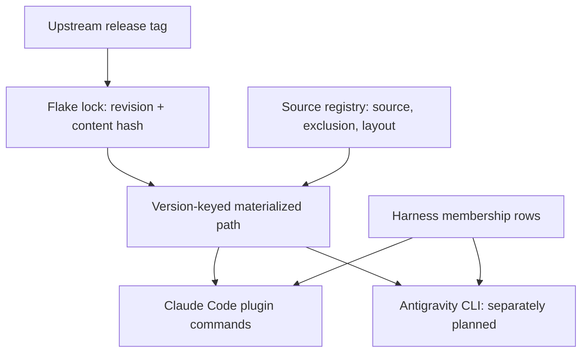
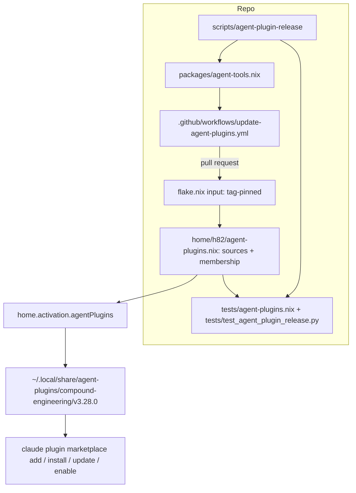
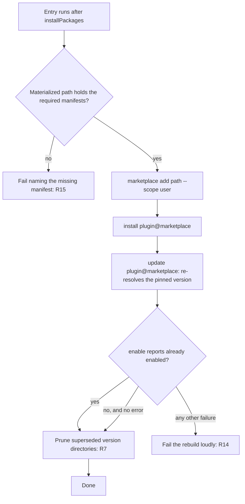

# Nix-Owned Agent Plugin Registry - Plan

## Goal Capsule

- **Objective:** A coding-agent plugin this repository declares arrives at a known upstream release on every machine built from the flake, and a rebuild of the same commit installs the same bytes — so the agent tooling stops being the one part of this environment that drifts with wall-clock time.
- **Means:** Pin the source as a tag-pinned flake input, materialize it at a version-keyed path, and drive Claude Code's own plugin commands from that path, all from registry data (KTD1, KTD2, KTD4).
- **Product authority:** Claude Code is the harness this plan wires. Antigravity CLI (`agy`) is named in the registry contract but deliberately not wired here; it is separately planned work, not active scope.
- **Execution profile:** Configuration and packaging work. The first proof is `nix flake check` plus both host builds; no runtime behavior is provable in continuous integration, so the wiring's real proof is a hardware check recorded separately per `docs/verification.md`.
- **Stop conditions:** Stop if `claude plugin marketplace add` cannot accept the materialized path, if the wiring cannot run non-interactively, or if a mutation round shows a new assertion cannot fail. Do not run `nixos-rebuild switch` as validation, and do not install on the physical laptop without an explicit instruction.
- **Who finishes:** `ce-work` implements and verifies with the commands in the Verification Contract. Hardware verification and the first `workflow_dispatch` of the tracker stay with the user.
- **Open blockers:** None.

---

## Product Contract

### Summary

Add a Nix-owned plugin layer that installs `EveryInc/compound-engineering-plugin` into Claude Code from a flake-pinned upstream release tag, materialized at a version-keyed path and wired by invoking Claude Code's own plugin commands. Source declaration and harness membership are separate registry data so a second plugin, or a second harness, is added by rows rather than by new bespoke wiring. Release tracking that proposes pin bumps is part of this work.

### Problem Frame

The plugin is already declared, and its declaration cannot reproduce. `agents.toml:13` names `source = "EveryInc/compound-engineering-plugin"` with no ref, no tag, and no rev, and dotagents refreshes git sources on every install — so the version a machine gets is whatever upstream HEAD happens to be at install time. The resolved commit does get recorded, but `agents.lock` is gitignored (`.gitignore:13`), added there by dotagents itself, so the record never leaves the machine that made it. A fresh clone resolves again, to something else.

The blast radius is larger than one plugin. `.agents`, `.claude`, `.claude-plugin`, and `.opencode` are all gitignored (`.gitignore:17-20`), and the whole layer is produced by a `mise.toml` postinstall hook. Every other part of this environment is a flake output whose inputs are locked; the agent tooling is the exception, reached by an imperative hook over the network.

Cost shape: the skills that drive planning, review, and debugging here change underneath the person using them, with nothing in the repository recording which version was in play. There is no way to reproduce a session, and no way to hold a pin while an upstream change is evaluated.

### Key Decisions

- **The pin lives in the flake, not in `agents.toml`.** (session-settled: user-directed — chosen over an `agents.toml` ref pin: `agents.toml` is repo-wide project-scope configuration, and the pin belongs where every other dependency in this repository is pinned.) Governs R1.
- **The pin is a release tag, not a branch head.** (session-settled: user-directed — chosen over pinning the last commit: a release is a deliberate upstream boundary, a branch head is whatever landed.) Governs R1, R2.
- **Release tracking is in scope.** (session-settled: user-directed — chosen over a manually-edited pin: the pin should not go stale silently.) Governs R2, R3.
- **Tag resolution is a packaged repository helper that continuous integration calls, not logic living inside a workflow.** (session-settled: user-directed — chosen over a workflow-only tracker and over a hand-run helper with no automation: it follows this repository's existing shape of a script under `scripts/`, packaged under `packages/`, and covered by a check, which is what makes the tag-prefix trap reproducible outside continuous integration.) Governs R4.
- **Claude Code is wired by invoking its own plugin commands, not by declaring marketplace or enablement keys in a settings file.** (session-settled: user-approved — chosen over the `extraKnownMarketplaces` / `enabledPlugins` settings route: Claude Code owns those keys and rewrites them, so declaring them fights the writer on every activation.) Governs R11, R12.
- **Harnesses read from a version-keyed path, not from a store path directly.** (session-settled: user-approved — chosen over passing the store path to the CLI: the source string a harness records then changes only when the version changes, and superseded versions become identifiable for removal.) Governs R5, R6.
- **The registry separates source declaration from harness membership, and carries per-harness content exclusion from the outset.** One harness can misclassify a tree another accepts, so the field exists before it is needed rather than being retrofitted. Governs R8, R9, R10.
- **The existing dotagents and mise layer is untouched.** (session-settled: user-directed — chosen over retiring or narrowing it: that layer exists to standardize this repository's own development environment, which is a separate concern from the user's installed agent tooling.) Governs R17.

The shape this creates — one pinned source fanning out to many harnesses through one version-keyed materialization:

<!-- ce-section: work-relationships -->
### How This Work Fits Together

This plan covers one area: the pinned source, the version-keyed materialization, the registry that describes both, and the Claude Code wiring plus its repository check. The breakdown below is the current understanding of the surrounding work, not a committed roadmap.

- Antigravity CLI (`agy`) wiring
  - Depends on this plan's registry and materialized path.
  - Still to decide: whether the tree needs its own content exclusion, how a per-directory enablement model reaches a global install, and what happens when a permission review leaves the plugin disabled.
- Additional plugins beyond Compound Engineering
  - Can proceed independently of this plan once the registry exists.
  - Shares the pin-bump and pruning behavior rather than restating it.
- The dotagents and mise project-scope layer
  - Can proceed independently of this plan; explicitly out of scope here (R17).

### Requirements

**Source pinning**

- R1. The plugin source is pinned in the flake to an upstream release tag, and the flake lock records the revision and content hash that tag resolved to.
- R2. Pin resolution selects the newest upstream tag carrying the plugin's own tag prefix; a bare latest-release query is not an acceptable source of truth, because upstream publishes interleaved tag trains and a latest-release query resolves to the wrong train.
- R3. Release tracking surfaces an available newer release as a reviewable change and never lands a pin bump unreviewed.
- R4. The tag-resolution logic lives in a repository helper a check exercises directly, and continuous integration invokes that helper rather than reimplementing resolution, so R2's prefix rule is testable without running the workflow.

**Materialized layout**

- R5. Each declared plugin is materialized at a path whose final segment identifies its version, so the path a harness records changes only when the version changes.
- R6. Two versions can occupy the layout at once, so a bump does not require removing the working version before the new one is wired.
- R7. A superseded version directory is removed only after the wiring for the current version has succeeded.

**Registry shape**

- R8. A plugin source is declared once in a neutral source registry, and its membership in a harness is declared separately from that source.
- R9. The source registry carries a per-harness content-exclusion field from the outset.
- R10. The registry accepts a harness this plan does not wire, so wiring Antigravity CLI later is a membership row rather than a redesign.

**Claude Code wiring**

- R11. Claude Code receives the plugin by invoking its own plugin commands against the materialized path, and this repository declares no marketplace or plugin-enablement keys in any settings file it merges.
- R12. Wiring registers the source, installs the plugin, re-resolves the pinned version, and enables the plugin, in that order — the re-resolution step is required because installing is a no-op once the plugin is present at any version.
- R13. Wiring against an already-converged machine changes nothing and reports success.
- R14. A wiring failure stops the rebuild loudly, rather than leaving the plugin absent or disabled without saying so.
- R15. Wiring refuses to run when the materialized path lacks a manifest Claude Code requires, and names the missing manifest.

**Repository checks**

- R16. A repository check asserts the wiring that evaluated configuration actually materializes — the commands invoked and the path passed to them — rather than the option values that produce them.
- R17. The checks cover every host this flake declares, and assert that this work leaves the project-scope dotagents declaration unchanged.

### Acceptance Examples

- AE1. Pin bump reaches the agent
  - **Covers R1, R5, R12.**
  - **Given** a machine converged on one pinned release, **when** the pin moves to a newer release and the machine rebuilds, **then** the harness serves the new version rather than continuing to serve the old one.
- AE2. Converged rebuild is quiet
  - **Covers R13.**
  - **Given** a machine already wired at the current pin, **when** it rebuilds with nothing changed, **then** the wiring reports success and alters no harness state.
- AE3. Interleaved tag trains
  - **Covers R2, R4.**
  - **Given** upstream has published a newer tag belonging to a different tag train than the plugin's, **when** the resolution helper runs, **then** it does not propose that tag, and the check covering the helper proves it.
- AE4. Missing manifest
  - **Covers R15.**
  - **Given** a materialized path whose required manifest is absent, **when** wiring runs, **then** it fails naming that manifest and does not register a broken source.
- AE5. Pruning waits for success
  - **Covers R6, R7.**
  - **Given** a pin bump whose wiring fails, **when** the rebuild ends, **then** the previous version directory still exists and the harness remains pointed at a working version.
- AE6. The check guards the re-resolution step
  - **Covers R12, R16.**
  - **Given** the check passes, **when** the re-resolution step is removed from the wiring, **then** the check fails and names that step.

### Scope Boundaries

- Antigravity CLI wiring. Deferred to its own plan; the registry contract accommodates it (R10).
- The dotagents, mise, and `agents.toml` project-scope layer. Untouched, and asserted untouched (R17).
- The other harnesses already declared in `agents.toml`. Not wired here.
- Plugins other than Compound Engineering. The registry admits them; declaring them is separate work.
- Installing on the physical laptop. This plan produces configuration and checks; hardware installation needs an explicit instruction.

### Dependencies and Assumptions

- Upstream publishes release tags of the form `compound-engineering-v<semver>`; the current release is `compound-engineering-v3.28.0`, resolving to `c152896f1cda13548fc1a05b2aff88caf8ae8dba` — the same commit `agents.lock:14` currently records, so pinning changes nothing today and diverges the first time upstream moves.
- The plugin is skills-only: `skills/` holds 36 entries and there is no top-level `commands/`, `agents/`, or `hooks/` directory. A harness that serves the skills serves the whole plugin.
- The plugin's own `.claude-plugin/marketplace.json` declares marketplace name `compound-engineering-plugin` and plugin name `compound-engineering`, with the plugin's source as `./`. `claude plugin validate` accepts the tree as-is, so no generated marketplace file is needed and no content exclusion is required for Claude Code today (R9 keeps the field for the harness that does need it).
- **Unverified:** that `claude plugin marketplace add` accepts a symlink into a read-only store path, and that `claude plugin update` can then re-resolve from a local-path marketplace whose tree is read-only and carries no `.git`. The `update` half matters more than the symlink half, because R12 makes `update` the step a pin bump depends on. U3 settles both by observation.
- **Unverified:** that a first `claude plugin` invocation in this environment needs no onboarding or trust confirmation. `install` documents `-y, --yes` as required when stdin or stdout is not a TTY, but only for a marketplace-declared command, which this plugin does not carry; U3 confirms the run is non-interactive rather than assuming it.

### Open Questions

**Deferred to planning**

All planning-time questions this Product Contract deferred are resolved in the Planning Contract below: the materialized location and its lifetime owner (KTD2), the version segment's derivation (KTD3), activation versus a user service (KTD2), how the pin is recorded (KTD1), and the tracker's cadence and shape (KTD9).

**For the user**

- What repository and permission scope does `GH_TOKEN_FOR_UPDATES` carry, and is `main` branch-protected? U6 declares the job's permissions, but the tracker's effective reach is the token's scope, and whether a pin bump can merge without a human is a branch-protection fact. Neither is discoverable from the repository, and both bound how much the tracker is trusted with.

**Deferred to implementation**

- What `claude plugin marketplace add` does when the marketplace name is already registered — at the same path, and at a different path. The different-path case is what every pin bump takes, since the destination is version-keyed. The wiring does not depend on the answer: U3 step 4a removes before adding, so the sequence is deterministic either way. The observations are recorded because they tell a later reader whether that prologue is still needed.
- Whether `claude plugin update` resolves from the marketplace's currently recorded source or from the source recorded at install time. R12's ordering assumes the former, and AE1 fails silently if it is the latter.
- How the tracker invokes the packaged helper — `nix run` against the checkout, or `nix build` and a direct store path. The choice decides whether the workflow needs a Nix install step and therefore how much of `check.yml`'s shape it inherits.
- Whether `claude plugin install` can prompt on this plugin. The plugin declares no marketplace command, so `--accept-command` should never be needed; U3 verifies the run is non-interactive rather than assuming it.

### Sources and Research

- `agents.toml` — the unpinned plugin declaration, and the harness list, which omits any Gemini or Antigravity target.
- `agents.lock:10,14` — the resolved commit that never leaves the machine, given `.gitignore:13`.
- `.gitignore:13,17-20` — the gitignored agent layer.
- `mise.toml:2,5-7` and `mise.lock:3-4` — the imperative postinstall path; the installer is pinned, the plugin it installs is not.
- `flake.nix:19` — `lanzaboote` pinned to a version tag, the existing precedent for tag pinning. No `.nix` file in the repository calls `fetchFromGitHub`, `fetchzip`, `fetchgit`, or `fetchurl`.
- `flake.lock`, the `lanzaboote` node — `original` stores `ref: v1.1.0` while `locked` stores the resolved `rev` and `narHash`. A relock re-resolves `original.ref`, so a tag that moves upstream produces a new `locked.rev`. This is why KTD1 records an expected revision rather than trusting the tag string, and why U7 asserts the lock against it.
- `.github/workflows/update-flake-lock.yml` — a weekly scheduled workflow already opens a labelled pull request updating the flake lock, and is the shape a tracker should follow. It cannot do this job as it stands: it re-resolves the lock for the ref each input names, so a tag-pinned input never moves off its tag. Bumping a release pin means rewriting the pinned tag itself, which is why R3 and R4 exist rather than a note to reuse this workflow.
- `flake.nix:61,87,127`, `tests/claude.nix`, and `tests/gemini.nix` — where a check registers and the idiom it must follow: assert the rendered output rather than the module attribute, carry an `or` fallback on every lookup, guard interpolation with `lib.optionalString`, and collect every failure instead of exiting at the first.
- `home/h82/claude.nix:72` and `home/h82/gemini.nix:52` — the two existing activation entries, ordered after `installPackages`, with the exit status deliberately not swallowed. `tests/claude.nix:121-135` greps for `|| true`, `; true`, and `set +e` to enforce that.
- The built activation script for this host orders entries `checkLinkTargets`, `writeBoundary`, `installPackages`, `antigravitySettings`, `checkFilesChanged`, `claudeSettings`, `linkGeneration`, `onFilesChange`, `reloadSystemd`. Both `linkGeneration` and `installPackages` are declared `entryAfter [ "writeBoundary" ]` in Home Manager (`modules/files.nix:256`, `modules/home-environment.nix:717`), so their order comes from the sort, not from a declared dependency. This is the evidence for KTD2. It also shows the comment at `home/h82/claude.nix:60-71` overstates its case: ordering after `installPackages` does keep a refusal from stranding `installPackages`, but `linkGeneration` still sits behind those entries and a refusal does strand it. Correcting that comment is outside this plan's scope.
- `packages/agent-tools.nix:1-21` and `packages/nix-tools.nix:8-14` — the script-packaging idiom: `stdenvNoCC.mkDerivation`, `dontUnpack`, `install -Dm755`, `substituteInPlace --replace-fail '@TOKEN@'`, `patchShebangs`, `meta.mainProgram`.
- `scripts/nr:16-19` and `scripts/prepare-age-identity:9-11` — the env-var binary-override idiom that makes a shell-out testable, exercised by `tests/nr.sh` and `tests/age-identity-helpers.sh`.
- `tests/github-workflow-conventions.sh:23-26,32-33` — an existing check over workflow YAML, which the two Nix workflows are excluded from, and the repository's stated position that a sandboxed check has no network.
- `.github/workflows/claude-code-review.yml:15-17` — the review gate excludes only the agent's own bot, deliberately, so a bot-authored pull request still gets reviewed.
- `CONCEPTS.md`, Coding agent configuration — settings tier, declared set, and activation reassertion. Activation reassertion is why R13's no-op behavior is stated rather than assumed.
- `.compound-engineering/artifacts/solutions/best-practices/nix-check-reads-option-value-not-materialized-output.md`, `mutation-testing-reveals-decorative-nix-check-assertions.md`, `unguarded-derivation-interpolation-defeats-nix-check-mutation-testing.md`, `converged-fixture-state-defeats-nix-check-mutation-testing.md`, `nix-check-assertion-on-unconditional-option-folds-to-a-constant.md` — the basis for R16 and for U7's construction.
- `.compound-engineering/artifacts/solutions/best-practices/home-manager-activation-does-not-run-on-every-rebuild.md` — why every statement about reassertion in this plan is qualified by "produces a new Home Manager generation".
- `.compound-engineering/artifacts/solutions/integration-issues/sops-service-umask-blocks-user-secrets.md` — why the wiring sets no umask and runs no recursive `chmod` over a tree the CLI owns.
- `tests/github-workflow-conventions.sh:1-40` and `flake.nix:291-293` — that check takes exactly two positional arguments, is bound to the two agent workflows, and states in its own header that the Nix workflows are deliberately not read. It has no exclusion list, and its assertions are specific to the agent workflows, which is why U6 keeps action pinning by hand.
- `claude plugin install --help` on the installed 2.1.276 — `-s, --scope <scope>` defaulting to `user`, plus `--json`, `--registry`, `-y/--yes`, `--accept-command`, and `--config`. `-y` is documented as required when stdin or stdout is not a TTY, and only for a marketplace-declared command.
- The `hyperlapse122/dotfiles` repository carries a working two-layer plugin registry, a version-keyed materialized path, tag-prefix-filtered release resolution, a post-success prune, and continuous-integration tests over its Claude wiring. Its recorded lesson that `plugin install` is a no-op at any already-present version is the direct basis for R12. It also records that its Antigravity wiring was removed and survives only as a plan, which is why this plan defers that harness.

---

## Planning Contract

**Product Contract preservation:** Product Contract unchanged. R1–R17 and AE1–AE6 keep their meaning and IDs; AE5 gained `R6` alongside `R7` because KTD2 makes both requirements load-bearing on the same mechanism.

### Key Technical Decisions

- KTD1. **One tag-pinned flake input per plugin, with the expected revision recorded in the registry and asserted.** The tag is written literally in `flake.nix` and `flake.lock` records the revision and narHash. A literal tag is not by itself a pin: a git tag is mutable, `nix flake update` re-resolves the ref rather than the revision, and `.github/workflows/update-flake-lock.yml` relocks every input weekly — so a re-pointed upstream tag would arrive as a two-line lock diff and swap the skill bytes that reach every project on this machine. The registry therefore also records the revision the tag is expected to name, U7 asserts the lock agrees with it, and a relock that moves the revision turns the check red instead of landing. Adding a plugin is one input plus one registry row. (session-settled: user-directed — chosen over an `agents.toml` ref pin: the pin belongs where every other dependency here is pinned.) Governs R1, R2.
- KTD2. **The version-keyed path is created by the activation entry, not by Home Manager file linking.** `xdg.dataFile` is the obvious choice and cannot work here, because of where this repository's activation entries actually sit. A build of this host's activation script orders the entries `checkLinkTargets`, `writeBoundary`, `installPackages`, `antigravitySettings`, `checkFilesChanged`, `claudeSettings`, `linkGeneration`, `onFilesChange`, `reloadSystemd`: `installPackages` runs *before* `linkGeneration`, so an entry ordered after `installPackages` runs before Home Manager has linked this generation's files at all. A declared `xdg.dataFile` link would therefore not yet exist when the wiring reads it. Creating the symlink in the entry also keeps both versions present across a bump and puts removal after wiring, which is what R6 and R7 need. Covers R5, R6, R7.
- KTD3. **The version segment is the pinned tag with its prefix stripped**, giving `v3.28.0`. The tag is the pin, so it is the authority; the plugin manifest's own `version` field is a cross-check, not the source. Covers R5.
- KTD4. **Wiring is `marketplace add --scope user`, then `install`, then `update`, then `enable`, and the install identifier is read from the source's own manifest.** The identifier is `compound-engineering@compound-engineering-plugin` — plugin name from `plugin.json`, marketplace name from `marketplace.json`, neither of them the registry key. `marketplace add`, `install`, and `update` all take `--scope` and all default to `user` on this CLI version; the wiring states `--scope user` explicitly so the scope is declared rather than inherited from a default that could move. (session-settled: user-approved — chosen over the settings-key route: Claude Code owns those keys and rewrites them.) Governs R11, R12.
  - **Conflict call-out.** Research after this decision was settled found a third mechanism the dialogue never weighed: `claude plugin init` scaffolds into `~/.claude/skills/<name>/` and that plugin "auto-loads next session as `<name>@skills-dir`", and `claude plugin eval` confirms skills-dir plugins resolve like installed ones. A read-only symlink there would need no CLI invocation, no marketplace registration, no cache copy, and therefore no `update` re-resolution — it satisfies this decision's stated reason (do not fight the writer) more fully than the mechanism the decision chose, and it would delete KTD2, KTD6, and most of U3. The settled mechanism works, so this plan proceeds as settled; the finding is recorded here because the evidence the decision rested on has changed.
- KTD5. **`claude` is invoked by its store path, with this repository's declared environment tier exported around it.** The activation environment carries neither `home.packages` on PATH nor `home.sessionVariables`, so the entry interpolates the `claude-code` store path exactly as `home/h82/claude.nix:8-10` interpolates the merger, and sets the environment-tier keys itself. Otherwise the rebuild drives a CLI running on upstream defaults, with the autoupdater live. Covers R11, R14.
- KTD6. **Only the specific already-enabled message is tolerated; nothing else is swallowed.** `enable` on a converged machine reports that the plugin is already enabled, which is success; the entry matches that message and re-raises anything else, so `tests/claude.nix`'s no-swallow rule holds while R13 stays true. Covers R12, R13, R14.
- KTD7. **The resolver takes upstream JSON through an overridable fetch command.** A sandboxed check has no network (`tests/github-workflow-conventions.sh:32-33`), so the helper reads an env-var-overridable command in the idiom of `scripts/nr:16-19`, and the check feeds fixtures. Covers R4.
- KTD8. **The releases feed is the only source of candidates; the tag list only proves the prefix filter.** A candidate with no published, non-draft, non-prerelease release is rejected, which is what keeps the settled "release tag, not branch head" decision meaningful — the tag list carries no release status, so admitting candidates from it would let an unreleased tag win and would make U5's own prerelease-exclusion scenario unholdable. Prefix filtering applies to both, and version comparison is numeric per component. The tag namespace carries six interleaved trains — `compound-engineering-v` (106), `cli-v` (72), bare `v` (33), `marketplace-v` (5), `cursor-marketplace-v` (3), `coding-tutor-v` (3) — so resolving from tags is unsafe by construction. The releases feed happens to hold only the plugin's train today, which is upstream's choice and not a guarantee, so both paths filter. Lexical comparison would rank `v3.9.0` above `v3.10.0`. Covers R2, R4.
- KTD9. **The tracker rewrites the tag in `flake.nix`, relocks, and opens a pull request; it never pushes to the default branch.** It follows `update-flake-lock.yml`'s shape — weekly schedule plus `workflow_dispatch`, a static concurrency group, `dependencies` and `automated` labels, and the `GH_TOKEN_FOR_UPDATES || GITHUB_TOKEN` fallback — as a separate workflow, because the existing one cannot move a tag. Covers R3.

### High-Level Technical Design

Where each artifact sits, and what feeds what:

The activation entry's ordered protocol, which R12 owns and U3 implements:

### Assumptions

These are planning bets, not user decisions; the first one that proves wrong changes the unit it names.

- `claude plugin marketplace add` accepts a symlink to a store path as its `<source>`. The command documents "a URL, path, or GitHub repo" and `claude plugin validate` accepted the same tree by path, so a path source is established; that the path may be a symlink is the untested part (U3).
- The activation entry can complete without a terminal. Nothing in the command surface suggests a prompt for this plugin, and `--accept-command` exists only for marketplace-declared commands, which this plugin does not declare (U3).
- `~/.local/share/agent-plugins/` is a free location. The repository has no `xdg.dataFile` or `config.xdg.dataHome` usage, and the only `~/.local/share` reference is a read-only PATH entry in `home/h82/shell.nix:45-48`.
- The bootstrap host should carry this layer as well as the production host. The two hosts share the module set by design, and nothing about a plugin needs secrets, so excluding it would be a new divergence rather than a preserved one (U7 asserts both).

### System-Wide Impact

**Two layers will provide the same skills inside this repository.** The plugin becomes enabled at user scope, so every project this user opens gains the Compound Engineering skills — including this one, which already receives them from the project-scope dotagents layer that R17 leaves untouched. Inside this checkout both sources are live at once.

This is a consequence of R11 and R17 together, not a defect in either, and the plan does not resolve it by changing the dotagents layer. What the plan owes is honesty about it: U3 records which tier Claude Code actually serves when a project-scope skill and a user-scope plugin skill share a name, and the pull request states the answer. Until that observation exists, treat the precedence as unknown rather than assuming the project tier wins.

Two smaller surfaces move with it:

- Every other project on this machine gains these skills where it previously had none. That is the point of installing at user scope, but it is a behavior change outside this repository and belongs in the pull request description.
- The tracker adds continuous-integration surface with write permission and a token fallback (KTD9). It opens pull requests and nothing else; it never pushes to the default branch.

### Sequencing

U1 and U2 are independent of each other and come first. U3 needs both. U4 extends U3's entry. U5 and U6 are independent of the wiring and can land in parallel with it. U7 comes last, because it asserts what U1 through U4 materialize and what U5 computes.

### Risks

- **The tracker's first pull request cannot exercise the tracker.** The workflow triggers on `schedule` and `workflow_dispatch`, so it does not run on the pull request that adds it. `workflow_dispatch` after merge is the only real proof; the Verification Contract records that as a post-merge step rather than pretending the pull request proved it. The review gate is not a factor here — `.github/workflows/claude-code-review.yml:15-17` excludes only the agent's own bot, deliberately.
- **A new check can be decorative.** Every assertion class in U7 needs a mutation round, and a round only counts when the failure came from the assertion rather than from Nix evaluation. U7 carries the rounds as scenarios for this reason.
- **Reassertion is conditional.** The wiring corrects drift only on a rebuild that produces a new Home Manager generation. A plugin the user removes by hand with nothing else changing is not corrected, and nothing reports that. This is a stated limit, not a defect to design around.
- **Upstream could publish another train as a release.** KTD8's filtering holds either way, but the fixtures in U5 must keep a non-plugin train present so the guard stays live.
- **Nothing here verifies upstream authorship.** There is no signature, attestation, or signer allowlist. A compromise of the upstream repository that publishes a plausible release tag reaches this machine through the tracker's pull request and a human approving it. The pin and the recorded revision make such a change reproducible and auditable after the fact; they do not prevent it, and U6's compare-link requirement exists so the approval is at least informed.
- **The tracker's real blast radius is the token's scope, not the job's.** U6 declares `contents: write` and `pull-requests: write`, but `GH_TOKEN_FOR_UPDATES` is whatever personal access token the repository holds, and whether an automated pull request can merge without a human depends on branch protection on `main`. Neither is stated here, and only the user can state them — see Open Questions.

---

## Implementation Units

### U1. Pin the plugin source as a flake input

- **Goal:** `flake.nix` carries the plugin at a named release tag and `flake.lock` records what that tag resolved to.
- **Requirements:** R1, R2. Implements KTD1.
- **Dependencies:** none.
- **Files:** `flake.nix`, `flake.lock`
- **Approach:**
  1. Add an input named for the plugin, `flake = false`, url `github:EveryInc/compound-engineering-plugin/compound-engineering-v3.28.0`, alongside the existing tag-pinned `lanzaboote` input.
  2. Do not add `inputs.nixpkgs.follows` — the input is a source tree, not a flake.
  3. Relock so `flake.lock` gains the revision and narHash for that tag.
- **Patterns to follow:** `flake.nix:18-21` for a tag-pinned input; the `inputs` attrset's existing ordering and two-space indentation.
- **Test scenarios:** Test expectation: none -- pure input declaration. U7 asserts the lock's recorded revision against the registry's expected revision, and `nix flake check` proves the input evaluates.
- **Verification:** `nix flake metadata` shows the input at the named tag, and `flake.lock` holds a revision and a narHash for it.

### U2. Add the agent-plugin registry module

- **Goal:** One module declares plugin sources and harness membership as data, and computes each plugin's version-keyed destination.
- **Requirements:** R5, R8, R9, R10. Implements KTD3.
- **Dependencies:** U1.
- **Files:** `home/h82/agent-plugins.nix` (new), `home/h82/default.nix`
- **Approach:**
  1. Declare a source registry keyed by plugin name, each row carrying: the flake input, the upstream `owner/repo`, the tag prefix, the pinned tag, the revision that tag is expected to name, the plugin and marketplace names, and a per-harness exclusion attrset that starts empty. The expected revision for `compound-engineering-v3.28.0` is `c152896f1cda13548fc1a05b2aff88caf8ae8dba` (KTD1). An exclusion value is a list of repository-relative path prefixes withheld from that harness, and an empty list means the whole tree is offered — without those semantics the field is a placeholder and the retrofit R9 exists to prevent still happens, just later.
  2. Declare harness membership separately as a list of `{ name, harness }` rows; include only the `claude` harness, and let an unknown harness name be an evaluation error rather than a silent skip.
  3. Derive the version segment by stripping the row's tag prefix from its pinned tag (KTD3), and derive the destination as a base directory plus plugin name plus segment.
  4. Import the module from `home/h82/default.nix` in the existing alphabetical position.
  5. Declare no `home.file` or `xdg.dataFile` entry for the destination — KTD2 gives that to U3.
- **Patterns to follow:** `home/h82/gemini.nix` for a `let`-bindings-then-flat-attrset module with the reasoning in comments above each binding; `home/h82/default.nix:3-14` for the imports list.
- **Test scenarios:** Test expectation: none -- pure data and derivation. U7 asserts the derived destination's segment against the tag `flake.lock` records, and asserts the membership list reaches the wiring.
- **Verification:** Both host configurations evaluate, and the derived destination ends in the segment `v3.28.0`.

### U3. Wire Claude Code from the materialized path

- **Goal:** A rebuild creates the version-keyed path and leaves Claude Code serving the pinned plugin, or fails loudly.
- **Requirements:** R5, R11, R12, R13, R14, R15. Implements KTD2, KTD4, KTD5, KTD6.
- **Dependencies:** U1, U2.
- **Files:** `home/h82/agent-plugins.nix`
- **Approach:**
  1. Add `home.activation.agentPlugins` with `lib.hm.dag.entryAfter [ "installPackages" ]`, matching the two existing entries. That position keeps a refusal from stranding `installPackages`; it does not keep one from stranding `linkGeneration`, which the built script shows sitting behind these entries. Follow the existing position rather than inventing a new one, and do not repeat the overstated claim in `home/h82/claude.nix:60-71`.
  2. Create the destination directory and a symlink from the version segment to the flake input's store path, replacing an existing link to the same store path without touching a sibling version (KTD2).
  3. Before invoking the CLI, check the materialized path for `.claude-plugin/marketplace.json` and `.claude-plugin/plugin.json`, and fail naming whichever is absent (R15). Fail the same way, naming what it found, when the marketplace manifest declares any command: `install` would then want `--accept-command`, which this wiring never passes, and the tracker proposes versions this assumption was never checked against.
  4. Invoke the CLI by store path (KTD5) in the order R12 fixes: `marketplace add <path> --scope user`, `install <id>`, `update <id>`, `enable <id>`, where `<id>` is `compound-engineering@compound-engineering-plugin` (KTD4). Export the environment-tier variables `home/h82/claude.nix` declares, at minimum `DISABLE_AUTOUPDATER=1`, around these invocations: those live in `home.sessionVariables`, which a login shell sources and an activation entry does not, so without them the rebuild drives a CLI running on upstream defaults.
  4a. Make the registration deterministic rather than tolerant. Read `claude plugin marketplace list` first; when the marketplace name is already registered, record its current source and remove it before adding. The destination changes on every bump by design (KTD2, KTD3), so same-name-different-path is the normal case, and a remove-then-add prologue makes the sequence idempotent by construction — which is what lets KTD6 keep exactly one tolerated message instead of growing a second one for an already-registered marketplace.
  5. Tolerate only the already-enabled message on `enable`; let every other non-zero exit fail the entry (KTD6). Add no `|| true`, `; true`, or `set +e` anywhere in the script.
  6. Wrap mutating commands in Home Manager's `run` wrapper and add the `if [[ -v DRY_RUN ]]` branch, as `home/h82/containers.nix:28-43` does.
  7. Set no umask and run no recursive `chmod` over `~/.claude`, which the CLI owns.
- **Execution note:** This is packaging and wiring, so prefer a runtime smoke check on the developer's own machine over unit coverage: run the activation script's body by hand once, confirm `claude plugin list` shows the plugin, then run it a second time to confirm it is quiet. Do not use `nixos-rebuild switch` as the validation.
- **Patterns to follow:** `home/h82/claude.nix:72-77` for the unguarded entry ordered after `installPackages` and the store-path interpolation; `home/h82/containers.nix:28-43` for the idempotence guard, `run` wrapper, and `DRY_RUN` branch.
- **Test scenarios:**
  - Covers AE2. A second run against a converged machine reports success and reports the plugin already enabled, with no marketplace re-registration.
  - Covers AE4. With `.claude-plugin/plugin.json` removed from the materialized path, the entry fails and its message names that file.
  - Covers AE4. With `.claude-plugin/marketplace.json` removed, the entry fails naming that file and registers no marketplace.
  - With a marketplace manifest that declares a command, the entry fails naming it rather than installing, and `--accept-command` appears nowhere in the script.
  - A non-zero exit from `install` fails the entry rather than continuing to `update`.
  - An `enable` failure whose message is not the already-enabled message fails the entry.
  - The entry completes with no terminal attached, settling the interactivity assumption; if it prompts, record what prompted and stop.
  - `claude plugin marketplace add` run twice against the same name and path either succeeds or reports the existing registration; record which, since it settles the open implementation question.
  - `claude plugin marketplace add` run against an already-registered name at a *different* path: record whether it re-points, refuses, or silently keeps the old source. This is the case every pin bump takes.
  - `claude plugin update` after a re-point resolves from the currently recorded source, not the one recorded at install time. If it resolves from the install-time source, AE1 cannot hold as written and the wiring needs a reinstall rather than an update.
  - The symlink points at the flake input's store path, and a sibling version directory present beforehand is left in place.
  - Covers AE1. With the pin moved to a newer release and the entry re-run, `claude plugin list` reports the new version rather than the previous one.
  - Inside this checkout, where the project-scope dotagents layer also provides these skills, record which tier Claude Code serves for a name both provide. This settles the precedence the System-Wide Impact section leaves open.
- **Verification:** `claude plugin list` names the plugin, the symlink resolves into the store, and a repeat run changes nothing. The automated half of this unit's coverage lives in U7's check over the materialized activation script; the scenarios above are runtime observations that no repository check can reach.

### U4. Prune superseded versions after wiring succeeds

- **Goal:** Old version directories are removed, and only once the current version is wired.
- **Requirements:** R6, R7. Implements KTD2.
- **Dependencies:** U3.
- **Files:** `home/h82/agent-plugins.nix`
- **Approach:**
  1. At the end of the same activation entry, read `claude plugin marketplace list` back and confirm the registered source for the marketplace resolves to the current version segment. Only then remove sibling entries under the plugin's base directory whose name is not the current segment; if the readback disagrees, fail instead of pruning. Without the readback, a bump in which the registration silently kept the old source would prune the very directory the harness is pointing at.
  2. Skip anything that is not a directory or symlink the entry itself would have created, and never follow a symlink out of the base directory.
  3. Place the prune after the CLI sequence so a failure earlier in the entry leaves the previous version in place (R7).
  4. On any failure after U3 step 4a removed the previous registration, restore it to the source recorded there before exiting non-zero. Without this, AE5's second half does not hold: the directory survives but the harness is left with no registration, or one pointing at the version that just failed to wire.
- **Patterns to follow:** the same entry's existing `run` wrapper and `DRY_RUN` branch from U3.
- **Test scenarios:**
  - Covers AE5. With a stale sibling version present and the CLI sequence made to fail, the stale directory survives and the entry exits non-zero.
  - Covers AE5. After that failure the marketplace registration resolves to the previous version's path, so the harness still serves a working plugin.
  - With the CLI sequence succeeding, a stale sibling version is removed and the current segment is not.
  - A file under the base directory that the entry did not create is left alone.
  - An empty base directory prunes nothing and does not fail.
  - When the readback reports the marketplace still resolving to the previous segment, nothing is pruned and the entry fails.
- **Verification:** After a successful bump only the current segment remains; after a failed one both remain.

### U5. Add the release-resolution helper and package it

- **Goal:** A repository helper names the newest upstream release carrying a given tag prefix, and a check can drive it without a network.
- **Requirements:** R2, R4. Implements KTD7, KTD8.
- **Dependencies:** none.
- **Files:** `scripts/agent-plugin-release` (new), `packages/agent-tools.nix`, `tests/test_agent_plugin_release.py` (new), `flake.nix`
- **Approach:**
  1. Write the helper in Python 3 with a module docstring reused as the `argparse` description, long-only required flags for the source and tag prefix, and `main(argv=None)` with `sys.exit(main())`.
  2. Read upstream JSON by running a command taken from an environment variable with a `gh api` default, so a check can substitute a fixture (KTD7).
  3. Take candidates from the releases feed only, rejecting draft and prerelease entries; consult the tag list solely to prove the prefix filter, never as a candidate source (KTD8). Filter by the tag prefix, parse the remaining semver numerically per component, and print the winning full tag.
  4. Print a resolved tag only when it matches the prefix followed by numeric, dot-separated components and nothing else; reject any other prefix-matching candidate and exit non-zero naming it. The printed value crosses into a job holding write permission (U6), so the safe shape is enforced where the untrusted data enters.
  5. Exit non-zero with a message naming the prefix when no candidate matches, and never print the fetched payload.
  6. Package it in `packages/agent-tools.nix` beside `agentSettings`, with `python3` in `nativeBuildInputs` so `patchShebangs` resolves the interpreter to a store path.
  7. Expose it as a flake package output so U6 has something to invoke — `flake.nix` currently exposes only `packages.${system}.disko`, and without an output the workflow would have to run the script with an ambient interpreter, discarding the packaging KTD7 chose.
  8. Register the Python test in `checks.${system}` here rather than in U7, so this unit's own verification claim is true when the unit lands.
- **Patterns to follow:** `scripts/agent-settings:18-30` for the argparse and `main` shape; `scripts/nr:16-19` for the env-var override; `packages/agent-tools.nix:1-21` for the derivation.
- **Test scenarios:**
  - Covers AE3. A fixture holding `compound-engineering-v3.28.0` and a strictly newer `cli-v9.9.9` resolves to the plugin tag.
  - A fixture where each train carries a different version resolves to the plugin train's newest, never another train's — the trains must not share a version, or the case cannot tell a correct filter from a broken one.
  - `v3.10.0` beats `v3.9.0`, proving numeric rather than lexical comparison.
  - A fixture with no matching prefix exits non-zero and the message names the prefix.
  - A malformed payload exits non-zero without printing the payload.
  - A prerelease or draft entry is excluded, and the newest stable plugin tag wins.
  - A prefix-matching tag that exists in the tag list with no published release is not proposed, proving the releases feed is the only candidate source.
  - A candidate that matches the prefix but carries shell metacharacters, a newline, or a non-numeric component is rejected with a non-zero exit naming it, and nothing is printed on standard output.
  - The packaged binary's first line is a store-path interpreter, in the shape `flake.nix:100-108` asserts for `agent-settings`.
- **Verification:** The Python test passes under `nix flake check`, and the helper run by hand against the live API names the current release.

### U6. Add the release-tracking workflow

- **Goal:** A scheduled run proposes a pin bump as a reviewable pull request.
- **Requirements:** R3, R4. Implements KTD9.
- **Dependencies:** U5.
- **Files:** `.github/workflows/update-agent-plugins.yml` (new)
- **Approach:**
  1. Trigger on a weekly `schedule` and on `workflow_dispatch`, with a static concurrency group and `cancel-in-progress: true`.
  2. Grant `contents: write` and `pull-requests: write`, set `runs-on: ubuntu-24.04` and an explicit `timeout-minutes`.
  3. Run the packaged helper, and exit successfully with no pull request when the resolved tag equals the pinned one.
  4. Refuse to proceed when the helper's resolved value does not match the safe shape U5 enforces, and quote it everywhere it is interpolated — it is upstream-controlled text entering a job that can push branches.
  5. When it differs, rewrite the tag and the registry's expected revision, relock that one input, and open a pull request labelled `dependencies` and `automated`, using `GH_TOKEN_FOR_UPDATES || GITHUB_TOKEN`.
  6. Put the upstream compare link between the pinned and proposed tags, and the list of changed paths under `skills/`, in the pull request body. Without it R3's reviewable change is a version string standing in for 36 executable skills.
  7. Pin every action by commit with a trailing version comment, by hand. `tests/github-workflow-conventions.sh` will not cover this file: it takes exactly two positional arguments, `flake.nix:291-293` fixes them to the two agent workflows, and its assertions are specific to those — a concurrency group keyed on an issue or pull request number, an author gate, a tool allowlist. There is no exclusion list to extend. A scheduled tracker satisfies none of those by construction, so the convention is kept by hand here rather than by that check.
- **Patterns to follow:** `.github/workflows/update-flake-lock.yml:1-35` for the schedule, dispatch, concurrency, permissions, labels, and token fallback; `.github/workflows/check.yml:16-17` for action pinning.
- **Test scenarios:**
  - The workflow YAML parses and names the packaged helper rather than reimplementing resolution.
  - Every `uses:` in the new file pins a 40-character commit SHA and carries a version comment, checked by reading the file rather than by a repository check.
  - A `workflow_dispatch` run with the pin already current opens no pull request and succeeds.
  - A `workflow_dispatch` run with the pin behind opens one pull request whose diff touches the tag in `flake.nix`, the registry's expected revision, and the lock entry, and nothing else.
  - That pull request's body carries the upstream compare link and the changed paths under `skills/`.
  - A resolved value that fails U5's shape rule stops the job before any rewrite, and no branch is pushed.
  - The rewrite moves the registry's expected revision along with the tag. A bump that moved only the tag would leave U7's revision assertion permanently red instead of signalling.
- **Verification:** `workflow_dispatch` after merge produces the two outcomes above. This cannot be proven by the pull request that adds the workflow, because the workflow does not run on pull requests.

### U7. Add the repository checks

- **Goal:** Checks fail when the wiring, the pin, or the resolver stops doing what this plan requires.
- **Requirements:** R16, R17. Implements KTD1 through KTD6.
- **Dependencies:** U1, U2, U3, U4, U5.
- **Files:** `tests/agent-plugins.nix` (new), `flake.nix`
- **Approach:**
  1. Write `tests/agent-plugins.nix` taking `{ pkgs, self }:`, with a header comment stating the check interface and why each assertion exists.
  2. Assert per host over `host.config.home-manager.users.h82`, with an `or` fallback on every lookup and each conditional block behind `lib.optionalString`, so a removal mutation reaches the builder as shell rather than failing evaluation.
  3. Assert the materialized activation script, not the module attributes: that the entry exists, runs after `installPackages`, invokes the CLI by store path, and links the destination at the pinned input's store path.
  3a. Assert the destination's final segment against the tag `flake.lock` records as the plugin input's `original.ref`, not against a segment recomputed from the registry row. The registry derives the segment from its own pinned tag, so recomputing it the same way compares a value with itself and no mutation can turn it red.
  4. Assert the four CLI steps appear in R12's order, and that the `update` step is present — this is the assertion AE6 names.
  5. Assert the prune appears after the CLI sequence, not before.
  6. Assert the script contains no `|| true`, `; true`, or `set +e`, reusing the comment-stripping grep from `tests/claude.nix:121-135`.
  6a. Assert the script exports the environment-tier keys `home/h82/claude.nix` declares, at minimum `DISABLE_AUTOUPDATER`, and that `--accept-command` appears nowhere in it.
  7. Assert no Home Manager file entry targets the materialized destination, comparing resolved `target` values over `lib.attrValues`, never attribute names.
  8. Assert the revision `flake.lock` records for the plugin input equals the expected revision the registry declares (KTD1). This is what turns a re-pointed upstream tag into a red check rather than a two-line lock diff.
  9. Assert `agents.toml` still declares the plugin for the project scope, which is R17's untouched-layer claim.
  10. Accumulate failures into `failed` and exit once at the end; put `set -x` at the top of the builder.
  11. Register this check in `flake.nix` beside `claude` and `gemini`, using `{ inherit pkgs self; }`. The Python test for the helper registers in U5, not here.
- **Execution note:** Mutate before believing. Run one substitution plus one `nix build --no-link` per assertion class, run both a removal and a content mutation, and read where each round went red — a failure raised by the Nix evaluator before the builder ran is not evidence about the check. Read the generated `buildCommand` out of the built `.drv` once so no assertion is silently comparing a constant.
- **Patterns to follow:** `tests/claude.nix` and `tests/gemini.nix` end to end; `flake.nix:87,127` for registration; `flake.nix:130-138` for the Python-test shape.
- **Test scenarios:**
  - Covers AE6. Removing the `update` step turns the check red, and the message names that step.
  - Reordering `install` before `marketplace add` turns the check red.
  - Moving the prune ahead of the CLI sequence turns the check red.
  - Changing the tag in the `flake.nix` input URL and relocking, without changing the registry row, turns the check red — the lock's `original.ref` and the registry row are genuinely separate sources.
  - Pointing the wiring at a different flake input's store path turns the check red, which is the assertion that ties the destination to the pin rather than only to a path string.
  - Changing the registry's declared expected revision, leaving `flake.lock` untouched, turns the check red — this is the re-pointed-tag case expressed as a mutation that reaches the builder. Do not hand-edit `rev` in `flake.lock` instead: without its matching `narHash` Nix fails while fetching the input, so the round goes red before the builder runs and proves nothing. Seed the two values differently in the failing round, or the comparison cannot be told apart from reading one source twice.
  - Adding `|| true` after a CLI step turns the check red.
  - Renaming the activation attribute turns the check red, which is the wiring mutation the materialized-output learning requires.
  - Removing the activation entry entirely turns the check red from the builder's absent branch, not from a Nix evaluation error.
  - Gating the module out of `home/h82/default.nix` turns the check red and the failure names every host this flake declares.
  - Setting a non-empty exclusion for the `claude` harness changes what the materialized wiring offers, proving the field is read rather than declared and ignored.
  - Removing the plugin entry from `agents.toml` turns the R17 assertion red.
- **Verification:** `nix flake check` passes with the checks registered, and every scenario above has been observed red for its own reason and then restored.

---

## Verification Contract

| Gate | Command | Applies to |
| --- | --- | --- |
| Formatting | `nix fmt -- --ci` | every unit |
| Evaluation and checks | `nix flake check --print-build-logs` | U1, U2, U3, U4, U5, U7 |
| Every host builds | `nix build --no-link .#nixosConfigurations.<host>.config.system.build.toplevel` for each of `ThinkPad-X1-Carbon-Gen-11`, `ThinkPad-X1-Carbon-Gen-11-bootstrap`, `MS-7D91`, `MS-7D91-bootstrap` | U2, U3, U4 |
| Mutation rounds | one substitution plus one `nix build --no-link` per assertion class in U7 | U7 |
| Action pinning in the new workflow | read the file; `tests/github-workflow-conventions.sh` is scoped to the two agent workflows and does not cover it | U6 |

Two things repository checks cannot prove, recorded per `docs/verification.md` as hardware verification rather than build evidence:

- The wiring leaves Claude Code serving the pinned plugin, and a second rebuild is quiet (U3, U4).
- The tracking workflow opens a pull request on a behind pin and none on a current one, exercised by `workflow_dispatch` after merge (U6).

Do not run `nixos-rebuild switch` as validation, and do not install on the physical laptop without an explicit instruction.

---

## Definition of Done

Two tiers, because the runtime observations this plan needs come from a machine the implementing agent is not allowed to install on. Splitting them keeps the first tier reachable instead of stalling the pull request on evidence only the user can produce.

**Before the pull request opens — met by `ce-work`**

- Every requirement R1 through R17 is either implemented by a unit above or explicitly carried as a stated limit in the Risks section.
- `nix fmt -- --ci`, `nix flake check --print-build-logs`, and both host builds pass.
- Every assertion class in U7 has been observed failing for its own reason and then restored, and the round that removes the activation entry failed from the builder rather than from Nix evaluation.
- KTD4's conflict call-out reaches the pull request body, so the skills-dir alternative is a decision the user makes rather than a finding buried in the plan.
- The pull request body states that these skills will reach every other project on this machine, and carries the open items below as open, not as assumptions.
- No experimental or dead-end code from abandoned approaches remains in the diff — no unused registry fields beyond the per-harness exclusion R9 requires, no commented-out CLI invocations, no fixture left behind by a mutation round.
- `agents.toml`, `mise.toml`, `mise.lock`, and `.gitignore` are unchanged.

**After the pull request opens — supplied by the user's hardware pass**

- The marketplace-add behaviors U3 records: same name at the same path, and same name at a different path.
- Whether `claude plugin update` resolves from the currently recorded marketplace source or the one recorded at install time. If it is the latter, R12's ordering does not deliver AE1 and the wiring needs a reinstall step.
- Which tier Claude Code serves when the project-scope and user-scope layers both provide a skill name.
- The first `workflow_dispatch` of the tracker, in both the pin-current and pin-behind cases.

Each is added to the pull request body when observed. The pull request is not blocked on them, and none of them is answered by assumption.
