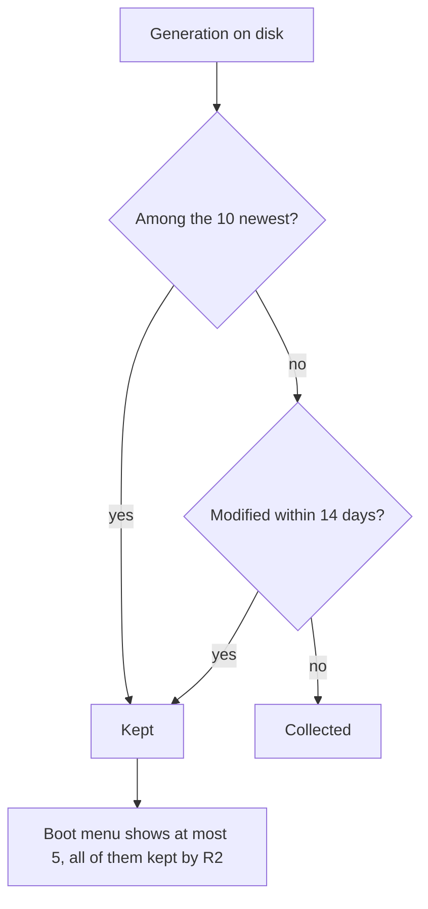

# Automatic Nix Generation Cleanup - Plan

## Goal Capsule

- **Objective:** The laptop stops accumulating unused Nix generations on its own, and every generation the boot menu offers still resolves to a generation that exists.
- **Means:** A weekly `programs.nh.clean` timer with a retention floor expressed as a generation count, not only an age.
- **Product authority:** The decisions in Key Decisions are settled with the host's owner and are not open for re-litigation. Retention numbers, the choice of collector, and host scope are fixed.
- **Open blockers:** None.

---

## Product Contract

### Summary

Declare a weekly garbage collection policy for this host that always keeps the 10 most recent generations and everything from the last 14 days, and install `nh` so the same cleanup can be run and previewed by hand. The retention count is deliberately larger than the boot loader's configuration limit so the boot menu never offers an entry whose generation was collected.

### Problem Frame

The host has 439 system generations, nearly all created on a single day of repeated rebuilds. Nothing in this flake removes them: `nix.settings.auto-optimise-store` deduplicates store paths but deletes nothing, and `boot.loader.systemd-boot.configurationLimit` and `boot.lanzaboote.configurationLimit` cap how many entries the boot menu shows without touching the generations themselves. There is no `nix.gc` declaration anywhere in the repository.

Disk pressure is not what makes this urgent — `/nix` sits at 84G of 475G. What makes it worth fixing is that nothing bounds the growth, and that every generation root pins the store paths underneath it, so the deduplication already enabled cannot reclaim what dead generations hold.

A purely age-based policy would introduce a second problem. `nix-collect-garbage --delete-older-than` keeps only the current generation once the window passes, while the boot menu's five entries are rewritten only when a rebuild runs. Two weeks without a rebuild would leave four menu entries pointing at collected generations — the exact rollback path `docs/recovery.md` sends a user to when the system will not boot.

### Key Decisions

- **Declarative policy first, existing backlog separate.** (session-settled: user-directed — chosen over a one-time purge of the 439 generations: with the disk at 18%, recurrence is the problem, not current volume.) Governs R1.
- **`programs.nh.clean` over `nix.gc`.** Only `nh` expresses a minimum number of kept generations; `nix.gc` takes `nix-collect-garbage` options, which are age-based only. (session-settled: user-directed — chosen over a time-only `nix.gc` policy: a count floor is what keeps the boot menu honest.) Governs R2, R5, R6, R9.
- **Retention floor of 10, not 5.** (session-settled: user-directed — chosen over matching `configurationLimit` exactly: leaves rollback depth beyond what the boot menu exposes.) Governs R2, R4.
- **`nh` on PATH, not the timer alone.** `programs.nh.clean` works without `programs.nh.enable`, so installing the command is a separate choice. (session-settled: user-directed — chosen over enabling cleanup only: manual runs and dry runs are worth one more command on PATH.) Governs R7.
- **`nr` stays the rebuild path.** `programs.nh.flake` is left unset, so `nh os switch` requires an explicit flake argument and does not quietly become a second rebuild route alongside `scripts/nr`. Governs R7.
- **Production only.** The bootstrap variant is an installer and recovery target that accumulates nothing worth collecting, so neither the timer nor the package belongs in its closure. Governs R8.

### Requirements

**Retention policy**

- R1. Cleanup runs on a weekly timer on the production host and catches up on a missed run after the laptop has been powered off.
- R2. Cleanup keeps the 10 most recent generations of every profile it walks, regardless of their age.
- R3. Cleanup additionally keeps every generation modified within the last 14 days.
- R4. The retention count in R2 stays greater than or equal to the boot loader's `configurationLimit`, so every entry the boot menu offers resolves to a generation that still exists.
- R5. One cleanup run covers the system profile, per-user profiles, and Home Manager profiles.
- R6. Cleanup removes orphaned garbage-collection roots and runs a store collection afterwards.

**Host scope and tooling**

- R7. The `nh` command is available on the production host so cleanup can be run manually and previewed without deleting anything.
- R8. The bootstrap configuration declares neither the cleanup timer nor the `nh` package.
- R9. `nix.gc.automatic` stays disabled, so exactly one collector is scheduled.

**Regression check**

- R10. A check registered in `flake.nix` asserts against the materialized configurations — not the option values — that production carries the cleanup unit with its retention arguments and no second scheduled collector, and that bootstrap carries neither the unit nor the package.
- R11. That check fails when the retention count falls below the boot loader's configuration limit.

The retention rule is a union of two independent conditions, which is what makes R4 hold without any coordination with the boot loader:

### Acceptance Examples

- AE1. **Covers R2, R3.**
  - **Given:** 439 generations, all created within the last day.
  - **When:** The weekly timer fires tonight.
  - **Then:** None are removed, because every one of them is inside the 14-day window.
- AE2. **Covers R2, R4.**
  - **Given:** The laptop has not been rebuilt for 60 days and holds 439 generations.
  - **When:** The weekly timer fires.
  - **Then:** The 10 most recent survive and the rest are collected, and all five boot menu entries still resolve.
- AE3. **Covers R4, R11.**
  - **Given:** Someone raises `configurationLimit` to 15 while the retention count stays at 10.
  - **When:** `nix flake check` runs.
  - **Then:** The check fails and names the two values.
- AE4. **Covers R8, R10.**
  - **Given:** The bootstrap configuration is built.
  - **When:** The check inspects its materialized units and packages.
  - **Then:** Neither the cleanup unit nor the `nh` package is present.

Key Flows are omitted: the work is a scheduled policy with no multi-step user path, and Requirements plus Acceptance Examples already fix the behavior planning would otherwise have to invent.

### Scope Boundaries

- The 439 generations currently on the host are not removed by this work. The policy reaches them once they leave the 14-day window and fall outside the 10 most recent; emptying them sooner is a separate operational action on the laptop.
- `configurationLimit` stays at 5 on both loaders.
- `nix.settings.auto-optimise-store` is unchanged.
- `nh` does not become a rebuild path: no `NH_FLAKE`, no aliases, no change to `scripts/nr`.

### Dependencies and Assumptions

- `nh` comes from nixpkgs unstable, currently 4.4.2. The `--keep` and `--keep-since` semantics R2 and R3 depend on were read from that release's source, not inferred from documentation.
- `nh clean all` does not rewrite `/boot` and does not reinstall the boot loader. Boot-entry validity therefore rests entirely on R4; nothing else in this work protects it.
- Enabling both `programs.nh.clean.enable` and `nix.gc.automatic` produces a warning rather than a build failure, so R9 is not enforced by the module system and needs R10's check to stay true.

### Sources / Research

- `modules/nixos/base.nix:7` — `auto-optimise-store` is on; no `nix.gc` is declared anywhere in the repository.
- `modules/nixos/boot.nix:26`, `modules/nixos/boot.nix:34` — `configurationLimit = 5` on both systemd-boot and lanzaboote.
- `docs/recovery.md:24-32` — the boot-menu rollback path, and the existing instruction to confirm Secure Boot before removing old generations.
- `scripts/nr`, `packages/nix-tools.nix`, `tests/nr.sh` — the packaged rebuild helper `nh os switch` would otherwise compete with.
- nixpkgs `nixos/modules/programs/nh.nix` — the systemd block is gated on `clean.enable` alone, independent of `enable`; the conflict with `nix.gc.automatic` is a warning, not an assertion.
- `nix-community/nh` v4.4.2, `crates/nh-clean/src/clean.rs` — `--keep` marks the newest N generations as kept regardless of age, `--keep-since` marks recently modified ones, and the two are a union; the walk covers `/nix/var/nix/profiles`, `/nix/var/nix/profiles/per-user`, and each user's `~/.local/state/nix/profiles`; `booted-system` and `current-system` roots are excluded from removal.
- Host state at the time of writing: 439 system generations, `/nix` at 84G of 475G, `/nix/store` at 23G, `/boot` at 59M of 2.0G.

---

## Planning Contract

**Product Contract preservation:** Product Contract unchanged. Planning added the sections below and resolved the one `Deferred to Planning` question without touching any R-ID.

### Key Technical Decisions

- KTD1. **Declare the policy in a new `modules/nixos/nix-cleanup.nix` gated on `config.my.bootstrap`, not in `modules/nixos/base.nix`.** `hosts/ThinkPad-X1-Carbon-Gen-11/default.nix` is the import list for both flake outputs, so a separate module file does not by itself exclude bootstrap — the `my.bootstrap` switch does, exactly as `modules/nixos/boot.nix` uses it. The separate file keeps the concern isolated per the repository's one-module-one-concern rule. Governs R8.
- KTD2. **Assert the rendered `nh-clean` systemd unit and the script its `ExecStart` names, not `programs.nh.clean.extraArgs`.** An option value can evaluate correctly while a `mkIf` or a disabled sibling keeps the unit out of the built system (`.compound-engineering/artifacts/solutions/best-practices/nix-check-reads-option-value-not-materialized-output.md`). Governs R10.
- KTD3. **Read the retention count and the boot loader limit from the two built configurations and compare them inside the builder, printing both numbers on failure.** Both operands come from modules the check guards, so a mutation of either turns the comparison red; an assertion whose operands no module under test can change folds to a constant (`.compound-engineering/artifacts/solutions/best-practices/nix-check-assertion-on-unconditional-option-folds-to-a-constant.md`). Governs R11.
- KTD4. **Guard every store-path interpolation with `lib.optionalString` or `or null`, and collect failures instead of exiting at the first.** A removal mutation must fail inside the builder with the check's own message rather than aborting evaluation (`.compound-engineering/artifacts/solutions/best-practices/unguarded-derivation-interpolation-defeats-nix-check-mutation-testing.md`), and a check that stops at its first red assertion leaves the rest unproven across mutation rounds. Governs R10, R11.

### Assumptions

- The `nh-clean` service renders as `systemd.units."nh-clean.service".unit` on the production configuration, with `ExecStart` naming a store script that carries the literal `clean all --keep 10 --keep-since 14d`. U2 verifies this by reading the built unit before the assertions are written; if the arguments are not legible there, the check reads `systemd.services.nh-clean.script` instead and the mutation rounds below still apply.
- `boot.lanzaboote.configurationLimit` is the limit that governs the production host's menu, since `boot.loader.systemd-boot.enable` is forced to `bootstrap`. U2 reads whichever value the production configuration actually uses rather than assuming one loader.
- `nh` 4.4.2 builds or substitutes from the configured cache. If it does not, the first rebuild compiles a Rust package; that affects rebuild time only, not correctness.

### Risks and Dependencies

- `nh clean all` removes orphaned garbage-collection roots, and the host currently holds 27 under `/nix/var/nix/gcroots/auto`. `--keep-since 14d` protects recently touched roots, so a `nix develop` shell used within the fortnight survives, but a long-idle development shell's root can be collected. This is the intended behavior of R6, recorded here because it is the one user-visible effect outside generations.
- `nh` is a third-party Rust CLI outside nixpkgs' own garbage-collection module. A future nixpkgs bump can change `nh clean`'s flags; the check in U2 fails loudly if the retention arguments stop appearing in the rendered unit.

---

## Implementation Units

### U1. Declare the cleanup policy module

**Goal:** The production configuration schedules weekly generation cleanup with the agreed retention, installs `nh`, and leaves the bootstrap configuration untouched.

**Requirements:** R1, R2, R3, R5, R6, R7, R8, R9.

**Dependencies:** none.

**Files:**

- `modules/nixos/nix-cleanup.nix` (new)
- `hosts/ThinkPad-X1-Carbon-Gen-11/default.nix` (add the import)

**Approach:**

1. Create the module with the same `bootstrap = config.my.bootstrap or false` binding `modules/nixos/boot.nix` opens with.
2. Set `programs.nh.enable` and `programs.nh.clean.enable` through `lib.mkIf (!bootstrap)`, `programs.nh.clean.dates` to the weekly schedule, and `programs.nh.clean.extraArgs` to the retention arguments R2 and R3 fix.
3. Leave `programs.nh.flake` unset, and leave `nix.gc.automatic` at its default so the nh module's own conflict warning stays silent.
4. Add the import to the host's list in alphabetical position, between `keyd.nix` and `nix-ld.nix`.
5. Carry a comment on the retention arguments recording why the count exceeds `configurationLimit`; the relationship is not visible from either file alone.

**Patterns to follow:** `modules/nixos/boot.nix` for the bootstrap switch and its comment style; `modules/nixos/nix-ld.nix` for a single-concern module's shape.

**Test scenarios:** Test expectation: none in this unit — the assertions live in U2, which cannot be written before the unit renders.

**Verification:** Both flake outputs build, and the production one renders an `nh-clean` timer while the bootstrap one renders none.

### U2. Add and register the `nix-cleanup` check

**Goal:** A repository check fails when the cleanup policy stops reaching the production system, when its retention arguments change, when the retention floor drops below the boot loader's limit, or when either the unit or the package appears on the bootstrap configuration.

**Requirements:** R4, R10, R11. Covers AE2, AE3, AE4.

**Dependencies:** U1.

**Files:**

- `tests/nix-cleanup.nix` (new)
- `flake.nix` (register the check)

**Approach:**

1. Open the file with the header comment block every sibling check carries, stating what is asserted and why each assertion reads materialized output.
2. Resolve the production host's `systemd.units."nh-clean.service".unit or null` and `systemd.units."nh-clean.timer".unit or null`, and the same two on bootstrap.
3. Assert the timer's schedule and `Persistent`, then resolve the service unit's `ExecStart` target and assert the retention arguments on it (KTD2).
3a. Assert that the production host's materialized `environment.etc."systemd/system".source` carries `timers.target.wants/nh-clean.timer`, and that the bootstrap host's does not. A rendered unit exists even when nothing starts it, so the schedule assertion above is a proxy until the wiring is read too (KTD2).
4. Read the production host's effective boot loader limit and the retention count, and fail when the count is lower, printing both numbers (KTD3).
5. Assert that the production system path carries an executable `bin/nh`, and that the bootstrap configuration renders neither unit and has no `bin/nh`. The nh module gates its package on `programs.nh.enable` and its units on `clean.enable`, so only this assertion guards R7.
6. Assert that the production configuration schedules no second collector.
7. Register the check in `flake.nix` beside the other `import ./tests/...` entries.

**Patterns to follow:** `tests/yubikey-fido.nix` for the failure-collecting builder, the `esc` escaping helper, and reading rendered units; `tests/desktop-autostart.nix` for resolving an entry by what it produces and for the `lib.optionalString` guards.

**Test scenarios:**

- Covers AE4. The bootstrap configuration renders no `nh-clean.service` and no `nh-clean.timer`, and its system path has no `bin/nh`.
- Covers AE2. The production `nh-clean.service` runs `clean all` with the retention count and window R2 and R3 fix.
- Covers AE3. The retention count is at or above the production host's boot loader configuration limit, and a lower count fails with both numbers named.
- The production `nh-clean.timer` carries the weekly schedule and `Persistent=true`, so a missed run is caught up after the laptop is powered on.
- The production system tree wires that timer into `timers.target.wants`, so it is started at boot rather than merely rendered.
- The production system path ships `bin/nh`, so cleanup can be run and previewed by hand.
- The production configuration schedules no second garbage collector alongside `nh-clean`.
- Every failing assertion is reported in one build rather than the builder exiting at the first.

**Verification:** `nix build --no-link .#checks.x86_64-linux.nix-cleanup` is green on the unmutated tree, and each mutation round in the Verification Contract turns it red inside the builder with the assertion's own message.

### U3. Record the policy in the operator documentation

**Goal:** The retention floor and its relationship to rollback are findable from the documents an operator actually opens.

**Requirements:** R4.

**Dependencies:** U2.

**Files:**

- `docs/verification.md` (the repository-check description and the post-rebuild hardware check)
- `docs/recovery.md` (the retention floor beside the existing boot generation limit in the rollback section)

**Approach:**

1. Add a `nix-cleanup` sentence to the repository-check paragraph in the same voice as its neighbours, naming what the check reads rather than what the module declares.
2. Add a hardware check line: after a rebuild, confirm the timer is loaded and scheduled, and confirm a dry run reports what it would remove without removing it.
3. Extend the rollback section so the existing instruction to confirm Secure Boot before removing generations sits next to the fact that the retention floor is what keeps the menu's entries resolvable.

**Patterns to follow:** the existing description style in `docs/verification.md`; the numbered rollback steps in `docs/recovery.md`.

**Test scenarios:** Test expectation: none — documentation only.

**Verification:** A reader following `docs/recovery.md` to roll back learns why the menu's entries are guaranteed to resolve, and `docs/verification.md` lists the new check and its hardware counterpart.

---

## Verification Contract

Run from the repository root:

| Command | What it proves |
| --- | --- |
| `nix fmt -- --ci` | Formatting matches `nixfmt-tree` without edits. |
| `nix build --no-link .#checks.x86_64-linux.nix-cleanup` | The new check passes on the unmutated tree. |
| `nix flake check` | Every declared check still passes, including the new one. |
| `nix build --no-link .#nixosConfigurations.ThinkPad-X1-Carbon-Gen-11.config.system.build.toplevel` | The production configuration builds with the policy. |
| `nix build --no-link .#nixosConfigurations.ThinkPad-X1-Carbon-Gen-11-bootstrap.config.system.build.toplevel` | The bootstrap configuration builds without it. |

**Mutation rounds for the new check.** Each round is one edit plus `nix build --no-link .#checks.x86_64-linux.nix-cleanup`, then `git checkout --` to restore. A round counts only when the failure comes out of the builder carrying the check's own message — read `nix log`, never the exit code alone.

| Round | Mutation | Must fail on |
| --- | --- | --- |
| 1 | Drop `programs.nh.clean.enable` from `modules/nixos/nix-cleanup.nix` | the absent service unit |
| 2 | Change the retention count in `extraArgs` to a lower number | the retention floor comparison, naming both numbers |
| 3 | Raise `boot.lanzaboote.configurationLimit` above the retention count | the same comparison, from the other side |
| 4 | Remove the `!bootstrap` guard so the module reaches both outputs | the bootstrap assertions |
| 5 | Drop `programs.nh.enable` while leaving `clean.enable` on | the absent `bin/nh` on the production system path |
| 6 | Set `nix.gc.automatic = true` alongside the nh timer | the second-collector assertion |
| 7 | Set `systemd.timers.nh-clean.wantedBy = lib.mkForce [ ]` | the `timers.target.wants` wiring assertion, not the schedule assertion |

Read the generated `buildCommand` out of the built `.drv` once before recording the rounds, so an assertion that folded to a constant during evaluation is visible rather than inferred.

**Hardware checks** are reported separately from the build evidence, per `docs/verification.md`. After a rebuild on the laptop: the `nh-clean` timer is loaded and has a next scheduled run, and a dry run of the same retention arguments lists what it would remove without removing it. Do not run `nixos-rebuild switch` as validation from this repository's tooling; the operator performs it.

---

## Definition of Done

- The production configuration schedules weekly cleanup with the agreed retention and ships `nh`; the bootstrap configuration has neither.
- `nix-cleanup` is registered in `flake.nix` and green, and every mutation round above turned it red inside the builder.
- `nix fmt -- --ci`, `nix flake check`, and both toplevel builds pass.
- `docs/verification.md` and `docs/recovery.md` carry the new check and the retention-floor relationship.
- No experimental or abandoned code remains in the diff.
- Hardware confirmation is left to the operator and reported separately; the build evidence above never stands in for it.
