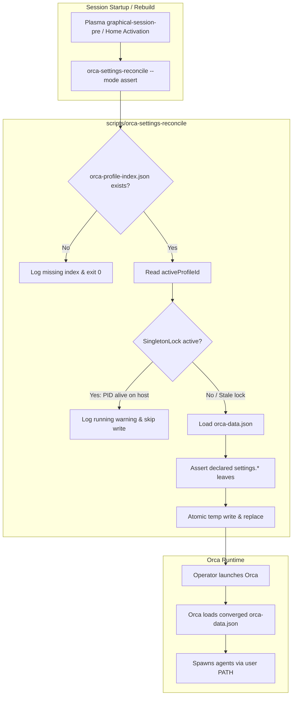

# Declarative Orca ADE Integration - Plan

## Goal Capsule

- **Objective:** Enable operator on ThinkPad X1 Carbon Gen 11 to launch and use the Orca ADE desktop application with full developer PATH access to agent toolchains, while maintaining declared application settings (workspace paths, fonts, voice model, and agent flags) deterministically without data loss from Orca's runtime disk flushes.
- **Means:** Package the upstream Linux release as a Home Manager package with desktop integration, and implement a dedicated `home/h82/orca.nix` module managing a leaf-level settings reconciler that asserts declared `settings.*` paths into `orca-data.json` before graphical session start and during rebuilds when Orca is not running.
- **Product Authority:** Product behavior is governed by the Requirements below. Operator `h82` on ThinkPad X1 Carbon Gen 11. Upstream IDE internals, multi-profile switching, and auxiliary orchestration extensions (`omp-orca`) are outside active scope.
- **Open Blockers:** None.

---

## Product Contract

### Summary

Integrate the Orca Agent Development Environment (ADE) into this NixOS repository as a declarative Home Manager module. The integration packages the desktop application with full developer PATH access to existing coding agents, and ports the proven leaf-level settings reconciler from dotfiles to assert core settings leaves into `orca-data.json` before session start and during offline rebuilds.

### Problem Frame

The operator relies on Orca as their primary application for orchestrating parallel AI coding agents across git worktrees on non-Nix systems. On this ThinkPad X1 Carbon Gen 11 running NixOS, coding agents (`claude-code`, `antigravity-cli`, `omp`) are currently launched manually from the terminal.

Bringing Orca into NixOS presents two distinct challenges:
1. Orca is an Electron desktop application that expects a standard FHS desktop environment and needs access to developer toolchains (`git`, `claude`, `node`, `bun`, `python3`) across parallel worktrees.
2. Orca maintains its active configuration in `~/.config/orca/profiles/<profile>/orca-data.json`, which mingles user settings with dynamic session state, worktree metadata, and telemetry. While running, Orca holds this document in memory and flushes it to disk roughly every 9 seconds, never re-reading from disk during runtime. Placing a read-only Nix store symlink causes the application to crash or fail to persist worktrees, while writing to the file while Orca is active results in silent data overwrites.

A prior implementation on Fedora solved this with a leaf-level reconciler that inspects Orca's `SingletonLock` and converges only declared JSON leaves when the application is stopped. This proposal ports that proven model to NixOS.

### Key Decisions

- **Port the proven leaf-level settings reconciler into Home Manager** (session-settled: user-directed — chosen over unmanaged interactive settings or full orchestration hook suite: restores deterministic workspace, font, and agent configurations without fighting Orca's frequent in-memory disk rewrites). Governs R4, R5, R6, R7, R8.
- **Reconcile settings before graphical session launch and during offline activation** (session-settled: user-directed — chosen over continuous background assertion or write-on-apply while running: Orca rewrites its document every ~9s from memory while active, so external writes while running are lost). Governs R6, R7, R8.
- **Expose the user's full developer PATH to Orca and terminal sessions** (session-settled: user-directed — chosen over isolating Orca into a closed sandbox: agents like Claude Code, Antigravity, and toolchains like Git, Node, and Bun must be resolvable by Orca's worktree processes). Governs R3.
- **Deliver Orca as a Home Manager user package and module** (session-settled: user-directed — chosen over system-wide package in `modules/nixos/`: follows repository guidelines isolating developer tools and desktop applications to user `h82`). Governs R1, R2, R9.
- **Retain `antigravity` enabled in Orca's agent roster** (session-settled: user-approved — chosen over porting the dotfiles disablement of `antigravity`: aligns with `antigravity-cli` being actively configured in this repository). Governs R4.

### Requirements

**Packaging and Desktop Integration**

- R1. An Orca ADE package for `x86_64-linux` is provided, wrapping the official upstream Linux release with desktop entry, icon, and Wayland/X11 runtime compatibility on KDE Plasma 6.
- R2. The package is added to user `h82`'s configuration via a dedicated Home Manager module `home/h82/orca.nix`, imported in `home/h82/default.nix`.
- R3. The desktop launcher and binary wrapper execute Orca with an environment inheriting the user's full developer PATH, ensuring tools such as `git`, `claude`, `antigravity`, `omp`, `node`, `bun`, and `python3` are accessible from Orca's terminal splits and agent spawners.

**Declarative Settings Reconciliation**

- R4. The module declaratively specifies core settings leaves in `orca-data.json`, asserting:
  - Workspace directory: `~/.local/share/worktrees`
  - Application UI font: `Pretendard`
  - Editor font: `JetBrainsMono NF`
  - Terminal font: `JetBrainsMono NF`
  - Default TUI agent: `claude`
  - Codex default arguments: `--dangerously-bypass-approvals-and-sandbox --dangerously-bypass-hook-trust`
  - Voice STT: enabled with model `zipformer-streaming-korean`
  - Local base ref refresh on worktree creation: `true`
  - Keep computer awake while agents run: `true`
  - Desktop notifications: `false`
- R5. The reconciler targets the active profile ID discovered from `~/.config/orca/orca-profile-index.json`. If no profile index exists (Orca has never run on this host), reconciliation exits cleanly without error or writing partial state.
- R6. The reconciler verifies whether Orca is currently running by inspecting `~/.config/orca/SingletonLock` (checking whether the symlink targets `<hostname>-<pid>` with an active process).
- R7. When Orca is active during Home Manager activation or system rebuild, the reconciler skips writing to `orca-data.json` and logs drift rather than aborting activation or corrupting in-memory state.
- R8. A systemd user service (`orca-settings-reconcile.service`) executes before the graphical session (`graphical-session-pre.target`), asserting declared leaves into `orca-data.json` when the session initializes.

**Testing and Verification**

- R9. Flake checks in `tests/` verify that the module evaluates cleanly in both production and bootstrap configurations and that declared settings leaves validate without schema syntax errors.

### Key Flows

- F1. Initial launch on clean installation
  - **Trigger:** Operator logs into Plasma on a new install where Orca has never launched.
  - **Actors:** Operator, Plasma session manager, Orca
  - **Steps:**
    1. Systemd user service `orca-settings-reconcile.service` runs during graphical session startup.
    2. Reconciler detects absence of `~/.config/orca/orca-profile-index.json` and exits with code 0.
    3. Operator opens Orca from the Plasma application launcher.
    4. Orca creates initial profile and default data structures.
  - **Outcome:** Clean first-run experience without activation errors.
  - **Covered by:** R5, R8.

- F2. Settings convergence on session startup
  - **Trigger:** Operator logs into Plasma graphical session after modifying a declared setting or after initial profile creation.
  - **Actors:** Plasma session manager, Reconciler, Orca
  - **Steps:**
    1. `orca-settings-reconcile.service` runs before `graphical-session.target`.
    2. Reconciler verifies `SingletonLock` is absent or stale.
    3. Reconciler updates declared `settings.*` leaves in `orca-data.json` while leaving all other JSON paths intact.
    4. Operator launches Orca, which loads the converged configuration.
  - **Outcome:** Declared settings are enforced deterministically across sessions.
  - **Covered by:** R4, R5, R6, R8.

- F3. Rebuild while Orca is active
  - **Trigger:** Operator runs a system rebuild or Home Manager activation while Orca is open.
  - **Actors:** Operator, Home Manager activation, Orca
  - **Steps:**
    1. Home Manager activation script executes the reconciler in assert mode.
    2. Reconciler detects an active `SingletonLock` pointing to a live process ID on the current host.
    3. Reconciler logs drift warnings without modifying `orca-data.json`.
    4. Activation completes cleanly without terminating Orca or clobbering its in-memory state.
  - **Outcome:** Rebuild succeeds without data loss or crashes.
  - **Covered by:** R6, R7.

### Acceptance Examples

- AE1. Idempotency on clean profile
  - **Covered by:** R5.
  - **Given:** `~/.config/orca/` is absent.
  - **When:** `orca-settings-reconcile --mode assert` executes.
  - **Then:** Exits with code 0 and emits an informational note that the profile index is absent, writing no files.

- AE2. Safe bypass during active execution
  - **Covered by:** R6, R7.
  - **Given:** Orca is running with `SingletonLock` pointing to a valid process on the current host.
  - **When:** Reconciler is executed during Home Manager activation.
  - **Then:** Reconciler logs that Orca is running, leaves `orca-data.json` untouched, and exits with code 0.

- AE3. Surgical leaf assertion
  - **Covered by:** R4, R6, R8.
  - **Given:** Orca is stopped and `orca-data.json` contains `settings.workspaceDir = "/tmp/old"` and `worktreeMeta = { "project-1": { ... } }`.
  - **When:** Reconciler runs in assert mode.
  - **Then:** `settings.workspaceDir` is updated to `/home/h82/.local/share/worktrees`, and `worktreeMeta` remains untouched.

### Scope Boundaries

**In scope:**
- Orca ADE desktop package derivation for NixOS (`x86_64-linux`).
- Home Manager module `home/h82/orca.nix` imported in `home/h82/default.nix`.
- Desktop entry and PATH binding to developer toolchains (`claude-code`, `antigravity-cli`, `git`, `node`, etc.).
- Porting leaf reconciler script and systemd user unit from dotfiles.
- Flake check validating evaluation and settings assertions.

**Deferred for later:**
- Custom auxiliary extension packages (`omp-orca`, `orchestration-hook`).
- Headless remote server runtime (`orca serve` systemd service).
- Multi-profile management or switching logic.

**Non-goals:**
- Declaratively managing Orca's dynamic runtime session state, project history, or worktree metadata.
- Modifying upstream Orca source code or replacing its internal Electron auto-updater mechanisms.

### Dependencies and Assumptions

- Upstream `stablyai/orca` publishes official Linux releases for `x86_64`.
- Host system provisions `programs.nix-ld` and Plasma 6 on Wayland (verified in `modules/nixos/nix-ld.nix` and `modules/nixos/desktop.nix`).
- System fonts `Pretendard` and `JetBrainsMono Nerd Font` are available on the host (verified in `modules/nixos/fonts.nix`).

### Sources and Research

- `hyperlapse122/dotfiles`:
  - `home/.chezmoidata/orca.yaml`: Specification of declared settings leaves and rationale for leaf-only assertion.
  - `home/dot_local/share/chezmoi-command-sources/executable_orca-settings-reconcile.tmpl`: Reconciler classification logic, `SingletonLock` validation, and safe write guards.
  - `docs/plans/2026-09-11-1713-feat-orca-app-settings-declarative-plan.md`: Prior plan establishing the 9-second disk flush measurements and session-start reconciliation architecture.
- `nix-config`:
  - `AGENTS.md:5`: Single ThinkPad X1 Carbon Gen 11 host scope and Plasma desktop preservation.
  - `home/h82/default.nix:20-36`: Existing user package declarations (`claude-code`, `antigravity-cli`, `omp`).
  - `home/h82/claude.nix` & `home/h82/gemini.nix`: Precedents for managing agent settings with runtime rewrite behavior via activation hooks.
  - `modules/nixos/fonts.nix`: System font declarations (`pretendard`, `nerd-fonts.jetbrains-mono`).
  - `modules/nixos/desktop.nix`: Plasma 6 and Wayland desktop integration.

---

## Planning Contract

### Key Technical Decisions

- KTD1. **Package Orca using `appimageTools.wrapType2` with extracted desktop assets** (session-settled: user-directed — chosen over unpacking .deb or building Electron from source: provides official x86_64 upstream binary execution on NixOS with minimal derivation complexity and clean FHS sandbox). Governs R1, R3.
- KTD2. **Implement `scripts/orca-settings-reconcile` as a self-contained Python 3 script** (session-settled: user-directed — chosen over Bash+jq: avoids external runtime dependencies like jq, matches repository pattern established by `scripts/agent-settings`, and provides atomic file swaps and robust POSIX PID lock checks). Governs R4, R5, R6, R7.
- KTD3. **Trigger reconciliation via systemd user service before graphical session and via Home Manager activation** (session-settled: user-directed — chosen over a polling background daemon: guarantees settings convergence before Orca starts without consuming background resources). Governs R7, R8.
- KTD4. **Structure module as `home/h82/orca.nix` imported into `home/h82/default.nix`** (session-settled: user-directed — chosen over inlining into `default.nix` or system-wide module: maintains single-concern module boundaries per repository guidelines). Governs R2.
- KTD5. **Add non-decorative tests in `tests/test_orca_settings.py` and `tests/orca.nix` verified with mutation testing** (session-settled: user-directed — chosen over build-only check: verifies live lock detection, missing profile handling, and leaf assertion under failure injection). Governs R9.

### High-Level Technical Design



### Output Structure

```text
nix-config/
├── home/h82/
│   ├── default.nix                 # Imports ./orca.nix
│   └── orca.nix                    # Package declaration, declared settings, systemd service & activation
├── packages/
│   ├── orca.nix                    # AppImage package derivation with desktop wrapper
│   └── orca-tools.nix              # Packaging for scripts/orca-settings-reconcile
├── scripts/
│   └── orca-settings-reconcile     # Python 3 reconciler with SingletonLock guard
└── tests/
    ├── orca.nix                    # Flake check for module evaluation and settings validation
    └── test_orca_settings.py       # Python unit tests for reconciler logic
```

---

## Implementation Units

### U1. Implement `scripts/orca-settings-reconcile` and Reconciler Tests
- **Goal:** Create the standalone Python 3 reconciler script that reads Orca profile index, checks `SingletonLock`, and updates declared JSON leaves safely without racing live sessions.
- **Requirements:** R4, R5, R6, R7.
- **Dependencies:** None.
- **Files:** `scripts/orca-settings-reconcile`, `tests/test_orca_settings.py`.
- **Approach:**
  1. Implement `scripts/orca-settings-reconcile` using Python 3 standard library (`argparse`, `json`, `os`, `pathlib`, `tempfile`).
  2. Implement `--mode assert` (updates leaves when stopped; logs warning when running) and `--mode report` (reports drift without modifying disk).
  3. Implement `SingletonLock` detection: inspect symlink target `<hostname>-<pid>`, parse PID, verify hostname matches, and test process liveness with `os.kill(pid, 0)`.
  4. Implement leaf path traversal (splitting dot-notation `settings.*`) and atomic write replacement (`tempfile.NamedTemporaryFile` in target dir + `os.replace`).
  5. Implement `tests/test_orca_settings.py` covering AE1 (clean profile index missing), AE2 (active lock prevents modification), AE3 (stopped Orca updates leaves without touching unmanaged keys), and stale lock cleanup.
- **Patterns to follow:** `scripts/agent-settings` and `tests/test_agent_settings.py`.
- **Test scenarios:**
  - Happy path: Asserting leaves into an existing stopped profile updates only the declared `settings.*` paths. Covers AE3.
  - Live lock detection: A live PID on the current host prevents writing and exits with code 0. Covers AE2.
  - Missing index: Running with no `orca-profile-index.json` logs an info message and exits with code 0 without creating files. Covers AE1.
  - Stale lock: A dead PID or mismatched hostname is treated as stopped and allows assertion.

### U2. Package Orca Desktop Application in `packages/orca.nix` and `packages/orca-tools.nix`
- **Goal:** Provide Nix derivations for the Orca ADE desktop application (wrapped AppImage with desktop entry and icons) and the reconciler script.
- **Requirements:** R1, R3.
- **Dependencies:** U1.
- **Files:** `packages/orca.nix`, `packages/orca-tools.nix`.
- **Approach:**
  1. In `packages/orca.nix`, define a derivation using `appimageTools.wrapType2` and `appimageTools.extractType2` fetching `stablyai/orca` release `v1.4.206` (`orca-linux.AppImage`, sha256 `547c60825ce6c8cedd94a02b3c445fbf2d88173576164b1b66444113ff225550`).
  2. Extract `orca.desktop` and icons into `$out/share/applications` and `$out/share/icons`.
  3. Create wrapper links so both `orca` and `orca-ide` point to the executable.
  4. Ensure desktop entry `Exec` line launches with full user environment.
  5. In `packages/orca-tools.nix`, package `scripts/orca-settings-reconcile` with Python 3 runtime dependencies.
- **Patterns to follow:** `packages/agent-tools.nix` and `packages/nix-tools.nix`.
- **Test scenarios:**
  - Package builds successfully under `nix build`.
  - Derivation outputs `$out/bin/orca`, `$out/bin/orca-ide`, `$out/share/applications/orca.desktop`, and icon assets.

### U3. Create Home Manager Module `home/h82/orca.nix` and Wire into User Configuration
- **Goal:** Create the Home Manager module managing the Orca package, declared settings specification, systemd user service, and activation hook.
- **Requirements:** R2, R3, R4, R5, R6, R7, R8.
- **Dependencies:** U1, U2.
- **Files:** `home/h82/orca.nix`, `home/h82/default.nix`.
- **Approach:**
  1. Define `home/h82/orca.nix` declaring settings tier containing the agreed leaves:
     - `settings.workspaceDir = "${config.home.homeDirectory}/.local/share/worktrees"`
     - `settings.appFontFamily = "Pretendard"`
     - `settings.editorFontFamily = "JetBrainsMono NF"`
     - `settings.terminalFontFamily = "JetBrainsMono NF"`
     - `settings.defaultTuiAgent = "claude"`
     - `settings.agentDefaultArgs.codex = "--dangerously-bypass-approvals-and-sandbox --dangerously-bypass-hook-trust"`
     - `settings.voice.enabled = true`
     - `settings.voice.sttModel = "zipformer-streaming-korean"`
     - `settings.refreshLocalBaseRefOnWorktreeCreate = true`
     - `settings.keepComputerAwakeWhileAgentsRun = true`
     - `settings.notifications.enabled = false`
  2. Add `orca` package to `home.packages`.
  3. Declare systemd user service `systemd.user.services.orca-settings-reconcile` running before `graphical-session-pre.target` to assert settings at session start.
  4. Add Home Manager activation hook `home.activation.orcaSettings` after `installPackages` to assert settings during rebuild when Orca is stopped.
  5. Add `./orca.nix` to `imports` in `home/h82/default.nix`.
- **Patterns to follow:** `home/h82/claude.nix` and `home/h82/kde/autostart.nix`.
- **Test scenarios:**
  - Evaluates cleanly on both `ThinkPad-X1-Carbon-Gen-11` and `ThinkPad-X1-Carbon-Gen-11-bootstrap`.
  - Systemd user service is properly registered in generated user systemd units.
  - Activation script includes `orca-settings-reconcile` execution with the rendered declaration.

### U4. Add Flake Check `tests/orca.nix` and Register in `flake.nix`
- **Goal:** Add automated flake checks verifying reconciler script tests and Nix evaluation of the Orca module.
- **Requirements:** R9.
- **Dependencies:** U1, U2, U3.
- **Files:** `tests/orca.nix`, `flake.nix`.
- **Approach:**
  1. Create `tests/orca.nix` testing:
     - Running `tests/test_orca_settings.py` against `scripts/orca-settings-reconcile`.
     - Asserting evaluated host configuration includes `orca` package in `home.packages`.
     - Asserting `systemd.user.services.orca-settings-reconcile` is configured.
  2. Register `checks.${system}.orca = import ./tests/orca.nix { inherit pkgs self; };` in `flake.nix`.
  3. Verify with mutation testing: confirm check turns red if a setting assertion is removed or broken.
- **Patterns to follow:** `tests/claude.nix`, `tests/keyd-remap.nix`.
- **Test scenarios:**
  - `nix build --no-link .#checks.x86_64-linux.orca` passes on clean tree.
  - Mutation test: intentionally failing an assertion causes the check derivation to fail.

---

## Verification Contract

### Automated Verification Commands

| Command | Environment | Purpose |
|---|---|---|
| `python3 tests/test_orca_settings.py` | Local / Host | Verify Python reconciler logic, lock handling, and leaf assertion |
| `nix build --no-link .#checks.x86_64-linux.orca` | Sandbox | Run automated repository check for Orca packaging and reconciler unit tests |
| `nix flake check` | Sandbox | Verify all repository checks pass without regressions |
| `nix build --no-link .#nixosConfigurations.ThinkPad-X1-Carbon-Gen-11.config.system.build.toplevel` | Sandbox | Verify production system top-level builds cleanly |
| `nix build --no-link .#nixosConfigurations.ThinkPad-X1-Carbon-Gen-11-bootstrap.config.system.build.toplevel` | Sandbox | Verify bootstrap system top-level builds cleanly |
| `nix fmt -- --ci` | Local | Verify Nix formatting compliance across all modified files |

---

## Definition of Done

- All four implementation units (U1–U4) are implemented and committed with lowercase Conventional Commit messages.
- The reconciler handles `SingletonLock` without data loss or write races, validated by `tests/test_orca_settings.py`.
- Orca ADE is packaged with desktop entry and icons accessible to user `h82`.
- Flake check `checks.x86_64-linux.orca` passes and is proven with mutation testing.
- Both `ThinkPad-X1-Carbon-Gen-11` and `ThinkPad-X1-Carbon-Gen-11-bootstrap` build cleanly.
- `nix flake check` and `nix fmt -- --ci` pass with no errors.
