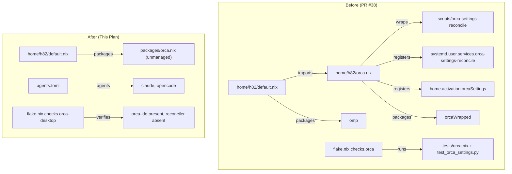

## Goal Capsule

- **Objective:** User `h82`'s environment is cleanly decoupled from the unused `omp` binary and unburdened by complex declarative Orca settings reconciliation, with Orca ADE retained as a standard unmanaged desktop application.
- **Means:** Remove `omp` from package declarations, documentation, and agent manifests; delete Orca reconciliation scripts, services, activation hooks, and test infrastructure; and expose the bare application package directly in `home.packages` with an unmanaged application regression check in `flake.nix` (KTD1, KTD2, KTD3).
- **Authority Hierarchy:** Product Contract requirements govern intended state; Key Technical Decisions govern technical implementation mechanics; Implementation Units define discrete execution tasks.
- **Execution Profile:** Direct native execution on feature branch `chore/remove-omp-and-orca-config`.
- **Stop Conditions:** Evaluation or build failure on either host configuration, failed flake checks, or failing tree formatting.
- **Who Finishes and Ships:** The automated LFG pipeline implements, runs code simplification and review, verifies checks and builds, captures any durable learning, commits, and opens a pull request.

---

## Product Contract

### Summary
Remove the unused `omp` (Oh My Pi) binary and associated references, and dismantle the leaf-level declarative configuration reconciliation layer for Orca ADE while preserving Orca itself as a standard unmanaged desktop tool.

### Problem Frame
The user environment currently includes `omp` in `home.packages` and lists it in `README.md`, but the binary is unused on this machine, creating unnecessary closure weight in the user profile.
Additionally, Orca ADE was integrated with declarative settings management in PR #38. Because Orca maintains configuration state in memory and flushes to disk on background intervals (~9 seconds), asserting declared settings required complex reconciliation mechanisms (`scripts/orca-settings-reconcile`, PID liveness checks, SingletonLock inspection, wrapper binaries, and systemd user services). This declarative configuration layer is disproportionately complex compared to allowing Orca to manage its state natively via its graphical interface.

### Requirements

**omp Removal**
- R1. `omp` is removed from `home.packages` in `home/h82/default.nix`.
- R2. `omp` is removed from the "Included tools" list in `README.md`.
- R3. `"pi"` is removed from the `agents` list in `agents.toml`.

**Orca Configuration Dismantling**
- R4. Declarative Orca configurations (`systemd.user.services.orca-settings-reconcile`, `home.activation.orcaSettings`, and the pre-launch reconciler wrapper `orcaWrapped`) and module `home/h82/orca.nix` are removed.
- R5. `./orca.nix` is removed from `imports` in `home/h82/default.nix`.
- R6. Reconciler script `scripts/orca-settings-reconcile` and package definition `packages/orca-tools.nix` are removed from the repository.
- R7. Reconciler test suites `tests/orca.nix` and `tests/test_orca_settings.py` are removed, and the `orca` check in `flake.nix` is replaced with an `orca-desktop` check asserting the presence of the unmanaged application and the absence of the reconciler service and activation hook.
- R8. The raw Orca ADE desktop application package (`packages/orca.nix`) is directly added to `home.packages` in `home/h82/default.nix`, providing `bin/orca`, `bin/orca-ide`, and desktop entry `share/applications/orca.desktop`.

**Verification and Repository Health**
- R9. Tree formatting conforms to `nix fmt -- --ci`.
- R10. All flake checks evaluate and pass cleanly via `nix flake check`.
- R11. Both host builds succeed:
  - `nix build --no-link .#nixosConfigurations.ThinkPad-X1-Carbon-Gen-11.config.system.build.toplevel`
  - `nix build --no-link .#nixosConfigurations.ThinkPad-X1-Carbon-Gen-11-bootstrap.config.system.build.toplevel`

### Key Decisions
- **KD1. Retain raw Orca desktop package in user packages**: Retain `packages/orca.nix` and include it directly in `home.packages` so Orca remains available to the user as a standard unmanaged desktop application. Governs R8.
- **KD2. Clean up agents.toml alongside omp**: Remove `"pi"` from `agents.toml` to keep the active agent roster synchronized with installed binaries, following the pattern established when `codex` was removed. Governs R3.

### Scope Boundaries
- **In-scope:** Removal of `omp` from packages, documentation, and agent manifest; deletion of Orca reconciliation scripts, services, hooks, wrappers, and reconciler tests; direct inclusion of raw Orca in `home.packages`; flake check replacement; doc updates.
- **Deferred to Follow-Up Work:** Any future desktop integration modifications or packaging updates for Orca ADE.
- **Non-Goals:** Managing Orca settings through alternative configuration managers; removing other coding agents (`claude-code`, `antigravity-cli`).

---

## Planning Contract

### Key Technical Decisions
- KTD1. **Direct package import in `home/h82/default.nix`**: Import `(import ../../packages/orca.nix { inherit pkgs; })` directly in `home.packages` in `home/h82/default.nix`, removing `./orca.nix` from `imports` and deleting `home/h82/orca.nix`. (session-settled: user-directed — chosen over keeping a thinned `home/h82/orca.nix`: eliminates an unnecessary single-line wrapper module and matches the pattern of `nix-tools.nix`). Governs R4, R5, R8.
- KTD2. **Register guarded `orca-desktop` flake check**: In `flake.nix`, replace `orca = import ./tests/orca.nix { inherit pkgs self; };` with a check that tests both hosts (`ThinkPad-X1-Carbon-Gen-11` and `ThinkPad-X1-Carbon-Gen-11-bootstrap`), asserting that `orca-ide` is in `userPackages`, `bin/orca-ide` and `share/applications/orca.desktop` exist, and that neither `systemd.user.services.orca-settings-reconcile` nor `home.activation.orcaSettings` is present. Apply the repository's flake check best practices with guarded derivations and explicit error reporting. Governs R7.
- KTD3. **Clean up documentation and agent manifests**: Update `README.md` to remove `omp` from the included tools list, and update `agents.toml` to remove `"pi"` from the `agents` array. Governs R2, R3.

### High-Level Technical Design



### Assumptions
- The raw package in `packages/orca.nix` is self-contained and functions independently without requiring `packages/orca-tools.nix`.
- The user profile does not rely on any configuration state generated by `scripts/orca-settings-reconcile`.

---

## Implementation Units

### U1. Remove omp and update manifests and documentation
- **Goal:** Remove `omp` binary from user packages, remove `"pi"` from `agents.toml`, and update `README.md`.
- **Requirements:** R1, R2, R3.
- **Dependencies:** None.
- **Files:** `home/h82/default.nix`, `agents.toml`, `README.md`.
- **Approach:**
  1. Remove `omp` from `home.packages` list in `home/h82/default.nix`.
  2. Remove `"pi"` from `agents` array in `agents.toml`.
  3. Remove `omp, ` from the tool catalog line in `README.md`.
- **Patterns to follow:** Prior cleanup in commit removing `codex` (issue #12).
- **Test scenarios:**
  - `agents.toml` syntax remains valid TOML with `agents = ["claude", "opencode"]`.
  - `home.packages` in `home/h82/default.nix` no longer contains `omp`.
  - `README.md` no longer contains references to `omp`.
- **Verification:** `nix eval --impure --expr '(import ./flake.nix).outputs.nixosConfigurations.ThinkPad-X1-Carbon-Gen-11.config.home-manager.users.h82.home.packages'` confirms absence of `omp`.

### U2. Dismantle Orca declarative configuration layer and remove reconciler assets
- **Goal:** Remove `home/h82/orca.nix`, `scripts/orca-settings-reconcile`, `packages/orca-tools.nix`, `tests/orca.nix`, and `tests/test_orca_settings.py`.
- **Requirements:** R4, R5, R6, R7.
- **Dependencies:** None.
- **Files:** `home/h82/orca.nix`, `scripts/orca-settings-reconcile`, `packages/orca-tools.nix`, `tests/orca.nix`, `tests/test_orca_settings.py`, `home/h82/default.nix`.
- **Approach:**
  1. Remove `./orca.nix` from `imports` in `home/h82/default.nix`.
  2. Delete `home/h82/orca.nix`.
  3. Delete `scripts/orca-settings-reconcile`.
  4. Delete `packages/orca-tools.nix`.
  5. Delete `tests/orca.nix` and `tests/test_orca_settings.py`.
- **Patterns to follow:** Module decomposition and cleanup guidelines in `AGENTS.md`.
- **Test scenarios:**
  - Ensure no leftover references to `orca-tools.nix` or `orca-settings-reconcile` exist in the repository.
  - Evaluation of `home-manager.users.h82` succeeds without errors about missing `./orca.nix`.
- **Verification:** `git status` shows deleted files and clean `home/h82/default.nix` imports.

### U3. Expose raw Orca package and register orca-desktop flake check
- **Goal:** Add raw `packages/orca.nix` to `home.packages` in `home/h82/default.nix` and replace `checks.orca` in `flake.nix` with `checks.orca-desktop`.
- **Requirements:** R7, R8, R9, R10, R11.
- **Dependencies:** U1, U2.
- **Files:** `home/h82/default.nix`, `flake.nix`.
- **Approach:**
  1. Add `(import ../../packages/orca.nix { inherit pkgs; })` to `home.packages` in `home/h82/default.nix`.
  2. In `flake.nix`, replace `orca = import ./tests/orca.nix { inherit pkgs self; };` with `orca-desktop` check.
  3. The `orca-desktop` check inspects both `ThinkPad-X1-Carbon-Gen-11` and `ThinkPad-X1-Carbon-Gen-11-bootstrap`:
     - Asserts `orca-ide` package is in `userPackages`.
     - Asserts `bin/orca-ide` and `share/applications/orca.desktop` exist.
     - Asserts `systemd.user.services.orca-settings-reconcile` is absent.
     - Asserts `home.activation.orcaSettings` is absent.
  4. Ensure all assertions use safe, guarded derivations following `solutions/best-practices/`.
- **Patterns to follow:** Package check patterns in `flake.nix` (e.g., `discord`, `telegram-desktop`, `kleopatra-gui`).
- **Test scenarios:**
  - Host evaluation includes `orca-ide` in `home.packages`.
  - Evaluated system contains no `orca-settings-reconcile` systemd service or activation hook.
  - `nix build --no-link .#checks.x86_64-linux.orca-desktop` passes.
- **Verification:**
  - `nix build --no-link .#checks.x86_64-linux.orca-desktop` exits 0.
  - `nix fmt -- --ci` exits 0.
  - `nix flake check` exits 0.
  - Both host builds succeed.

---

## Verification Contract

Run the repository verification suite:

```bash
# Tree formatting check
nix fmt -- --ci

# Flake check suite (including orca-desktop)
nix flake check

# Target host builds
nix build --no-link .#nixosConfigurations.ThinkPad-X1-Carbon-Gen-11.config.system.build.toplevel
nix build --no-link .#nixosConfigurations.ThinkPad-X1-Carbon-Gen-11-bootstrap.config.system.build.toplevel
```

---

## Definition of Done

- `omp` is completely removed from `home/h82/default.nix`, `README.md`, and `agents.toml`.
- Declarative Orca reconciliation service, activation hook, wrapper, script, tools package, and tests are completely removed.
- Raw Orca ADE application package is directly included in `home.packages`.
- `orca-desktop` check is registered in `flake.nix` and passes.
- No dangling references or dead code remain in the repository.
- `nix fmt -- --ci` passes.
- `nix flake check` passes.
- Both host builds succeed cleanly.
