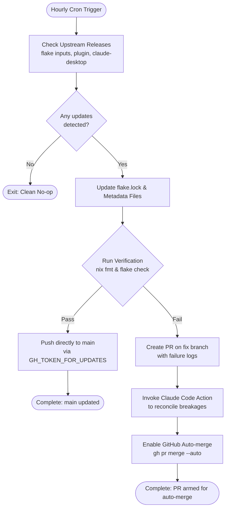

## Goal Capsule

- **Objective:** Flake inputs, agent plugins, and Claude Desktop stay continuously up to date through an automated hourly workflow that pushes verified updates directly to `main` and automatically reconciles breaking changes through an AI agent pull request with auto-merge.
- **Means:** Consolidate scheduled update jobs into a single hourly GitHub Actions workflow with strict concurrency control, updating `flake.lock`, `compound-engineering-plugin`, and `claude-desktop` metadata; pass through local formatting and check gates before pushing directly to `main`, and fall back on test failure to a PR where `anthropics/claude-code-action` resolves the breakages and arms GitHub auto-merge.
- **Product Authority:** User `h82` on ThinkPad X1 Carbon Gen 11 and MS-7D91 desktop.
- **Open Blockers:** None.

---

## Product Contract

### Summary

Unify scheduled dependency maintenance into an hourly GitHub Actions workflow that updates `flake.lock` inputs, the `compound-engineering-plugin` tag, and the `claude-desktop` APT package version and hash. When formatting and flake checks pass, updates land directly on `main` without human intervention; when an update breaks checks, the workflow isolates the diff in a branch, creates a PR, prompts Claude Code Action to reconcile the failure, and enables GitHub auto-merge.

### Problem Frame

The repository previously relied on disparate scheduled update jobs with disjoint cadences: `update-flake-lock.yml` ran weekly on Mondays for flake inputs, `update-agent-plugins.yml` ran weekly on Tuesdays for agent plugins, and `claude-desktop` had its version and hash hardcoded inside its package definition with no automated update path. This split structure introduced three distinct friction points:

1. **Stale versions:** Pinned applications like Claude Desktop and agent plugins fell behind upstream releases between weekly cron windows or required manual code edits to bump.
2. **Race conditions and PR drag:** Staggered weekly update PRs competed for merge order and required human attention to review and merge routine dependency bumps.
3. **Unattended breakages:** When an upstream update broke Nix evaluation or check assertions, automated jobs either failed silently or left broken PRs waiting for manual debugging.

### Key Decisions

- **Single unified hourly workflow** (session-settled: user-directed — chosen over separate workflows: consolidates flake inputs, agent plugins, and Claude Desktop into one hourly run to eliminate concurrency collisions and maintain uniform freshness). Governs R1, R3, R4.
- **Direct push to `main` on passing verification** (session-settled: user-directed — chosen over PR-first workflow: fast path immediately publishes passing updates to main without manual PR review drag). Governs R5, R6.
- **Pre-push verification gate** (session-settled: user-directed — chosen over full host builds or unverified push: requires `nix fmt -- --ci` and `nix flake check` before pushing to `main` to protect trunk stability without incurring 30-minute closure build delays). Governs R5, R6.
- **Claude Action reconciliation and auto-merge on failure** (session-settled: user-directed — chosen over failing CI and alerting: automatically opens a PR, invokes `anthropics/claude-code-action` with failure logs to repair breaking changes, and arms auto-merge upon check resolution). Governs R7, R8, R9.
- **Concurrency queueing without cancellation** (session-settled: user-directed — chosen over cancel-in-progress: ensures an in-flight check and push cycle completes atomically without leaving partial state or git push conflicts). Governs R1, R2.
- **Externalized package metadata file for Claude Desktop** (session-settled: user-approved — chosen over in-place regex patching: stores version, URL, and SRI hash in a standalone JSON file read by `packages/claude-desktop.nix`, allowing clean updater writes without syntax fragility). Governs R4.

### Key Flows

- F1. Fast-path update and push to main
  - **Trigger:** Scheduled cron triggers hourly, or manual `workflow_dispatch`.
  - **Actors:** GitHub Actions runner, git repository.
  - **Steps:**
    1. Workflow queries latest upstream releases for `flake.lock`, `compound-engineering-plugin`, and `claude-desktop` Debian APT index.
    2. If no components have new versions, workflow exits immediately with no changes.
    3. Workflow writes updated metadata and locks.
    4. Runner executes pre-push verification: `nix fmt -- --ci` and `nix flake check`.
    5. Checks succeed: changes are committed with conventional subjects and pushed directly to `main` using `GH_TOKEN_FOR_UPDATES`.
  - **Outcome:** `main` branch contains verified dependency bumps with zero open PRs.
  - **Governed by:** R1, R3, R4, R5, R6.

- F2. Failure recovery via Claude Action and auto-merge
  - **Trigger:** Upstream update causes `nix fmt` or `nix flake check` to fail during pre-push verification.
  - **Actors:** GitHub Actions runner, Claude Code Action (`claude[bot]`), GitHub CLI.
  - **Steps:**
    1. Runner detects non-zero exit from verification suite and aborts direct push to `main`.
    2. Runner commits the updated dependencies to a dedicated branch (e.g. `update-dependencies-fix`).
    3. Runner pushes branch and creates a draft or automated PR titled `chore(deps): update dependencies (reconciliation required)`.
    4. Workflow invokes `anthropics/claude-code-action` passing the captured error output and instruction to repair the failure.
    5. Claude Code Action pushes fix commits to the PR branch.
    6. Workflow enables GitHub auto-merge (`gh pr merge --auto --squash`) on the PR.
  - **Outcome:** A self-healing PR resolves the breakage and automatically merges into `main` once PR checks succeed.
  - **Governed by:** R7, R8, R9.

- F3. No-op cycle
  - **Trigger:** Scheduled cron triggers, but all dependencies are already at their newest versions.
  - **Steps:**
    1. Upstream queries report current lock and versions match newest releases.
    2. Workflow logs "all dependencies up to date" and exits cleanly with zero git mutations.
  - **Outcome:** No runner time wasted, no commits, no PR noise.
  - **Governed by:** R1, R2.

### Requirements

**Schedule and Concurrency**
- R1. The workflow runs on an hourly schedule (`cron: '0 * * * *'`) and supports manual trigger via `workflow_dispatch`.
- R2. The workflow declares a concurrency group for dependency updates with `cancel-in-progress: false` to ensure in-flight check and push operations complete sequentially without race conditions.

**Target Dependency Updates**
- R3. The workflow updates all declared `flake.lock` inputs via Nix flake update primitives and advances `compound-engineering-plugin` to its newest tagged release matching `compound-engineering-v*`.
- R4. The workflow queries Anthropic's official Debian APT repository package index (`https://downloads.claude.ai/claude-desktop/apt/stable/dists/stable/main/binary-amd64/Packages`), parses the newest `claude-desktop` version, deb filename, and SHA256, and updates a dedicated metadata file read by `packages/claude-desktop.nix`.

**Verification and Fast-Path Push**
- R5. Before proposing or pushing any changes, the workflow executes `nix fmt -- --ci` and `nix flake check` inside the runner environment.
- R6. When all verification commands exit with status 0, the workflow creates conventional commit(s) and pushes directly to `main` using repository secret `GH_TOKEN_FOR_UPDATES` (falling back to `GITHUB_TOKEN`).

**Failure Reconciliation and Auto-Merge**
- R7. When any verification command fails, the workflow does not push to `main`; instead, it pushes the updated state to a tracking branch and opens a pull request with labels `dependencies` and `automated`.
- R8. The workflow invokes `anthropics/claude-code-action` on the pull request with the captured failure log, granting permissions to inspect code and commit fixes to the branch.
- R9. The workflow configures GitHub auto-merge on the generated pull request so that it automatically merges into `main` as soon as status checks pass.

### Acceptance Examples

- AE1. Fast-path direct push to `main`
  - **Covers R1, R3, R4, R5, R6.**
  - **Given:** Anthropic publishes `claude-desktop` version `2.2554.0` in the Debian APT index, and flake inputs have new commits.
  - **When:** The hourly update workflow runs.
  - **Then:** Metadata is updated, `nix fmt -- --ci` and `nix flake check` pass, and commits are pushed directly to `main` with no open pull request.

- AE2. Broken upstream failure reconciliation
  - **Covers R7, R8, R9.**
  - **Given:** An updated flake input introduces a breaking API change that fails `nix flake check`.
  - **When:** The hourly update workflow runs.
  - **Then:** Push to `main` is aborted, a pull request is created on an update branch, `anthropics/claude-code-action` runs to fix the breakage, and auto-merge is armed.

- AE3. No-op execution
  - **Covers R1, R2.**
  - **Given:** No upstream releases or flake inputs have changed since the last run.
  - **When:** The hourly workflow executes.
  - **Then:** The workflow terminates with status 0 in under 2 minutes without writing commits or creating PRs.

### Scope Boundaries

- **In scope:**
  - Consolidating `update-flake-lock.yml` and `update-agent-plugins.yml` into a single hourly workflow.
  - Externalizing Claude Desktop package version and SRI hash into a dedicated metadata file (e.g. `packages/claude-desktop-version.json`).
  - Creating a helper script or Nix package to query the Debian APT index for `claude-desktop`.
  - Direct push to `main` on verification success.
  - Claude Code Action dispatch and `gh pr merge --auto` on verification failure.
- **Out of scope:**
  - Running full closure builds for all 4 NixOS host configurations within the hourly runner (handled downstream by `check.yml` on push to `main`).
  - Altering Claude Desktop packaging flags, Wayland configuration, or Cowork virtualization prerequisites.
  - Managing non-Nix packages or third-party flatpak/snap packaging.

### Dependencies / Assumptions

- Repository secret `GH_TOKEN_FOR_UPDATES` is present with `contents: write` and `pull-requests: write` permissions, enabling direct pushes to `main` to trigger subsequent CI workflows.
- Secret `CLAUDE_CODE_OAUTH_TOKEN` is configured and active for `anthropics/claude-code-action` reconciliation.
- GitHub repository settings allow auto-merge (`Allow auto-merge` enabled in repository options).
- Upstream Anthropic APT repository structure remains consistent with standard Debian `Packages` format.

### Sources / Research

- Anthropic APT repository package index: `https://downloads.claude.ai/claude-desktop/apt/stable/dists/stable/main/binary-amd64/Packages`
- Existing flake update workflow: `.github/workflows/update-flake-lock.yml`
- Existing agent plugin update workflow: `.github/workflows/update-agent-plugins.yml`
- Existing Claude Code action workflow: `.github/workflows/claude.yml`
- Flake checks and formatting: `flake.nix`, `tests/agent-plugins.nix`

---

## Planning Contract

### Key Technical Decisions

- **KTD1. Dedicated JSON metadata file `packages/claude-desktop-version.json`** (session-settled: user-approved — chosen over in-place regex replacement: cleanly separates static Nix derivation logic from mutable upstream release pins, allowing standard JSON read/write operations). Governs R4.
- **KTD2. Python release resolver script `scripts/claude-desktop-release`** (session-settled: user-directed — chosen over shell curl/grep pipeline: provides strict parsing of Debian `Packages` stanza, version tuple comparison, sha256 to base64 SRI conversion, and overridable fetcher for offline Nix sandbox tests). Governs R4.
- **KTD3. Unified GitHub Actions workflow `.github/workflows/update-dependencies.yml`** (session-settled: user-directed — chosen over multiple independent workflows: combines flake lock update, plugin release resolution, and Claude Desktop version update into a single atomic run under `concurrency: group: update-dependencies, cancel-in-progress: false`). Governs R1, R2, R3, R4.
- **KTD4. Fast-path direct push via `GH_TOKEN_FOR_UPDATES` after local check gates** (session-settled: user-directed — chosen over PR-first workflow: runs `nix fmt -- --ci` and `nix flake check` before pushing to `main`, ensuring trunk safety while eliminating human PR approval overhead). Governs R5, R6.
- **KTD5. Automated failure recovery via `anthropics/claude-code-action` and auto-merge** (session-settled: user-directed — chosen over failing CI notifications: isolates failing updates on a dedicated branch, creates a PR, passes captured build errors to Claude Code Action to reconcile, and enables `gh pr merge --auto --squash`). Governs R7, R8, R9.
- **KTD6. Removal of superseded legacy workflows** (session-settled: user-directed — removes `update-flake-lock.yml` and `update-agent-plugins.yml` to prevent duplicate runs and conflicting lock branch pushes). Governs R1.

### Technical Design

1. `packages/claude-desktop-version.json`:
Holds `version`, `sha256`, and `hash` (SRI format `sha256-...`). `packages/claude-desktop.nix` imports this file via `builtins.fromJSON (builtins.readFile ./claude-desktop-version.json)` to set `version` and `src.hash`.

2. `scripts/claude-desktop-release`:
A clean Python 3 executable following the structure of `scripts/agent-plugin-release`:
- CLI arguments: `--source-url <url>`, `--output <path>`, `--dry-run`.
- Reads `CLAUDE_DESKTOP_RELEASE_FETCH` environment variable (defaults to `curl -s`).
- Splits Debian `Packages` text into stanzas separated by blank lines.
- Filters stanzas where `Package: claude-desktop` and `Architecture: amd64`.
- Extracts `Version:`, `Filename:`, and `SHA256:`.
- Compares versions via numerical integer tuples (e.g. `(2, 2553, 1)`).
- Converts SHA256 hex string to base64 SRI string (`sha256-<base64>=`).
- Atomically writes JSON to `--output` if version or hash changed.

3. `.github/workflows/update-dependencies.yml`:
Consolidated workflow running every hour (`cron: '0 * * * *'`) and on `workflow_dispatch`:
- Concurrency: `group: update-dependencies, cancel-in-progress: false`.
- Updates `flake.lock` (`nix flake update`), agent plugins (`scripts/agent-plugin-release`), and Claude Desktop (`scripts/claude-desktop-release`).
- If no diffs: exit 0 cleanly.
- If diffs present:
  - Runs pre-push verification: `nix fmt -- --ci` and `nix flake check --print-build-logs`.
  - On pass: commits each component with Conventional Commit messages (`chore(flake): update flake.lock`, `chore(agents): bump compound-engineering to <tag>`, `chore(packages): bump claude-desktop to <version>`), and pushes directly to `main` via `GH_TOKEN_FOR_UPDATES`.
  - On fail: creates branch `update-dependencies-fix`, commits changes, opens PR, triggers `anthropics/claude-code-action` with failure logs to repair the breakages, and runs `gh pr merge --auto --squash`.

### Sequencing and Dependencies

- **U1:** Externalize Claude Desktop version to JSON and implement Python release resolver with unit tests.
- **U2:** Wire `claude-desktop-release` into Flake packages and checks, verifying nix formatting and builds.
- **U3:** Create `.github/workflows/update-dependencies.yml` with fast-path push and Claude Action failure recovery; retire old update workflows.

---

## Implementation Units

### U1. Claude Desktop Version Metadata and Release Resolver

- **Goal:** Externalize `claude-desktop` version and SRI hash into a dedicated JSON file, update `packages/claude-desktop.nix` to read it, and create `scripts/claude-desktop-release` to resolve the latest Debian APT package index.
- **Files:**
  - `packages/claude-desktop-version.json` (create)
  - `packages/claude-desktop.nix` (modify)
  - `scripts/claude-desktop-release` (create)
  - `tests/test_claude_desktop_release.py` (create)
- **Requirements Covered:** R4
- **Key Technical Decisions:** KTD1, KTD2
- **Test Scenarios:**
  - **Happy path:** Given mock Debian `Packages` text containing multiple `claude-desktop` versions (`1.17180.0`, `2.2553.0`, `2.2553.1`), the resolver identifies `2.2553.1` as latest, converts hex sha256 to valid SRI format, and produces correct JSON metadata.
  - **Edge cases:** Unrelated package blocks in `Packages` index are ignored; non-numeric versions are rejected; empty or malformed `Packages` returns a non-zero exit code with a descriptive error.
  - **Nix evaluation:** `packages/claude-desktop.nix` evaluates without error and builds `claude-desktop` package using values from `claude-desktop-version.json`.
- **Verification:** `python3 -m unittest tests/test_claude_desktop_release.py` and `nix build --no-link .#packages.x86_64-linux.claude-desktop`.

### U2. Flake Packaging and Regression Check Integration

- **Goal:** Package `claude-desktop-release` in `packages/agent-tools.nix` (or standalone package), expose it in `flake.nix`, and add regression checks guarding the python unit test in `flake.nix`.
- **Files:**
  - `packages/agent-tools.nix` (modify)
  - `flake.nix` (modify)
- **Requirements Covered:** R4
- **Key Technical Decisions:** KTD2
- **Test Scenarios:**
  - `nix run .#claude-desktop-release -- --dry-run` runs and outputs resolved version metadata without error.
  - Flake check for `claude-desktop-release` unit tests executes and passes in sandbox.
- **Verification:** `nix flake check` and `nix build --no-link .#packages.x86_64-linux.claude-desktop-release`.

### U3. Unified Hourly Update Workflow and Legacy Workflow Retirement

- **Goal:** Create `.github/workflows/update-dependencies.yml` implementing the hourly schedule, concurrency control, multi-target updates, local verification gate, direct push to `main` on success, and Claude Action reconciliation with auto-merge on failure; delete superseded workflows.
- **Files:**
  - `.github/workflows/update-dependencies.yml` (create)
  - `.github/workflows/update-flake-lock.yml` (remove)
  - `.github/workflows/update-agent-plugins.yml` (remove)
- **Requirements Covered:** R1, R2, R3, R4, R5, R6, R7, R8, R9
- **Key Technical Decisions:** KTD3, KTD4, KTD5, KTD6
- **Test Scenarios:**
  - **No changes:** When all sources are up to date, workflow finishes cleanly without git commits.
  - **Verification success (fast-path):** When dependencies change and `nix fmt -- --ci` + `nix flake check` pass, commits are authored with Conventional Commit subjects and pushed to `main`.
  - **Verification failure (reconciliation):** When checks fail, changes are committed to a branch, PR is opened, `anthropics/claude-code-action` is dispatched, and `gh pr merge --auto` is executed.
- **Verification:** YAML syntax validation, GitHub Actions workflow linter / actionlint, and dry-run execution of update steps locally.

---

## Verification Contract

| Test / Gate | Command | Purpose | Covers |
| :--- | :--- | :--- | :--- |
| Unit Tests | `python3 -m unittest discover -s tests -p "test_*.py"` | Python resolver correctness and APT parsing | U1, R4 |
| Code Formatting | `nix fmt -- --ci` | Formatting compliance across all Nix files | U1, U2, R5 |
| Flake Checks | `nix flake check --print-build-logs` | Flake evaluation, unit test runners, and package checks | U1, U2, R5 |
| Package Build | `nix build --no-link .#packages.x86_64-linux.claude-desktop` | Claude desktop package builds from externalized JSON | U1, R4 |

---

## Definition of Done

1. `packages/claude-desktop-version.json` exists and is consumed by `packages/claude-desktop.nix`.
2. `scripts/claude-desktop-release` is implemented, packaged in `flake.nix`, and verified with unit tests in `tests/test_claude_desktop_release.py`.
3. `.github/workflows/update-dependencies.yml` is created with hourly cron, `concurrency: group: update-dependencies, cancel-in-progress: false`, verification gates, direct push to `main`, and Claude Action failure recovery with auto-merge.
4. Superseded `.github/workflows/update-flake-lock.yml` and `.github/workflows/update-agent-plugins.yml` are removed.
5. All repository checks pass (`nix fmt -- --ci`, `nix flake check`, and host builds).

