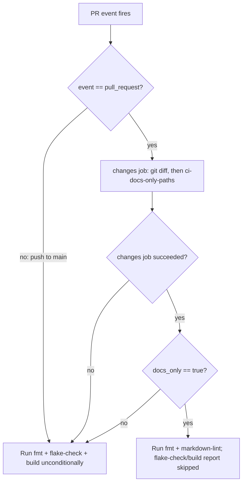

# CI Docs-Only Skip and Markdown Lint - Plan

## Goal Capsule

- **Objective:** A pull request whose entire diff is documentation gets CI feedback proportional to what changed — no multi-hour Nix evaluation/build cost paid for zero coverage of the actual diff — while still getting real markdown-quality coverage it does not get today.
- **Means:** Add a repo-owned, unit-tested docs-only path classifier that gates `flake-check`/`build` in `.github/workflows/check.yml`, and register a `markdown-lint` check in `flake.nix` that runs on every PR through its own always-on job (KTD1-KTD4).
- **Authority hierarchy:** GitHub issue #77 (Product Contract below) states product intent; `AGENTS.md`'s testing and commit conventions and the repository's mutation-testing learnings (Sources & Research) govern how; implementer judgment resolves anything neither settles.
- **Stop conditions:** Stop and flag rather than proceed if making the markdown-lint check pass against the full `.compound-engineering/artifacts/**/*.md` corpus (not fully sampled during planning — see Assumptions) would require rewriting dozens of existing documents rather than a small, named set of rule exceptions.
- **Execution profile:** Single-repo Nix/CI configuration change. No runtime service, no deploy step, no external credentials.
- **Who finishes and ships:** The implementing agent (`ce-work`), through this repo's normal PR flow.

---

## Product Contract

### Summary

`.github/workflows/check.yml` runs the same full Nix matrix — `nix fmt -- --ci`, `nix flake check` (up to 60 min), and a 4-target `nix build` (up to 60 min each) — on every pull request, including ones that change only prose (`docs/**`, `.compound-engineering/artifacts/**`, root `*.md`). None of those jobs read markdown content, so a docs-only PR pays the full cost for zero coverage of what changed, and gets no real feedback on the prose itself (issue #77, motivated by #76). This plan adds a tested path classifier that skips `flake-check`/`build` only when a PR's entire diff is documentation, and adds a `markdown-lint` check that runs on every PR — including the ones that just got faster.

### Problem Frame

Issue #77 names the two costs directly: wasted CI minutes on docs-only PRs, and no lint coverage for the prose those PRs actually change. Both stem from `check.yml` treating every path the same.

### Requirements

- R1. A pull request whose changed paths are entirely documentation (`docs/**`, `.compound-engineering/artifacts/**`, or a root-level `*.md` file) skips the `flake-check` and `build` jobs, reported as a genuine `skipped` job conclusion, never a silent pass.
- R2. `nix fmt -- --ci` keeps running unconditionally on every PR, regardless of changed paths.
- R3. A `markdown-lint` check runs on every PR, including docs-only ones, registered in `flake.nix`'s `checks.${system}` per this repo's regression-check convention.
- R4. A PR touching any non-documentation path (Nix, scripts, modules, tests, workflows) — even alongside documentation changes — still runs the full existing `flake-check` + `build` matrix unchanged.
- R5. `nix flake check` and `nix fmt -- --ci` continue to pass at HEAD after this change.
- R6. When the docs-only classification step does not complete with a definitive result (job failure, cancellation, script error), `flake-check` and `build` still run. A broken classifier fails open toward more validation, never toward a silent skip.
- R7. `push` events to `main` always run the full matrix; the skip applies only to `pull_request` events (see KD1).
- R8. The docs-only classification logic is covered by its own repository check, isolated from the workflow YAML.

### Key Decisions

- **KD1. Scope the skip to `pull_request` events only; `push` to `main` always runs the full matrix.** Issue #77's motivation and acceptance criteria are framed entirely around pull request review cost (the #76 example is a PR). Extending the skip to post-merge `push` runs is a distinct, unrequested behavior change to the branch's final validation gate. Governs R7.

### Scope Boundaries

- **In scope:** path-gating `flake-check`/`build` for `pull_request` events; a `markdown-lint` flake check plus its own always-on CI job; the classifier script and its regression test; a wiring regression test for `check.yml`.
- **Deferred to Follow-Up Work:** applying the same skip logic to `push` events (KD1); adopting a third-party path-filter action (e.g. `dorny/paths-filter`) in place of the repo-owned script (KTD2); auto-fixing markdown violations (`--fix`) as part of CI.
- **Outside this product's identity:** linting markdown outside the three declared globs (e.g. `secrets/README.md`, or any future stray `*.md` elsewhere in the tree) — issue #77 names exactly these three locations. The same three globs also bound R1's CI-cost skip, not only markdown-lint's coverage: a PR touching only `secrets/README.md`, or only a non-`artifacts/` file directly under `.compound-engineering/` (e.g. `.compound-engineering/config.yaml`), is not classified docs-only and still runs the full `flake-check` + `build` matrix — it simply gets no markdown-lint coverage either, the same as any other file outside the three globs.

---

## Planning Contract

### Key Technical Decisions

- KTD1. **Use `markdownlint-cli2` (Node-based), not `mdl` (Ruby-based), for the new check.** `nix build --dry-run` against this flake's `nixpkgs` input shows `markdownlint-cli2` resolves to one cached 2.5 MiB fetch, while `mdl` requires building a Ruby 3.4 + Bundler + 8-gem toolchain from source (verified: 2 derivations, 14 fetched paths). The lighter, cache-friendly path fits a check that must run on every PR.
- KTD2. **Classify docs-only PRs with a repo-owned script (`scripts/ci-docs-only-paths`) driven by `git diff`, not a third-party GitHub Action.** The repository has no precedent for delegating simple set-membership logic to an external action, already SHA-pins the actions it does use, and has an established pattern for exactly this shape: a small script under `scripts/` paired with its own test under `tests/` and a `flake.nix` check (`scripts/nr` + `tests/nr.sh` + the `nr` check). Following it keeps the classifier unit-testable in isolation from GitHub Actions YAML.
- KTD3. **Give `markdown-lint` its own always-on CI job, separate from `flake-check`.** Acceptance criteria require lint coverage on docs-only PRs, but those PRs are exactly the ones that skip `flake-check` — the job `nix flake check` normally runs inside. A check registered in `checks.${system}` is not itself "run on every PR" unless something invokes it outside the conditional job. Mirrors how `fmt` already runs as its own unconditional job. On a non-docs-only PR, `markdown-lint` therefore builds twice — once inside `flake-check`'s `nix flake check`, once in its own job — a small, accepted duplication (the check is a cached, sub-second CLI run against ~50 files), not a defect to engineer around.
- KTD4. **The full matrix runs whenever the classifier does not complete with a definitive `docs_only: true`.** GitHub Actions skips a job whose `needs:` dependency failed unless the `if:` explicitly accounts for that. An unguarded `if: needs.changes.outputs.docs_only != 'true'` would silently skip `flake-check`/`build` on a classifier *crash*, not just on a genuine docs-only PR — the opposite of R1's "never a silent pass." The `if:` must treat a non-success classifier result the same as `docs_only: false`. (Governs R6; see the mutation-testing family in Sources & Research — this is the same class of gap those learnings describe: a check whose failure mode reads as success.)
- KTD5. **Root-level documentation matching is non-recursive.** "root `*.md` files" (issue #77) means a path with no `/` — `AGENTS.md` qualifies, `secrets/README.md` does not. This is deliberate (Scope Boundaries) and must be a named test case (U1), since a naive prefix match (`docs*` instead of `docs/*`) would silently over-match.
- KTD6. **Default markdown-lint rule set disables MD013 (line length), MD033 (inline HTML), and MD041 (first-line heading).** Verified directly: `docs/verification.md` and `docs/provisioning.md` contain lines up to 8748/818 characters (no hard-wrap convention); most sampled `docs/`, plan, and solution files contain inline HTML tags; `CLAUDE.md`'s entire content is a single `@AGENTS.md` import line with no heading. Enabling these rules by default would fail the check on existing, intentional content on day one.

### Assumptions

- Only `docs/*.md` and the four root `*.md` files were directly linted-by-inspection during planning; the 45-file `.compound-engineering/artifacts/**/*.md` corpus (`find .compound-engineering/artifacts -name '*.md' | wc -l`) was not exhaustively sampled. `ce-work` must run `markdownlint-cli2` against the full target corpus and extend KTD6's exception list (or, rarely, fix content) as needed to keep `nix flake check` green — this is expected execution-time discovery, not a plan gap.
- KD1 (push events out of scope) is inferred from the issue's exclusively PR-framed motivation; the issue does not state it explicitly.
- This plan assumes a job's `skipped` conclusion (from an untaken `if:` branch) already satisfies this repository's branch-protection required-status-checks the way GitHub Actions treats it by default — a `skipped` conclusion counts as passing a required check unless the repository explicitly configures stricter conclusion requirements. Whether `flake-check`/`build` are configured as required checks at all, and under which mode, is a GitHub repository setting outside this diff; verify it holds before relying on R1's skip to avoid blocking merges. This is distinct from `CONCEPTS.md`'s "Check evidence" concept, which governs *review* checks specifically (per `AGENTS.md`'s babysit-pr guidance) — a skipped `flake-check`/`build` here is not a review check going silent, it is the intended outcome R1 asks for.

### High-Level Technical Design

---

## Implementation Units

### U1. Docs-only path classifier: script and regression test

- **Goal:** A small script that decides whether a set of changed file paths is entirely documentation, with its own unit tests proving the classification (not the workflow YAML).
- **Requirements:** R1, R4, R6 (contract only — enforcement is U2), R8, KTD2, KTD5.
- **Dependencies:** none.
- **Files:** `scripts/ci-docs-only-paths` (new), `tests/ci-docs-only-paths.sh` (new), `flake.nix` (modify — add `ci-docs-only-paths` to `checks.${system}`).
- **Approach:**
  1. Script reads newline-separated repo-relative paths from stdin (the caller supplies these via `git diff --name-only`; this script does no git work itself).
  2. A path counts as documentation when it starts with `docs/`, starts with `.compound-engineering/artifacts/`, or matches `*.md` with no `/` in it (root-level only, per KTD5).
  3. Print `true` and exit 0 only when at least one path was read and every path matched; print `false` and exit 0 for an empty input or any non-matching path (fail-safe default per R6's spirit — the classifier itself never errors on ordinary input).
  4. Register the script and its test as a `ci-docs-only-paths` entry in `flake.nix`'s `checks.${system}` (R8), the same way the `nr` check wires `scripts/nr` + `tests/nr.sh`: copy both files into the builder and run the test directly.
- **Patterns to follow:** `scripts/nr` + `tests/nr.sh` + the `nr` check (script/test/flake-check pairing); `tests/pinentry-card.sh` (small script, small direct test).
- **Execution note:** This is a pure function over a fixed input shape — write `tests/ci-docs-only-paths.sh`'s cases first, then the script, since every case is enumerable up front.
- **Test scenarios:**
  - All paths under `docs/` → `true`.
  - All paths under `.compound-engineering/artifacts/` → `true`.
  - A root `*.md` file mixed with a `docs/` path → `true`.
  - One non-doc path among otherwise-doc paths → `false` (e.g. `docs/install.md` + `flake.nix`).
  - A nested `README.md` (e.g. `secrets/README.md`) → `false` (root-only, per KTD5).
  - A path with a `docs`-prefixed but different directory (e.g. `docs2/foo.md`) → `false` — guards against a naive prefix match instead of a real path-segment match.
  - Empty input → `false`.
  - A single root `*.md` file alone → `true`.
  - A path under neither declared root (e.g. `scripts/ci-docs-only-paths`) → `false`.
  - A non-`artifacts/` path directly under `.compound-engineering/` (e.g. `.compound-engineering/config.yaml`) → `false` (matches R1/Scope Boundaries: the classifier's third root is `.compound-engineering/artifacts/`, not the whole directory).
  - Mutation: change the third rule's prefix from `.compound-engineering/artifacts/` back to `.compound-engineering/` → the `.compound-engineering/config.yaml` scenario above must flip to `true` and fail. Run this once for real before trusting the check, per the decorative-assertion learning (Sources & Research).
- **Verification:** `bash tests/ci-docs-only-paths.sh scripts/ci-docs-only-paths` passes directly and as the registered flake check (see U5's Verification Contract entry); the mutation round above goes red for the stated reason.

### U2. `check.yml`: gate `flake-check` and `build` on the classifier

- **Goal:** Wire U1's script into `check.yml` so `flake-check` and `build` are skipped only for a genuinely docs-only pull request, and always run otherwise.
- **Requirements:** R1, R4, R6, R7, KTD3, KTD4.
- **Dependencies:** U1.
- **Files:** `.github/workflows/check.yml` (modify).
- **Approach:**
  1. Add a job (e.g. `changes`) that, only on `pull_request`, checks out with enough history to diff against the PR base, runs `git diff --name-only` against the base, and pipes the result through U1's script to produce a `docs_only` output.
  2. `flake-check` and `build` add `needs: changes` and an `if:` that runs them whenever the event is not `pull_request` (R7), or the classifier job did not succeed (R6/KTD4), or `docs_only` is not `true`.
  3. `fmt` is untouched — no `needs`, no `if:` (R2).
  4. Pin any new `uses:` the same way `actions/checkout` already is (40-char SHA + version comment).
- **Patterns to follow:** the existing `fmt` / `flake-check` / `build` job shapes in `check.yml`; the SHA + version-comment pinning both existing jobs already use.
- **Test scenarios:** covered by U5's static wiring assertions (this unit's behavior is GitHub Actions runtime wiring, not a standalone testable function); see U5.
- **Verification:** U5's regression check passes; a real docs-only PR after merge shows `flake-check`/`build` as `skipped` and `fmt`/`markdown-lint` as run (Verification Contract — this last part cannot be observed before a live PR exists).

### U3. `flake.nix`: register the `markdown-lint` check

- **Goal:** A `checks.${system}.markdown-lint` entry that runs `markdownlint-cli2` (KTD1) against the three declared globs with the exceptions KTD6 names.
- **Requirements:** R3, R5, KTD1, KTD6.
- **Dependencies:** none.
- **Files:** `flake.nix` (modify — add to `checks.${system}`), `.markdownlint-cli2.jsonc` (new, repo root — glob targets `docs/**/*.md`, `*.md`, `.compound-engineering/artifacts/**/*.md`, plus KTD6's rule exceptions).
- **Approach:**
  1. Point the check at the flake's own source tree (the existing `self` binding already used elsewhere in `flake.nix`) rather than interpolating dozens of individual file paths, since the target set spans three directory trees.
  2. Let `markdownlint-cli2` discover `.markdownlint-cli2.jsonc` from the repo root the ordinary way, rather than passing an equivalent flag set inline in the derivation.
  3. The check must fail on a real lint violation via `markdownlint-cli2`'s own exit code — no wrapping grep or text assertion that could go decorative.
- **Patterns to follow:** the `github-workflow-conventions` check's use of a real external validator's exit status, not a re-implemented parser.
- **Test scenarios:**
  - Current repo content (with KTD6's exceptions applied) → check passes.
  - A violation the exception list does not cover (e.g. a duplicate top-level heading) introduced into a sample doc → check fails. Run this once as a real mutation round before trusting the check (see Sources & Research — the decorative-assertion learning).
  - A file outside the three declared globs (e.g. `secrets/README.md`) → not linted, confirmed by the check still passing when that file alone contains a rule violation.
- **Verification:** `nix build --no-link .#checks.x86_64-linux.markdown-lint` passes; the mutation round above goes red.

### U4. `check.yml`: always-on `markdown-lint` job

- **Goal:** Docs-only PRs still get real lint coverage even though they skip `flake-check` — the job U3's check would otherwise only run inside.
- **Requirements:** R3, KTD3.
- **Dependencies:** U3.
- **Files:** `.github/workflows/check.yml` (modify).
- **Approach:** Add a job alongside `fmt` — no `needs`, no `if:` — that builds `.#checks.${system}.markdown-lint` directly (not the whole `nix flake check`), so it stays fast and independent of the conditional matrix.
- **Patterns to follow:** the `fmt` job's shape (single unconditional step, no matrix).
- **Test scenarios:** covered by U5 (asserts this job carries no conditional skip); see U5.
- **Verification:** U5 passes; a real PR (docs-only or not) shows `markdown-lint` as run, never skipped.

### U5. `check.yml` wiring regression test

- **Goal:** Prove U2/U4's job graph — not just that the classifier script is correct in isolation (U1), but that `check.yml` actually wires it the way R1/R2/R4/R6/R7 require.
- **Requirements:** R1, R2, R4, R6, R7, R8, KTD4.
- **Dependencies:** U2, U4.
- **Files:** `tests/check-workflow-docs-skip.sh` (new), `flake.nix` (modify — register as `ci-workflow-docs-skip` or similar).
- **Approach:**
  1. Assert `flake-check` and `build` each declare `needs:` on the classifier job.
  2. Assert their `if:` conditions cover all three KTD4/R6/R7 cases: non-`pull_request` events run, a non-successful classifier run runs, and only a definitive `docs_only: true` skips. Write each as an explicit `if ... then echo >&2; exit 1; fi` branch, never a negated `! grep`, per the repo's decorative-assertion learning (Sources & Research).
  3. Assert `fmt` and `markdown-lint` carry no such conditional — they must always run.
- **Patterns to follow:** `tests/github-workflow-conventions.sh`'s per-job, explicit-branch assertion style (and its documented reason for excluding the two Nix workflows from *its* pinning-convention checks — that exclusion is about a different assertion class and does not extend to this new test).
- **Test scenarios:**
  - Baseline (as implemented) → passes.
  - Mutation: remove `needs:` from `flake-check` → fails (proves the assertion isn't decorative; run this once for real before trusting the check).
  - Mutation: remove the "classifier didn't succeed" clause from the `if:` → fails (this is the KTD4/R6 case — the one the issue's own acceptance criteria don't mention but that a broken classifier would otherwise exploit).
  - Mutation: add a stray `if:` to `fmt` or `markdown-lint` → fails.
- **Verification:** `nix build --no-link .#checks.x86_64-linux.ci-workflow-docs-skip` passes on the real file, and the mutation rounds above each go red for the stated reason (read from `nix log`, not just the exit code — per the evaluation-vs-builder-failure learning in Sources & Research).

---

## Verification Contract

| Command | Purpose |
| --- | --- |
| `bash tests/ci-docs-only-paths.sh scripts/ci-docs-only-paths` | U1 direct test run |
| `nix build --no-link .#checks.x86_64-linux.ci-docs-only-paths` | U1 as a registered check |
| `nix build --no-link .#checks.x86_64-linux.markdown-lint` | U3 |
| `nix build --no-link .#checks.x86_64-linux.ci-workflow-docs-skip` | U5 |
| `nix fmt -- --ci` | R2, R5 — must keep passing |
| `nix flake check` | R5 — full suite including the two new checks |
| `nix build --no-link .#nixosConfigurations.<each of the four targets>.config.system.build.toplevel` | AGENTS.md's pre-ship build matrix; unaffected by this change but must still pass |

**Live-PR observation (cannot be fully substituted by the above):** this plan's own PR necessarily touches `.github/workflows/check.yml`, `flake.nix`, and `scripts/`, so it is not docs-only — it exercises the "run everything" path (R4, R7), not the skip path (R1). Confirming R1 and R6 end-to-end (a genuinely docs-only PR shows `flake-check`/`build` as `skipped`, not silently green) requires the first real docs-only PR opened after this merges. Record that as a known, deliberate verification gap — not a blocker — the way this repo already separates repository-check evidence from one-time live observation (`CONCEPTS.md`: Repository check / Hardware check).

## Definition of Done

- U1-U5 implemented; `nix fmt -- --ci` and `nix flake check` pass.
- Each new check (`ci-docs-only-paths`, `markdown-lint`, `ci-workflow-docs-skip`) passes individually, and at least one real mutation round has been run against each and shown to fail for the stated reason (not merely "went red").
- No leftover exploration code (e.g., markdownlint rule combinations tried and abandoned) remains in the diff.
- The live-PR observation gap above is stated in the PR description, not silently dropped.

---

## Sources & Research

- `.github/workflows/check.yml` — current `fmt`/`flake-check`/`build` jobs (unconditional today).
- `flake.nix:94-627` — existing `checks.${system}` entries and their idioms (`pkgs.runCommand`, `import ./tests/*.nix { inherit pkgs self; }`).
- `tests/github-workflow-conventions.sh` — this repo's established pattern for asserting workflow-YAML properties via explicit, mutation-testable branches, and its own stated reason for excluding the two Nix workflows from its specific action-pinning assertions.
- `scripts/nr` + `tests/nr.sh` — the script/test/flake-check pairing pattern U1 and U5 follow.
- `.compound-engineering/config.yaml` — `docs_root: .compound-engineering/artifacts`, confirming the third glob target.
- `CONCEPTS.md` — Repository check / Hardware check / Mutation round / Check evidence definitions, applied above to distinguish what this plan's own checks can prove from what only a live PR can.
- Mutation-testing learnings (all under `.compound-engineering/artifacts/solutions/best-practices/`), read before designing every new check per `AGENTS.md`: `mutation-testing-reveals-decorative-nix-check-assertions.md` (explicit `if`/`exit`, never negated `!grep`), `unguarded-derivation-interpolation-defeats-nix-check-mutation-testing.md` (read where a failure came from, not just that it failed), `nix-check-reads-option-value-not-materialized-output.md`, `converged-fixture-state-defeats-nix-check-mutation-testing.md` (fixtures must let the two candidate outcomes differ), `nix-check-assertion-on-unconditional-option-folds-to-a-constant.md`, `nullable-option-empty-operand-passes-a-shell-comparison.md` (an operand can reach a shell comparison as an empty/no-op value and pass silently — directly informed KTD4/R6).
- `nix build --dry-run --no-link nixpkgs#markdownlint-cli2` / `nixpkgs#mdl` — verified package availability and relative build cost, deciding KTD1.
- Direct inspection of `docs/*.md`, `AGENTS.md`, `CLAUDE.md`, `CONCEPTS.md`, `README.md` for line length, inline HTML, and first-heading shape — decided KTD6's exceptions.
- GitHub issue #77 (`hyperlapse122/nix-config`) — Product Contract source; motivating example #76.
