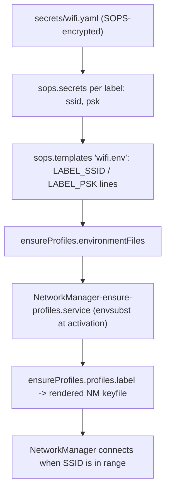

# Declarative Wi-Fi Provisioning via Repository Secrets - Plan

## Goal Capsule

- **Objective:** Every known Wi-Fi network joins automatically on both NixOS hosts, with its SSID and passphrase never appearing as plaintext anywhere in this repository, replacing the legacy chezmoi/1Password import flow with this repo's own SOPS secrets convention.
- **Product Authority:** h82 (Joosung Park).
- **Means:** `secrets/wifi.yaml` (SOPS) decrypted and rendered into one dotenv-format file (KTD2), substituted by NetworkManager's own `ensureProfiles.environmentFiles` (KTD1) into declarative Wi-Fi profiles on both hosts.
- **Open Blockers:** None. The real SSID/PSK values are supplied out of band by the user (via `op` CLI + `sops`, once, outside this repo's tooling) and do not block implementation or verification, which use only self-generated test fixtures.
- **Execution profile:** Single-session NixOS module change across two implementation units; no phased rollout.
- **Finishes and ships:** `ce-work` implements this plan; verification is `nix fmt -- --ci`, `nix flake check` (including the new `wifi-provisioning` check), and the four host builds in the Verification Contract below.

---

## Product Contract

### Summary

Provision the Wi-Fi networks currently managed through 1Password in `hyperlapse122/dotfiles` declaratively on both NixOS hosts here, via NetworkManager profiles backed by a new SOPS-encrypted secrets file. Both the SSID and the passphrase stay encrypted; only DHCP/system defaults apply for DNS and routing.

### Problem Frame

Wi-Fi credentials for this user's known networks are currently declared only in the legacy dotfiles repository (`home/.chezmoidata/networking.yaml`), resolved from 1Password at chezmoi render time and applied imperatively by an OS-native import tool. That path is outside this repository's own SOPS-based secret convention (`secrets/tokens.yaml`, `modules/nixos/secrets.nix`) and depends on 1Password being present and unlocked on whichever machine renders the dotfiles. Bringing Wi-Fi credentials into `nix-config` removes that cross-repo, cross-tool dependency and makes network provisioning declarative and reproducible alongside every other secret this repo already manages.

### Key Decisions

- **Provision both hosts** (session-settled: user-directed — chosen over ThinkPad-only or a per-host conditional module: `MS-7D91`'s hardware configuration shows no declared Wi-Fi card today, but an inactive NetworkManager profile on a host without a radio has no effect). Governs R4, R5.
- **New dedicated `secrets/wifi.yaml`** (session-settled: user-approved — chosen over extending `secrets/tokens.yaml`: keeps that file's documented "exactly these fields" schema (`github_token`, `gitlab_token`, `jpi_token`) unchanged and lets Wi-Fi credentials rotate independently). Governs R1, R3.
- **Encrypt the SSID alongside the PSK** (session-settled: user-directed — chosen over treating the SSID as a public literal: matches the legacy 1Password convention of treating both as private; Nix code and connection identifiers use an arbitrary label instead of the literal SSID). Governs R1, R6.
- **No checked-in tooling for populating real values** (session-settled: user-directed — chosen over a reusable `scripts/` helper or a documented command sequence in `secrets/README.md`: this is a single one-time task, performed with the already-available `op` CLI and `sops` on a machine that has 1Password access, with no ongoing reuse).
- **`secrets/wifi.yaml` must stay buildable before real values exist**, following the existing guarded-optional pattern in `modules/nixos/secrets.nix:56-58` (`sopsFile` defaults to `null` when the file is absent) — an agent inference from this repo's existing convention, not yet examined with the user. Governs R2.

### Requirements

#### Secrets Storage

- R1. A new `secrets/wifi.yaml`, encrypted with SOPS, holds every known Wi-Fi network's SSID and PSK as secret fields — no literal network name or passphrase is ever committed in plaintext anywhere in the repository.
- R2. The module consuming `secrets/wifi.yaml` evaluates and builds successfully even before the file holds real values, the same way `modules/nixos/secrets.nix` already tolerates a missing `secrets/tokens.yaml`.
- R3. `secrets/tokens.yaml`'s existing schema and consumers (`modules/nixos/secrets.nix`) are unchanged by this work.
- R4. `.sops.yaml` grants `secrets/wifi.yaml` decryption to both `ThinkPad-X1-Carbon-Gen-11`'s and `MS-7D91`'s age recipients — the same two recipients already listed for `secrets/tokens.yaml`.

#### NetworkManager Provisioning

- R5. Both `ThinkPad-X1-Carbon-Gen-11` and `MS-7D91` declaratively provision a NetworkManager Wi-Fi connection profile for every network declared in `secrets/wifi.yaml`, each carrying only `connection.type = wifi`, its SSID, and WPA-PSK key management with the decrypted passphrase.
- R6. Each network's Nix-facing identifier (attribute name / connection id) is an arbitrary label (e.g. `home`, `office`), never the literal SSID, consistent with R1's secrecy requirement.
- R7. Provisioned profiles set no DNS server, static IP, gateway, routing, or per-network priority override; system/DHCP defaults apply exactly as before this work.

#### Migration Source

- R8. The known networks this work provisions are the two currently declared in the legacy dotfiles manifest (`home/.chezmoidata/networking.yaml` in `hyperlapse122/dotfiles`, labeled there `KT-HomeHub-5G` and `CPS-01`); no other network is added without a separate request.

### Key Flows

- F1. **Rebuild activation provisions Wi-Fi.** **Trigger:** A host rebuild runs with `secrets/wifi.yaml` populated. **Steps:** SOPS decrypts the file at activation; the NixOS module materializes one NetworkManager profile per declared network; NetworkManager auto-connects when a declared SSID comes into range. **Covers:** R1, R5, R7.

### Scope Boundaries

- DNS servers, static IP, routing, gateway overrides, and per-network connection priority — out of scope. These existed in the legacy 1Password-driven system, but this migration explicitly drops them, per the issue's own constraint.
- Enterprise (802.1x) and WPA3-SAE-only networks — out of scope. A plain PSK profile cannot express them, and the legacy source excludes them for the same reason.
- The 1Password-backed import tooling and macOS support in the legacy dotfiles repo — out of scope. This repo targets NixOS only and is deliberately moving away from the 1Password dependency for this credential set.
- A reusable script or a documented runbook entry for populating `secrets/wifi.yaml`'s real values — out of scope. That population is a one-time manual action, not repository tooling.
- Runtime SSID confidentiality — out of scope. Encrypting the SSID (per Key Decisions) keeps it out of git history, the working tree, and the Nix store; it does not and cannot hide the SSID from `nmcli`, NetworkManager/wpa_supplicant logs, or over-the-air probe/beacon frames once a profile is active — that exposure is inherent to using Wi-Fi at all, not something this work introduces or can close.

### Dependencies / Assumptions

- The real SSID and PSK values for both networks must be placed into `secrets/wifi.yaml` by hand (via `op read` and `sops`) before a build can be verified against live hardware; `nix fmt -- --ci`, `nix flake check`, and the toplevel host builds do not require real secret content to succeed (see Key Decisions).
- `MS-7D91`'s Wi-Fi hardware presence is unverified from `hosts/MS-7D91/hardware.nix`; provisioning proceeds regardless, per the "provision both hosts" decision.

### Success Criteria

- Known Wi-Fi networks connect automatically on both hosts when in range, using only SSID and PSK (WPA-PSK); the resulting NetworkManager connections carry no DNS, gateway, or routing overrides.
- No plaintext SSID or PSK appears in git history, the working tree, or Nix store output.
- `nix fmt -- --ci`, `nix flake check`, and the four host builds listed in `AGENTS.md` all pass.

### Sources / Research

- Issue: `hyperlapse122/nix-config#69`.
- Legacy source: `home/.chezmoidata/networking.yaml` in `hyperlapse122/dotfiles` (two networks, `defaults.ipv4/ipv6.dns` and `ignoreAutoDns` set, no `priority` set on either entry, both `ssid`/`psk` as `op://` references, enterprise/WPA3-SAE explicitly out of scope in that file's own header).
- `secrets/README.md` (documents `secrets/tokens.yaml` as "a flat YAML mapping with exactly these string fields").
- `.sops.yaml` (one `creation_rules` entry scoped to `secrets/tokens\.yaml$`, two age recipients).
- `modules/nixos/secrets.nix:56-58` (guarded-optional `sopsFile` default) and `:149-151` (that file's own missing-secret behavior: hard-fails activation, not evaluation).
- `modules/nixos/base.nix:9` (`networking.networkmanager.enable = true`).
- `hosts/MS-7D91/hardware.nix`, `hosts/ThinkPad-X1-Carbon-Gen-11/hardware.nix` (no Wi-Fi-specific hardware declared on either host).
- `secrets/bootstrap/MS-7D91/`, `secrets/bootstrap/ThinkPad-X1-Carbon-Gen-11/` (both hosts already hold bootstrap age identities and import `modules/nixos/secrets.nix`).

---

## Planning Contract

**Product Contract preservation:** unchanged, except the origin's one Outstanding Question (which NixOS mechanism keeps SSID and PSK out of the store) is resolved below as KTD1/KTD2 and removed from Outstanding Questions rather than left standing as an open item.

### Key Technical Decisions

- KTD1. **Use `networking.networkmanager.ensureProfiles.environmentFiles` (envsubst) for both the SSID and the PSK**, not a custom activation script. nixpkgs's own `ensureProfiles` option (pinned rev `20b1ddd1aa5ace70c9468305030aa4f9ef79671b`, matching this repo's `flake.lock`) generates a static per-profile INI file via `pkgs.formats.ini` at build time, then substitutes `$VARNAME` placeholders across that file from `environmentFiles` at systemd-service time (`NetworkManager-ensure-profiles.service`'s `EnvironmentFile=`), never at Nix-eval time. Confirmed by building `pkgs.formats.ini {}`'s `generate` function directly against a `wifi.ssid = "$HOME_SSID"` value: the rendered file contains the literal, unmangled `ssid=$HOME_SSID` line — the same mechanism nixpkgs's own PSK example uses, so substituting `wifi.ssid` this way is not an unverified extrapolation. This matches this repo's existing rule that Nix only ever holds a runtime path, never plaintext (`modules/nixos/secrets.nix`'s `ExecStartPost` pattern). Governs R1, R5, R6, R7.
- KTD2. **Compose every network's SSID and PSK into one `sops.templates` dotenv-format file**, rather than exposing many single-value `sops.secrets` paths individually. `ensureProfiles.environmentFiles` takes a list of dotenv files; sops-nix's `sops.templates` (already available via this repo's `sops-nix` flake input) is the established idiom for rendering several decrypted values into one file at a fixed runtime path, so the module still only ever hands Nix a path, never a value. No local precedent for this exists yet — it is new ground for this repo, confirmed absent by direct repo search. Governs R1, R6.
- KTD3. **Mirror `modules/nixos/secrets.nix`'s guarded-optional `sopsFile` default** (`default = if builtins.pathExists ../../secrets/wifi.yaml then ../../secrets/wifi.yaml else null`), but diverge from that file's missing-secret behavior: `modules/nixos/secrets.nix` deliberately hard-fails activation when `tokens.yaml` is absent (its `ExecStart` is replaced by a script that errors and exits 1), because CLI auth is essential; a missing Wi-Fi credential is not — an absent `secrets/wifi.yaml` must build and activate cleanly with simply no Wi-Fi profiles created, never fail the whole `switch-to-configuration switch`. The entire per-label body (`sops.secrets`, `sops.templates`, `networking.networkmanager.ensureProfiles`) is wrapped in one outer `lib.mkIf (cfg.sopsFile != null) { ... }`, not merely defaulted, so the null case never reaches `sops.secrets.<name>.sopsFile`'s non-nullable `path`-typed option (`Mic92/sops-nix` pinned rev `7214124c`, `modules/sops/default.nix:136-138`) and never evaluation-fails. Governs R2, R5.
- KTD4. **Add a second `.sops.yaml` `creation_rules` entry for `secrets/wifi\.yaml$` with the same two age recipients already listed for `secrets/tokens.yaml`**, rather than splitting per host — matches the Product Contract's "provision both hosts" decision and this repo's existing one-rule-two-recipients shape. `secrets/README.md`'s prose describing per-file access as "one recipient" already understates the current `tokens.yaml` rule (which has carried two recipients since `MS-7D91` was bootstrapped) and must be corrected alongside adding the new rule, or the discrepancy compounds. Governs R3, R4.
- KTD5. **Verify with a two-node `pkgs.testers.nixosTest`** (missing-secret vs. fixture-provisioned), mirroring `tests/auth-provisioning.nix`, rather than a lighter `runCommand` assertion. This repo's established bar for secrets-backed modules is the heavier VM check; a `runCommand`-only check would read option values instead of materialized activation output and would not prove the guarded-optional path actually builds. Governs R1, R2, R5, R6, R7.
- KTD6. **`modules/nixos/wifi.nix` sets its own `sops.age.keyFile`/`generateKey`, rather than relying on `modules/nixos/secrets.nix`'s cliAuth block to have already set them.** Discovered during implementation: sops-nix's shared age-key configuration is set only inside cliAuth's own `lib.mkIf available` block (gated on `secrets/tokens.yaml`'s presence, not wifi's). Without this, a host with `secrets/wifi.yaml` present but `secrets/tokens.yaml` absent would fail evaluation on sops-nix's own "no key source configured" assertion, silently coupling R2's guarantee to an unrelated file's state. `modules/nixos/secrets.nix` itself is unchanged (R3). Governs R2.

### High-Level Technical Design

The secret data flows through four directed stages before NetworkManager ever sees a value; no stage holds plaintext outside a sops-managed runtime path (KTD1, KTD2):



### Assumptions

- The flake-level check and the two host builds never require a real `secrets/wifi.yaml`; verification uses only a self-generated fixture (fake age key, fake SSID/PSK pairs), so `nix flake check` and both hosts' `nixosConfigurations.*.config.system.build.toplevel` succeed with the file absent (KTD3).
- `MS-7D91`'s Wi-Fi hardware presence is unconfirmed (carried from the Product Contract's Dependencies / Assumptions); this plan provisions it regardless, since an inactive profile has no effect.

### Sources / Research (Planning)

- nixpkgs `nixos/modules/services/networking/networkmanager.nix` at the `flake.lock`-pinned rev `20b1ddd1aa5ace70c9468305030aa4f9ef79671b`: `ensureProfiles.profiles` (~line 406, a freeform INI submodule whose own example substitutes a PSK via `$HOME_WIFI_PASSWORD`), `ensureProfiles.environmentFiles` (~line 467, "substituted into the static configuration file using envsubst"), and `NetworkManager-ensure-profiles.service`'s `EnvironmentFile = cfg.ensureProfiles.environmentFiles` (~line 681).
- `modules/nixos/secrets.nix:56-58` — the guarded-optional `sopsFile` default idiom KTD3 mirrors; `modules/nixos/secrets.nix:149-151` — the missing-secret `ExecStart` error script KTD3 deliberately does not mirror (Wi-Fi soft-degrades instead of hard-failing activation).
- `flake.nix:14-15` — `sops-nix` (`github:Mic92/sops-nix`) is this repo's SOPS integration, the module that provides `sops.templates`.
- `Mic92/sops-nix` pinned rev `7214124c20c1542c90deb54af50e2f53ae02711f` (matching this repo's `flake.lock`), `modules/sops/default.nix:136-138,203-204` — `sops.secrets.<name>.sopsFile` and `sops.defaultSopsFile` are both `type = lib.types.path` (non-nullable), which is why KTD3 wraps the whole per-label body in one outer `lib.mkIf`, not a per-option default.
- `Mic92/sops-nix` pinned rev `7214124c20c1542c90deb54af50e2f53ae02711f`, `modules/sops/default.nix:337,354,437-440` — `sops.age.keyFile` defaults to `null` and the module asserts a key source is configured whenever any `sops.secrets` exist; KTD6 sets it independently of `modules/nixos/secrets.nix`'s cliAuth block for this reason.
- `pkgs.formats.ini` (the generator `networking.networkmanager.ensureProfiles.profiles` renders through, per `nixos/modules/services/networking/networkmanager.nix:12`) — built directly against a `wifi.ssid = "$HOME_SSID"` value and confirmed the rendered file contains the literal, unmangled `ssid=$HOME_SSID` line (KTD1).
- `tests/auth-provisioning.nix` and its `flake.nix` registration — the two-node `pkgs.testers.nixosTest` idiom KTD5 follows, and the `import ./tests/<name>.nix { inherit pkgs inputs; }` registration shape for the new check.
- `hosts/ThinkPad-X1-Carbon-Gen-11/default.nix`, `hosts/MS-7D91/default.nix` — both hosts' flat `imports` list of `../../modules/nixos/*.nix`, with no per-host module-list parameter in `flake.nix`'s `mkHost`; the new module is wired by editing both host files directly.
- `.compound-engineering/artifacts/solutions/integration-issues/sops-service-umask-blocks-user-secrets.md` — do not add a service-wide `UMask` to any new sops-consuming systemd unit; rely on explicit per-secret `owner`/`mode` instead.
- `.compound-engineering/artifacts/solutions/best-practices/mutation-testing-reveals-decorative-nix-check-assertions.md`, `unguarded-derivation-interpolation-defeats-nix-check-mutation-testing.md`, `nix-check-reads-option-value-not-materialized-output.md`, `converged-fixture-state-defeats-nix-check-mutation-testing.md`, `nix-check-assertion-on-unconditional-option-folds-to-a-constant.md`, `nullable-option-empty-operand-passes-a-shell-comparison.md` — the mutation-testing checklist `tests/wifi-provisioning.nix` must satisfy (cited per-scenario in U2 below).

---

## Implementation Units

### U1. Secrets scaffolding for `secrets/wifi.yaml`

- **Goal:** Make `secrets/wifi.yaml` a decryptable, documented secret location for both hosts, without committing any real credential.
- **Requirements:** R1, R3, R4.
- **Dependencies:** none.
- **Files:** `.sops.yaml`; `secrets/README.md`.
- **Approach:**
  1. Add a second `creation_rules` entry to `.sops.yaml` for `path_regex: secrets/wifi\.yaml$`, using the same two age recipients as the existing `secrets/tokens\.yaml$` rule (KTD4).
  2. In `secrets/README.md`, document `secrets/wifi.yaml`'s expected shape (one SSID/PSK pair per network label — do not name the actual networks) alongside the existing `tokens.yaml` schema description, and correct the prose that currently implies single-recipient access to state that both hosts already share access (true today for `tokens.yaml`, and now also for `wifi.yaml`). Add a caution sentence mirroring `tokens.yaml`'s existing guidance: do not pass SSID/PSK values as command arguments or print decrypted output when populating the file.
  3. Do not create `secrets/wifi.yaml` itself — the real file is populated out of band per the Product Contract's Dependencies / Assumptions.
- **Patterns to follow:** `.sops.yaml`'s existing `secrets/tokens\.yaml$` rule; `secrets/README.md`'s existing per-file schema documentation.
- **Test scenarios:** Test expectation: none -- config and documentation only, no runtime behavior; the new rule's recipients are already covered by the existing `tests/bootstrap-recipients.nix` check, which matches every host's recipient as a raw substring anywhere in `.sops.yaml` rather than against a specific `creation_rules` entry, so it needs no change to cover the new rule.
- **Verification:** `nix fmt -- --ci` and `nix flake check` pass with the new `.sops.yaml` rule; `secrets/README.md` no longer describes single-recipient access.

### U2. `modules/nixos/wifi.nix`, host wiring, and its verifying check

- **Goal:** Provision a NetworkManager Wi-Fi profile for every declared network on both hosts from the decrypted secrets file, with no plaintext SSID or PSK ever reaching the Nix store, and prove it with a VM check.
- **Requirements:** R1, R2, R3, R5, R6, R7, R8.
- **Dependencies:** U1.
- **Files:** `modules/nixos/wifi.nix` (new); `hosts/ThinkPad-X1-Carbon-Gen-11/default.nix` (add import); `hosts/MS-7D91/default.nix` (add import); `tests/wifi-provisioning.nix` (new); `flake.nix` (register the new check).
- **Approach:**
  1. Declare `options.my.wifi` with a guarded-optional `sopsFile` (KTD3) and a `networks` list of arbitrary labels (e.g. `[ "home" "office" ]` for the two R8 networks — never the literal SSID, per R6), asserting the labels are unique after uppercasing (KTD3) so two labels can never collide into one generated environment-variable name.
  2. Wrap the rest of this unit's config in one `lib.mkIf (cfg.sopsFile != null) { ... }` (KTD3): per declared label, declare `sops.secrets."wifi/<label>/ssid"` and `sops.secrets."wifi/<label>/psk"`, mirroring `modules/nixos/secrets.nix`'s existing owner/mode shape.
  3. Declare one `sops.templates."wifi.env"` composing every label's `<LABEL>_SSID` / `<LABEL>_PSK` lines from those secrets (KTD2), and give `NetworkManager-ensure-profiles.service` an explicit `after`/`wants` on `sops-install-secrets.service` (the actual sops-nix unit that renders `sops.templates`, not a separate template-specific unit) so the template is always current before NetworkManager reads it.
  4. Set `networking.networkmanager.ensureProfiles.environmentFiles = [ config.sops.templates."wifi.env".path ]` and one `ensureProfiles.profiles.<label>` per network: `connection.type = "wifi"`, `wifi.ssid = "$<LABEL>_SSID"`, `wifi-security.key-mgmt = "wpa-psk"`, `wifi-security.psk = "$<LABEL>_PSK"`, and nothing else (R7) (KTD1).
  5. Add `../../modules/nixos/wifi.nix` to both hosts' `imports` lists.
  6. Register `wifi-provisioning = import ./tests/wifi-provisioning.nix { inherit pkgs inputs; };` in `flake.nix`'s `checks.${system}`.
- **Execution note:** Before writing the full two-node `nixosTest`, run one cheap build-level checkpoint — `nix build`/`nixos-rebuild build-vm` of a single host with a fixture `secrets/wifi.yaml` — to confirm the untested `sops.templates` + `ensureProfiles.environmentFiles` combination (KTD2) actually materializes a keyfile with the substituted SSID and PSK, since neither mechanism has any precedent in this repo. Only after that checkpoint passes, write `tests/wifi-provisioning.nix`'s assertions and implement `modules/nixos/wifi.nix` to satisfy them.
- **Technical design** (directional, not implementation-ready):

```
options.my.wifi = {
  sopsFile = <guarded-optional path, mirrors modules/nixos/secrets.nix>;
  networks = [ "home" "office" ];  # arbitrary labels, never the literal SSID
  # assert lib.length (lib.unique (map lib.toUpper networks)) == lib.length networks
};

config = lib.mkIf (cfg.sopsFile != null) {
  # KTD6: set independently of modules/nixos/secrets.nix's cliAuth block
  sops.age.keyFile = "/var/lib/sops-nix/key.txt";
  sops.age.generateKey = false;

  # per label in cfg.networks:
  sops.secrets."wifi/${label}/ssid" = { sopsFile = cfg.sopsFile; owner = ...; };
  sops.secrets."wifi/${label}/psk"  = { sopsFile = cfg.sopsFile; owner = ...; };

  sops.templates."wifi.env".content = concatMapStrings (label: ''
    ${toUpper label}_SSID=${config.sops.placeholder."wifi/${label}/ssid"}
    ${toUpper label}_PSK=${config.sops.placeholder."wifi/${label}/psk"}
  '') cfg.networks;

  systemd.services."NetworkManager-ensure-profiles".after = [ "sops-install-secrets.service" ];
  systemd.services."NetworkManager-ensure-profiles".wants = [ "sops-install-secrets.service" ];

  networking.networkmanager.ensureProfiles = {
    environmentFiles = [ config.sops.templates."wifi.env".path ];
    profiles = listToAttrs (map (label: {
      name = label;
      value = {
        connection = { id = label; type = "wifi"; };
        wifi.ssid = "$" + toUpper label + "_SSID";  # NB: "$${...}" escapes to a literal, non-interpolated "${...}" in Nix double-quoted strings -- concatenate instead
        wifi-security = { key-mgmt = "wpa-psk"; psk = "$" + toUpper label + "_PSK"; };
      };
    }) cfg.networks);
  };
  # cfg.sopsFile == null: none of the above is defined; the host builds and
  # activates with no Wi-Fi profiles, never a failed switch-to-configuration.
};
```

- **Patterns to follow:** `modules/nixos/secrets.nix` (guarded-optional `sopsFile`, `sops.secrets` owner/mode shape); `sops-nix`'s `sops.templates` feature (new to this repo); `tests/auth-provisioning.nix` (two-node `nixosTest` shape).
- **Test scenarios** (`tests/wifi-provisioning.nix`, `pkgs.testers.nixosTest`):
  - Happy path (Covers R5, R6): `nodes.machine` built with a fixture `secrets/wifi.yaml`-shaped file (fresh `age-keygen` identity, `sops --encrypt --age <fixture recipient>`) seeding two *distinct* dummy label/SSID/PSK triples (e.g. `home` → `TestHomeNet` / a fixture PSK, `office` → `TestOfficeNet` / a different fixture PSK — distinct per label, so the assertion can prove which network was actually read, not just that some value round-tripped). After `switch-to-configuration switch`, assert via `nmcli connection show <label>` (or the materialized `/run/NetworkManager/system-connections/<label>.nmconnection` content — confirmed at `nixos/modules/services/networking/networkmanager.nix:669`, not `/etc`) that each label's SSID and PSK match its own fixture value and no other label's.
  - Keyfile permissions (Covers R1): on the happy-path node, assert the materialized `/run/NetworkManager/system-connections/<label>.nmconnection` is owned `root` with mode `600` (`UMask = "0177"` on `NetworkManager-ensure-profiles.service`, per the same source, confirms this; a `stat`-based check mirrors `tests/auth-provisioning.nix`'s existing pattern) — the one artifact in this design that necessarily holds plaintext SSID/PSK at rest, so its permissions must be proven rather than assumed from nixpkgs defaults.
  - Absent-secret path (Covers R2): `nodes.missing` built with the module's `sopsFile` resolving to `null` (fixture file absent) — assert the system still activates successfully and that `nmcli connection show` lists none of the configured labels; guard every interpolation touching the absent secret with `lib.optionalString (x != null) "..."` so failure surfaces inside the builder with its own message, never as a bare Nix-eval abort, and guard every shell comparison against `cfg.sopsFile` or a label-derived value with an explicit non-null/non-empty check before the comparison runs, so a `null` or empty operand can never reach `[ ... ]` and silently pass.
  - No-override check (Covers R7): on the happy-path node, assert the materialized connection carries no DNS, gateway, or routing keys from this module — read the rendered keyfile/`nmcli` output, not the `networking.networkmanager.enable` option value (which `modules/nixos/base.nix` already sets unconditionally and cannot distinguish this module's contribution).
  - Secrecy boundary (Covers R1, R6): assert neither fixture SSID string appears anywhere in the built system closure's world-readable store paths outside the sops-decrypted runtime secret and rendered-template paths.
  - Negative-assertion hygiene (applies to every scenario above): write every failure check as an explicit `if ...; then echo "<reason>" >&2; exit 1; fi`, never a bare `! grep` under `set -e`.
- **Verification:** `wifi-provisioning` passes as part of `nix flake check`; both hosts' `nixosConfigurations.*.config.system.build.toplevel` build with `secrets/wifi.yaml` absent; `nix fmt -- --ci` passes on all new/changed files.

---

## Verification Contract

| Command | Purpose |
|---|---|
| `nix fmt -- --ci` | Formatting check on all changed/new files (`.sops.yaml`, `modules/nixos/wifi.nix`, both hosts' `default.nix`, `tests/wifi-provisioning.nix`, `flake.nix`). |
| `nix flake check` | Runs the full check set, including the new `wifi-provisioning` VM check (U2) and the existing `bootstrap-recipients` check (unaffected — it matches recipients as raw substrings, not per-rule). |
| `nix build --no-link .#nixosConfigurations.ThinkPad-X1-Carbon-Gen-11.config.system.build.toplevel` | Production ThinkPad build succeeds with `secrets/wifi.yaml` absent. |
| `nix build --no-link .#nixosConfigurations.ThinkPad-X1-Carbon-Gen-11-bootstrap.config.system.build.toplevel` | Bootstrap ThinkPad build unaffected. |
| `nix build --no-link .#nixosConfigurations.MS-7D91.config.system.build.toplevel` | Production MS-7D91 build succeeds with `secrets/wifi.yaml` absent. |
| `nix build --no-link .#nixosConfigurations.MS-7D91-bootstrap.config.system.build.toplevel` | Bootstrap MS-7D91 build unaffected. |

Hardware verification (an actual known SSID auto-connecting on each host) is out of scope for these repo-level checks per `docs/verification.md`'s convention of recording hardware checks separately from VM evidence; add one checklist line there (Documentation / Operational Notes below) rather than asserting it in `nix flake check`.

---

## Documentation / Operational Notes

- Add one line to `docs/verification.md`'s hardware checklist confirming a declared network actually auto-connects on each host once `secrets/wifi.yaml` is populated with real values — distinct from the existing generic "Check the default Plasma login, Wi-Fi, Bluetooth..." line, which only checks that Wi-Fi hardware works at all, not that this module's declared profiles are what connected.

---

## Definition of Done

- All Verification Contract commands pass, including `wifi-provisioning`'s missing-secret and fixture-provisioned nodes.
- `secrets/wifi.yaml` is not committed with any real content; `.sops.yaml` and `secrets/README.md` reflect the new file and its corrected multi-host access description (U1).
- `docs/verification.md` carries the new hardware-check line (Documentation / Operational Notes).
- No dead-end or experimental code from an abandoned approach remains in the diff.
