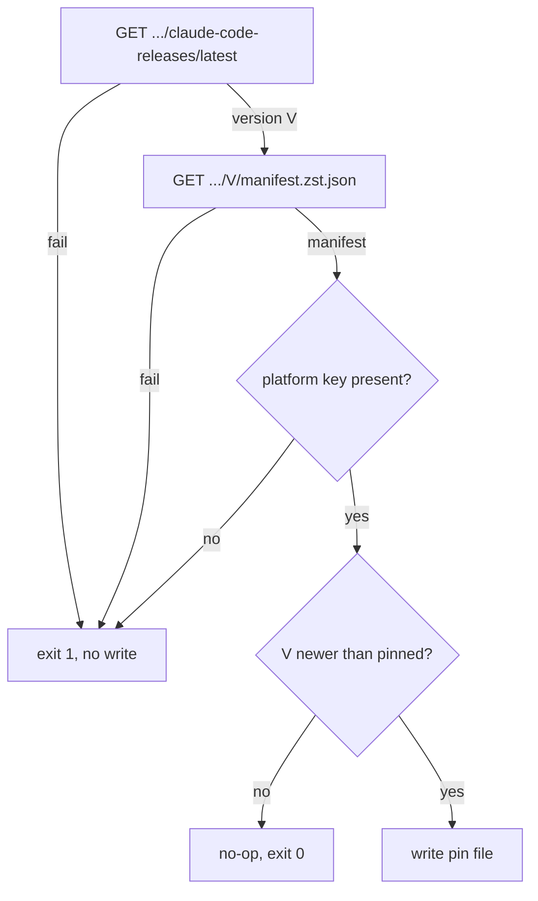
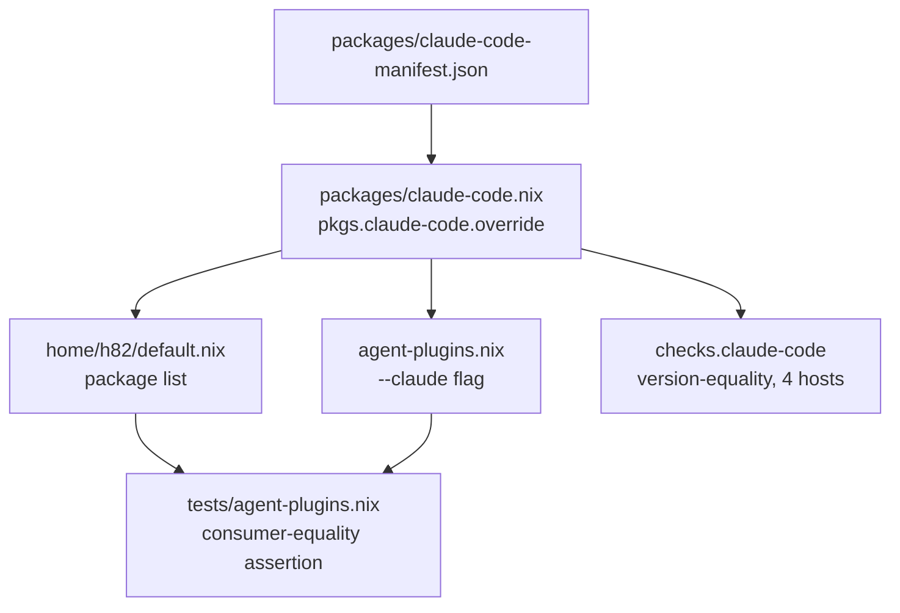

## Goal Capsule

- **Objective:** `h82`'s hosts run Claude Code within hours of Anthropic's actual release, instead of waiting on nixpkgs' review-and-channel-promotion cycle, so new models and features (e.g. Opus 5.5, which needs `claude-code` >=2.1.280) are usable as soon as Anthropic ships them and the host is next rebuilt.
- **Means:** Override nixpkgs' `claude-code` derivation's `manifest` argument with a pin this repo fetches directly from Anthropic's release endpoints (KTD2), refreshed hourly by the existing dependency-update workflow (R4).
- **Product Authority:** User `h82`, sole operator of both hosts.
- **Open Blockers:** None.

---

## Product Contract

### Summary

Replace the bare nixpkgs `claude-code` package with an override of nixpkgs' own `claude-code` derivation, pinned to a manifest this repo resolves directly from Anthropic's release endpoints. A new hourly step in the existing dependency-update workflow keeps that pin current, verified and merged the same way `claude-desktop` already is.

### Problem Frame

nixpkgs' `claude-code` package requires an upstream PR, review, build, and nixos-unstable channel promotion for every Anthropic release before this repo's hourly `nix flake update` can pick it up. Anthropic ships releases frequently: the nixpkgs revision this repo has locked carries `claude-code` 2.1.278, while Anthropic's own release endpoint already reports 2.1.280. Each new model or feature — most recently Opus 5.5, which requires >=2.1.280 — is unusable on these hosts until that multi-step chain catches up. `claude-desktop` in this repo already solves the analogous problem for the desktop app by pinning its own version file and refreshing it hourly via CI, bypassing nixpkgs' package-review latency entirely.

### Key Decisions

- **Override nixpkgs' `claude-code` derivation rather than writing an independent one.** (session-settled: user-approved — chosen over mirroring `packages/claude-desktop.nix`'s from-scratch approach: nixpkgs' `claude-code` package already fetches prebuilt Anthropic binaries through a `manifest` function argument with a default value, so re-pointing that one argument reuses nixpkgs' existing wrapping and runtime-dependency logic for far less new code; the tradeoff is coupling to nixpkgs' internal argument shape, which the `claude-code` check (KTD5) and `nix flake check` catch before anything reaches `main`.) Governs R1.
- **Resolve the pin from Anthropic's own release endpoints, not nixpkgs or npm.** nixpkgs' own derivation already depends on `https://downloads.claude.ai/claude-code-releases/{version}/manifest.zst.json`; hitting that directly, plus its `/latest` version pointer, needs no new parsing logic beyond what `scripts/claude-desktop-release` already does against a different upstream source. Governs R1, R3.

### Requirements

**Packaging**

- R1. `claude-code` in this repo resolves to `pkgs.claude-code` overridden with a pinned manifest, not the bare nixpkgs package.
- R2. `home/h82/default.nix`'s package list and `home/h82/agents/agent-plugins.nix`'s `${pkgs.claude-code}` reference both resolve to that same overridden package.

**Update automation**

- R3. A version pin file, parallel to `packages/claude-desktop-version.json`, and a release-resolver script, parallel to `scripts/claude-desktop-release`, keep the manifest data current.
- R4. `.github/workflows/update-dependencies.yml` runs that resolver hourly, verifies the result with `nix fmt -- --ci` and `nix flake check`, and follows the same push-on-success / reconciliation-PR-on-failure path it already uses for `claude-desktop`.
- R5. A newer `claude-code` version reaches either host only through an ordinary rebuild; the existing `DISABLE_AUTOUPDATER = "1"` session variable in `home/h82/agents/claude.nix` stays in force as Nix's sole claim on version authority.
- R6. The release-resolver refuses to write a pin when the freshly-resolved manifest is missing the platform key the package looks up, or when the resolved version is not newer than the currently pinned version.

### Acceptance Examples

- AE1. Override wins over nixpkgs' bundled default
  - **Covers R1.**
  - **Given:** the repo's pin records a version newer than the locked nixpkgs revision's own bundled manifest.
  - **When:** the packaged `claude-code` is built and run.
  - **Then:** `claude --version` reports the pinned version, not nixpkgs' bundled one.

- AE2. No drift between consumers
  - **Covers R2.**
  - **Given:** the pin is updated to a new version.
  - **When:** both `home/h82/default.nix`'s package list and `home/h82/agents/agent-plugins.nix`'s sync command are evaluated.
  - **Then:** both resolve to the identical store path.

- AE3. Hourly refresh mirrors claude-desktop
  - **Covers R3, R4.**
  - **Given:** Anthropic publishes a new `claude-code` release.
  - **When:** the next hourly `update-dependencies.yml` run resolves the pin.
  - **Then:** on green verification, the pin is committed and pushed to `main`; on red verification, a reconciliation PR is opened instead — the same branching `claude-desktop` already goes through.

- AE4. Resolver refuses an incomplete manifest
  - **Covers R6.**
  - **Given:** the freshly-resolved manifest lacks the platform key nixpkgs' package will look up.
  - **When:** the resolver runs.
  - **Then:** it exits nonzero with a clear message and writes nothing; the hourly job fails loudly with no commit.

- AE5. Resolver refuses a downgrade
  - **Covers R6.**
  - **Given:** the resolved version is not newer than the version already pinned on disk.
  - **When:** the resolver runs.
  - **Then:** it treats this like "already up to date" — no write, exit 0 — never overwriting a newer pin with an older one.

### Scope Boundaries

- Deferred for later: applying the same auto-tracking treatment to `gemini-cli` or other agent tools under `home/h82/agents/`.
- Outside this work: changing `claude-desktop`'s own update mechanism, or the shared verify-then-push/reconciliation-PR machinery in `update-dependencies.yml` itself — including its lack of per-target failure attribution, which now also covers a fourth target (see Risks & Dependencies).
- Outside this work: a local, on-machine update timer — freshness comes from the repo's hourly CI pin, picked up on the next ordinary rebuild, same as `claude-desktop` today.

### Dependencies / Assumptions

- Assumes the nixpkgs revision this repo has locked keeps exposing `claude-code`'s `manifest` function argument in its current shape (`manifest ? lib.importJSON ./manifest.zst.json`) — confirmed present at the currently locked revision `6774f7bc253789b113a4f39285dc0fa100abeacc`.
- Assumes Anthropic's `https://downloads.claude.ai/claude-code-releases/latest` and `.../{version}/manifest.zst.json` endpoints stay reachable and stable in shape, since nixpkgs' own package already depends on them.

### Sources / Research

- `packages/claude-desktop.nix`, `packages/claude-desktop-version.json`, `scripts/claude-desktop-release`, `.github/workflows/update-dependencies.yml` — the existing pin-plus-hourly-refresh pattern this work mirrors.
- `home/h82/default.nix:19`, `home/h82/agents/agent-plugins.nix:109` — the two current consumers of `pkgs.claude-code` (R2).
- `home/h82/agents/claude.nix:16` — the existing `DISABLE_AUTOUPDATER = "1"` session variable (R5): this repo already treats Nix, not the app, as the sole version authority for Claude Code.
- nixpkgs `pkgs/by-name/cl/claude-code/package.nix` at the locked revision `6774f7bc253789b113a4f39285dc0fa100abeacc` — confirms the `manifest ? lib.importJSON ./manifest.zst.json` overridable argument and the `https://downloads.claude.ai/claude-code-releases` fetch shape (R1, R3).
- nixpkgs `pkgs/by-name/cl/claude-code/manifest.zst.json` at the same revision — confirms the locked pin is version `2.1.278`, matching the version gap reported.
- `https://registry.npmjs.org/@anthropic-ai/claude-code/latest` — confirms Anthropic's current published release is `2.1.280`.

---

## Planning Contract

Product Contract preservation: changed — added R6 and AE4/AE5 to cover a resolver safety gap research surfaced; R1-R5 and AE1-AE3 are unchanged.

### Key Technical Decisions

- KTD1. **Pin file holds a full manifest attrset, not a flat version+hash triple.** Confirmed against nixpkgs' actual `manifest.zst.json` at the locked revision: `version`, `platforms.<os>-<arch>.{binary,checksum,size,bundle}` (Node-style keys, e.g. `linux-x64`, confirmed via a cached build's fetch URL); checksums are consumed as plain hex with no SRI conversion, unlike `claude-desktop-release`'s hash handling. Governs R1, R3.
- KTD2. **Single source of truth via `packages/claude-code.nix`.** (session-settled: user-approved — instantiates the Product Contract's override decision: mirrors `packages/claude-desktop.nix`'s `{ pkgs }:` + sibling-JSON-pin shape, returning `pkgs.claude-code.override { manifest = ...; }`; both consumers import this one file rather than touching `pkgs.claude-code` directly, mirroring how `packages/agent-tools.nix`'s helpers are already imported from more than one site.) Governs R1, R2.
- KTD3. **Two-step resolver, no hash conversion.** `scripts/claude-code-release` fetches Anthropic's plaintext `/latest` version pointer, then `/{version}/manifest.zst.json`, through one overridable fetch-command env var; CLI shape (`--output`/`-o`, `--dry-run`, change-detection) mirrors `scripts/claude-desktop-release`. Governs R3.
- KTD4. **Resolver refuses unsafe writes.** (session-settled: user-approved — chosen over silently mirroring `claude-desktop-release`'s unconditional `changed = current != resolved` write: research found an unguarded downgrade or a manifest missing the target platform key would otherwise reach `main` and either silently regress the pin or abort Nix evaluation across most of this flake's checks at once.) A missing platform key is a hard refusal (nonzero exit, no write); a non-newer resolved version is treated as a no-op (no write, exit 0), matching "already up to date." Governs R6.
- KTD5. **`checks.claude-code` asserts version equality, not just presence.** Extends the guarded `findFirst` + `lib.optionalString` shape `checks.claude-desktop` already uses, adding an assertion that the resolved package's version equals the pin file's `version` across all four `nixosConfigurations` — presence and an executable `bin/claude` alone would stay green even if the override were silently ignored, since nixpkgs' `claude-code` always ships a working binary from its own bundled default. Governs R1 (satisfies AE1).
- KTD6. **Consumer-equality check extends existing infrastructure.** `tests/agent-plugins.nix`'s existing extraction of the rendered `--claude` flag (already asserts it matches `/nix/store/*/bin/claude`) gains a comparison against the `home.packages` entry with `pname == "claude-code"`, rather than a new comparison mechanism — the two consumers converge to the same store path by construction only when both are actually migrated together. Governs R2 (satisfies AE2).
- KTD7. **Test fixtures route by requested URL for the two-call resolver.** `claude-desktop-release`'s one-shot `FAKE_FETCH` shim (ignores the URL, returns one static body) cannot express "step 1 succeeds, step 2 fails for that version" or "the manifest is missing the platform key." `tests/test_claude_code_release.py`'s shim keys its canned response on the requested URL (or call order). Governs R3, R6.
- KTD8. **One-time network-enabled smoke build closes the override-mechanism risk.** (session-settled: user-approved — chosen over trusting only the sandboxed check suite: this repo has never used a nixpkgs `.override` before, so a one-time real-network `nix build .#claude-code`, confirming `bin/claude --version` matches the pin and that a misspelled override key would error rather than silently no-op, retires that specific unverified risk cheaply, on top of KTD5's permanent per-run guard.) Governs R1.

### Risks & Dependencies

- The hourly "Update flake inputs, agent plugins, and packages" step runs under `set -euo pipefail` with no reconciliation fallback of its own — a resolver failure (network error, or a KTD4 refusal) fails the whole job silently (no commit, no PR), exactly as it already does today for the other three targets in that step. Inherited, not introduced or fixed by this work; the next hourly run retries.
- The shared reconciliation path attributes a `nix flake check` failure to the whole commit, not per-target: a legitimate claude-code bump bundled with an unrelated break is held, not lost, until the unrelated issue is reconciled. Pre-existing design, now covering a fourth target; out of scope per Scope Boundaries.
- Depends on nixpkgs' `claude-code` derivation continuing to expose an overridable `manifest` argument in its current shape at whatever revision this repo's `flake.lock` locks; a future nixpkgs restructuring would surface as a `nix flake check` failure caught before merge (KTD5), not a silent break.

### High-Level Technical Design

Resolver decision flow (R3, R6):

Packaging and verification topology (R1, R2):

---

## Implementation Units

### U1. Create the claude-code package override and seed its pin

- **Goal:** Introduce `packages/claude-code.nix`, returning `pkgs.claude-code` overridden with a manifest read from a sibling pin file, seeded with Anthropic's actual current release.
- **Requirements:** R1
- **Dependencies:** none
- **Files:** `packages/claude-code.nix` (new), `packages/claude-code-manifest.json` (new)
- **Approach:**
  1. Mirror `packages/claude-desktop.nix`'s `{ pkgs }:` + `builtins.fromJSON (builtins.readFile ./<pin>.json)` shape (KTD1, KTD2).
  2. Seed `packages/claude-code-manifest.json` by fetching Anthropic's `/latest` then `/{version}/manifest.zst.json` once by hand, matching KTD1's shape.
  3. Return `pkgs.claude-code.override { manifest = <parsed pin>; }` only — no other derivation logic; nixpkgs owns wrapping and runtime dependencies.
- **Patterns to follow:** `packages/claude-desktop.nix`; nixpkgs `pkgs/by-name/cl/claude-code/package.nix`'s `manifest` argument.
- **Test scenarios:**
  - Happy path: the built derivation's `version` matches the pin file's `version`.
  - Edge case: a pin file missing the `x86_64-linux`-equivalent platform key surfaces as a build failure rather than a silent fallback (KTD4's write-time guard is U2's job; this confirms the override itself doesn't mask it).
- **Verification:** `packages/claude-code.nix` evaluates under `nix eval`; the built package's version string matches the seeded pin.

### U2. Write the release-resolver script and its tests

- **Goal:** `scripts/claude-code-release` resolves Anthropic's current release into the pin shape U1 consumes, refusing to write an unsafe result.
- **Requirements:** R3, R6
- **Dependencies:** U1
- **Files:** `scripts/claude-code-release` (new), `tests/test_claude_code_release.py` (new)
- **Approach:**
  1. Two fetches through one overridable command env var (KTD3): plaintext `/latest`, then `/{version}/manifest.zst.json`.
  2. Refuse to write, nonzero exit with a stderr message, when the manifest lacks the target platform key (KTD4).
  3. Treat a resolved version that is not strictly newer than the on-disk pin as a no-op, same as "already up to date" (KTD4).
  4. `--output`/`-o`, `--dry-run`, and change-detection CLI shape mirroring `scripts/claude-desktop-release`.
- **Patterns to follow:** `scripts/claude-desktop-release`, `scripts/agent-plugin-release`.
- **Execution note:** Mirror `tests/test_claude_desktop_release.py`'s fixture harness, but route the fake fetch by requested URL or call order (KTD7) so two-call scenarios are expressible.
- **Test scenarios:**
  - Happy path: resolver reports a version newer than the pin; writes the new manifest; prints an "updated" message.
  - Happy path: resolver reports the version already pinned; no write; prints "already up to date".
  - Edge case: resolver reports a version numerically lower than the pin; no write, exit 0. Covers AE5.
  - Edge case: the manifest response is missing the target platform key; nonzero exit, no write. Covers AE4.
  - Error path: the `/latest` fetch fails (network/HTTP error); nonzero exit, no write.
  - Error path: the `/{version}/manifest.zst.json` fetch fails for the version `/latest` just reported; nonzero exit, no write.
- **Verification:** `python tests/test_claude_code_release.py` passes locally and inside the sandboxed `checks.claude-code-release` builder.

### U3. Register the package and its checks in the flake

- **Goal:** Expose `claude-code`/`claude-code-release` as flake packages and add their two regression checks.
- **Requirements:** R1
- **Dependencies:** U1, U2
- **Files:** `packages/agent-tools.nix`, `flake.nix`
- **Approach:**
  1. Add a `claudeCodeRelease` export to `packages/agent-tools.nix`, mirroring `claudeDesktopRelease`.
  2. Register `packages.${system}.claude-code` and `.claude-code-release` in `flake.nix`, mirroring the `claude-desktop`/`claude-desktop-release` entries.
  3. Add `checks.${system}.claude-code-release` (pure script unit test, mirroring `checks.claude-desktop-release`).
  4. Add `checks.${system}.claude-code`: guarded `findFirst` + `lib.optionalString` presence/executable check across all four `nixosConfigurations`, mirroring `checks.claude-desktop`, plus the version-equality assertion from KTD5.
- **Patterns to follow:** `flake.nix`'s existing `claude-desktop`/`claude-desktop-release` package and check blocks and their guarded-`findFirst` shape.
- **Test scenarios:**
  - Happy path: `checks.claude-code` and `checks.claude-code-release` both pass on a clean tree, on all four hosts.
  - Mutation round (removal): drop `claude-code` from one host's `home.packages` — the check fails from inside the builder with an explicit message, not a Nix evaluation abort.
  - Mutation round (content): change the pin file's `version` without changing what the derivation actually builds — the version-equality assertion turns red.
- **Verification:** `nix build --no-link .#checks.x86_64-linux.claude-code` and `.claude-code-release` succeed; both mutation rounds above are exercised once and reverted, each read from `nix log` to confirm the failure came from inside the builder with the check's own message.

### U4. Migrate both existing consumers onto the shared package

- **Goal:** `home/h82/default.nix` and `home/h82/agents/agent-plugins.nix` both resolve `claude-code` through `packages/claude-code.nix`, and a check catches future drift between them.
- **Requirements:** R2
- **Dependencies:** U1
- **Files:** `home/h82/default.nix`, `home/h82/agents/agent-plugins.nix`, `tests/agent-plugins.nix`
- **Approach:**
  1. Drop `claude-code` from `home/h82/default.nix`'s `with pkgs; [...]` list; add `(import ../../packages/claude-code.nix { inherit pkgs; })` alongside the existing `claude-desktop.nix`/`nix-tools.nix`/`orca.nix` imports.
  2. Replace `agent-plugins.nix`'s `${pkgs.claude-code}` with the same import, `let`-bound the way `syncTool` already is there.
  3. Extend `tests/agent-plugins.nix`'s existing `--claude` flag extraction to also assert the extracted store path equals the `home.packages` entry with `pname == "claude-code"` (KTD6).
- **Patterns to follow:** `packages/agent-tools.nix`'s two-call-site import (from `flake.nix` and `home/h82/agents/claude.nix`); `tests/agent-plugins.nix`'s existing `expectedRev`-vs-`lockedRev` comparison shape.
- **Test scenarios:**
  - Happy path: both consumers evaluate to the same store path.
  - Edge case (Covers AE2): mutate `agent-plugins.nix` back to `${pkgs.claude-code}` while `default.nix` stays migrated — the new equality assertion fails; today's shape-only assertion would not have caught this.
- **Verification:** `nix build --no-link .#checks.x86_64-linux.agent-plugins` passes on a clean tree and fails, for its own stated reason, under the mutation above.

### U5. Wire the hourly update step

- **Goal:** `.github/workflows/update-dependencies.yml` refreshes the claude-code pin every hour through the existing verify-then-push-or-reconciliation-PR path.
- **Requirements:** R4
- **Dependencies:** U2, U3
- **Files:** `.github/workflows/update-dependencies.yml`, `tests/update-dependencies-push-order.sh` (read first; update only if its invariant requires a new case)
- **Approach:**
  1. Append a "4. Update Claude Code" block (`nix run .#claude-code-release -- --output packages/claude-code-manifest.json`) directly after the existing "3. Update Claude Desktop" block, before the step's shared `git status --porcelain` change-detection tail.
  2. Add a matching commit block in "Push verified updates directly to main" (version read via `jq`, message `chore(packages): bump claude-code to $NEW_VER`), placed after the claude-desktop block and before the agent-plugins block.
  3. Make no changes to "Verify updates" or the failure-path steps — they already operate generically over whatever changed (Scope Boundaries).
- **Patterns to follow:** the existing claude-desktop block in both the update step and the push step.
- **Execution note:** This is packaging/CI configuration; prefer the workflow's own existing `checks.update-dependencies-push-order` as smoke verification over new unit tests for this unit.
- **Test scenarios:**
  - Test expectation: none — config change; verified by `checks.update-dependencies-push-order` and a real workflow run.
- **Verification:** `nix build --no-link .#checks.x86_64-linux.update-dependencies-push-order` passes; a manual `workflow_dispatch` run (or the next scheduled run after merge) shows a "4. Update Claude Code" line executing.

### U6. Full verification and one-time override smoke build

- **Goal:** Confirm the whole change builds, formats, and passes checks together, and retire the one-time risk that the `manifest` override argument is silently mis-wired (KTD8).
- **Requirements:** R1, R2, R3, R4, R5, R6 (closes the unit)
- **Dependencies:** U1, U2, U3, U4, U5
- **Files:** none
- **Approach:**
  1. Run `nix fmt -- --ci` and `nix flake check`.
  2. Run a real, network-enabled `nix build .#claude-code` once (not sandboxed) and confirm `bin/claude --version` reports the pinned version (KTD8).
  3. Build all four host toplevels.
- **Test scenarios:**
  - Test expectation: none — verification unit, no new behavior.
- **Verification:**
  - `nix fmt -- --ci`
  - `nix flake check`
  - `nix build .#claude-code` (network-enabled, one-time)
  - `nix build --no-link .#nixosConfigurations.ThinkPad-X1-Carbon-Gen-11.config.system.build.toplevel`
  - `nix build --no-link .#nixosConfigurations.ThinkPad-X1-Carbon-Gen-11-bootstrap.config.system.build.toplevel`
  - `nix build --no-link .#nixosConfigurations.MS-7D91.config.system.build.toplevel`
  - `nix build --no-link .#nixosConfigurations.MS-7D91-bootstrap.config.system.build.toplevel`

---

## Verification Contract

| Command | Proves |
| --- | --- |
| `nix fmt -- --ci` | Formatting matches repo convention |
| `nix flake check` | Every registered check, including the two new ones and `agent-plugins`/`update-dependencies-push-order` |
| `nix build --no-link .#checks.x86_64-linux.claude-code` | Package present, executable, and version-equal to the pin, on all four hosts |
| `nix build --no-link .#checks.x86_64-linux.claude-code-release` | Resolver script unit tests, including the refusal paths |
| `nix build .#claude-code` (network-enabled, one-time) | The `manifest` override argument actually wires in |
| Four host toplevel builds | Full-system evaluation succeeds |

---

## Definition of Done

- `packages/claude-code.nix` and `packages/claude-code-manifest.json` exist and build to the pinned version.
- `scripts/claude-code-release` exists, passes `tests/test_claude_code_release.py`, and refuses to write on a missing platform key or a non-newer version.
- `home/h82/default.nix` and `agent-plugins.nix` both resolve `claude-code` through `packages/claude-code.nix`; `tests/agent-plugins.nix`'s extended assertion passes.
- `.github/workflows/update-dependencies.yml` runs the resolver hourly through the existing verify/push/reconciliation path.
- `checks.claude-code` and `checks.claude-code-release` pass on a clean tree; both documented mutation rounds (removal, content) were run once and reverted.
- The one-time network-enabled `nix build .#claude-code` smoke build confirmed the override argument wires in correctly.
- `nix fmt -- --ci`, `nix flake check`, and all four host toplevel builds pass.
- No dead-end or experimental code from approaches not taken remains in the diff.
