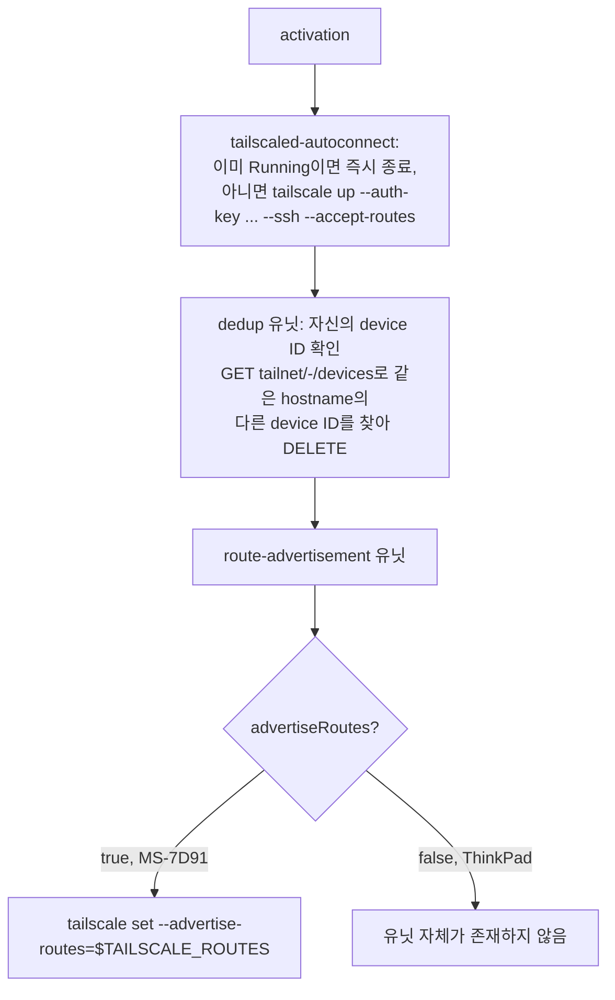

# Tailscale Mesh + Declarative Firewall - Plan

## Goal Capsule

- **Objective:** `ThinkPad-X1-Carbon-Gen-11`과 `MS-7D91`이 Tailscale로 서로 및 외부에서 안전하게 원격 접속되고, `MS-7D91`을 통해 지정된 홈 네트워크/사내 서버 대역에 도달할 수 있으며, 최초 시크릿·ACL 준비 이후에는 재설치를 포함한 모든 activation이 사람 개입 없이 완료된다.
- **Means:** NixOS 내장 `networking.firewall` + `services.tailscale`를 두 호스트에 선언적으로 구성한다. firewalld는 사용하지 않는다.
- **Product authority:** 이 `ce-brainstorm` 대화에서 사용자가 직접 결정 — 전 항목 user-directed.
- **Open blockers:** 없음. 남은 준비 작업(`.sops.yaml` 규칙 추가, tailnet ACL auto-approver 설정)은 구현 단계의 일부이며 Dependencies에 기록되어 있다.

---

## Product Contract

**Product Contract preservation:** restructured, no scope change — added R9 (route-accepting host must opt in; Linux does not auto-accept advertised routes, so the Goal Capsule's reachability objective could not otherwise hold) and redacted the literal route IP from R5/Dependencies prose (ce-doc-review security-lens finding: R7 already requires this value stay out of git history, and the plan text itself is git-tracked). Both are completions of the already-stated objective, not new scope. Otherwise unchanged; this enrichment adds the Planning Contract, Implementation Units, Verification Contract, and Definition of Done below.

### Summary

두 호스트(`ThinkPad-X1-Carbon-Gen-11`, `MS-7D91`)에 NixOS 내장 방화벽과 Tailscale을 선언적으로 구성한다. 두 머신은 Tailscale SSH로 서로/외부에서 원격 접속 가능해지고, `MS-7D91`은 홈 네트워크 두 대역과 사내 서버 한 곳을 서브넷 라우터로 광고한다. 등록과 재설치 시 기존 기기 정리까지 sops로 암호화된 시크릿만으로 완전히 무인 동작한다.

### Requirements

**Firewall**

- R1. 두 호스트 모두 firewalld가 아닌 NixOS 내장 `networking.firewall`을 유일한 방화벽 백엔드로 사용하며, 기존 기본 거부(default-deny) 인바운드 태세 위에 Tailscale 동작에 필요한 포트만 추가로 연다.

**Tailscale connectivity**

- R2. 두 호스트 모두 activation 시 인증 키로 자동 등록되며, 대화형 브라우저 로그인을 요구하지 않는다.
- R3. 두 호스트 모두 원격 로그인은 Tailscale SSH로 이루어지며, 별도의 `sshd`는 실행하지 않는다.
- R4. 호스트를 재설치해도 동일 호스트명의 이전 기기가 tailnet에 중복으로 남지 않는다 — 새 등록 전 또는 그 일부로 이전 기기가 자동 제거된다.

**Subnet routing**

- R5. `MS-7D91`은 정확히 세 개의 경로 — `192.168.10.0/24`, `192.168.1.0/24`, `wp.jpi.co.kr`의 단일 IP(정확한 값은 `secrets/tailscale.yaml`에만 보관하며 이 문서에는 기록하지 않는다) — 만 광고한다. 그 외 경로나 전체 트래픽을 넘기는 default route는 광고하지 않는다.
- R6. `ThinkPad-X1-Carbon-Gen-11`은 어떤 경로도 광고하지 않으며 exit node로 동작하지 않는다.
- R9. 경로를 사용하는 호스트(`ThinkPad-X1-Carbon-Gen-11`)는 명시적으로 라우트 수신을 켠다. Tailscale의 Linux 클라이언트는 광고된 서브넷 라우트를 기본적으로 수신하지 않으므로, 이 설정 없이는 Goal Capsule의 라우트 도달 목표가 성립하지 않는다.

**Secrets & unattended operation**

- R7. Tailscale 인증 키, 기기 정리용 API 자격 증명, 세 경로 값은 오직 sops로 암호화된 시크릿(`secrets/tailscale.yaml`)으로만 보관되며, Nix 스토어나 git 이력에 평문으로 남지 않는다.
- R8. 시크릿과 tailnet ACL을 최초 1회 준비한 뒤에는, 재설치를 포함한 이후의 모든 `nixos-rebuild`/activation이 대화형 로그인·기기 승인·경로 승인 없이 완료된다.

### Key Decisions

- **적용 범위: 두 호스트 모두** (session-settled: user-directed — chosen over ThinkPad 단독/MS-7D91 단독: 두 머신이 서로 tailnet으로 연결되어야 의미 있는 구성이므로).
- **NixOS 내장 방화벽 사용, firewalld 대신** (session-settled: user-directed — chosen over firewalld: 노출 포트가 Tailscale UDP 포트뿐이라 zone/dbus 계층이 불필요한 복잡도였음). Governs R1.
- **authkey 기반 자동 등록** (session-settled: user-directed — chosen over 수동 `tailscale up` 로그인: 재설치 시에도 무인 등록이 가능함). Governs R2, R7.
- **Tailscale SSH로 원격 접속** (session-settled: user-directed — chosen over 별도 openssh: 키 관리와 방화벽 규칙이 줄어듦). Governs R3.
- **개인 API 액세스 토큰으로 중복 기기 자동 삭제** (session-settled: user-directed — chosen over scoped OAuth client 및 수동 admin console 삭제: 이미 발급받은 토큰이 있고, 재설치마다 사람 개입 없이 정리되어야 함). Governs R4, R7.
- **`MS-7D91`이 서브넷 라우터** (session-settled: user-directed — chosen over `ThinkPad` 단독 또는 둘 다: 고정 데스크톱이라 항상 켜져 있고 홈 네트워크에 상주함). Governs R5, R6.
- **라우트 IP는 정적 secret 값, 활성화 시마다 DNS 재조회하지 않음** (session-settled: user-directed — chosen over 매 activation마다 `wp.jpi.co.kr` 재조회: 단순하며 그 IP가 자주 바뀌지 않음). Governs R5.

### Actors

- A1. **운영자(사용자)** — `secrets/tailscale.yaml`과 tailnet ACL의 route auto-approver를 최초 1회 out-of-band로 준비한다. 이후의 일반적인 rebuild에는 관여하지 않는다.
- A2. **`ThinkPad-X1-Carbon-Gen-11` / `MS-7D91`** — 각 호스트는 activation 시 F1의 흐름으로 스스로 등록한다.
- A3. **Tailscale 코디네이션 서비스 / API** — 노드를 인증하고 ACL 정책에 따라 경로 승인을 적용하며, F1의 정리 단계에서 조회·수정된다.

### Key Flows

- F1. **무인 Tailscale activation** — Covers R2, R4, R8.
  - **Trigger:** 두 호스트 중 하나에서 `nixos-rebuild switch`가 activate되거나(재설치 후 첫 부팅 포함).
  - **Actors:** A2, A3.
  - **Steps:** sops-nix가 `secrets/tailscale.yaml`을 복호화한다 → 정리 단계가 Tailscale API로 동일 호스트명의 기존 기기를 조회해 제거한다 → 인증 키로 `tailscale up`이 노드를 등록한다 → `MS-7D91`인 경우 세 경로를 추가로 광고한다.
  - **Outcome:** 해당 호스트가 tailnet에서 `Running` 상태에 도달하고, 중복 없이 하나의 현재 기기 항목만 존재하며, 어떤 대화형 단계도 필요하지 않다.

### Acceptance Examples

- AE1. **Covers R4.** Given `MS-7D91`이 이전에 등록되어 있고 재설치 중일 때, When 동일 호스트명으로 새 설치가 activate되면, Then tailnet에 이전 기기 항목이 더 이상 남아 있지 않고 `MS-7D91` 기기는 하나만 나열된다.
- AE2. **Covers R2, R8.** Given `secrets/tailscale.yaml`이 채워져 있고 tailnet ACL의 route auto-approver가 설정되어 있을 때, When 두 호스트 중 하나가 `nixos-rebuild switch`를 실행하거나(또는 재설치 후 첫 부팅) activate되면, Then 대화형 로그인·기기 승인·경로 승인 프롬프트 없이 Tailscale이 `Running` 상태에 도달한다.
- AE3. **Covers R5, R6, R9.** Given `MS-7D91`이 정상 동작 중일 때, When 다른 tailnet 피어가 광고된 경로를 조회하면, Then 정확히 secret에 기록된 세 대역만 광고되어 있고, `ThinkPad-X1-Carbon-Gen-11`은 아무 경로도 광고하지 않으며, 어느 호스트도 default route(`0.0.0.0/0`)를 광고하지 않는다. 또한 `ThinkPad-X1-Carbon-Gen-11`의 tailscale 설정에서 라우트 수신이 켜져 있어, 실제로 그 대역에 도달할 수 있다.

### Scope Boundaries

**Deferred for later**

- 전체 트래픽 경로를 넘기는 exit-node(default route) 기능.
- `wp.jpi.co.kr` 라우트 IP의 activation-time 자동 DNS 재조회 — 지금은 정적 secret 값이며, IP가 바뀌면 사람이 secret을 수정하고 재빌드한다.

**Outside this work**

- KDE Connect, Avahi, 프린팅 등 기존에 리포에 구성되어 있지 않던 LAN 디스커버리 서비스에 대한 방화벽 예외 — 이번 작업의 대상이 아니다.

### Success Criteria

- `nix flake check`와 네 개 호스트 빌드(`ThinkPad-X1-Carbon-Gen-11`, `-bootstrap`, `MS-7D91`, `-bootstrap`)가 새 모듈을 포함한 채로 모두 통과한다 (AGENTS.md 기준).
- 구현 과정에서 어떤 도구도 실제 시크릿 평문을 파일이나 로그에 남기지 않는다 — 최초 1회 시크릿 채움은 사용자가 직접 실행한다.

### Dependencies / Assumptions

- `secrets/tailscale.yaml`은 이미 존재하며(이 브레인스토밍 세션에서 사용자가 직접 `op read | sops encrypt`로 준비함), `tailscale.auth_key`, `tailscale.api_token`, `tailscale.routes.{lan_10,lan_1,wp_jpi_co_kr}` 키를 담고 있다. Nix 모듈은 이 구조를 소비 대상으로 삼되, 정확한 키 이름은 계획 단계에서 확정한다.
- `.sops.yaml`에는 아직 `secrets/tailscale\.yaml$` 생성 규칙이 없다 — sops 일반 툴링(`sops edit` 등)이 이 파일을 인식하려면 계획 단계에서 규칙을 추가해야 한다.
- API 토큰(`op://H82/Tailscale/API Key`)은 2026-12-22 만료 예정이다 — 그 전에 로테이션이 필요하다.
- R8이 성립하려면 tailnet ACL에 광고된 세 경로에 대한 route auto-approver가 설정되어 있어야 한다 — 아직 설정되지 않았다면 admin console에서의 1회성 작업이 필요하다.
- `wp.jpi.co.kr`은 내부망에서만 해석되는 도메인이다. 실제 IP는 `secrets/tailscale.yaml`에만 보관하며, 이 값이 바뀌면 secret을 수동으로 갱신하고 재빌드해야 한다.
- `tailscale.auth_key`는 반드시 **Reusable**(재사용 가능) 키여야 한다 — 일반(1회용) auth key는 첫 등록 이후 재사용할 수 없어, 두 번째 호스트의 최초 등록이나 이후 어떤 재설치도 즉시 실패한다. R2/R4/R8은 이 하나의 secret이 매 등록마다 다시 쓰인다고 전제한다. 이미 준비된 `secrets/tailscale.yaml`의 키가 Reusable로 발급되었는지는 사용자가 확인해야 한다 — 아니라면 admin console에서 재발급해 secret을 갱신해야 한다.
- Tailscale SSH(R3)가 실제로 로그인을 허용하려면 tailnet ACL에 명시적인 `ssh` action이 의도한 사용자/태그로 스코프되어 있어야 한다 — route auto-approver와 마찬가지로 admin console에서의 1회성 작업이다.

### Sources / Research

- 리포 조사: `modules/`, `hosts/`, `flake.nix`에 `networking.firewall`, `services.firewalld`, `services.tailscale`, `services.openssh` 설정이 이전에 전혀 없었다.
- `modules/nixos/services/podman.nix` — 이 리포가 서비스 모듈에 쓰는 `options.my.<name>` + `mkIf cfg.enable` 패턴.
- `modules/nixos/wifi.nix`, `modules/nixos/system/secrets.nix`, `secrets/README.md` — 이 플랜의 `secrets/tailscale.yaml`이 따르는 sops-secret + 호스트별 `.sops.yaml` 생성 규칙 관례.
- nixpkgs(pinned rev `20b1ddd1aa5ace70c9468305030aa4f9ef79671b`, nixos-unstable) `nixos/modules/services/networking/tailscale.nix` — `services.tailscale`의 `openFirewall`, `useRoutingFeatures`, `authKeyFile`, `extraUpFlags` 옵션. `openFirewall`은 `networking.firewall.allowedUDPPorts`만 연동하므로 firewalld가 아닌 내장 방화벽과 바로 맞물린다.
- [Tailscale — Auth keys](https://tailscale.com/docs/features/access-control/auth-keys) — 동일 호스트명 기기를 자동으로 교체하는 내장 메커니즘은 없으며, 기존 기기는 admin console 또는 API로 제거해야 한다는 점이 R4의 근거다.
- 참고용 외부 스크립트 `hyperlapse122/dotfiles`의 `home/.chezmoiscripts/30-linux/run_onchange_after_install-system-30-network.sh.tmpl` (Fedora/chezmoi, firewalld 기반, 명령형) — 최초 firewalld 프레이밍(trusted zone 바인딩, WireGuard/STUN 포트 개방, exit-node masquerade 근거)의 출발점이었으나, 이 플랜은 Key Decision에 따라 내장 방화벽으로 pivot했으므로 firewalld 관련 메커니즘은 더 이상 적용되지 않는다. Tailscale이 필요로 하는 포트라는 근거만 R1에 이어진다.

---

## Planning Contract

### Key Technical Decisions

- KTD1. **전용 firewall 모듈을 만들지 않는다.** NixOS의 `networking.firewall`은 이미 기본 활성화 상태이며, 이 작업에 필요한 유일한 방화벽 변경은 `services.tailscale.openFirewall = true`(UDP 41641 개방)뿐이다. 별도 `modules/nixos/system/firewall.nix`는 빈 껍데기가 된다. Governs R1.
- KTD2. **시크릿은 `sops.secrets`/`sops.templates`로만 유닛에 전달하고, `extraSetFlags` 등 Nix 문자열에는 절대 넣지 않는다.** 빌드 시점 문자열 보간은 Nix 스토어에 평문으로 남는다 — `tests/wifi-provisioning.nix`가 이미 이 함정을 `nix-store -qR | grep`로 검증하는 패턴을 갖고 있다. authkey는 `services.tailscale.authKeyFile`(네이티브 옵션)로, API 토큰과 라우트 목록은 `sops.templates."tailscale.env"`가 렌더링하는 파일을 통해 런타임에만 주입한다. Governs R7.
- KTD3. **재등록 정리(dedup) 유닛은 `tailscaled-autoconnect` 성공 *이후*에 돌며, "이 hostname과 일치하지만 지금 등록된 자신과 device ID가 다른" 기기만 삭제한다.** (ce-doc-review adversarial 지적으로 사전 게이트 방식에서 교체됨.) `tailscaled-autoconnect`는 `Type=notify`라 자신이 `Running`에 도달해야만 시작된 것으로 간주되므로, dedup 유닛을 `After=tailscaled-autoconnect.service`로 순서화하면 tailscaled가 이미 인증·등록된 뒤에만 실행된다 — 별도의 BackendState 폴링이 필요 없다. 이 유닛은 `tailscale status --json`으로 자신의 현재 device ID를 얻고, `GET /api/v2/tailnet/-/devices`로 같은 hostname의 다른 device ID들을 찾아 그것들만 `DELETE /api/v2/device/{deviceid}`한다(인증은 `Authorization: Bearer <token>`, [Tailscale API 문서 미러](https://github.com/gbraad/tailscale/blob/main/api.md)). 이 방식은 일반 rebuild(이미 `Running`이라 `tailscaled-autoconnect`가 즉시 종료)와 key-expiry 재인증(디스크 상태가 남아 있어 같은 device ID로 재인증됨, 삭제 대상 없음) 모두에서 안전하게 no-op하고, 진짜 재설치(디스크가 비어 새 device ID로 등록됨)에서만 이전 기기를 지운다 — device ID 비교이므로 BackendState만으로는 구분 못 하는 이 두 경우가 자동으로 구분된다. `Wants`/`After=tailscaled-autoconnect.service`는 그 유닛이 실패(예: 오프라인 부팅에서 `TimeoutStartSec` 만료)로 끝나도 순서 제약이 풀려 dedup 유닛이 시작될 수 있다는 systemd의 실제 동작을 U6의 VM 테스트로 확인했다 — 이 경우 자신의 device ID를 아직 모르는 상태이므로, 자신의 ID가 비어 있으면 아무것도 지우지 않고 종료하는 방어 로직을 둔다. Governs R4, R8.
- KTD4. **`useRoutingFeatures = "server"`는 `advertiseRoutes = true`인 호스트(`MS-7D91`)에만 설정한다.** nixpkgs 모듈이 IP forwarding sysctl을 자동으로 켜므로 수동 sysctl이 필요 없고, `client`/`both`에서만 켜지는 `checkReversePath = "loose"`는 이 경우 해당하지 않는다. Governs R5, R6.
- KTD5. **dedup 조회의 호스트명 비교는 대소문자를 무시한다.** Tailscale은 등록 시 호스트명을 소문자로 정규화할 수 있어, API가 돌려주는 `hostname` 필드를 `networking.hostName`(예: `MS-7D91`)과 대소문자 구분 없이 비교해야 오탐 없이 이전 기기만 정확히 삭제한다. Governs R4.
- KTD6. **두 호스트 모두 `extraUpFlags`에 `--accept-routes`를 켠다.** (ce-doc-review adversarial 지적.) Tailscale의 Linux 클라이언트는 광고된 서브넷 라우트를 기본적으로 수신하지 않는다 — 이 플래그 없이는 `MS-7D91`이 세 경로를 광고해도 `ThinkPad-X1-Carbon-Gen-11`이 실제로 그 경로에 도달할 수 없어, R9와 Goal Capsule의 라우트 도달 목표가 깨진다. `MS-7D91`에도 동일하게 켜 두어도 무해하다(스스로 광고하는 경로를 스스로 수신하는 것은 아무 효과가 없음). Governs R9.

### High-Level Technical Design

두 신규 systemd 유닛이 nixpkgs 기본 `tailscaled-autoconnect.service` 이후에 순서화되는 흐름이다(KTD3, KTD4, KTD6). `tailscaled-autoconnect`는 `Type=notify`라 자신이 `Running`에 도달해야 "시작됨"으로 간주되므로, 이후 유닛은 별도 상태 폴링 없이 안전하게 인증된 상태에서 시작한다.

### Risks & Dependencies

- Tailscale의 공개 API가 호출 대상이다 — 스키마나 인증 방식이 바뀌면 dedup 유닛이 조용히 실패할 수 있다. `curl`의 HTTP 상태 코드를 확인하고 실패 시 activation을 막지 않고 경고만 남기는 방향을 권장한다(재시도는 다음 activation에서 자연스럽게 이뤄짐).
- API 토큰을 `curl -H "Authorization: Bearer $TOKEN"`처럼 리터럴 인자로 넘기면 `/proc/<pid>/cmdline`을 통해 같은 호스트의 다른 로컬 사용자에게 노출된다(ce-doc-review security-lens 지적) — 짧게 사는 헤더 파일을 통해 전달하거나(`curl -K`/`--config`) argv에 토큰 문자열이 남지 않는 방식을 써야 한다.
- API 토큰(`op://H82/Tailscale/API Key`)은 2026-12-22 만료 — Product Contract Dependencies에 이미 기록됨; 만료 후에는 dedup 유닛이 인증 실패로 no-op한다.
- Tailnet ACL의 route auto-approver 설정 여부는 이 리포의 Nix 코드로 확인·자동화할 수 없는 외부 상태다 — Product Contract Dependencies에 기록된 대로 운영자가 admin console에서 1회 확인해야 한다.

---

## Implementation Units

### U1. Tailscale 모듈 골격 + secrets 배선

- **Goal:** `modules/nixos/services/tailscale.nix`를 신설하고 `options.my.tailscale`(`enable`, `advertiseRoutes`)을 정의하며, `sops.secrets`와 `sops.templates."tailscale.env"`를 배선한다.
- **Requirements:** R2, R7.
- **Dependencies:** none.
- **Files:**
  - `modules/nixos/services/tailscale.nix` (create)
- **Approach:**
  1. `modules/nixos/wifi.nix`의 `sopsFile`/`available` 패턴을 그대로 따른다 — `secrets/tailscale.yaml` 존재 여부로 `available`을 판정한다.
  2. `sops.secrets`를 `tailscale/auth_key`, `tailscale/api_token`, `tailscale/routes/lan_10`, `tailscale/routes/lan_1`, `tailscale/routes/wp_jpi_co_kr`로 선언한다(owner=root, mode=0400).
  3. `sops.templates."tailscale.env"`가 `TAILSCALE_API_TOKEN=...`과, `advertiseRoutes`일 때만 콤마 join된 `TAILSCALE_ROUTES=...`를 렌더링한다(KTD2). 여기에 `TAILSCALE_API_BASE`도 함께 두되 기본값은 `https://api.tailscale.com`으로 하고, `my.tailscale`의 (테스트 전용) 옵션으로 override 가능하게 한다 — U6의 VM 테스트가 실제 Tailscale API 대신 mock 서버를 가리키게 하기 위함(feasibility 지적).
- **Patterns to follow:** `modules/nixos/wifi.nix`(sops 시크릿 + 템플릿), `modules/nixos/services/podman.nix`(`options.my.<name>` + `mkIf cfg.enable` 형태).
- **Test scenarios:**
  - `available = false`(secrets 파일 없음)일 때 `my.tailscale.enable = true`가 평가 오류 없이 빌드되고 tailscaled는 인증 없이 대기한다.
  - `available = true`일 때 `sops.secrets`에 다섯 개 키가 정확한 owner/mode로 선언된다.
- **Verification:** `nix eval`로 옵션 구조 확인, `nix flake check`.

### U2. 핵심 Tailscale 서비스 배선

- **Goal:** `services.tailscale`를 `openFirewall`, `authKeyFile`, `extraUpFlags = ["--ssh" "--accept-routes"]`, `useRoutingFeatures`로 배선한다.
- **Requirements:** R1, R2, R3, R7, R9.
- **Dependencies:** U1.
- **Files:**
  - `modules/nixos/services/tailscale.nix` (extend)
- **Approach:** `authKeyFile = config.sops.secrets."tailscale/auth_key".path`, `useRoutingFeatures = if cfg.advertiseRoutes then "server" else "none"` (KTD1, KTD4). `extraUpFlags`는 두 호스트 동일하게 `["--ssh" "--accept-routes"]`(KTD6) — `--accept-routes`는 `advertiseRoutes` 여부와 무관하게 항상 켠다.
- **Patterns to follow:** nixpkgs `services.tailscale` 모듈(`openFirewall` → `networking.firewall.allowedUDPPorts`).
- **Test scenarios:**
  - `advertiseRoutes = false`(ThinkPad)일 때 `useRoutingFeatures = "none"`이고 forwarding sysctl이 설정되지 않는다.
  - `advertiseRoutes = true`(MS-7D91)일 때 `useRoutingFeatures = "server"`이고 forwarding sysctl이 켜진다.
  - 두 경우 모두 `networking.firewall.allowedUDPPorts`에 41641이 포함된다.
  - Covers AE3, R9. 두 호스트 모두 `extraUpFlags`에 `--ssh`와 `--accept-routes`가 포함되고, 이 모듈은 `services.openssh`를 건드리지 않는다(R3).
- **Verification:** `nix eval .#nixosConfigurations.<host>.config.services.tailscale`로 위 필드를 확인한다.

### U3. 재등록 정리(dedup) systemd 유닛

- **Goal:** 재설치 시 동일 호스트명의 이전 기기를 등록 *후*에 자동 제거하는 oneshot 유닛을 추가한다(KTD3 — ce-doc-review adversarial/feasibility 지적으로 사전 게이트 방식에서 교체됨).
- **Requirements:** R4, R8.
- **Dependencies:** U1, U2.
- **Files:**
  - `modules/nixos/services/tailscale.nix` (extend)
- **Approach:**
  1. `After = ["tailscaled-autoconnect.service"]`이면서, `wantedBy = ["multi-user.target"]`(또는 `tailscaled-autoconnect.service` 쪽에 `wants`를 추가)로 유닛을 정의한다 — `after`만으로는 순서만 강제될 뿐 시작을 보장하지 않으므로(`modules/nixos/wifi.nix:78-81`의 `after`+`wants` 짝짓기 패턴을 따른다), 반드시 pull-in 관계를 함께 선언한다. `tailscaled-autoconnect`는 `Type=notify`라 자신이 `Running`에 도달해야 시작된 것으로 간주되므로, 이 순서만으로 tailscaled가 이미 인증됨이 보장된다 — 별도 BackendState 폴링은 불필요하다(HTD 참조).
  2. `tailscale status --json`으로 자신의 현재 device ID를 얻는다.
  3. `$TAILSCALE_API_BASE/api/v2/tailnet/-/devices`(`GET`)를 `tailscale.env`의 `TAILSCALE_API_TOKEN`으로 인증 호출하고, KTD5의 대소문자 무시 비교로 이 호스트명과 일치하되 device ID가 자신과 다른 기기만 `$TAILSCALE_API_BASE/api/v2/device/{id}`(`DELETE`)한다. `TAILSCALE_API_BASE`는 U1의 `tailscale.env`가 기본값 `https://api.tailscale.com`으로 제공하며, U6의 VM 테스트에서만 mock 서버 주소로 override된다.
  4. bearer 토큰은 `curl` 인자로 직접 넘기지 않는다 — `/proc/*/cmdline` 노출을 피하기 위해 짧게 사는 헤더 파일이나 `curl -K`/`--config`를 사용한다(Risks 참조).
- **Execution note:** 이 유닛은 실패해도 activation을 막지 않아야 한다 — API 실패 시 경고만 남기고 종료한다(Risks 참조).
- **Test scenarios:**
  - 유닛이 `wantedBy`(또는 짝이 되는 `wants`)로 실제 boot transaction에 포함되며, `tailscaled-autoconnect.service` 뒤에 순서화된다.
  - `advertiseRoutes` 값과 무관하게 두 호스트 모두에 이 유닛이 존재한다(R4는 두 호스트 공통).
  - `EnvironmentFile`이 `sops.templates."tailscale.env".path`를 가리킨다.
  - Covers AE1. (U6의 VM 테스트에서, mock API 서버를 대상으로) 자신과 다른 device ID를 가진 동일 hostname 기기가 있으면 그 기기만 삭제되고 자신은 남는다; 동일 hostname의 다른 device ID가 없으면 아무것도 삭제하지 않는다(일반 rebuild·key-expiry 재인증 시나리오).
- **Verification:** 유닛의 `After`/`Wants`(또는 `WantedBy`)/`EnvironmentFile`이 기대한 값과 일치하고, U6의 mock-API VM 테스트가 실제 삭제 로직을 통과한다.

### U4. 경로 광고(route-advertisement) systemd 유닛

- **Goal:** `advertiseRoutes = true`인 호스트에서만 세 경로를 광고하는 유닛을 추가한다.
- **Requirements:** R5, R6.
- **Dependencies:** U2.
- **Files:**
  - `modules/nixos/services/tailscale.nix` (extend)
- **Approach:** `mkIf cfg.advertiseRoutes`로 유닛 전체를 가드한다. `After = ["tailscaled-autoconnect.service"]`와 함께 `wantedBy = ["multi-user.target"]`(또는 짝이 되는 `wants`)를 반드시 선언한다 — U3와 동일하게, `after`만으로는 시작이 보장되지 않는다(`modules/nixos/wifi.nix:78-81` 패턴). `TAILSCALE_ROUTES` 환경변수를 `tailscale set --advertise-routes=$TAILSCALE_ROUTES`에 그대로 전달한다(KTD2, KTD3 — `extraSetFlags`는 쓰지 않고, 게이트 없이 매번 실행).
- **Test scenarios:**
  - `advertiseRoutes = false`인 ThinkPad에는 이 유닛이 아예 존재하지 않는다(R6).
  - `advertiseRoutes = true`인 MS-7D91에는 존재하고, `wantedBy`(또는 짝이 되는 `wants`)로 실제 boot transaction에 포함되며 `After=tailscaled-autoconnect.service`이다.
  - Covers AE3. `TAILSCALE_ROUTES` 값이 정확히 `192.168.10.0/24,192.168.1.0/24,<wp_jpi_co_kr 시크릿 값>` 형태(콤마 join, 공백 없음)로 렌더링된다.
- **Verification:** 유닛 존재 여부가 호스트별로 다름을 `nix eval`로 확인한다.

### U5. `.sops.yaml` 생성 규칙 추가

- **Goal:** `secrets/tailscale.yaml`을 위한 창조 규칙을 등록한다.
- **Requirements:** R7.
- **Dependencies:** none.
- **Files:**
  - `.sops.yaml` (modify)
- **Approach:** 기존 `tokens.yaml`/`wifi.yaml` 규칙과 동일한 두 호스트 recipient로 `path_regex: secrets/tailscale\.yaml$` 한 줄을 추가한다.
- **Test expectation:** none -- 순수 설정 한 줄 추가이며, U6의 fixture가 `sops --encrypt --age <recipients>`로 동일 recipient를 직접 사용해 우회 검증한다.
- **Verification:** `.sops.yaml`의 새 규칙이 기존 두 규칙과 동일한 recipient 목록을 갖는다.

### U6. 호스트 배선 + 회귀 테스트

- **Goal:** 두 호스트에 모듈을 연결하고, `wifi-provisioning.nix`를 본뜬 VM 테스트로 전체를 회귀 검증한다.
- **Requirements:** R1–R9 전체.
- **Dependencies:** U1, U2, U3, U4, U5.
- **Files:**
  - `hosts/ThinkPad-X1-Carbon-Gen-11/default.nix` (modify)
  - `hosts/MS-7D91/default.nix` (modify)
  - `tests/tailscale-provisioning.nix` (create)
  - `flake.nix` (modify — `checks.tailscale-provisioning` 등록)
- **Approach:**
  1. 두 `hosts/*/default.nix`의 `imports`에 `../../modules/nixos/services/tailscale.nix`를 추가하고 `config.my.tailscale.enable = true;`를 설정한다.
  2. `hosts/MS-7D91/default.nix`에만 `config.my.tailscale.advertiseRoutes = true;`를 추가한다.
  3. `tests/wifi-provisioning.nix`을 본떠 `pkgs.testers.nixosTest`로 fake age 키 + `FAKE_` 접두사 시크릿을 만들고, 렌더링된 `services.tailscale`/dedup/route-advertisement 유닛 설정을 검증하며, `nix-store -qR | xargs grep -rl FAKE_`로 시크릿이 빌드된 클로저에 새지 않는지 확인한다.
  4. dedup 유닛의 실제 삭제 로직(AE1)을 검증하기 위해, VM 테스트에 세 번째 노드로 작은 mock HTTP 서버(예: `pkgs.python3`의 표준 라이브러리 HTTP 서버, 미리 정한 device 목록으로 `GET /api/v2/tailnet/-/devices`에 응답하고 `DELETE /api/v2/device/{id}` 호출을 기록)를 추가하고, 피검사 호스트의 `TAILSCALE_API_BASE`를 이 mock 노드로 override한다. 자신과 다른 device ID를 가진 동일 hostname 항목이 있는 케이스와 없는 케이스 둘 다 확인한다(feasibility 지적 — mock 없이는 AE1이 실제로 검증되지 않음).
- **Patterns to follow:** `tests/wifi-provisioning.nix`(fixture + `nixosTest` + 스토어 누출 검사), `flake.nix`의 기존 `checks` 등록 스타일.
- **Test scenarios:**
  - Covers AE3, R9. 두 호스트 빌드에서 `advertiseRoutes`에 따라 라우트 유닛 존재 여부가 갈리고, 두 호스트 모두 `--accept-routes`가 켜져 있다.
  - Covers AE1, U3. mock API 서버를 대상으로: (a) 자신과 다른 device ID의 동일 hostname 기기가 있으면 그것만 삭제되고 mock 서버가 그 `DELETE` 호출을 기록한다, (b) 그런 기기가 없으면 아무 `DELETE`도 발생하지 않는다.
  - Covers AE2. `authKeyFile`/`EnvironmentFile` 경로가 실제 sops secret 경로를 가리켜, 대화형 로그인 없이 도달 가능함을 정적으로 증명한다.
  - 빌드된 시스템 클로저(`nix-store -qR`)에 fake `auth_key`/`api_token`/라우트 값이 전혀 나타나지 않는다.
- **Verification:** `nix flake check`와 4개 호스트 빌드(AGENTS.md) 통과, 새 `checks.tailscale-provisioning` 통과.

---

## Verification Contract

| 명령 | 적용 대상 |
| --- | --- |
| `nix fmt -- --ci` | 전체 diff |
| `nix flake check` | 전체 (신규 `checks.tailscale-provisioning` 포함) |
| `nix build --no-link .#nixosConfigurations.ThinkPad-X1-Carbon-Gen-11.config.system.build.toplevel` | U6 |
| `nix build --no-link .#nixosConfigurations.ThinkPad-X1-Carbon-Gen-11-bootstrap.config.system.build.toplevel` | U6 |
| `nix build --no-link .#nixosConfigurations.MS-7D91.config.system.build.toplevel` | U6 |
| `nix build --no-link .#nixosConfigurations.MS-7D91-bootstrap.config.system.build.toplevel` | U6 |

실제 하드웨어에서의 `tailscale status`/SSH 접속/라우트 도달성/재설치 시 중복 정리 확인은 이 리포의 자동화 체크로 검증할 수 없다 — AGENTS.md의 지침대로 하드웨어 검증은 VM/빌드 증거와 별도로 보고한다.

---

## Definition of Done

- U1–U6 전부 구현되고 커밋된다.
- `nix fmt -- --ci`가 통과한다.
- `nix flake check`와 4개 호스트 빌드가 모두 통과한다.
- `checks.tailscale-provisioning`을 포함해, 빌드된 어떤 시스템 클로저에도 실제 또는 fake 시크릿 값이 나타나지 않는다.
- `.sops.yaml`에 새 규칙이 있고, 기존 `secrets/tailscale.yaml`이 그 규칙 아래에서 정상 복호화된다.
- 시도했다가 폐기한 접근의 코드가 diff에 남아 있지 않다.
- 실제 하드웨어 검증(tailscale status, SSH, 라우트 도달성, 재설치 시 dedup)은 수동 후속 작업으로 문서화되며, 이 리포의 자동 체크 범위 밖임을 명시한다.
