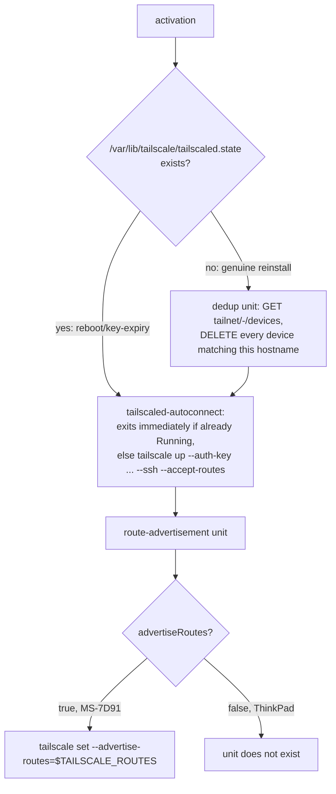

# Tailscale Mesh + Declarative Firewall - Plan

## Goal Capsule

- **Objective:** `ThinkPad-X1-Carbon-Gen-11` and `MS-7D91` can reach each other and be reached remotely over Tailscale, `MS-7D91` provides reachability to the specified home-network/office-server ranges, and after the one-time secret/ACL setup every activation — including a full reinstall — completes with no human involvement.
- **Means:** Configure NixOS's built-in `networking.firewall` plus `services.tailscale` declaratively on both hosts. firewalld is not used.
- **Product authority:** Decided directly by the user in this `ce-brainstorm` conversation — every item is user-directed.
- **Open blockers:** None. The remaining prep work (adding a `.sops.yaml` rule, configuring the tailnet ACL auto-approver) is part of implementation and is recorded under Dependencies.

---

## Product Contract

**Product Contract preservation:** restructured, no scope change — added R9 (a route-accepting host must opt in; Linux does not auto-accept advertised routes, so the Goal Capsule's reachability objective could not otherwise hold) and redacted the literal route IP from R5/Dependencies prose (ce-doc-review security-lens finding: R7 already requires this value stay out of git history, and the plan text itself is git-tracked). Both are completions of the already-stated objective, not new scope. Otherwise unchanged; this enrichment adds the Planning Contract, Implementation Units, Verification Contract, and Definition of Done below.

### Summary

Declaratively configure NixOS's built-in firewall and Tailscale on both hosts (`ThinkPad-X1-Carbon-Gen-11`, `MS-7D91`). Both machines become reachable for remote login to/from each other and the outside over Tailscale SSH, and `MS-7D91` advertises two home-network ranges plus one office server as a subnet router. Registration, and cleanup of a stale device on reinstall, run fully unattended from sops-encrypted secrets alone.

### Requirements

**Firewall**

- R1. Both hosts use NixOS's built-in `networking.firewall` as their sole firewall backend, not firewalld, opening only the ports Tailscale needs on top of the existing default-deny inbound posture.

**Tailscale connectivity**

- R2. Both hosts register automatically with an auth key at activation, with no interactive browser login required.
- R3. Remote login to both hosts happens over Tailscale SSH; neither runs a separate `sshd`.
- R4. Reinstalling a host does not leave a duplicate prior device under the same hostname in the tailnet — the prior device is removed automatically before, or as part of, the new registration.

**Subnet routing**

- R5. `MS-7D91` advertises exactly three routes — `192.168.10.0/24`, `192.168.1.0/24`, and a single IP for `wp.jpi.co.kr` (the exact value is kept only in `secrets/tailscale.yaml`, never recorded in this document) — and nothing else. No other route, and no default route carrying all traffic, is advertised.
- R6. `ThinkPad-X1-Carbon-Gen-11` advertises no routes and does not act as an exit node.
- R9. The host that consumes those routes (`ThinkPad-X1-Carbon-Gen-11`) explicitly turns route acceptance on. Tailscale's Linux client does not accept advertised subnet routes by default, so without this setting the Goal Capsule's reachability objective cannot hold.

**Secrets & unattended operation**

- R7. The Tailscale auth key, the device-cleanup API credential, and the three route values are kept only in the sops-encrypted secret (`secrets/tailscale.yaml`), never in plaintext in the Nix store or git history.
- R8. After the secrets and the tailnet ACL are prepared once, every subsequent `nixos-rebuild`/activation — including a reinstall — completes with no interactive login, device-approval, or route-approval step.

### Key Decisions

- **Scope: both hosts** (session-settled: user-directed — chosen over ThinkPad alone or MS-7D91 alone: the two machines only make sense connected to each other over the tailnet).
- **Use NixOS's built-in firewall, not firewalld** (session-settled: user-directed — chosen over firewalld: the only exposed ports are Tailscale's UDP ports, so firewalld's zone/dbus layer was unneeded complexity). Governs R1.
- **Automatic registration via auth key** (session-settled: user-directed — chosen over a manual `tailscale up` login: keeps registration unattended even across a reinstall). Governs R2, R7.
- **Remote access via Tailscale SSH** (session-settled: user-directed — chosen over a separate openssh: fewer keys to manage and fewer firewall rules). Governs R3.
- **Automatic duplicate-device deletion via a personal API access token** (session-settled: user-directed — chosen over a scoped OAuth client and over manual admin-console deletion: a token was already issued, and cleanup must happen unattended on every reinstall). Governs R4, R7.
- **`MS-7D91` is the subnet router** (session-settled: user-directed — chosen over `ThinkPad` alone or both: it is a stationary desktop, always on, resident on the home network). Governs R5, R6.
- **Route IPs are a static secret value; no DNS re-resolution at activation** (session-settled: user-directed — chosen over re-resolving `wp.jpi.co.kr` on every activation: simpler, and that IP rarely changes). Governs R5.

### Actors

- A1. **Operator (the user)** — prepares `secrets/tailscale.yaml` and the tailnet ACL's route auto-approver once, out of band. Not involved in ordinary rebuilds afterward.
- A2. **`ThinkPad-X1-Carbon-Gen-11` / `MS-7D91`** — each host registers itself at activation via the F1 flow.
- A3. **Tailscale coordination service / API** — authenticates nodes and applies route approval per ACL policy; queried and mutated by the cleanup step in F1.

### Key Flows

- F1. **Unattended Tailscale activation** — Covers R2, R4, R8.
  - **Trigger:** `nixos-rebuild switch` activates on either host (including the first boot after a reinstall).
  - **Actors:** A2, A3.
  - **Steps:** sops-nix decrypts `secrets/tailscale.yaml` → the cleanup step queries the Tailscale API for any existing device under this hostname and removes it → `tailscale up` registers the node with the auth key → on `MS-7D91`, the three routes are additionally advertised.
  - **Outcome:** the host reaches `Running` state in the tailnet, exactly one current device entry exists with no duplicate, and no interactive step is required.

### Acceptance Examples

- AE1. **Covers R4.** Given `MS-7D91` was previously registered and is being reinstalled, When a fresh install under the same hostname activates, Then the prior device entry no longer exists in the tailnet and only one `MS-7D91` device is listed.
- AE2. **Covers R2, R8.** Given `secrets/tailscale.yaml` is populated and the tailnet ACL's route auto-approver is configured, When either host runs (or activates via) `nixos-rebuild switch` (including first boot after a reinstall), Then Tailscale reaches `Running` state with no interactive login, device-approval, or route-approval prompt.
- AE3. **Covers R5, R6, R9.** Given `MS-7D91` is operating normally, When another tailnet peer queries the advertised routes, Then exactly the three ranges recorded in the secret are advertised, `ThinkPad-X1-Carbon-Gen-11` advertises no routes, and neither host advertises a default route (`0.0.0.0/0`). Also, route acceptance is on in `ThinkPad-X1-Carbon-Gen-11`'s Tailscale configuration, so it can actually reach those ranges.

### Scope Boundaries

**Deferred for later**

- An exit-node (default-route) capability that carries all traffic.
- Automatic activation-time DNS re-resolution of the `wp.jpi.co.kr` route IP — it is a static secret value for now; if the IP changes, a human updates the secret and rebuilds.

**Outside this work**

- Firewall exceptions for LAN-discovery services (KDE Connect, Avahi, printing, etc.) that are not already configured in this repo — not the target of this work.

### Success Criteria

- `nix flake check` and all four host builds (`ThinkPad-X1-Carbon-Gen-11`, `-bootstrap`, `MS-7D91`, `-bootstrap`) pass with the new module included (per AGENTS.md).
- No tool used during implementation leaves real secret plaintext in a file or a log — the one-time secret population is run by the user directly.

### Dependencies / Assumptions

- `secrets/tailscale.yaml` already exists (the user prepared it directly during this brainstorming session via `op read | sops encrypt`) and holds the keys `tailscale.auth_key`, `tailscale.api_token`, `tailscale.routes.{lan_10,lan_1,wp_jpi_co_kr}`. The Nix module consumes this structure; the exact key names are finalized during planning.
- `.sops.yaml` does not yet have a creation rule for `secrets/tailscale\.yaml$` — planning must add one so ordinary sops tooling (`sops edit`, etc.) recognizes the file.
- The API token (`op://H82/Tailscale/API Key`) expires 2026-12-22 — it needs rotation before then.
- For R8 to hold, the tailnet ACL needs a route auto-approver configured for the three advertised routes — if not already set, this is a one-time admin-console task.
- `wp.jpi.co.kr` is a domain that only resolves on the internal network. The real IP is kept only in `secrets/tailscale.yaml`; if it changes, the secret must be updated manually and the system rebuilt.
- `tailscale.auth_key` must be a **Reusable** key — an ordinary (single-use) auth key cannot be reused after its first registration, so the second host's initial registration, or any later reinstall, would fail immediately. R2/R4/R8 assume this one secret is reused for every registration. Whether the key already in `secrets/tailscale.yaml` was issued as Reusable needs user confirmation — if not, it must be reissued from the admin console and the secret updated.
- For Tailscale SSH (R3) to actually permit login, the tailnet ACL needs an explicit `ssh` action scoped to the intended user/tag — like the route auto-approver, this is a one-time admin-console task.

### Sources / Research

- Repo survey: `modules/`, `hosts/`, and `flake.nix` had no prior `networking.firewall`, `services.firewalld`, `services.tailscale`, or `services.openssh` configuration at all.
- `modules/nixos/services/podman.nix` — this repo's `options.my.<name>` + `mkIf cfg.enable` pattern for service modules.
- `modules/nixos/wifi.nix`, `modules/nixos/system/secrets.nix`, `secrets/README.md` — the sops-secret plus per-host `.sops.yaml` creation-rule convention this plan's `secrets/tailscale.yaml` follows.
- nixpkgs (pinned rev `20b1ddd1aa5ace70c9468305030aa4f9ef79671b`, nixos-unstable) `nixos/modules/services/networking/tailscale.nix` — the `services.tailscale` options `openFirewall`, `useRoutingFeatures`, `authKeyFile`, `extraUpFlags`. `openFirewall` only wires `networking.firewall.allowedUDPPorts`, so it plugs directly into the built-in firewall rather than firewalld.
- [Tailscale — Auth keys](https://tailscale.com/docs/features/access-control/auth-keys) — there is no built-in mechanism that automatically replaces a device under the same hostname; an existing device must be removed via the admin console or the API, which is the basis for R4.
- Reference external script from `hyperlapse122/dotfiles`, `home/.chezmoiscripts/30-linux/run_onchange_after_install-system-30-network.sh.tmpl` (Fedora/chezmoi, firewalld-based, imperative) — the starting point for the original firewalld framing (trusted-zone binding, opening the WireGuard/STUN ports, exit-node masquerade rationale), but this plan pivoted to the built-in firewall per the Key Decision above, so the firewalld-specific mechanics no longer apply. Only the rationale for which ports Tailscale needs carries over into R1.

---

## Planning Contract

### Key Technical Decisions

- KTD1. **No dedicated firewall module.** NixOS's `networking.firewall` is already enabled by default, and the only firewall change this work needs is `services.tailscale.openFirewall = true` (opening UDP 41641). A separate `modules/nixos/system/firewall.nix` would be an empty shell. Governs R1.
- KTD2. **Secrets reach units only through `sops.secrets`/`sops.templates`, never through `extraSetFlags` or any other Nix string.** Build-time string interpolation leaves plaintext in the Nix store — `tests/wifi-provisioning.nix` already has a pattern that checks for exactly this trap via `nix-store -qR | grep`. The auth key uses `services.tailscale.authKeyFile` (the native option); the API token and the route list are each injected at runtime only through their own `sops.templates` file (`tailscale-api.env`, `tailscale-routes.env` — split so the route-advertisement unit never receives the API token it doesn't use). Governs R7.
- KTD3. **The re-registration cleanup (dedup) unit runs *before* `tailscaled-autoconnect`, and deletes every device matching this hostname only when tailscaled's own state file (`/var/lib/tailscale/tailscaled.state`) does not yet exist.** (Corrected twice via ce-doc-review — see the correction history below.) If the state file exists, this is either an ordinary rebuild or a key-expiry reauthentication, and in both cases the existing registration under this hostname already *is* this instance, so nothing is touched. If the state file is absent, the disk was wiped for a genuine reinstall, so every device matching this hostname is deleted *before* registration — Tailscale appends a suffix (e.g. `-1`) to the newly-registering device, not the pre-existing one, when a hostname collides, so cleanup must happen before registration to keep the clean name. `Before=tailscaled-autoconnect.service` alone is sufficient, since that unit is already pulled in by nixpkgs' own `wantedBy = [ "multi-user.target" ]`. The API calls are `GET /api/v2/tailnet/-/devices` (matched against the response's `hostname` field, case-insensitively) and `DELETE /api/v2/device/{deviceid}`, authenticated with `Authorization: Bearer <token>` ([Tailscale API doc mirror](https://github.com/gbraad/tailscale/blob/main/api.md)). Governs R4, R8.

  **Correction history:** the original design ran *after* `tailscaled-autoconnect` succeeded and deleted only devices whose device ID differed from this instance's own. A ce-doc-review adversarial pass pointed out that BackendState alone cannot distinguish a key-expiry reauthentication from a genuine reinstall, risking deletion of a still-live device, which produced the first correction: compare device IDs after registration. A subsequent `code-review` pass then found a defect in that first correction itself: if cleanup happens *after* registration, the prior device is still present at the moment the new device registers on reinstall, so the hostname collides, Tailscale appends a suffix to the new device, and only afterward does cleanup run — the clean hostname never comes back. The current design, gated on state-file existence, solves both problems at once: a key-expiry reauthentication leaves the state file in place, so nothing is touched from the start, and a genuine reinstall has no state file, so cleanup runs safely *before* registration.
- KTD4. **`useRoutingFeatures = "server"` is set only on the host with `advertiseRoutes = true` (`MS-7D91`).** The nixpkgs module automatically enables IP forwarding sysctls, so no manual sysctl is needed, and `checkReversePath = "loose"` (which only applies to `client`/`both`) is not relevant here. Governs R5, R6.
- KTD5. **The dedup query's hostname comparison is case-insensitive.** Tailscale may normalize the hostname to lowercase at registration, so the API's returned `hostname` field must be compared against `networking.hostName` (e.g. `MS-7D91`) case-insensitively, or the prior device would not be matched and deleted correctly. Governs R4.
- KTD6. **Both hosts turn on `--accept-routes` in `extraUpFlags`.** (ce-doc-review adversarial finding.) Tailscale's Linux client does not accept advertised subnet routes by default — without this flag, `MS-7D91` could advertise its three routes and `ThinkPad-X1-Carbon-Gen-11` still could not actually reach them, breaking R9 and the Goal Capsule's reachability objective. Turning it on for `MS-7D91` too is harmless (a host accepting the routes it advertises to itself has no effect). Governs R9.

### High-Level Technical Design

The dedup unit is ordered *before* `tailscaled-autoconnect.service` (KTD3); the route-advertisement unit is ordered *after* it (KTD4, KTD6).

### Risks & Dependencies

- Tailscale's public API is the call target — if its schema or auth method changes, the dedup unit can fail silently. Checking `curl`'s HTTP status and, on failure, skipping cleanup with only a warning (never blocking activation) is the recommended approach; the next activation retries naturally.
- Passing the API token as a literal `curl -H "Authorization: Bearer $TOKEN"` argument would expose it to any other local user on the host via `/proc/<pid>/cmdline` (ce-doc-review security-lens finding) — `curl -K -` reads the header from stdin instead, so it touches neither a file nor argv.
- The dedup unit now runs *before* `tailscaled-autoconnect`, so the network may not be ready yet (the cost of the ordering flip that code-review's finding required). Since an API failure skips cleanup and exits quietly, the hostname-suffix problem can only recur on the very first boot of a genuine reinstall, and only when the network happens to come up unusually late — no retry loop is added for this (polling logic for this narrow case would cost more than it buys). Whether this edge case actually occurs on a real hardware reinstall is a manual-verification item.
- The API token (`op://H82/Tailscale/API Key`) expires 2026-12-22 — already recorded under Product Contract Dependencies; after expiry, the dedup unit no-ops on auth failure.
- Whether the tailnet ACL's route auto-approver is configured is external state this repo's Nix code cannot check or automate — as recorded under Product Contract Dependencies, the operator must confirm it once in the admin console.

---

## Implementation Units

### U1. Tailscale module skeleton + secrets wiring

- **Goal:** create `modules/nixos/services/tailscale.nix`, define `options.my.tailscale` (`enable`, `advertiseRoutes`, `apiBase`), and wire `sops.secrets` and `sops.templates` (`tailscale-api.env`, `tailscale-routes.env`).
- **Requirements:** R2, R7.
- **Dependencies:** none.
- **Files:**
  - `modules/nixos/services/tailscale.nix` (create)
- **Approach:**
  1. Follow `modules/nixos/wifi.nix`'s `sopsFile`/`available` pattern exactly — `available` is decided by whether `secrets/tailscale.yaml` exists.
  2. Declare `sops.secrets` for `tailscale/auth_key`, `tailscale/api_token`, `tailscale/routes/lan_10`, `tailscale/routes/lan_1`, `tailscale/routes/wp_jpi_co_kr` (owner=root, mode=0400).
  3. `sops.templates."tailscale-api.env"` renders `TAILSCALE_API_TOKEN=...` and `TAILSCALE_API_BASE=...` (KTD2); a separate `sops.templates."tailscale-routes.env"`, only when `advertiseRoutes`, renders a comma-joined `TAILSCALE_ROUTES=...`. `apiBase` is an ordinary option defaulting to `https://api.tailscale.com`; U6's VM test overrides it to point at a mock server instead of the real Tailscale API (feasibility finding).
- **Patterns to follow:** `modules/nixos/wifi.nix` (sops secrets + templates), `modules/nixos/services/podman.nix` (`options.my.<name>` + `mkIf cfg.enable` shape).
- **Test scenarios:**
  - With `available = false` (no secrets file), `my.tailscale.enable = true` builds cleanly with no evaluation error and tailscaled sits unauthenticated.
  - With `available = true`, `sops.secrets` declares the five keys with the correct owner/mode.
- **Verification:** confirm the option structure with `nix eval`; `nix flake check`.

### U2. Core Tailscale service wiring

- **Goal:** wire `services.tailscale` with `openFirewall`, `authKeyFile`, `extraUpFlags = ["--ssh" "--accept-routes"]`, and `useRoutingFeatures`.
- **Requirements:** R1, R2, R3, R7, R9.
- **Dependencies:** U1.
- **Files:**
  - `modules/nixos/services/tailscale.nix` (extend)
- **Approach:** `authKeyFile = config.sops.secrets."tailscale/auth_key".path`, `useRoutingFeatures = if cfg.advertiseRoutes then "server" else "none"` (KTD1, KTD4). `extraUpFlags` is the same `["--ssh" "--accept-routes"]` on both hosts (KTD6) — `--accept-routes` is always on regardless of `advertiseRoutes`.
- **Patterns to follow:** the nixpkgs `services.tailscale` module (`openFirewall` → `networking.firewall.allowedUDPPorts`).
- **Test scenarios:**
  - With `advertiseRoutes = false` (ThinkPad), `useRoutingFeatures = "none"` and the forwarding sysctl is not set.
  - With `advertiseRoutes = true` (MS-7D91), `useRoutingFeatures = "server"` and the forwarding sysctl is on.
  - In both cases, `networking.firewall.allowedUDPPorts` includes 41641.
  - Covers AE3, R9. Both hosts have `--ssh` and `--accept-routes` in `extraUpFlags`, and this module never touches `services.openssh` (R3).
- **Verification:** confirm these fields via `nix eval .#nixosConfigurations.<host>.config.services.tailscale`.

### U3. Re-registration cleanup (dedup) systemd unit

- **Goal:** add a oneshot unit that automatically removes a prior device under the same hostname *before* registration on reinstall (KTD3 — corrected twice via ce-doc-review and code-review).
- **Requirements:** R4, R8.
- **Dependencies:** U1, U2.
- **Files:**
  - `modules/nixos/services/tailscale.nix` (extend)
  - `scripts/tailscale-dedup-device` (create)
- **Approach:**
  1. Define the unit with `before = ["tailscaled-autoconnect.service"]` and `wantedBy = ["multi-user.target"]` — since nixpkgs itself already pulls `tailscaled-autoconnect` in via `wantedBy = [ "multi-user.target" ]`, `before` alone is enough to guarantee the order.
  2. The script checks only whether `/var/lib/tailscale/tailscaled.state` (the state-file path tailscaled actually uses) exists — if so, exit immediately (see HTD).
  3. If not, authenticate a `GET` to `$TAILSCALE_API_BASE/api/v2/tailnet/-/devices` with `tailscale-api.env`'s `TAILSCALE_API_TOKEN`, and `DELETE $TAILSCALE_API_BASE/api/v2/device/{id}` for every device matching this hostname under KTD5's case-insensitive comparison (no self-identity check is needed, since registration has not happened yet). `TAILSCALE_API_BASE` defaults to `https://api.tailscale.com` from U1's `tailscale-api.env`, and is overridden to the mock server address only in U6's VM test.
  4. The bearer token is never passed as a `curl` argument directly — read it from stdin via `curl -K`/`--config` to avoid `/proc/*/cmdline` exposure (see Risks).
  5. Write `scripts/tailscale-dedup-device` as a standalone file following this repo's `scripts/` + direct-invocation test convention, and wrap it with `pkgs.writeShellScript` in the module — no test-only internal option.
- **Execution note:** this unit must not block activation on failure — on an API failure, log a warning and exit (see Risks).
- **Test scenarios:**
  - The unit is pulled into the real boot transaction via `wantedBy` and is ordered ahead of `tailscaled-autoconnect.service`. This check targets the actually-installed unit on a booted VM via `systemctl`, not the Nix-evaluated value — a check that reads only the declared value would still pass even if `systemd.services.<name>.enable` were off (see the [related learning](.compound-engineering/artifacts/solutions/best-practices/nix-check-reads-option-value-not-materialized-output.md)).
  - The unit exists on both hosts regardless of `advertiseRoutes` (R4 applies to both hosts).
  - `EnvironmentFile` points at `sops.templates."tailscale-api.env".path`.
  - Covers AE1. (In U6's VM test, against the mock API server.) When `tailscaled.state` is absent and a device with the same hostname exists, that device is deleted; when `tailscaled.state` exists (or no such device exists), nothing is deleted (the ordinary-rebuild / key-expiry-reauth scenarios).
- **Verification:** confirm the installed unit's ordering and `EnvironmentFile` on a booted VM via `systemctl cat`/`systemctl show`, and pass U6's mock-API VM test of the actual deletion logic.

### U4. Route-advertisement systemd unit

- **Goal:** add a unit, present only on the host with `advertiseRoutes = true`, that advertises the three routes.
- **Requirements:** R5, R6.
- **Dependencies:** U2.
- **Files:**
  - `modules/nixos/services/tailscale.nix` (extend)
- **Approach:** guard the whole unit with `mkIf cfg.advertiseRoutes`. Since `after` alone does not guarantee a start (the `modules/nixos/wifi.nix:78-81` pattern), declare `After = ["tailscaled-autoconnect.service"]` together with `wantedBy = ["multi-user.target"]` — unlike U3 (cleanup before registration), this unit must advertise routes after registration, so it is ordered in the opposite direction. Pass the `TAILSCALE_ROUTES` environment variable straight through to `tailscale set --advertise-routes=$TAILSCALE_ROUTES` (KTD2, KTD3 — `extraSetFlags` is not used, and no gate is needed since it runs every time).
- **Test scenarios:**
  - On ThinkPad (`advertiseRoutes = false`), this unit does not exist at all (R6).
  - On MS-7D91 (`advertiseRoutes = true`), it exists, is pulled into the real boot transaction via `wantedBy` (or its paired `wants`), and is `After=tailscaled-autoconnect.service`.
  - Covers AE3. `TAILSCALE_ROUTES` renders exactly as `192.168.10.0/24,192.168.1.0/24,<wp_jpi_co_kr secret value>` (comma-joined, no spaces).
- **Verification:** confirm via `nix eval` that the unit's existence differs per host.

### U5. Add a `.sops.yaml` creation rule

- **Goal:** register a creation rule for `secrets/tailscale.yaml`.
- **Requirements:** R7.
- **Dependencies:** none.
- **Files:**
  - `.sops.yaml` (modify)
- **Approach:** add one line, `path_regex: secrets/tailscale\.yaml$`, with the same two-host recipient list already used by the `tokens.yaml`/`wifi.yaml` rules.
- **Test expectation:** none -- a pure one-line config addition; U6's fixture indirectly exercises the same recipients via `sops --encrypt --age <recipients>`.
- **Verification:** `.sops.yaml`'s new rule has the same recipient list as the existing two rules.

### U6. Host wiring + regression tests

- **Goal:** wire the module into both hosts, regression-test the whole thing with a VM test modeled on `wifi-provisioning.nix`, and add a static guard preventing `advertiseRoutes` from being on for both hosts at once.
- **Requirements:** all of R1–R9.
- **Dependencies:** U1, U2, U3, U4, U5.
- **Files:**
  - `hosts/ThinkPad-X1-Carbon-Gen-11/default.nix` (modify)
  - `hosts/MS-7D91/default.nix` (modify)
  - `tests/tailscale-provisioning.nix` (create)
  - `tests/tailscale-mock-api.py` (create)
  - `flake.nix` (modify — register `checks.tailscale-provisioning` and `checks.tailscale-single-router`)
- **Approach:**
  1. Add `../../modules/nixos/services/tailscale.nix` to both `hosts/*/default.nix` imports and set `config.my.tailscale.enable = true;`.
  2. Add `config.my.tailscale.advertiseRoutes = true;` only to `hosts/MS-7D91/default.nix`.
  3. Modeled on `tests/wifi-provisioning.nix`, build a `pkgs.testers.nixosTest` with a fake age key and `FAKE_`-prefixed secrets, verify the actually-installed units on a booted VM via `systemctl` (see U3 — a check that reads only the declared value can be fooled by a side option like `enable=false`), and confirm with `nix-store -qR | xargs grep -rlE 'FAKE_...'` that the secret never leaks into the built closure.
  4. To verify the dedup unit's actual deletion logic (AE1), add a third VM node running a small mock HTTP server (`tests/tailscale-mock-api.py`, using the standard-library `http.server` to respond to `GET /api/v2/tailnet/-/devices` with a predetermined device list and log each `DELETE /api/v2/device/{id}` call), and override the host under test's `apiBase` to point at that mock node. Cover both the case where `tailscaled.state` is absent and a same-hostname device exists, and the case where it exists (or no such device exists) (feasibility finding — without the mock, AE1 is never actually verified). Like every other real node, the mock node skips building a GRUB image via `boot.loader.grub.enable = lib.mkForce false;` (code-review finding).
  5. Add one pure-evaluation check to `flake.nix` (`pkgs.runCommand`, not a VM) that reads `self.nixosConfigurations.{ThinkPad-X1-Carbon-Gen-11,MS-7D91}.config.my.tailscale.advertiseRoutes` for both hosts and fails if both are `true` at once — so the "only one host routes" invariant cannot silently break from a future copy-paste mistake (code-review finding, grounded in R5/R6).
- **Patterns to follow:** `tests/wifi-provisioning.nix` (fixture + `nixosTest` + store-leak check), `flake.nix`'s existing `checks` registration style, and the existing checks that read and compare `self.nixosConfigurations` across multiple hosts (e.g. `claude-desktop`, `orca-desktop`).
- **Test scenarios:**
  - Covers AE3, R9. In both host builds, whether the route unit exists tracks `advertiseRoutes`, and both hosts have `--accept-routes` on.
  - Covers AE1, U3. Against the mock API server: (a) when `tailscaled.state` is absent and a same-hostname device exists, only that device is deleted and the mock server records the `DELETE` call; (b) when `tailscaled.state` exists (or no such device exists), no `DELETE` occurs.
  - Covers AE2. `authKeyFile`/`EnvironmentFile` paths point at the real sops secret paths, statically proving reachability with no interactive login.
  - No fake `auth_key`/`api_token`/route value appears anywhere in the built system closure (`nix-store -qR`).
  - `checks.tailscale-single-router`: a temporary evaluation with `advertiseRoutes = true` on both hosts must fail, and the current state (only `MS-7D91` true) must pass.
- **Verification:** `nix flake check` and all four host builds (AGENTS.md) pass, including the new `checks.tailscale-provisioning` and `checks.tailscale-single-router`.

---

## Verification Contract

| Command | Applies to |
| --- | --- |
| `nix fmt -- --ci` | whole diff |
| `nix flake check` | everything (includes the new `checks.tailscale-provisioning`, `checks.tailscale-single-router`) |
| `nix build --no-link .#nixosConfigurations.ThinkPad-X1-Carbon-Gen-11.config.system.build.toplevel` | U6 |
| `nix build --no-link .#nixosConfigurations.ThinkPad-X1-Carbon-Gen-11-bootstrap.config.system.build.toplevel` | U6 |
| `nix build --no-link .#nixosConfigurations.MS-7D91.config.system.build.toplevel` | U6 |
| `nix build --no-link .#nixosConfigurations.MS-7D91-bootstrap.config.system.build.toplevel` | U6 |

Confirming `tailscale status`, SSH login, route reachability, and reinstall dedup on real hardware cannot be verified by this repo's automated checks — per AGENTS.md, hardware verification is reported separately from VM/build evidence.

---

## Definition of Done

- U1–U6 are all implemented and committed.
- `nix fmt -- --ci` passes.
- `nix flake check` and all four host builds pass.
- No real or fake secret value appears in any built system closure, including under `checks.tailscale-provisioning`.
- `.sops.yaml` has the new rule, and the existing `secrets/tailscale.yaml` decrypts correctly under it.
- No code from an attempted-then-abandoned approach remains in the diff.
- Real-hardware verification (tailscale status, SSH, route reachability, dedup on reinstall) is documented as a manual follow-up, explicitly out of scope for this repo's automated checks.
