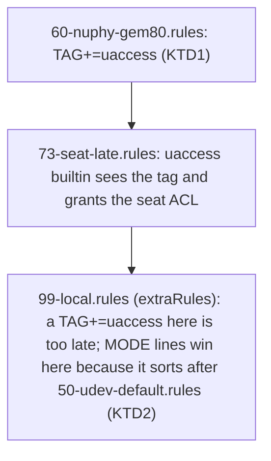

# NuPhy Gem80, STM32 DFU, and Sennheiser BTD udev Access - Plan

## Goal Capsule

- **Objective:** On the desktop, h82 configures and flashes the NuPhy Gem80 from a browser or `dfu-util` without root, and on both hosts the Sennheiser BTD 600/700 dongles work with `btd700ctl` without root.
- **Means:** The `uaccess` rules ship as a numbered rule file in `services.udev.packages`, and the `MODE` rules ship in `services.udev.extraRules` (KTD1, KTD2).
- **Authority hierarchy:** Issues [#51](https://github.com/hyperlapse122/nix-config/issues/51), [#52](https://github.com/hyperlapse122/nix-config/issues/52), and [#54](https://github.com/hyperlapse122/nix-config/issues/54) are authoritative for rule text, device IDs, and host scope. KTD1 overrides #51 and #52 on one point: the delivery mechanism, because their proposed `services.udev.extraRules` cannot meet their own acceptance criteria. `AGENTS.md` governs module placement and check conventions.
- **Stop conditions:** None. The change is additive and touches no boot, secret, or authentication path.
- **Execution profile:** Lightweight, code.
- **Who finishes and ships:** `ce-work` implements and verifies by build and repository check. Hardware confirmation on the desktop is a manual follow-up, reported separately from build evidence.

---

## Product Contract

### Summary

Add udev rules that give h82 access to the NuPhy Gem80 hidraw node (`19f5:3275`) and to any STM32 ROM DFU bootloader (`0483:df11`) on `MS-7D91`, and to the Sennheiser BTD 600 and BTD 700 dongles (`3542:3000`, `3542:3001`) on both hosts. A new repository check guards the rules against removal, misspelling, wrong ordering, and reaching the wrong host.

### Problem Frame

The user's legacy dotfiles carried all three rule sets. The flake carries none, so on the NixOS install the VIA/WebHID configurator, `dfu-util`, and `btd700ctl` each need root.

The rule text is settled; the delivery mechanism is the risk. NixOS writes `services.udev.extraRules` to `99-local.rules`, which udev applies after every other rule file. systemd's `73-seat-late.rules` runs the `uaccess` builtin only for devices already tagged `uaccess` when that file is evaluated. A `TAG+="uaccess"` line in `extraRules`, as issues #51 and #52 propose, therefore builds cleanly, passes any check that reads the option value, and grants nothing on real hardware.

### Requirements

**Gem80 and DFU access (MS-7D91 only)**

- R1. A NuPhy Gem80 hidraw node (`idVendor` `19f5`, `idProduct` `3275`) is tagged `uaccess` before the uaccess builtin runs, so the logged-in seat user gets access without root (issue #51).
- R2. A USB device in STM32 ROM DFU mode (`idVendor` `0483`, `idProduct` `df11`) is tagged `uaccess` the same way, so `dfu-util` runs without root (issue #52).
- R3. R1 and R2 reach `MS-7D91` and `MS-7D91-bootstrap` and neither ThinkPad configuration.

**Sennheiser dongle access (both hosts)**

- R4. The `usb` and `hidraw` nodes of the BTD 600 (`3542:3000`) and BTD 700 (`3542:3001`) get `MODE="0666"` (issue #54).
- R5. R4 reaches all four host configurations.

**Verification**

- R6. `nix fmt -- --ci`, `nix flake check`, and all four host builds pass.
- R7. A repository check reads the built udev rules directory and fails when a rule line is missing or altered, when a `uaccess` rule sits in a file applied at or after the uaccess builtin, when a Sennheiser `MODE` rule sits in a file applied before the one that sets systemd's default `MODE` for USB device nodes, or when a NuPhy rule appears on a ThinkPad configuration.

### Scope Boundaries

- **Outside scope:** the `gem80-rgbd` RGB daemon and its systemd user service.
- **Outside scope:** `hardware.keyboard.qmk.enable`, which installs the whole `qmk-udev-rules` package where the issues ask for two device IDs (KTD1).
- **Deferred to Follow-Up Work:** narrowing #54 from `MODE="0666"` to `TAG+="uaccess"` once hardware confirms `btd700ctl` works under a seat ACL (KTD4).

### Key Decisions

- **Provision the Gem80 and DFU rules on `MS-7D91` only.** Governs R3. (session-settled: user-directed — chosen over provisioning them on the ThinkPad or in a shared module: the hardware is desktop-only and issue #51 requires the ThinkPad configuration to stay unaffected.)
- **Provision only the bare access rules and omit the `gem80-rgbd` daemon and its user service.** Governs R1. (session-settled: user-directed — chosen over porting the daemon: issue #51 excludes it. The legacy rule also carried `TAG+="systemd"` and `ENV{SYSTEMD_USER_WANTS}` for that daemon, so both are dropped.)

---

## Planning Contract

### Key Technical Decisions

- KTD1. **Ship the `uaccess` rules (R1, R2) as one numbered rule file in `services.udev.packages`, `60-nuphy-gem80.rules`, not in `services.udev.extraRules`.** The prefix must sort before `73-seat-late.rules`; the legacy dotfiles named these rules `59-` and `60-`. nixpkgs' `nixos/modules/services/hardware/udev.nix` copies every package's `etc/udev/rules.d/*.rules` and `lib/udev/rules.d/*.rules` into the one `/etc/udev/rules.d` directory by basename, so a `pkgs.writeTextFile` package with a `/etc/udev/rules.d/60-...` destination reaches it. systemd 261.2's `73-seat-late.rules` carries `TAG=="uaccess|xaccess-*", ENV{MAJOR}!="", RUN{builtin}+="uaccess"`, and `tests/yubikey-fido.nix` already asserts the `60-` and `70-` files that hand a YubiKey to the seat user. `hardware.keyboard.qmk.enable` was rejected: it installs the whole `qmk-udev-rules` package where the issues ask for two device IDs.
- KTD2. **Ship the `MODE="0666"` rules (R4) in `services.udev.extraRules`, verbatim from issue #54.** `MODE` resolves to the last assignment across all rule files, and systemd's `50-udev-default.rules` sets `MODE="0664"` on every `usb_device` node, so these lines must sort after it, and the check asserts that (KTD5). `99-local.rules`, where `extraRules` lands, does. `modules/nixos/system/base.nix` already uses `extraRules` for the Logitech rule.
- KTD3. **Add two modules under `modules/nixos/hardware/`, imported from the host files rather than from `base.nix`.** `nuphy-gem80.nix` holds both KTD1 rules and is imported by `hosts/MS-7D91/default.nix` only. `sennheiser-btd.nix` holds the KTD2 rules and is imported by both host files. `AGENTS.md` keeps one concern per module and has each host file cherry-pick its modules, and `base.nix` is the host-agnostic module that already carries one device rule. The DFU rule sits in the Gem80 module because `0483:df11` is how the Gem80 presents in bootloader mode.
- KTD4. **Keep `MODE="0666"` for the BTD rules after one challenge.** The rule text is the issue's, copied from the rule the user already runs, and it was not weighed against `uaccess`. `uaccess` would hand the nodes only to the active seat user, while `0666` lets any local account or sandboxed process write to the dongle. It stays because the issue specifies it, the rules match only the two dongle IDs, and it is unverified that `btd700ctl` works under a seat ACL, for instance when run over SSH. Narrowing is deferred (Scope Boundaries).
- KTD5. **Guard the rules with one check, `udev-device-access`, that reads the built rules directory, `host.config.environment.etc."udev/rules.d".source`, on all four hosts.** It follows `tests/yubikey-fido.nix`. The design, in order of what each part catches:
  - Every rule is matched as a whole line (`grep -Fx`), so a partial edit fails.
  - Each `uaccess` rule must sit in a file whose name sorts before the first file that carries `RUN{builtin}+="uaccess"`. Names are compared in byte order (`LC_ALL=C`), which is the order udev applies rule files in, and never by a parsed numeric prefix: `9-` sorts after `73-`, and `060-` sorts before it. The anchor comes from the built directory, so a systemd renaming fails the check instead of silently invalidating a hard-coded `73-`. An absent anchor fails the ordering assertion instead of skipping it. This is the assertion that would have caught the issues' `extraRules` placement.
  - Each Sennheiser `MODE` line must sit in a file whose name sorts after the last file that carries systemd's default `SUBSYSTEM=="usb", ENV{DEVTYPE}=="usb_device", MODE="0664"`. `MODE` is decided by the last assignment, so a file placed before that default silently loses (KTD2). The anchor is derived from the built directory the same way.
  - Every host must carry a file with the uaccess builtin and a file with the USB default. They supply the two anchors and are the positive controls that stop the assertions, including the ThinkPad negative one, passing against an empty directory.
  - The ThinkPad hosts must carry neither NuPhy rule line. The assertion is an explicit `if grep ...; then fail; fi`, because a bare `! grep` is exempt from `set -e`.
  - The builder collects every failure before exiting, so one red build names every broken assertion.

  This applies the repository's checks discipline: assert the materialized output and not an option value, name the mutation that turns each assertion red, and include the destination in the claim (see Sources & Research).

### High-Level Technical Design

Rules are applied in file-name order, so where a line lives decides whether the tag matters:

### Assumptions

- The bootstrap variants carry the same rules as their production counterparts. Both host files import the modules unconditionally and nothing in the issues asks for bootstrap exclusion.
- Issue #54 names a common module and no host restriction, so the BTD rules go on both hosts.

---

## Implementation Units

### U1. Add the NuPhy Gem80 module and import it on MS-7D91

- **Goal:** Provision the R1 and R2 rules on the desktop only.
- **Requirements:** R1, R2, R3 (KTD1, KTD3)
- **Dependencies:** none
- **Files:** `modules/nixos/hardware/nuphy-gem80.nix` (new), `hosts/MS-7D91/default.nix`
- **Approach:**
  1. Declare one rule file in `services.udev.packages`, named `60-nuphy-gem80.rules`, holding the issue #51 and #52 rule lines verbatim.
  2. Comment why the rules do not use `services.udev.extraRules`: `99-local.rules` is applied after `73-seat-late.rules`, so the tag would grant nothing. Comment that the DFU match is generic to STM32 ROM DFU devices.
  3. Add the module to the `hosts/MS-7D91/default.nix` import list beside the other hardware modules. Do not touch the ThinkPad host file.
- **Patterns to follow:** `modules/nixos/hardware/yubikey.nix` for a small hardware module whose comment records a non-obvious udev constraint.
- **Test scenarios:** Test expectation: none -- declarative addition with no branching logic; U3's check reads the built rules directory for both hosts and proves it.
- **Verification:** The materialized rules directory of `MS-7D91` and `MS-7D91-bootstrap` holds `60-nuphy-gem80.rules` with both lines, and neither ThinkPad configuration holds them.

### U2. Add the Sennheiser BTD module and import it on both hosts

- **Goal:** Provision the R4 rules on all four configurations.
- **Requirements:** R4, R5 (KTD2, KTD3, KTD4)
- **Dependencies:** none
- **Files:** `modules/nixos/hardware/sennheiser-btd.nix` (new), `hosts/ThinkPad-X1-Carbon-Gen-11/default.nix`, `hosts/MS-7D91/default.nix`
- **Approach:**
  1. Set `services.udev.extraRules` to the four issue #54 lines verbatim, grouped as BTD 600 then BTD 700.
  2. Comment why the lines stay in `extraRules`: `MODE` is decided by the last assignment and `50-udev-default.rules` sets `0664` on every USB device node, so an early-numbered file would silently lose. Comment also that `0666` is deliberate per the issue with the narrowing recorded as follow-up (KTD4).
  3. Add the module to both host import lists.
- **Patterns to follow:** the Logitech rule in `modules/nixos/system/base.nix` for `extraRules` use; `tests/logitech-wakeup.nix` for exact-line assertions.
- **Test scenarios:** Test expectation: none -- declarative addition; U3's check asserts all four lines on all four hosts.
- **Verification:** The materialized rules directory of every host configuration carries the four lines.

### U3. Add and register the `udev-device-access` check

- **Goal:** Fail the build when a rule is missing, altered, ordered wrongly against the uaccess builtin or the USB default `MODE`, or present on the wrong host.
- **Requirements:** R3, R5, R7 (KTD5)
- **Dependencies:** U1, U2
- **Files:** `tests/udev-device-access.nix` (new), `flake.nix` (register beside `logitech-wakeup`)
- **Approach:**
  1. Use the `{ pkgs, self }:` interface and a header comment in the style of `tests/yubikey-fido.nix`, naming what the check reads and what it cannot see.
  2. Resolve the rules directory per host from `environment.etc."udev/rules.d".source`. Derive both ordering anchors from the built directory and compare file names in byte order, as KTD5 describes.
  3. Emit the assertions KTD5 lists, escaping every spliced value the way `tests/yubikey-fido.nix` does, and collect failures into one `failed` flag.
  4. Register `udev-device-access` in the `checks` attribute set of `flake.nix`.
- **Execution note:** Write the assertions with the mutation rounds below in mind, and run every round before trusting the check. Read the generated `buildCommand` of the built derivation once, to confirm no assertion interpolates a constant.
- **Patterns to follow:** `tests/yubikey-fido.nix` (materialized udev directory, collected failures), `tests/logitech-wakeup.nix` (per-host assert helper over all four hosts).
- **Test scenarios:**
  - Baseline: on the unmutated tree the check passes on all four hosts.
  - Move the two NuPhy lines from the rule file into `services.udev.extraRules` in `nuphy-gem80.nix` (the issues' original proposal). The check fails in the builder on the ordering assertion for `MS-7D91` and `MS-7D91-bootstrap`.
  - Rename the rule file to `80-nuphy-gem80.rules`. The check fails on the ordering assertion although both lines are present.
  - Rename the rule file to `nuphy-gem80.rules`, with no numeric prefix. The check fails on the ordering assertion because the name sorts after the anchor.
  - Rename the rule file to `9-nuphy-gem80.rules`. The check fails on the ordering assertion, because `9-` sorts after `73-` although the number 9 is below 73.
  - Rename the rule file to `060-nuphy-gem80.rules`. The check passes, because `060-` sorts before `73-` in byte order and udev applies it first. This control shows the comparison is not stricter than udev.
  - Rename the rule file to `73-zzz-nuphy-gem80.rules`, and then to `73-nuphy-gem80.rules`. The first fails and the second passes, which pins the boundary inside a shared prefix.
  - Add a test-only package file `50-test.rules` carrying `RUN{builtin}+="uaccess"` to the `MS-7D91` configuration. The anchor becomes `50-test.rules` and the check fails on the `60-` file, which proves the anchor is the first such file and is not fixed at `73-seat-late.rules`.
  - Move the four Sennheiser lines into a package file `40-sennheiser-btd.rules`. The check fails on all four hosts because the file sorts before `50-udev-default.rules`. Moving them to `55-sennheiser-btd.rules` passes.
  - Add a test-only package file `99-zzz-usb-default.rules` carrying the USB default `MODE` line. The check fails on the Sennheiser lines in `99-local.rules`, which proves the anchor is the last such file.
  - Remove every package file from a ThinkPad configuration's rules directory, by forcing `services.udev.packages` empty with `lib.mkForce` in its host file. The check fails on both missing-anchor messages, and the ThinkPad negative assertion does not pass silently against an empty directory. The forced list also drops `99-local.rules`, so the Sennheiser lines are reported missing in the same round.
  - Change `3275` to `3276` in the Gem80 rule. The check fails naming the missing line.
  - Import `nuphy-gem80.nix` from the ThinkPad host file. The check fails on the ThinkPad negative assertion for both ThinkPad configurations.
  - Drop `sennheiser-btd.nix` from one host file. The check fails naming only that host's two configurations.
  - Change one BTD `MODE="0666"` to `MODE="0660"`. The check fails naming the missing line.
  - Every red round is read from `nix log`: the failure must come from the builder with the assertion's own message. A round that dies in the evaluator proves nothing and does not count.
- **Verification:** The check passes on the unmutated tree, every mutation round above went red for its own reason and was restored, and `git diff` shows no mutation left behind.

### U4. Document the check and the hardware confirmations

- **Goal:** Record what the check proves, what it cannot, and the manual confirmations the desktop needs.
- **Requirements:** R6
- **Dependencies:** U3
- **Files:** `docs/verification.md`
- **Approach:**
  1. Add a `udev-device-access` entry to the repository-check paragraph in the style of its neighbours: what it reads (the built rules directory), what it asserts, and that it cannot see whether a device receives its ACL when plugged in.
  2. Add hardware checks, each naming the host. On `MS-7D91`: with the Gem80 plugged in, its hidraw node carries the `uaccess` tag and an ACL for h82 and the VIA configurator opens it without sudo; with the Gem80 in DFU mode, `dfu-util -l` (from an ad-hoc `nix shell`, since the repository does not install it) lists `0483:df11` as an ordinary user. On each host the dongle is used with (`MS-7D91`, `ThinkPad-X1-Carbon-Gen-11`): with a BTD dongle plugged in, its `usb` and `hidraw` nodes are mode `0666` and `btd700ctl` reaches it.
- **Test scenarios:** Test expectation: none -- documentation only.
- **Verification:** The entry names the check exactly as registered in `flake.nix`, and each hardware check names a host and an observable outcome.

---

## Verification Contract

| Command | Purpose |
| --- | --- |
| `nix fmt -- --ci` | Formatting check, no diffs |
| `nix flake check` | Runs every declared check, including `udev-device-access` |
| `nix build --no-link .#checks.x86_64-linux.udev-device-access` | The new check in isolation, and the target of each mutation round |
| `nix build --no-link .#nixosConfigurations.ThinkPad-X1-Carbon-Gen-11.config.system.build.toplevel` | Host build |
| `nix build --no-link .#nixosConfigurations.ThinkPad-X1-Carbon-Gen-11-bootstrap.config.system.build.toplevel` | Bootstrap host build |
| `nix build --no-link .#nixosConfigurations.MS-7D91.config.system.build.toplevel` | Host build |
| `nix build --no-link .#nixosConfigurations.MS-7D91-bootstrap.config.system.build.toplevel` | Bootstrap host build |

## Definition of Done

- All four host builds succeed, and `nix fmt -- --ci` and `nix flake check` pass.
- `udev-device-access` is registered in `flake.nix`, passes on the unmutated tree, and every U3 mutation round was run and read from `nix log` before commit.
- The two new modules exist under `modules/nixos/hardware/`, `nuphy-gem80.nix` is imported by `hosts/MS-7D91/default.nix` only, and `sennheiser-btd.nix` is imported by both host files.
- No mutation, experiment, or dead-end code remains in the diff.
- Hardware confirmation on the desktop is out of the automated scope. It stays a manual follow-up reported apart from build evidence, per `AGENTS.md` and `docs/verification.md`.

## Risks & Dependencies

- **KTD1 rests on reading rule files, not on a plugged-in device.** The ordering claim comes from `73-seat-late.rules` and the NixOS udev module source. The first hardware check in U4 confirms it; if the ACL is missing even from `60-nuphy-gem80.rules`, debug the match keys before trusting the rest.
- **`MODE="0666"` widens access to the BTD nodes.** KTD4 records why it stays and the deferred narrowing.
- **The DFU rule matches any STM32 ROM DFU device**, not only the Gem80. This follows the issue and the legacy rule; the module comment states it.

## Documentation Plan

`docs/verification.md` is covered by U4. The `extraRules` versus `uaccess` ordering trap is non-obvious and invisible to option-reading checks, so it warrants a `solutions/integration-issues` entry once the desktop hardware check confirms it, linked from `AGENTS.md` as that file directs.

## Sources & Research

- Issues [#51](https://github.com/hyperlapse122/nix-config/issues/51), [#52](https://github.com/hyperlapse122/nix-config/issues/52), [#54](https://github.com/hyperlapse122/nix-config/issues/54) — rule text, IDs, scope, acceptance criteria.
- Legacy dotfiles `system/linux/etc/udev/rules.d/59-nuphy-gem80-via.rules`, `60-stm32-dfu.rules`, `99-btd700.rules` in `hyperlapse122/dotfiles` — the rule text matches the issues; the Gem80 file also carries the daemon hooks dropped by the settled scope.
- nixpkgs `nixos/modules/services/hardware/udev.nix` at the locked revision — `extraRules` destination `99-local.rules`, and the package rule-directory copy loop behind KTD1.
- systemd 261.2 `lib/udev/rules.d/73-seat-late.rules` and `70-uaccess.rules` — where the uaccess builtin runs.
- `modules/nixos/system/base.nix` — the existing `extraRules` Logitech rule; `modules/nixos/hardware/yubikey.nix` and `tests/yubikey-fido.nix` — the existing `60-`/`70-` reliance and the materialized-directory check pattern.
- `tests/logitech-wakeup.nix`, `.compound-engineering/artifacts/plans/2026-09-23-0014-feat-logitech-wakeup-udev-plan.md` — the per-host assert pattern and the prior udev plan.
- `.compound-engineering/artifacts/solutions/best-practices/nix-check-reads-option-value-not-materialized-output.md`, `mutation-testing-reveals-decorative-nix-check-assertions.md`, `nix-check-assertion-on-unconditional-option-folds-to-a-constant.md`, `unguarded-derivation-interpolation-defeats-nix-check-mutation-testing.md`, `unanchored-grep-fragment-misses-destination-argument.md` — shape of KTD5.
