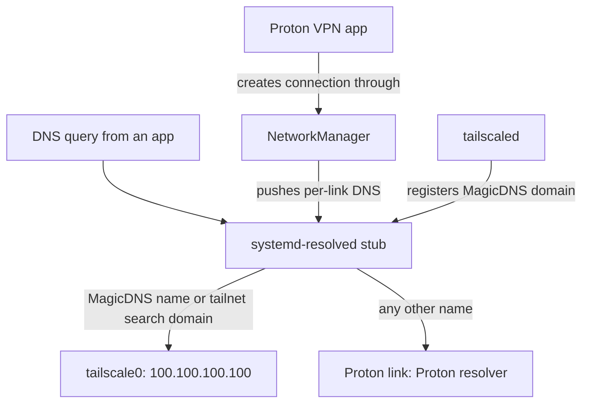

# Proton VPN with Tailscale Coexistence - Plan

## Goal Capsule

- **Objective:** On both `ThinkPad-X1-Carbon-Gen-11` and `MS-7D91`, the user can turn on Proton VPN when they need a secure connection or a Korean IP from abroad, and every Tailscale capability they rely on (Tailscale SSH, `MS-7D91` subnet routes, MagicDNS names) keeps working while it is on.
- **Means:** Install the official Proton VPN Linux app and move both hosts' DNS to split resolution through systemd-resolved (KTD1, KTD2).
- **Product authority:** Decided by the user in this `ce-brainstorm` conversation. Proton Pass and Proton Mail Bridge with KMail were part of the same request and are not active scope here. The Product Contract wins on behavior; the Planning Contract wins on mechanism.
- **Execution profile:** Nix configuration plus one static repository check and documentation. Repository evidence comes from `nix flake check` and the four host builds; runtime coexistence (R3-R9) is proven only on hardware.
- **Stop conditions:** Stop and report rather than improvise if a host build fails for a reason outside this change, or if a check assertion cannot be made to fail under its mutation. Never run `nixos-rebuild switch` as validation.
- **Who finishes:** `ce-work` implements and verifies U1-U4; the user runs the hardware checklist after the first production switch.
- **Open blockers:** None.

---

## Product Contract

**Product Contract preservation:** restructured, no scope change — Outstanding Questions resolved in place by planning (answers now live in the Planning Contract), and the Dependencies / Assumptions entries updated with research findings. R1-R10, A1-A4, F1, and AE1-AE5 are unchanged.

### Summary

Both hosts get the official Proton VPN app, used on demand for secure connections and for reaching Korean services from abroad. The base DNS and firewall setup changes so Tailscale SSH, subnet routes, and MagicDNS survive while Proton is connected. Coexistence is proven by a hardware checklist, not an automated check.

### Problem Frame

The user occasionally needs a trusted tunnel on untrusted networks, and a Korean exit IP when abroad. Tailscale is already wired on both hosts through `modules/nixos/services/tailscale.nix`: both accept routes, and `MS-7D91` advertises the home LANs and one office server as the only subnet router. A consumer VPN app takes the default route and the system DNS when it connects. Without preparation, that can break MagicDNS or the tailnet paths the user relies on every day, and on `MS-7D91` it touches the host that serves routes to every other tailnet device.

<!-- ce-section: work-relationships -->
### How This Work Fits Together

This plan covers Proton VPN and its coexistence with Tailscale. The broader Proton request is the current understanding, not a committed roadmap:

- Proton Pass (desktop app, browser integration): can proceed independently of this plan.
- Proton Mail Bridge with KMail: can proceed independently of this plan. Still to decide: how the Bridge login and keyring are handled.
  - Shares the Proton account login with this plan, but no configuration.

### Key Decisions

- **Proton VPN only; no Tailscale exit node for a Korean IP** (session-settled: user-directed — chosen over using `MS-7D91` as a Tailscale exit node, alone or alongside Proton: the user preferred one tool for both purposes and accepts that some Korean services may block Proton's datacenter IPs). Governs R1.
- **Both hosts** (session-settled: user-directed — chosen over `ThinkPad-X1-Carbon-Gen-11` only: the user wants the option on the desktop too, so the subnet router must keep working while Proton is on). Governs R1, R6.
- **Official Proton VPN app, not fixed WireGuard profiles** (session-settled: user-directed — chosen over sops-encrypted WireGuard profiles managed by NetworkManager: free server choice in the app's GUI outweighs repository control of the connection). Governs R1, R2.
- **No kill switch** (session-settled: user-directed — chosen over a kill switch with Tailscale exceptions, and over a kill switch that also cuts the tailnet: use is occasional, and the app's kill switch blocks Tailscale's own traffic). Governs R3.
- **Tailscale traffic goes through Proton, not around it** (session-settled: user-directed — chosen over routing `tailscaled`'s encrypted UDP around the tunnel: the local network sees only Proton; slower relayed tailnet paths are accepted). Governs R8.
- **Hardware checklist, no automated regression check** (session-settled: user-directed — chosen over a VM check that simulates Proton's routing and DNS footprint, and over a self-healing unit: simplest option; app-update regressions will surface only on hardware). Governs R10. Conflict call-out: planning adds a static repository check (KTD5) that reads this repository's own built DNS and package wiring, because `AGENTS.md` requires a regression check for new behavior. It never runs or simulates the app, so the rejected VM simulation stays rejected.
- **The DNS resolution change applies at all times, not only while Proton is on** (session-settled: user-approved — proposed with the consequence that everyday DNS on both hosts moves to the new setup; the user confirmed). Governs R7, R9.
- **Off by default, connected by hand.** The app does not auto-connect at boot or login; "occasional" use means the user turns it on. Governs R2.

### Actors

- A1. **User** — logs into the app once per host, picks a server, and turns the VPN on and off.
- A2. **Proton VPN app** — takes the default route and system DNS while connected.
- A3. **Tailscale on each host** — keeps the tailnet, Tailscale SSH, MagicDNS, and (on `MS-7D91`) subnet routing running underneath.
- A4. **Other tailnet devices** — reach `MS-7D91`'s advertised routes, whether or not Proton is on there.

### Requirements

**App and usage**

- R1. The official Proton VPN Linux app is installed on the production configurations of both hosts and can be started from the Plasma desktop; bootstrap configurations are unaffected.
- R2. The user signs in and chooses servers inside the app; the VPN stays off until the user connects it.
- R3. No kill switch is configured; if the Proton connection drops, traffic continues over the normal network and the tailnet stays up.

**Tailscale coexistence while Proton is connected**

- R4. Tailscale SSH to and from the connected host keeps working.
- R5. On `ThinkPad-X1-Carbon-Gen-11`, the routes advertised by `MS-7D91` (home LANs and the office server) stay reachable.
- R6. `MS-7D91` keeps serving its advertised subnet routes to other tailnet devices.
- R7. MagicDNS names keep resolving, and every other DNS query goes to Proton's resolver rather than the local network's.
- R8. Tailscale's own traffic is not excluded from the Proton tunnel; the guarantee is reachability, not direct peer-to-peer performance.

**Everyday networking and verification**

- R9. With Proton off, Wi-Fi profiles, DNS, and Tailscale behave as they did before this change.
- R10. `docs/verification.md` gains a hardware checklist covering R3 through R9 on both hosts, reported separately from VM evidence.

### Key Flows

- F1. **Connecting abroad** — Covers R2, R4, R5, R7, R8.
  - **Trigger:** The user, on a foreign or untrusted network, opens the app and connects to a server (for example, a Korean one).
  - **Actors:** A1, A2, A3.
  - **Steps:** The app brings up its tunnel and takes the default route and DNS → Tailscale keeps its routes and MagicDNS domain → the user browses through Proton and reaches tailnet hosts and subnet routes by name.
  - **Outcome:** Internet traffic leaves through Proton; the tailnet stays usable, possibly over a relay.

### Acceptance Examples

- AE1. **Covers R4, R5, R7, R8.** Given `ThinkPad-X1-Carbon-Gen-11` is connected to a Proton Korean server, When the user runs Tailscale SSH to `MS-7D91` by its MagicDNS name and opens a host on `192.168.10.0/24`, Then both succeed, even if the tailnet path is relayed.
- AE2. **Covers R6.** Given Proton is connected on `MS-7D91`, When `ThinkPad-X1-Carbon-Gen-11` reaches the office server through the advertised route, Then the connection succeeds.
- AE3. **Covers R3.** Given Proton is connected and the tunnel drops without the user disconnecting, When the user keeps browsing, Then traffic continues over the normal network and Tailscale SSH still works.
- AE4. **Covers R7.** Given Proton is connected, When a public hostname is resolved, Then the query goes to Proton's resolver and not to the Wi-Fi network's DNS server.
- AE5. **Covers R9.** Given Proton has never been started after the rebuild, When the host joins a provisioned Wi-Fi network, Then public names, MagicDNS names, and subnet routes all resolve and connect as before.

### Scope Boundaries

- Proton Pass and Proton Mail Bridge with KMail (separate brainstorms).
- A Tailscale exit node on `MS-7D91`; the no-default-route rule from the Tailscale plan stands.
- Declarative app settings, stored Proton credentials, or unattended login; each host signs in by hand once, and again after a reinstall.
- Kill switch, split tunneling, and NetShield configuration.
- An automated check simulating Proton's footprint, and a self-healing unit; both can be added if hardware verification finds regressions.

### Dependencies / Assumptions

- The app stores its session through the `org.freedesktop.secrets` Secret Service, which KWallet provides on Plasma 6. A missing provider shows up as repeated login prompts, not a build error, so the hardware checklist confirms it.
- Tailscale's policy routing takes precedence over the default route the app installs. This is expected Tailscale behavior on Linux; R5 and R6 depend on it and the hardware checklist confirms it. No source validates a subnet router running a full-tunnel consumer VPN end to end, so `MS-7D91` gets its own checklist items.
- A Proton account with VPN access exists.

### Outstanding Questions

**Deferred to Implementation**

- Whether the app's IPv6 leak protection catches Tailscale's IPv6 traffic. No source settles it; the hardware checklist tests it, and turning IPv6 leak protection off in the app is the fallback (KTD6).

### Sources / Research

- `modules/nixos/services/tailscale.nix` — current Tailscale flags (`--ssh`, `--accept-routes`) and routing-feature settings.
- `hosts/MS-7D91/default.nix`, `hosts/ThinkPad-X1-Carbon-Gen-11/default.nix` — Tailscale enabled only outside bootstrap; `MS-7D91` advertises routes.
- `modules/nixos/system/base.nix`, `modules/nixos/wifi.nix` — NetworkManager and Wi-Fi provisioning that R9 must not regress. No module enables `services.resolved` (evaluates `false` on both hosts), and no Tailscale DNS flags are set.
- The locked nixpkgs provides the app as `proton-vpn` (4.16.5).
- `.compound-engineering/artifacts/plans/2026-09-23-1708-feat-tailscale-firewall-networking-plan.md` — Tailscale product contract, including the no-default-route rule (R5) and route acceptance on the laptop (R9).
- `docs/verification.md` — home for the hardware checklist in R10.

---

## Planning Contract

### Key Technical Decisions

- KTD1. **One new module, `modules/nixos/services/proton-vpn.nix`, behind `my.protonVpn.enable`.** It mirrors `modules/nixos/services/tailscale.nix`: both hosts import it and set it to `!config.my.bootstrap`, so bootstrap configurations keep today's networking. The app goes into `environment.systemPackages`, not Home Manager, because `home/h82/default.nix` applies to all four configurations including bootstrap. Covers R1.
- KTD2. **systemd-resolved owns DNS, enabled from the same module.** Enabling `services.resolved` makes nixpkgs switch NetworkManager to its `systemd-resolved` DNS backend and drop resolvconf, and it is the DNS mode Tailscale's Linux docs recommend. Per-link routing domains then send MagicDNS names to `tailscale0` and everything else to whichever link holds the default DNS route, which is Proton's while it is connected. DNS lives in the Proton module rather than `base.nix` because Proton is the reason for it and bootstrap must stay unchanged; a comment states that constraint. Covers R7, R9, and implements the user-approved Key Decision on always-on DNS.
- KTD3. **No Tailscale DNS flags are added.** Tailscale detects resolved and registers MagicDNS on `tailscale0` by itself. The locked Tailscale is 1.102.4, past the 1.98.0/1.98.1 MagicDNS regression on NixOS (nixpkgs#520715). Covers R7.
- KTD4. **Reverse-path filtering stays at the NixOS default, `loose`, and the check pins it.** Both hosts already evaluate to `loose` with no repository override; `strict` would drop replies that arrive on a different interface from the one the default route names. Covers R4, R5, R6.
- KTD5. **A static check, `tests/proton-vpn.nix`, reads the built configurations.** It asserts on materialized output (rendered NetworkManager configuration, the `/etc/resolv.conf` entry, systemd unit wiring, the system path, the firewall script) rather than option values, per `.compound-engineering/artifacts/solutions/best-practices/nix-check-reads-option-value-not-materialized-output.md`. Each assertion must fail under a mutation that removes what it guards. It never runs or simulates the app (see the conflict call-out on the hardware-checklist Key Decision). Covers R1, R9.
- KTD6. **The NetworkManager OpenVPN plugin is added; kill switch, IPv6 leak protection, and split tunneling stay app-side.** nixpkgs no longer ships default NetworkManager VPN plugins, so the app's OpenVPN protocol fails without `networkmanager-openvpn`, and OpenVPN over TCP is the fallback when a network blocks WireGuard's UDP. App settings are not declarative (Scope Boundaries), so the checklist confirms the kill switch is off and tests IPv6 leak protection; turning it off in the app is the fix if it breaks Tailscale IPv6. Covers R2, R3.

### High-Level Technical Design

DNS routing while Proton is connected, as KTD2 intends it. Resolved sends each query to the link with the most specific matching routing domain; with Proton off, the Wi-Fi or Ethernet link takes Proton's place.

### Assumptions

- The app's NetworkManager connection claims the default DNS route in resolved, so non-tailnet queries go to Proton while it is connected. The checklist item for AE4 confirms it.
- NetworkManager holds no independent DNS authority once resolved is enabled, unlike the Powerdevil and logind split in `.compound-engineering/artifacts/solutions/integration-issues/kde-powerdevil-overrides-logind-lid-switch-settings.md`. The check confirms the rendered backend; the checklist confirms runtime behavior with `resolvectl status`.
- Existing VM tests (`tests/wifi-provisioning.nix`, `tests/tailscale-provisioning.nix`) build their own nodes without `modules/nixos/system/base.nix` or the new module, so they are unaffected.

### Sequencing

U1, then U2 (hosts import the module), then U3 (it reads U2's host wiring). U4 can be written alongside U3.

---

## Implementation Units

### U1. Proton VPN module with resolved DNS

**Goal:** Provide `my.protonVpn.enable`, which installs the app and the OpenVPN plugin and switches DNS to resolved.

**Requirements:** R1, R2, R3, R7, R9; KTD1, KTD2, KTD3, KTD4, KTD6.

**Dependencies:** None.

**Files:**

- Create `modules/nixos/services/proton-vpn.nix`.

**Approach:**

1. Declare `options.my.protonVpn.enable` with `lib.mkEnableOption`, as `modules/nixos/services/tailscale.nix` does.
2. Under `lib.mkIf cfg.enable`, add `pkgs.proton-vpn` to `environment.systemPackages`, not the deprecated `protonvpn-gui` alias.
3. Add `pkgs.networkmanager-openvpn` to `networking.networkmanager.plugins`.
4. Set `services.resolved.enable = true`, using the current `services.resolved.settings.Resolve.*` names if any setting is touched. Leave NetworkManager's DNS backend to the resolved module and do not set `networking.firewall.checkReversePath` (KTD4).
5. Add one comment explaining why DNS lives here: split DNS for Tailscale coexistence, kept off bootstrap.

**Patterns to follow:** `modules/nixos/services/tailscale.nix` and `modules/nixos/services/podman.nix` for option shape and the `cfg` binding.

**Test scenarios:** Test expectation: none -- configuration module; U3 asserts on its built output.

**Verification:** A host with the option on builds, and one with it off renders what it rendered before.

### U2. Host wiring

**Goal:** Both production hosts enable the module; bootstrap variants do not.

**Requirements:** R1; KTD1.

**Dependencies:** U1.

**Files:**

- Modify `hosts/ThinkPad-X1-Carbon-Gen-11/default.nix`.
- Modify `hosts/MS-7D91/default.nix`.

**Approach:**

1. Add `../../modules/nixos/services/proton-vpn.nix` to each host's imports next to the Tailscale module.
2. Set `config.my.protonVpn.enable = !config.my.bootstrap;` beside the matching `my.tailscale.enable` line.

**Patterns to follow:** The existing `config.my.tailscale.enable = !config.my.bootstrap;` lines.

**Test scenarios:** Test expectation: none -- host wiring; U3 asserts on its result for all four configurations.

**Verification:** All four host builds listed in `AGENTS.md` succeed.

### U3. Static check `proton-vpn`

**Goal:** Guard the repository's own Proton and DNS wiring on all four configurations.

**Requirements:** R1, R4, R5, R6, R9; KTD2, KTD4, KTD5, KTD6.

**Dependencies:** U2.

**Files:**

- Create `tests/proton-vpn.nix`.
- Modify `flake.nix` to register `proton-vpn` beside `kernel-sysctl`.

**Approach:**

1. Follow `tests/kernel-sysctl.nix`'s shape (a `runCommand` over `self.nixosConfigurations`), but collect every failure in one build as `tests/yubikey-fido.nix` and `tests/nix-cleanup.nix` do.
2. Read built artifacts: the system path's `bin/protonvpn-app` and `share/applications/proton.vpn.app.gtk.desktop`, the materialized NetworkManager configuration's `dns=` line and VPN plugin entries, the `/etc/resolv.conf` entry's target, the `systemd-resolved.service` wiring in the built system, and the firewall start script's reverse-path rule.
3. Compare against independent literals, never values read from the options under test, so no assertion folds to a constant (`.compound-engineering/artifacts/solutions/best-practices/nix-check-assertion-on-unconditional-option-folds-to-a-constant.md`).
4. Guard every interpolated path so a missing attribute fails the check with a message instead of an evaluation error (`.compound-engineering/artifacts/solutions/best-practices/unguarded-derivation-interpolation-defeats-nix-check-mutation-testing.md`).

**Execution note:** Mutation-test each assertion before trusting it, per `.compound-engineering/artifacts/solutions/best-practices/mutation-testing-reveals-decorative-nix-check-assertions.md`, and record which mutation each assertion caught.

**Test scenarios:**

- On `ThinkPad-X1-Carbon-Gen-11` and `MS-7D91`, the system path ships `bin/protonvpn-app` and the app's desktop entry.
- On both production hosts, the rendered NetworkManager configuration names `systemd-resolved` as its DNS backend and `/etc/resolv.conf` points at resolved's stub file.
- On both production hosts, `systemd-resolved.service` is wanted by the built system, not merely rendered.
- On both production hosts, the NetworkManager VPN plugins include the OpenVPN plugin.
- On all four configurations, the firewall's reverse-path rule is `loose`, never `strict`.
- On both bootstrap configurations, no Proton item appears and DNS is not resolved-backed. This negative case can pass vacuously, so it runs only alongside the positive production assertions.
- Mutation: turning `my.protonVpn.enable` off on one production host fails the package, DNS, unit, and plugin assertions for that host by name.
- Mutation: setting `networking.firewall.checkReversePath = "strict"` on one host fails the reverse-path assertion.
- Mutation: removing the OpenVPN plugin line from U1 fails only the plugin assertion.

**Verification:** `nix flake check` passes, and each listed mutation turns the check red with a message naming the host and the missing item.

### U4. Verification documentation

**Goal:** Document the new check and the hardware checklist that proves R3-R9.

**Requirements:** R10; covers F1 and AE1-AE5.

**Dependencies:** U3 for the check description.

**Files:**

- Modify `docs/verification.md`.

**Approach:**

1. Add sentences for `proton-vpn` to the "Repository checks" paragraph in the style of the `kernel-sysctl` entry, stating what it reads and that it cannot see runtime DNS or routing.
2. Add `- [ ]` items under "Hardware checks after installation", naming the host where it matters:
   - The app launches from the Plasma launcher, signs in, and stays signed in after logging out and back in, which confirms the Secret Service provider.
   - The app's kill switch and auto-connect are off (R2, R3).
   - AE1 on the ThinkPad, with `resolvectl status` showing the MagicDNS domain on `tailscale0` and the default DNS route on Proton's link (R7).
   - AE4: a public name resolves through Proton's resolver, not the Wi-Fi's. If the Wi-Fi link still receives public queries, record R7 as unmet and report it; the fix is follow-up work.
   - R8 on each host, over WireGuard and again over OpenVPN: record `ip rule show` and `ip route get <a DERP server's public IP> mark 0x80000`, and confirm the output interface is Proton's tunnel rather than the physical link. If either protocol sends Tailscale's traffic around the tunnel, record R8 as unmet for that protocol and report it.
   - AE2 with Proton connected on `MS-7D91`, with `ip rule show` recorded there.
   - AE3: stopping the tunnel without disconnecting in the app leaves browsing and Tailscale SSH working.
   - `tailscale ping` to an IPv6 tailnet address before and after connecting; if it fails only while connected, turn off IPv6 leak protection in the app and record the result (KTD6).
   - AE5 on each host before Proton is first started.
   - An OpenVPN connection chosen in the app connects (KTD6).
3. Keep the markdown lint-clean; `markdown-lint` runs over every doc edit.

**Test scenarios:** Test expectation: none -- documentation only; `markdown-lint` in `nix flake check` covers its form.

**Verification:** `nix flake check` passes including `markdown-lint`, and every item in R3-R9 and AE1-AE5 maps to at least one checklist entry.

---

## Verification Contract

| Gate | Command or evidence | Applies to |
| --- | --- | --- |
| Formatting | `nix fmt -- --ci` | U1, U2, U3 |
| Declared checks | `nix flake check`, including `proton-vpn` and `markdown-lint` | U1-U4 |
| Host builds | The four `nix build --no-link .#nixosConfigurations.<host>.config.system.build.toplevel` commands in `AGENTS.md` | U1, U2 |
| Check strength | Each U3 mutation turns the check red, then is reverted | U3 |
| Runtime coexistence | Hardware checklist in `docs/verification.md`, reported separately from build and VM evidence | R3-R9, after merge |

---

## Definition of Done

- U1-U4 are implemented and every repository gate in the Verification Contract passes.
- The PR reports the U3 mutation results and states that the hardware checklist has not yet been run.
- Bootstrap configurations render no Proton or resolved changes.
- No code from abandoned attempts remains in the diff.
