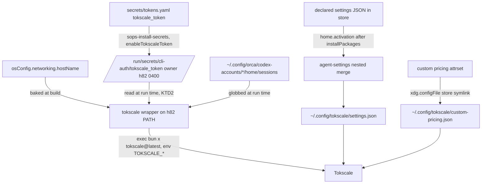

# Tokscale Migration - Plan

## Goal Capsule

- **Objective:** On both machines, h82 runs `tokscale` from any shell and gets token-usage reports that cover Orca's Codex sessions, carry the machine's name, use the declared display preferences and custom prices, and are authenticated with the Tokscale API token, all without a manual login step.
- **Means:** A packaged wrapper around `bun x tokscale@latest` that reads an opt-in SOPS secret at run time, plus a Home Manager module that merges declared settings and deploys custom pricing (KTD1-KTD6, issue #41).
- **Authority:** This plan, then `AGENTS.md`, then `secrets/README.md` and the conventions of `modules/nixos/system/secrets.nix`, `scripts/agent-settings`, and `home/h82/agents/claude.nix`.
- **Open blockers:** None. The encrypted `secrets/tokens.yaml` in this worktree already carries `tokscale_token`, uncommitted, and ships with U2.
- **Stop conditions:** Stop if sops-nix build-time validation rejects `tokscale_token` from the committed `secrets/tokens.yaml`, or if any of the four host builds breaks.
- **Execution profile:** A Python helper extension, a bash wrapper with its package, a Home Manager module, a NixOS option, repository checks, and docs. No hardware installation and no `nixos-rebuild switch`.
- **Finishes the work:** `ce-work` implements and verifies with `nix fmt -- --ci`, `nix flake check`, and the four host builds. The user rebuilds and runs the `docs/verification.md` hardware items.

---

## Product Contract

Product Contract preservation: changed: R8, AE2 — sops-nix validates every declared key at build time, so "token not provisioned" is expressed as the opt-in flag being off rather than as a missing key under a declared secret. Outstanding Questions resolved in place as KTD2, KTD4, and KTD5.

### Summary

Install a `tokscale` wrapper for h82 on both hosts that runs the latest Tokscale through `bun`, discovers Orca Codex session directories, names the device, and supplies the API token from SOPS on each run. Reassert five declared display preferences in Tokscale's settings file while leaving everything Tokscale writes itself untouched, and deploy the custom model prices as declared.

### Problem Frame

Tokscale was configured by chezmoi in `hyperlapse122/dotfiles`: a wrapper script, `settings.json`, `custom-pricing.json`, and an onchange script that read the token from 1Password and ran `tokscale login --token`. None of that exists on the NixOS hosts. Only the runtime prerequisites are present: `bun` in h82's packages and `programs.nix-ld`, so `bunx tokscale@latest` works (`docs/verification.md` checklist). Today a bare `bunx` run on this host has no credentials, no Codex session discovery, no device name, and settings that have drifted from the dotfiles values.

The dotfiles auth path does not carry over. `op` only authorizes inside a desktop session (`docs/provisioning.md`), and a rebuild must succeed without a YubiKey or 1Password session (`docs/verification.md`).

### Key Decisions

- **SOPS is the token source.** The token lives in `secrets/tokens.yaml` beside the gh/glab tokens, so a rebuild with no 1Password session still provisions it. Governs R6. (session-settled: user-directed — chosen over a run-time 1Password `op read` and a one-time manual `tokscale login`: rebuilds must not depend on a 1Password session or a manual step.)
- **The wrapper injects the token at run time; no credentials file is written.** Tokscale reads `TOKSCALE_API_TOKEN` (confirmed in the 4.17.0 binary), so nothing couples the repository to Tokscale's private credentials format, and a rotated token takes effect on the next run. The accepted cost is that calls bypassing the wrapper are unauthenticated. Governs R6, R7. (session-settled: user-directed — chosen over publishing `~/.config/tokscale/credentials.json` at activation and over doing both: the unpinned version could change the file format silently.)
- **The wrapper runs `tokscale@latest`.** This matches the dotfiles behavior and costs no version-bump upkeep. The accepted costs are no reproducibility and a registry lookup whenever `bun` resolves the latest tag. Governs R2. (session-settled: user-directed — chosen over a pinned `tokscale@x.y.z` bumped by commit: always-current parsers and prices outweigh reproducibility for a reporting tool.)
- **Only declared preference keys are reasserted.** Tokscale rewrites its own settings file at run time, adding keys and changing values from its TUI. Governs R9, R10. (session-settled: user-directed — chosen over seeding the file once and over Home Manager owning the whole file: seeding drifts, and full ownership breaks Tokscale's own writes.)
- **The declared set is five preferences at the dotfiles values.** Keys that only restate Tokscale defaults, and runtime state such as `autosubmit.lastRunAtMs`, stay undeclared so rebuilds never overwrite state. Governs R9. (session-settled: user-directed — chosen over keeping the host's current `autoRefreshMs` of 60000 and over declaring the whole dotfiles file minus runtime fields.)
- **The device name is the host name, not the DMI product name.** The dotfiles wrapper read `/sys/devices/virtual/dmi/id/product_name`, which on the ThinkPad is the machine-type code `21HMCTO1WW`. Governs R5. (session-settled: user-directed — chosen over keeping the DMI product name for parity with devices already submitted: the host names match this flake and read clearly on both machines.)
- **The token stays independent of the gh/glab publication.** `scripts/publish-cli-auth` fails as a whole when any token it reads is missing, so tying Tokscale to it would let a Tokscale problem block gh and glab. Governs R8.

### Requirements

**Wrapper**

- R1. Both production hosts and both bootstrap variants put an executable `tokscale` on h82's `PATH`, managed by this repository.
- R2. The wrapper runs `bun x tokscale@latest` with all arguments passed through unchanged and Tokscale's exit status preserved.
- R3. When `bun` is not on `PATH`, the wrapper prints a one-line error naming `bun` and exits with status 127.
- R4. The wrapper appends a `codex:<dir>` entry to `TOKSCALE_EXTRA_DIRS` for every existing directory matching `~/.config/orca/codex-accounts/*/home/sessions`, keeping any value the caller already set.
- R5. The wrapper sets `TOKSCALE_DEVICE_NAME` to the host name, so reports read `ThinkPad-X1-Carbon-Gen-11` on the laptop and `MS-7D91` on the desktop.

**Authentication**

- R6. On the production hosts, the Tokscale API token comes from `tokscale_token` in `secrets/tokens.yaml`, decrypted by the existing sops-nix setup and readable by h82 only.
- R7. The wrapper passes the token to Tokscale as `TOKSCALE_API_TOKEN` when it is available, without the token appearing in process arguments, logs, the Nix store, or any file under `~/.config/tokscale/`.
- R8. When no token secret is provisioned (a bootstrap host, or the opt-in flag off), the rebuild still succeeds, gh/glab publication is unaffected, and the wrapper still runs Tokscale unauthenticated for local reports.

**Configuration files**

- R9. Tokscale's settings file carries these declared values after each rebuild that produces a new Home Manager generation: `colorPalette = "blue"`, `autoRefreshEnabled = true`, `autoRefreshMs = 30000`, `scanner.bucketTimezone = "Asia/Seoul"`, `autosubmit.enabled = false`.
- R10. Every settings key and value outside that declared set, including runtime state and keys added by newer Tokscale releases, survives activation unchanged, including sibling keys inside `scanner` and `autosubmit`.
- R11. `~/.config/tokscale/custom-pricing.json` holds the dotfiles custom pricing verbatim: its `$schema` and the `gemini-3.1-pro` and `claude-fable-5-1` entries.

**Verification**

- R12. Repository checks registered in `flake.nix` guard R2-R5, R7-R8, and R9-R11, following the repository's mutation-testing guidance for check assertions.
- R13. `docs/verification.md` gains hardware checklist items for running the wrapper authenticated, Codex session discovery, the device name, and settings reassertion. The settings item changes a declared value in the repository in the same rebuild, because activation does not re-run when the Home Manager generation is unchanged.

### Acceptance Examples

- AE1. **Covers R6, R7.** **Given** a production host with `tokscale_token` decrypted, **when** h82 runs `tokscale submit` through the wrapper, **then** the submission is accepted without a "Not logged in" error and no `credentials.json` exists.
- AE2. **Covers R8.** **Given** a bootstrap host, or a production host with the Tokscale token flag off, **when** the system is rebuilt and h82 runs `tokscale`, **then** the rebuild succeeds, `gh auth status` still passes on the production host, and Tokscale shows local usage while reporting that it is not logged in.
- AE3. **Covers R9, R10.** **Given** h82 changed the refresh interval to 60000 and light mode in the TUI, **when** the next rebuild produces a new Home Manager generation, **then** `autoRefreshMs` is 30000 again and `tuiLightMode`, `usage`, and `autosubmit.lastRunAtMs` keep their values.
- AE4. **Covers R4.** **Given** no `~/.config/orca/codex-accounts` directory exists, as on the ThinkPad today, **when** h82 runs `tokscale`, **then** the wrapper passes the caller's `TOKSCALE_EXTRA_DIRS` through unchanged and does not fail.

### Scope Boundaries

- Enabling autosubmit or Tokscale's OS scheduler is out of scope. The scheduler would run Tokscale outside the wrapper, so turning it on needs a new token path.
- Pinning or packaging Tokscale in Nix is out of scope, per the `@latest` decision.
- A `credentials.json` from a manual `tokscale login` is neither created nor removed. Its precedence against `TOKSCALE_API_TOKEN` is Tokscale's behavior.
- Relocating Tokscale's configuration through `TOKSCALE_CONFIG_DIR` or `XDG_CONFIG_HOME` is out of scope. The managed files live under `~/.config/tokscale/`, and a caller who points Tokscale elsewhere opts out of them.
- Non-NixOS hosts and other operating systems are out of scope, per `AGENTS.md`.

### Dependencies / Assumptions

- `secrets/tokens.yaml` in this worktree carries `tokscale_token`, encrypted to both hosts' recipients. The change must be committed with the implementation.
- Tokscale only reads `custom-pricing.json` and never rewrites it. This is unverified. If Tokscale writes it, the file needs the same treatment as settings (R10).
- `TOKSCALE_API_TOKEN`, `TOKSCALE_EXTRA_DIRS`, and `TOKSCALE_DEVICE_NAME` remain supported by future `@latest` releases. All three appear in the 4.17.0 binary.
- The bootstrap configurations set `my.cliAuth.enable` to false (`hosts/*/default.nix`), so they never decrypt `tokens.yaml`. R8 covers that case.

### Sources / Research

- Dotfiles sources: `home/dot_config/tokscale/settings.json`, `home/dot_config/tokscale/custom-pricing.json`, `home/dot_local/share/chezmoi-command-sources/private_executable_tokscale.tmpl`, and `home/.chezmoiscripts/10-auth/run_onchange_after_auth-tokscale.sh.tmpl` in `hyperlapse122/dotfiles`.
- `@tokscale/cli-linux-x64-gnu` 4.17.0 binary strings: "Not logged in. Run `tokscale login` or set TOKSCALE_API_TOKEN.", plus `TOKSCALE_EXTRA_DIRS`, `TOKSCALE_DEVICE_NAME`, and `TOKSCALE_CONFIG_DIR`.
- `modules/nixos/system/secrets.nix` and `scripts/publish-cli-auth`: the existing SOPS token path and its all-or-nothing publication.
- `home/h82/agents/claude.nix` and `scripts/agent-settings`: the declared-key merge pattern and its scalar-only limit.
- `.compound-engineering/artifacts/solutions/best-practices/home-manager-activation-does-not-run-on-every-rebuild.md`: constrains the wording of R9 and R13.

---

## Planning Contract

### Key Technical Decisions

- KTD1. **The token secret is an opt-in `my.cliAuth.enableTokscaleToken` flag, off by default, turned on in both `hosts/*/default.nix`.** sops-nix's `validateSopsFiles` checks every declared key against `tokens.yaml` at build time, and a missing key at run time fails the whole `sops-install-secrets` unit, which skips gh/glab publication. The flag mirrors `enableDockerToken` (`modules/nixos/system/secrets.nix:83-87,140`) and keeps the existing VM fixtures, whose fake `tokens.yaml` has no `tokscale_token` (`tests/auth-provisioning.nix:15`, `tests/podman-registry-auth.nix:15`), valid without edits. The secret joins the `cli-auth/` set with `owner = "h82"` and `mode = "0400"`, but `publish-cli-auth` never reads it. Governs R6, R8.
- KTD2. **The wrapper reads `/run/secrets/cli-auth/tokscale_token` itself, the way `docker-credential-sops` reads `docker_token`.** A missing, unreadable, empty, or whitespace-bearing file means "no token": the wrapper runs unauthenticated and prints nothing about the file. The token reaches Tokscale only through the environment of the exec'd process, which is visible to the same user through `/proc/<pid>/environ`. That is accepted on a single-user workstation and matches what `TOKSCALE_API_TOKEN` implies. Implements R6-R8 under the second product Key Decision.
- KTD3. **A non-empty `TOKSCALE_API_TOKEN` already exported by the caller wins over the SOPS token.** This lets h82 test another account without editing secrets, and it matches how the wrapper keeps a caller's `TOKSCALE_EXTRA_DIRS` (R4). Governs R7.
- KTD4. **The host name is baked into the packaged wrapper at build time from `osConfig.networking.hostName`.** A build-time value is assertable per host in a check. A runtime `uname -n` needs a stub and can drift from the flake's host name. Bootstrap variants share their production host name (`modules/nixos/system/base.nix:67-70`). Implements R5 under the device-name Key Decision.
- KTD5. **`scripts/agent-settings` gains an explicit nested-path assignment in the declared document, leaving the flat `set` contract untouched.** A declared entry names its path as a list of keys, so no key containing a dot is ever split. Missing intermediate objects are created. An intermediate that exists but is not an object is refused before anything is written. Values stay scalars. Today a dotted key would be written silently as a literal top-level key (`scripts/agent-settings:66-71,152`), which the new contract must make impossible to confuse with a path. Implements R9, R10.
- KTD6. **The wrapper is a source script under `scripts/` packaged with placeholder substitution, following `packages/nix-tools.nix` and the `nr` check.** It resolves `bun` from `PATH` at run time rather than through `runtimeInputs`, so the exit-127 path in R3 stays reachable. It ends in `exec`, so signals and the exit status reach Tokscale directly (R2). A shell test drives it with a stubbed `bun` that records its arguments and environment. Implements R1-R5, R7.
- KTD7. **The settings activation entry follows `claudeSettings`: it runs after `installPackages` and does not swallow the merger's exit status.** A merge refusal (malformed JSON, a symlinked file, a non-object `scanner`, or three compare-and-swap collisions with a running TUI) fails activation loudly with the `Tokscale` label rather than leaving drift unreported. Implements R9, R10.
- KTD8. **`custom-pricing.json` is a Home Manager store symlink under `xdg.configFile`, rendered from a Nix attribute set.** That follows the read-only Gemini settings file rendered with `home.file.".gemini/settings.json".text` in `home/h82/agents/gemini.nix:42`. It rests on the read-only assumption in Dependencies / Assumptions. If Tokscale turns out to rewrite it, the file moves to the KTD5 merge. Implements R11.
- KTD9. **A Codex sessions path that contains a comma is skipped.** `TOKSCALE_EXTRA_DIRS` is comma-separated, so such a path would split into two bogus entries. Orca's account directory names do not contain commas today, so this is a guard, not a feature. Implements R4.

### High-Level Technical Design

Where each managed piece lands, and who reads it:



The wrapper's token decision, as directional pseudo-code:

```text
if caller exported a non-empty TOKSCALE_API_TOKEN: keep it
elif token file is readable and holds one non-empty, whitespace-free line: export it
else: unset TOKSCALE_API_TOKEN and run unauthenticated
```

### Assumptions

- Declaring `enableTokscaleToken = true` on both production hosts is safe because the committed `secrets/tokens.yaml` carries the key. A future rotation that drops the key fails the build, which is the intended loud failure.
- `bun x tokscale@latest` behaves the same when exec'd from the wrapper as when run by hand, so the check never needs to run Tokscale itself.
- Orca 1.4.206 also keeps a shared Codex home at `~/.config/orca/codex-runtime-home/home` and backfills managed sessions into `~/.codex/sessions`, which Tokscale scans by default. Whether R4's account-home glob misses sessions or double-counts hardlinked rollouts is unverified on this host, which has no Codex sessions yet. The U5 hardware item checks it.

### Sequencing

U1 and U2 are independent. U3 depends on the token path from U2 only as a baked constant, so it can land in parallel. U4 needs U1 and U3. U5 documents the finished behavior last.

---

## Implementation Units

### U1. Nested-path assignment in agent-settings

**Goal:** Let the settings merger reassert scalar values at nested paths while preserving sibling keys, without changing its flat contract.

**Requirements:** R9, R10; KTD5.

**Dependencies:** None.

**Files:**
- `scripts/agent-settings`
- `tests/test_agent_settings.py`
- `flake.nix` (the `agent-settings` check's packaged-binary run)

**Approach:**
1. Add an optional declared field that lists nested assignments as an explicit key path plus a scalar value, validated alongside `set` and `remove`.
2. Refuse, before any write: an empty path, a non-string path segment, a non-scalar value, a path whose first key is also in `set` or `remove`, and an existing intermediate node that is not an object.
3. Apply nested assignments after the flat `set` and `remove` within the same compare-and-swap attempt, creating missing intermediate objects.
4. Keep the existing idempotence behavior: an unchanged result only tightens the mode.

**Patterns to follow:** The existing `declaration()` validation and `merge` loop in `scripts/agent-settings`. The divergent fixture discipline in `tests/test_agent_settings.py:28-46`.

**Test scenarios:**
- A seeded file with `scanner = {"opencodeDbPaths": ["x"], "bucketTimezone": "UTC"}` and a declared path `scanner.bucketTimezone = "Asia/Seoul"` ends with the new timezone and `opencodeDbPaths` unchanged.
- A seeded file with no `autosubmit` key gains `{"autosubmit": {"enabled": false}}` and nothing else.
- A seeded `autosubmit` object carrying `lastRunAtMs` and `lastError` keeps both after `autosubmit.enabled` is reasserted.
- A seeded `scanner = "flat"` string is refused with a message naming the path, and the file is byte-identical afterwards.
- A top-level key literally named `scanner.bucketTimezone` is neither read nor written by a nested assignment.
- A declared nested value that is an object or a list is refused.
- A path that collides with a flat `set` key is refused.
- A second run with no drift leaves the file's inode and mtime unchanged.
- A concurrent writer that changes `scanner` between snapshot and replace triggers a retry that preserves the writer's sibling keys.
- The existing Claude and Gemini flat declarations still produce identical output.

**Verification:** The `agent-settings` check passes, and it fails when the nested merge is replaced by a whole-object replace, which drops a sibling key.

### U2. Opt-in Tokscale token secret

**Goal:** Decrypt `tokscale_token` to an h82-only file on production hosts without touching gh/glab publication.

**Requirements:** R6, R8; KTD1.

**Dependencies:** None.

**Files:**
- `modules/nixos/system/secrets.nix`
- `hosts/ThinkPad-X1-Carbon-Gen-11/default.nix`
- `hosts/MS-7D91/default.nix`
- `secrets/tokens.yaml` (the already-encrypted change)
- `tests/tokscale.nix` (host assertions, shared with U4)

**Approach:**
1. Add `enableTokscaleToken` beside `enableDockerToken`, default false, and extend the `cli-auth/` secret list with `lib.optional cfg.enableTokscaleToken "tokscale_token"`.
2. Set it true on both hosts next to `my.cliAuth.enable`. Bootstrap variants inherit it, but `cliAuth.enable` is false there, so no secret is declared.
3. Leave `publishCommand`, `scripts/publish-cli-auth`, and the `missing-cli-secrets` path unchanged.
4. Commit the encrypted `secrets/tokens.yaml` change. Never decrypt or print it.

**Patterns to follow:** `enableDockerToken` in `modules/nixos/system/secrets.nix`. The SOPS umask learning in `.compound-engineering/artifacts/solutions/integration-issues/sops-service-umask-blocks-user-secrets.md`: add no `UMask=` or chmod.

**Test scenarios:**
- Both production configurations render a sops manifest entry for `cli-auth/tokscale_token` with owner h82 and mode `0400`, read from the built manifest rather than the option value.
- Both bootstrap configurations render no such entry.
- The production `ExecStartPost` still runs `publish-cli-auth` with the same arguments, and the publisher's token list does not include `tokscale_token`.
- The existing `auth-provisioning` and `podman-registry-auth` VM checks still pass with their fixtures unchanged.

**Verification:** All four host builds succeed with the committed `secrets/tokens.yaml`, and the host assertions fail when the flag is removed from a production host.

### U3. Tokscale wrapper script and package

**Goal:** Ship a `tokscale` executable that injects the token, device name, and Codex session directories, then execs the latest Tokscale.

**Requirements:** R2, R3, R4, R5, R7, R8; KTD2, KTD3, KTD4, KTD6, KTD9.

**Dependencies:** None for the script. The token path it bakes in comes from U2's secret name.

**Files:**
- `scripts/tokscale`
- `packages/tokscale.nix`
- `tests/tokscale.sh`
- `flake.nix` (register the `tokscale-wrapper` check)

**Approach:**
1. Write the wrapper as a strict-mode bash script with two placeholders: the host name and the token file path.
2. Package it as `packages/nix-tools.nix` does: install, substitute with `--replace-fail`, patch the shebang. `bun` stays off the package's closure.
3. Resolve the token per the KTD3 order, build `TOKSCALE_EXTRA_DIRS` per R4 and KTD9, set `TOKSCALE_DEVICE_NAME`, then `exec bun x tokscale@latest "$@"`.
4. Never echo the token, and never pass it as an argument.

**Execution note:** Implement the shell test first against a stub `bun`, since a real Tokscale run needs the network and a real token.

**Patterns to follow:** `scripts/nr`, `packages/nix-tools.nix`, and the `nr` check at `flake.nix:737-746` with `tests/nr.sh`. The token-file read in `scripts/docker-credential-sops:47-55`.

**Test scenarios:**
- Arguments `submit --since "a b"` reach the stub `bun` as `x tokscale@latest submit --since "a b"`, and the stub's exit status 3 becomes the wrapper's exit status.
- With `PATH` holding no `bun`, the wrapper prints one stderr line naming `bun` and exits 127.
- A fixture token file with `fake-token-123` makes the stub see `TOKSCALE_API_TOKEN=fake-token-123`, and the token appears in neither the stub's argv nor the wrapper's stdout or stderr.
- Covers AE2. A missing token file makes the stub see no `TOKSCALE_API_TOKEN`, and the wrapper still exits with the stub's status.
- An unreadable (mode 000) or empty token file behaves like a missing one.
- A caller-exported `TOKSCALE_API_TOKEN=caller-token` survives even when the fixture file holds another token.
- Two fixture directories under `$HOME/.config/orca/codex-accounts/*/home/sessions` and a caller value `claude:/x` produce `claude:/x,codex:<first>,codex:<second>`.
- Covers AE4. No `codex-accounts` directory leaves a caller's `TOKSCALE_EXTRA_DIRS` byte-identical, and leaves it unset when the caller set nothing.
- A sessions directory whose path contains a comma is skipped.
- The packaged copy's `TOKSCALE_DEVICE_NAME` is the substituted host name, and no `@...@` placeholder survives in the packaged file.

**Verification:** The `tokscale-wrapper` check passes, and it fails when the `exec` line drops `"$@"`, when the caller-token precedence is inverted, or when the 127 branch is removed.

### U4. Home Manager Tokscale module

**Goal:** Put the wrapper on h82's `PATH`, reassert the declared settings, and deploy custom pricing on all four configurations.

**Requirements:** R1, R5, R9, R10, R11, R12; KTD4, KTD7, KTD8.

**Dependencies:** U1, U3.

**Files:**
- `home/h82/agents/tokscale.nix`
- `home/h82/agents/default.nix`
- `tests/tokscale.nix`
- `flake.nix` (register the `tokscale` check)

**Approach:**
1. Add `home/h82/agents/tokscale.nix` and import it from `home/h82/agents/default.nix`.
2. Put the U3 package in `home.packages`, built with `osConfig.networking.hostName` and `/run/secrets/cli-auth/tokscale_token`.
3. Render the declared settings document with the three flat keys under `set` and the two nested paths under the U1 field.
4. Add `home.activation.tokscaleSettings` after `installPackages`, running the packaged merger with `--label Tokscale` against `~/.config/tokscale/settings.json`.
5. Render `custom-pricing.json` from an attribute set that carries the dotfiles values verbatim.
6. Declare no `home.file` or `xdg.configFile` entry that targets `settings.json`.

**Patterns to follow:** `home/h82/agents/claude.nix:50-77` for the activation entry and declared file. `home/h82/agents/gemini.nix:42` for the read-only file. `tests/android-sdk.nix` for iterating all four configurations over materialized Home Manager outputs. `tests/claude.nix:131-186` for the no-swallow regex, argument extraction, and declared-file diff.

**Test scenarios:**
- On each of the four configurations, `home-path/bin/tokscale` resolves to the packaged wrapper, and its baked device name equals that configuration's `networking.hostName`.
- The `tokscaleSettings` activation entry lists `installPackages` in its `after`, invokes the packaged `agent-settings`, and does not swallow its exit status.
- The `--settings` argument extracted from the activation script is exactly `/home/h82/.config/tokscale/settings.json`.
- The `--declared` store file equals an expected document rendered independently in the check, with the five values from R9.
- No Home Manager file entry resolves its target to `.config/tokscale/settings.json`.
- The materialized `.config/tokscale/custom-pricing.json` in `home-files` parses to exactly the dotfiles document from R11.
- Covers AE3. An end-to-end run of the packaged merger with the rendered declared file against a seeded settings file (`autoRefreshMs` 60000, `tuiLightMode` true, `usage` object, `autosubmit.lastRunAtMs` set) yields `autoRefreshMs` 30000 with the other three untouched.
- The check never runs `bun` or Tokscale.

**Verification:** The `tokscale` check passes on all four configurations and collects every failure in one build. It fails under each mutation: the activation entry removed, `|| true` appended, a sibling key dropped, the pricing value changed, or the host name hardcoded.

### U5. Documentation

**Goal:** Document the token, the checks, and the hardware verification steps.

**Requirements:** R13; KTD1.

**Dependencies:** U1-U4.

**Files:**
- `secrets/README.md`
- `docs/provisioning.md`
- `docs/verification.md`
- `README.md`

**Approach:**
1. In `secrets/README.md`, add `tokscale_token` to the `tokens.yaml` schema and state which keys are opt-in behind a `my.cliAuth` flag.
2. In `docs/provisioning.md`, add a Tokscale subsection beside the Docker Hub one: add the key with `sops`, the host flag, and the unauthenticated fallback.
3. In `docs/verification.md`, add sentences for the `tokscale` and `tokscale-wrapper` checks and extend the `agent-settings` sentence for nested paths.
4. Replace the bare `bunx tokscale@latest` checklist item with items for the wrapper run authenticated, the Codex session discovery, the device name, and settings reassertion after a rebuild that also changes a declared value in the repository.
   - The authentication item uses `tokscale submit` (AE1). It states that `tokscale whoami` and `tokscale qr` read only `credentials.json`, so they report "Not logged in" even when the wrapper supplies `TOKSCALE_API_TOKEN`.
   - The settings item changes `autoRefreshMs` in the repository, never `scanner.bucketTimezone`: Tokscale refuses timezone changes without a server resync because submitted day rows are monotonic.
   - The Codex item compares one known Codex session's token total with and without the wrapper, to confirm the session is counted and counted once.
5. In `README.md`, name Tokscale among the managed tools.

**Patterns to follow:** The Docker Hub token subsection in `docs/provisioning.md`. The Claude hardware items in `docs/verification.md` that pair a runtime change with a repository change in the same rebuild.

**Test expectation:** none -- documentation only.

**Verification:** Every new doc statement matches the implemented behavior. No doc says settings are reasserted "on every rebuild" without the new-generation qualifier.

---

## Verification Contract

| Gate | Command | Proves |
|---|---|---|
| Formatting | `nix fmt -- --ci` | Nix layout matches `nixfmt-tree` |
| Checks | `nix flake check` | `agent-settings` (U1), `tokscale-wrapper` (U3), `tokscale` (U2, U4), and the unchanged `auth-provisioning` and `podman-registry-auth` VM checks |
| Host builds | `nix build --no-link .#nixosConfigurations.<host>.config.system.build.toplevel` for `ThinkPad-X1-Carbon-Gen-11`, `ThinkPad-X1-Carbon-Gen-11-bootstrap`, `MS-7D91`, `MS-7D91-bootstrap` | R1, R8, and sops-nix validation of the committed `tokscale_token` |
| Mutation spot checks | Temporarily apply each mutation named in the U1, U3, and U4 Verification fields, confirm the check fails, and revert | The new assertions are not decorative |
| Hardware | `docs/verification.md` Tokscale items, run by the user after their own rebuild | AE1, AE3 on a real host |

Before adding or trusting a check, read the check-design learnings that `AGENTS.md` lists under `.compound-engineering/artifacts/solutions/best-practices/`.

---

## Definition of Done

- U1-U5 are implemented, and every gate in the Verification Contract passes except the hardware row, which is reported separately.
- The encrypted `secrets/tokens.yaml` change is committed. No plaintext token exists in the repository, the Nix store, or any check output.
- Each new check fails under its named mutations.
- No experimental or abandoned code remains in the diff.
