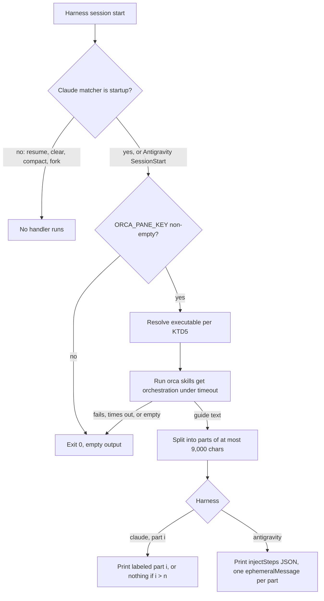

# Orca Orchestration Session Injection - Plan

## Goal Capsule

- **Objective:** A Claude Code or Antigravity session launched inside an Orca-managed terminal starts already holding Orca's version-matched orchestration guide, so the agent can coordinate Orca workers from its first turn without first discovering and loading the `orchestration` skill.
- **Means:** one packaged session-start context script, wired into Claude Code through a repo-local plugin (KTD2) and into Antigravity through a repository-owned entry in its hooks file (KTD4).
- **Product authority:** the repository owner (h82), confirmed in the brainstorm dialogue of 2026-09-28. The Product Contract wins on behavior; KTDs win on mechanism.
- **Execution profile:** Standard. Nix and Home Manager modules, one shell tool, one Python helper extension, repository checks.
- **Stop conditions:** stop and report if Claude Code refuses to install or enable a plugin carrying `hooks/hooks.json` without a new acceptance flag (U3). If Antigravity SessionStart injection is not model-visible, drop U5 and record the follow-up rather than approximating it (R6).
- **Who finishes:** `ce-work` implements and verifies in the pipeline; merge stays with the user. No `nixos-rebuild switch` as validation (AGENTS.md).
- **Open blockers:** none.

---

## Product Contract

Product Contract preservation: restructured, no scope change. R4 now names the per-part size bound that the Claude Code hook cap forces; the delivery of the full guide is unchanged. Outstanding Questions were resolved in place into KTD1–KTD6, and the Antigravity visibility question became the U5 gate.

### Summary

Every new Claude Code or Antigravity session started with Orca's runtime environment variables present runs `orca skills get orchestration` once and adds its output to the session context.
Sessions outside Orca, and resumed, cleared, compacted, or forked sessions, are not touched.

### Problem Frame

`home/h82/agents/orca-skills.nix` already installs Orca's `orchestration` skill into every user-level skill root, but the installed file is a discovery stub.
An agent inside Orca must first recognize that orchestration applies, invoke the skill, resolve the Orca executable, and then run `orca skills get orchestration` before it knows how to message, dispatch, or wait on workers.
Agents frequently skip that chain and fall back to their own subagent tools, which the skill itself forbids for Orca coordination.
The global instruction files rendered from `home/h82/agents/instructions/instructions.md.tmpl` cannot close the gap: they are built once and cannot branch on whether the current session runs inside Orca.

### Key Decisions

- **Inject content at session start rather than instruct the agent to load the skill.** A rule the agent may ignore is the failure being fixed; injected context is present regardless. Governs R1, R4. (session-settled: user-directed — chosen over an instruction-file rule and over hiding the skill outside Orca: only injection guarantees the agent starts with the guide)
- **Inject the version-matched guide, not the stub or a one-line signal.** The guide printed by the installed binary cannot drift from the commands that will run, and it spares the agent the load step. Governs R4. (session-settled: user-directed — chosen over the SKILL.md stub and a short signal line: costs ~13 KB of context per Orca session in exchange)
  - Conflict call-out: Claude Code caps each hook output string at 10,000 characters and replaces a longer one with a file path plus a 2,000-character preview, while the guide is 12,998 characters for Orca 1.4.206. The decision stands, delivered as labeled parts under the cap (KTD3). The parts may reach context in any order.
- **Only on a fresh session start.** Resume, `/clear`, compaction, and fork do not re-inject; after compaction the installed skill remains the recovery path. Governs R2. (session-settled: user-directed — chosen over re-injecting on every session-start source)
- **Claude Code and Antigravity, not Gemini CLI or Codex.** They are the two harnesses whose global instructions this repository renders. Governs R6. (session-settled: user-directed — chosen over Claude Code only and over every hook-capable harness)
- **Fail open.** If the guide cannot be produced, the session starts normally without it; the injection is an accelerator, not a gate. Governs R5. (session-settled: user-approved — proposed with the silent-skip trade-off shown; user confirmed)

### Requirements

**Trigger**

- R1. Injection happens only when the session's environment carries the variables Orca sets in its managed terminals; a session without them receives nothing extra.
- R2. Injection happens only when a session first starts, never on resume, clear, compaction, or fork of an existing session.

**Content**

- R3. The guide comes from the Orca executable that matches the session, resolved the way the `orchestration` skill resolves it (`ORCA_CLI_COMMAND` when set), never from a copy frozen at build time and never through a bare `orca` lookup that could reach the GNOME screen reader.
- R4. The injected context is the full output of `orca skills get orchestration`, marked so the agent can tell it came from the session-start injection, and delivered in parts that each fit the harness's per-output limit.

**Failure and coexistence**

- R5. When the Orca executable is missing, fails, times out, or prints nothing, the session starts normally, no partial or error text is injected, and no token or secret from the environment is printed.
- R6. The injection is declared for Claude Code and for Antigravity; each harness's session start behaves per R1–R5.
- R7. Declaring the hook leaves every hook Orca itself writes (its `SessionStart` entry in `~/.claude/settings.json`, its `orca-status` entry in `~/.gemini/config/hooks.json`) intact across rebuilds, and leaves other user-written keys untouched.
- R8. The behavior is covered by registered repository checks that fail if the hook stops injecting inside an Orca environment, starts injecting outside one, or removes Orca's own hooks.

### Acceptance Examples

- AE1. **Covers R1, R2, R4.** Given a new Claude Code session launched from an Orca terminal, when the session starts, then its initial context contains every part of the output of `orca skills get orchestration` from the installed Orca build.
- AE2. **Covers R1.** Given a Claude Code session launched from Ghostty with no Orca variables, when it starts, then no orchestration guide is injected.
- AE3. **Covers R2.** Given an Orca session that was compacted, resumed, cleared, or forked, when the session-start event fires with that source, then nothing is injected again.
- AE4. **Covers R5.** Given Orca variables are present but the Orca executable exits non-zero, when the session starts, then it starts normally with no injected text and no error text in context.
- AE5. **Covers R7.** Given Orca has written its own hooks into `~/.claude/settings.json` and `~/.gemini/config/hooks.json`, when the home configuration is activated, then Orca's hooks and the declared injection hook both remain.

### Scope Boundaries

- Gemini CLI and Codex receive no injection hook, although they share the `~/.agents/skills` root.
- Skill installation in `home/h82/agents/orca-skills.nix` is unchanged; the stub stays installed as the recovery path after compaction.
- No re-injection after compaction or resume, and no trimming or summarizing of the guide to save context.
- Injecting other Orca skills (`orca-cli`, `orca-linear`, emulator skills) is out of scope.

#### Deferred to Follow-Up Work

- An Antigravity fallback through `PreInvocation` gated on the first invocation, if U5's probe shows SessionStart injection is not model-visible. It changes the trigger semantics, so it needs its own decision.

### Dependencies / Assumptions

- Orca writes its own hook entries, including `SessionStart`, into `~/.claude/settings.json` at runtime, and an `orca-status` entry into `~/.gemini/config/hooks.json`. Neither file is Nix-managed.
- The settings merger `scripts/agent-settings` assigns only scalars (`set`, `setPaths`) and rejects object- or list-valued declarations, so hooks cannot ride the existing `settingsTier`.
- `orca skills get orchestration` prints 12,998 characters for Orca 1.4.206, exits 0, runs in about 0.4 s, and reads bundled content without needing a running Orca.
- Antigravity 1.2.9 accepts a `SessionStart` event in `~/.gemini/config/hooks.json`; whether its injected steps reach the model is unverified until U5.

### Sources / Research

- `home/h82/agents/orca-skills.nix` — installs Orca's skills, including `orchestration`, from the pinned Orca package.
- `home/h82/agents/claude.nix`, `home/h82/agents/gemini.nix`, and `scripts/agent-settings` — activation-time settings merges; the merger fails closed on nested values.
- `home/h82/agents/agent-plugins.nix` and `scripts/agent-plugin-sync` — the Claude plugin registry and its sync tool, which registers a local directory marketplace.
- `packages/orca.nix` — `orca-ide` package; it links `orca` beside `orca-ide` in `$out/bin`.
- `tests/orca-skills.nix`, `tests/agent-plugins.nix`, `tests/test_agent_settings.py`, `tests/test_agent_plugin_sync.py` — check patterns to follow.
- Claude Code hooks reference (https://code.claude.com/docs/en/hooks) and plugins reference (https://code.claude.com/docs/en/plugins-reference): SessionStart matchers `startup|resume|clear|compact|fork`, the 10,000-character per-output cap, plugin hooks merging with settings hooks.
- Antigravity evidence: `agy changelog`, the live `~/.gemini/config/hooks.json` schema written by Orca, and third-party captures (obra/superpowers#2247, automatis-tools/agents-can-communicate#177, thedotmack/claude-mem#4057).
- `.compound-engineering/artifacts/solutions/best-practices/home-manager-activation-does-not-run-on-every-rebuild.md`, `.compound-engineering/artifacts/solutions/integration-issues/orca-rejects-hardlinked-nix-store-skill-files.md`, and the check mutation-testing solutions named in `AGENTS.md`.

---

## Planning Contract

### Key Technical Decisions

- KTD1. **One packaged context script, parameterized by harness and part.** A `writeShellApplication` tool (working name `orca-orchestration-context`) owns the trigger test, executable resolution, chunking, and output format for both harnesses, so R1–R5 are implemented and tested once. Harness adapters only choose the output envelope.
- KTD2. **Claude Code receives the hook through a repo-local plugin installed by `agent-plugin-sync`.** The plugin carries `.claude-plugin/plugin.json`, `.claude-plugin/marketplace.json`, and `hooks/hooks.json` with `SessionStart` handlers under matcher `startup` only (R2). Plugin hooks merge with settings hooks, so `~/.claude/settings.json` and Orca's entries in it are never touched (R7). Rejected: teaching `agent-settings` to append into `hooks.SessionStart`, which would share an array with Orca's runtime writer. Each hook `command` names the script by absolute store path, since `${CLAUDE_PLUGIN_ROOT}` points at a cache copy.
- KTD3. **Split the guide into labeled parts below the per-output cap.** Governs R4. The script splits the guide on line boundaries into parts of at most 9,000 characters each and emits one part per handler, headed `Orca orchestration guide (injected at session start), part i of n`. `hooks/hooks.json` declares three Claude handlers, which covers guides up to 27,000 characters. If a future guide needs more than three parts, the last handler appends one line directing the agent to run the full command itself, instead of dropping text silently. The split is recomputed at runtime, so a guide that changes size between Orca releases needs no rebuild. The parts' order in context is not guaranteed; the labels let the model reassemble them.
- KTD4. **Antigravity receives a repository-owned `orca-orchestration` entry in `~/.gemini/config/hooks.json`.** The file is a map from hook name to its events, and Orca owns the `orca-status` key beside it. `scripts/agent-settings` gains an `own` field: top-level keys whose whole JSON value this repository declares and replaces, while every other key stays untouched (R7). Antigravity emits one `{"injectSteps":[...]}` document with one `ephemeralMessage` per part, in order. Whether the step type is model-visible is gated by U5.
- KTD5. **Resolve the Orca executable as `ORCA_CLI_COMMAND`, then `orca-dev` when `ORCA_DEV_REPO_ROOT` is set, then the pinned Orca CLI entry point.** Governs R3. This is the order the installed `orchestration` skill documents. The final step is the extracted AppImage's `resources/bin/orca-ide`, the same file Orca's own `linux-orca-cli-shim/orca` execs, which runs the CLI in Electron's Node mode. It is not the wrapper's `$out/bin/orca-ide`, which launches the GUI, and never a bare `orca` PATH lookup. `packages/orca.nix` exposes that entry point through `passthru.cli`. `ORCA_CLI_COMMAND` is unset in ordinary Orca terminals, so this final step is the common path.
- KTD6. **Trigger on a non-empty `ORCA_PANE_KEY`.** Governs R1. It is the variable Orca's own agent hook gates on, and it is set for both Orca terminals and Orca-launched agents. An empty value counts as absent, per the nullable-operand learning.
- KTD7. **Fail open by construction.** Governs R5. The script always exits 0 and prints nothing unless it holds a complete, non-empty guide. The Orca call runs under a 5-second `timeout`, and the hook handlers declare a 10-second timeout, matching Orca's own hook. Nothing from the environment is ever echoed.
- KTD8. **The local plugin's version is a content hash, used both as the sync segment and as `plugin.json`'s `version`.** Claude Code keys its plugin cache on that `version`, so a fixed value would leave a cached `hooks/hooks.json` naming a stale, possibly collected store path. The hash covers the plugin tree without its manifests (in practice the generated `hooks/hooks.json`, which names U1's store path), which avoids a circular hash. It is formatted as `0.0.0-<hash>` to satisfy `agent-plugin-sync`'s `SEGMENT` pattern. Any change to the plugin or script then reinstalls it through the sync tool's existing version-switch path. The registry gains a local-source form without `tag`, `expectedRev`, or `upstream`, and the `tests/agent-plugins.nix` pin comparison applies only to flake-input sources.

### High-Level Technical Design

Directional sketch of the runtime path; each hook handler is independent.

### Assumptions

- `agent-plugin-sync` can register a second marketplace whose source is a repo-built store tree, exactly as it does for `compound-engineering`. U3 verifies this against the real `claude` binary before relying on it.
- Claude Code installs a plugin carrying `hooks/hooks.json` without a separate acceptance flag. The sync tool never passes `--accept-command`, and `tests/agent-plugins.nix` asserts that.
- Antigravity hooks inherit the session environment, as Orca's own `antigravity-hook.sh` relies on.
- Antigravity SessionStart fires only for new conversations. If U5 shows it also fires on resume, record that as a known deviation from R2 instead of widening scope.

### Sequencing

U1 → U2 → U3 → U4 (Claude path, shippable alone). U6 has no dependencies. U5 carries the Antigravity path and depends on U1 and U6. U5's probe decides whether U5 lands or becomes follow-up.

---

## Implementation Units

### U1. Session-start context script

**Goal:** A packaged tool that prints the harness-specific session-start context from `orca skills get orchestration`, or nothing.

**Requirements:** R1, R3, R4, R5; KTD1, KTD3, KTD5, KTD6, KTD7.

**Dependencies:** none.

**Files:**
- `scripts/orca-orchestration-context` (new, shell)
- `packages/orca.nix` (add `passthru.cli`, the extracted `resources/bin/orca-ide`)
- `packages/agent-tools.nix` (expose the script, with `passthru.cli` substituted)
- `tests/orca-orchestration-context.sh` (new)
- `flake.nix` (register the check)

**Approach:**
1. Arguments: `--harness claude --part <i>` or `--harness antigravity`. An unknown argument exits 0 silently, since a hook must never fail loudly. Cover it in tests so a typo is still caught.
2. Gate on KTD6, resolve per KTD5, run the guide under the KTD7 timeout, and capture stdout only; stderr goes to `/dev/null`.
3. Split per KTD3 on line boundaries. A single line longer than the bound is hard-split at the bound.
4. For Claude, print the labeled part, or nothing when `i > n`. The last declared handler adds the overflow line. For Antigravity, print one `injectSteps` JSON document built with `jq`, never by string concatenation.

**Patterns to follow:** `home/h82/agents/orca-skills.nix` for `writeShellApplication`; `tests/tokscale.sh` and its `flake.nix` registration, which run a shell test against both the raw script and the packaged binary.

**Test scenarios:**
- Covers AE1. With `ORCA_PANE_KEY` set and a fake `ORCA_CLI_COMMAND` printing a 13,000-character guide, parts 1 and 2 are non-empty, part 3 is empty, each part is at most 9,000 characters plus its header, and the parts' bodies concatenate to the original byte for byte.
- Covers AE2. With `ORCA_PANE_KEY` unset, and again set to the empty string, output is empty and exit is 0 for every harness and part.
- Covers AE4. The fake executable exits 1, prints nothing, or sleeps past the timeout: output is empty and exit is 0.
- A guide needing four parts: part 3 ends with the overflow line naming the full command.
- `ORCA_CLI_COMMAND` unset, `ORCA_DEV_REPO_ROOT` set, and a fake `orca-dev` on PATH: `orca-dev` is called. With neither set, the substituted CLI path is called, and a fake bare `orca` placed first on PATH is never invoked.
- The packaged script's substituted CLI path ends in `-extracted/resources/bin/orca-ide`, not the wrapper's `bin/orca-ide`.
- Antigravity: output parses as JSON with an `injectSteps` array of `ephemeralMessage` entries in part order. A guide containing quotes, backslashes, and non-ASCII text round-trips intact.
- A fake executable that echoes `ORCA_AGENT_HOOK_TOKEN` to stderr: the token never appears in the output.
- Unknown `--harness` value: empty output, exit 0.

**Verification:** The script test passes against the raw script and the packaged binary, and a manual run inside this Orca terminal prints two labeled parts.

### U2. Repo-local Claude plugin

**Goal:** A plugin tree whose `hooks/hooks.json` runs U1 for parts 1–3 on `startup` only.

**Requirements:** R2, R4, R6, R7; KTD2, KTD3.

**Dependencies:** U1.

**Files:**
- `packages/orca-orchestration-plugin.nix` (new; builds the tree, including a generated `hooks/hooks.json` naming U1 by store path)
- `tests/orca-orchestration-plugin.nix` (new)
- `flake.nix` (register the check)

**Approach:**
1. Generate the manifests from Nix values. `plugin.json` carries `name`, `description`, and `version` equal to the KTD8 hash, which the derivation also exposes so U3 passes the same value as `--segment`. `marketplace.json` lists the one plugin with `source: "./"`. Neither declares `command`, `commands`, or `headersHelper`, which `agent-plugin-sync` refuses.
2. `hooks/hooks.json` holds one `SessionStart` entry with matcher `startup` and three command handlers, each with a 10-second timeout.

**Patterns to follow:** the `compound-engineering` plugin's manifest shape under `~/.local/share/agent-plugins/compound-engineering/v3.29.0/.claude-plugin/`, and `agent-plugin-sync`'s `read_manifests()` contract.

**Test scenarios:**
- Covers AE3. The materialized `hooks/hooks.json` has exactly one `SessionStart` matcher, equal to `startup`. A mutation to `startup|resume` or `*` fails the check.
- Each handler's command runs a path that exists in the built tree's closure, and running it with a fake Orca environment prints the matching part. This asserts the materialized command, not a Nix option value.
- Parts 1, 2, and 3 are all present, and no two handlers request the same part.
- The tree passes `agent-plugin-sync`'s `read_manifests()` when imported in the check.
- `plugin.json`'s `version` equals the segment the registry passes to `--segment`. Changing U1's script changes both.

**Verification:** `nix build` of the plugin tree and its check succeed. `claude plugin validate` on the built tree reports no errors, if the installed CLI offers it.

### U3. Register the local plugin in the plugin registry

**Goal:** Activation installs and enables `orca-orchestration@orca-orchestration` for Claude Code beside `compound-engineering`.

**Requirements:** R6, R7, R8; KTD2, KTD8.

**Dependencies:** U2.

**Files:**
- `home/h82/agents/agent-plugins.nix` (local-source form, new source and membership rows)
- `tests/agent-plugins.nix` (pin comparison limited to flake-input sources; new local-source assertions)
- `scripts/agent-plugin-sync` and `tests/test_agent_plugin_sync.py` (only if a local source exposes a gap)

**Approach:**
1. Add a source with `src` pointing at U2's derivation and `segment` from KTD8. `treeFor`, `syncInvocation`, and `my.agentPlugins` must accept both source forms without `or ""` placeholders that would hide a missing field.
2. Keep the refusal behavior: an unknown harness or undeclared plugin still throws.

**Execution note:** Before wiring activation, run `agent-plugin-sync` against the built tree with the real `claude` binary and an isolated `HOME`, and confirm the plugin installs, enables, and lists its hook. If installing needs a flag the tool does not pass, stop (Goal Capsule stop condition).

**Patterns to follow:** the existing `compound-engineering` row, and `tests/agent-plugins.nix`'s host iteration and materialized activation text assertions.

**Test scenarios:**
- On every host, the `agentPlugins` activation text invokes `agent-plugin-sync` with `--source` equal to U2's store path and `--plugin orca-orchestration`.
- The `compound-engineering` pin assertion still runs and still goes red when its `expectedRev` is mutated.
- A local source missing its derivation fails evaluation with the registry's own message rather than an interpolation error.
- The activation text never contains `--accept-command`; the existing assertion still covers the new row.

**Verification:** `nix flake check` passes and the host toplevels build. The isolated-HOME run shows the plugin installed and enabled.

### U4. Claude Code live verification

**Goal:** Evidence that a real Claude Code session inside Orca receives the parts, and one outside Orca does not.

**Requirements:** R1, R2, R4, R6; AE1, AE2.

**Dependencies:** U3.

**Files:** none. This is evidence reported in the PR, separate from check results.

**Approach:** With the plugin installed in an isolated `HOME` that reuses the user's Claude credentials read-only, run `claude -p` asking whether the context holds the injected guide parts, once with `ORCA_PANE_KEY` set and once without. Report each result verbatim. Do not activate the home generation or run `nixos-rebuild switch`.

**Test expectation:** none -- live evidence, not a repository check.

**Verification:** The PR reports both runs. If the isolated `HOME` cannot authenticate, the PR says so and names the check evidence that stands in for it.

### U6. Owned-key declarations in `agent-settings`

**Goal:** `agent-settings` can replace the whole value of a top-level key the repository owns, leaving every other key untouched.

**Requirements:** R7; KTD4.

**Dependencies:** none.

**Files:**
- `scripts/agent-settings`
- `tests/test_agent_settings.py`
- `flake.nix` (extend the `agent-settings` check with a packaged run over a hooks-shaped fixture)

**Approach:**
1. Add an `own` field, `{name: any JSON}`, to the declaration. A key may appear in only one of `set`, `own`, `remove`, and the first path element of `setPaths`; overlap is refused before any write.
2. Keep the compare-and-swap write and the docstring's fail-closed reasoning. Explain why `own` is safe: the key is the repository's alone, so a whole-value replace cannot clobber another writer.

**Patterns to follow:** the existing `set` and `setPaths` validation and their tests.

**Test scenarios:**
- Covers AE5. A fixture with `orca-status` and a stale `orca-orchestration`: after the merge, `orca-status` is byte-identical and `orca-orchestration` equals the declared object.
- A missing settings file is created with only the owned key.
- A key in both `own` and `set`, or in `own` and `remove`, is refused and the file is unchanged.
- A second run changes nothing and leaves the file's modification time untouched, if the existing write path already skips no-op writes.

**Verification:** The `agent-settings` check passes, and mutating `own` to replace the whole document fails it.

### U5. Antigravity hook entry, gated by a visibility probe

**Goal:** Antigravity sessions inside Orca receive the guide through `~/.gemini/config/hooks.json`, or the gap is recorded.

**Requirements:** R6, R7; KTD4.

**Dependencies:** U1, U6.

**Files:**
- `home/h82/agents/gemini.nix` (new activation merge of `~/.gemini/config/hooks.json` declaring the owned `orca-orchestration` key)
- `tests/gemini.nix`

**Approach:**
1. First, probe with an isolated `HOME` holding a SessionStart hook that injects a random token as an `ephemeralMessage`, then run `agy -p` asking for the token. This costs one model turn.
2. If the token is visible, declare `{"orca-orchestration": {"enabled": true, "SessionStart": [{"type": "command", "command": "<U1 store path> --harness antigravity", "timeout": 10}]}}`, ordered after `installPackages` like the other merges.
3. If the token is not visible, do not land this unit. Record the result and the `PreInvocation` follow-up in the PR body.
4. Confirm that Orca's own writer preserves foreign top-level keys when it rewrites `orca-status`: seed a fixture key, trigger Orca's hook installation, and inspect the file. If Orca rewrites the whole file, report it in the PR as a known gap, since activation does not re-run on every rebuild.

**Patterns to follow:** the existing `antigravitySettings` activation block in `home/h82/agents/gemini.nix` and its check.

**Test scenarios:**
- On every host, the activation text passes `--settings` ending in `.gemini/config/hooks.json` and a declaration whose `own.orca-orchestration.SessionStart[0].command` runs U1 with `--harness antigravity`.
- The declaration contains no key other than `orca-orchestration`, so it cannot reach `orca-status`.
- The activation entry is ordered after `installPackages`.

**Verification:** The probe result is reported in the PR, and the `gemini` check passes when the unit lands.

---

## Verification Contract

| Gate | Command | Proves |
|---|---|---|
| Formatting | `nix fmt -- --ci` | Nix layout |
| Checks | `nix flake check` | U1 script test, U2 plugin check, U3 `agent-plugins`, U6 `agent-settings`, U5 `gemini` |
| ThinkPad build | `nix build --no-link .#nixosConfigurations.ThinkPad-X1-Carbon-Gen-11.config.system.build.toplevel` | Host evaluates and builds |
| ThinkPad bootstrap | `nix build --no-link .#nixosConfigurations.ThinkPad-X1-Carbon-Gen-11-bootstrap.config.system.build.toplevel` | Bootstrap host |
| Desktop build | `nix build --no-link .#nixosConfigurations.MS-7D91.config.system.build.toplevel` | Host evaluates and builds |
| Desktop bootstrap | `nix build --no-link .#nixosConfigurations.MS-7D91-bootstrap.config.system.build.toplevel` | Bootstrap host |

Mutation evidence: for each new check, record one mutation that turns it red (matcher widened, trigger inverted, fail-open removed, owned key widened), following the mutation-testing solutions listed in `AGENTS.md`. Report live evidence (U3's isolated install, U4, U5's probe) separately from check results.

---

## Definition of Done

- U1, U2, U3, and U6 are merged-ready with their checks passing and a recorded red mutation each.
- U4's live evidence, or the stated reason it could not run, is in the PR body.
- U5 has either landed with its probe result, or its probe result and the `PreInvocation` follow-up are recorded in the PR body.
- `nix fmt -- --ci`, `nix flake check`, and all four host builds pass.
- No abandoned-attempt code remains in the diff.
