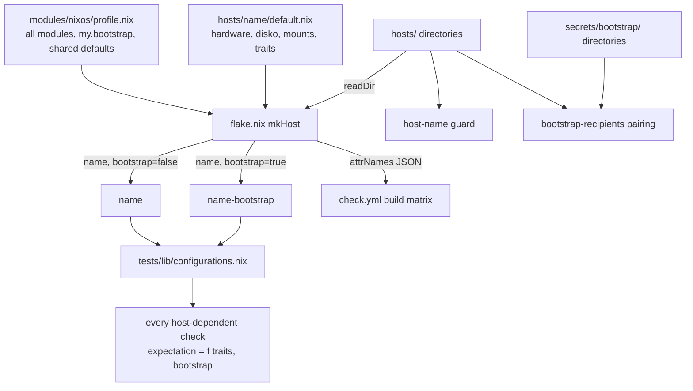

# Host-Generic Composition - Plan

## Goal Capsule

- **Objective:** The ThinkPad-X1-Carbon-Gen-11 and MS-7D91 hosts get their shared behavior from one source and differ only where their hardware or a recorded decision says so. Every repository check covers every host, and a new host is added without editing `flake.nix`, `tests/`, `modules/`, or `home/`.
- **Means:** A shared host profile, per-host traits, host discovery from `hosts/`, and checks that run over every configuration and use traits to decide what to expect (KTD1–KTD8).
- **Authority:** This plan first, then `AGENTS.md`, then the check-guard learnings `AGENTS.md` lists. R16 amends the `AGENTS.md` rule that each host cherry-picks its own module imports. Earlier plans stay authoritative for the host differences they recorded, such as keyd being omitted on MS-7D91.
- **Open blockers:** None.
- **Execution profile:** Nix configuration, check, CI workflow, and documentation changes. Evidence comes from evaluation and builds only. No hardware installation, no `nixos-rebuild switch`, and no real credentials.
- **Stop conditions:** Stop and report if any production or bootstrap output of either host changes in a way this plan does not name. The only intended behavior change is R4 (weekly generation cleanup on MS-7D91). Also stop if a converted check can no longer be made to fail by the mutation it caught before.
- **Finishes the work:** `ce-work` implements and verifies. The `lfg` pipeline reviews the work, opens the PR, and watches CI.

---

## Product Contract

### Summary

All hosts import one shared profile. A host directory declares only its hardware, disk layout, host-local mounts, and traits. The flake builds a production output and a bootstrap output for every directory under `hosts/`. Every host-dependent check runs over all of those configurations and uses traits to decide what each one should contain. A guard check and a host-addition guide keep a third host from bringing the drift back.

### Problem Frame

The MS-7D91 desktop joined a flake built around the ThinkPad, and the drift that followed has three layers.

- **Composition.** Both `hosts/*/default.nix` files copy the same shared import list and the same `options.my.bootstrap` declaration. The lists have already diverged: MS-7D91 never imported `nix-cleanup.nix`, and the desktop plan gives no reason for leaving it out.
- **Branching.** `home/h82/desktop/kde/power-lid.nix` checks `networking.hostName == "ThinkPad-X1-Carbon-Gen-11"` when the property it cares about is "this machine is a laptop."
- **Checks.** Ten inline checks in `flake.nix` read only the ThinkPad configuration: `enroll-fingerprint`, `zsh-prezto`, `ghostty-font`, `python3-runtime`, `gpg-agent-no-cache`, `kleopatra-gui`, `telegram-desktop`, `libreoffice-office`, `okular-pdf`, and `discord`. `orca-desktop` covers only the ThinkPad production and bootstrap outputs. `tests/claude.nix`, `gemini.nix`, `desktop-autostart.nix`, `nix-ld.nix`, `nix-cleanup.nix`, and `podman-containers.nix` never evaluate MS-7D91. Most remaining checks list host names by hand. Only `tests/agent-instructions.nix`, `agent-plugins.nix`, `orca-skills.nix`, and `pam-fingerprint.nix` iterate `self.nixosConfigurations`, and `pam-fingerprint.nix` still keys its expectations by host name. CI's build matrix in `.github/workflows/check.yml` also lists the four outputs by hand, and `nix flake check` only evaluates configurations; it does not build them.

As a result, a regression on MS-7D91 can pass `nix flake check`. Adding a third host would mean editing the flake outputs, about twenty test files, and the docs, and every missed edit would silently shrink coverage. The flake description still reads "ThinkPad X1 Carbon Gen 11 NixOS configuration."

---

### Key Decisions

- **One shared profile plus traits, instead of per-host cherry-picked imports.** Hosts declare what they are, and modules and checks act on those declarations. (session-settled: user-directed — chosen over keeping per-host cherry-picking with only the checks made generic, and over only centralizing the host list: this is the one option that removes hostname branching and duplicated import lists together.) Governs R1, R2, R5, R6, R7, R16.
- **Checks cover every configuration, bootstrap outputs included, and use traits to pick what to expect.** (session-settled: user-directed — chosen over a production-only default and over each check declaring its own target set: no configuration should fall outside coverage.) Governs R11, R12, R13.
- **Hosts are discovered from `hosts/`, not listed in `flake.nix`.** (session-settled: user-directed — chosen over an explicit host list in `flake.nix`: adding a host should not touch the flake.) Governs R9.
- **Differences with no recorded intent are absorbed into the shared profile.** A behavior change of this kind is in scope, so this is not a structure-only refactor. (session-settled: user-directed — chosen over preserving each host's current behavior and deferring the differences: undocumented divergence is the drift this work removes.) Governs R3, R4.
- **Documentation is generalized as well as extended.** (session-settled: user-directed — chosen over writing only a host-addition guide, and over fixing only the text this change invalidates: procedures that name one host are drift too.) Governs R17, R18.
- **A guard check rejects host-name literals outside the places that legitimately hold them.** (session-settled: user-approved — proposed in the scope confirmation to stop this drift from coming back.) Governs R15.

---

### Requirements

**Host composition**

- R1. Every host imports one shared profile. The profile holds all modules and settings that do not depend on a specific machine's hardware.
- R2. A host directory holds only its hardware configuration, disk layout, host-local mounts such as MS-7D91's `/mnt/data`, and its trait declarations.
- R3. `my.bootstrap` is declared exactly once, outside the host directories.
- R4. Every host gets any shared behavior that differs today without a recorded reason. This includes the weekly generation cleanup from `nix-cleanup.nix`, which MS-7D91 does not receive today.
- R5. Differences with a recorded or hardware reason stay host-specific and are expressed as traits. Today these are: keyd off on MS-7D91 (desktop plan KTD5, to keep the NuPhy Gem80 firmware mapping), fingerprint authentication, Thunderbolt authorization, the laptop lid-switch policy, the NuPhy Gem80 support, the missing Copilot key on the Gen 11, and Tailscale subnet-route advertisement.

**Traits**

- R6. Modules branch on traits the host declares, never on `networking.hostName`. This applies to NixOS modules and to Home Manager modules.
- R7. `power-lid.nix` applies its policy on hosts that declare the laptop trait instead of matching a host name.
- R8. Home Manager modules can read traits through `osConfig`, and checks can read them from each configuration.

**Host registration**

- R9. Every directory under `hosts/` yields a `<name>` output and a `<name>-bootstrap` output under `nixosConfigurations`, with no edit to `flake.nix`.
- R10. Repository-wide labels do not name a single host. The flake `description` is one of them.

**Checks**

- R11. Every host-dependent check iterates the flake's `nixosConfigurations` instead of a hand-written host list. This covers checks inline in `flake.nix` and those in `tests/`.
- R12. A check derives its expectation for each configuration from that configuration's traits and bootstrap status. On a configuration where a behavior should be absent, the check asserts the absence rather than skipping that configuration.
- R13. A check that reads a host's own file, such as `tests/boot-layout.nix` reading the ThinkPad disko layout, covers the equivalent file for every host.
- R14. Converting a check does not weaken any assertion it makes today. Every existing positive and negative assertion keeps failing on the mutation it currently catches.
- R15. A guard check fails when a host name appears outside `hosts/` and `secrets/bootstrap/` in the repository's code: `flake.nix`, `modules/`, `home/`, `tests/`, `scripts/`, `packages/`, and `.github/workflows/`.
- R19. CI builds every discovered configuration without its workflow files being edited when a host is added.
- R20. Every host directory has matching bootstrap material under `secrets/bootstrap/`, and every bootstrap directory has a matching host directory. A check fails when either side is missing.

**Documentation**

- R16. `AGENTS.md` describes the shared-profile-plus-traits composition and replaces the cherry-pick rule. Its list of host builds is written so that it does not need editing when a host is added.
- R17. A host-addition guide covers the full path for a new machine: create the host directory with its hardware, disk layout, and traits; create bootstrap age material with `scripts/prepare-age-identity --host`; add the host's recipient to `.sops.yaml` and re-encrypt; run the builds and checks.
- R18. `README.md`, `docs/install.md`, `docs/provisioning.md`, `docs/verification.md`, and `docs/recovery.md` describe their procedures against `<host>`. Hardware-specific notes for each machine are kept apart from the generic procedure.

---

### Acceptance Examples

- AE1. Adding a third host
  - **Covers:** R9, R11, R15, R17, R19, R20.
  - **Given:** a new `hosts/<name>/` with hardware, disk layout, and traits, plus its bootstrap material under `secrets/bootstrap/<name>/`.
  - **When:** `nix flake check` runs, and CI runs on the branch.
  - **Then:** `<name>` and `<name>-bootstrap` exist, every host-dependent check evaluates both, and CI builds both. Nothing in `flake.nix`, `tests/`, `modules/`, `home/`, or `.github/workflows/` was edited.
- AE2. A documented difference stays enforced
  - **Covers:** R5, R12.
  - **Given:** MS-7D91 does not declare the keyboard-remap trait, and the ThinkPad does.
  - **When:** the keyd check runs.
  - **Then:** it asserts keyd is enabled on the ThinkPad outputs and disabled on the MS-7D91 outputs, because that is what each host's trait declares. It fails if the keyd module stops following the trait. The trait in the host directory is the record of the decision, so changing it is a deliberate, reviewed host change that the check follows.
- AE3. Bootstrap outputs keep their own expectations
  - **Covers:** R12.
  - **Given:** a host with the fingerprint trait.
  - **When:** the fingerprint PAM check evaluates that host's production and bootstrap outputs.
  - **Then:** it expects fingerprint authentication on production and none on bootstrap.
- AE4. An undocumented difference is absorbed
  - **Covers:** R4.
  - **Given:** the shared profile.
  - **When:** the MS-7D91 production output is evaluated.
  - **Then:** the weekly generation cleanup is enabled, and the MS-7D91 bootstrap output leaves it off, as the ThinkPad bootstrap output does today.
- AE5. A hostname branch is rejected
  - **Covers:** R6, R15.
  - **Given:** a change that adds `osConfig.networking.hostName == "MS-7D91"` to a Home Manager module.
  - **When:** `nix flake check` runs.
  - **Then:** the guard check fails and names the file.

---

### Success Criteria

- `nix flake check` and the production and bootstrap builds of both hosts pass after the change.
- No check covers fewer configurations than it does today, and no assertion is weaker.
- Afterward, the only places that name a host are `hosts/`, `secrets/bootstrap/`, the per-host hardware notes in the docs, and historical artifacts under `.compound-engineering/artifacts/`.

---

### Scope Boundaries

- Architectures other than `x86_64-linux`, and users other than `h82`, are out of scope.
- The default Plasma desktop and its settings do not change (per `AGENTS.md`).
- Host names, disk layouts, and the per-secret-file recipient rules in `.sops.yaml` stay as they are.
- Hardware installation, firmware or TPM enrollment, and `nixos-rebuild switch` are not part of validation.
- Historical plans and solutions under `.compound-engineering/artifacts/` are not rewritten.

---

### Dependencies / Assumptions

- Evaluating a `nixosConfiguration` does not read `secrets/bootstrap/<host>/`. Only `tests/bootstrap-recipients.nix` reads that directory, and it enumerates it with `builtins.readDir` (`tests/bootstrap-recipients.nix:24-26`). Host discovery therefore does not depend on bootstrap material existing.
- `scripts/nr` finds the target host with `uname -n`, and `scripts/prepare-age-identity` takes `--host`. Neither contains a host-name literal, so neither needs to change for host discovery.
- More configurations per check means `nix flake check` evaluates roughly twice as many configurations per host as a production-only scope would. This cost is accepted.

---

### Product Contract Preservation

Extended and clarified, no scope change. AE2 now states which flip it catches: the module drifting from the trait. A trait change in the host directory is itself the reviewed decision (KTD6). R13 now says "covers" instead of "reads", so a structural comparison can satisfy it (U3). The Problem Frame's inventory of iterating checks was corrected. The planning questions this contract deferred are resolved in KTD2, KTD6, KTD7, and KTD8. Two requirements were added: R19 (CI builds every discovered configuration) and R20 (host and bootstrap directories pair up). R15's scan set gains `.github/workflows/`. The Success Criteria's "only `hosts/` and `secrets/bootstrap/` name a host" already implies all three. The CI build matrix and `tests/bootstrap-recipients.nix` were the unlisted places that named or enumerated hosts.

---

### Sources / Research

- `hosts/ThinkPad-X1-Carbon-Gen-11/default.nix` and `hosts/MS-7D91/default.nix`: the current import lists and the duplicated `options.my.bootstrap`.
- `flake.nix`: `mkHost`, the hand-listed outputs, and the ThinkPad-only inline checks.
- `home/h82/desktop/kde/power-lid.nix:11`: the only hostname branch under `home/` and `modules/`.
- `tests/agent-instructions.nix:150`: the existing pattern of iterating `self.nixosConfigurations`.
- `.compound-engineering/artifacts/plans/2026-09-22-1646-feat-ms-7d91-desktop-nixos-plan.md`: KTD5, keyd omitted on MS-7D91.
- `.compound-engineering/artifacts/plans/2026-09-22-1404-feat-automatic-nix-generation-cleanup-plan.md`: the origin of `nix-cleanup.nix`.
- The check-guard learnings listed in `AGENTS.md`, starting with `.compound-engineering/artifacts/solutions/best-practices/mutation-testing-reveals-decorative-nix-check-assertions.md`, `.compound-engineering/artifacts/solutions/best-practices/nix-check-reads-option-value-not-materialized-output.md`, and `.compound-engineering/artifacts/solutions/best-practices/nix-check-assertion-on-unconditional-option-folds-to-a-constant.md`. They apply to R12, R14, and R15.
- `CONCEPTS.md`: the definition of "Bootstrap host."

---

## Planning Contract

### Key Technical Decisions

- KTD1. **Hosts are the directories under `hosts/`, and each directory name is the host name.** `flake.nix` reads `hosts/` with `builtins.readDir` and keeps only directories. For each name it builds a production output and a `-bootstrap` output through `mkHost`. `mkHost` now sets `networking.hostName` from the directory name, so the host files stop declaring it and a directory cannot disagree with its own host name. Checks identify a bootstrap output by `config.my.bootstrap`, never by the `-bootstrap` suffix, because both outputs share one `networking.hostName` (`modules/nixos/system/base.nix`). This instantiates the Product Key Decision on host discovery. Governs R9 (session-settled: user-directed — chosen over an explicit host list in `flake.nix`: adding a host must not touch the flake).
- KTD2. **The shared profile is one module, `modules/nixos/profile.nix`, and it imports every NixOS module under `modules/nixos/`.** It declares `options.my.bootstrap` once and sets the defaults both hosts set identically today with `lib.mkDefault`: Podman, CLI auth, the Tokscale token, Tailscale, and Proton VPN. `mkHost` imports the profile, so a host directory never lists it. Hardware-specific modules are imported everywhere and stay inert until a host enables their trait. That keeps every trait option defined on every configuration, so checks can read it without `or` fallbacks that would hide a missing option. `AGENTS.md` still forbids a domain-level `default.nix`, and the profile is a single named module rather than one. Five fixture tests import single modules without the profile: `boot-layout`, `auth-provisioning`, `wifi-provisioning`, `wifi-assertions`, and `podman-registry-auth`, and `boot-layout` declares `my.bootstrap` itself. So `my.bootstrap` lives only in the profile, and a module that reads it uses `config.my.bootstrap or false`, as `nix-cleanup.nix` already does. Governs R1, R2, R3, R4, R16 (session-settled: user-directed — chosen over per-host cherry-picked imports with only the checks made generic: this removes hostname branching and duplicated imports together).
- KTD3. **A trait is a per-feature `my.*` enable option that defaults to false.** Traits extend the existing `my.*` option pattern instead of adding a separate `my.host.*` layer:
  1. `my.keyd.enable`: new, and gates the whole keyd module.
  2. `my.fingerprint.enable`: existing. Its module also applies the bootstrap gate, so a host writes `true` instead of `!config.my.bootstrap`.
  3. `my.thunderbolt.enable`: new.
  4. `my.nuphyGem80.enable`: new.
  5. `my.laptop.enable`: new. It lives in `modules/nixos/hardware/laptop.nix`, which takes over the logind lid-switch policy now in the ThinkPad host file.

  `my.keyd.copilotKey` and `my.tailscale.advertiseRoutes` keep their current meaning. One layer is enough: no current trait separates "has the hardware" from "enable the feature" except fingerprint, and its module owns that bootstrap rule. Governs R5, R6, R7, R8.
- KTD4. **Home Manager reads traits through `osConfig`.** `home/h82/desktop/kde/power-lid.nix` gates on `osConfig.my.laptop.enable`. The logind half and the Powerdevil half of the lid policy move behind the same trait together, per `.compound-engineering/artifacts/solutions/integration-issues/plasma-apply-colorscheme-no-op-under-xdg-kdeglobals-cascade.md` and the lid-policy comments in `power-lid.nix`. Governs R6, R7, R8.
- KTD5. **Checks iterate one shared list of configurations and fail when it is empty.** A helper, `tests/lib/configurations.nix`, turns `self.nixosConfigurations` into a list of `{ name, config, bootstrap, user }` entries, where `user` is the `h82` Home Manager config. When the list is empty, or holds no bootstrap output, the helper produces a failing script fragment. It also exposes a per-trait filter. That filter produces a failing fragment when no production configuration enables the trait, so a check's positive branch can never quietly cover zero configurations. Every trait-branching check uses the filter for its positive branch: `keyd-remap`, `pam-fingerprint`, `enroll-fingerprint`, `thunderbolt`, `udev-device-access`, `logind-lid-switch`, and `tailscale-single-router`. That follows the `noHosts` guard in `tests/bootstrap-recipients.nix`. Each converted check collects its failures across all configurations before it exits (the `fail=0 … [ "$fail" = 0 ]` shape the `enroll-fingerprint` check already uses), so one mutation round reports every affected configuration. Governs R11, R12, R14.
- KTD6. **Expectations come from traits and `my.bootstrap`, and assertions read materialized output.** A check computes what a configuration should contain from `config.my.<trait>.enable` and `config.my.bootstrap`. It never computes that expectation from the option the module under test sets. It then asserts against the built artifact: the rendered unit, PAM file, `logind.conf`, activation script, or packaged file. On a configuration where the trait is off, the check asserts the behavior is absent. Store-path interpolations stay inside `lib.optionalString` guards, so a mutation fails inside the builder instead of stopping evaluation. A trait-derived check catches a module that stops following its trait. It cannot catch a host that changes its own trait, because the host file is where that decision is recorded and the guard forbids naming hosts anywhere else. Such a change shows up in review of `hosts/<name>/default.nix`. One exception: removing the last host that enables a trait trips the KTD5 non-vacuity floor. Governs R12, R13, R14 (`.compound-engineering/artifacts/solutions/best-practices/nix-check-reads-option-value-not-materialized-output.md`, `.compound-engineering/artifacts/solutions/best-practices/unguarded-derivation-interpolation-defeats-nix-check-mutation-testing.md`, `.compound-engineering/artifacts/solutions/best-practices/nix-check-unit-existence-passes-for-masked-unit.md`).
- KTD7. **The guard check scans a named set of code paths for the discovered host names.** A new check, `tests/host-name-guard.nix`, derives its host names from `builtins.readDir ../hosts`, so the list never has to be written out. It fixed-string searches `flake.nix`, `modules/`, `home/`, `tests/`, `scripts/`, `packages/`, and `.github/workflows/` in the flake source. It lists every hit and fails through an explicit `if`, never `! grep`. Everything else is outside the scan: `hosts/`, `secrets/`, `docs/`, `README.md`, `AGENTS.md`, `CONCEPTS.md`, and `.compound-engineering/`. The guard matches full host names only, so prose such as "the ThinkPad's Thunderbolt domain" stays legal. Test fixtures that name hosts, such as the host names in the assert messages of `tests/tailscale-provisioning.nix` and the strings in `tests/tokscale.nix`, are renamed to role names. When the guard finds a hit, its message also states the naming rule from U7. Governs R15 (session-settled: user-approved — chosen over no guard: prevents the drift from returning).
- KTD8. **Host and bootstrap directories are paired in `tests/bootstrap-recipients.nix`, and the checks stay inline in `flake.nix`.** The recipient check already enumerates `secrets/bootstrap/`. It gains a set comparison with `hosts/` in both directions, so a new host fails with a message naming the missing side. The inline checks in `flake.nix` stay where they are and switch to the KTD5 helper: moving them into `tests/` would double the diff for no behavior change. Governs R20, R11.
- KTD9. **CI derives its build matrix from the flake.** A small job in `.github/workflows/check.yml` evaluates `nixosConfigurations` attribute names to JSON. The `build` job's matrix reads that output with `fromJSON`, so the job names stay `build (<target>)` and any required-status names are unchanged. `tests/check-workflow-docs-skip.sh` currently requires exactly `needs: changes`. It is updated to require that `changes` appears in `build`'s `needs` list, and its `if` assertions are kept unchanged. A matrix-consistency check was rejected: it would have to name hosts in the workflow, which R15 and R19 rule out. The new job runs under the same docs-only gate. Governs R19.

### High-Level Technical Design

The shape after the change: one flake builder, one profile, host directories that hold only hardware and traits, and checks that fan out over whatever the builder produced.

Trait-to-expectation map for the checks this plan converts (directional). Each row is one expectation. Every other host-dependent check expects the same thing on every configuration, split only by `my.bootstrap` where it is today.

| Trait or signal | Present | Absent |
| --- | --- | --- |
| `my.keyd.enable` | keyd service and remap rendered | keyd service not enabled |
| `my.fingerprint.enable` and not `my.bootstrap` | fingerprint PAM entries in the listed services | no fingerprint PAM entries |
| `my.laptop.enable` | logind lid settings and the `kdePowerLid` activation | neither |
| `my.thunderbolt.enable` | bolt enabled | bolt not enabled |
| `my.nuphyGem80.enable` | Gem80 udev rules file in the rules directory | no Gem80 rules file |
| `my.tailscale.advertiseRoutes` | routing features and routes template | neither; at most one host advertises |
| not `my.bootstrap` | nh clean timer (every host, R4) | no nh (bootstrap) |

---

## Implementation Units

### U1. Shared profile and trait modules

**Goal:** Every host imports one profile, and hardware-specific behavior is switched by traits instead of by which modules a host imports.

**Requirements:** R1, R2, R3, R4, R5, R6, R7, R8; KTD2, KTD3, KTD4.

**Dependencies:** None.

**Files:**

- Create `modules/nixos/profile.nix` and `modules/nixos/hardware/laptop.nix`.
- Modify `modules/nixos/hardware/keyd.nix`, `modules/nixos/hardware/fingerprint.nix`, `modules/nixos/hardware/thunderbolt.nix`, `modules/nixos/hardware/nuphy-gem80.nix`, `home/h82/desktop/kde/power-lid.nix`, `hosts/ThinkPad-X1-Carbon-Gen-11/default.nix`, and `hosts/MS-7D91/default.nix`.
- Tests: `tests/keyd-remap.nix`, `tests/logind-lid-switch.nix`, `tests/thunderbolt.nix`, `tests/pam-fingerprint.nix`, `tests/udev-device-access.nix`, `tests/nix-cleanup.nix`. U3 fully converts these; in U1 they must stay green.

**Approach:**

1. Create the profile with the full import list and the `my.bootstrap` option, and set the shared `mkDefault` values (KTD2). The import list keeps the ThinkPad's current order, with `nuphy-gem80.nix` placed after `yubikey.nix` as MS-7D91 has it today.
2. Wrap keyd, Thunderbolt, and Gem80 module bodies in `lib.mkIf` on their new enable options. Move the bootstrap gate into the fingerprint module.
3. Move the logind lid-switch block from the ThinkPad host file into `laptop.nix`, and gate `power-lid.nix` on the laptop trait. Its comment should point at `laptop.nix` instead of the ThinkPad host path.
4. Reduce each host file to `hardware.nix`, `disko.nix`, host-local settings (`/mnt/data`, `my.tailscale.advertiseRoutes`), and trait declarations. The ThinkPad declares keyd, fingerprint, Thunderbolt, and laptop. MS-7D91 declares the Gem80. The explicit `my.keyd.copilotKey = false` goes away because false is the default. Keep its comment on the reason where the default is declared.
5. For now the host files keep `networking.hostName`. U2 removes it.

**Patterns to follow:** `modules/nixos/hardware/fingerprint.nix` (`options.my.fingerprint` with `config = lib.mkIf cfg.enable`); `modules/nixos/system/nix-cleanup.nix` (bootstrap gate inside the module).

**Test scenarios:**

- Evaluating `system.build.toplevel` for all four outputs gives the same result as before on every attribute except the nh clean units on MS-7D91 production. Verify by comparing drv paths or a focused `nix eval` of the touched options before and after.
- Covers AE4. MS-7D91 production has `programs.nh.clean.enable` true and a materialized nh clean timer. MS-7D91 bootstrap has neither.
- Covers AE2. `services.keyd.enable` is true on both ThinkPad outputs and false on both MS-7D91 outputs.
- ThinkPad production `logind.conf` still carries `HandleLidSwitch=suspend-then-hibernate`, and MS-7D91's does not.
- The `kdePowerLid` activation exists for the ThinkPad user and not for the MS-7D91 user.

**Verification:** Existing checks pass unchanged. The only toplevel difference across the four outputs is the MS-7D91 nh clean addition.

### U2. Host discovery in the flake

**Goal:** Adding a directory under `hosts/` produces both outputs with no edit to `flake.nix`.

**Requirements:** R9, R10, R20; KTD1, KTD8.

**Dependencies:** U1.

**Files:**

- Modify `flake.nix` (discovery, `mkHost` taking the host name, the `description` wording), both `hosts/*/default.nix` (drop `networking.hostName`), and `tests/bootstrap-recipients.nix` (pairing).

**Approach:**

1. Build `nixosConfigurations` from the `readDir` result (KTD1). `mkHost` receives `{ hostName, bootstrap }` and sets `networking.hostName`. It imports `./hosts/${hostName}` before `./modules/nixos/profile.nix`, so list-valued options merge in the same order as today.
2. Replace the flake description with a host-neutral one.
3. Extend the recipient check with the set comparison in KTD8. It keeps its `noHosts` guard.
4. Update the `base.nix` comment that says "Both hosts share networking.hostName" so it reads without a host count.

**Patterns to follow:** `tests/bootstrap-recipients.nix` for `readDir` plus `filterAttrs` on `"directory"`.

**Test scenarios:**

- `nix eval .#nixosConfigurations --apply builtins.attrNames` returns exactly the four current names.
- Each output's `networking.hostName` equals its directory name, and each bootstrap output's `my.bootstrap` is true.
- Covers AE1 (pairing). A scratch copy of the tree with an extra `hosts/<name>/` and no `secrets/bootstrap/<name>/` fails `bootstrap-recipients` with a message naming the host. The reverse case fails naming the bootstrap directory. Run it as a mutation in a scratch checkout; do not commit it.

**Verification:** `nix flake check` passes. The four toplevel drv paths equal the U1 ones.

### U3. Configuration helper and converted `tests/` checks

**Goal:** Every host-dependent check under `tests/` runs over every configuration and derives its expectation from traits and bootstrap status.

**Requirements:** R11, R12, R13, R14; KTD5, KTD6.

**Dependencies:** U1, U2.

**Files:**

- Create `tests/lib/configurations.nix`.
- Modify every `tests/*.nix` that names a host or reads `self.nixosConfigurations`: `agent-browser-deps`, `android-sdk`, `boot-layout`, `claude`, `desktop-autostart`, `gemini`, `ghq`, `git-trim`, `kde-dark-theme`, `kernel-sysctl`, `keyd-remap`, `logind-lid-switch`, `logitech-wakeup`, `mise-settings`, `nix-cleanup`, `nix-ld`, `nixos-rebuild-helper`, `pam-fingerprint`, `plasma-taskbar`, `podman-containers`, `proton-vpn`, `session-variables`, `tailscale-provisioning`, `thunderbolt`, `tokscale`, `udev-device-access`, `user-avatar`, `wireplumber-bluetooth`, `yubikey-fido`. Also bring `agent-instructions`, `agent-plugins`, and `orca-skills` onto the helper so there is one iteration idiom.

**Approach:**

1. Write the helper per KTD5, including its empty-list and no-bootstrap failure.
2. Convert each check to iterate the helper. Where a check today expects a difference between hosts, re-express it as the KTD6 trait map. Where a check today covers only production (for example `git-trim`), keep production-only coverage when the behavior is intentionally bootstrap-free, and state that in the check's header comment. Otherwise extend the check to bootstrap.
3. `boot-layout` keeps its one VM run on the first discovered host's `disko.nix`. The two layouts differ only in the disk device path, and a second VM run would double a slow test. Add an evaluation-time assertion, per host, of the invariants that `modules/nixos/system/boot.nix` and the VM script rely on: a vfat ESP at `/boot`, a LUKS2 container named `cryptroot`, and btrfs subvolumes for root, home, nix, log, and swap at their mountpoints. Devices and sizes may differ between hosts.
4. Rename the host-name fixture strings in `tokscale.nix`. In `tailscale-provisioning`, rename the VM nodes to fixed role nodes: `client` with `advertiseRoutes = false` and `router` with `advertiseRoutes = true`. Reword its assert messages to use the role names. It stays a fixture test built from `{ pkgs, inputs }` and does not read `self.nixosConfigurations`.
5. Keep every header comment's "Asserts" list accurate for the new coverage.

**Execution note:** Before converting each check, run one mutation that its current form catches. Confirm the converted form still fails on that mutation, and on the same mutation applied to the other host (`.compound-engineering/artifacts/solutions/best-practices/mutation-testing-reveals-decorative-nix-check-assertions.md`).

**Patterns to follow:** `tests/agent-instructions.nix` (`lib.mapAttrsToList assertHost self.nixosConfigurations`); `tests/bootstrap-recipients.nix` (`noHosts`).

**Test scenarios:**

- Covers AE2. Mutation: make the keyd module ignore `my.keyd.enable`, so keyd is always on. `keyd-remap` fails and names both MS-7D91 outputs.
- Mutation: change one host's ESP format, or drop its `/nix` subvolume. The `boot-layout` invariant assertion fails and names that host.
- Covers AE1. Mutation: remove `my.keyd.enable = true` from the only host that sets it. `keyd-remap` fails with the "no configuration enables this trait" message.
- Covers AE3. Mutation: drop the bootstrap gate from the fingerprint module. `pam-fingerprint` fails on `ThinkPad-X1-Carbon-Gen-11-bootstrap` only.
- Mutation: gate `power-lid.nix` on `true`. `logind-lid-switch`, or the check that owns the activation assertion, fails on the MS-7D91 outputs.
- Mutation: make the helper return an empty list. Every converted check fails with the helper's message, not a silent pass.
- Mutation: remove `nix-cleanup.nix` from the profile. `nix-cleanup` fails on both production outputs.
- A home check that was ThinkPad-only, such as `desktop-autostart` or `claude`, now fails when the MS-7D91 user loses the asserted setting.

**Verification:** `nix flake check` passes. `rg 'ThinkPad-X1-Carbon-Gen-11|MS-7D91' tests/` returns nothing. Each converted check has one recorded mutation that makes it fail.

### U4. Converted inline checks in `flake.nix`

**Goal:** The inline checks in `flake.nix` cover every configuration the same way.

**Requirements:** R11, R12, R14; KTD5, KTD6, KTD8.

**Dependencies:** U3 (helper).

**Files:**

- Modify `flake.nix`. The checks are `enroll-fingerprint`, `zsh-prezto`, `ghostty-font`, `python3-runtime`, `gpg-agent-no-cache`, `kleopatra-gui`, `telegram-desktop`, `libreoffice-office`, `okular-pdf`, `discord`, `orca-desktop`, `claude-desktop`, `claude-code`, and `tailscale-single-router`.

**Approach:**

1. Import the helper once in the `checks` `let` block.
2. Package-presence checks iterate every configuration's user packages and keep their current failure messages, suffixed with the configuration name.
3. `enroll-fingerprint` asserts the packaged helper on every configuration where `my.fingerprint.enable` is on and bootstrap is off. It asserts the helper's absence where either is not the case.
4. `tailscale-single-router` counts advertisers over production configurations from the helper instead of a name list.
5. The check attribute names do not change.

**Patterns to follow:** The existing `assertHost` shape in the `claude-code` check, generalized to the helper.

**Test scenarios:**

- Mutation: remove `kleopatra` from `home.packages` behind a hostName-free condition that is false only on MS-7D91 (for example, a temporary trait). `kleopatra-gui` fails and names the MS-7D91 outputs.
- Mutation: set `advertiseRoutes = true` on the ThinkPad. `tailscale-single-router` fails and names both hosts.
- `orca-desktop` now evaluates all four outputs. The same test applies to the other converted package checks.

**Verification:** `nix flake check` passes, and `rg 'ThinkPad-X1-Carbon-Gen-11|MS-7D91' flake.nix` returns nothing.

### U5. Host-name guard check

**Goal:** A host name written into code outside `hosts/` and `secrets/bootstrap/` fails the flake check.

**Requirements:** R6, R15; KTD7.

**Dependencies:** U3, U4, U6, because those remove the existing literals.

**Files:**

- Create `tests/host-name-guard.nix`.
- Modify `flake.nix` to register the check.

**Approach:** Implement the scan per KTD7 over `${self}`. Report every `file:line` hit, then fail once.

**Patterns to follow:** `tests/check-workflow-docs-skip.sh` for explicit `if`/`exit` assertions without `! grep`.

**Test scenarios:**

- Covers AE5. Mutation: add `osConfig.networking.hostName == "MS-7D91"` to a Home Manager module. The guard fails and prints that file.
- Mutation: add a host name to `.github/workflows/check.yml`. The guard fails.
- A host name in `docs/install.md` or in a host directory does not fail the guard.
- The phrase "the ThinkPad's" in a module comment does not fail the guard.
- Mutation: empty the discovered host list. The guard fails instead of passing vacuously.

**Verification:** The guard passes on the finished tree and fails on each mutation above.

### U6. CI build matrix from the flake

**Goal:** CI builds every configuration the flake produces without its workflow listing hosts.

**Requirements:** R19; KTD9.

**Dependencies:** U2.

**Files:**

- Modify `.github/workflows/check.yml`.
- Modify `tests/check-workflow-docs-skip.sh` per KTD9. Modify `tests/github-workflow-conventions.sh` only if it parses the changed jobs. No assertion may weaken.

**Approach:** Add a job that installs Nix and emits the configuration names as a JSON job output. Make `build` depend on it and on `changes`, and read the matrix from that output. `changes` runs only on pull requests. The matrix job therefore declares `needs: changes` with exactly the same fail-open `if:` expression as `build`, so it still runs on pushes to `main`. `tests/check-workflow-docs-skip.sh` runs `assert_gated` on the matrix job as well. Carry the docs-only gating and the pinned action SHAs the other jobs use.

**Test scenarios:**

- `ci-workflow-docs-skip` and `github-workflow-conventions` still pass. A mutation that drops the docs-only gate from `build` still fails `ci-workflow-docs-skip`.
- After the PR's CI run, the `build` jobs are named `build (ThinkPad-X1-Carbon-Gen-11)`, `build (ThinkPad-X1-Carbon-Gen-11-bootstrap)`, `build (MS-7D91)`, and `build (MS-7D91-bootstrap)`, and all four succeed.

**Verification:** The PR's `check` workflow shows the four build jobs green with unchanged names.

### U7. Documentation and agent guidance

**Goal:** The docs describe one host-generic procedure plus per-machine hardware notes, and include a guide for adding a host.

**Requirements:** R16, R17, R18.

**Dependencies:** U1, U2, U6.

**Files:**

- Create `docs/adding-a-host.md`.
- Modify `AGENTS.md`, `README.md`, `secrets/README.md`, `docs/install.md`, `docs/provisioning.md`, `docs/verification.md`, and `docs/recovery.md`.

**Approach:**

1. `AGENTS.md`: replace the cherry-pick sentence with the profile-plus-traits rule, and name `modules/nixos/profile.nix`. Rewrite the build list as "every output under `nixosConfigurations`", with one generic command and the `nix eval … attrNames` listing.
2. The guide walks through a new host: create the directory with `hardware.nix`, `disko.nix`, and traits; run `scripts/prepare-age-identity --host <host>`; add the recipient to `.sops.yaml` and re-encrypt; run `nix flake check` and the builds. It links the checks that will fail if a step is missed, which are `bootstrap-recipients` and `host-name-guard`. Before any check, the reader stages the new files with `git add hosts/<host> secrets/bootstrap/<host> .sops.yaml`, because a flake sees only tracked files. The reader then confirms that `nix eval .#nixosConfigurations --apply builtins.attrNames` lists `<host>` and `<host>-bootstrap`. The guide also states the naming rule: a host directory name is the machine's distinctive model identifier, and it must not appear as a substring anywhere in the paths the guard scans.
3. Procedure docs use `<host>`. Each machine's hardware specifics move to a clearly labeled per-host subsection, such as the ThinkPad EFI-variable and fingerprint notes and the MS-7D91 `/mnt/data` and NVIDIA notes.
4. Fix the passages that are already stale:
   - `docs/verification.md` lists only the ThinkPad builds.
   - `secrets/README.md` says only the ThinkPad has bootstrap material.
   - `docs/provisioning.md` refers to `&<hostname>` anchors that `.sops.yaml` does not have.
   - `docs/recovery.md` gives an old per-host key path and a hardcoded `thinkpad` backup folder.
5. Do not claim that a `home.activation` entry re-runs "on every rebuild" (`.compound-engineering/artifacts/solutions/best-practices/home-manager-activation-does-not-run-on-every-rebuild.md`).

**Test expectation:** none beyond `markdown-lint`. This is a documentation-only unit. `markdown-lint` must pass, and every command in the new guide must name a real script or flake attribute.

**Verification:** `markdown-lint` passes. A reader can follow `docs/adding-a-host.md` without reading host-specific docs.

---

## Verification Contract

| Gate | Command | Applies to |
| --- | --- | --- |
| Format | `nix fmt -- --ci` | every unit |
| Checks | `nix flake check` | every unit |
| Host builds | `nix build --no-link .#nixosConfigurations.<name>.config.system.build.toplevel` for each of the four names | U1, U2, and final |
| Toplevel parity | Compare toplevel drv paths before U1 and after U2. The three outputs other than MS-7D91 production must match exactly. For MS-7D91 production, `nix store diff-closures` (or `nix-diff`) of the before and after toplevels must show only nh-related changes: the nh package, the nh clean service and timer, and their environment entries. Attach that diff to the PR. | U1, U2 |
| Mutation evidence | Each mutation listed in U2–U5, run in a scratch copy and reverted, fails the named check | U2–U5 |
| Literal sweep | `rg -n 'ThinkPad-X1-Carbon-Gen-11\|MS-7D91' flake.nix modules home tests scripts packages .github` returns nothing | final |
| CI | The PR's `check` workflow, including the four matrix builds | U6, final |

Hardware verification is out of scope (Scope Boundaries). `docs/verification.md`'s hardware steps are not run.

---

## Definition of Done

- R1–R20 hold, and AE1–AE5 are demonstrated by the checks or by the U2–U5 mutations.
- Every gate in the Verification Contract passes on the final tree.
- The only toplevel difference against `main` is the MS-7D91 production nh clean addition, plus any closure change the U1 module restructuring does not avoid. Any such change must be explained in the PR.
- No temporary mutation, scratch file, or abandoned approach remains in the diff.
- The PR description reports the check, build, and mutation results, and names the MS-7D91 behavior change.

---

## Risks

- **Toplevel drift from restructuring.** Moving imports into the profile and wrapping modules in `mkIf` can reorder list-valued options. Examples are `environment.systemPackages` and udev packages, which would change drv paths without changing behavior. The parity gate reports such differences, and the PR must explain each one.
- **Silent coverage loss.** A conversion that iterates the wrong set passes quietly. The helper's empty-set failure and the per-check mutation evidence cover this.
- **Evaluation time.** `nix flake check` evaluates all four configurations in more checks. The Product Contract accepts the cost. If CI's `flake-check` job nears its timeout, report the number rather than narrowing coverage.
