# Orca Harness Subagent Deny - Plan

## Goal Capsule

- **Objective:** Inside Orca, Claude Code and Antigravity agents delegate work through Orca orchestration, never through the harness's own subagents, and a settled worker whose tab the user merely opened no longer lingers as a stray terminal.
- **Means:** a packaged pre-tool guard script wired into the existing `orca-orchestration` hook path (KTD1–KTD3), plus a takeover note appended to the injected guide (KTD4).
- **Product authority:** the repository owner (h82), confirmed in the brainstorm dialogue of 2026-09-28. The Product Contract wins on behavior; KTDs win on mechanism.
- **Execution profile:** Standard. One new shell tool, edits to one existing shell tool, Nix wiring for two harnesses, repository checks, and live probes.
- **Stop conditions:** stop and report if Claude Code in `--dangerously-skip-permissions` mode runs an `Agent` call that the PreToolUse hook denied (U5), since then no hook-based deny can meet R1. If Antigravity's probe shows a `deny` decision does not block `invoke_subagent`, drop U3's Antigravity wiring and record the gap instead of approximating it (U3).
- **Who finishes:** `ce-work` implements and verifies in the pipeline; merge stays with the user. No `nixos-rebuild switch` as validation (AGENTS.md).
- **Open blockers:** none.

---

## Product Contract

Product Contract preservation: unchanged in meaning. The three Deferred-to-Planning questions were resolved in place into KTD2, KTD3, and KTD4, and the assumptions now carry what research confirmed.

### Summary

In a session that carries Orca's environment, Claude Code and Antigravity refuse every harness subagent call and answer it with a message pointing the agent to the `/orchestration` skill.
The session-start guide gains one instruction: when releasing a settled worker reports it retained because of user takeover, read the worker's output once, then close its terminal.
Sessions outside Orca are untouched.

### Problem Frame

The session-start injection already hands Orca agents the full orchestration guide, and the guide forbids substituting a non-Orca subagent tool.
Agents still reach for the harness `Agent` tool anyway, so the rule alone does not hold.

Separately, `worker-release` refuses to close any terminal Orca considers user-taken-over, and simply opening the worker's tab flips it to that state.
A coordinator that follows the guide therefore leaves settled worker terminals open.
The probe on 2026-09-28 left two such terminals behind (`retained`, reason `user_takeover`, `processAction: none`).

### Key Decisions

- **Deny every harness subagent call inside Orca, including calls made from inside skills.** Governs R1, R3. (session-settled: user-directed — chosen over allowing read-only agents and over allowing skill-internal calls: a partial allowance keeps the escape hatch open; the cost accepted is that compound-engineering skills' reviewers, scouts, and researchers are refused inside Orca too)
- **Leave Claude Code's `Workflow` tool allowed.** Governs R2. (session-settled: user-directed — chosen over denying it too: it only runs on the user's explicit opt-in, so it is not an unrequested escape)
- **Gate only on Orca's environment; outside Orca nothing is denied.** Governs R4. (session-settled: user-directed — stated by the user: agents launched without Orca keep their subagents)
- **Treat coordinators and workers the same.** Governs R3. (session-settled: user-approved — proposed after the probe showed no environment variable separates a coordinator from a worker or marks nesting depth; the alternatives were an Orca runtime lookup per call and scanning the transcript for the dispatch preamble)
- **Close a user-taken-over worker terminal after one output read.** Governs R6, R7. (session-settled: user-directed — the user asked for the cleanup and added the read so the output survives the close)

### Requirements

**Deny**

- R1. When a session carries Orca's environment, every call to a harness tool that starts a subagent is refused: Claude Code's `Agent` tool, and each Antigravity tool that launches a subagent.
- R2. Claude Code's `Workflow` tool, and every other tool, is not refused.
- R3. The refusal applies identically to coordinator sessions and to Orca-dispatched worker sessions at any depth.
- R4. A session without Orca's environment is never refused, and the hook adds nothing to it.

**Message**

- R5. Each refusal returns a reason the model reads, telling it to use the `/orchestration` skill (Orca workers through `worker-start`) for the delegation it attempted.

**Takeover cleanup**

- R6. The session-start guidance tells the coordinator that when `worker-release` of a settled Dispatch reports `retained` with reason `user_takeover`, it runs `worker-read` on that Dispatch once and then closes that worker's terminal.
- R7. The cleanup applies only to a Dispatch whose settlement the coordinator accepted and whose terminal `worker-start` created; setup terminals, configured tabs, reused or pre-existing terminals, and every other `retained` reason or `release_unknown` keep the guide's existing rules.
- R8. The cleanup guidance reaches both Claude Code and Antigravity sessions.

**Coexistence and checks**

- R9. Orca's own hooks in `~/.claude/settings.json` and `~/.gemini/config/hooks.json` stay intact across rebuilds, per the session injection plan's R7.
- R10. Registered repository checks fail if the deny stops refusing inside Orca, starts refusing outside it, refuses `Workflow`, or drops the `/orchestration` reason; and if the takeover instruction disappears from the injected guidance.

### Acceptance Examples

- AE1. **Covers R1, R5.** Given a Claude Code session in an Orca terminal, when the agent calls `Agent` with any `subagent_type`, then the call is refused and the agent sees a reason naming `/orchestration`.
- AE2. **Covers R3.** Given a worker started by `worker-start`, or a worker that worker started, when it calls `Agent`, then it is refused the same way.
- AE3. **Covers R4.** Given Claude Code launched from Ghostty with no Orca variables, when the agent calls `Agent`, then the subagent runs.
- AE4. **Covers R2.** Given an Orca session where the user asked for a workflow, when the agent calls `Workflow`, then it runs.
- AE5. **Covers R6, R7.** Given a worker that sent `worker_done` and whose tab the user opened, when `worker-release` returns `retained` / `user_takeover`, then the coordinator reads the worker's output once and closes that terminal; given `release_unknown`, it follows the guide's recovery path instead.

### Scope Boundaries

- Gemini CLI and Codex get no deny hook, matching the session injection plan's harness boundary.
- Enforcing a nesting depth is out of scope; the probe showed Orca 1.4.206 let a third-level worker start and finish.
- Compound-engineering skills are not changed to run inline or through Orca; inside Orca their subagent steps are refused per R1.
- The guide text Orca ships is not edited; the cleanup is an added instruction beside it.

### Dependencies / Assumptions

- The deny hook runs only in Orca sessions, identified by the session injection plan's trigger: a non-empty `ORCA_PANE_KEY`.
- The 2026-09-28 probe dumped the environment of a coordinator, a worker, and a nested worker. All three carry the same Orca variable names, only with different values. The coordinator's extra `ORCA_SEQUENCED_STARTUP_*` variables come from the tab's setup-wait launcher, not from a role marker. `CLAUDE_CODE_MAX_SUBAGENT_SPAWN_DEPTH=1` was identical at every level.
- Antigravity 1.2.9's pre-tool hook schema takes `decision` from `allow`, `deny`, `ask`, `force_ask`, and `deny_unless_prior_grant`, plus a `reason` that is required when the decision is not `allow` (strings in the `agy` binary). Whether the model sees that reason is unverified until U3's probe.
- Orca's own Antigravity hook answers every PreToolUse with `{"decision":"ask"}`. How Antigravity combines that with a second hook's `deny` is unverified until U3's probe.
- Antigravity launches subagents through `invoke_subagent`; the binary also names `run_subagent`, `define_subagent`, `manage_subagents`, and `send_message`.
- `worker-release` never closes user-taken-over terminals by design (`orca orchestration worker-release --help`), so the cleanup goes through `orca terminal close`.

### Sources / Research

- [Session injection plan](2026-09-28-0033-feat-orca-orchestration-session-injection-plan.md): the plugin, the owned Antigravity key, the trigger variable, and the harness boundary this work extends.
- `packages/orca-orchestration-plugin.nix`, `scripts/orca-orchestration-context`, `packages/agent-tools.nix`, and `home/h82/agents/gemini.nix`: the current hook declarations, packaging, and the appended Claude wait note.
- `tests/orca-orchestration-context.sh`, `tests/orca-orchestration-plugin.nix`, `tests/gemini.nix`, and the `orca-orchestration-context` check in `flake.nix`: the checks this work extends.
- `~/.orca/agent-hooks/antigravity-hook.sh`: Orca's own Antigravity PreToolUse output.
- `orca orchestration worker-release --help`, `worker-read --help`, `terminal close --help` (Orca 1.4.206).
- Claude Code hooks reference (<https://code.claude.com/docs/en/hooks>): PreToolUse `hookSpecificOutput.permissionDecision` of `deny` with `permissionDecisionReason` shown to the model; matchers are regular expressions over the tool name.
- The check-authoring learnings `AGENTS.md` names, especially `.compound-engineering/artifacts/solutions/best-practices/mutation-testing-reveals-decorative-nix-check-assertions.md` and `.compound-engineering/artifacts/solutions/best-practices/nix-check-reads-option-value-not-materialized-output.md`.

---

## Planning Contract

### Key Technical Decisions

- KTD1. **A separate packaged guard script owns the deny decision for both harnesses.** A new `orca-subagent-guard` tool, packaged beside `orca-orchestration-context` in `packages/agent-tools.nix`, reads the hook's JSON payload on stdin, applies the R4 gate and the tool-name test, and prints the harness's deny envelope or nothing. Keeping it apart from the context script keeps each tool on one concern, and the deny path never calls the Orca CLI. Governs R1–R5.
- KTD2. **Claude Code: a `PreToolUse` entry in the existing plugin, matcher `^(Agent|Task)$`.** The anchored matcher leaves `Workflow` and every other tool alone (R2); `Task` covers the tool's older name. The guard re-checks `tool_name` itself, so a widened matcher still cannot deny `Workflow`. Inside Orca, a payload the guard cannot parse is denied, because only the matched tools reach it. The deny prints `hookSpecificOutput` with `permissionDecision: "deny"` and the R5 reason. The plugin's content-hash version already moves with the hook file, so the new hook reinstalls through `agent-plugin-sync` unchanged.
- KTD3. **Antigravity: a `PreToolUse` entry added to the owned `orca-orchestration` key, matcher `*`, with the guard deciding by tool name.** The deny set is `invoke_subagent` plus any other tool U3's probe shows starting a subagent. The deny prints `{"decision":"deny","reason":...}`. Every other tool gets no output, so the guard never emits `allow` and cannot override Orca's own `ask`. Inside Orca, a payload the guard cannot parse gets no output: under matcher `*`, failing closed would block every tool. The payload's tool-name field is read from a payload U3 captures, not assumed.
- KTD4. **The takeover note is a shared constant appended to the last delivered part for both harnesses.** For Claude Code it goes before the existing wait note, so the wait note stays the final line. For Antigravity it goes at the end of the last `ephemeralMessage`. The close targets the agent terminal handle from the `worker-start` receipt with `orca terminal close --terminal <handle>`, not `--tab`, so a pane the user split into that tab survives. Governs R6–R8.
- KTD5. **Lower the per-part bound from 9,000 to 8,000 bytes.** The last Claude part now carries the takeover note and the wait note together, about 1,100 bytes with the header. 8,000 bytes keeps the worst case under Claude Code's 10,000-character cap, and three handlers still cover a 24,000-byte guide, against today's 12,998. Governs R8 on Claude Code.
- KTD6. **The guard is fail-open outside Orca by construction.** It exits 0 on every path and prints nothing when `ORCA_PANE_KEY` is empty or unset (R4), per the nullable-operand learning. It never echoes the environment.

### High-Level Technical Design

```mermaid
flowchart TB
  C[Tool call] --> H{Harness}
  H -->|Claude, matcher ^Agent or Task$| G[orca-subagent-guard --harness claude]
  H -->|Antigravity, matcher *| A[orca-subagent-guard --harness antigravity]
  G --> O1{ORCA_PANE_KEY non-empty?}
  A --> O2{ORCA_PANE_KEY non-empty?}
  O1 -->|no| N[No output: tool runs]
  O2 -->|no| N
  O1 -->|yes| T1{tool_name is Agent/Task, or payload unparseable?}
  T1 -->|yes| D1[deny + /orchestration reason]
  T1 -->|no| N
  O2 -->|yes| T2{tool in the subagent deny set?}
  T2 -->|yes| D2[decision deny + reason]
  T2 -->|no or unparseable| N
```

### Assumptions

- Claude Code honors a PreToolUse `deny` under `--dangerously-skip-permissions`, the mode Orca launches it in. U5 proves this before the work is called done (Goal Capsule stop condition).
- The coordinator can read the worker's agent terminal handle from the `worker-start` receipt's `effects` entry with `kind: terminal` and `role: agent`, as the 2026-09-28 receipts showed.
- Closing the only pane of a worker's tab removes the tab. U5 checks this on a real retained terminal; if an empty tab remains, KTD4 switches to `--tab` and the change is recorded.

### Sequencing

U1 → U2 (Claude path). U1 → U3 (Antigravity path, gated by its probe). U4 has no dependencies. U5 runs last, against the built artifacts.

---

## Implementation Units

### U1. Subagent guard script

**Goal:** A packaged tool that prints a harness-specific deny for a subagent tool call inside Orca, and nothing otherwise.

**Requirements:** R1–R5; KTD1, KTD2, KTD3, KTD6.

**Dependencies:** none.

**Files:**

- `scripts/orca-subagent-guard` (new, shell)
- `packages/agent-tools.nix` (package it, substituting `jq` by store path)
- `tests/orca-subagent-guard.sh` (new)
- `flake.nix` (register an `orca-subagent-guard` check that runs the test against the source and the packaged binary)

**Approach:**

1. Arguments: `--harness claude` or `--harness antigravity`. Anything else exits 0 silently.
2. Gate per KTD6, then read stdin once and extract the tool name with `jq`, never with string matching.
3. Decide per KTD2 or KTD3 and print the envelope with `jq`. Keep the reason text in one constant: it names the `/orchestration` skill and `orchestration worker-start`, per R5.
4. Take the Antigravity tool-name field and the deny set from U3's captured payload. Until then, the test fixture uses the captured shape.

**Patterns to follow:** `scripts/orca-orchestration-context` for the fail-open structure and `@...@` placeholders; `tests/orca-orchestration-context.sh` and its `flake.nix` registration for testing the raw and the packaged script.

**Test scenarios:**

- Covers AE1. Claude, `ORCA_PANE_KEY` set, payload with `tool_name: "Agent"`: the output parses as JSON, `permissionDecision` is `deny`, and the reason contains `/orchestration`.
- Claude, `tool_name: "Task"`: denied the same way.
- Covers AE4. Claude, `tool_name: "Workflow"` inside Orca: empty output, exit 0.
- Claude, inside Orca, a non-JSON payload: denied (KTD2).
- Covers AE3. Claude and Antigravity, `ORCA_PANE_KEY` unset, and again set to the empty string, with a subagent payload: empty output, exit 0.
- Antigravity, inside Orca, `invoke_subagent`: the output is exactly one JSON object with `decision: "deny"` and a non-empty `reason` containing `/orchestration`.
- Antigravity, inside Orca, a non-subagent tool and an unparseable payload: empty output, exit 0 (KTD3). The output never contains `allow`.
- Unknown `--harness` value, and no arguments: empty output, exit 0.
- An environment carrying a fake `ORCA_AGENT_HOOK_TOKEN`: the token never appears in the output.
- The packaged binary has no surviving `@...@` placeholder and names `jq` by store path.

**Verification:** The check passes against the source and the packaged binary. Each red mutation below turns it red: the gate inverted, `Workflow` added to the deny set, and the reason emptied.

### U2. Claude plugin PreToolUse hook

**Goal:** The `orca-orchestration` plugin denies `Agent` inside Orca beside its existing SessionStart injection.

**Requirements:** R1, R2, R3, R9, R10; KTD2.

**Dependencies:** U1.

**Files:**

- `packages/orca-orchestration-plugin.nix`
- `tests/orca-orchestration-plugin.nix`

**Approach:**

1. Add a `PreToolUse` entry with matcher `^(Agent|Task)$` and one command handler running U1 with `--harness claude` under a 10-second timeout.
2. Update the plugin description to cover both behaviors.
3. Leave the SessionStart entry and the version derivation unchanged. The version already hashes the whole hook file.

**Patterns to follow:** the existing SessionStart assertions in `tests/orca-orchestration-plugin.nix`, which read the materialized `hooks/hooks.json` and run its commands.

**Test scenarios:**

- The materialized hook file declares exactly `SessionStart` and `PreToolUse`, and the SessionStart assertions still hold.
- `PreToolUse` has one entry. Its matcher, compiled as a regular expression, fully matches `Agent` and `Task` and does not match `Workflow`, `AgentOutput`, or `Bash`.
- Running the materialized PreToolUse command with an `Agent` payload and `ORCA_PANE_KEY` set prints a deny naming `/orchestration`. Without `ORCA_PANE_KEY`, it prints nothing.
- The recomputed content-hash version still equals `plugin.json`'s version.

**Verification:** The `orca-orchestration-plugin` check passes, and widening the matcher to `.*` or dropping the entry turns it red.

### U3. Antigravity PreToolUse hook, gated by a probe

**Goal:** Antigravity sessions inside Orca have `invoke_subagent` denied through the owned `orca-orchestration` key, or the gap is recorded.

**Requirements:** R1, R3, R5, R9, R10; KTD3.

**Dependencies:** U1.

**Files:**

- `home/h82/agents/gemini.nix`
- `tests/gemini.nix`
- `scripts/orca-subagent-guard` and `tests/orca-subagent-guard.sh` (the field name and deny set the probe settles)

**Approach:**

1. Probe first. Use an isolated `HOME` that reuses the user's Antigravity credentials read-only. Give it a `hooks.json` holding Orca's `orca-status` entry and a capture hook that records the PreToolUse payload and answers `deny` for `invoke_subagent`. Ask `agy -p` to delegate a trivial task to a subagent.
2. From the probe, record five things in the PR body. First, the payload's tool-name field. Second, whether the subagent was blocked while Orca's `ask` stood beside the `deny`. Third, whether the reason reached the model. Fourth, any other launching tool name. Fifth, whether a PreToolUse hook that prints nothing leaves the tool call to Orca's `ask`. If empty output is rejected instead, KTD3's no-output path changes to the smallest output the probe shows is neutral, and it still never emits `allow`.
3. If the deny blocks the subagent, add `PreToolUse = [ { matcher = "*"; hooks = [ { type = "command"; command = "<guard> --harness antigravity"; timeout = 10; } ]; } ]` to the owned key, next to `SessionStart`.
4. If the deny does not block it, do not land the wiring. Record the result as the stop condition requires.

**Patterns to follow:** the existing `own.orca-orchestration` declaration and the `hooksExpected` comparison in `tests/gemini.nix`.

**Test scenarios:**

- On every host, the declared hooks file equals the expected file, which now includes the `PreToolUse` entry running U1 with `--harness antigravity`.
- The declaration still owns only `orca-orchestration`, so it cannot reach `orca-status`.
- The existing ordering and exit-status assertions still hold.

**Verification:** The `gemini` check passes. The probe results are in the PR body.

### U4. Takeover cleanup note in the injected guide

**Goal:** Both harnesses' session-start injection ends with the R6 instruction, within Claude Code's cap.

**Requirements:** R6, R7, R8, R10; KTD4, KTD5.

**Dependencies:** none.

**Files:**

- `scripts/orca-orchestration-context`
- `tests/orca-orchestration-context.sh`

**Approach:**

1. Add a takeover-note constant stating R6 and R7. It names `orchestration worker-read --dispatch <id>` and `terminal close --terminal <handle>`, says the handle is the `worker-start` receipt's agent terminal, and says every other `retained` reason or `release_unknown` keeps the guide's rules.
2. Claude: append it to the last delivered part, before the wait note. Antigravity: append it to the last `ephemeralMessage`.
3. Lower the part bound per KTD5.

**Patterns to follow:** the existing `CLAUDE_WAIT_NOTE` placement and its test block.

**Test scenarios:**

- Claude, two-part guide: part 2 contains the takeover note, then a blank line and the wait note as its last line. Part 1 contains neither.
- Claude, oversized guide: part 3 carries the overflow line, the takeover note, and the wait note, in that order, and part 4 carries none of them.
- The worst case, a guide whose last delivered part is a full 8,000 bytes, still yields a part under 10,000 bytes with both notes.
- Antigravity: the last step ends with the takeover note, earlier steps do not contain it, and stripping it restores the byte-for-byte rejoin.
- The note names `worker-read`, `terminal close --terminal`, and `user_takeover`, and does not contain `--tab`.
- The existing rejoin, fail-open, and resolution scenarios still pass with the new bound.

**Verification:** The `orca-orchestration-context` check passes. Removing the note from either harness turns it red.

### U5. Live verification

**Goal:** Evidence that a real Claude Code session inside Orca is refused `Agent` and one outside is not, and that the takeover cleanup closes a real retained terminal.

**Requirements:** R1–R8; AE1–AE5.

**Dependencies:** U2, U4.

**Files:** none. The evidence goes in the PR body, reported apart from check results.

**Approach:**

1. Install the built plugin into an isolated `HOME` with `agent-plugin-sync`, reusing the user's Claude credentials read-only, as the session injection plan's U4 did.
2. Run `claude -p --dangerously-skip-permissions` asking it to delegate a trivial task through `Agent`. Run it once with `ORCA_PANE_KEY` set and once without, and report both verbatim.
3. Close one of the two terminals the 2026-09-28 probe left in `retained` / `user_takeover` by following the note's steps. Report whether the tab disappeared (KTD4 assumption).
4. Do not activate the home generation or run `nixos-rebuild switch`.

**Test expectation:** none -- live evidence, not a repository check.

**Verification:** The PR reports each run. If the isolated `HOME` cannot authenticate, the PR says so and names the checks that stand in.

---

## Verification Contract

| Gate | Command | Proves |
| --- | --- | --- |
| Formatting | `nix fmt -- --ci` | Nix layout |
| Checks | `nix flake check` | U1 `orca-subagent-guard`, U2 `orca-orchestration-plugin`, U3 `gemini`, U4 `orca-orchestration-context` |
| Host builds | every output from `nix eval .#nixosConfigurations --apply builtins.attrNames`, each built with `nix build --no-link .#nixosConfigurations.<host>.config.system.build.toplevel` | Production and bootstrap outputs for both hosts |

Mutation evidence: for each changed check, record one mutation that turns it red, following the mutation-testing learnings `AGENTS.md` lists. Before mutating in a scratch copy, read the copied-worktree learning. Report U3's probe and U5 separately from check results.

---

## Definition of Done

- U1, U2, and U4 are merge-ready with their checks passing and a recorded red mutation each.
- U3 has either landed with its probe results, or its probe results and the gap are recorded in the PR body.
- U5's evidence, or the stated reason it could not run, is in the PR body.
- `nix fmt -- --ci`, `nix flake check`, and every `nixosConfigurations` output build pass.
- No abandoned-attempt code remains in the diff.
