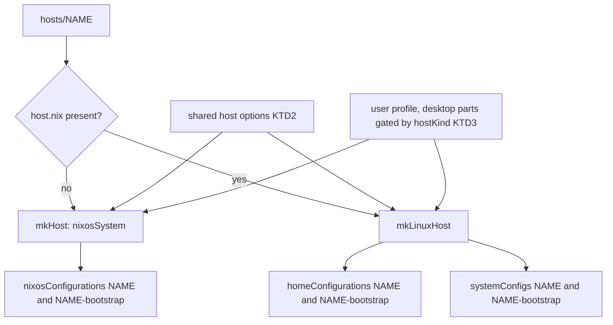
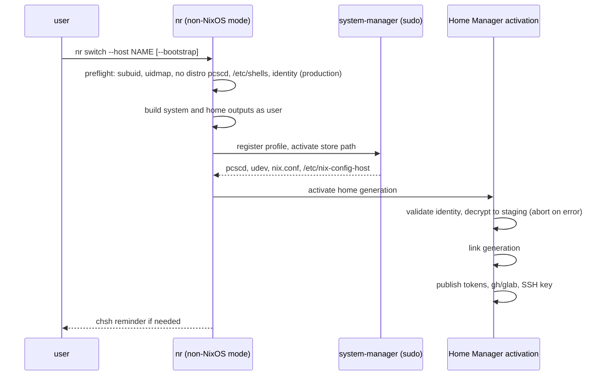

# Non-NixOS Linux Hosts - Plan

## Goal Capsule

- **Objective:** A Linux machine that does not run NixOS, on x86_64 or aarch64, gets the same shell, development tools, coding-agent configuration, Git signing, and CLI authentication as the NixOS hosts, applied declaratively from this flake instead of by hand.
- **Means:** Standalone Home Manager for the user environment and system-manager for the system prerequisites, assembled from the same host directory, traits, and user profile as the NixOS hosts (Key Decisions below).
- **Product authority:** This plan, then `AGENTS.md`, then the [host-generic composition plan](2026-09-28-0203-refactor-host-generic-composition-plan.md) for host discovery and traits. R20 amends the `AGENTS.md` statement that other operating systems are outside the migration. macOS and a Jetson AGX Thor host definition are not active scope.
- **Open blockers:** None.
- **Execution profile:** Nix configuration, checks, CI, and documentation. Evidence comes from builds and VM checks with fake credentials. No real non-NixOS machine is installed or modified.
- **Stop conditions:** Stop and report if any existing NixOS production or bootstrap toplevel changes its store path (R6). Also stop if the foreign-distribution VM driver (U9) cannot boot a non-NixOS image under the flake check's KVM sandbox, or if a new check cannot be made to fail by the mutation it exists to catch.
- **Finishes the work:** `ce-work` implements and verifies. The `lfg` pipeline reviews the work, opens the PR, and watches CI.

---

## Product Contract

### Summary

The flake gains a second host kind: a non-NixOS Linux host on x86_64-linux or aarch64-linux. It lives beside the NixOS hosts, is discovered the same way, and declares its own traits. Each one builds a secret-free bootstrap output and a production output. Standalone Home Manager applies the user environment and system-manager applies the system prerequisites. Desktop configuration stays NixOS-only.

### Problem Frame

The first NixOS plan deferred macOS and generic Linux, noting that they "can share the user environment established here." Since then every non-NixOS machine has been set up by hand, so its shell, Git signing, agent settings, and tokens drift from the NixOS hosts and are rebuilt from memory each time.

The flake cannot produce anything for such a machine today. `flake.nix:36` fixes the system to `x86_64-linux`. Home Manager is reachable only as a NixOS module (`flake.nix:53`). Three user modules read NixOS state through `osConfig`: `home/h82/agents/tokscale.nix`, `home/h82/desktop/kde/autostart.nix`, and `home/h82/desktop/kde/power-lid.nix`. Secrets decrypt only through a root-owned age identity at `/var/lib/sops-nix/key.txt` and a system service. The account is fixed to `h82` at `/home/h82`.

An aarch64 target matters because a Jetson AGX Thor running JetPack is an expected future host. JetPack owns that machine's NVIDIA driver and CUDA stack.

### Key Decisions

- **Shared foundation plus non-NixOS Linux; macOS later.** (session-settled: user-directed — chosen over macOS first, both platforms at once, or the foundation alone: Linux needs no second system framework, and macOS can build on the same foundation next.)
- **One user profile, two assemblies.** NixOS and non-NixOS hosts share the host directory convention, the traits, and `home/`. Governs R1, R3, R5. (session-settled: user-approved — chosen over a separate host root or moving every host to standalone Home Manager: one set of host rules, and the NixOS outputs stay as they are.)
- **Desktop is excluded on non-NixOS hosts.** Governs R8. (session-settled: user-directed — chosen over trait-gated GUI apps with a GPU wrapper, managing only app config files, or matching NixOS: distribution-owned desktops break Nix GUI apps, Fcitx5 addons, and KDE settings.)
- **system-manager owns the system layer.** Governs R9, R10. (session-settled: user-directed — chosen over a user-layer-only setup with a preflight check: more is declarative, at the cost of a root apply step and a new flake input.) Conflict found in planning: subuid and subgid ranges, `/etc/shells`, and the `uidmap` helpers live in files the distribution owns. Declaring them would break R10. R9 therefore checks them before an apply instead of writing them. system-manager still owns pcscd, the udev rules, and `nix.conf`.
- **A user-owned age identity per host.** Governs R12. (session-settled: user-approved — chosen over decrypting with the YubiKey on every apply: routine applies need no card, and the key's protection rests on the distribution's disk encryption.)
- **A separate secret-free bootstrap output.** Governs R14. (session-settled: user-directed — chosen over a production apply that skips secrets when the identity is missing: it matches the NixOS bootstrap model, and production can fail loudly.)
- **A dedicated SSH key per non-NixOS host, delivered as a secret.** Governs R13, R15. (session-settled: user-approved — chosen over one shared key, the 1Password agent, or the YubiKey authentication subkey: it works headless, and a leak revokes one host's key.)
- **Account name and home directory are per host.** Governs R4. (session-settled: user-approved — chosen over a fixed `h82`: work machines and servers may use another account.)
- **aarch64-linux is included; the Thor host definition is not.** Governs R2, R11, R16. (session-settled: user-directed — chosen over x86_64 only, and over adding Thor now as the first host: the foundation must support Thor before a Thor host is written.)
- **Build evidence plus a distribution VM apply check.** Governs R17, R18. (session-settled: user-approved — chosen over builds only or waiting for a real machine: no non-NixOS machine is available yet.)

<!-- ce-section: work-relationships -->
### How This Work Fits Together

This plan covers the shared foundation and non-NixOS Linux hosts. The areas below are the current understanding, not a committed roadmap.

- macOS hosts (nix-darwin with Home Manager on aarch64-darwin)
  - Depends on this plan's shared user profile and host-kind model.
  - Still to decide: how secrets, the desktop, and the system layer map to macOS.
- A Jetson AGX Thor host definition
  - Depends on this plan's aarch64-linux support and R11.
  - Can proceed independently of macOS.
- Desktop support on non-NixOS hosts
  - Depends on this plan's host kind; can proceed independently of macOS.

### Requirements

**Host model**

- R1. A non-NixOS Linux host is a directory beside the NixOS hosts, found by the same discovery rule. The host declares its kind and its architecture instead of having them inferred from its name.
- R2. The supported architectures for non-NixOS hosts are x86_64-linux and aarch64-linux.
- R3. Each non-NixOS host produces a production output and a bootstrap output for both its user environment and its system layer. Adding one requires no edits to `flake.nix`, `modules/`, `home/`, or `tests/`.
- R4. The account name and home directory default to `h82` and `/home/h82`, and a non-NixOS host can override both. Personal identity such as the Git name and email does not change.
- R5. User modules read traits, the bootstrap flag, and the host name from a source that exists under both NixOS and standalone assembly. No module or check branches on a host name.
- R6. Every existing NixOS production and bootstrap output evaluates to the same system as before this work.

**User environment**

- R7. On non-NixOS hosts of either architecture, the user environment includes the shell and CLI development tools, the coding-agent configuration, and GPG with YubiKey Git signing.
- R8. On non-NixOS hosts, no desktop configuration applies: no GUI applications, KDE or Plasma settings, Fcitx5, terminal emulator, VSCodium, Claude Desktop, avatar, or 1Password autostart.

**System layer**

- R9. system-manager declares the system prerequisites that the user environment needs: pcscd and YubiKey device access, and the Nix daemon configuration. Prerequisites that live in distribution-owned files (subuid and subgid ranges, login-shell registration in `/etc/shells`, the `uidmap` setuid helpers) are checked before an apply, which stops with instructions when one is missing.
- R10. The system layer never replaces or edits files or services owned by the distribution. This includes the JetPack NVIDIA driver, CUDA, and their configuration.
- R11. Installing Nix itself is a documented manual prerequisite, because the system layer cannot run before Nix exists.

**Secrets and SSH**

- R12. Each non-NixOS host has its own age identity, encrypted to the YubiKey encryption subkey. It is recovered once into a file the user owns with mode 0600, and later production applies need no card.
- R13. The production apply decrypts the gh and glab authentication and the host's SSH private key, then places them in the user's home, readable only by the user.
- R14. The bootstrap output contains no secrets and applies without the age identity. A production apply without the identity fails, names the missing identity and the recovery step, and prints no secret material.
- R15. Each non-NixOS host's SSH key is unique to that host. Registering its public key with GitHub and servers is a documented manual step. NixOS hosts keep the 1Password SSH agent.

**Verification and documentation**

- R16. Every non-NixOS output on both architectures builds in CI and in the pre-ship build loop that `AGENTS.md` documents.
- R17. A repository check applies the bootstrap and then the production output inside a VM running a non-NixOS distribution on x86_64-linux, using a fake age identity and fake tokens. It asserts that the user environment, the system layer, and the published secrets exist with the required ownership and modes.
- R18. `host-name-guard` and the other trait-driven checks cover non-NixOS hosts. New checks follow the mutation-testing learnings that `AGENTS.md` lists.
- R19. The host-addition guide and the provisioning guide describe the non-NixOS host kind, the bootstrap, recovery, and production sequence, and the manual prerequisites from R11 and R15.
- R20. `AGENTS.md` and the README describe non-NixOS Linux hosts as in scope, and state that macOS remains out of scope.

### Key Flows

- F1. First setup of a new non-NixOS machine
  - **Trigger:** A host directory exists for the machine, its age identity and SSH key are in the repository as secrets, and the distribution is installed.
  - **Steps:** The user installs Nix by hand (R11). They apply the bootstrap output, which brings up GPG, the card tools, and the system prerequisites (R9, R14). With the YubiKey, they recover the host's age identity into their home (R12). They apply the production output, which publishes the tokens and SSH key (R13). They register the SSH public key where it is needed (R15).
  - **Outcome:** Later applies run without the card, and the environment matches the NixOS hosts except for the desktop (R8).
  - **Covered by:** R9, R11, R12, R13, R14, R15
- F2. Routine apply after a repository change
  - **Trigger:** The user pulls a change and applies production.
  - **Steps:** The system layer and the user environment apply from the same host outputs, and secrets decrypt with the stored identity.
  - **Outcome:** No card, no manual copying.
  - **Covered by:** R3, R12, R13

### Acceptance Examples

- AE1. **Covers R14.** Given a machine that has the bootstrap applied and no age identity, when the user applies production, the apply stops before publishing anything, names the missing identity file and the recovery step, and prints no token or key.
- AE2. **Covers R14.** Given the same machine, when the user applies the bootstrap output again, it succeeds without the identity.
- AE3. **Covers R6.** Given the current ThinkPad and MS-7D91 outputs, when this work lands, both production and bootstrap evaluate to the same system as before.
- AE4. **Covers R8, R5.** Given a non-NixOS host that declares the laptop trait, when its user environment is built, no KDE lid setting or other desktop configuration is present.
- AE5. **Covers R10.** Given an aarch64 JetPack host, when the system layer applies, the NVIDIA driver, CUDA, and their configuration files are unchanged.
- AE6. **Covers R2, R7.** Given a tool in the user environment that nixpkgs does not build for aarch64-linux, when an aarch64 host is built, planning has either supplied an aarch64 source for it or recorded that it is omitted on aarch64; the build does not fail.

### Scope Boundaries

- macOS support (nix-darwin, aarch64-darwin) is deferred to its own plan.
- A Jetson AGX Thor host definition and verification on Thor hardware are deferred.
- Desktop configuration on non-NixOS hosts is deferred (R8).
- The system layer does not install Nix, the NVIDIA stack, CUDA, or distribution packages (R10, R11).
- Changing how NixOS hosts apply Home Manager, or their SSH agent, is out of scope (R6, R15).
- An aarch64 VM apply check is out of scope. Emulating aarch64 on x86_64 CI is too slow, so aarch64 is covered by builds (R16).

### Dependencies / Assumptions

- system-manager officially supports Ubuntu and Debian, on both x86_64-linux and aarch64-linux. It has no udev or pcscd module, so both are written as plain unit and rule files. Its Nix module replaces `/etc/nix/nix.conf` whole, which the Nix installer creates; this repository takes that file over with a backup, because Nix configuration is the flake's to own (KTD6). Whether JetPack passes system-manager's Ubuntu distribution check is unverified until a Thor host exists.
- The distribution uses systemd, which both system-manager and the VM check rely on.
- The target machine's disk encryption protects the user-owned age identity and SSH key (R12, R13).
- CI builds aarch64-linux outputs on GitHub's `ubuntu-24.04-arm` runners, which are free for public repositories (KTD13).
- The dev-tool session variables are already exported through `home.sessionVariables` as well as `systemd.user.sessionVariables`, so they reach shells under standalone Home Manager (`home/h82/dev/containers.nix:23`, `home/h82/dev/android.nix:21`, `home/h82/dev/tool-environment.nix:12`).
- `scripts/publish-cli-auth` already refuses root, writes atomically, and never prints token values, so it runs unchanged in user mode (`scripts/publish-cli-auth:81-88`).

### Outstanding Questions

**Deferred to Implementation**

- Can nix-vm-test share the host's `/nix/store` with the Ubuntu guest, or must closures be copied in over ssh? This decides U9's copy step; either route satisfies R17.
- The exact udev rule source for YubiKey access on the non-NixOS system layer. NixOS gets it from `modules/nixos/hardware/yubikey.nix`, and U4 reuses the same packages' rule files.
- Does system-manager restart the installer-owned `nix-daemon` after it replaces `nix.conf`? If not, `nr-linux` must restart it, because the daemon reads the file only at startup.
- Does nix-vm-test's Ubuntu 24.04 image ship `uidmap`? If not, U9's offline guest setup must supply it, because KTD7's preflight blocks even the bootstrap apply without it.

### Sources / Research

- [Initial NixOS plan](2026-09-21-0149-feat-thinkpad-nixos-declarative-environment-plan.md): the scope boundary that deferred macOS and generic Linux.
- [Host-generic composition plan](2026-09-28-0203-refactor-host-generic-composition-plan.md): host discovery, the shared profile, and traits that this plan extends.
- `flake.nix:36`, `flake.nix:46-93`: the fixed system, `mkHost`, and host discovery.
- `home/h82/default.nix:11-38`: the fixed account, and GUI apps mixed into the root package list.
- `home/h82/security/ssh.nix:3-8`: the 1Password `IdentityAgent` that NixOS hosts keep.
- `modules/nixos/system/secrets.nix:14-30,54-162`, `scripts/recover-age-identity`, `scripts/restore-age-identity:18`: the root-owned age identity and the publication path that R12 and R13 reproduce in user mode.
- `modules/nixos/system/base.nix:37,48-49`, `modules/nixos/services/podman.nix:25-27,181-193`: login shell, pcscd, subuid, and setuid helpers on NixOS.
- `tests/lib/configurations.nix`, `tests/host-name-guard.nix`, `tests/bootstrap-recipients.nix:43-78`, `tests/auth-provisioning.nix`: the test helpers and the VM assertion pattern.
- `.github/workflows/check.yml:58-124`, `tests/check-workflow-docs-skip.sh`: the CI jobs and the test that pins their exact shape.
- system-manager: <https://github.com/numtide/system-manager>. nix-vm-test: <https://github.com/numtide/nix-vm-test/blob/main/doc/getting-started.md>.
- [SOPS permissions](../solutions/integration-issues/sops-service-umask-blocks-user-secrets.md), [Home Manager activation](../solutions/best-practices/home-manager-activation-does-not-run-on-every-rebuild.md), [tmpfs GNUPGHOME card provisioning](../solutions/integration-issues/tmpfs-gnupghome-card-provisioning-traps.md), and the check-guard learnings that `AGENTS.md` lists.

Product Contract preservation: changed: R9. Subuid and subgid ranges and login-shell registration are checked before an apply instead of declared, because they live in files that R10 protects. The Dependencies line about system-manager and the Outstanding Questions were resolved in place. All other IDs and meanings are unchanged.

---

## Planning Contract

### Key Technical Decisions

- KTD1. **A `host.nix` marker declares a non-NixOS host.** A host directory that contains `host.nix` evaluates to `{ kind = "linux"; system = "<arch>-linux"; }`. A directory without one stays a NixOS host, so `hosts/ThinkPad-X1-Carbon-Gen-11` and `hosts/MS-7D91` need no edits. Discovery reads the marker with a plain `import`, never by evaluating a module. Governs R1, R2.
- KTD2. **One shared host-option module, imported by every assembly.** It declares `my.bootstrap`, `my.hostName`, `my.kind`, `my.user.name`, `my.user.home`, and each trait's `enable` option, moving those declarations out of the NixOS modules that consume them. NixOS imports it into the system. `mkHost` feeds the Home Manager copy from the system values. The standalone assembly sets the values directly. Every Home Manager reader of `osConfig` switches to `config.my.*`. (session-settled: user-approved — chosen over a separate host root or moving every host to standalone Home Manager: one set of host rules, and the NixOS outputs stay as they are.) Governs R3, R4, R5.
- KTD3. **Desktop parts of the user profile are gated in place by host kind.** The profile is not split into separate roots, because a second root would concatenate the GUI packages as one block and change the interleaved `home.packages` order, and with it the NixOS store paths (R6). Each GUI package in `home/h82/default.nix` is wrapped in place with `lib.optionals` on the host kind. The `./desktop` and `dev/vscodium.nix` imports keep their current positions, made conditional on a `hostKind` special argument that each assembly passes. The gate cannot read `config`, because a conditional import that reads `config` recurses infinitely. Governs R7, R8.
- KTD4. **Outputs mirror the NixOS pair.** Each non-NixOS host produces `homeConfigurations.<host>` and `homeConfigurations.<host>-bootstrap` through `home-manager.lib.homeManagerConfiguration`, with a per-system `pkgs` that allows unfree packages and with `extraSpecialArgs.inputs`. It also produces `systemConfigs.<host>` and `systemConfigs.<host>-bootstrap` through system-manager. The two system outputs are currently identical, because the system layer holds no secrets; both exist so the apply helper and the docs treat every layer the same way. Fixture hosts live under `tests/fixtures/hosts/` and are reached only through `checks`. A fixture under `hosts/` would need real card-encrypted material to satisfy `tests/bootstrap-recipients.nix`. Governs R3, R16, R17.
- KTD5. **Secrets use a Home Manager activation pair, not the sops-nix Home Manager service.** The sops-nix Home Manager module decrypts in a user systemd unit whose failure does not fail `home-manager switch`, which would break R14 and AE1. So a validate step runs before `writeBoundary`: it checks the identity file, decrypts everything into a private staging directory, and aborts the activation on any error before a single link changes. A publish step then runs after `linkGeneration`. Decrypted token files persist in `~/.local/state/cli-auth/` (directory 0700, files 0400), the user-mode counterpart of `/run/secrets/cli-auth`. Tokscale and `docker-credential-sops` read from there on non-NixOS hosts. (session-settled: user-approved — chosen over decrypting with the YubiKey on every apply: routine applies need no card.) Governs R12, R13, R14.
- KTD6. **system-manager owns pcscd, the YubiKey udev rules, and `nix.conf`.** pcscd is a socket and service unit from Nix `pcsclite`, with `PCSCLITE_HP_DROPDIR` pointing at the `ccid` reader drivers, as the NixOS `services.pcscd` module does. udev access is a rules file. `/etc/nix/nix.conf` is taken over with `replaceExisting`, which backs up the installer's copy. The generated file keeps `build-users-group = nixbld`, so builds still run as isolated build users. userborn and every other user-database writer stay disabled. The layer also writes `/etc/nix-config-host`, which records the host name and variant. (session-settled: user-directed — chosen over a user-layer-only setup with a preflight check: more is declarative, at the cost of a root apply step and a new flake input.) Governs R9, R10.
- KTD7. **Distribution-owned prerequisites are checked by the apply helper before it applies anything.** A failed system-manager unit does not fail `system-manager switch`, so a verification unit would pass silently. `nr` checks five things before applying on a non-NixOS host. Each failure stops with a fix-it message:
  1. The user has subuid and subgid ranges.
  2. `newuidmap` and `newgidmap` are setuid.
  3. No distribution `pcscd` unit exists.
  4. `/etc/shells` lists the Home Manager profile's zsh path. The path is stable before that zsh exists, so the check also runs before the first bootstrap.
  5. For production, the identity is present.

  Running `chsh` stays with the user. After the apply, `nr` prints a reminder when the login shell is still not the Nix zsh. Governs R9, R11, R14.
- KTD8. **A separate `nr` script serves non-NixOS hosts under the same command name.** `scripts/nr` and the NixOS aliases stay byte-identical, because `nr` is part of every NixOS host's packages and any edit would change the NixOS store paths (R6). The new script, `scripts/nr-linux`, is installed as `nr` only when the host kind is `linux`. It works as follows:
  1. It detects the host from `/etc/nix-config-host`, never from `/run/current-system`, which system-manager also creates.
  2. On a first run, when the marker is absent, it requires `--host`.
  3. It builds both layers as the invoking user.
  4. Through `sudo`, it registers the system closure in system-manager's profile and activates it, as `system-manager switch` does, so the active layer has a GC root and a rollback generation.
  5. It activates the user layer.

  Root never evaluates the flake. Test-only `NR_SYSTEM_OUT` and `NR_HOME_OUT` overrides skip the build and activate given store paths, following the existing `NR_*` override pattern. Governs F1, F2, R3.
- KTD9. **The per-host SSH key goes to `~/.ssh/id_ed25519_nix_config`.** A dedicated name never clobbers a key the user made. The publish step writes the file atomically at mode 0600, and it refuses to write through a symlink. `~/.ssh/config` names the key with `IdentityFile` and names no agent socket. (session-settled: user-approved — chosen over one shared key, the 1Password agent, or the YubiKey authentication subkey: it works headless, and a leak revokes one host's key.) Governs R13, R15.
- KTD10. **Each host gets its own SSH secret file.** `secrets/hosts/<host>/ssh.yaml` has its own `.sops.yaml` rule listing only that host's recipient. The host's recipient also joins the `tokens.yaml` rule. Governs R15.
- KTD11. **The recovered identity lives at `~/.config/nix-config/age/key.txt`.** A new user-mode installer, `scripts/install-user-age-identity`, writes it: directory 0700, file 0600, owned by the user, no symlinks, and it checks the file against the expected public recipient. `recover-age-identity` gains a `--user` mode that pipes to that installer instead of `sudo` and that requires `--host`. The root installer stays unchanged. Governs R12.
- KTD12. **The VM check boots Ubuntu 24.04 through `numtide/nix-vm-test` on x86_64 with KVM.** This repository has no pattern for booting a foreign distribution. nix-vm-test is the maintained library that system-manager's own VM tests use. A hand-written qemu driver is the fallback only if nix-vm-test cannot run inside `nix flake check`. system-manager's container harness was rejected because it is internal and needs a `uid-range` builder. Governs R17.
- KTD13. **aarch64 is proven on native arm runners.** CI's build matrix carries `{ attr, system }` pairs and sends aarch64 targets to `ubuntu-24.04-arm`. Fixture outputs for aarch64 are exposed as `checks.aarch64-linux.*`, and the rest of the checks stay x86_64. Governs R2, R16.
- KTD14. **The test library gains a Home Manager user list.** `tests/lib/configurations.nix` gets a `userEntries` list that holds the NixOS `home-manager.users.h82` values alongside the standalone `homeConfigurations` of the fixtures. Only the trait-driven and desktop-exclusion checks move onto it. The package-presence checks stay on NixOS entries, and `tests/non-nixos-outputs.nix` asserts the R7 tool set once per fixture instead. The empty-list and bootstrap guards extend to the new list. Governs R5, R18.
- KTD15. **aarch64 gaps are closed per package.** `packages/mise.nix` gets a per-system source and hash, and `scripts/mise-release` learns both assets. The Android SDK is omitted on aarch64, because its tools are x86_64 binaries even though it evaluates. `scripts/claude-code-release` also validates `linux-arm64`. Desktop-only packages that fail on aarch64 are already excluded by KTD3. Governs R2, R7, AE6.

### High-Level Technical Design

Host discovery routes each directory to one assembly. The user profile and host options are shared between them.



First setup and a routine apply both go through `nr`. The production user layer stops before linking anything when the identity or a secret is wrong.



### Output Structure

```text
modules/shared/host.nix                      # KTD2 host options
modules/system-manager/default.nix           # KTD6 system layer
home/h82/security/non-nixos-secrets.nix      # KTD5 activation pair
scripts/install-user-age-identity            # KTD11
scripts/nr-linux                             # KTD8
tests/fixtures/hosts/<x86_64 fixture>/{host.nix,default.nix}
tests/fixtures/hosts/<aarch64 fixture>/{host.nix,default.nix}
tests/non-nixos-vm.nix                       # KTD12
tests/non-nixos-outputs.nix                  # structure and materialized-output checks
```

### Assumptions

- Ubuntu's `useradd` already assigns subuid and subgid ranges to regular users, so the preflight in KTD7 normally passes without a manual step.
- Existing `gh` and `glab` configuration files are replaced by `publish-cli-auth`, as they already are on NixOS.
- Applying bootstrap after production leaves the published secrets in place. Removing them is not built (Scope Boundaries).

### Risks & Dependencies

| Risk | Decision |
| --- | --- |
| nix-vm-test cannot boot a guest inside the `nix flake check` sandbox with KVM | Stop condition. U9 tries it first, and the fallback is a hand-written qemu driver under KTD12. Removing the VM check is not allowed, because R17 is settled. |
| Ubuntu 24.04 AppArmor restricts unprivileged user namespaces for a Nix-installed `podman` | Accepted and documented in U11 as a manual distribution setting. U9 asserts that the Podman prerequisites are present, not that a rootless container runs. |
| JetPack fails system-manager's Ubuntu distribution check | Accepted until a Thor host exists (deferred). `allowAnyDistro` is the documented escape. |
| system-manager is younger than NixOS, and its option surface may shift under `flake.lock` updates | The U4 materialized-output checks and U9 catch regressions on each lock bump. |
| Moving trait declarations changes NixOS evaluation order and store paths | Stop condition, enforced by the `drvPath` comparison in U1 and U2. |
| Plaintext tokens and the SSH key persist on disk | Accepted in R12 and R13. Directory 0700 and files 0400 or 0600. |

### Sequencing

U1 → U2 → U3 lays the shared foundation. U4, U5, U6, and U8 can start once U3 lands. U7 waits for U4 and U6. U9 waits for U4, U6, and U7. U10 waits for U5 and U8, and U11 waits for U7 and U9. Each unit's Dependencies field is authoritative. U1 and U2 must land before any non-NixOS output exists, so the R6 derivation-path comparison runs on a pure refactor first, and every later unit keeps that comparison green.

---

## Implementation Units

### U1. Shared host options and removal of `osConfig`

- **Goal:** Host facts and traits come from one option module that NixOS and both Home Manager assemblies import.
- **Requirements:** R4, R5, R6; KTD2.
- **Dependencies:** none.
- **Files:**
  - Create `modules/shared/host.nix`.
  - Modify `modules/nixos/profile.nix`, the trait-declaring modules under `modules/nixos/hardware/`, `flake.nix` (`mkHost` inline module), `home/h82/agents/tokscale.nix`, `home/h82/desktop/kde/autostart.nix`, `home/h82/desktop/kde/power-lid.nix`, `home/h82/default.nix` (`home.username` and `home.homeDirectory` from `my.user`), and `home/h82/dev/containers.nix` (`REGISTRY_AUTH_FILE` from `config.home.homeDirectory`).
  - Test: `tests/host-options.nix`.
- **Approach:**
  1. Move each `my.*.enable` declaration and `my.bootstrap` into `modules/shared/host.nix`, and add `my.hostName`, `my.kind` (default `nixos`), and `my.user.{name,home}` (defaults `h82` and `/home/h82`).
  2. Import the module into the NixOS profile and into Home Manager through `home-manager.sharedModules`. The Home Manager copy is set from the NixOS values.
  3. Replace every `osConfig` read under `home/` with `config.my.*`.
  4. `autostart.nix` still needs the 1Password GUI package. Pass it through a Home Manager option set from NixOS, or take it from `pkgs`, whichever keeps the store path.
- **Execution note:** Record the `drvPath` of all four NixOS toplevels before the first edit. This unit is complete only when they are byte-identical afterwards.
- **Patterns to follow:** `modules/nixos/hardware/laptop.nix` for trait declarations; `tests/keyd-remap.nix` for trait-driven expectations.
- **Test scenarios:**
  - Covers AE3. The `drvPath` of each of the four NixOS toplevels equals its recorded pre-change value.
  - No file under `home/` contains `osConfig` after the change.
  - Under NixOS, the Home Manager `my.laptop.enable` equals the system value for every host, including one where it is `false`.
- **Verification:** Every existing check passes, and the four `drvPath`s match.

### U2. Desktop gating by host kind

- **Goal:** Non-NixOS hosts can import the user profile without any desktop configuration.
- **Requirements:** R7, R8, R6; KTD3.
- **Dependencies:** U1.
- **Files:**
  - Modify `home/h82/default.nix`, `home/h82/dev/default.nix`, and `flake.nix` (`mkHost` passes `hostKind = "nixos"` through `home-manager.extraSpecialArgs`).
  - Test: `tests/host-options.nix`.
- **Approach:**
  1. Wrap each GUI package in `home/h82/default.nix:15-38` in place with `lib.optionals` on the host kind, so the list keeps its order. The packages are discord, google-chrome, kleopatra, ksshaskpass, okular, libreoffice-qt, telegram-desktop, yubioath-flutter, claude-desktop, and orca.
  2. Make the `./desktop` import and the `vscodium.nix` import conditional on `hostKind`, keeping their current positions.
  3. `nr` stays where it is. U7 swaps the package behind it on non-NixOS hosts only.
- **Test scenarios:**
  - Covers AE3. The four NixOS `drvPath`s are unchanged.
  - Covers AE4. A standalone evaluation with `hostKind = "linux"` and `my.laptop.enable = true` contains no `kdePowerLid` activation, no Plasma files, and none of the GUI packages above.
- **Verification:** The desktop package checks still pass on NixOS entries, and the drvPaths match.

### U3. Host kind discovery and non-NixOS outputs

- **Goal:** A directory with `host.nix` produces Home Manager and system-manager outputs in both variants, for either architecture.
- **Requirements:** R1, R2, R3, R16; KTD1, KTD4.
- **Dependencies:** U2.
- **Files:**
  - Modify `flake.nix` (new inputs `system-manager` and `nix-vm-test`, `mkLinuxHost`, discovery split by kind, `homeConfigurations`, `systemConfigs`) and `flake.lock`.
  - Modify `tests/lib/directories.nix` if discovery needs a helper.
  - Create `tests/fixtures/hosts/<x86_64 fixture>/` and `tests/fixtures/hosts/<aarch64 fixture>/`, choosing names that pass `host-name-guard` as substrings.
  - Test: `tests/non-nixos-outputs.nix`.
- **Approach:**
  1. Split `hostNames` by the KTD1 marker.
  2. `mkLinuxHost { hostName, bootstrap, dir }` builds `homeManagerConfiguration` (shared options, `home/h82` with `hostKind = "linux"` passed as a special argument, the host's `default.nix`, and `my.kind = "linux"`) and system-manager's configuration from `modules/system-manager`.
  3. Fixtures reuse `mkLinuxHost` through a flake-internal attribute, so the real and fixture paths cannot diverge.
  4. Expose fixture activation packages under `checks.<system>`.
- **Patterns to follow:** `flake.nix:46-93` for `mkHost` and the bootstrap pairing.
- **Test scenarios:**
  - A fixture with `system = "aarch64-linux"` produces a Home Manager activation package whose `system` is `aarch64-linux`.
  - The NixOS host list still contains exactly the two existing hosts, and non-NixOS hosts never appear in `nixosConfigurations`.
  - A `host.nix` with an unsupported `system` value fails evaluation with a message naming the host.
  - Every fixture yields four outputs, and their names end in the expected `-bootstrap` pairing.
- **Verification:** `nix flake check` passes, and the fixture activation packages build for x86_64.

### U4. system-manager system layer

- **Goal:** One system-manager module provides pcscd, YubiKey device access, the Nix daemon configuration, and the host marker, and touches no distribution-owned file.
- **Requirements:** R9, R10; KTD6.
- **Dependencies:** U3.
- **Files:**
  - Create `modules/system-manager/default.nix`.
  - Test: `tests/non-nixos-outputs.nix`.
- **Approach:**
  1. Write pcscd socket and service units from `pcsclite`, with `PCSCLITE_HP_DROPDIR` set to a `buildEnv` of `ccid`'s drivers, following the NixOS `services.pcscd` module. Add a udev rules file from the same packages `modules/nixos/hardware/yubikey.nix` uses.
  2. Set `nix.settings` to match the NixOS base settings plus `build-users-group = nixbld`, with `replaceExisting` on `/etc/nix/nix.conf`.
  3. Write `/etc/nix-config-host`.
  4. Leave userborn disabled.
- **Patterns to follow:** `modules/nixos/system/base.nix` for the Nix settings.
- **Test scenarios:**
  - The materialized system output contains the pcscd units with a non-empty `ExecStart`, not merely the unit files (see the masked-unit learning).
  - Covers AE5. The system output manages no path under `/etc/passwd`, `/etc/group`, `/etc/shadow`, `/etc/subuid`, `/etc/subgid`, `/etc/shells`, or `/etc/nvidia*`, and no `/usr` path.
  - `/etc/nix-config-host` records the host name and variant for both variants.
  - The pcscd service environment names a driver directory that contains the `ccid` bundle.
  - The materialized `nix.conf` contains `build-users-group = nixbld`, and its `trusted-users` names only `root`.
- **Verification:** The system outputs build on both architectures.

### U5. aarch64 package coverage

- **Goal:** The portable user root builds on aarch64-linux.
- **Requirements:** R2, R7, AE6; KTD15.
- **Dependencies:** U3.
- **Files:**
  - Modify `packages/mise.nix`, `packages/mise-release.json`, `scripts/mise-release`, `home/h82/dev/android.nix` (omit on aarch64), and `scripts/claude-code-release`.
  - Tests: `tests/test_mise_release.py` and the existing claude-code release test.
- **Approach:**
  1. Replace the single mise source with a per-system map for `linux-x64-musl` and `linux-arm64-musl`.
  2. The release helper resolves and hashes both assets.
  3. Guard the Android module on the host platform.
  4. mise is in every NixOS host's packages, so its x86_64 derivation must keep the same URL, hash, and attributes (R6).
- **Test scenarios:**
  - The four NixOS `drvPath`s are unchanged.
  - `mise-release` writes a hash for both systems, and it fails when either asset is missing from the release.
  - `claude-code-release` rejects a manifest that lacks `linux-arm64`.
  - Covers AE6. The aarch64 fixture's user environment builds, and it contains no Android SDK package.
- **Verification:** The aarch64 fixture's Home Manager activation package builds on an aarch64 builder (U10).

### U6. Non-NixOS secrets and SSH

- **Goal:** A production apply publishes the tokens and the host's SSH key from a user-owned identity, and it fails cleanly without one.
- **Requirements:** R12, R13, R14, R15, AE1, AE2; KTD5, KTD9, KTD10, KTD11.
- **Dependencies:** U3.
- **Files:**
  - Create `home/h82/security/non-nixos-secrets.nix` and `scripts/install-user-age-identity`.
  - Modify `scripts/recover-age-identity`, `home/h82/security/ssh.nix`, `home/h82/security/default.nix`, `home/h82/agents/tokscale.nix` (token path per kind), `modules/nixos/system/secrets.nix` (move the `docker-credential-sops` package to a place both kinds can use), `.sops.yaml`, and `secrets/README.md`.
  - Tests: `tests/test_install_user_age_identity.py`, `tests/age-identity-helpers.sh`, and `tests/non-nixos-outputs.nix`.
- **Approach:**
  1. The validate entry runs before `writeBoundary`. It requires the identity to be a regular file that the user owns with mode 0600 and that is not a symlink. It decrypts `tokens.yaml` and the host SSH file into a staging directory under `$XDG_RUNTIME_DIR`, validates the token schema, and exits non-zero with the recovery command on any failure, without printing values.
  2. The publish entry runs after `linkGeneration`. It moves the tokens into `~/.local/state/cli-auth/`, runs `publish-cli-auth --home "$HOME"`, and writes the SSH key per KTD9.
  3. Both entries are disabled in the bootstrap variant.
  4. On non-NixOS, `ssh.nix` writes `IdentityFile ~/.ssh/id_ed25519_nix_config` and omits the 1Password files.
  5. Add a `.sops.yaml` rule per host SSH file.
  6. Every NixOS-side value this unit touches keeps its current rendering, including the tokscale token path, the `docker-credential-sops` routing table, and the NixOS `ssh.nix` output, so the four NixOS `drvPath`s stay unchanged (R6).
- **Execution note:** Read the SOPS permissions and GNUPGHOME learnings before writing either script.
- **Patterns to follow:** `scripts/restore-age-identity` for the recipient check and atomic install; `tests/auth-provisioning.nix` for fixture encryption with a canary token.
- **Test scenarios:**
  - `install-user-age-identity` installs a valid identity at mode 0600 in a 0700 directory.
  - It refuses a symlinked target, a directory owned by someone else, and an identity whose public recipient differs from the recorded one. In each case it leaves any existing file untouched.
  - `recover-age-identity --user` without `--host` exits non-zero, and in dry-run mode it pipes to the user installer and never to `sudo`.
  - Covers AE1. The production activation without an identity exits non-zero, names `~/.config/nix-config/age/key.txt` and the recovery command, leaves no token or key file behind, and changes no Home Manager link.
  - Covers AE1. An identity that is not a recipient of the files fails the same way, and its output contains no canary token.
  - Covers AE2. The bootstrap activation succeeds with no identity present.
  - The publish step writes `~/.ssh/id_ed25519_nix_config` at mode 0600 and refuses to write when that path is a symlink.
  - The four NixOS `drvPath`s are unchanged.
- **Verification:** Unit tests pass, and U9 exercises the whole flow.

### U7. `nr` non-NixOS apply mode

- **Goal:** One command applies both layers on a non-NixOS host, with the preflight from KTD7.
- **Requirements:** R9, R11, R14, F1, F2; KTD7, KTD8.
- **Dependencies:** U4, U6.
- **Files:**
  - Create `scripts/nr-linux` and its package, installed as `nr` only when the host kind is `linux`.
  - Modify the package list in `home/h82/default.nix` to choose between the two `nr` packages. `scripts/nr` and the aliases in `home/h82/shell/shell.nix` stay byte-identical.
  - Test: `tests/nr-linux.sh`.
- **Approach:**
  1. Take the host from `/etc/nix-config-host` or from `--host`.
  2. Run the KTD7 preflight.
  3. Build both outputs as the user, unless `NR_SYSTEM_OUT` and `NR_HOME_OUT` supply prebuilt store paths.
  4. Through `sudo`, register the system closure in system-manager's profile and activate it. Then run the Home Manager activation.
  5. Print the `chsh` reminder when the login shell is not the Nix zsh.
  6. Accept the same subcommands the existing aliases pass to `nr`.
- **Test scenarios:**
  - With the marker absent and no `--host`, `nr` exits non-zero before building anything.
  - A missing subuid range, a non-setuid `newuidmap`, a present distro `pcscd` unit, or an `/etc/shells` without the profile zsh each stops `nr` with that item's fix-it message, and the system layer is not activated.
  - A production run without the identity stops in the preflight.
  - When `/run/current-system` exists alongside the marker, `nr` still chooses the non-NixOS mode.
  - With `NR_SYSTEM_OUT` and `NR_HOME_OUT` set, `nr` runs no build and activates exactly those paths.
  - The four NixOS `drvPath`s are unchanged, which proves the NixOS `nr` is untouched.
- **Verification:** Script tests pass, and U9 drives `nr` through activation with prebuilt paths.

### U8. Test library and guards for two host kinds

- **Goal:** Home Manager checks cover every host kind, and system and desktop checks cover NixOS entries only.
- **Requirements:** R5, R18; KTD14.
- **Dependencies:** U3.
- **Files:**
  - Modify `tests/lib/configurations.nix`, `flake.nix` (move the trait-driven and desktop-exclusion checks onto `userEntries`), `tests/host-name-guard.nix` (also read `tests/fixtures/hosts/` names), and `tests/bootstrap-recipients.nix`.
- **Approach:**
  1. `userEntries` carries `{ name, kind, bootstrap, user }`.
  2. Move these checks onto `userEntries`:
     - the laptop-trait Home Manager assertions
     - gpg-agent-no-cache
     - session-variables
     - zsh-prezto, whose literal `/home/h82` becomes the entry's home directory

     The package-presence checks stay on NixOS entries.
  3. For each non-NixOS host under `hosts/`, `bootstrap-recipients.nix` checks three things:
     - The recipients recorded inside the encrypted `secrets/hosts/<host>/ssh.yaml` are exactly that host's `recipient.txt`.
     - The host's recipient appears in the `tokens.yaml` rule.
     - It does not appear in the `wifi.yaml` or `tailscale.yaml` rules.
- **Execution note:** Mutation-test each moved check once against a non-NixOS entry, per the check-guard learnings.
- **Test scenarios:**
  - The `userEntries` guard fails when the list is empty or has no bootstrap entry.
  - Deleting `gpg-agent-no-cache`'s setting from the user profile turns the check red for the non-NixOS fixture, not only for NixOS entries.
  - `host-name-guard` fails when a fixture's name appears in `home/`.
  - Adding a second recipient to a fixture host's `ssh.yaml` turns `bootstrap-recipients` red.
  - Adding a non-NixOS host's recipient to the `wifi.yaml` rule turns `bootstrap-recipients` red.
- **Verification:** `nix flake check` passes, and each recorded mutation turns its check red.

### U9. Foreign-distribution VM check

- **Goal:** Prove on a real Ubuntu 24.04 guest that bootstrap, recovery, and production apply as specified.
- **Requirements:** R17, R10, AE1, AE2, AE5; KTD12.
- **Dependencies:** U4, U6, U7.
- **Files:**
  - Create `tests/non-nixos-vm.nix`.
  - Modify `flake.nix` (register the check on x86_64).
- **Approach:**
  1. Use nix-vm-test's Ubuntu 24.04 image. The guest user is a non-default account with uid 1001, to exercise R4, and has a lingering systemd user session so `XDG_RUNTIME_DIR` exists.
  2. Guest setup plays the part of the manual prerequisites (R11). It installs Nix from an offline source, adds `/etc/shells` registration, and makes sure `uidmap` is present.
  3. Build the fixture's system and home activation packages on the host, and deliver their closures to the guest.
  4. Build fixture secrets in a derivation with a fake age key and a canary token, as `tests/auth-provisioning.nix` does.
  5. Checksum a set of distribution-owned files before the first apply.
  6. Drive `nr` with `NR_SYSTEM_OUT` and `NR_HOME_OUT` through this sequence: bootstrap, production without the identity (must fail), a non-recipient identity (must fail), a valid identity, production, a second production run, bootstrap, and production again.
  7. Flake evaluation and building are covered by U3 and U10, not here.
- **Test scenarios:**
  - After each successful apply, system-manager's profile points at the active system closure.
  - Covers AE2. The bootstrap apply succeeds, pcscd's socket is active, and `/etc/nix-config-host` names the bootstrap variant.
  - Covers AE1. Production without the identity exits non-zero, and no file exists under `~/.local/state/cli-auth/` or at the SSH key path.
  - Covers AE5. `/etc/passwd`, `/etc/group`, `/etc/subuid`, `/etc/subgid`, and `/etc/shells` keep their checksums after every apply.
  - After a valid production apply, `~/.config/gh/hosts.yml` and `~/.config/glab-cli/config.yml` are mode 0600 and owned by the account. The SSH key is 0600. `ssh -G` names the managed `IdentityFile`. The journal and apply output contain no canary token.
  - A second production apply of the same generation succeeds and leaves the files unchanged.
- **Verification:** The check passes under `nix flake check` with KVM, and it fails when the U6 validate step is removed.

### U10. CI coverage for both architectures

- **Goal:** Every non-NixOS output, and each aarch64 fixture, builds in CI on its native architecture.
- **Requirements:** R16; KTD13.
- **Dependencies:** U5, U8.
- **Files:**
  - Modify `.github/workflows/check.yml` and `tests/check-workflow-docs-skip.sh`.
- **Approach:**
  1. Widen the `hosts` job to emit `{ attr, system }` for `nixosConfigurations`, `homeConfigurations`, and `systemConfigs`, plus the aarch64 fixture checks.
  2. The build job's `runs-on` picks `ubuntu-24.04-arm` for aarch64.
  3. Keep the fail-open `if:` and the `fromJSON` matrix form that `check-workflow-docs-skip.sh` pins, and extend that test in the same change.
- **Test scenarios:**
  - `check-workflow-docs-skip.sh` accepts the new workflow.
  - It fails when the arm build job drops the fail-open condition.
- **Verification:** The PR's CI run shows green aarch64 build jobs.

### U11. Documentation and scope statements

- **Goal:** A reader can add and set up a non-NixOS host from the docs alone.
- **Requirements:** R11, R15, R19, R20.
- **Dependencies:** U7, U9.
- **Files:**
  - Modify `AGENTS.md`, `README.md`, `docs/adding-a-host.md`, `docs/provisioning.md`, `docs/verification.md`, `secrets/README.md`, and `CONCEPTS.md` if a term shifts.
- **Approach:**
  1. `adding-a-host.md` gains a non-NixOS variant: choose the name, `host.nix`, bootstrap material, the per-host SSH file, the checks, then the F1 sequence.
  2. `provisioning.md` gains the user-mode recovery and SSH key registration.
  3. Every copy of the pre-ship build loop also builds `homeConfigurations` and `systemConfigs`.
  4. `provisioning.md` and `secrets/README.md` gain a compromise and decommission procedure for a non-NixOS host, in four steps:
     1. Revoke its SSH public key.
     2. Rotate every token in `tokens.yaml`.
     3. Remove its recipient from `.sops.yaml` and run `sops updatekeys`.
     4. Delete `secrets/hosts/<host>/` and `secrets/bootstrap/<host>/`.

     The procedure states that removing a recipient without rotating the tokens revokes nothing, because git history keeps the old ciphertext.
  5. The Ubuntu AppArmor user-namespace setting for rootless Podman is documented as a manual distribution setting.
- **Test expectation:** none -- documentation only. `markdown-lint` covers the format.
- **Verification:** `nix flake check` passes, including `markdown-lint`.

---

## Verification Contract

| Gate | Command | Proves |
| --- | --- | --- |
| Format | `nix fmt -- --ci` | Nix formatting |
| Checks | `nix flake check` (Linux with `/dev/kvm`) | All unit, materialized-output, and VM checks, including U9 |
| NixOS unchanged | compare `nix eval --raw .#nixosConfigurations.<name>.config.system.build.toplevel.drvPath` for all four before and after | R6, AE3 |
| NixOS builds | the `AGENTS.md` loop over `nixosConfigurations` | Existing hosts still build |
| Non-NixOS builds | build each fixture's Home Manager and system activation package; the aarch64 set on an aarch64 builder or in CI | R16, R2 |
| Mutation rounds | break U6's validate step, U4's unit `ExecStart`, and one moved check per U8 | New checks guard what they claim |

Hardware verification on a real non-NixOS machine is out of scope and reported as not performed.

---

## Definition of Done

- Every unit's test scenarios exist and pass, and `nix flake check` is green with KVM.
- The four NixOS toplevel `drvPath`s are identical to their values before U1.
- x86_64 and aarch64 fixture outputs build, aarch64 in CI on the arm runner.
- The U9 VM check passes, and it fails with the validate step removed.
- The documentation from U11 is merged, with no remaining claim that other operating systems are out of scope, except macOS.
- No abandoned-approach code, unused fixture, or debug output remains in the diff.

---

## Scope Boundaries (planning additions)

Considered and not built:

- Removing published secrets when bootstrap is applied after production. Nothing in the request asks for it, and the files stay user-only. Build it if a host must drop to secret-free state in place.
- Custom rollback beyond what system-manager and Home Manager already provide. Their own generations cover it, so there is no evidence a wrapper is needed.
- A system-manager verification unit for distribution prerequisites. A failed unit does not fail the switch, so it would add a check that cannot fail the apply. KTD7 replaces it.
- A recorded fingerprint guard on the SSH key file. The dedicated file name already avoids clobbering the user's own keys, and a wrong key shows up on the next SSH attempt. Build it only if a second writer of that path appears.
