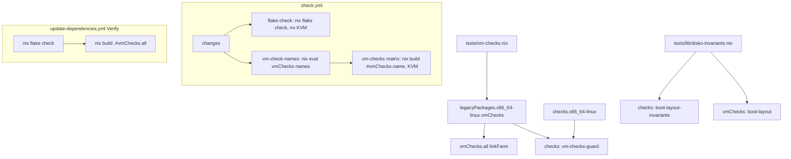

# Separate NixOS VM Tests from Flake Check - Plan

## Goal Capsule

- **Objective:** a developer gets a fast `nix flake check` result on any Linux machine, including one without KVM, and a pull request shows evaluation-level failures and VM-test failures as separate CI results, while every VM test still runs in CI on every non-docs-only PR and on every push to `main`.
- **Means:** move the five VM tests from `checks.x86_64-linux` to `legacyPackages.x86_64-linux.vmChecks`, build them in a dedicated `vm-checks` CI matrix, and add a guard check that keeps them out of `checks` (KTD1, KTD4, KTD5).
- **Authority:** the Requirements below win on behavior. KTDs win on mechanism within them. A unit overrides neither.
- **Stop conditions:** stop and report if a `vmChecks` entry does not carry `nixos-test` at the path KTD4 reads, or if `nix build .#vmChecks.<name>` does not resolve through `legacyPackages`.
- **Execution profile:** Nix, GitHub Actions YAML, one shell check script, and documentation. Local proof is evaluation, `nix flake check`, the VM builds (this machine has `/dev/kvm` and the `kvm` and `nixos-test` features), and mutation rounds on the new checks. CI is the proof for the workflow wiring.
- **Finishing:** the implementer verifies and ships the change as one pull request that closes issue #140.

---

## Product Contract

### Summary

`nix flake check` stops building NixOS VM tests. The five VM tests move to a separate flake attribute set, `vmChecks`, which developers build with `nix build .#vmChecks.<name>` or `nix build .#vmChecks.all`. CI builds them in their own job, one matrix entry per test, under the same docs-only gate as the other Nix jobs. A guard check in `checks` fails if a VM test is registered under `checks` again. The per-host disko invariants that `boot-layout` checks at evaluation time stay in `nix flake check` as a fast check. The update-dependencies workflow, which lands on `main` without a pull request, builds the VM tests as part of its verification.

### Problem Frame

`nix flake check` builds every entry under `checks.x86_64-linux`, including five NixOS VM tests: `auth-provisioning`, `wifi-provisioning`, `tailscale-provisioning`, `podman-registry-auth` (each `pkgs.testers.nixosTest`), and `boot-layout` (disko's `makeDiskoTest`). They need `/dev/kvm` and the `nixos-test` and `kvm` system features, and they dominate the run time. Local `nix flake check` is slow and fails on machines without KVM. In CI, the `flake-check` job runs the fast checks and the VM boots in one job, so a quick regression waits behind the VMs and a VM failure hides behind the same red job (issue #140).

### Requirements

**Flake check**

- R1. `nix flake check` builds no NixOS VM test.
- R2. A guard check under `checks` fails when any `checks` entry is a NixOS VM test, naming the offending entry.
- R3. Every host's `hosts/<host>/disko.nix` is still checked against the boot invariants by `nix flake check`.

**VM tests stay runnable**

- R4. Each VM test builds on its own with `nix build .#vmChecks.<name>`, and `nix build .#vmChecks.all` builds every one of them.
- R5. Every VM test is built in CI on every pull request that is not docs-only and on every push to `main`.
- R6. A VM test added to `vmChecks` joins CI without a workflow edit.
- R7. The update-dependencies workflow does not push to `main` unless every VM test built.

**CI wiring**

- R8. The VM-test CI job uses the same fail-open docs-only gate as `flake-check`, `hosts`, and `build`, and `tests/check-workflow-docs-skip.sh` asserts it.
- R9. The `flake-check` job no longer configures KVM or the `nixos-test` and `kvm` system features.

**Documentation**

- R10. `AGENTS.md`, `README.md`, `docs/verification.md`, `docs/adding-a-host.md`, `docs/recovery.md`, and `docs/provisioning.md` document how to run the VM tests locally, the documented pre-ship commands still cover them, and no document still names a VM test under `.#checks`.

### Scope Boundaries

- The VM tests' contents do not change. Only where they are registered and how they are built changes.
- The `build` matrix and the `hosts` lister job do not change.
- A guard that the `flake-check` job never re-enables KVM is not built: a job that keeps the KVM setup is only slower, never wrong, and R1 plus R2 already keep VM tests out of `nix flake check`.
- A dedicated CI cache (Cachix or similar) for VM closures is not added. The matrix entries each fetch their own closures, as the `build` matrix already does.
- Branch-protection settings live in GitHub, not in the repository. If `flake-check` is a required status, it stays a job of the same name.
- Forcing the VM tests' evaluation from `nix flake check` is not built. Without it, an evaluation error in a VM test's node configuration surfaces only in the `vm-checks` CI job, which runs on every non-docs-only PR, and in a local `nix build .#vmChecks.<name>`. Evidence that such errors reach `main` unnoticed would change this call.
- `nix flake check --no-build` no longer catches a broken host disk layout, because `boot-layout-invariants` reports problems from its builder (KTD3). `nix flake check` still does.

### Success Criteria

- `nix flake check` passes on a machine whose Nix lacks the `nixos-test` and `kvm` system features.
- On a pull request, a VM test failure shows up as a failed `vm-checks (<name>)` entry while `flake-check` stays green.

---

## Planning Contract

### Key Technical Decisions

- KTD1. **Register VM tests under `legacyPackages.x86_64-linux.vmChecks`, not a top-level `vmChecks` output.** `nix flake check` evaluates neither, but a top-level unknown output prints `warning: unknown flake output 'vmChecks'` on every run (checked with Nix 2.34.8). `nix build .#vmChecks.<name>` resolves through `legacyPackages` without the system in the path. Governs R1, R4.
- KTD2. **Define the VM tests once in `tests/vm-checks.nix`.** It returns the attribute set of the five tests. `flake.nix` exposes it with an `all` aggregate built by `pkgs.linkFarm` from the same set, and the guard reads the same set as its positive control, so the aggregate and the guard cannot drift from the list. Governs R2, R4.
- KTD3. **Split boot-layout's per-host invariants into their own fast check, `boot-layout-invariants`.** The invariant logic moves to `tests/lib/disko-invariants.nix`, which `tests/boot-layout.nix` keeps using for its first-disk selection. The new check reports each broken invariant from inside the builder and exits non-zero, rather than throwing at evaluation, following `unguarded-derivation-interpolation-defeats-nix-check-mutation-testing.md`. Governs R3.
- KTD4. **The guard, `vm-checks-guard`, detects a VM test by `nixos-test` in its system features.** That feature is what makes a check need KVM and what slows `nix flake check`, so it is the property the guard protects. The locked nixpkgs wraps test results in `lib.lazyDerivation`, so the top-level `requiredSystemFeatures` is absent. The features sit at `config.rawTestDerivation.requiredSystemFeatures`, which reads `["kvm","nixos-test"]` for both `auth-provisioning` and `boot-layout`. The guard reads that path, then the top-level attribute, then `[]`. The guard reads `self.checks.x86_64-linux` with its own name removed by `builtins.removeAttrs`, which does not force the removed value, so it never evaluates itself. It also asserts that every `vmChecks` entry except `all` carries the feature and that the set is non-empty, so the detector cannot pass by matching nothing (`mutation-testing-reveals-decorative-nix-check-assertions.md`). Offending names are computed at evaluation time and reported inside the builder. The builder text carries only names, never a VM derivation's store path, so building the guard never builds a VM test. Governs R2.
- KTD5. **CI builds VM tests in a `vm-checks` matrix fed by a `vm-check-names` lister job**, mirroring `hosts` → `build`. The lister evaluates the `vmChecks` attribute names without `all`, and its step fails on an empty list, because an empty matrix would skip `vm-checks` and leave the run green with no VM evidence. A matrix over names isolates each failure and runs the tests in parallel. A literal list in YAML would need a second edit for each new test (R6). Both jobs carry the exact fail-open `if:` that `flake-check` carries. Governs R5, R6, R8.
- KTD6. **`flake-check` drops `chmod 666 /dev/kvm` and the `nixos-test`/`kvm` features**, keeping `big-parallel benchmark` and the disk cleanup step. Several fast checks still read built system closures. Governs R9.
- KTD7. **update-dependencies builds `.#vmChecks.all` inside its existing Verify step and appends to `check.log`.** A separate log file would need a new `.gitignore` entry, or the push step's catch-all `git add -A` would commit it (`tests/update-dependencies-push-order.sh` guards this for `fmt.log` and `check.log`). The fixer prompt in the same workflow names the VM build alongside `nix flake check`. Governs R7.

### High-Level Technical Design

### Assumptions

- The other three `pkgs.testers.nixosTest` results carry the same `config.rawTestDerivation` path as `auth-provisioning`. The guard's positive control proves this on its first build.
- The aggregate `all` does not need `nixos-test` itself. Its dependencies do, so building it still requires KVM.
- No branch-protection rule requires a job that this change renames. `flake-check` keeps its name.

### Sequencing

U1 and U2 change `flake.nix` and can land in either order. U3 and U4 depend on U1's attribute path. U5 documents the final commands.

---

## Implementation Units

### U1. Move the VM tests to `vmChecks` and guard `checks`

- **Goal:** `nix flake check` builds no VM test, each VM test builds under `.#vmChecks.<name>`, and a guard keeps them out of `checks`.
- **Requirements:** R1, R2, R4, KTD1, KTD2, KTD4.
- **Dependencies:** none.
- **Files:** `tests/vm-checks.nix` (new), `flake.nix`, `tests/vm-checks-guard.nix` (new).
- **Approach:**
  1. Create `tests/vm-checks.nix` taking `{ pkgs, inputs }` and returning the five imports now in `flake.nix`.
  2. In `flake.nix`, remove the five entries from `checks.${system}` and add `legacyPackages.${system}.vmChecks`: the set plus an `all` `linkFarm`.
  3. Add `vm-checks-guard` to `checks`, implemented in `tests/vm-checks-guard.nix` per KTD4, taking `self` and the VM set.
  4. Collect every offending name and every undetected `vmChecks` entry before failing, so one red build names all of them.
- **Patterns to follow:** the `import ./tests/<name>.nix { inherit pkgs self; }` shape; `tests/host-name-guard.nix` for a guard over the flake itself; the `fail=1` collect-then-exit idiom in `flake.nix`.
- **Test scenarios:**
  - Happy path: on the finished tree, `vm-checks-guard` builds green.
  - Error path: re-adding `auth-provisioning` to `checks` turns the guard red inside the builder, with a message naming `auth-provisioning`.
  - Error path: re-adding `boot-layout` to `checks` turns the guard red, proving the disko test is detected too.
  - Error path: changing the detected feature name in the guard to one no derivation carries turns the guard red through the positive control, naming every `vmChecks` entry as undetected.
  - Edge case: an empty VM set fails the guard with a message that the set is empty.
  - Integration: the guard's `.drv` lists no VM test derivation among its input derivations, so building it never starts a VM.
  - Integration: `nix eval .#checks.x86_64-linux --apply builtins.attrNames` lists none of the five names, and `nix eval .#vmChecks --apply builtins.attrNames` resolves through `legacyPackages` and lists all five plus `all`.
- **Execution note:** run each mutation in a scratch copy made per `copied-git-worktree-writes-the-real-index.md`, and read the failure from `nix log` to confirm it came from the builder, not the evaluator.
- **Verification:** `nix flake check` passes without building a VM, the mutation rounds above go red with the guard's own messages, and `nix build .#vmChecks.<name>` works for each name on a KVM machine.

### U2. Keep the per-host boot invariants in `nix flake check`

- **Goal:** a broken `hosts/<host>/disko.nix` still fails `nix flake check`.
- **Requirements:** R3, KTD3.
- **Dependencies:** none.
- **Files:** `tests/lib/disko-invariants.nix` (new), `tests/boot-layout.nix`, `tests/boot-layout-invariants.nix` (new), `flake.nix`.
- **Approach:**
  1. Move `diskOf`, `expectedSubvolumes`, `layoutProblems`, and the host list out of `tests/boot-layout.nix` into `tests/lib/disko-invariants.nix`, returning the problem list and `diskOf`.
  2. Keep `tests/boot-layout.nix` behavior: it still throws on problems before choosing the first host's disk for the VM.
  3. Add a `boot-layout-invariants` check that prints each problem inside the builder and exits non-zero, or fails when `hosts/` has no directory.
  4. Update the header comment of `tests/boot-layout.nix` to point at the new check.
- **Patterns to follow:** `tests/lib/directories.nix` and `tests/lib/configurations.nix` for shared test helpers; `tests/bootstrap-recipients.nix` for a builder that lists every problem.
- **Test scenarios:**
  - Happy path: the check builds green on the current hosts.
  - Error path: removing the `/swap` swapfile from one host's `disko.nix` turns the check red in the builder with `the /swap subvolume carries no swapfile` and that host's path.
  - Error path: renaming the LUKS container in one host's `disko.nix` turns the check red with `the LUKS container is not named cryptroot`.
  - Integration: `nix eval .#vmChecks.boot-layout.drvPath` still evaluates on the unmutated tree.
- **Verification:** the mutation rounds go red from the builder, and `nix build .#vmChecks.boot-layout` still passes on a KVM machine.

### U3. Build VM tests in their own CI matrix

- **Goal:** CI runs each VM test as its own job on every non-docs-only PR and on push to `main`, and `flake-check` no longer needs KVM.
- **Requirements:** R5, R6, R8, R9, KTD5, KTD6.
- **Dependencies:** U1.
- **Files:** `.github/workflows/check.yml`, `tests/check-workflow-docs-skip.sh`.
- **Approach:**
  1. Add a `vm-check-names` job: `needs: changes`, the fail-open `if:`, a 10-minute timeout, and a step that writes the `vmChecks` names without `all` as a JSON output and fails on an empty list (KTD5).
  2. Add a `vm-checks` job: `needs: [changes, vm-check-names]`, the same `if:`, `fail-fast: false`, a matrix over `fromJSON(needs.vm-check-names.outputs.names)`, disk cleanup, the KVM setup and system features now in `flake-check`, and `nix build --no-link --print-build-logs` of `.#vmChecks.${NAME}` with the name passed through `env`.
  3. Remove the KVM step from `flake-check` and set its features to `big-parallel benchmark`.
  4. Extend `tests/check-workflow-docs-skip.sh` with `assert_gated vm-check-names` and `assert_gated vm-checks list`, plus an assertion that `vm-checks` reads its matrix from `vm-check-names`, mirroring `assert_matrix_from_hosts`. Update the header comment.
- **Patterns to follow:** the `hosts` and `build` jobs in `.github/workflows/check.yml`, including the comment about passing matrix values through `env`.
- **Test scenarios:**
  - Happy path: `tests/check-workflow-docs-skip.sh` passes on the new `check.yml`.
  - Error path: changing `||` to `&&` in the `vm-checks` `if:` turns the script red naming `vm-checks`.
  - Error path: replacing the `vm-checks` matrix with a literal list turns the script red with the matrix assertion's message.
  - Error path: deleting the `vm-check-names` job turns the script red with `job 'vm-check-names' not found`.
- **Verification:** `ci-workflow-docs-skip` passes in `nix flake check`, each mutation goes red, and the PR's CI run shows one `vm-checks` entry per VM test.

### U4. Build the VM tests before update-dependencies pushes to `main`

- **Goal:** an automated dependency update that breaks a VM test does not land on `main`.
- **Requirements:** R7, KTD7.
- **Dependencies:** U1.
- **Files:** `.github/workflows/update-dependencies.yml`.
- **Approach:**
  1. In the Verify step, after `nix flake check`, build `.#vmChecks.all` with build logs, appending to `check.log` with `tee -a`.
  2. Capture all three exit codes (fmt, flake check, VM build) from `${PIPESTATUS[0]}` immediately after each `| tee` pipeline. The step runs under GitHub's default `bash -e {0}` without `pipefail`, so the existing `$?` capture reads `tee`'s status and never reports a failure.
  3. Require all three exit codes to be zero for `status=success`, and include the VM exit code in the failure message.
  4. Update the fixer prompt so it asks for `nix fmt -- --ci`, `nix flake check`, and `nix build .#vmChecks.all` to pass.
- **Test scenarios:**
  - Error path: the Verify step's script, run locally with `nix` stubbed to exit 1 for one of the three commands, sets `status=failure`.
  - Happy path: the same script with all three stubs exiting 0 sets `status=success`.
- **Verification:** the stubbed runs above give the expected status, and `update-dependencies-push-order` stays green, which proves no new untracked file reaches the push step.

### U5. Document the VM tests and the new checks

- **Goal:** the documented pre-ship and verification commands still cover the VM tests, and a reader knows they need KVM and sit outside `nix flake check`.
- **Requirements:** R10.
- **Dependencies:** U1, U2, U3.
- **Files:** `AGENTS.md`, `README.md`, `docs/verification.md`, `docs/adding-a-host.md`, `docs/recovery.md`, `docs/provisioning.md`, `.compound-engineering/artifacts/solutions/integration-issues/sops-service-umask-blocks-user-secrets.md`.
- **Approach:**
  1. `AGENTS.md`: add `nix build --no-link .#vmChecks.all` to "Before shipping" with its KVM requirement, and say in Testing guidelines that VM checks register in `tests/vm-checks.nix`, not `checks`.
  2. `README.md` and `docs/verification.md`: add the VM build to the command blocks. In `docs/verification.md`, say where VM checks live and how to build one, and describe `vm-checks-guard` and `boot-layout-invariants`.
  3. `docs/adding-a-host.md`: note that `boot-layout-invariants` checks the new host's `disko.nix` and that the VM boot test runs on the first host only.
  4. `docs/recovery.md`: include the VM build in the commands to pass before applying an update.
  5. `docs/provisioning.md`: say the fake credentials come from the `auth-provisioning` VM check, not `flake check`.
  6. The SOPS solution doc: change its `.#checks.x86_64-linux.auth-provisioning` command to `.#vmChecks.auth-provisioning`.
- **Test expectation:** none -- documentation only. The `markdown-lint` check covers formatting.
- **Verification:** `markdown-lint` passes, and every command named in the docs evaluates or builds.

---

## Verification Contract

| Gate | Command | Proves |
| --- | --- | --- |
| Formatting | `nix fmt -- --ci` | Layout matches `nixfmt-tree` |
| Fast checks | `nix flake check` | R1, R2, R3, R8 (through `ci-workflow-docs-skip`) |
| No VM in checks | `nix eval .#checks.x86_64-linux --apply builtins.attrNames` | R1 |
| VM tests | `nix build --no-link .#vmChecks.all` on a KVM machine, and each `.#vmChecks.<name>` | R4 |
| All hosts | the `nixosConfigurations` build loop in `AGENTS.md` | No regression in host builds |
| Guard mutations | U1 and U2 mutation rounds in a scratch copy, failure origin read from `nix log` | R2, R3 guards are live |
| CI | the PR's `Nix` workflow run: `flake-check` without KVM, one `vm-checks` entry per VM test | R5, R6, R9 |

## Definition of Done

- U1 through U5 are landed, and every gate above passes.
- Every mutation round failed inside the builder with the check's own message and passed again after restore.
- The PR's CI shows each VM test as its own `vm-checks` entry and a green `flake-check`.
- No leftover experimental edits or scratch files remain in the diff.
