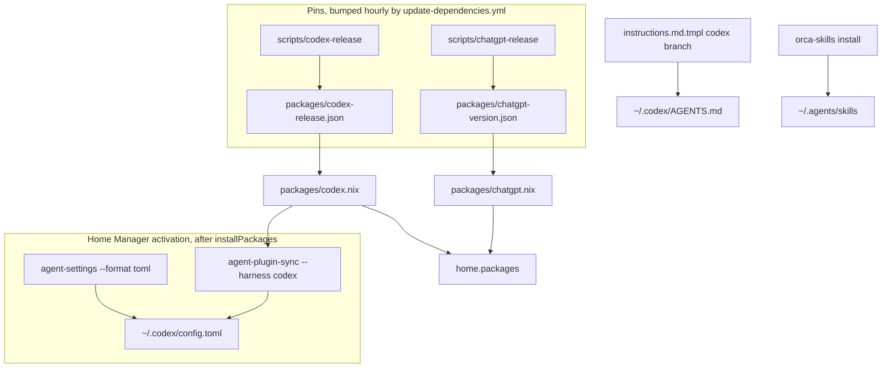
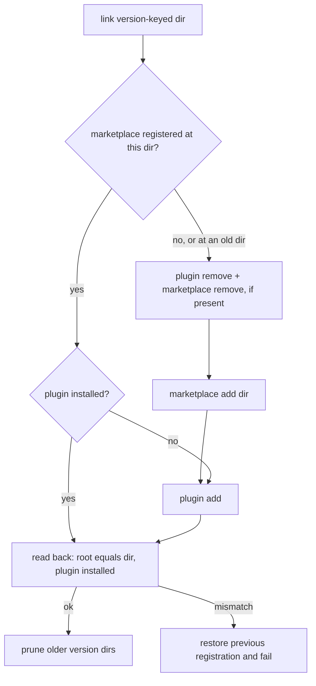

# Codex CLI and ChatGPT App Harness Parity - Plan

## Goal Capsule

- **Objective:** On every host, `h82` can use OpenAI's Codex CLI and the ChatGPT Linux app with a personal Plus account. Codex is configured as fully as Claude Code is: pinned, kept current automatically, given the shared instructions, plugins, and skills. This makes it a working peer for Compound Engineering cross-model review.
- **Means:** Extend the existing Claude packaging and harness machinery (release pins, the hourly bump workflow, the activation settings merger, the plugin sync tool, the instruction renderer, Orca skill installation) to cover Codex and the ChatGPT app.
- **Product authority:** The user's Home Manager profile under `home/h82/`, the shared packaging under `packages/` and `scripts/`, and the flake checks.
- **Open blockers:** None.

---

## Product Contract

### Summary

Codex CLI returns as a first-class agent harness next to Claude Code, and the ChatGPT Linux app joins it as a pinned desktop package next to Claude Desktop.
Both follow upstream releases through the existing hourly bump workflow.
The shared settings merger learns TOML, and the plugin sync tool learns Codex, so that Codex receives the same instructions, the compound-engineering plugin, and Orca skills that Claude Code does.

### Problem Frame

Codex was removed on 2026-09-21 (issue #12) because it was unusable in practice: the account it was tied to had been closed.
The user has since added a ChatGPT Plus subscription specifically so that Compound Engineering's cross-model review has a different-family peer.
That review pass picks its peer in the order `codex -> claude -> ...` and binds the first installed route, so without Codex every review here runs only on Claude.
The ChatGPT Linux app is now published for Debian-family systems with a versioned APT index, the same distribution shape this repo already pins for Claude Desktop.

### Key Decisions

- **Full harness parity for Codex, not only a package.** Codex gets instructions, plugins, and skills as Claude Code does. (session-settled: user-directed — chosen over installing and pinning only, and over install plus settings and instructions without plugins and skills: the user wants Codex to be an equal harness.) Governs R10, R11, R12.
- **Codex declares only the update check and memory.** Model, reasoning effort, sandbox, approval policy, and trusted projects stay under the user's control. (session-settled: user-directed — chosen over also declaring Claude-equivalent model and effort keys, and over additionally declaring sandbox and approval policy: only what determinism needs is reasserted.) Governs R3, R7.
- **ChatGPT app keeps its default display backend.** The app runs on its upstream default (X11 through XWayland), and this repo relies on the XWayland that the Plasma session already enables. (session-settled: user-directed — chosen over forcing X11 with an explicit `programs.xwayland.enable`, and over Claude Desktop's conditional Wayland switch: upstream marks Wayland experimental and XWayland is already on.) Governs R6.
- **Extend the shared tools instead of adding Codex-only copies.** At the user's direction, the settings merger gains TOML support and the plugin sync tool gains a Codex harness, so one tool per concern serves every agent. Governs R8, R11.
- **Track upstream releases, not nixpkgs.** Codex is pinned to OpenAI's releases and bumped hourly like Claude Code, though nixpkgs currently lags by only one minor version (0.158.0 against 0.159.3). Matching Claude's refresh cadence and checks outweighs reusing the nixpkgs build. Governs R1, R2.
- **No explicit cross-model peer pin.** The default peer order already selects Codex once it is installed, so `.compound-engineering/config.yaml` stays unchanged. (session-settled: user-approved — proposed over pinning `cross_model_peer: codex`, whose trade-off was that a broken Codex login would then show as a skipped review instead of a silent fallback to another peer.)

### Requirements

**Codex CLI package**

- R1. Codex CLI is installed for `h82` on every host, built from a pinned upstream release recorded in the repository.
- R2. The hourly dependency workflow bumps the Codex pin when upstream publishes a newer release, in its own `chore(packages): bump codex to <version>` commit.
- R3. Codex never replaces or updates its own binary at run time; the pinned build is the only one in use.

**ChatGPT app package**

- R4. The ChatGPT Linux app is installed for `h82` on every host from a pinned `.deb` in OpenAI's APT pool, and it launches from the Plasma application menu.
- R5. The hourly dependency workflow bumps the ChatGPT pin when OpenAI's APT index lists a newer version, in its own `chore(packages): bump chatgpt to <version>` commit.
- R6. The ChatGPT app launches with no display-backend override from this repo and runs under XWayland in the Plasma session.

**Codex settings**

- R7. Home Manager activation reasserts the Codex declared set (update check off, memory off) in `~/.codex/config.toml` and leaves every other key exactly as Codex or the user wrote it.
- R8. The shared settings merger handles TOML settings files with the same assign, retire, and preserve semantics it already has for JSON, and its JSON behavior for Claude Code and Antigravity does not change.
- R9. When a Codex settings file cannot be parsed, the merge refuses, leaves the file untouched, and fails the rebuild with a message naming the file, as the Claude Code merge does.

**Harness parity**

- R10. Codex receives the shared agent instructions as its user-level instruction file, rendered with a Codex-specific native-tool section.
- R11. The compound-engineering plugin, at the same pinned tag Claude Code uses, is installed into Codex by the plugin sync tool, and Claude Code's plugin sync behaves as before.
- R12. Orca skills are discoverable by Codex with the same single-link-count guarantee that Orca enforces for the other harnesses.

**Verification**

- R13. Flake checks cover Codex and the ChatGPT app at the level of their Claude counterparts: offline release-script tests, installed-package checks that compare the built version against the pin, and settings, instruction, and plugin checks extended to Codex.
- R14. The host-name guard stays green, and every production and bootstrap output under `nixosConfigurations` builds.

### Acceptance Examples

- AE1. User edits survive a rebuild
  - **Covers:** R7
  - **Given:** The user has set a model and approved a trusted project in Codex, and has turned the update check back on.
  - **When:** The next Home Manager activation runs, for example after a rebuild that produces a new generation.
  - **Then:** The model and trusted project are unchanged, and the update check is off again.
- AE2. First activation without a Codex config
  - **Covers:** R7, R8
  - **Given:** `~/.codex/config.toml` does not exist.
  - **When:** Activation runs.
  - **Then:** The file exists and holds only the declared keys.
- AE3. Malformed Codex config
  - **Covers:** R9
  - **Given:** `~/.codex/config.toml` is not valid TOML.
  - **When:** Activation runs.
  - **Then:** The rebuild fails naming that file, and the file's bytes are unchanged.
- AE4. New upstream ChatGPT release
  - **Covers:** R5
  - **Given:** OpenAI's APT index lists a newer `chatgpt` version than the pin.
  - **When:** The hourly dependency workflow runs.
  - **Then:** It commits a bump to the new version and hash, separate from any Claude or Codex bump.

### Success Criteria

- After signing in with the Plus account, a Compound Engineering review in this repository binds Codex as its cross-model peer without any extra configuration.
- `codex` and the ChatGPT app both start and sign in on every host without manual package installation.

### Scope Boundaries

- Sign-in credentials for Codex and ChatGPT are created interactively by the user on first launch, not provisioned through sops.
- ChatGPT's Computer Use is out of scope; upstream does not offer it on Linux.
- No ARM64 builds; every host is `x86_64-linux`.
- The Gemini and Antigravity harness configuration is not changed beyond what the shared tool extensions require.
- Installing plugins through the ChatGPT app's own plugin UI is not managed declaratively.
- Codex sessions that Orca launches use Orca's own runtime home (`CODEX_HOME=~/.config/orca/codex-runtime-home/home`, which Orca sets in every terminal it opens). Orca owns that home and rewrites its `config.toml`, so this work does not write the declared set, instructions, or plugin into it. Update suppression still reaches those sessions through the wrapper's flags (KTD9). Evidence that Orca forwards nothing from `~/.codex` would make this a follow-up decision for the user.

### Dependencies / Assumptions

- The ChatGPT app bundles its own static Codex binary (`resources/codex`, 0.159.2 in 26.928.31416) and reads the default Codex home. It is assumed to honor `~/.codex/config.toml` like the CLI does.
- Codex discovers user skills under `~/.agents/skills`. The pinned 0.159.3 binary carries that path, and Orca skill installation already populates it (`home/h82/agents/orca-skills.nix:16-20`).
- The ChatGPT `.deb` depends on libraries Claude Desktop does not, including the TPM2 libraries (`libtss2-*`), `libusb-1.0`, OpenSSL, and a Vulkan loader.

### Sources / Research

- Codex CLI install docs: https://learn.chatgpt.com/docs/codex/cli?surface=cli#getting-started
- ChatGPT Linux app docs: https://learn.chatgpt.com/docs/linux/linux-app
- ChatGPT APT index: `https://persistent.oaistatic.com/codex-app-prod/linux/deb/dists/stable/main/binary-amd64/Packages`, which lists `chatgpt` 26.928.31416 with a SHA256 and a `pool/main/c/chatgpt/` filename.
- Codex upstream releases: `openai/codex` on GitHub, latest `rust-v0.159.3` at the time of writing.
- Compound Engineering's Codex install path: the plugin repository's `README.md` ("Codex CLI" section) and its `.codex-plugin` manifest.
- Prior removal: `.compound-engineering/artifacts/plans/2026-09-21-1748-chore-remove-codex-plan.md` and issue #12.
- Patterns to mirror:
  - Packaging: `packages/claude-desktop.nix`, `packages/claude-code.nix`, `scripts/claude-desktop-release`, `scripts/claude-code-release`, and `.github/workflows/update-dependencies.yml`.
  - Harness configuration: `home/h82/agents/claude.nix`, `scripts/agent-settings`, `home/h82/agents/agent-plugins.nix`, `scripts/agent-plugin-sync`, `home/h82/agents/instructions/`, and `home/h82/agents/orca-skills.nix`.
- Existing Codex touchpoint: `scripts/tokscale` already adds Orca's per-account Codex session directories (`~/.config/orca/codex-accounts/*/home/sessions`) to usage reporting. Tokscale is expected to scan the default `~/.codex/sessions` itself, so no wrapper change is planned; U9's manual check confirms sessions are counted once.
- Learnings to read before planning:
  - `.compound-engineering/artifacts/solutions/integration-issues/orca-rejects-hardlinked-nix-store-skill-files.md`
  - `.compound-engineering/artifacts/solutions/integration-issues/claude-code-global-config-keys-ignored-in-settings-json.md`
  - `.compound-engineering/artifacts/solutions/best-practices/home-manager-activation-does-not-run-on-every-rebuild.md`

---

## Planning Contract

Product Contract preservation: unchanged in meaning and IDs. The Deferred-to-Planning questions are resolved by KTD1, KTD2, KTD5, and KTD6 and were removed; the assumptions and one Scope Boundaries entry were updated in place with what research found.

### Key Technical Decisions

- KTD1. **Codex ships as OpenAI's prebuilt static musl binary, pinned by the GitHub release asset digest.** nixpkgs builds Codex from source with `cargoHash` and `librusty_v8` hashes that an unattended resolver cannot compute without building, so only a prebuilt pin can bump hourly (R2). The resolver reads `codex-x86_64-unknown-linux-musl.tar.gz` and its `sha256:` digest from `https://api.github.com/repos/openai/codex/releases/latest` (tag `rust-v<version>`), like `scripts/mise-release` reads SHASUMS. The package wraps the binary with `bubblewrap` and `ripgrep` on `PATH`, as nixpkgs' `pkgs/by-name/co/codex/package.nix` does, so the Linux sandbox and search work. Governs R1, R2.
- KTD2. **The Codex declared set is four `config.toml` keys in two categories.** Update: `check_for_update_on_startup = false`, `features.in_app_updates = false`, `features.daemon_auto_start = false`. Memory: `features.memories = false`. All four were read from the pinned 0.159.3 binary. `daemon_auto_start` installs and updates a background daemon copy of Codex. nixpkgs turns it off with `no-daemon_auto_start.patch`, which a prebuilt pin cannot carry, so it belongs in the update category that R3 needs. (session-settled: user-directed — chosen over also declaring model and effort, or sandbox and approval policy: only what determinism needs is reasserted.) Conflict call-out: the settled set named "update check and memory"; research found that update suppression takes three keys rather than one. The extra keys stay inside the settled category and add no user-facing setting. Governs R3, R7.
- KTD9. **The Codex wrapper also passes the three update overrides as global flags: `-c check_for_update_on_startup=false --disable in_app_updates --disable daemon_auto_start`.** Orca exports its own `CODEX_HOME` in every terminal, and that home's `config.toml` never receives the declared set. The CE cross-model review runs `codex` from exactly those terminals. Flags hold under any `CODEX_HOME`, so R3 holds there without writing into Orca's home. Verified with 0.159.3: `features list` reports both features false under the flags, and the flags precede subcommands such as `exec`. The memory key stays config-only, because R3 does not cover it. Governs R3.
- KTD3. **`scripts/agent-settings` gains an explicit `--format toml` mode built on `tomlkit`.** The flag keeps every JSON caller byte-identical (R8). `tomlkit` round-trips comments, table order, and tables the merge does not own; Codex and `codex plugin add` both write `config.toml`. The declared document stays JSON, so `set`, `remove`, `setPaths`, and `own` keep one schema. TOML mode refuses a JSON `null` value, which TOML cannot represent. The helper interpreter becomes `python3.withPackages (ps: [ ps.tomlkit ])`, mirroring `rubyHelper` in `packages/agent-tools.nix`. (session-settled: user-directed — chosen over a separate Codex-only merger: one tool per concern serves every agent.) Governs R8, R9.
- KTD4. **Both new resolvers skip when upstream is not newer and refuse a downgrade.** The ChatGPT index carries a single stanza, so a pool rollback would otherwise write a downgrade. `scripts/claude-code-release` and `scripts/mise-release` already guard this way; `scripts/claude-desktop-release` does not, and is left as it is. Governs R2, R5.
- KTD5. **ChatGPT is repackaged from the `.deb` payload under `usr/lib/chatgpt`, with no maintainer scripts and no display flag.** The postinst only registers an APT source, an AppArmor profile, and a desktop database, none of which apply on NixOS. `autoPatchelfHook` patches the ELF files that ship for this platform. Foreign-architecture prebuilds (darwin, win32, arm, musl, android) are deleted before patching. The Qt shims (`libqt5_shim.so`, `libqt6_shim.so`) are left with their Qt dependencies unresolved, because Chromium loads them only under a Qt platform theme. The wrapper adds only `XDG_DATA_DIRS` and `xdg-utils`, and it omits Claude Desktop's ozone `--add-flags`. Bundled static binaries (`resources/codex`, `resources/rg`, `codex-code-mode-host`) need no patching. (session-settled: user-directed — chosen over forcing X11 with an explicit `programs.xwayland.enable`, or Claude Desktop's conditional Wayland switch.) Governs R4, R6.
- KTD6. **`scripts/agent-plugin-sync` takes `--harness {claude,codex}` and `--cli <path>` in place of `--claude`, and keeps one adapter per harness.** The Codex adapter differs in four ways:
  1. Commands: `codex plugin marketplace add <path> --json`, `codex plugin add <plugin>@<marketplace> --json`, `codex plugin remove`, and `codex plugin marketplace remove`. There is no install, update, or enable step.
  2. Listings: `plugin marketplace list --json` returns `{marketplaces: [...]}`, and `plugin list --json` returns `{installed: [...]}`.
  3. Source field: the registered source is read from `root` or `marketplaceSource.source`.
  4. Manifests: `.agents/plugins/marketplace.json` and `.codex-plugin/plugin.json`.

  The version-keyed link stays shared. A version change moves the link path, so the adapter removes the old marketplace and plugin and then adds both again; Codex's `marketplace upgrade` refreshes only Git sources. (session-settled: user-directed — chosen over a Codex-only plugin tool: one tool per concern serves every agent.) Governs R11.
- KTD7. **Codex instructions render to `~/.codex/AGENTS.md` through the shared template's new `codex` branch.** Codex reads that file and never rewrites it, so a store link through `home.file` is correct, as it is for Claude Code. The branch names Codex's native tools as they appear in the pinned binary. Governs R10.
- KTD8. **Orca skills reach Codex through the existing `~/.agents/skills` root; no new root is added.** The pinned binary carries `.agents/skills`, and `orca-skills.nix` already installs plain nlink-1 copies there. The Codex check asserts that root rather than duplicating it. Governs R12.

### High-Level Technical Design

The work extends four shared mechanisms. Each one gains a Codex (or ChatGPT) row next to its Claude row.

The plugin sync for Codex, per activation:

### Assumptions

- `codex plugin add` writes `[plugins."<id>"] enabled = true` into `config.toml`. Observed with 0.159.3 during research.
- Codex plugin commands work without a terminal when `CODEX_HOME` is not under a temporary directory. Under `/tmp` they print "Refusing to create helper binaries under temporary dir" and then exit with "stdin is not a terminal". Activation uses the real home, and unit tests use a fake CLI.
- The pinned Codex reads `features.*` keys from `config.toml` as `[features]` table entries. U5 confirms this with the real binary's `features list` against a rendered file.

### Risks & Dependencies

- **The ChatGPT payload is about 475 MB per version.** Each hourly bump downloads it in CI, and every host closure grows by about 1.6 GB installed. U3 accepts this cost; nothing in the plan caches or trims the payload.
- **Upstream ships ChatGPT as a preview on supported distributions only.** Bundled native modules may need libraries the Depends line does not list. Any unresolved library other than the Qt shims fails the `autoPatchelfHook` build, so the failure surfaces at bump time rather than at launch.
- **Codex's plugin CLI and JSON shapes are not a stable contract.** The Codex adapter refuses unexpected listing shapes (U7) rather than reading them as empty, so a shape change fails activation instead of silently re-adding the plugin on every run.
- **Orca-launched Codex uses Orca's runtime home.** The declared memory key, instructions, and plugin apply to Codex launched outside Orca and to the ChatGPT app. Update suppression applies everywhere through KTD9. Cross-model review inside an Orca terminal authenticates with whatever login Orca's runtime home holds, and that home has no `auth.json` today. U9's manual check covers a review started from an Orca session, including sign-in there if Orca does not share the `~/.codex` login.

### Implementation Constraints

- Every new check follows the mutation-testing learnings listed in `AGENTS.md`:
  - Guard every store-path interpolation with `lib.optionalString`.
  - Assert materialized output rather than option values.
  - Start fixtures divergent.
  - Run checks over production and `-bootstrap` configurations alike.
- No host directory name appears in any new file (the `host-name-guard` check).
- No real credentials or Codex `auth.json` in fixtures.

---

## Implementation Units

### U1. TOML mode for the settings merger

- **Goal:** `scripts/agent-settings` merges a declared set into a TOML file with the same semantics and refusals as JSON.
- **Requirements:** R8, R9; KTD3.
- **Dependencies:** none.
- **Files:**
  - `scripts/agent-settings`
  - `packages/agent-tools.nix`
  - `tests/test_agent_settings.py`
  - `flake.nix` (the `agent-settings` check)
- **Approach:**
  1. Add `--format {json,toml}`, defaulting to `json`. Parse, serialize, and the "not an object" refusal branch on the format. In TOML mode, `apply()` starts from a `copy.deepcopy` of the parsed tomlkit document and edits the existing tables in place, creating a `tomlkit.table()` only for a missing path segment. The JSON path keeps its `dict(...)` copies. Those copies would turn tomlkit containers into plain dicts and drop standalone and table-level comments (verified with tomlkit 0.15).
  2. Refuse a `null` value in TOML mode during validation, before any write.
  3. Build the helper with an interpreter that has `tomlkit`, following `rubyHelper`, and give the `agent-settings` check the same interpreter.
  4. Keep the existing safety path unchanged for both formats: `O_NOFOLLOW` read, symlinked-parent refusal, compare-and-swap, atomic replace, and mode 0600.
- **Patterns to follow:** `scripts/agent-settings` itself; `rubyHelper` in `packages/agent-tools.nix`.
- **Test scenarios:**
  - Covers AE1. A divergent TOML fixture has comments, a `[plugins."x"]` table, a `[marketplaces.y]` table, and `check_for_update_on_startup = true`. A merge with `setPaths` for the four KTD2 keys sets them, and the bytes of every comment and unowned table survive.
  - Covers AE2. A missing file is created holding only the declared keys, with mode 0600.
  - Covers AE3. Malformed TOML refuses with exit 1, a message naming the file, and unchanged bytes.
  - A `null` in `set` refuses in TOML mode before the file is touched.
  - A `remove` entry deletes a top-level key and leaves sibling tables in place.
  - A second identical run writes nothing (mtime unchanged).
  - Every existing JSON test passes unchanged without `--format`.
  - The packaged binary in the flake check runs one TOML smoke merge under `env -i`, which proves the built interpreter carries `tomlkit`.
- **Verification:** the `agent-settings` flake check passes, including the TOML smoke run.

### U2. Codex package and release resolver

- **Goal:** a pinned upstream Codex is installed for `h82`, with a resolver the workflow can run.
- **Requirements:** R1, R2, R3, R13; KTD1, KTD4, KTD9.
- **Dependencies:** none.
- **Files:**
  - `scripts/codex-release`
  - `tests/test_codex_release.py`
  - `packages/codex.nix`
  - `packages/codex-release.json`
  - `packages/agent-tools.nix`
  - `flake.nix` (packages `codex` and `codex-release`, the `codex-release` and `codex` checks)
  - `home/h82/default.nix`
- **Approach:**
  1. The resolver fetches the latest-release JSON through an overridable `CODEX_RELEASE_FETCH` command. It strips `rust-v` from the tag, finds exactly one asset named `codex-x86_64-unknown-linux-musl.tar.gz`, and takes its `sha256:` digest. It refuses a prerelease and a version that is not newer than the pin. It writes `{version, sha256, hash}`.
  2. The package uses `stdenvNoCC` and fetches `releases/download/rust-v${version}/codex-x86_64-unknown-linux-musl.tar.gz`. It installs the binary as `bin/codex` and wraps it with `bubblewrap` and `ripgrep` on `PATH` and the KTD9 update flags. It runs `versionCheckHook`.
  3. `home/h82/default.nix` imports the package next to `claude-code`.
  4. The `codex` check uses `assertUserPackage { pname = "codex"; executables = [ "codex" ]; }` and compares the built version to the pin, as the `claude-code` check does.
- **Patterns to follow:** `scripts/mise-release`, `packages/mise.nix`, `tests/test_claude_code_release.py`, and the `claude-code` check in `flake.nix`.
- **Test scenarios:**
  - The latest release is newer than the pin, so the resolver writes its version, hex, and SRI.
  - The same version as the pin reports up to date and writes nothing.
  - An older release is refused as a downgrade and leaves the pin unchanged.
  - A malformed pin counts as absent and is overwritten.
  - A release without the musl asset fails, naming the asset.
  - Two matching assets fail.
  - A digest that is not `sha256:` plus 64 hex characters fails.
  - A prerelease fails.
  - A fetch command error fails with `codex-release:` on stderr and exit 1.
  - In the flake check, a mutation to the pinned version or the executable name turns the `codex` check red.
  - The flake check reads the built wrapper script and requires all three KTD9 flags. Dropping any one of them turns the check red.
- **Verification:** `codex --version` in the built package prints the pinned version, and all configurations evaluate with `codex` in `home.packages`.

### U3. ChatGPT package and release resolver

- **Goal:** the pinned ChatGPT app is installed and launches from the Plasma menu under XWayland.
- **Requirements:** R4, R5, R6, R13; KTD4, KTD5.
- **Dependencies:** none.
- **Files:**
  - `scripts/chatgpt-release`
  - `tests/test_chatgpt_release.py`
  - `packages/chatgpt.nix`
  - `packages/chatgpt-version.json`
  - `packages/agent-tools.nix`
  - `flake.nix` (packages `chatgpt` and `chatgpt-release`, the `chatgpt-release` and `chatgpt` checks)
  - `home/h82/default.nix`
- **Approach:**
  1. The resolver copies `scripts/claude-desktop-release`'s Packages parser with `Package == "chatgpt"`, `CHATGPT_RELEASE_FETCH`, and the codex-app-prod index URL, and adds the KTD4 guard. It records the index `Filename` so the package fetches the exact pool path.
  2. The package unpacks with `dpkg-deb --fsys-tarfile`. It copies `usr/lib/chatgpt` and `usr/share`, deletes foreign-architecture prebuilds, and adds `openssl`, `tpm2-tss`, `libusb1`, `vulkan-loader`, and `gdk-pixbuf` to the Claude Desktop library set. It wraps `ChatGPT` as `bin/chatgpt` per KTD5.
  3. The desktop file `chatgpt.desktop` keeps `Exec=chatgpt %U` and resolves through the wrapper on `PATH`.
- **Patterns to follow:** `packages/claude-desktop.nix` (minus the asar patch and ozone flags), `scripts/claude-desktop-release`, `tests/test_claude_desktop_release.py`, and the `claude-desktop` check.
- **Test scenarios:**
  - An index with two `chatgpt` stanzas resolves to the numerically highest version.
  - A non-amd64 stanza is ignored.
  - Covers AE4. A newer index version writes the pin, and the same version reports up to date.
  - An older index version is refused as a downgrade.
  - An index with no `chatgpt` stanza fails.
  - A fetch error fails.
  - In the flake check, `assertUserPackage { pname = "chatgpt"; executables = [ "chatgpt" ]; desktopEntries = [ "chatgpt.desktop" ]; }` holds on every configuration.
  - The flake check finds no `--ozone-platform` string in the built wrapper. This guards R6 against a copied Claude Desktop wrapper.
- **Verification:** the package builds with no unresolved libraries other than the Qt shims, and the checks pass.

### U4. Hourly bump workflow

- **Goal:** the dependency workflow refreshes both pins and commits each one separately.
- **Requirements:** R2, R5.
- **Dependencies:** U2, U3.
- **Files:** `.github/workflows/update-dependencies.yml`, `tests/update-dependencies-push-order.sh` (only if its extraction needs adjusting).
- **Approach:** add `nix run .#codex-release -- --output packages/codex-release.json` and `nix run .#chatgpt-release -- --output packages/chatgpt-version.json` next to the Claude resolvers. Add two commit blocks of the existing shape (`chore(packages): bump codex to $NEW_VER`, `chore(packages): bump chatgpt to $NEW_VER`) before the catch-all commit.
- **Patterns to follow:** the claude-desktop and claude-code blocks in the same workflow.
- **Test scenarios:** the existing `update-dependencies-push-order` check still passes with the new blocks inert in its fixture, and any workflow convention checks under `tests/github-workflow-conventions.sh` stay green.
- **Verification:** `nix flake check` passes, and the workflow YAML lists both resolvers and both commit blocks.

### U5. Codex settings module

- **Goal:** activation reasserts the KTD2 declared set in `~/.codex/config.toml`.
- **Requirements:** R3, R7, R9, R13; KTD2.
- **Dependencies:** U1.
- **Files:**
  - `home/h82/agents/codex.nix`
  - `home/h82/agents/default.nix`
  - `tests/codex.nix`
  - `flake.nix` (the `codex-settings` check)
- **Approach:**
  1. Mirror `claude.nix`: render the declared JSON with `setPaths` for the four keys and an empty retired list.
  2. Run `home.activation.codexSettings` after `installPackages`, unguarded, calling `agent-settings --format toml --label 'Codex' --settings ~/.codex/config.toml`.
  3. Add no `home.file` for `config.toml`.
- **Patterns to follow:** `home/h82/agents/claude.nix`, `home/h82/agents/tokscale.nix` (`setPaths`), and `tests/claude.nix`.
- **Test scenarios:**
  - On every configuration, the activation entry exists, is ordered after `installPackages`, invokes the store-path helper with `--format toml`, and does not swallow a failing status.
  - `--settings` equals `<home>/.codex/config.toml`.
  - The `--declared` store file equals the four-key document restated as literals in the test.
  - No `home.file` targets `.codex/config.toml`.
  - Mutations to drop `--format toml`, change one key, or reorder the entry before `installPackages` each turn the check red.
- **Verification:** the check passes, and the real pinned binary's `codex features list`, run against a merged fixture, reports `memories`, `in_app_updates`, and `daemon_auto_start` as false.

### U6. Shared instructions for Codex

- **Goal:** Codex loads the shared agent instructions with a Codex tool section.
- **Requirements:** R10, R13; KTD7.
- **Dependencies:** none.
- **Files:**
  - `home/h82/agents/instructions/default.nix`
  - `home/h82/agents/instructions/instructions.md.tmpl`
  - `tests/agent-instructions.nix`
- **Approach:** add `codex = { name = "Codex"; target = ".codex/AGENTS.md"; }` and an `else if eq .harness.id "codex"` branch naming Codex's native tools. Use the tool names the pinned binary exposes; verify each name before writing it.
- **Patterns to follow:** the Claude Code and Antigravity branches and their test rows.
- **Test scenarios:**
  - On every configuration, exactly one enabled `home.file` has target `.codex/AGENTS.md`.
  - That file contains the shared sentence, the review and branch rules, and every Codex tool name.
  - It contains no Claude Code or Antigravity tool name.
  - It has no leftover `{{`, `}}`, or `<no value>`.
  - The Claude Code and Antigravity rows now treat Codex tool names as absent.
- **Verification:** the `agent-instructions` check passes.

### U7. Codex harness in the plugin sync tool

- **Goal:** the pinned compound-engineering plugin is installed into Codex at activation, and Claude's sync is unchanged.
- **Requirements:** R11, R13; KTD6.
- **Dependencies:** U2 (the `--cli` store path).
- **Files:**
  - `scripts/agent-plugin-sync`
  - `tests/test_agent_plugin_sync.py`
  - `home/h82/agents/agent-plugins.nix`
  - `tests/agent-plugins.nix`
- **Approach:**
  1. Replace `--claude` with `--harness` and `--cli` in the script.
  2. Move the Claude command set, listing parser, source reader, and manifest paths into a Claude adapter, and add a Codex adapter per KTD6.
  3. Retire in Codex runs `plugin remove` and then `marketplace remove`, each only when listed. When a Codex sync fails after its removes, the restore runs `marketplace add <previous root>` and then `plugin add <plugin>@<marketplace>`. Claude's restore re-adds only the marketplace, because its install and enable steps run on every activation.
  4. In `agent-plugins.nix`, set `knownHarnesses = [ "claude" "codex" ]`, add a `compound-engineering` row for `codex` with `exclude.codex = [ ]`, and render each row's `--harness` and `--cli` from the harness's own package import, so the store path matches `home.packages`.
  5. Codex needs no environment prefix, unlike Claude's `DISABLE_AUTOUPDATER`.
- **Patterns to follow:** the existing script structure and the `FAKE_CLI` test harness.
- **Test scenarios:**
  - Claude: every existing sync and retire call-sequence test passes with `--harness claude`.
  - Codex happy path: a fresh home gets `marketplace add <version-dir>` and then `plugin add compound-engineering@compound-engineering-plugin`. Readback succeeds and older version dirs are pruned.
  - Codex idempotent: already registered at the current dir with the plugin installed, so no add or remove call is made.
  - Codex version bump: registered at an old dir, so the plugin and marketplace are removed and then added at the new dir.
  - Codex readback mismatch: the fake reports a different `root`, so the run fails after restoring the previous registration with both `marketplace add <previous root>` and `plugin add`.
  - Codex listing shape: object-shaped listings (`{marketplaces}`, `{installed}`) are parsed. A list-shaped listing under the Codex harness is refused rather than read as empty.
  - Codex retire: a listed plugin and marketplace are removed and the base dir is deleted. An unlisted one makes no remove call.
  - `tests/agent-plugins.nix` selects each invocation block by harness and plugin name. It asserts the Codex block's `--cli` equals the `codex` package in `home.packages`, and the Claude block's assertions still pass.
- **Verification:** the `agent-plugin-sync` and `agent-plugins` checks pass.

### U8. Orca skills assertion for Codex

- **Goal:** the existing `~/.agents/skills` root is recorded as the Codex skill root and stays asserted.
- **Requirements:** R12; KTD8.
- **Dependencies:** none.
- **Files:** `home/h82/agents/orca-skills.nix` (comment only, if wording needs it), `tests/orca-skills.nix`.
- **Approach:** keep the roots unchanged. Make the test's comment or assertion name `.agents/skills` as the root Codex reads, so dropping that root fails a check tied to Codex.
- **Test expectation:** none beyond the existing nlink and copy assertions, which already cover `.agents/skills`. The unit only ties them to the Codex requirement.
- **Verification:** the `orca-skills` check passes.

### U9. Documentation

- **Goal:** the docs describe Codex and ChatGPT where they describe Claude Code and Claude Desktop.
- **Requirements:** R1–R12 (discoverability); supports the Success Criteria.
- **Dependencies:** U1–U8.
- **Files:** `README.md`, `AGENTS.md`, `docs/provisioning.md`, `docs/verification.md`.
- **Approach:**
  1. `README.md`: add Codex, ChatGPT, and the managed Codex keys.
  2. `AGENTS.md`: list `codex` under the `agents/` module contents.
  3. `docs/provisioning.md`: add Codex to the harness configuration, the tier table, shared instructions, and plugin sync. State the Orca runtime home boundary.
  4. `docs/verification.md`: add manual checks, kept separate from VM evidence:
     - `codex login` with the Plus account
     - a CE review binding Codex
     - ChatGPT launching from the Plasma menu with `xprop` showing an X11 window
     - Tokscale counting a `~/.codex` session once
- **Test expectation:** none -- documentation only.
- **Verification:** docs reference only files and options that exist after U1–U8.

---

## Verification Contract

| Gate | Command | Proves |
|---|---|---|
| Formatting | `nix fmt -- --ci` | Nix layout unchanged by the formatter |
| Checks | `nix flake check` | Unit tests for both resolvers, `agent-settings`, and `agent-plugin-sync`; the `codex`, `chatgpt`, `codex-settings`, `agent-instructions`, `agent-plugins`, `orca-skills`, `update-dependencies-push-order`, and `host-name-guard` checks |
| Builds | `nix build --no-link .#nixosConfigurations.<name>.config.system.build.toplevel` for every name from `nix eval .#nixosConfigurations --apply builtins.attrNames` | All production and bootstrap outputs build with both packages |
| Packages | `nix build .#codex .#chatgpt` | Both pinned packages build standalone |

Hardware evidence (the U9 manual checks) is reported separately from these results and is not a merge gate.

---

## Definition of Done

- Every unit's verification holds, and every gate in the Verification Contract passes on the branch head.
- Each new check was mutation-tested at least once against the behavior it guards (KTD2 keys, KTD9 wrapper flags, the `--format toml` flag, the Codex `--cli` path, and the ChatGPT ozone absence).
- No abandoned-attempt code, scratch fixtures, or unused helpers remain in the diff.
- No host directory name, real credential, or `auth.json` content appears in any new file.
