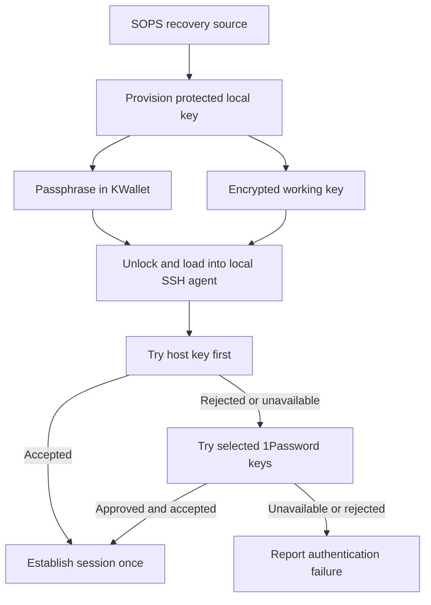
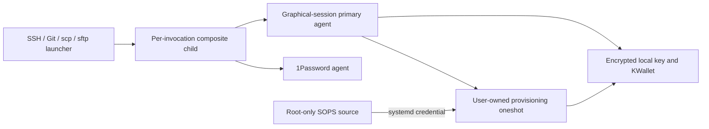
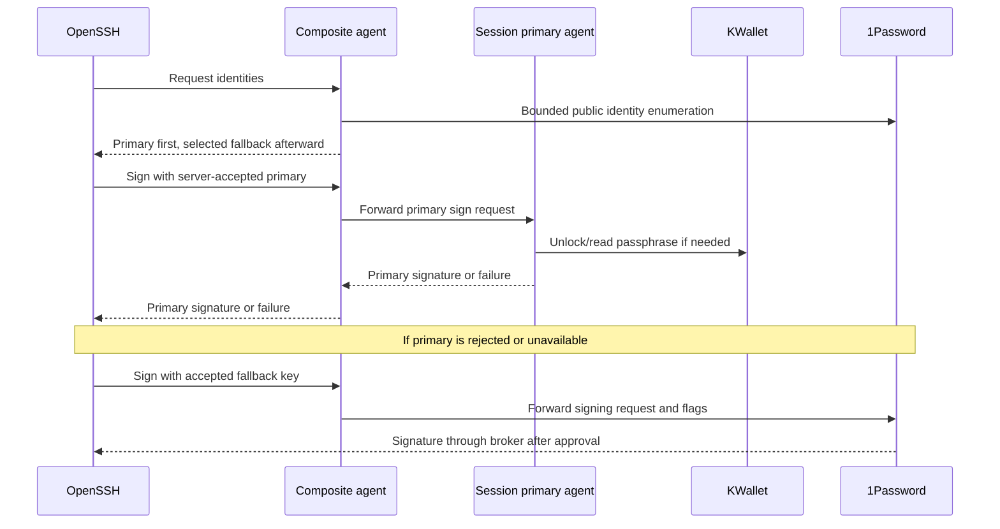
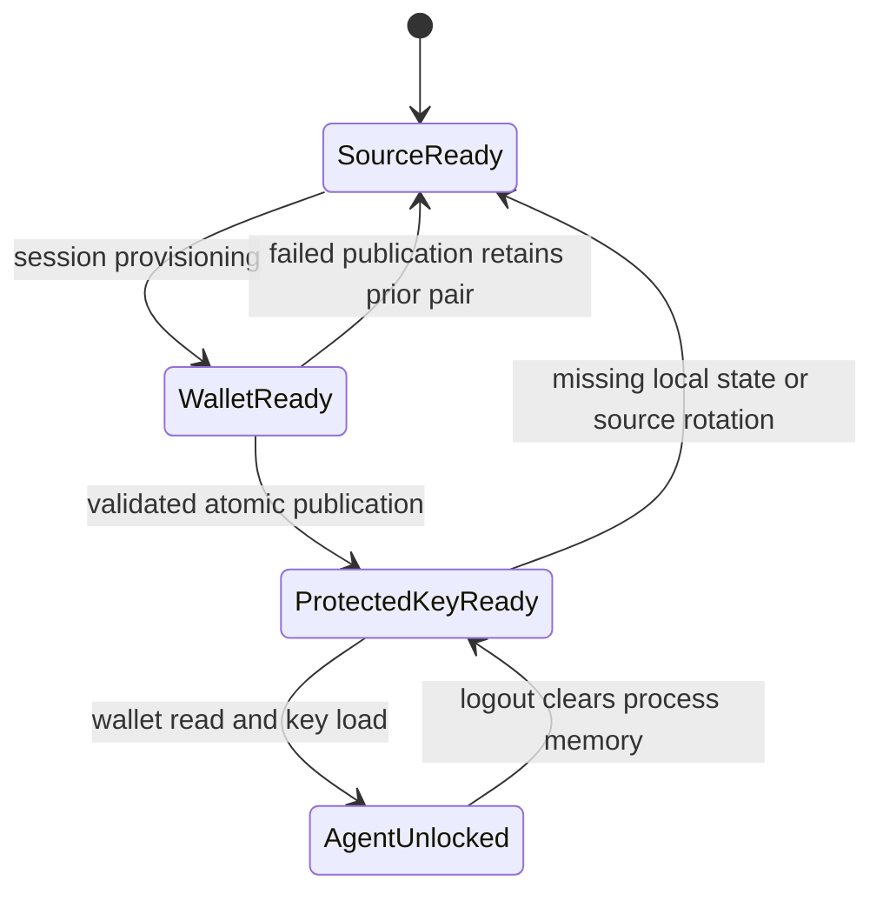

# Host SSH Keys with Desktop Unlock and 1Password Fallback - Plan

## Goal Capsule

- **Objective:** Use SSH from the configured NixOS desktops without requiring 1Password for destinations that accept the host's own key.
- **Means:** Host-specific SOPS-backed SSH keys, local passphrase protection, desktop wallet unlock, and automatic 1Password fallback.
- **Product authority:** This Product Contract records the confirmed brainstorm scope. Headless credential management is excluded.
- **Open blockers:** None. Technical questions below are deferred to planning.

## Product Contract

### Summary

Give each NixOS desktop its own SSH authentication key, protected locally by a passphrase stored in KWallet. Prefer that key and automatically try existing 1Password keys when the primary authentication path cannot succeed. Preserve the existing Git signing identity.

### Problem Frame

NixOS SSH currently depends on the 1Password desktop agent. The user wants less dependence on 1Password while keeping existing keys available during migration and for destinations that still require them.

### Key Decisions

- **Desktop scope.** Governs R1. (session-settled: user-directed — chosen over headless coverage: focus this change on headed environments.)
- **Encrypted local copy with wallet-managed passphrase.** Governs R2–R5. (session-settled: user-approved — chosen over publishing an unprotected local key: retain local passphrase protection with automatic desktop unlock.)
- **Automatic 1Password fallback.** Governs R6–R9. (session-settled: user-directed — chosen over explicit fallback commands and per-destination selection: retain automatic access through existing credentials.)
- **Session reuse.** Governs R10. (session-settled: user-approved — chosen over clearing agent keys on screen lock: keep this change focused on credential migration.)

### Requirements

**Scope and key lifecycle**

- R1. Apply the new behavior to production NixOS desktops; bootstrap configurations must remain usable without SSH secrets or an unlocked wallet.
- R2. Each participating host must have a unique SSH authentication key whose passphrase-free recovery source is stored only as SOPS ciphertext in the repository, decryptable through that host's age identity and the existing recovery process.
- R3. Initial desktop provisioning must generate a local key passphrase, store it in KWallet, and publish a passphrase-protected working key without retaining an unprotected working copy.
- R4. Applying a configuration must preserve a valid protected working key and its matching wallet entry, with explicit replacement when the declared source identity changes.
- R5. Reinstallation or loss of local key/wallet state must be recoverable from the SOPS source without changing the host's public SSH identity; an incomplete key/wallet update must not destroy a usable pair.

**Authentication and fallback**

- R6. SSH authentication must prefer the host's own key, loading it through the local SSH agent automatically when KWallet is unlocked.
- R7. Successful primary authentication must work when 1Password is stopped or locked, without requiring a 1Password approval or unlock prompt.
- R8. When the server rejects the primary key or the local key cannot be used, authentication must automatically attempt the currently selected 1Password keys, retaining 1Password's own unlock and approval requirements.
- R9. Apply the authentication behavior to ordinary SSH, Git over SSH, scp, and sftp without retrying an established session or rerunning a remote operation after failure.
- R10. Reuse loaded keys during the desktop login session; this change does not add agent-key removal on screen lock, and logout must end the managed session's access to loaded keys.
- R11. A locked or unavailable wallet must produce an actionable primary-key error and allow the R8 fallback, without silently publishing or using an unprotected working key.

**Migration and boundaries**

- R12. Preserve existing 1Password SSH key selection and document registration, validation, rotation, and revocation of each host's public key.
- R13. Keep Git signing on the existing OpenPGP/YubiKey identity and preserve other uses of 1Password.
- R14. Keep private keys and passphrases out of the Nix store, command arguments, logs, and committed plaintext, with user-only permissions on local working key files.

### Key Flows

- F1. **Provision a desktop key.** Recover the host's age identity, decrypt the source temporarily, establish the protected working key and matching wallet entry, then register the public key on required destinations. Covers R2–R5, R12, R14.
- F2. **Use the primary key.** After desktop login unlocks KWallet, load the key into the local agent and authenticate without involving 1Password. If the wallet is still locked, request its unlock before using the primary key. Covers R6, R7, R10, R11.
- F3. **Use fallback.** If primary authentication is rejected or unavailable, expose the primary-path error where applicable and attempt the selected 1Password keys before establishing the session. If neither path works, report authentication failure without rerunning an operation. Covers R8, R9, R11.
- F4. **Restore or rotate.** Recover lost local state under R5; for intentional key rotation, replace the declared source and matching local state under R4, register the replacement, and revoke the old public key under R12.

### Acceptance Examples

- AE1. **Independent primary path.** With the host public key registered and KWallet unlocked, stop 1Password and establish SSH, Git SSH, scp, and sftp operations through the host key. Covers R6, R7, R9.
- AE2. **Legacy destination.** A destination accepting only an existing 1Password key rejects the host key; the same invocation proceeds through 1Password approval and succeeds. Covers R8, R9, R12.
- AE3. **Locked wallet.** With KWallet locked, show the unlock/error path; if the host key remains unavailable, allow 1Password fallback without creating an unprotected key file. Covers R8, R11.
- AE4. **Both paths unavailable.** With the primary key unavailable and 1Password stopped or its approval denied, report failure and do not launch a remote operation. Covers R8, R9, R11.
- AE5. **Remote command fails after login.** A remote command that has performed a side effect exits unsuccessfully; fallback must not execute it again. Covers R9.
- AE6. **Reapply and restore.** A configuration apply preserves the existing key/wallet pair; restoration after local state loss recreates a protected key with the same public identity. Covers R4, R5.
- AE7. **Interrupted provisioning.** Failure while creating or updating either half of the key/wallet pair leaves an existing usable pair intact and allows recovery. Covers R3–R5.
- AE8. **Bootstrap and signing.** Bootstrap succeeds without SSH secrets; a later production SSH migration does not change the configured Git signing identity. Covers R1, R13.

### Scope Boundaries

- Headless and non-NixOS host credential behavior remains outside this change.
- Removing 1Password, changing its other integrations, and replacing YubiKey Git signing are excluded by R12–R13.
- New screen-lock security policy, TPM enrollment, and unattended credential services are excluded.
- Public-key registration and revocation remain operator actions; this plan does not authorize changes to external accounts or servers.

### Dependencies and Protection Limits

Plasma 6 and SDDM are already configured. Explicit repository declarations do not establish effective KWallet login unlock; planning must inspect the actual PAM and wallet setup. KWallet documents automatic login unlock for a wallet named `kdewallet` whose password matches the login password. A locked wallet still requires user interaction under R11.

Local key encryption protects a separately exposed working key file. It does not protect the recovery source from a compromised root account holding the host's age identity. The existing recovery cards can recover host identities, so per-host age recipients do not isolate keys from the recovery authority.

The existing non-NixOS implementation provides a host-specific SOPS pattern, but currently publishes an unprotected working key. It is a reference for source management, not an implementation of R3–R5.

### Sources and Research

- `home/h82/security/ssh.nix`: current split between the NixOS 1Password agent and non-NixOS host keys.
- `home/h82/security/non-nixos-secrets.nix`, `scripts/host-secrets`, `secrets/README.md`: existing per-host encrypted-source, staging, permissions, and recovery contracts.
- `modules/nixos/system/secrets.nix`, `scripts/restore-age-identity`: root-owned NixOS age identity.
- `modules/nixos/desktop/desktop.nix`, `modules/nixos/hardware/fingerprint.nix`: Plasma/SDDM and authentication context.
- `home/h82/dev/git.nix`, `home/h82/security/gpg.nix`: signing identity separate from SSH authentication.
- `.compound-engineering/artifacts/solutions/integration-issues/sops-service-umask-blocks-user-secrets.md`: secret permissions must follow each ownership boundary.
- `.compound-engineering/artifacts/solutions/best-practices/home-manager-activation-does-not-run-on-every-rebuild.md`: unchanged generations do not rerun Home Manager activation.
- [KWallet configuration](https://docs.kde.org/trunk_kf6/en/kwalletmanager/kwalletmanager/kwallet-kcontrol-module.html): login unlock conditions.
- [OpenSSH client configuration](https://man.openbsd.org/ssh_config.5): IdentityAgent, IdentityFile, and IdentitiesOnly behavior.

## Planning Contract

### Key Technical Decisions

- KTD1. **A session primary agent and a per-invocation composite socket.** Keep primary signing in a graphical-session agent. The installed SSH launcher forks a composite agent child and then execs the actual OpenSSH client, retaining the parent PID and original terminal/application ancestry. That child advertises primary identities first and selected 1Password identities afterward, forwarding signing to their respective agents. scp/sftp launch the same SSH entry point through their supported transport-program option; Git uses that SSH entry point. Governs R6–R9. OpenSSH prioritizes agent-backed keys over file-only keys, so file/agent configuration alone fails the required order. The launcher does not inspect exit status or retry a command.
- KTD2. **Root-only recovery source and session-time provisioning.** Keep the decrypted SOPS source root-only in runtime storage. A narrowly authorized system oneshot runs as the configured user with that source supplied through systemd credentials; the desktop agent requests it when provisioning is needed. Governs R2–R5, R14. System applies never require the user's wallet or D-Bus session.
- KTD3. **KWallet D-Bus and cryptography serialization.** Use KWallet's native password-entry API and Python cryptography's OpenSSH serialization, rather than exposing a passphrase to ssh-keygen arguments. Name wallet entries by the declared key's public fingerprint, reuse an existing passphrase, verify wallet readback, and atomically publish the encrypted key only after validation. Governs R3–R5, R14. Source rotation uses a distinct entry, preserving the old usable pair on failure.
- KTD4. **Graphical-session lifetime.** Bind the primary agent service to graphical-session.target, use a private runtime socket without independent socket activation, and clear the in-memory key when the service stops. Governs R10. The user manager can outlive desktop logout, so binding only to default.target is insufficient. Detect working-key replacement before signing so rotation invalidates cached primary state. Each invocation child dies with its parent SSH process and removes its private temporary socket.
- KTD5. **Protocol-aware fallback, not arbitrary forwarding.** Fetch fallback public identities with a bounded enumeration deadline; route a sign request only to the backend that advertised its key. Use a separate persistent backend transport per frontend connection, preserve sign flags and 1Password approval, reject unsupported mutation/constraint operations, and handle or propagate session-binding extensions honestly. Governs R7–R9. A stalled fallback must not prevent primary authentication. Never connect to 1Password from the shared session primary agent: per-invocation children preserve the calling process ancestry rather than pooling consent behind one persistent PID.

### High-Level Technical Design

The session agent owns the primary key. An invocation child combines that agent with 1Password without executing or retrying remote commands. The launcher execs OpenSSH once. Public-key source metadata is available without wallet unlock, enabling primary-first offers even before local provisioning.

### Assumptions and Implementation Discovery

- Locked nixpkgs already enables KWallet PAM for Plasma login, and SDDM inherits login hooks. Wallet contents and password equality remain user runtime state, covered by R11 rather than inferred from configuration.
- 1Password retains public-key metadata while locked, but exact agent enumeration behavior and consent attribution through the invocation child need explicit verification. Primary success must not depend on enumeration success. Verify the fallback peer PID, parent SSH PID, original application ancestry, and independent caller lifetimes in automated tests; verify actual 1Password application/tab/request approval settings manually and do not claim that test doubles prove its UI attribution.
- Keep fallback offers limited to the existing selected key set and deduplicate identities. Verify behavior with a server authentication-attempt limit that permits the primary plus configured fallback set.
- Only the configured user in an active graphical session may start the fixed provisioning unit; no ability to edit units, provide arbitrary source paths, or run arbitrary privileged commands is granted. The oneshot derives the session bus address from its actual UID and owns wallet readback, encryption, and publication. Disable credential-bearing core dumps. User-account compromise while provisioning runs can expose temporary credentials; local key encryption is not isolation from that account.
- No structural alternative to KTD1 survived research: file/agent composition violates ordering, and command retries violate R9. A design bake-off would not resolve a remaining viable mechanism choice.

## Implementation Units

### U1. Protect the local host key through KWallet

- **Goal:** Build recoverable, atomic local key provisioning without passphrase leaks.
- **Requirements:** R2–R5, R11, R14; F1, F4.
- **Dependencies:** None.
- **Files:** `scripts/desktop-ssh`, `packages/desktop-ssh.nix`, `tests/test_desktop_ssh.py`.
- **Approach:** Implement KTD2–KTD3 with injectable source and wallet boundaries for fake-secret tests. Validate key type and identity, reuse a matching wallet entry, refuse unsafe file ownership/modes/symlinks, and retain an existing pair when staging fails. Use a dedicated host-key path rather than overwriting an operator's default SSH key.
- **Execution note:** Prove failure and recovery behavior with fake keys before integrating the system unit.
- **Test scenarios:** Covers AE6 and AE7: unchanged source preserves a valid pair; source rotation selects a new entry; missing wallet/key state is recoverable; failed wallet write/readback or atomic replacement preserves the prior pair; passphrases never occur in subprocess arguments or diagnostics.
- **Verification:** Generated working keys require the wallet passphrase and retain the expected public identity.

### U2. Provide primary-first SSH authentication with automatic fallback

- **Goal:** Expose one agent implementing the selected authentication policy.
- **Requirements:** R6–R11; F2, F3.
- **Dependencies:** U1.
- **Files:** `scripts/desktop-ssh`, `tests/test_desktop_ssh.py`, `tests/desktop-ssh-integration.nix`.
- **Approach:** Implement KTD1 and KTD5 with bounded protocol frames, exact read/write handling, per-client routing, and isolated wallet/provisioning operations. Preserve fallback sign flags, bound enumeration separately from interactive signing, and maintain primary availability under fallback failure. Prove the fallback peer's process ancestry and independent child teardown rather than treating socket isolation as consent isolation.
- **Test scenarios:** Covers AE1–AE5: distinct real primary/fallback test keys establish order; a real SSH server accepts each path; missing/locked/stalled fallback cannot block primary; primary signing failure proceeds to fallback; SSH/Git/scp/sftp each use the same policy; a failing remote command executes once. Exercise malformed frames, duplicate/unknown keys, unsupported operations, and extension responses.
- **Verification:** Packaged OpenSSH integration proves ordering and exactly-once operations, beyond mocked protocol tests.

### U3. Integrate production hosts and session lifecycle

- **Goal:** Declare source management, provisioning authority, and graphical-session services.
- **Requirements:** R1–R14; F1–F4.
- **Dependencies:** U1, U2.
- **Files:** `modules/nixos/system/desktop-ssh.nix`, `modules/nixos/profile.nix`, `home/h82/security/ssh.nix`, `.sops.yaml`, `secrets/hosts/*/ssh.yaml`, `secrets/hosts/*/ssh.pub`, `tests/desktop-ssh.nix`, `tests/desktop-ssh-session.nix`, `tests/vm-checks.nix`, `flake.nix`.
- **Approach:** Follow KTD2 and KTD4. Derive host paths and accounts from shared options; provision unique ciphertext using existing public age recipients without decrypting real credentials. Preserve non-NixOS behavior and 1Password selection. Expose explicit provisioning diagnostics while allowing fallback when source or wallet provisioning is unavailable.
- **Test scenarios:** Covers AE8: all production NixOS outputs contain the materialized broker configuration and session units; bootstrap does not require new source secrets; non-NixOS retains its existing path. Fake-source VM evidence proves credential ownership, narrowly scoped unit-start authority, session stop, and recovery after wallet unavailability. Mutations must fail in the check builder with relevant diagnostics.
- **Verification:** Built Home Manager files and system units prove production/bootstrap gating, permissions, and lifecycle. Recipient checks inspect ciphertext recipients for each source.

### U4. Document provisioning, fallback, and verification

- **Goal:** Provide operator steps for registration, migration, recovery, and limits.
- **Requirements:** R5, R7–R14; F1–F4.
- **Dependencies:** U3.
- **Files:** `docs/provisioning.md`, `docs/adding-a-host.md`, `docs/recovery.md`, `docs/verification.md`, `secrets/README.md`.
- **Approach:** Explain the source/local-key/wallet boundaries, normal and fallback paths, 1Password consent attribution, and operator-owned registration/revocation. Distinguish automated fake-secret evidence from actual desktop and remote-account verification.
- **Test expectation:** Documentation has no independent runtime behavior; existing markdown checks apply.
- **Verification:** Guides describe the installed commands and actual configured paths consistently.

## Verification Contract

- Run packaged Python lifecycle/protocol tests and real OpenSSH integration with fake credentials, including every AE1–AE8 condition that can be automated.
- Build and mutation-test `desktop-ssh` materialized-output and source-recipient checks; read the repository's mandatory check/mutation learnings before trusting them.
- Run `nix fmt -- --ci` and `nix flake check`.
- Build `nix build --no-link .#vmChecks.all` and every production/bootstrap output under `nixosConfigurations`, `homeConfigurations`, and `systemConfigs`, as required by AGENTS.md. Architecture-specific outputs require a matching builder and CI evidence.
- Run independent simplification and code review, apply every valid finding, then confirm current-head CI and review checks before merge.
- Do not activate this developer host or use real plaintext credentials in builds/tests. Real KWallet login unlock, 1Password approvals, and registered remote destinations are separate manual verification items.

## Definition of Done

- U1–U4 are implemented with behavioral and materialized-output evidence for their requirements.
- Production host key ciphertext and public identity metadata exist with host-specific recipients; no plaintext credentials are committed.
- Required local builds/checks and current-head CI/review checks pass, with all valid review findings applied.
- Documentation clearly reports manual desktop verification still requiring operator action; no hardware installation or external key registration is implied by merge.
- Experimental code and unused alternative implementations are removed.
- The reviewed PR is merged under the user's explicit authorization.
