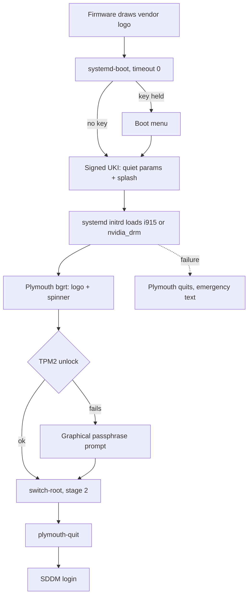

# Silent Graphical Boot - Plan

## Goal Capsule

- **Objective:** Powering on a NixOS host shows the firmware vendor logo with a spinner until the SDDM login screen, with no boot menu and no text in a normal boot, the way Windows boots.
- **Means:** A production-only boot splash module in the shared NixOS profile, with the GPU driver loaded in initrd (KTD1, KTD5).
- **Product authority:** The owner of these personal machines decided the scope in the brainstorm dialogue. Non-NixOS hosts and the bootstrap outputs are not active scope. The Product Contract wins on behavior; KTDs win on mechanism.
- **Stop conditions:** Stop and report if a production toplevel fails to build, if `nix flake check` or the `boot-layout` VM test fails for a reason the units cannot fix, or if the built NVIDIA initrd would not fit five generations on the 2G ESP.
- **Execution profile:** Nix configuration plus one eval check and docs. No hardware switch, `nixos-rebuild switch`, or `nr switch` runs as validation; hardware verification is handed to the owner.
- **Open blockers:** None.

---

## Product Contract

### Summary

Production outputs of every NixOS host skip the systemd-boot menu unless a key is pressed, and show a Plymouth splash that keeps the firmware logo from initrd until SDDM.
The NVIDIA desktop loads its driver in initrd so the splash never changes resolution.
Bootstrap outputs keep today's visible menu and text logs.

### Problem Frame

Both NixOS hosts boot through the systemd-boot menu and then scroll kernel, initrd, and systemd messages until SDDM starts.
Nothing sets a boot menu timeout, a quiet kernel command line, or a splash today (`modules/nixos/system/boot.nix`).
On production outputs TPM2 unlocks LUKS without input, so the menu and the log scroll are the only things the owner sees between the firmware logo and the login screen, and neither carries information in a normal boot.

### Key Decisions

- **Keep the firmware vendor logo (Plymouth `bgrt` theme) with a spinner.** It continues the Lenovo or MSI logo the firmware already drew, which matches the Windows boot. Governs R3. (session-settled: user-directed — chosen over the Plasma Breeze splash and a NixOS logo theme: both swap the logo mid-boot.)
- **Load the proprietary NVIDIA driver in initrd on hosts that use it.** This removes the mode switch between the splash and SDDM at the cost of a larger signed boot image and a slower build. Governs R8. (session-settled: user-directed — chosen over a firmware-framebuffer splash that accepts one flicker when the driver loads.)
- **Production outputs only.** Bootstrap outputs serve installation and recovery, where the menu and the log are the diagnostics. Governs R10. (session-settled: user-directed — chosen over applying the same boot screen to bootstrap outputs.)
- **A shared-profile default, not a trait.** A silent boot is not hardware-specific, so every current and future NixOS host gets it; only the NVIDIA early-load setting follows the host's GPU driver. Governs R10, R8. (session-settled: user-approved — proposed in the scoping synthesis with the per-host trait alternative, and confirmed.)
- **Reaching older generations takes a key press at power-on.** The hidden menu still opens on a key press, which the owner accepts as the rollback path. Governs R1, R2. (session-settled: user-approved — stated as an assumption in the scoping synthesis and confirmed.)

### Requirements

**Boot menu**

- R1. A production output boots its default entry without displaying the systemd-boot menu.
- R2. Pressing a key during early boot opens the menu, so every retained generation stays selectable.

**Splash**

- R3. A production boot shows a Plymouth splash that keeps the firmware vendor logo and adds a spinner, from the start of initrd until SDDM takes over the display.
- R4. A normal production boot shows no kernel, initrd, or systemd text on screen.
- R5. When TPM2 unlock fails, the LUKS passphrase prompt appears on the splash, not as a text prompt.
- R6. The boot log stays reachable: Esc switches the splash to text, and a boot that drops to emergency mode shows text as it does today.
- R7. The handoff from the splash to SDDM shows no black frame where the stack allows it; one brief black frame is the accepted floor.

**Hardware coverage**

- R8. On a host with the proprietary NVIDIA driver, the driver loads in initrd so the splash runs at native resolution and SDDM starts without a mode switch.
- R9. A host on Intel integrated graphics gets the same splash and handoff as R3 and R7 with its existing drivers.

**Scope of application**

- R10. Every NixOS host's production output gets R1–R9 through the shared profile; its bootstrap output keeps the visible menu and text boot.

### Acceptance Examples

- AE1. **Covers R1, R3, R4, R7.** **Given** a production output with TPM2 unlock working, **when** the owner powers on, **then** the firmware logo stays on screen with a spinner below it until the SDDM login screen, with no menu and no text.
- AE2. **Covers R2.** **Given** a production output, **when** the owner presses a key right after power-on, **then** the systemd-boot menu appears and lists the retained generations.
- AE3. **Covers R5.** **Given** a production output whose TPM2 unlock fails, **when** initrd asks for the LUKS passphrase, **then** a graphical prompt appears over the logo and boot continues after a correct passphrase.
- AE4. **Covers R6.** **Given** a production boot that fails into emergency mode, **when** the failure happens, **then** the splash quits and the emergency text console appears.
- AE5. **Covers R10.** **Given** a bootstrap output, **when** the owner powers on, **then** the systemd-boot menu and the boot log appear as they do today.
- AE6. **Covers R8.** **Given** the NVIDIA desktop, **when** it boots its production output, **then** the splash runs at the panel's native resolution and the screen does not change mode when SDDM starts.

### Success Criteria

- Repository check evidence shows the materialized result, not option values: every production output's built initrd starts Plymouth with the `bgrt` theme, its `loader.conf` has a zero timeout, and no bootstrap output carries either change.
- Hardware verification on both hosts, reported separately from check evidence per `docs/verification.md`, confirms AE1, AE2, and AE3, plus AE6 on the NVIDIA desktop.

### Scope Boundaries

- Non-NixOS hosts: their boot chain belongs to the distribution.
- Custom Plymouth themes, branding, or a NixOS logo.
- SDDM theme or login screen changes.
- Shutdown and reboot screens beyond whatever Plymouth shows by default.
- Changing firmware settings such as the vendor logo or POST delay.
- Considered and not built: overriding `plymouth-quit` to retain the last splash frame for SDDM. NixOS SDDM waits only for a plain `plymouth quit`, and a retained frame without a display manager that takes it over can freeze the screen; R7 accepts one brief black frame. Hardware evidence of a long or repeated black frame would change this call.
- Considered and not built: a production VM test. Production needs lanzaboote signing keys, TPM2-bound LUKS, and NVIDIA, none of which QEMU provides; the eval check in U3 and hardware verification replace it.

### Dependencies / Assumptions

- Lanzaboote v1.1.0 (`flake.nix`) writes `loader.conf` with its timeout from `boot.loader.timeout` by default (`nix/modules/lanzaboote.nix:149-153` in the locked source), so R1 needs no lanzaboote-specific setting.
- TPM2 unlock survives without re-enrollment. Lanzaboote's stub measures the kernel command line and initrd into PCRs 4, 9, and 11 and `loader.conf` into PCR 5; the LUKS binding uses PCR 7, which measures Secure Boot state. Hardware verification still confirms it.
- The 2G ESP on both hosts (`hosts/*/disko.nix`) holds five generations of the larger NVIDIA boot images; U2 measures it.
- The ThinkPad uses Intel Raptor Lake-P Iris Xe graphics, driven by `i915`.

### Sources / Research

- `modules/nixos/system/boot.nix`: systemd initrd, LUKS with TPM2 PCR 7 on production, lanzaboote versus systemd-boot by `my.bootstrap`.
- `modules/nixos/profile.nix`: shared defaults, including ones gated on `my.bootstrap`.
- `hosts/MS-7D91/hardware.nix`: proprietary NVIDIA driver with modesetting and no initrd modules.
- `modules/nixos/desktop/desktop.nix`: SDDM on Wayland.
- `tests/boot-layout.nix`, `tests/vm-checks.nix`: the existing boot VM test, which imports `boot.nix` directly with `my.bootstrap = true` and waits for the text passphrase prompt.
- `.compound-engineering/artifacts/solutions/boot-issues/thinkpad-efivars-immutable-blocks-sbctl-enroll.md`: required reading before boot changes per `AGENTS.md`.

Product Contract preservation: changed: Success Criteria — "VM evidence" became repository check evidence, because a production output cannot boot in QEMU; Outstanding Questions resolved into KTD2–KTD7; the PCR 7 assumption gained its evidence. No requirement changed.

---

## Planning Contract

### Key Technical Decisions

- KTD1. **A new module, `modules/nixos/system/boot-splash.nix`, imported by `modules/nixos/profile.nix`, holds every change and gates all of it on `!config.my.bootstrap`.** Keeping it out of `boot.nix` leaves the `boot-layout` VM test untouched, because that test imports `boot.nix` alone and waits for the text passphrase prompt. Implements the shared-profile and production-only Key Decisions; governs R10.
- KTD2. **`boot.loader.timeout = 0` on production outputs.** Lanzaboote copies it into `loader.conf`; systemd-boot then boots the default entry and opens the menu when Space (or another key) is held at power-on. Governs R1, R2. A timeout saved from the menu with `t`/`T` lives in an EFI variable and overrides `loader.conf`; production forbids touching EFI variables, so the owner would only set it by hand.
- KTD3. **Quiet boot uses `boot.consoleLogLevel = 3` plus the kernel parameters `quiet`, `udev.log_level=3`, `rd.udev.log_level=3`, `rd.systemd.show_status=error`, and `systemd.show_status=error`.** `error` still prints failures and, unlike `auto`, stays silent when a slow boot crosses systemd's delay threshold, and NixOS quits Plymouth before the emergency and rescue units, so R6 holds. `boot.initrd.verbose` is left alone: only the scripted initrd reads it. `show_status=false` is rejected because it would hide failures. Governs R4, R6.
- KTD4. **`boot.plymouth.enable = true` with `boot.plymouth.theme = "bgrt"` set explicitly.** `bgrt` is also nixpkgs' default; stating it keeps the owner's choice from silently following a future default change. The Plymouth module adds `splash` and the initrd units, including the `systemd-ask-password-plymouth` path that draws the LUKS prompt. Implements the `bgrt` Key Decision; governs R3, R5.
- KTD5. **Production outputs load the host's KMS driver in initrd: NVIDIA modules derived from the host's driver choice in the shared module, and `i915` set in the ThinkPad's `hardware.nix`.** The locked Plymouth ignores simpledrm for its first 8 seconds, so without a native driver in initrd a TPM-unlocked boot leaves initrd before any splash appears and a failed unlock shows up to 8 seconds of blank screen. The shared module adds `nvidia`, `nvidia_modeset`, and `nvidia_drm` when `services.xserver.videoDrivers` contains `"nvidia"` and `hardware.nvidia.modesetting.enable` is true; the modprobe options `nvidia-drm.modeset=1 fbdev=1` already reach the initrd through its copy of `/etc/modprobe.d/nixos.conf`. `nvidia_uvm` stays out: display does not need it, and nixpkgs deliberately loads it later through `softdep nvidia post: nvidia-uvm` so it appears after the `nvidia` udev rules run (`nixos/modules/hardware/video/nvidia.nix`). Intel has no host-neutral signal in the repo, so the ThinkPad host file sets it, which the `host-name-guard` check allows. The NVIDIA half implements the early-KMS Key Decision (governs R8); the Intel half governs R9. Rejected: `UseSimpledrm=1`, which Plymouth's own source warns flashes black when the native driver loads.
- KTD6. **`tests/boot-splash.nix` is an eval check in `checks`, built on `tests/lib/configurations.nix`, asserting built artifacts: the initrd unit tree, the initrd Plymouth config and themes, the initrd `modules-load.d` file, and the lanzaboote `loader.conf`.** These are what the machine boots from, per the repository's check learnings. Kernel parameters are the exception: `toplevel/kernel-params` and the bootspec both copy `boot.kernelParams` verbatim, and building either inside `nix flake check` would build every configuration's kernel and initrd that CI already builds in its build job. The check reads `boot.kernelParams` for those, asserting production and bootstrap differ so the assertion cannot fold to a constant. Governs R1–R10 evidence.
- KTD7. **The SDDM handoff is left to NixOS defaults.** SDDM orders after `plymouth-quit`; R7's floor of one brief black frame is accepted, and the override is a recorded non-goal in Scope Boundaries.

### High-Level Technical Design

Production boot sequence after the change (bootstrap keeps today's path):

### Assumptions

- The Phase 5.1.5 scoping synthesis was announced and not confirmed, because the run is autonomous under `lfg`; the three planning-time changes it named (Intel `i915` in initrd, eval check instead of a VM test, no `plymouth-quit` override) are recorded as KTD5, KTD6, and KTD7.

---

## Implementation Units

### U1. Boot splash module

- **Goal:** Production outputs hide the boot menu, run Plymouth `bgrt` in initrd, and boot quietly; bootstrap outputs are unchanged.
- **Requirements:** R1–R7, R10; KTD1, KTD2, KTD3, KTD4, KTD7.
- **Dependencies:** None.
- **Files:**
  - Create `modules/nixos/system/boot-splash.nix`.
  - Modify `modules/nixos/profile.nix` (add the import next to `./system/boot.nix`).
- **Approach:**
  1. Read `config.my.bootstrap` and wrap the whole config in one `lib.mkIf (!config.my.bootstrap)`.
  2. Set the loader timeout (KTD2), the quiet settings (KTD3), and Plymouth (KTD4).
  3. Leave `modules/nixos/system/boot.nix` untouched.
- **Patterns to follow:** `modules/nixos/system/nix-cleanup.nix` and the `lib.mkIf (!bootstrap)` gating in `modules/nixos/system/boot.nix`; a header comment only for the non-obvious constraints (why not `boot.initrd.verbose`, why `show_status=auto`).
- **Test scenarios:** covered by U3, whose scenarios name this unit's behavior.
- **Verification:** Every production toplevel and every bootstrap toplevel still builds; U3 passes; `nix build .#vmChecks.boot-layout` still passes.

### U2. KMS driver in initrd

- **Goal:** The splash has a native display from the start of initrd on both GPU families.
- **Requirements:** R8, R9; KTD5.
- **Dependencies:** U1.
- **Files:**
  - Modify `modules/nixos/system/boot-splash.nix` (NVIDIA derivation).
  - Modify `hosts/ThinkPad-X1-Carbon-Gen-11/hardware.nix` (`i915`, production only).
- **Approach:**
  1. In the module, add the three NVIDIA modules to `boot.initrd.kernelModules` under the KTD5 predicate, inside the production gate.
  2. In the ThinkPad host file, add `i915` to `boot.initrd.kernelModules` under `lib.mkIf (!config.my.bootstrap)`.
  3. Build the MS-7D91 production initrd and record its size and whether the closed driver's firmware landed in the modules closure; five generations must fit the 2G ESP alongside kernels.
- **Patterns to follow:** `hosts/MS-7D91/default.nix` reading `config.my.bootstrap` in a host file.
- **Test scenarios:** covered by U3.
- **Verification:** Both production toplevels build; the NVIDIA initrd size is measured and fits; `host-name-guard` passes.

### U3. Boot splash check

- **Goal:** `nix flake check` fails when any production output loses the hidden menu, the splash, the quiet boot, or its initrd KMS driver, or when a bootstrap output gains any of them.
- **Requirements:** Success Criteria (check evidence); R1, R3–R5, R8–R10; KTD6.
- **Dependencies:** U1, U2.
- **Files:**
  - Create `tests/boot-splash.nix`.
  - Modify `flake.nix` (register `boot-splash` under `checks`, next to `nix-cleanup`).
- **Approach:**
  1. Follow `tests/nix-cleanup.nix`: header comment stating what is verified and why each assertion reads a built artifact, `configurations.guard`, collect every failure before exiting, guard every store-path interpolation with `lib.optionalString` and lookups with `or null`.
  2. Derive expectations from each entry's `bootstrap` flag and from `services.xserver.videoDrivers`, never from the options under test.
  3. Read the lanzaboote `loader.conf` path out of `boot.lanzaboote.installCommand` on production; read the systemd-boot timeout from the bootstrap loader install script.
  4. Branch on the nullable timeout in Nix, not in shell.
- **Execution note:** After the check passes, run the mutation rounds the repository's check learnings require, in an `rsync --exclude .git` copy with its own `git init`, and confirm each assertion fails under its mutation.
- **Test scenarios:**
  - Covers AE1. Every production entry's initrd unit tree wires `plymouth-start.service` into `sysinit.target.wants`, and the unit's content has an `ExecStart` (not a `/dev/null` mask).
  - Covers AE1. Every production entry's initrd `plymouthd.conf` names `Theme=bgrt`, and the initrd themes directory contains `bgrt/bgrt.plymouth`.
  - Covers AE3. Every production entry's initrd `plymouth-start.service` pulls in the Plymouth ask-password path unit, that path unit watches `/run/systemd/ask-password` (not masked), and the agent service forwards to Plymouth.
  - Covers AE1, AE2. Every production entry's lanzaboote `loader.conf` has the line `timeout 0`.
  - Every production entry's `boot.kernelParams` contains `quiet`, `splash`, `loglevel=3`, `rd.systemd.show_status=error`, `systemd.show_status=error`, `rd.udev.log_level=3`, and `udev.log_level=3`, and none of them appear in any bootstrap entry's params.
  - Covers AE6. A production entry whose `videoDrivers` contains `nvidia` with modesetting lists `nvidia`, `nvidia_modeset`, and `nvidia_drm`, and not `nvidia_uvm`, in its initrd `modules-load.d` file, and its initrd modprobe config sets `nvidia-drm` `modeset=1`.
  - Every production entry's initrd `modules-load.d` file lists at least one KMS driver from `i915`, `xe`, `amdgpu`, and `nvidia_drm`, and no bootstrap entry's lists any of them, so a host that loses its early driver fails the check without the check naming a host.
  - A production entry without NVIDIA lists no `nvidia` module in its initrd `modules-load.d` file.
  - The check fails when no production entry uses NVIDIA, so the NVIDIA assertions cannot pass vacuously.
  - Covers AE5. Every bootstrap entry's initrd has no `plymouthd.conf`, no `plymouth-start.service` wiring, and no NVIDIA initrd modules, and its loader timeout is not `0`.
  - Mutations that must each fail the check: timeout set to `null` and to `5` on production; theme set to `spinner`; Plymouth disabled; `plymouth-start` masked; production gate removed (bootstrap gains the splash); NVIDIA predicate inverted; the ThinkPad `i915` line removed; `nvidia_uvm` added to the NVIDIA list; `rd.systemd.show_status=auto` dropped.
- **Verification:** `nix flake check` passes, and every listed mutation fails it with a message naming the broken assertion.

### U4. Documentation

- **Goal:** The recovery, verification, install, and host-adding docs match a hidden menu and a splash boot.
- **Requirements:** R2, R5, R6, R8–R10; Success Criteria (hardware verification).
- **Dependencies:** U1, U2, U3.
- **Files:**
  - Modify `docs/recovery.md` (selecting a previous generation now needs Space held at power-on; Esc shows the boot log).
  - Modify `docs/verification.md` (describe the `boot-splash` check in the repository checks paragraph; add hardware items under "Every host" for AE1–AE5, including that the menu key works with the host's own keyboard, and under the per-host sections for AE6, `nvidia-smi` and a GPU container on the MS-7D91, and the Intel handoff; note that booting a previous generation needs the key press).
  - Modify `docs/install.md` (the post-install passphrase test now uses the graphical prompt; NVIDIA driver choice also loads it in initrd).
  - Modify `docs/adding-a-host.md` (an NVIDIA driver choice with modesetting loads in initrd on production; another GPU sets its KMS module in `hardware.nix`).
  - Modify `AGENTS.md` (add the boot splash to the `system/` module list).
- **Approach:** Edit only the lines that describe the menu, the passphrase prompt, or GPU setup; keep English and existing link targets.
- **Test expectation:** none -- documentation only; the `check-workflow-docs-skip` and formatting checks still run.
- **Verification:** The docs mention no visible boot menu on production outputs, and `nix fmt -- --ci` passes.

---

## Verification Contract

| Gate | Command | Proves |
| --- | --- | --- |
| Formatting | `nix fmt -- --ci` | Nix layout matches `nixfmt-tree` |
| Repository checks | `nix flake check` | U3 and every existing check, including `host-name-guard` and `vm-checks-guard` |
| VM tests | `nix build --no-link .#vmChecks.all` | `boot-layout` still sees the bootstrap text prompt |
| Outputs | build each `nixosConfigurations.<name>.config.system.build.toplevel` per `AGENTS.md` | Production and bootstrap outputs of both hosts build |
| ESP budget | measure the MS-7D91 production initrd | Five NVIDIA generations fit the 2G ESP |
| Mutation rounds | per U3 Execution note | Each U3 assertion is load-bearing |

Hardware verification (AE1–AE6 on both hosts) is the owner's step, reported separately; no `switch` runs as validation. It also covers two risks no check can see: the key press of AE2 must open the menu with each host's own keyboard (the MS-7D91 uses a NuPhy Gem80, and fast-boot firmware may initialize USB input late), and `nvidia-smi` plus a GPU container must still work on the MS-7D91 with the driver loaded in initrd.

---

## Definition of Done

- U1–U4 are implemented and every gate in the Verification Contract passes.
- Every U3 mutation fails the check, and the mutation copy is discarded.
- The NVIDIA initrd size measurement is reported.
- No abandoned-attempt code or scratch files remain in the diff.
- The hardware verification items are listed for the owner, not claimed.
