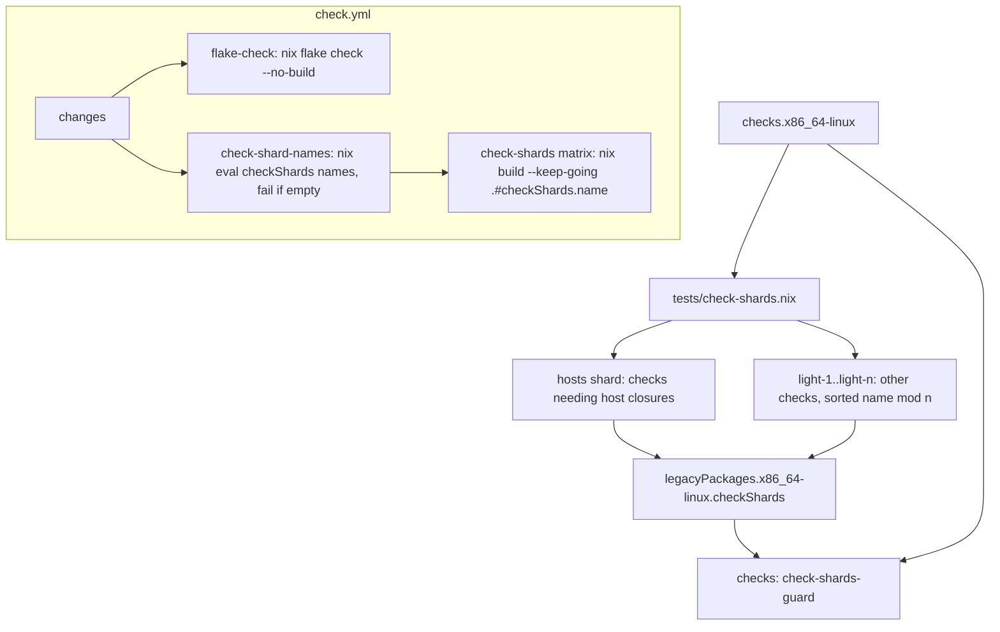

# Shard Flake Check Builds in CI - Plan

## Goal Capsule

- **Objective:** on a pull request, most flake checks report in a few minutes instead of after one 13-to-15-minute serial job, and `flake-check` stops competing for the end of the run, while every check still builds in CI on every non-docs-only PR and every push to `main`.
- **Means:** partition `checks.x86_64-linux` into shards exposed as `legacyPackages.x86_64-linux.checkShards`: the checks that need full host closures share one shard, and the rest split by sorted name across the others. Build each shard in a matrix job fed by a lister job, keep `flake-check` as an evaluation-only `nix flake check --no-build`, and add a guard check that every check lands in exactly one shard (KTD1 to KTD5).
- **Authority:** the Requirements below win on behavior. KTDs win on mechanism within them. A unit overrides neither.
- **Stop conditions:** stop and report if `nix build .#checkShards.<name>` does not resolve through `legacyPackages`, if computing the shards forces a check's value in a way that makes the guard evaluate itself (infinite recursion), or if the PR's CI run misses the ship gate in Success Criteria after the shard count and host-closure assignment have been tuned.
- **Execution profile:** Nix, GitHub Actions YAML, one shell check script, and documentation. Local proof is evaluation, `nix flake check`, building every shard, and mutation rounds on the new guard and on the workflow assertions. The PR's own CI run is the proof of the wiring and of the timing.
- **Finishing:** the implementer verifies and ships the change as one pull request.

---

## Product Contract

### Summary

CI stops building every flake check in one job. A new lister job reads the shard names from `checkShards`, and a `check-shards` matrix builds each shard on its own runner. One shard holds every check whose closure includes a full NixOS or Home Manager host generation, so those closures are fetched once; the light checks split by sorted name across the other shards and finish in minutes. Adding a check needs no workflow edit. The existing `flake-check` job keeps its name and gate but runs `nix flake check --no-build`, so flake-schema validation and evaluation of every output still happen once. A `check-shards-guard` check fails when a check is missing from every shard, sits in more than one, or a shard is empty. Local `nix flake check` is unchanged.

### Problem Frame

`flake-check` runs `nix flake check --print-build-logs`, which builds all ~93 `checks.x86_64-linux` entries on one `ubuntu-24.04` runner. On the last three `main` runs it took 12m54s, 14m07s, and 14m34s. Evaluation ends about 2.5 minutes in; most of the rest is fetching and assembling the Plasma host closures (`system-path`, `home-manager-generation`) that a subset of checks read. A regression in any of the ~90 checks reports only after that whole serial run. On the same runs, `build (MS-7D91)` took 12 to 16 minutes and `vm-checks (non-nixos-vm)` 10 to 15 minutes, so the total run time is bounded by those jobs too: this change shortens the time to a check result and takes `flake-check` off the critical path, but the whole run cannot end before the slowest of those other jobs. The VM tests were already split into a matrix for the same reason (plan `2026-10-01-1338-perf-separate-vm-checks-from-flake-check-plan.md`); the remaining checks were not.

### Requirements

**Sharding**

- R1. Every entry of `checks.x86_64-linux` belongs to exactly one shard, and no shard is empty.
- R2. Each shard builds on its own with `nix build .#checkShards.<name>`.
- R3. A check added to `checks.x86_64-linux` joins a shard, and CI, without a workflow edit.
- R4. A guard check under `checks` fails when R1 does not hold, naming each offending check or shard.
- R10. The checks whose closure includes a full NixOS or Home Manager host generation share one shard, so no other shard fetches those closures.

**CI wiring**

- R5. Every shard builds in CI on every pull request that is not docs-only and on every push to `main`, under the same fail-open docs-only gate as `flake-check`, and `tests/check-workflow-docs-skip.sh` asserts the gate and that the matrix is read from the lister's output.
- R6. The lister fails when it finds no shard, so an empty matrix cannot leave the run green with no check evidence.
- R7. `flake-check` keeps its name and gate and still evaluates every flake output, without building the checks.
- R8. A failing shard reports every failing check in it, not only the first.

**Documentation**

- R9. `AGENTS.md` and `docs/verification.md` describe how CI builds the checks and how to build one shard locally.

### Scope Boundaries

- Local `nix flake check` and the pre-ship commands in `AGENTS.md` do not change.
- The `update-dependencies` workflow keeps its single `nix flake check` run; it lands on `main` without a pull request and is not on the PR critical path.
- The `vm-checks`, `build`, `build-linux`, `hosts`, `fmt`, `changes`, and `markdown-lint` jobs keep their behavior. Only the `markdown-lint` comment that names `flake-check` as the job that builds it changes. Speeding up `build (MS-7D91)` or `vm-checks (non-nixos-vm)`, which bound the total run time, is not part of this change.
- The aarch64 fixture checks stay in `build-linux`; only `checks.x86_64-linux` is sharded.
- Balancing by measured per-check build time is not built. The one cost that dominates, the host closures, is handled by R10; the light checks are cheap enough that sorted-name splitting is even enough. CI evidence of one light shard consistently far slower than the rest would change this call.
- Splitting the host-closure checks across several shards is not built: each such check reads every host's closure, so every shard holding one would fetch all of them again.
- A shared binary cache (Cachix or similar) is not added. Each shard fetches its own closures, as the `build` and `vm-checks` matrices already do.
- No aggregate required-status job is added. `main` has no branch protection and no rulesets (checked with `gh api`), so no required status depends on `flake-check` building the checks.

### Success Criteria

These are the ship gate, measured on the PR's own CI run against the three baseline `main` runs above:

- Every light shard and `flake-check` finish in a few minutes, well under the 13-to-15-minute baseline.
- The host-closure shard finishes no later than the baseline `flake-check`.
- The whole run, from its start to its last finished Nix job, takes no longer than the baseline runs.

---

## Planning Contract

### Key Technical Decisions

- KTD1. **Expose shards as `legacyPackages.x86_64-linux.checkShards`, each a `pkgs.linkFarm` of its checks.** This mirrors `vmChecks` (`flake.nix`, `tests/vm-checks.nix`): `legacyPackages` draws no unknown-output warning from `nix flake check`, and `nix build .#checkShards.<name>` resolves without the system in the path. Building a `linkFarm` builds every check it links, so the shard derivation is the unit CI builds. Governs R2.
- KTD2. **Partition in Nix, in `tests/check-shards.nix`, in two tiers.** The host-closure checks (R10) form one shard, `hosts`. The remaining checks are sorted by name and assigned by position modulo the light-shard count to `light-1` through `light-<n>`. Each shard carries its member names in `passthru`, so the guard reads names without forcing check values. Which checks are host-closure checks is decided from evidence: a check qualifies when its build closure includes a NixOS `system-path` or a Home Manager generation, which the implementer establishes from the derivation closures (for example `nix-store -qR` on each check's `.drv`) or the existing `flake-check` log. Prefer deriving membership automatically from the check set (for instance a `passthru` marker set where checks consume `tests/lib/configurations.nix`); if that cannot be done without forcing check values, keep an explicit list of check names in `tests/check-shards.nix`. The x86_64 fixture-host checks (the `non-nixos-home-*` and `non-nixos-system-*` entries from `fixtureChecksFor`) build full Home Manager and system-manager generations and belong in `hosts`; their names embed a fixture host name, which `host-name-guard` forbids under `tests/`, so take them from `attrNames (fixtureChecksFor "x86_64-linux")` in `flake.nix` rather than writing them literally. A misclassified check costs time, not coverage, because the guard still requires every check to be in exactly one shard. Sorting makes the light split deterministic. The light-shard count is one constant in `flake.nix`, starting at 3; the implementer tunes it and the host-closure membership against the PR's CI timings and records the timings chosen from in the PR body. Partitioning in Nix rather than in the workflow keeps CI and local `nix build .#checkShards.<name>` on the same definition and lets a Nix check guard it. Governs R1, R3, R10.
- KTD3. **`check-shards-guard` compares the shards' member names to `builtins.attrNames self.checks.x86_64-linux`.** The checks set includes the guard itself, so the guard must be in a shard too; reading attribute names forces no value, so there is no recursion. The guard computes, at evaluation time, the names missing from every shard, the names in more than one shard (possible once the host list and the light split are separate tiers), names in a shard that are not checks (possible with an explicit host list), and empty shards, and reports each from inside the builder before exiting non-zero, following `tests/vm-checks-guard.nix` and `unguarded-derivation-interpolation-defeats-nix-check-mutation-testing.md`. The guard takes the shard set as an argument so a mutation round can hand it a broken partition. Governs R4.
- KTD4. **CI: a `check-shard-names` lister feeds a `check-shards` matrix, mirroring `vm-check-names` → `vm-checks`.** The lister runs `nix eval --json` over the `checkShards` attribute names and fails on an empty list. The matrix entry passes the name to the shell through `env`, builds `.#checkShards.${NAME}` with `--keep-going --print-build-logs`, keeps the disk cleanup step and `system-features = big-parallel benchmark` (the host-closure shard fetches the same closures `flake-check` does today), and sets `fail-fast: false`. Both jobs carry the exact fail-open `if:` string that `flake-check` carries; `check-shards` lists `changes` and the lister in `needs`. Governs R3, R5, R6, R8.
- KTD5. **`flake-check` runs `nix flake check --no-build`.** That keeps flake-schema validation and evaluation of every output (including `nixosConfigurations`, `devShells`, `formatter`, and every check's derivation) in one job, so an evaluation error still surfaces there first. Plain `nix flake check` builds nothing beyond `checks`, so `--no-build` plus the shards covers the same ground. Evaluation still performs import-from-derivation: `home/h82/agents/orca-skills.nix` reads a fetched source with `builtins.readDir`, so the job fetches that source; this is small. The implementer drops the disk cleanup step and `big-parallel benchmark` from this job only if `--no-build` succeeds without them in CI. Governs R7.

### High-Level Technical Design

### Assumptions

- The host closures dominate `flake-check`'s build phase, so the light shards finish in a few minutes and the host-closure shard takes no longer than today's `flake-check`. The `flake-check` log of the baseline runs supports this; the PR's CI timings confirm it against the ship gate.
- No branch-protection rule or ruleset requires a status; `flake-check` keeps its name anyway.

### Sequencing

U1 adds the shards and the guard. U2 depends on U1's attribute path. U3 documents the final shape.

---

## Implementation Units

### U1. Partition the checks into `checkShards` and guard the partition

- **Goal:** every check belongs to exactly one shard, the host-closure checks share one shard, each shard builds under `.#checkShards.<name>`, and a guard fails on a broken partition.
- **Requirements:** R1, R2, R3, R4, R10, KTD1, KTD2, KTD3.
- **Dependencies:** none.
- **Files:** `tests/check-shards.nix` (new), `tests/check-shards-guard.nix` (new), `flake.nix`.
- **Approach:**
  1. Establish which checks need a host closure per KTD2, and choose the membership mechanism.
  2. Create `tests/check-shards.nix` taking the check set and the light-shard count and returning the shard set per KTD2, each shard a `linkFarm` with its member names in `passthru`.
  3. In `flake.nix`, add `checkShards` beside `vmChecks` under `legacyPackages.${system}`, built from `self.checks.${system}` and the count constant.
  4. Create `tests/check-shards-guard.nix` taking `{ pkgs, checks, shards }` per KTD3, and register it in `checks.${system}` as `check-shards-guard`.
  5. Give both new files the `Check interface:` header comment the other test files carry.
- **Patterns to follow:** `tests/vm-checks.nix` and the `vmChecks` block in `flake.nix`; `tests/vm-checks-guard.nix` for the collect-then-fail guard shape and its names-only builder text. A check name list must not name a host, so `host-name-guard` stays green.
- **Test scenarios:**
  - Happy path: on the finished tree, `check-shards-guard` builds green, and the union of the shards' member names equals `attrNames checks.x86_64-linux`, including `check-shards-guard` itself.
  - Happy path (one-time local verification, not a Nix check): sweeping every check's `.drv` closure with `nix-store -qR` finds a NixOS `system-path`, a Home Manager generation, or a system-manager generation only in checks the `hosts` shard holds. The guard enforces name membership; closure contents are verified by this sweep, whose result goes in the PR body.
  - Error path: a partition that drops the last light name (an off-by-one in the slice) turns the guard red inside the builder, naming the dropped check.
  - Error path: a host-closure check that also lands in a light shard turns the guard red, naming the check and both shards.
  - Error path: a light-shard count larger than the number of light checks yields an empty shard, and the guard names it.
  - Error path: a shard member that is not a check name turns the guard red, naming it.
  - Integration: the guard's `.drv` has no check derivation among its inputs, so building it builds no other check.
  - Integration: `nix build .#checkShards.<name>` builds for every shard name.
- **Execution note:** run each mutation in a scratch copy made per `copied-git-worktree-writes-the-real-index.md`, feeding the guard a deliberately broken shard set, and read the failure from the build log to confirm it came from the builder, not the evaluator.
- **Verification:** the guard is green on the real tree, each mutation above turns it red for its own reason, every shard builds locally, and the host-closure checks sit only in `hosts`.

### U2. Build the shards in a CI matrix and make `flake-check` evaluation-only

- **Goal:** CI builds each shard in its own job and `flake-check` stops building checks.
- **Requirements:** R5, R6, R7, R8, KTD4, KTD5.
- **Dependencies:** U1.
- **Files:** `.github/workflows/check.yml`, `tests/check-workflow-docs-skip.sh`.
- **Approach:**
  1. Add the `check-shard-names` lister and the `check-shards` matrix job per KTD4, next to `vm-check-names` and `vm-checks`.
  2. Change `flake-check`'s step to `nix flake check --no-build` per KTD5, and update its comment.
  3. Update the `markdown-lint` comment, which says `flake-check` builds `markdown-lint`, to name `check-shards`. Its condition does not change.
  4. In `tests/check-workflow-docs-skip.sh`, assert both new jobs carry the fail-open gate (`check-shards` in the list form) and that `check-shards` reads its matrix from `check-shard-names`, and update the header comment.
  5. After the PR's first CI run, tune the light-shard count and the host-closure membership against the Success Criteria, and record the timings in the PR body.
- **Patterns to follow:** the `vm-check-names` and `vm-checks` jobs, including the empty-list failure and the `env:` hand-off of the matrix value; the existing `assert_gated` and `assert_matrix_from` helpers.
- **Test scenarios:**
  - Happy path: `ci-workflow-docs-skip` builds green on the finished workflow.
  - Error path: removing `check-shards`'s `if:` turns `ci-workflow-docs-skip` red, naming the job.
  - Error path: swapping one `||` for `&&` in `check-shard-names`'s `if:` turns it red.
  - Error path: replacing `check-shards`'s `fromJSON(needs.check-shard-names.outputs.names)` with a literal list turns it red.
  - Integration: on the PR's CI run, `check-shard-names` lists every shard, each `check-shards (<name>)` entry is green, and `flake-check` finishes without building checks.
- **Verification:** the workflow assertions pass and each mutation fails for its own reason; the PR's CI run shows one green entry per shard and meets the Success Criteria.

### U3. Document the sharded CI

- **Goal:** contributors know how CI builds the checks and how to reproduce one shard.
- **Requirements:** R9.
- **Dependencies:** U1, U2.
- **Files:** `AGENTS.md`, `docs/verification.md`.
- **Approach:** in `AGENTS.md`'s testing guidelines and `docs/verification.md`'s repository-checks section, state that CI evaluates the flake once in `flake-check` and builds the checks in `check-shards` jobs derived from `checkShards`, with the host-closure checks in one shard, that `nix build --no-link .#checkShards.<name>` reproduces one shard, and that `check-shards-guard` keeps the partition complete. Keep local `nix flake check` as the documented pre-ship command.
- **Test expectation:** none -- documentation only; `markdown-lint` covers formatting.
- **Verification:** the documents name `checkShards`, `check-shards`, and `check-shards-guard`, and no document still says `flake-check` builds the checks.

---

## Verification Contract

- `nix fmt -- --ci` passes.
- `nix flake check` passes locally, including `check-shards-guard` and `ci-workflow-docs-skip`.
- `nix flake check --no-build` passes locally.
- Every `checkShards` entry builds locally.
- The mutation rounds in U1 and U2 each turn their check red for the stated reason, run in a scratch copy.
- The repository's pre-ship builds (`vmChecks.all`, every `nixosConfigurations`, `homeConfigurations`, and `systemConfigs` output) pass, per `AGENTS.md`.
- The PR's CI run shows every `check-shards (<name>)` entry and `flake-check` green and meets the Success Criteria.

## Definition of Done

- R1 to R8 and R10 hold, each shown by the test scenarios in U1 and U2; R9 holds by U3's verification.
- The PR's CI run meets every Success Criterion. Timings exist only once the PR runs, so the gate is judged while the PR is watched: if it is missed after tuning, the PR stays open and its body says plainly that the gate was missed, with the timings, and claims no speed-up.
- The PR body reports the light-shard count, the host-closure membership and the closure sweep behind it, the per-shard, `flake-check`, and whole-run timings from its own CI run against the baseline runs, the change in total runner minutes (one ~14-minute job becomes an evaluation job plus one job per shard), and the local check and build results.
