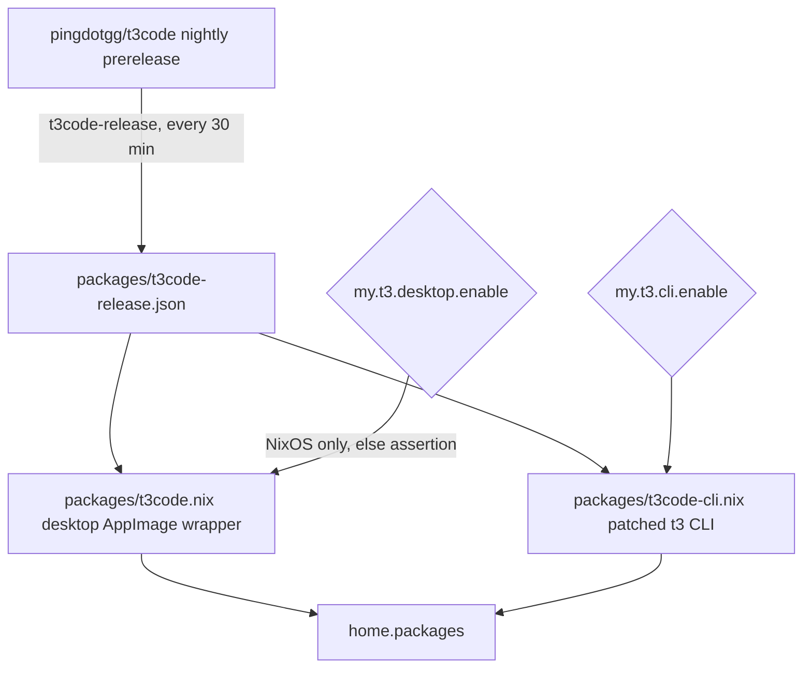
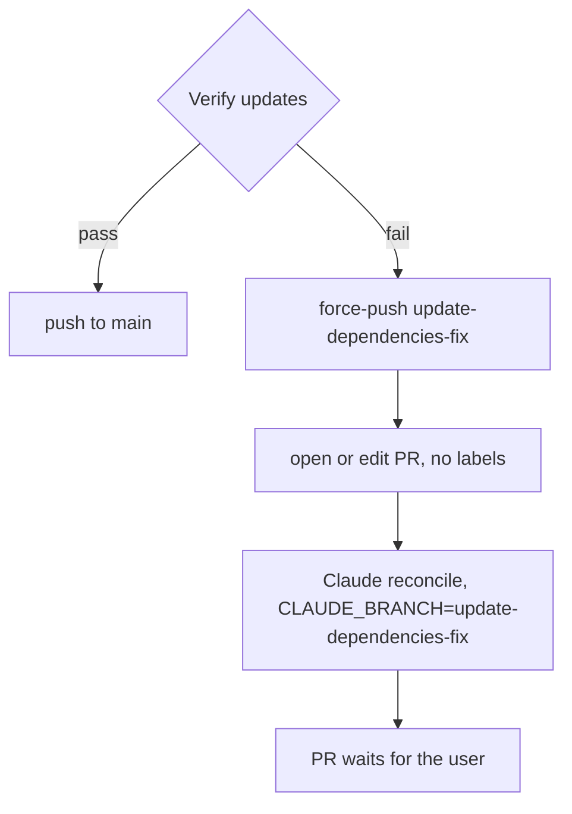

# T3 Code Nightly, Orca-Free Agent Setup, and Updater Fixes - Plan

## Goal Capsule

- **Objective:** Agent orchestration can run through T3 Code nightly as well as Orca on the hosts that opt in, nothing every agent session loads (global instructions, user-level skills) is Orca-specific, and the dependency updater reliably lands new releases, T3 Code nightlies included, within about an hour.
- **Product authority:** This Product Contract. The Orca app stays installed; replacing it is not in scope. The updater fixes ride in this plan at the user's request because T3 Code nightly tracking depends on them.
- **Means:** prebuilt nightly assets pinned in one file and gated by two host traits (KTD1, KTD2, KTD6); a manifest-driven cleanup of the old Orca skill copies (KTD8); targeted repairs to the updater workflow and two racy checks (KTD9 to KTD13).
- **Open blockers:** None.
- **Stop conditions:** Stop and report if the prebuilt `t3` CLI cannot be made to run on a non-NixOS fixture without nix-ld, or if the T3 Code AppImage cannot launch under `appimageTools`.
- **Execution profile:** Packaging and CI work proved by Nix checks that run the built artifacts; no host switch or hardware step.
- **Who finishes:** `ce-work` implements U1 to U8 on one branch, and the PR ships through the `lfg` pipeline. Merging stays with the user.

---

## Product Contract

### Summary

Package T3 Code nightly in the flake as two artifacts, the desktop app and the headless `t3` CLI. Each host turns them on with its own traits. A NixOS host can enable either or both. A non-NixOS host can enable only the CLI, and only on a headless machine such as a server. Remove every Orca mention from the shared agent instructions template, keeping the branch-naming rule general enough to cover placeholder branches from any worktree tool. Stop installing Orca's skills into the user-level skill roots, and clean out the copies already there. Run the dependency updater every 30 minutes and fix what broke its recent runs.

### Problem Frame

Orca is the only orchestration front end this configuration installs, and the shared instructions template (`home/h82/agents/instructions/instructions.md.tmpl`) describes placeholder branch names as an Orca worktree codename. That template renders into the global instructions for Claude Code, Codex, and Antigravity. Every agent session reads those Orca-specific words, whatever tool started it. A second orchestrator would make the wording wrong, because T3 Code names its worktree branches `t3code/<8 hex>` first and renames them later.

The same applies to skills. `home/h82/agents/orca-skills.nix` copies every Orca skill into `~/.claude/skills`, `~/.gemini/config/skills`, and `~/.agents/skills`, so every session sees them. Their descriptions match general requests such as "handoff" or "coordinate workers", so a session started by T3 Code can reach for the `orca` CLI instead of T3 Code's own orchestration tools.

T3 Code ships nightly builds several times a day as GitHub pre-releases of `pingdotgg/t3code`. The release assets include a desktop AppImage and a headless `t3` server tarball, each for x86_64 and arm64. Nothing in this flake installs it today.

The dependency updater (`.github/workflows/update-dependencies.yml`) is the only way a pinned nightly moves forward, and it is not running as designed. Its cron fires on the hour (`0 * * * *`), and GitHub drops many top-of-hour schedules, so between 2026-09-26 and 2026-10-04 runs came every 2 to 7 hours rather than hourly. Two runs failed verification on checks that passed in the next run: run 36928755726 on `pinentry-card` (exit 134) and run 37110317629 on `ci-workflow-docs-skip` (SIGPIPE from `printf`, then a `markdown-lint` needs assertion). In both, the recovery step then failed with `could not add label: 'dependencies' not found`, because the repository has neither the `dependencies` nor the `automated` label. No reconciliation PR opened, Claude reconciliation never ran, and an `update-dependencies-fix` branch with no PR was left behind.

### Key Decisions

- **Remove Orca from the global instructions entirely, rather than keeping a tool-neutral mention of it.** (session-settled: user-directed — chosen over generalizing the wording to cover Orca and T3 Code by name: the user wants no Orca text in global instructions.) Governs R1, R2, R3.
- **Hosts opt in per artifact with two independent traits.** (session-settled: user-directed — chosen over installing only the desktop app on NixOS hosts, and over running `t3` as an always-on service: the user wants per-host control of CLI and desktop, with the CLI on non-NixOS hosts only where the host is headless.) Governs R8, R9, R10.
- **On a non-NixOS host, whether the machine is headless is the host file's call.** (session-settled: user-directed — chosen over a `my.headless` trait that rejects or auto-enables the CLI: the host author enables `my.t3.cli.enable` only on servers, and no check enforces it.) Governs R8.
- **T3 Code's own settings stay app-managed.** (session-settled: user-approved — chosen over declaring key settings such as `branchNamingMode` and `branchNamePrefix` from Home Manager: nightly settings change shape often, and the global branch-naming rule already handles placeholder names.) Governs R12.
- **Track the nightly channel through the existing dependency updater, with self-update off.** (session-settled: user-approved — accepted with the consequence of several bump commits per day on `main`.) Governs R5, R6.
- **Stop installing Orca skills.** (session-settled: user-directed — chosen over leaving them in place and over limiting them to Orca-started sessions: they would misdirect orchestration requests in T3 Code sessions.) Orca-started sessions lose them too. Governs R13, R14, R15.
- **Run the updater every 30 minutes, off the hour.** (session-settled: user-directed — chosen over every 15 minutes, which piles up behind 30-minute runs, and over hourly off the hour.) Governs R17.
- **The Orca app coexists.** (session-settled: user-approved — T3 Code is an additional orchestrator, not a replacement.) Governs R16.

### Requirements

**Global agent instructions**

- R1. The global instructions rendered for each harness (Claude Code, Codex, Antigravity) contain no mention of Orca.
- R2. The branch-naming rule still treats tool-generated placeholder branches as names to replace, including Orca worktree codenames such as `hyperlapse122/mooneye` and T3 Code's `t3code/<8 hex>` temporary branches, without naming either tool.
- R3. A repository check fails when Orca reappears in the rendered global instructions.

**Packaging**

- R4. The flake packages T3 Code nightly as a desktop app and as the headless `t3` CLI for x86_64-linux and aarch64-linux.
- R5. Both artifacts are pinned to the same nightly release, and the dependency updater moves them to the newest nightly release, skipping stable and preview releases.
- R6. Neither installed artifact updates itself; its version changes only through the flake.
- R7. On a host that enables it, the desktop app appears in the Plasma application menu and launches.

**Host enablement**

- R8. Two traits, `my.t3.cli.enable` and `my.t3.desktop.enable`, each default to `false` and each install only its own artifact.
- R9. Both current NixOS hosts enable both traits.
- R10. Enabling `my.t3.desktop.enable` on a non-NixOS host fails evaluation with a message saying the desktop app is NixOS-only.
- R11. `docs/adding-a-host.md` lists both traits and the non-NixOS restriction.

**Orchestration behavior**

- R12. Claude Code and Codex sessions that T3 Code starts use the same user-level settings, instructions, and plugins this flake already manages, with no T3-specific copy.

**Orca skills**

- R13. The flake no longer installs Orca's skills into any user-level skill root.
- R14. On a host's next activation, the Orca skill copies the old installer wrote, and its `.orca-skills` manifest, are removed from all three roots, while other skills in those roots stay.
- R15. Docs and checks no longer describe or assert Orca skill installation.

**Orca app**

- R16. The Orca package and its Plasma taskbar launcher keep working as they do today.

**Dependency updater**

- R17. The updater's schedule fires every 30 minutes at minutes other than `:00`.
- R18. When verification fails, the workflow opens or updates the reconciliation PR and dispatches Claude reconciliation, without depending on labels that may not exist.
- R19. The `pinentry-card` and `ci-workflow-docs-skip` checks no longer fail intermittently; each failure seen in runs 36928755726 and 37110317629 is either fixed at its cause or shown not to recur on current `main`.

### Success Criteria

- Over the first day after merge, scheduled updater runs start at roughly 30-minute intervals rather than hours apart.
- A verification failure on the updater produces a reconciliation PR instead of a failed job.

### Acceptance Examples

- AE1. **Covers R8, R9.** **Given** a NixOS host with both traits on, **when** its generation is built, **then** `t3` is on the user's PATH and the T3 Code desktop entry is installed.
- AE2. **Covers R8.** **Given** a NixOS host with only `my.t3.cli.enable` on, **when** its generation is built, **then** `t3` is on PATH and no T3 Code desktop entry exists.
- AE3. **Covers R10.** **Given** a non-NixOS host with `my.t3.desktop.enable = true`, **when** its outputs are evaluated, **then** evaluation fails with the NixOS-only message.
- AE4. **Covers R8.** **Given** a non-NixOS server host with only `my.t3.cli.enable` on, **when** its Home Manager output is built, **then** `t3` is on PATH; a non-NixOS host with neither trait gets no T3 Code artifact.
- AE5. **Covers R2.** **Given** an agent working on an unpushed branch named `t3code/1a2b3c4d`, **when** it prepares the first push, **then** the global instructions lead it to rename the branch to a descriptive name.
- AE6. **Covers R14.** **Given** `~/.claude/skills` holds the installer's Orca skill copies, its `.orca-skills` manifest, and a user's own skill, **when** the new generation activates, **then** the Orca copies and the manifest are gone and the user's skill remains.
- AE7. **Covers R18.** **Given** an updater run whose verification fails, **when** the recovery step runs in a repository without `dependencies` or `automated` labels, **then** a reconciliation PR exists for `update-dependencies-fix` and the reconciliation step starts.

### Scope Boundaries

- Running `t3` as a systemd service, exposing it over Tailscale, and pairing the T3 Code mobile app.
- Declaring T3 Code settings (`~/.t3/userdata/settings.json`) from Home Manager.
- Changing or removing the Orca package (apart from dropping its skills fetch and `passthru.skills`, R13), Orca's Plasma taskbar launcher, or the Orca-related solution links in `AGENTS.md`.
- Removing Orca-installed skills that the flake's installer did not write, such as ones added through `orca skills install`.
- Pinning T3 Code to the Plasma taskbar.
- The T3 Code desktop app on non-NixOS hosts.
- T3 Code's "managed" Codex mode (Connect with ChatGPT), which downloads its own `codex` into `~/.t3`; T3 Code uses the flake's `codex` from PATH by default.
- The `npx t3@nightly` route and stable or preview release channels.
- Restructuring the updater beyond R17 to R19, such as splitting VM tests into a separate job.
- Considered and not built: applying KTD12's here-string fix to other pipefail tests. Only `tests/claude.nix` and `tests/github-workflow-conventions.sh` contain `printf … | grep -q`, and neither has failed; fix them if a trace shows their piped input spans several writes.

### Dependencies / Assumptions

- At `v0.0.46-nightly.20261004.2644`, T3 Code launches the `codex` and `claude` binaries it finds on PATH. By default it uses `~/.codex` and `~/.claude`, which is what R12 relies on. Orca, by contrast, gives Codex its own `CODEX_HOME`.
- T3 Code injects its own orchestration prompt and a `t3-code` MCP server into each agent session, so no skill installation is needed for orchestration.
- Orca still runs without its skills installed; agents in Orca sessions lose the skill guidance only.
- The desktop app bundles the same server as the CLI and shares `~/.t3` with it.
- The desktop app's self-updater stays inactive on Linux unless `APPIMAGE` is set or it was installed from the `.deb`; `T3CODE_DISABLE_AUTO_UPDATE` also disables it. The CLI updates only through an explicit `t3 update`.

### Sources / Research

- T3 Code nightly releases: `https://github.com/pingdotgg/t3code/releases` (assets `T3-Code-<ver>-x86_64.AppImage`, `T3-Code-<ver>-arm64.AppImage`, `t3-<ver>-linux-x64.tar.gz`, `t3-<ver>-linux-arm64.tar.gz`).
- In the T3 Code source at the tag above:
  - Binary resolution: `packages/contracts/src/settings.ts`, `apps/server/src/provider/Drivers/CodexHomeLayout.ts`, `apps/server/src/provider/Drivers/ClaudeHome.ts`.
  - Placeholder branch names: `packages/shared/src/git.ts`.
  - Orchestration MCP server: `docs/orchestration-v2/orchestrator-mcp-server.md`.
  - Self-update: `apps/desktop/src/updates/DesktopUpdates.ts`, `docs/internals/server-updates.md`.
- Updater runs: `gh run list -w update-dependencies.yml`; failed runs 36928755726 and 37110317629.
- Before touching the updater's piped verification, read `.compound-engineering/artifacts/solutions/logic-errors/pipe-to-tee-exit-status-reports-success-in-github-actions-step.md`.
- Orca skill installer and its manifest: `home/h82/agents/orca-skills.nix`, `tests/orca-skills.nix`, the "Orca agent skills" section of `docs/provisioning.md`.
- Existing patterns: `packages/orca.nix` wraps an AppImage, `home/h82/default.nix` gates GUI packages, and `.github/workflows/update-dependencies.yml` runs the updater.
- Prior plan that removed Orca orchestration hooks: `.compound-engineering/artifacts/plans/2026-09-29-1355-refactor-remove-orca-orchestration-hooks-plan.md`.

**Product Contract preservation:** Product Contract unchanged. R18's "dispatches Claude reconciliation" is read as requiring that the reconciliation commits land on the fix branch, which KTD9 implements.

---

## Planning Contract

### Key Technical Decisions

- KTD1. **Package the nightly from prebuilt release assets, not from source.** The nixpkgs `t3code` (0.0.42, stable) builds from source with pnpm and a Rust sidecar, which would need new `pnpmDeps` and `cargoHash` values for every nightly. The release assets need only per-asset hashes, which GitHub publishes as `digest`. Governs R4, R5.
- KTD2. **One pin file, `packages/t3code-release.json`, holds `version`, `tag`, and `platforms.<system>.{desktop, cli}.{asset, sha256, hash}`.** Both artifacts read it, so they cannot drift apart (R5). The shape follows `packages/codex-release.json`.
- KTD3. **`scripts/t3code-release` selects the newest release that is a GitHub prerelease with a tag matching `^v\d+\.\d+\.\d+-nightly\.\d{8}\.\d+$`.** Preview builds use `-preview.` tags (for example `v0.0.46-preview.20261002.2598`) and stable releases are not prereleases, so the tag shape alone excludes both. Versions compare as `(semver, date, build)`. The script mirrors `scripts/codex-release`: overridable fetch command, digest-to-SRI conversion, refusal of a non-newer version, `--output` and `--dry-run`. It passes `GH_TOKEN` when set, because at a 30-minute cadence the unauthenticated GitHub API calls of all release scripts add up.
- KTD4. **The desktop app is an `appimageTools.wrapType2` package following `packages/orca.nix`, whose `extraBwrapArgs` set both `T3CODE_DISABLE_AUTO_UPDATE=1` and Orca's `CONTAINER_HOST=unix://$XDG_RUNTIME_DIR/podman/podman.sock`.** The AppImage exec script exports any inherited `APPIMAGE`, so leaving it unset is not enough for R6. The bundled server runs Codex and Claude sessions inside the bubblewrap sandbox, and a rootless Podman call made there poisons the host Podman service (`.compound-engineering/artifacts/solutions/integration-issues/orca-sandbox-pause-process-poisons-host-rootless-podman.md`).
- KTD5. **The `t3` CLI is patched with `autoPatchelfHook` and `dontStrip = true`, following `packages/chatgpt.nix` and nixpkgs `claude-code`.** It must also run on non-NixOS hosts, which have no nix-ld. Stripping would remove the single-executable payload; patchelf was verified to leave the `.note.node.sea` payload intact. The tarball also carries static-pie executables (the Cursor SDK's `rg` and `cursorsandbox`) and `*-musl` prebuilds: prune the musl prebuilds, and set static-pie files (detected with `file`, not by name) aside around autoPatchelf exactly as `packages/chatgpt.nix` does (`.compound-engineering/artifacts/solutions/integration-issues/autopatchelf-corrupts-static-pie-binaries-in-deb-packages.md`). The package runs `t3 --version` in `doInstallCheck` with `versionCheckHook`, as `packages/codex.nix` does, so every system that builds it, aarch64 included, runs the patched binary.
- KTD6. **The trait gate and the non-NixOS rejection live in Home Manager.** `modules/shared/host.nix` declares `my.t3.cli.enable` and `my.t3.desktop.enable` and stays options-only, because `lib/host-facts.nix` imports it with `lib` alone. A new `home/h82/t3code.nix`, imported for both host kinds, adds the packages through `lib.optionals` on the traits. It asserts that `my.t3.desktop.enable` implies `my.kind == "nixos"`. The desktop package is added only when the kind is `nixos`, so on a non-NixOS host the assertion fires rather than a build error. Governs R8, R10.
- KTD7. **The aarch64 CLI is proved by enabling `my.t3.cli.enable` on the aarch64 fixture host, whose build runs the CLI's install check (KTD5).** No NixOS host is aarch64, so no check builds the aarch64 desktop AppImage. Its pin is still recorded and its hash is still verified by the updater (R4).
- KTD8. **R14's cleanup is a `home.activation` entry that reads each root's `.orca-skills` manifest, removes the listed names, then removes the manifest.** It keeps the old installer's guard against empty, `.`, `..`, and slash-containing names. When no manifest exists, it does nothing, so repeated runs are safe (standalone `home-manager switch` on non-NixOS hosts runs activation every time). It removes only names the manifest lists, so skills installed some other way stay (R14 and the related Scope Boundary).
- KTD9. **Reconciliation repair is the smallest set of changes that makes R18 hold:**
  - `gh pr create` drops `--label`, because the workflow lacks `issues: write` to create labels.
  - The Claude step gets `CLAUDE_BRANCH: update-dependencies-fix`, because on a scheduled run claude-code-action otherwise commits to `GITHUB_REF_NAME`, which is `main`.
  - Its `--allowedTools` gains the action's commit tool.
- KTD10. **Remove the "Enable auto-merge on reconciliation PR" step.** The repository has no branch protection, and a PR created with `GITHUB_TOKEN` triggers no CI, so auto-merge would put an unverified Claude fix on `main`. The step's `--squash` also always fails, because squash merging is disabled. The reconciliation PR now waits for the user. Restoring auto-merge needs both a `GH_TOKEN_FOR_UPDATES` token that triggers CI and a required check (see Open Questions).
- KTD11. **Cron is `'7,37 * * * *'`.** It runs off the hour (R17), and the existing `concurrency` group queues a run that starts while a long one is still going. 9 of 64 recent runs took over 25 minutes.
- KTD12. **`ci-workflow-docs-skip` is fixed by replacing `printf … | grep -q` with here-strings.** `grep -q` exits on its first match and the writer then fails with a broken pipe, which `pipefail` reports as a miss. Only `tests/check-workflow-docs-skip.sh` changes. Governs R19.
- KTD13. **`pinentry-card` is fixed by ending the wrapper with `os._exit`.** Python 3.14 aborts (exit 134) when a daemon relay thread is still writing stdout at interpreter shutdown, which happens when `relay.join(timeout=2)` expires on a loaded runner. The EOF, BYE, and broken-pipe exits take the output lock, flush, and call `os._exit` with the delegate's status. The signal handler reaps the delegate and calls `os._exit` without touching the lock or stdout: an RLock would raise a reentrant-call error inside a buffered write, and a flag-only handler would wait on a blocking `readline()`. The test also prints the wrapper's stderr when a call fails, so the next flake is diagnosable. Governs R19.
- KTD14. **Drop the "Realise import-from-derivation sources" step in `check.yml` together with its `tests/check-workflow-docs-skip.sh` assertion.** Its comment names the Orca skills tree as the flake's only import-from-derivation, and R13 removes it. The `flake-check` job's `--no-build` evaluation in this PR's CI proves no other IFD remains.

### High-Level Technical Design

How the nightly reaches a host:

Updater failure path after the fix:

### Assumptions

- The T3 Code CLI tarball and AppImage bundle the resource-monitor sidecar and run without `T3CODE_RESOURCE_MONITOR_PATH`. If they do not, the package points that variable at the bundled binary, or the feature degrades and the gap is noted in the package comment.
- The Claude GitHub App and `CLAUDE_CODE_OAUTH_TOKEN` are set up for this repository; this could not be verified from the CLI.
- Removing the auto-merge step (KTD10) is acceptable without asking, because keeping it would let an unverified change merge into `main`.

### Sequencing

U1, U2, U7 are independent. U3 precedes U4, which precedes U5. U6 depends on U3 for the new updater step. U8 comes last.

---

## Implementation Units

### U1. Orca-free global instructions

**Goal:** The rendered global instructions mention no Orca and still cover tool-generated placeholder branches.

**Requirements:** R1, R2, R3; AE5.

**Dependencies:** none.

**Files:** `home/h82/agents/instructions/instructions.md.tmpl`, `tests/agent-instructions.nix`, `docs/provisioning.md`.

**Approach:**
1. Rewrite the second sentence of the branch-names paragraph so the placeholder examples carry no tool name, for example "a worktree codename like `hyperlapse122/mooneye`, or a random-hex branch like `t3code/1a2b3c4d`". Keep the first sentence verbatim, because `tests/agent-instructions.nix` pins it.
2. In `tests/agent-instructions.nix`, add a case-insensitive "orca" assertion to the per-harness block that already reads each materialized instructions file, as an explicit `if … then fail` branch. Pin the reworded placeholder sentence in `branchNameSentences`.
3. Extend the check's description in `docs/provisioning.md`.

**Patterns to follow:** the `sourcePresent` block in `tests/agent-instructions.nix`; `.compound-engineering/artifacts/solutions/best-practices/mutation-testing-reveals-decorative-nix-check-assertions.md`.

**Test scenarios:**
- Each harness's rendered file (Claude Code, Codex, Antigravity) exists, is non-empty, and contains no "orca" in any case.
- Mutation: putting "Orca" back into the template fails the check, naming the harness file.
- Covers AE5. The rendered file contains the placeholder sentence with a `t3code/`-style example; removing it fails the check.

**Verification:** `agent-instructions` passes, and fails under both mutations.

### U2. Retire Orca skills

**Goal:** The flake stops installing Orca skills and removes the copies the old installer wrote.

**Requirements:** R13, R14, R15, R16; AE6.

**Dependencies:** none.

**Files:**
- Delete: `home/h82/agents/orca-skills.nix`, `tests/orca-skills.nix`.
- Create: `home/h82/agents/retire-orca-skills.nix`, `tests/retire-orca-skills.nix`.
- Modify: `home/h82/agents/default.nix`, `packages/orca.nix`, `flake.nix`, `.github/workflows/check.yml`, `tests/check-workflow-docs-skip.sh`, `docs/provisioning.md`, `README.md`.

**Approach:**
1. Replace the import of `orca-skills.nix` with `retire-orca-skills.nix`, which implements KTD8 across the same three roots.
2. Remove the `skills` fetch and `passthru.skills` from `packages/orca.nix`, keeping the AppImage wrapper, `orca` link, and desktop entry (R16).
3. Replace the `orca-skills` registration in `flake.nix` with the new check.
4. Apply KTD14 to `check.yml` and `tests/check-workflow-docs-skip.sh`.
5. Delete the "Orca agent skills" section and the line-220 reference in `docs/provisioning.md`, and the skills sentence in `README.md`.

**Execution note:** Before choosing how long the cleanup entry stays, read `.compound-engineering/artifacts/solutions/best-practices/home-manager-activation-does-not-run-on-every-rebuild.md`. Keep the entry; it costs nothing when no manifest exists.

**Patterns to follow:** the old installer's manifest loop and its name guard; the retirement rows in `home/h82/agents/agent-plugins.nix`; `tests/orca-skills.nix`'s method of running the materialized activation entry against a seeded home.

**Test scenarios:**
- Covers AE6. A seeded home has Orca skill directories plus `.orca-skills` in all three roots, and a user skill in `~/.claude/skills`. After activation, the listed directories and manifests are gone and the user skill is intact.
- A root with no manifest is left unchanged.
- A manifest line of `..`, `.`, empty, or `a/b` removes nothing outside the root.
- Running activation twice succeeds and changes nothing the second time.
- No generation (every NixOS host and fixture user) declares `home.activation.orcaSkills`.
- The `orca-desktop` check still passes unchanged (R16).
- Mutation: dropping the manifest removal leaves `.orca-skills` behind, and the check fails.

**Verification:** The new check passes on every user entry, `orca-desktop` and `plasma-taskbar` pass, and a no-build evaluation of all checks succeeds without the IFD step.

### U3. T3 Code release pin and updater script

**Goal:** A pin file and a release script that move both T3 Code artifacts to the newest nightly together.

**Requirements:** R5.

**Dependencies:** none.

**Files:**
- Create: `packages/t3code-release.json`, `scripts/t3code-release`, `tests/test_t3code_release.py`.
- Modify: `packages/agent-tools.nix`, `flake.nix`.

**Approach:**
1. Write the script per KTD3, emitting the KTD2 shape for `x86_64-linux` (`T3-Code-<v>-x86_64.AppImage`, `t3-<v>-linux-x64.tar.gz`) and `aarch64-linux` (`-arm64.AppImage`, `-linux-arm64.tar.gz`). Every asset must match exactly once, or the script fails.
2. Seed the pin with the current newest nightly.
3. Export the script as `t3code-release` from `packages/agent-tools.nix` and the flake packages.
4. Register the Python test beside `codex-release`.

**Patterns to follow:** `scripts/codex-release`, `tests/test_codex_release.py`, `packages/codex-release.json`.

**Test scenarios:**
- With a fixture release list of a stable release, a newer preview, and two nightlies, the script picks the newest nightly.
- A nightly with a missing arm64 AppImage fails, naming the asset.
- A digest converts to the matching SRI hash.
- With the current pin equal to the newest nightly, the script writes nothing and reports up to date.
- A same-version nightly with a higher build number counts as newer, and a lower date counts as older.
- `--dry-run` prints without writing.

**Verification:** The new Python check passes, and the pin file parses with both systems and both artifacts.

### U4. T3 Code packages

**Goal:** Nix packages for the desktop app and the `t3` CLI built from the pin.

**Requirements:** R4, R6, R7.

**Dependencies:** U3.

**Files:**
- Create: `packages/t3code.nix` (desktop), `packages/t3code-cli.nix`.
- Modify: `flake.nix` (package outputs and a `t3code` check).

**Approach:**
1. Build the desktop package per KTD4. Install its `.desktop` file with `Exec` pointing at the wrapper, plus its icons.
2. Build the CLI per KTD5. Unpack the tarball, keeping `client/`, `node_modules/`, and `resource-monitor/` beside the binary. Expose `bin/t3`. Restrict prebuilt native addons to the target system.
3. Set `meta.platforms` from the pin's systems.

**Execution note:** This is packaging. Prove it by running the built binaries, not by asserting that they exist.

**Patterns to follow:** `packages/orca.nix`, `packages/chatgpt.nix`, `packages/codex.nix`; the `orca-desktop`, `chatgpt`, and `codex` checks in `flake.nix`.

**Test scenarios:**
- `t3 --version` from the built CLI prints the pinned version, both in the package's install check and in the `t3code` check.
- The bundled static-pie `rg --version` runs from the built CLI.
- The CLI's node-pty native addon loads from the patched tree.
- The desktop wrapper sets `T3CODE_DISABLE_AUTO_UPDATE=1`; removing it fails the check.
- The desktop wrapper sets `CONTAINER_HOST` to the session Podman socket, matching the `orca-desktop` check; removing it fails the check.
- The desktop package ships a `.desktop` file whose `Exec` names a binary in the package.
- Mutation: deleting the `dontStrip` setting, or another change that breaks the binary, fails `t3 --version`.

**Verification:** The `t3code` check passes on x86_64 and `nix build` of both packages succeeds.

### U5. Host traits and wiring

**Goal:** Hosts opt into each artifact, and the desktop app is refused on non-NixOS hosts.

**Requirements:** R8, R9, R10, R12; AE1, AE2, AE3, AE4.

**Dependencies:** U4.

**Files:**
- Create: `home/h82/t3code.nix`, `tests/t3code-traits.nix`.
- Modify:
  - `modules/shared/host.nix`, `home/h82/default.nix`;
  - `hosts/ThinkPad-X1-Carbon-Gen-11/default.nix`, `hosts/MS-7D91/default.nix`;
  - the aarch64 fixture's `default.nix` under `tests/fixtures/hosts/`;
  - `tests/non-nixos-outputs.nix`, `flake.nix`.

**Approach:**
1. Declare both traits with `lib.mkEnableOption` in `modules/shared/host.nix`.
2. Implement KTD6 in `home/h82/t3code.nix`.
3. Enable both traits on both NixOS hosts (R9).
4. Enable `my.t3.cli.enable` on the aarch64 fixture (KTD7) and update its comment.
5. Add the desktop pname to `tests/non-nixos-outputs.nix`'s GUI leak list. Assert per fixture that the CLI is present exactly when its trait is on, and require at least one fixture to exercise it, without naming fixtures.
6. Leave R12 to the defaults: no T3-specific `codex` or `claude` is added to PATH, and no `CODEX_HOME` or `CLAUDE_CONFIG_DIR` is set.

**Patterns to follow:** `configurations.withTrait` in `tests/lib/configurations.nix`, the assertion test in `tests/wifi-assertions.nix`, `extraModules` in `lib/linux-host.nix`, `tests/lib/linux-fixtures.nix`.

**Test scenarios:**
- Covers AE1. On each NixOS production and bootstrap config, the user profile contains `bin/t3` and the T3 Code desktop entry.
- Covers AE2. With `my.t3.desktop.enable` forced off, the profile has `bin/t3` and no T3 Code desktop entry.
- With `my.t3.cli.enable` forced off and desktop on, the desktop entry exists and the T3 Code CLI package is absent.
- Covers AE3. A non-NixOS fixture built with `my.t3.desktop.enable = true` reports the NixOS-only assertion message.
- Covers AE4. The fixture with the CLI trait has the CLI in its Home Manager packages, and the fixture without it has none.
- The T3 Code packages add no `codex` or `claude` to the profile beyond the flake's own.

**Verification:** `t3code-traits`, `non-nixos-outputs`, `host-options`, and the fixture home builds pass, and every NixOS toplevel builds.

### U6. Dependency updater workflow

**Goal:** The updater runs every 30 minutes, bumps T3 Code, and its failure path opens a reconciliation PR that Claude can commit to.

**Requirements:** R5, R17, R18; AE7.

**Dependencies:** U3.

**Files:**
- Modify: `.github/workflows/update-dependencies.yml`, `flake.nix`.
- Create: `tests/update-dependencies-reconcile.sh`.

**Approach:**
1. Set the cron per KTD11. In the PR body, fix the "hourly" wording and replace the auto-merge sentence with one saying the PR waits for the user to review and merge (KTD10).
2. Add a `t3code-release` step after the other release steps, and a `chore(packages): bump t3code to <version>` commit block in the push step, mirroring the existing ones.
3. Apply KTD9 and KTD10.

**Patterns to follow:** `tests/update-dependencies-push-order.sh` and `tests/update-dependencies-verify-status.sh` (awk extraction of a step's `run:` block, stub tools, `#!$BASH`); `.compound-engineering/artifacts/solutions/logic-errors/pipe-to-tee-exit-status-reports-success-in-github-actions-step.md`.

**Test scenarios:**
- Covers AE7. The extracted "Open reconciliation PR on failure" block, with a stub `gh` that fails on any `--label`, creates the PR and exits 0.
- With a stub `gh` reporting an existing PR, the block edits it instead of creating one.
- The workflow's Claude step sets `CLAUDE_BRANCH` to `update-dependencies-fix`, and no step runs `gh pr merge`.
- The existing push-order test still passes with the new t3code commit block, and a t3code pin change yields its own bump commit.
- The cron has no `0` minute field and fires twice an hour.

**Verification:** The new and existing updater tests pass. After merge, scheduled runs appear at about 30-minute spacing (Success Criteria).

### U7. Intermittent check failures

**Goal:** `ci-workflow-docs-skip` and `pinentry-card` no longer fail without cause.

**Requirements:** R19.

**Dependencies:** none.

**Files:**
- Modify: `tests/check-workflow-docs-skip.sh`, `scripts/pinentry-card`, `tests/pinentry-card.sh`.

**Approach:** Apply KTD12 and KTD13.

**Execution note:** Reproduce each race in a forced form before fixing, then show the fixed form passes the same forced reproduction. For the SIGPIPE race, the trace used a large block under `trap '' PIPE`.

**Patterns to follow:** the mutation rounds documented in `tests/check-workflow-docs-skip.sh`; `.compound-engineering/artifacts/solutions/best-practices/compound-condition-clause-assertions-miss-connective-mutations.md`.

**Test scenarios:**
- A multi-line block whose first line matches makes the assertion pass with no SIGPIPE, even under the forced reproduction.
- The documented mutation rounds of `check-workflow-docs-skip` still each fail the check.
- The wrapper exits with the delegate's status, and without abort, when stdin closes while the relay thread is mid-write.
- A SIGTERM, including one during a main-thread write, exits promptly with the delegate's status.
- `pinentry-card`'s existing cases all pass, and a failing call prints the wrapper's stderr.

**Verification:** Both checks pass repeatedly, including several rebuilds of `pinentry-card` under CPU load.

### U8. Documentation

**Goal:** Docs describe the T3 Code traits, the T3 Code packages, and the new cadence.

**Requirements:** R11, R15.

**Dependencies:** U2, U5, U6.

**Files:** `docs/adding-a-host.md`, `docs/provisioning.md`, `README.md`, `scripts/claude-code-release` (comment).

**Approach:**
1. Add both traits to the traits table in `docs/adding-a-host.md`, and rewrite the sentence saying traits change nothing on a non-NixOS host.
2. Add a T3 Code subsection to `docs/provisioning.md` covering its pin, its updater, self-update being off, app-managed settings, and use of PATH `codex` and `claude`.
3. Add T3 Code to `README.md`'s app list.
4. Replace "hourly" with "every 30 minutes" wherever the updater cadence is described.

**Test expectation:** none -- documentation only; the markdown-lint job covers formatting.

**Verification:** No doc describes Orca skill installation or an hourly updater, and the traits table lists both new traits.

---

## Verification Contract

| Gate | Command | Proves |
|---|---|---|
| Format | `nix fmt -- --ci` | Nix formatting |
| Checks | `nix flake check` | U1 to U7 checks on x86_64 |
| VM tests | `nix build --no-link .#vmChecks.all` | No regression in VM tests |
| Host builds | the `nixosConfigurations`, `homeConfigurations`, `systemConfigs` build loops in `AGENTS.md` | Every production and bootstrap output builds with the new traits |
| aarch64 | CI arm runners building the aarch64 fixture | The aarch64 `t3` CLI builds and runs (KTD7) |
| Flake evaluation | CI `flake-check` (`nix flake check --no-build`) | No import-from-derivation remains (KTD14) |

---

## Definition of Done

- Every unit's verification holds, and every gate in the Verification Contract passes locally or in PR CI.
- Each new check fails under the mutations its unit lists.
- No dead code from abandoned packaging attempts remains in the diff.
- The remote `update-dependencies-fix` branch is left in place; deleting it waits for the user.

---

## Open Questions

**Deferred to the user (no code change)**

- The user is registering a fine-grained `GH_TOKEN_FOR_UPDATES` token scoped to this repository, which makes updater pushes and reconciliation PRs trigger CI. Restoring auto-merge (KTD10) additionally needs a required check on `main`.
- Whether to delete the stale remote `update-dependencies-fix` branch.
