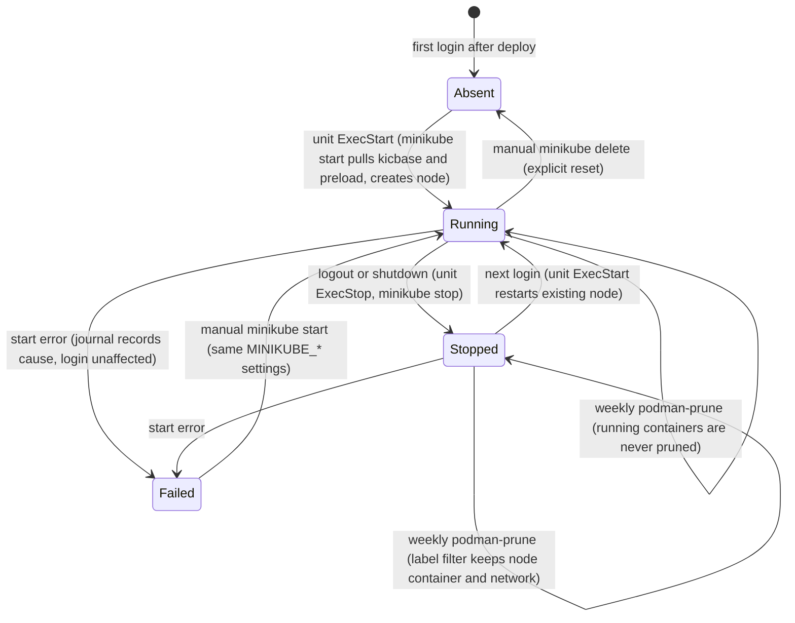

# Rootless Minikube Development Cluster - Plan

## Goal Capsule

- **Objective:** On both NixOS hosts, h82 logs in and already has a working single-node Kubernetes cluster for testing Helm charts and manifests and for opening deployed services in a browser, with `kubectl`, `helm`, and `minikube` on PATH and tab-completed in zsh.
- **Means:** Rootless minikube on the existing rootless Podman, started by a NixOS-declared systemd user unit, with the same minikube settings exported to the session so manual commands match (KTD2, KTD3).
- **Authority:** Product Contract requirements win on behavior; KTDs win on mechanism within them.
- **Open blockers:** None.
- **Stop conditions:** Stop and report if the pinned minikube ignores `MINIKUBE_*` environment variables for driver, container runtime, or rootless mode and offers no other non-mutable way to set them; or if `podman system prune --filter label!=…` is rejected by the pinned podman.
- **Execution profile:** Configuration change. Proof is repository checks (mutation-tested), the extended `podman-prune` VM check, every host output building, and a separately reported hardware run of the cluster.
- **Finish and ship:** `ce-work` implements and verifies locally; the calling pipeline ships. The PR closes issue #66.
- **Scope note:** This work absorbs issue #66 (CLI tools and zsh completions) and extends it with the auto-started cluster.

---

## Product Contract

Product Contract preservation: restructured, no scope change. The Outstanding Questions were all `Deferred to Planning` and are answered by KTD1–KTD7, so that section is removed. The Dependencies / Assumptions entry on rootless prerequisites now points at KTD5.

### Summary

Install `kubectl`, `helm`, and `minikube` with zsh completions on every host. On NixOS hosts, run a rootless minikube cluster on rootless Podman that starts with the user's session and keeps its state across restarts. Services are opened on demand with `kubectl port-forward` or `minikube service`.

### Problem Frame

Testing a Helm chart or opening a service in a browser currently starts with building a cluster by hand, and nothing about that cluster lives in this flake. Issue #66 asked for the CLI tools and completions, but tools alone still leave a manual cluster bring-up before every session. The hosts already run rootless Podman with Docker-compatible client settings, and both NixOS hosts load `kvm-intel`, so a local cluster can be built on what is already there.

### Key Decisions

- **The cluster is always on, not created on demand.** It is running whenever h82 is logged in, so work starts without a bring-up step. Governs R4. (session-settled: user-directed — chosen over an on-demand minikube/kind cluster created and deleted per use: the user wants the cluster ready without a manual step)
- **Rootless minikube on rootless Podman runs the cluster; k3s is not used.** Governs R3. (session-settled: user-directed — chosen over a k3s NixOS system service: the user wants the cluster run by rootless minikube on rootless Podman, accepting that the rootless Podman driver is experimental and cluster state is not declaratively managed)
- **Both NixOS hosts run the cluster.** The ThinkPad pays continuous CPU, memory, and battery cost for it. Governs R4. (session-settled: user-directed — chosen over MS-7D91 only: the user wants the same cluster on the laptop)
- **Services open through on-demand port forwarding, not ingress.** Governs R10. (session-settled: user-directed — chosen over an ingress addon with stable `<app>.localhost` URLs: port forwarding needs no host-side port publishing)
- **Cluster state persists; reset is explicit.** Governs R6. (session-settled: user-directed — chosen over a fresh empty cluster at every login: deployed releases and volumes should survive reboots, and `minikube delete` is the reset)
- **"Always on" means for the duration of h82's login session.** The cluster belongs to h82's user session, so it is not running after boot until h82 logs in. Governs R4.
- **CLI tools go to every host; auto-start goes to NixOS hosts only.** This flake does not install Podman on non-NixOS hosts, so it cannot promise a runtime there. Governs R1, R9.
- **minikube's default resource allocation is used.** No per-host CPU or memory tuning in this work.

### Requirements

**CLI tools**

- R1. `kubectl`, `helm`, and `minikube` are on h82's PATH on every host, NixOS and non-NixOS, production and bootstrap.
- R2. Tab completion works in interactive zsh for all three commands.

**Cluster lifecycle (NixOS hosts)**

- R3. A single-node minikube cluster runs as h82 on rootless Podman, with no rootful container runtime and no root-owned cluster process.
- R4. The cluster starts automatically when h82's session starts on both NixOS hosts, with no manual command.
- R5. Once the cluster is up, `kubectl` and `helm` reach it as h82 without `sudo` and without manual kubeconfig steps.
- R6. Namespaces, Helm releases, and persistent volume data survive logout, login, and reboot.
- R7. The weekly `podman-prune` run leaves the cluster able to start with its state intact, whether the cluster is running or stopped when the prune fires.
- R8. A failed auto-start neither blocks nor noticeably delays login, records its cause in h82's user journal, and leaves a manual `minikube start` working.
- R9. Non-NixOS hosts get no cluster auto-start.

**Service access**

- R10. A Service deployed to the cluster opens in a browser on a localhost port through `kubectl port-forward` or `minikube service`, with no further host configuration.

**Verification**

- R11. Repository checks fail when R1, R2, R4's auto-start wiring, R7's prune protection, or R9 regresses.
- R12. That the cluster actually comes up and serves R5, R6, and R10 is verified on hardware and reported separately from check evidence, per `docs/verification.md`.

### Acceptance Examples

- AE1. **Covers R4, R5, R6.** **Given** a Helm release installed in namespace `demo` before a reboot, **when** h82 reboots and logs in, **then** `kubectl get nodes` reports the node `Ready` and `helm list -n demo` shows the release, with no command run beforehand.
- AE2. **Covers R7.** **Given** the cluster was stopped with `minikube stop`, **when** the `podman-prune` service runs, **then** a later `minikube start` brings back the same cluster with the release from AE1.
- AE3. **Covers R8.** **Given** the auto-start fails (for example, the rootless Podman socket is unavailable), **when** h82 logs in, **then** the desktop session comes up normally, the user journal records why the start failed, and `minikube start` run by hand succeeds once the cause is fixed.
- AE4. **Covers R1, R9.** **Given** a non-NixOS host, **when** its Home Manager configuration is activated, **then** the three commands are on PATH and no cluster auto-start exists.
- AE5. **Covers R10.** **Given** a Service `web` on port 80 in namespace `demo`, **when** h82 runs `kubectl port-forward -n demo svc/web 8080:80`, **then** `<http://localhost:8080`> loads in the browser.

### Scope Boundaries

- No k3s, kind, or rootful Kubernetes runtime.
- No ingress addon, `minikube tunnel`, or stable hostnames for services.
- No loading of locally built Podman images into the cluster and no in-cluster registry.
- No remote access to the cluster API or services, including over Tailscale.
- No cluster auto-start or Podman installation on non-NixOS hosts.
- No per-host CPU or memory tuning, Kubernetes version pinning, or addon selection beyond minikube defaults.
- No cluster running before login (user lingering).
- Considered and not built: automatic restart of a failed auto-start (`Restart=on-failure`). A failure is visible in the journal and a manual `minikube start` recovers it (R8); a restart loop against a broken Podman namespace would only repeat the failure. Revisit if hardware runs show transient failures at login, such as DNS not yet up.
- Considered and not built: host kernel modules such as `br_netfilter` or `ip6_tables`. Nothing shows the rootless node needs them, and podman/netavark load what they use on demand. Revisit if the hardware run fails on missing netfilter support.
- Considered and not built: a recovery step that runs `minikube delete` when the node container is missing. It would destroy state silently, which R6 forbids.

### Dependencies / Assumptions

- The `my.podman` trait stays enabled by default on NixOS hosts through `modules/nixos/profile.nix`, and the rootless socket at `$XDG_RUNTIME_DIR/podman/podman.sock` is what `home/h82/dev/containers.nix` points `DOCKER_HOST` at.
- `podman-prune` runs `podman system prune --force` weekly without `--volumes` or `--all` (`modules/nixos/services/podman.nix`); `tests/podman-prune.nix` shows named volumes survive it, so the exposure is the stopped node container and its network.
- The first cluster start pulls images from the network and can take minutes; later starts reuse the stored node.
- minikube's rootless Podman driver is experimental upstream. Its host prerequisites on NixOS are handled by KTD5; anything else surfaces in the hardware run.

### Sources / Research

- Issue #66: `kubectl`, `helm`, `minikube` packages and zsh completions.
- `modules/nixos/services/podman.nix`: rootless Podman trait and the `podman-prune` user timer.
- `home/h82/dev/containers.nix`: `DOCKER_HOST` and registry settings, imported on every host.
- `home/h82/shell/shell.nix`: zsh with `enableCompletion = true`.
- `home/h82/dev/default.nix`: `hostKind` gating for NixOS-only Home Manager modules.
- `tests/podman-prune.nix`, `tests/vm-checks.nix`: existing Podman checks and VM check registration.
- minikube Podman driver documentation: <https://minikube.sigs.k8s.io/docs/drivers/podman/>
- minikube environment variables (`MINIKUBE_<FLAG>` for any start flag or config value): <https://minikube.sigs.k8s.io/docs/handbook/config/>
- Rootless cgroup v2 delegation: <https://rootlesscontaine.rs/getting-started/common/cgroup2/>
- systemd's default `user@.service` delegation (`pids memory cpu`): <https://raw.githubusercontent.com/systemd/systemd/main/units/user@.service.in>
- `podman system prune` filters: <https://docs.podman.io/en/latest/markdown/podman-system-prune.1.html>
- nixpkgs packages: `pkgs/by-name/mi/minikube/package.nix` (zsh completion, `bin/kubectl` symlink), `pkgs/by-name/ku/kubectl/package.nix`, `pkgs/applications/networking/cluster/helm/default.nix`.

---

## Planning Contract

### Key Technical Decisions

- KTD1. **CLI tools live in a new `home/h82/dev/kubernetes.nix`, imported unconditionally, with `lib.hiPrio pkgs.kubectl`.** The nixpkgs `minikube` package links its own `bin/kubectl` to the minikube binary (a `minikube kubectl --` shim that downloads kubectl), so without priority the two collide in the profile or the shim wins. `lib.hiPrio` follows `home/h82/security/ssh.nix`. Zsh completions need no wiring: all three packages install `share/zsh/site-functions/_<cmd>`, and Home Manager's zsh adds every profile's site-functions to `fpath` before prezto runs `compinit`. Covers R1, R2.
- KTD2. **Auto-start is a NixOS module, `modules/nixos/services/minikube.nix`, behind a new NixOS-only trait `my.minikube.enable` defaulted in `modules/nixos/profile.nix` to `config.my.podman.enable && !config.my.bootstrap`.** Home Manager cannot read `my.podman` (it is declared in the NixOS module, not `modules/shared/host.nix`), so the unit belongs beside `podman-prune`. A profile default keeps both hosts identical, as CONCEPTS.md's host-trait rule requires, while giving checks a `withTrait` handle. Bootstrap is excluded, following `tailscale` and `protonVpn`: the first start needs network and an installer console gains nothing from a cluster. Instantiates the "both NixOS hosts" and "always on" Key Decisions (R4). Non-NixOS outputs import no NixOS module, which delivers R9 by construction.
- KTD3. **One set of `MINIKUBE_*` environment variables carries driver `podman`, container runtime `containerd`, and rootless mode, and feeds both the unit and the login session.** minikube reads any start flag or config value from `MINIKUBE_<FLAG>`. Putting the same values in the unit's `Environment` and in NixOS `environment.sessionVariables` means a hand-run `minikube start` (R8) uses the rootless Podman driver instead of falling back to `sudo -n podman`. Nothing is written through `minikube config set` or `home.activation`, which reruns only when the generation changes. The attrset is defined once in the module and reused for both. `minikube start` writes and selects the `minikube` context in `~/.kube/config`, so `kubectl` and `helm` reach the cluster without extra configuration. Covers R3, R5, R8.
- KTD4. **The unit is `systemd.user.services.minikube` with `Type=exec`, `RemainAfterExit=yes`, `ExecStart=minikube start`, `ExecStop=minikube stop`, `ConditionUser=<my.user.name>`, and `wantedBy = [ "default.target" ]`.** A target waits for the units it wants, and `pam_systemd` waits for the user manager to reach `default.target`, so a `Type=oneshot` start that pulls images for minutes would hold up login. `Type=exec` is active as soon as the binary runs, so login proceeds while `minikube start` works. A non-zero exit still marks the unit failed with the cause in the journal. `RemainAfterExit` keeps the unit active after a successful start so `ExecStop` stops the node at session end, which leaves state on disk for the next login (R6). `ConditionUser` keeps system accounts such as the SDDM greeter from starting it, as in `podman-prune`. The unit's `path` carries `config.virtualisation.podman.package`, whose wrapper keeps `/run/wrappers` for `newuidmap`. No unit orders itself `After=` minikube. Covers R4, R6, R8.
- KTD5. **The module sets `systemd.services."user@".serviceConfig.Delegate = "cpu cpuset io memory pids"`.** systemd 261 delegates only `pids memory cpu` to `user@.service`, and the rootless guide minikube points to requires `cpuset` and `io` too. NixOS does not restart `user@` on switch, so the change takes effect after a reboot or a full logout; the hardware run must reboot first. Covers R3.
- KTD6. **`podman-prune` skips minikube's objects with `--filter label!=created_by.minikube.sigs.k8s.io`, unconditionally.** Reading minikube's source, a Podman node container that prune removed is not recreated (`machineExists` handles Docker only), so `minikube start` would fail and only `minikube delete` would recover, losing state. Excluding the label keeps the stopped node container and its network. The filter applies whether or not the minikube trait is on, because it changes nothing for unlabelled objects and keeps `podman.nix` free of a cross-module condition. Covers R7.
- KTD7. **Checks are static where possible and VM-based only for prune.** `tests/kubernetes-tools.nix` runs the tools and reads completion files from every host's `home.path`. `tests/minikube-autostart.nix` greps the materialized `/etc/systemd/user` and `/etc/systemd/system` trees and the session variables across the trait split, including bootstrap, and asserts the non-NixOS fixtures carry no minikube unit. The existing `podman-prune` VM check gains labelled and unlabelled objects. A full cluster start needs image pulls, so it stays a hardware check (R12). Covers R11.

### High-Level Technical Design

Lifecycle of the cluster across a session and the weekly prune. The prose in KTD3–KTD6 is authoritative.

### Assumptions

- The pinned minikube (1.38.1) honours `MINIKUBE_DRIVER`, `MINIKUBE_CONTAINER_RUNTIME`, and `MINIKUBE_ROOTLESS`. U2 confirms the names against the pinned source or `minikube start --help` before relying on them (stop condition in the Goal Capsule).
- minikube labels its node container and network with `created_by.minikube.sigs.k8s.io=true`. The VM check proves the filter honours the label; the hardware run confirms minikube applies it to both objects.
- A nixpkgs bump that changes minikube's default Kubernetes version does not break an existing cluster: minikube keeps the existing cluster's version and only suggests an upgrade.

### Risks

| Risk | Mitigation |
| --- | --- |
| Rootless Podman's shared pause process was started from inside the Orca sandbox, so the unit inherits a broken namespace (`.compound-engineering/artifacts/solutions/integration-issues/orca-sandbox-pause-process-poisons-host-rootless-podman.md`). | The unit runs from the host user manager, outside any sandbox. `docs/verification.md` records `podman system migrate` from a host terminal as the recovery. |
| The delegation change appears not to work because `user@` was not restarted. | The hardware procedure reboots before checking controllers. |
| The first start exceeds the time a user expects and looks like a failure. | `Type=exec` keeps login unaffected. The docs say the first start downloads images and can take minutes. |
| A minikube upgrade needs a newer kicbase image and the next login start is slow or fails. | The failure is visible in the journal (R8), and a manual `minikube start` recovers it. |

### Sequencing

U1 and U3 are independent. U2 depends on nothing but should land after U3 so the prune protection exists before any host starts a cluster. U4 lands last because it documents all three.

---

## Implementation Units

### U1. Kubernetes CLI tools with zsh completions

**Goal:** `kubectl`, `helm`, and `minikube` are on PATH with working zsh completions on every host.

**Requirements:** R1, R2, R11 (KTD1).

**Dependencies:** None.

**Files:**

- Create `home/h82/dev/kubernetes.nix`.
- Modify `home/h82/dev/default.nix` (ungated import).
- Create `tests/kubernetes-tools.nix`.
- Modify `flake.nix` (register the check; add it to `hostClosureChecks` because it reads host generations).

**Approach:**

1. Add `(lib.hiPrio pkgs.kubectl)`, `pkgs.kubernetes-helm`, and `pkgs.minikube` to `home.packages` in the new module.
2. The check iterates `configurations.userEntries` with `userGuard`, as `tests/session-variables.nix` does, so NixOS and non-NixOS fixture hosts, production and bootstrap, are all covered.

**Patterns to follow:** `tests/shell-utilities.nix` (run each tool and compare output, `or` fallbacks so removal fails in the builder, collected failures), `home/h82/security/ssh.nix` (`lib.hiPrio`), `tests/session-variables.nix` (userEntries iteration).

**Test scenarios:**

- For each user entry, `bin/kubectl version --client` prints a client version.
- For each user entry, `bin/helm version --short` and `bin/minikube version --short` print versions.
- For each user entry, `bin/kubectl` resolves (after `readlink -f`) into the kubectl package, not the minikube package.
- For each user entry, `share/zsh/site-functions/_kubectl`, `_helm`, and `_minikube` exist and their first line starts with `#compdef` naming the command.
- Mutation: removing any of the three packages, or dropping `lib.hiPrio` from kubectl, fails the check in the builder.

**Verification:** The check passes on every host entry and fails under each mutation above.

### U2. Auto-started rootless minikube on NixOS hosts

**Goal:** On NixOS hosts with the trait on, h82's user manager starts a rootless minikube cluster at login without delaying it, and manual minikube commands use the same settings.

**Requirements:** R3, R4, R5, R6, R8, R9, R11 (KTD2, KTD3, KTD4, KTD5).

**Dependencies:** U3 should land first (see Sequencing).

**Files:**

- Create `modules/nixos/services/minikube.nix`.
- Modify `modules/nixos/profile.nix` (import the module; default `my.minikube.enable`).
- Create `tests/minikube-autostart.nix`.
- Modify `flake.nix` (register the check in `hostClosureChecks`).

**Approach:**

1. Declare `options.my.minikube.enable` in the new module, and default it in the profile per KTD2.
2. Under `lib.mkIf`, define the `MINIKUBE_*` attrset once (KTD3) and use it for `environment.sessionVariables` and the unit's `environment`.
3. Define the user unit per KTD4, with the wrapped podman package on its `path`.
4. Set the `user@` delegation per KTD5.
5. Confirm the `MINIKUBE_*` variable names against the pinned minikube before relying on them; stop per the Goal Capsule if they are not honoured.

**Execution note:** The cluster start itself is proven on hardware (U4); the repository check proves the wiring.

**Patterns to follow:** `modules/nixos/services/podman.nix` (`ConditionUser`, wrapped podman on the unit path, trait option shape), `modules/nixos/profile.nix` (`tailscale`/`protonVpn` bootstrap-off defaults), `tests/podman-containers.nix` (`withTrait` split, whole-line greps of the materialized `/etc/systemd/user` tree, nullglob-safe `*.wants` loop).

**Test scenarios:**

- With the trait on, `/etc/systemd/user/minikube.service` contains `Type=exec`, `RemainAfterExit=yes`, `ConditionUser=h82`, an `ExecStart=` running `minikube start`, an `ExecStop=` running `minikube stop`, and an `Environment=` line carrying each `MINIKUBE_*` value.
- With the trait on, `default.target.wants/minikube.service` links to the real unit, and the unit file is not a `/dev/null` mask.
- With the trait on, the unit's PATH includes the wrapped podman package.
- With the trait on, the materialized `user@.service` drop-in carries `Delegate=cpu cpuset io memory pids`.
- With the trait on, the session variables (`/etc/set-environment` or the PAM environment) carry the same `MINIKUBE_*` values as the unit.
- With the trait forced off, and on every bootstrap output, none of the unit, the wants link, or the session variables exist, and the materialized `user@.service.d/overrides.conf` carries no `Delegate=` line with `cpuset`. That drop-in exists on every NixOS output because nixpkgs sets `restartIfChanged = false` on `user@`, so the check asserts on the line, not the file.
- A production configuration re-evaluated with `my.podman.enable` forced to false (through `extendModules`, as `withTraitForcedOff` in `tests/lib/configurations.nix` does) has no minikube unit, wants link, `cpuset` delegation line, or `MINIKUBE_*` session variable.
- Covers AE4. Every non-NixOS fixture's `home-files/.config/systemd/user/` and its `systemConfigs` output contain no `minikube` unit.
- Mutations: disabling the unit entry, switching `Type` to `oneshot`, dropping `ConditionUser`, dropping a `MINIKUBE_*` value from either consumer, removing `cpuset` from `Delegate`, and gating the default on something other than podman-and-not-bootstrap each fail the check.

**Verification:** The check passes on every host output and fails under each mutation; both NixOS hosts build, production and bootstrap.

### U3. Keep minikube's objects out of the weekly prune

**Goal:** The weekly `podman-prune` run no longer removes minikube's stopped node container or its network, and still removes everything else it removed before.

**Requirements:** R7, R11 (KTD6).

**Dependencies:** None.

**Files:**

- Modify `modules/nixos/services/podman.nix`.
- Modify `tests/podman-prune.nix`.
- Modify `tests/podman-containers.nix` (its exact `ExecStart` assertion).

**Approach:**

1. Add `--filter label!=created_by.minikube.sigs.k8s.io` to the prune `ExecStart`, keeping `--force` and adding no `--volumes` or `--all`.
2. In the VM check, seed a stopped container and a network labelled `created_by.minikube.sigs.k8s.io=true`, beside the existing unlabelled stopped container.

**Patterns to follow:** `tests/podman-prune.nix` (offline `dockerTools` images, `ConditionResult` check), the converged-fixture learning (`.compound-engineering/artifacts/solutions/best-practices/converged-fixture-state-defeats-nix-check-mutation-testing.md`).

**Test scenarios:**

- Covers AE2. After the prune unit runs, the labelled stopped container and the labelled network still exist.
- After the same run, the unlabelled stopped container and an unused unlabelled network are gone, and the named volume and tagged image still exist as before.
- The static check asserts the exact new `ExecStart` line.
- Mutation: removing the filter fails the VM check because the labelled objects disappear. Mutation: a filter that excludes everything fails it because the unlabelled objects survive.

**Verification:** `vmChecks.podman-prune` passes and fails under both mutations; the static podman check passes.

### U4. Documentation and hardware verification

**Goal:** A reader can find the cluster in the repository map, verify it on hardware, and recover from the known failure modes.

**Requirements:** R12 (and documents R5, R6, R8, R10).

**Dependencies:** U1, U2, U3.

**Files:**

- Modify `docs/verification.md`.
- Modify `AGENTS.md` (the `modules/nixos/services/` list and the trait list in Project structure).

**Approach:**

1. Add a hardware procedure to `docs/verification.md`: reboot, log in, check delegated controllers include `cpuset`, check `systemctl --user status minikube`, then run AE1, AE2 (stop, start `podman-prune`, start), AE3, and AE5. For AE3, induce a failure on the path minikube actually uses, the `podman` CLI, for example by temporarily removing `podman` from the unit's reach or by a broken rootless pause-process namespace; an unavailable Podman socket does not fail minikube, which never uses the socket. AE1's reboot also proves that a stop during logout or shutdown, which can race the user manager stopping the node container's scope, leaves the next start working.
2. Record the recoveries: `podman system migrate` from a host terminal for a poisoned pause process, `minikube delete` as the explicit reset, and that the first start downloads images for minutes.
3. Add `minikube` to the AGENTS.md services list and `my.minikube` to the trait list.

**Test expectation:** none -- documentation only.

**Verification:** The procedure names each AE it exercises, and AGENTS.md lists the new module and trait.

---

## Verification Contract

| Gate | Command | Proves |
| --- | --- | --- |
| Formatting | `nix fmt -- --ci` | Nix layout |
| Flake checks | `nix flake check` | U1 and U2 checks, guards (`host-name-guard`, `check-shards-guard`, `vm-checks-guard`) |
| Prune VM check | `nix build --no-link .#vmChecks.podman-prune` | U3 |
| All VM checks | `nix build --no-link .#vmChecks.all` | No regression in other VM checks |
| Host outputs | Every `nixosConfigurations`, `homeConfigurations`, and `systemConfigs` output, production and bootstrap, per AGENTS.md | All hosts build |
| Mutation testing | Each mutation listed in U1–U3, run in a scratch copy per `.compound-engineering/artifacts/solutions/best-practices/copied-git-worktree-writes-the-real-index.md` | Checks are not decorative |
| Hardware | `docs/verification.md` procedure from U4 | R5, R6, R10, R12; reported separately from check evidence |

## Definition of Done

- Every unit's Verification holds, and every gate above except Hardware passes.
- Each listed mutation was run and made its check fail, and the mutation was reverted.
- The hardware procedure is either run with results reported, or reported as not yet run; it is never folded into check evidence.
- No experimental or abandoned code from approaches that did not pan out remains in the diff.
