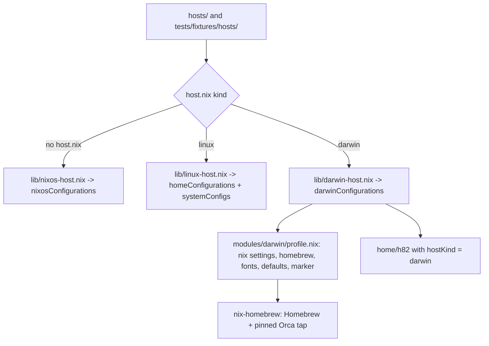
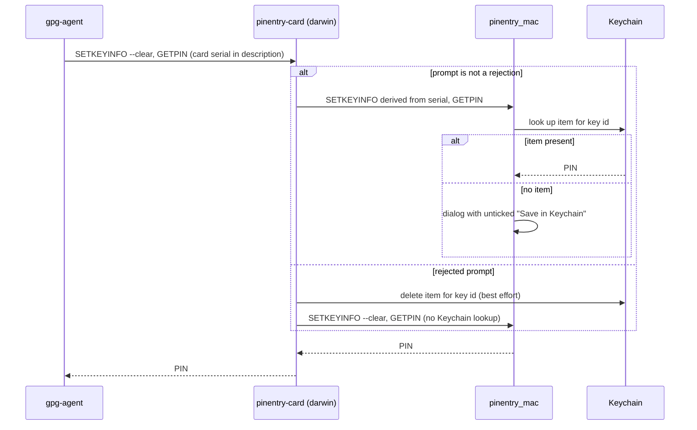

# macOS Darwin Hosts - Plan

## Goal Capsule

- **Objective:** On the day a new Apple Silicon Mac is bought, adding one directory under `hosts/` and running one apply gives it the same shell, development tools, coding-agent configuration, Git signing, CLI authentication, GUI apps, and fonts as the NixOS hosts.
- **Means:** A third host kind, `darwin`, assembled with nix-darwin for the system layer and Home Manager inside it for the user environment (KTD1).
- **Product authority:** This plan, then `AGENTS.md`, then the [non-NixOS Linux hosts plan](2026-09-30-2331-feat-non-nixos-linux-hosts-plan.md) for the host-kind model and non-NixOS secrets. R20 amends the `AGENTS.md` and `README.md` statements that macOS is out of scope.
- **Open blockers:** None.
- **Execution profile:** Nix configuration, packaging scripts, checks, CI, and documentation. No Mac exists, so the darwin evidence is a fixture darwin host built and checked on a GitHub macOS arm runner. Nothing is activated on any machine, and no `nr switch` or `darwin-rebuild switch` runs.
- **Stop conditions:** Stop and report if any existing NixOS, Home Manager, or system-manager output changes its derivation path (R4). Also stop if the fixture darwin system cannot be built on the CI macOS arm runner, or if a new check cannot be made to fail by the mutation it exists to catch.
- **Finishes the work:** `ce-work` implements and verifies. The `lfg` pipeline reviews the work, opens the PR, and watches CI.

---

## Product Contract

Product Contract preservation: changed: R19 — Homebrew is installed by the first apply instead of by hand (KTD3), which removes a manual step and serves the Objective. Restructured, no scope change: R12's "one list shared by both operating systems" is realized as the NixOS list plus a darwin mapping that a check keeps complete (KTD5); R9 keeps its wording; its mechanism and the GnuPG constraint behind it are on KTD7. The Outstanding Questions are resolved in place by KTD2 to KTD12.

### Summary

The flake gains a third host kind for Apple Silicon Macs. nix-darwin applies the system layer and Home Manager applies the user environment, together, through one `nr switch`. The user environment matches the Linux hosts. The GUI app list and fonts match the NixOS hosts. macOS system defaults get a place to be declared but no values yet. A fixture darwin host built in CI stands in for the Mac that has not been bought.

### Problem Frame

A Mac purchase is planned. The flake produces nothing for macOS today. `my.kind` in `modules/shared/host.nix:19-26` accepts only `nixos` and `linux`. `flake.nix` has no nix-darwin input and no darwin system. The non-NixOS Linux plan deferred macOS to its own plan and left open how secrets, the desktop, and the system layer map to it.

Without this work, the new Mac would be set up by hand. Its shell, Git signing, agent settings, tokens, and apps would drift from the other hosts and be rebuilt from memory, which is the situation the non-NixOS Linux plan removed for Linux machines.

Several parts of the current user environment assume Linux. Desktop modules, Ghostty configuration, and GUI packages are gated on `hostKind == "nixos"` (`home/h82/default.nix:13-20`). Containers use a rootless Podman socket and systemd user session variables (`home/h82/dev/containers.nix:15-26`). The T3 Code desktop app asserts it is NixOS-only (`home/h82/t3code.nix:24`). Fonts are a NixOS system module (`modules/nixos/desktop/fonts.nix`). Four gates test `my.kind == "linux"`, so a darwin host would silently get the NixOS or bootstrap behaviour at each of them.

### Key Decisions

- **macOS covers the user environment, the system layer, and the desktop.** (session-settled: user-directed — chosen over the user environment only, the user environment plus system layer without desktop, or CI parity alone: first-class support includes apps.)
- **The darwin host kind and the macOS desktop share one plan.** (session-settled: user-approved — chosen over separate plans: the desktop is part of what "first-class" means here, and implementation can still build the host kind first.)
- **Done means ready to apply on purchase day, proven by CI.** Governs R17, R18. (session-settled: user-directed — chosen over a capability gap report to inform the purchase, or a platform-neutral refactor ahead of any darwin output: the goal is a one-step setup when the Mac arrives.)
- **Apple Silicon only.** Governs R1. Intel Macs are no longer sold, and a second darwin architecture would add a CI target with no planned machine.
- **nix-darwin with Home Manager embedded, one apply.** Governs R2, R3. This mirrors the NixOS assembly rather than the two-output Linux assembly, because nix-darwin applies both layers in one activation.
- **Desktop scope is apps and fonts; macOS defaults get a foundation only; keyboard is out.** Governs R12, R15, R16. (session-settled: user-directed — chosen over declaring every desktop area now, or excluding the desktop: concrete Dock, Finder, and keyboard values are better chosen on the real machine.)
- **The macOS app list mirrors the NixOS GUI app list, with substitutes for Linux-only apps.** Governs R12. (session-settled: user-approved — chosen over a separate macOS list or a minimal core list: one list applies to both operating systems.)
- **Apps installed outside the list are left alone.** Governs R13. (session-settled: user-approved — chosen over uninstalling unlisted apps, or uninstalling them with their data: manual installs stay possible, at the cost of drift.)
- **OrbStack replaces rootless Podman and minikube on macOS.** Governs R14. (session-settled: user-directed — chosen over Podman machine, CLI-only with a manual VM, or no containers: a native macOS runtime.)
- **The YubiKey works through GPG with macOS's own smart card support, and its PIN can be saved in the macOS Keychain.** Governs R8, R9. (session-settled: user-directed — chosen over the Linux pcscd and card pinentry setup without Keychain, and over `pinentry_mac` alone with its default Keychain saving: PIN entry should use macOS's native prompt and Keychain, and `pinentry_mac` alone never offers the Keychain for a card PIN.)
- **Secrets use the Linux non-NixOS model.** Governs R7. A per-host, user-owned age identity decrypts the CLI tokens and host SSH key during activation. The macOS Keychain is not used to hold secrets other than the GPG PIN.

### Requirements

**Host model**

- R1. A directory under `hosts/` whose `host.nix` declares `kind = "darwin"` and `system = "aarch64-darwin"` is discovered as a macOS host named by its directory.
- R2. Each macOS host builds a production output and a secret-free `<host>-bootstrap` output, matching the bootstrap model of the other host kinds.
- R3. On a macOS host, `nr switch` builds and applies the system layer and the user environment together, and `nr build` builds them without applying.
- R4. Every existing NixOS, Home Manager, and system-manager output keeps its store path.
- R5. Modules and checks branch on `my.kind`, traits, and `my.bootstrap`, never on a host name, and the `host-name-guard` check covers the darwin fixture host.

**User environment and authentication**

- R6. A macOS host gets the same shell, development tools, coding-agent configuration, Git signing, and gh and glab authentication as a non-NixOS Linux host.
- R7. The production output decrypts the CLI tokens and the host SSH key from a per-host, user-owned age identity during activation, and aborts the activation when the identity or a secret is wrong.
- R8. GPG uses the YubiKey for signing and decryption through macOS's native smart card support, with no pcscd service.
- R9. When GPG needs the YubiKey PIN, a macOS-native dialog asks for it and offers to save it in the macOS Keychain; the PIN is saved only when the user ticks that option.
- R10. Linux-only pieces of the user environment, such as systemd user units and the Podman socket variables, are absent from a macOS host instead of failing on it.

**System layer**

- R11. The system layer sets the Nix configuration the other hosts use, such as substituters and enabled experimental features, and declares nothing beyond what R6 to R16 need.

**Desktop**

- R12. A macOS host installs the macOS build of each app in the NixOS GUI app list, from one list shared by both operating systems; a Linux-only app is replaced by a macOS built-in or left out, and Kleopatra, Okular, and ksshaskpass are not installed.
- R13. An apply installs and updates listed apps, and leaves apps installed outside the list in place.
- R14. OrbStack is installed as the container runtime, and the container registry credentials published on other hosts are published for the docker CLI.
- R15. A macOS host installs the same font set as the NixOS hosts, and Ghostty uses the same configuration as on NixOS.
- R16. A darwin-only place exists to declare macOS system defaults, and this plan sets no Dock, Finder, trackpad, appearance, or keyboard values in it.

**Verification and documentation**

- R17. A fixture darwin host under `tests/fixtures/hosts/` builds its production and bootstrap outputs in CI on a GitHub macOS arm runner, and the repository checks that read a host generation run against it.
- R18. Adding the real Mac requires only a new `hosts/<name>/` directory with `host.nix` and `default.nix`, plus the host's encrypted secrets.
- R19. `docs/adding-a-host.md` describes adding a macOS host and the first-run steps on a new Mac: installing Nix, the first apply that also installs Homebrew, and recovering the age identity with the YubiKey.
- R20. `AGENTS.md` and `README.md` describe macOS hosts as in scope, and CI documentation names the macOS job.

### Key Flows

- F1. First setup of a new Mac
  - **Trigger:** The Mac has been bought and its user account created.
  - **Steps:** The user adds `hosts/<name>/` with `host.nix` and `default.nix` and encrypts the host's secrets on another machine. On the Mac, the user installs Nix per the documented step and applies the bootstrap output, which also installs Homebrew and the listed apps. The user recovers the age identity with the YubiKey, then applies the production output with `nr switch`.
  - **Outcome:** The shell, tools, agent configuration, tokens, Git signing, apps, and fonts match the other hosts.
  - **Covered by:** R2, R3, R7, R12, R15, R18, R19

### Acceptance Examples

- AE1. **Covers R13.** Given the user installed an app by hand that is not in the list, when `nr switch` runs, then the app is still installed afterwards.
- AE2. **Covers R9.** Given the YubiKey is inserted and no PIN is saved, when the user signs a Git commit, then a macOS dialog asks for the PIN with a Keychain option. If the user ticked it, the next signature in a later session does not ask again.
- AE3. **Covers R7.** Given the age identity is missing, when the production output is applied, then the activation aborts before any link changes. The bootstrap output still applies.
- AE4. **Covers R10.** Given a macOS host, when its user environment is built, then no systemd user unit or Podman socket variable is part of it.

### Scope Boundaries

- Intel Macs (x86_64-darwin).
- Dock, Finder, trackpad, appearance, and keyboard values, including a Caps Lock input-source toggle. R16 only prepares the place for them.
- OrbStack's built-in Kubernetes configuration, and a minikube equivalent on macOS.
- Uninstalling unlisted apps or deleting their data.
- Pinning GUI app versions. Casks from Homebrew's core taps resolve through Homebrew's API at apply time (KTD3), and many apps update themselves afterwards, so their versions are less reproducible than on NixOS. The T3 Code desktop app is the exception: it comes from the flake's nightly pin (KTD14).
- Scheduled Nix store optimisation on darwin. Leaving it out only costs disk space the user can see; R11 asks for nothing beyond the shared settings.
- A preflight that proves the age identity decrypts before `nr switch` activates the system layer. A wrong identity fails the user activation loudly after the system layer and casks already switched; re-running with the right identity converges, so the partial state is visible and cheap to fix.
- Mac App Store apps.
- Holding secrets other than the GPG PIN in the macOS Keychain.
- Activating a real Mac. The first `nr switch` on real hardware is reported separately from CI evidence, per `docs/verification.md`.
- System-level NixOS apps outside the agreed GUI list: Tailscale, Proton VPN, and WinBox. The NixOS hosts run them as system services or system modules, and the brainstorm's app list did not include them.

### Dependencies / Assumptions

- The repository is public, so GitHub's macOS arm runners carry no cost.
- GPG on macOS uses the YubiKey through `PCSC.framework` without pcscd. nixpkgs builds gnupg on darwin with `--disable-ccid-driver`, and scdaemon defaults to `PCSC.framework` on Apple platforms, so the current `scdaemon.conf` applies unchanged. Hardware confirms it after purchase.

### Sources / Research

- [Non-NixOS Linux hosts plan](2026-09-30-2331-feat-non-nixos-linux-hosts-plan.md): the host-kind model, the bootstrap model, and the deferral of macOS.
- `modules/shared/host.nix:19-26`: the `my.kind` enum.
- `lib/hosts.nix:11-33`: host discovery by the presence of `host.nix`.
- `lib/linux-host.nix` and `lib/nixos-host.nix`: the two existing assemblies.
- `home/h82/default.nix:13-73`: the `gui` gating, the GUI package order, and the `nr` selection.
- `home/h82/security/non-nixos-secrets.nix`, `scripts/host-secrets`: the user-owned age identity and staged activation.
- `home/h82/security/gpg.nix:46-59`, `packages/gpg-tools.nix`, `scripts/pinentry-card`: the agent, the card pinentry proxy, and its existing macOS `security` backend, which the darwin-only source reuses.
- `home/h82/t3code.nix:24`: the NixOS-only assertion on the T3 Code desktop app.
- `.github/workflows/check.yml:236-258` and `tests/check-workflow-docs-skip.sh`: the runner routing and the workflow shape guard.
- nix-darwin manual (`homebrew.*`, `system.primaryUser`, `nix.*`): <https://nix-darwin.github.io/nix-darwin/manual/index.html>
- nix-homebrew: <https://github.com/zhaofengli/nix-homebrew>
- GitHub-hosted macOS runners: <https://docs.github.com/en/actions/using-github-hosted-runners/about-github-hosted-runners>

---

## Planning Contract

### Key Technical Decisions

- KTD1. **A third assembly, `lib/darwin-host.nix`, builds `darwinConfigurations.<host>` and `<host>-bootstrap` with `nix-darwin.lib.darwinSystem` and Home Manager's darwin module.** Governs R1, R2, R3. It mirrors `lib/linux-host.nix`'s interface (`hostName`, `dir`, `bootstrap`, `extraModules`) so the fixture goes through the same function, and `lib/nixos-host.nix`'s embedded Home Manager wiring (`hostKind` special arg, `useGlobalPkgs`, `sharedModules` with `lib/host-facts.nix`). The user comes from `config.my.user.name`, not a hard-coded `h82`. nix-darwin follows the repo's `nixpkgs` (unstable) on its master branch, because a release branch would force release branches of nixpkgs and Home Manager.
- KTD2. **Upstream multi-user Nix, with nix-darwin owning `nix.conf`.** Governs R11, R19. The Linux hosts and every CI job already use the upstream installer (`docs/adding-a-host.md:289-292`, `cachix/install-nix-action`), and Determinate Nix would require `nix.enable = false`, which turns off `nix.settings` and breaks R11. The darwin profile imports `modules/shared/nix-settings.nix` and overrides only `auto-optimise-store` to false, because store auto-optimisation corrupts the store on macOS (NixOS/nix#7273). The shared file stays unchanged, so R4 holds.
- KTD3. **nix-homebrew installs Homebrew; nix-darwin's `homebrew` module installs and upgrades the casks.** Governs R12, R13, R19. With nix-homebrew, the first apply installs Homebrew, so the manual first-run step is only installing Nix. Only the third-party `stablyai/orca` tap becomes a non-flake input with `mutableTaps = false`; Homebrew 4 installs `homebrew/core` and `homebrew/cask` packages from its JSON API and ignores local checkouts, so pinning those taps would pin nothing and add two large downloads to every evaluation. `homebrew.onActivation.cleanup` stays `"none"` and is asserted (R13). `upgrade` is on, so an apply installs missing listed casks and upgrades outdated ones; self-updating casks are left to their own updater. `autoUpdate` stays off. Hand installs keep working, which keeps AE1 true.
- KTD4. **A named predicate for the non-NixOS model replaces every `my.kind == "linux"` test.** Governs R6, R7, R10. The four gates in `home/h82/security/ssh.nix:20`, `home/h82/security/non-nixos-secrets.nix:60` and `:94`, and `home/h82/agents/tokscale.nix:22` change to "kind is not nixos", so darwin gets the host SSH key, the staged secrets, and the state-directory tokens. Linux-only constructs are gated on `my.kind == "linux"` explicitly. Gates that read `hostKind` for imports stay import-time.
- KTD5. **The NixOS GUI list stays the source; a darwin mapping covers every entry and a check keeps it complete.** Governs R12. Moving the NixOS list into shared data would reorder `home.packages` and change the NixOS store path (R4, comment at `home/h82/default.nix:9-12`). Instead, `home/h82/darwin-apps.nix` maps each NixOS GUI package name to a cask, a Nix package, or an explicit "left out" with a reason. A Linux-side check fails when a NixOS GUI package has no mapping entry, so adding an app on NixOS forces a darwin decision. The check computes the NixOS GUI set from evaluated outputs rather than a hand list: the `home.packages` names of a NixOS configuration minus those of a Linux fixture, plus VSCodium, Ghostty, and the 1Password GUI. (The hand list in `tests/non-nixos-outputs.nix:45-60` already misses ChatGPT.) Kleopatra, Okular, and ksshaskpass map to "left out" (macOS has Preview and its own askpass); WinBox maps to "left out" per Scope Boundaries.
- KTD6. **Casks for the GUI apps, except VSCodium and T3 Code.** Governs R12, R15. Claude Desktop, ChatGPT, and Orca are `.deb` or AppImage builds in this repo, and LibreOffice and Yubico Authenticator are Linux-only in nixpkgs, so casks are the only macOS source for most of the list. Ghostty is the `ghostty` cask with `programs.ghostty.package = null`, so Home Manager still writes the same settings. VSCodium keeps the nixpkgs package on darwin, because `home/h82/dev/vscodium.nix` manages extensions and settings through Home Manager and needs the package; its user directory follows the platform (`Library/Application Support/VSCodium/User` on darwin), with the Linux value unchanged. The T3 Code desktop app comes from the nightly pin (KTD14). Cask names: `google-chrome`, `discord`, `telegram`, `libreoffice`, `yubico-authenticator`, `claude`, `chatgpt`, `stablyai/orca/orca`, `ghostty`, `1password`, `orbstack`.
- KTD7. **`pinentry-card` gains a darwin build that passes a per-card key id to `pinentry_mac`, so `pinentry_mac` shows its "Save in Keychain" option and answers later prompts from the Keychain.** Governs R8, R9, AE2. (session-settled: user-directed — chosen over the Linux pcscd and card pinentry setup without Keychain, and over `pinentry_mac` alone with no in-house code: PIN entry should use macOS's native prompt and Keychain, which `pinentry_mac` alone cannot offer for a smart card PIN.) Stock GnuPG 2.4.9 sends `SETKEYINFO --clear` for card PINs (`agent/divert-scd.c`, `agent/call-pinentry.c`), and `pinentry_mac` offers the Keychain checkbox only when key info is set. A plain `pinentry_mac` therefore never offers it for a YubiKey PIN. The repo's own Assuan proxy, `scripts/pinentry-card`, already sits between gpg-agent and the delegate and already has a macOS `security` backend (`tests/pinentry-card.sh:218-254`). The darwin behaviour lives in a darwin-only source, because `packages/gpg-tools.nix` installs the script by content and any edit would change the Linux store path (R4). That source is a front-stage filter between gpg-agent and a darwin render of the shared proxy, which it runs as its child. gpg-agent sends `SETKEYINFO` before `SETDESC` and `SETERROR` (`agent/call-pinentry.c` `agent_askpin`), so the filter answers the agent's `SETKEYINFO` with `OK` itself, tracks the description and error with the shared `Prompt` logic, and only at `GETPIN` sends the child its chosen `SETKEYINFO`, consuming that reply before forwarding `GETPIN`. The agent therefore sees exactly one reply per command it sent. The darwin build:
  1. sets `IS_LINUX = False`, `KEYRING_BACKEND = "security"`, `/usr/bin/security`, and `pinentry_mac` as the delegate, so the launchd-started agent never falls back to pinentry-curses;
  2. forwards a `SETKEYINFO` derived from the card serial to `pinentry_mac` only when the prompt is not a rejection; on a rejected prompt (a "Remaining attempts" description or a `SETERROR`) it forwards the agent's `SETKEYINFO --clear` unchanged, so a wrong saved PIN is never replayed against the card's retry counter;
  3. still tries to delete the Keychain item `pinentry_mac` stored under that id after a rejection, matching `pinentry_mac`'s service and account names; the filter does this delete itself, because the shared proxy's `clear_pin` targets the `gnupg-card-pin` service;
  4. sets `pinentry_mac`'s `UseKeychain` user default to false, because `pinentry_mac` otherwise pre-ticks "Save in Keychain" (`AppDelegate.m:38`), which would reverse R9's opt-in.
  Whether `pinentry_mac` answers from the Keychain without showing the dialog is confirmed against its pinned source during implementation and on hardware after purchase.
- KTD8. **OrbStack owns `~/.docker`; activation merges only the credential helpers into `~/.docker/config.json`.** Governs R14. OrbStack writes its own context into that file, so it is never linked from the store. The darwin step sets `credHelpers` for the registries in `modules/shared/cli-registries.nix` to `docker-credential-sops`, which `non-nixos-secrets.nix` already installs for non-NixOS kinds once KTD4 lands. Docker Hub is keyed as `<https://index.docker.io/v1/`,> the address the docker CLI passes to helpers, and the darwin helper's routing table gains that alias for the `docker.io` account; the Linux routing table is unchanged. The merge is idempotent and leaves other keys untouched. The Podman `DOCKER_HOST`, Ryuk variables, and `containers/` files stay Linux-only.
- KTD9. **`nr` on darwin is a new `scripts/nr-darwin` with the `nr-linux` interface.** Governs R3. It reads the host and variant from `/etc/nix-config-host`, which the darwin profile writes as the system-manager module does. It builds `darwinConfigurations.<out>.system`, registers it as `/nix/var/nix/profiles/system` under `sudo`, then runs that output's `activate` under `sudo`, the same register-then-activate order as `nr-linux`. Activating without registering would let nix-darwin's boot-time daemon point `/run/current-system` back at the old profile after a reboot, and would leave the generation without a GC root or rollback entry. `--bootstrap`, `--host`, and `--flake-dir` behave as in `nr-linux`, including the age-identity preflight before a production switch. `packages/nix-tools.nix` adds `nrDarwin` (`pname = "nr-darwin"`), and `home/h82/default.nix` selects it by kind.
- KTD10. **Codex, mise, and the T3 Code CLI gain darwin-arm64 release pins.** Governs R6. `scripts/codex-release`, `scripts/mise-release`, and `scripts/t3code-release` add the darwin assets to their target tables and JSON pins. Their derivations drop `bubblewrap` and `autoPatchelfHook` on darwin. Codex uses its own macOS sandbox, so its wrapper runs it directly there. `packages/claude-code.nix` already pins `darwin-arm64`.
- KTD14. **The T3 Code desktop app on darwin is a Nix package from the same nightly pin as the CLI.** Governs R12. (session-settled: user-directed — chosen over the stable `t3-code` cask and the `t3-code@nightly` cask: T3 Code must use the nightly channel, and the flake's pin keeps the desktop app and CLI on the same nightly.) Each nightly release publishes `T3-Code-<version>-arm64.zip` and `t3-<version>-darwin-arm64.tar.gz`. `scripts/t3code-release` adds both to its aarch64-darwin target, so `packages/t3code-release.json` pins them together, and `packages/t3code.nix` unpacks the app bundle on darwin into `Applications/`, where Home Manager links it. Home Manager's `targets.darwin.copyApps`, on by default at `home.stateVersion = "26.05"`, copies the bundle writable into `~/Applications/Home Manager Apps`, so the store being read-only does not stop the app's updater. As the Linux wrapper does with `T3CODE_DISABLE_AUTO_UPDATE 1`, darwin sets that variable for GUI launches: a Home Manager `launchd.agents` entry, present only when `my.t3.desktop.enable` is set, runs `launchctl setenv T3CODE_DISABLE_AUTO_UPDATE 1` at login. The darwin branch sets `dontFixup`, so the notarized bundle is copied byte for byte and keeps its Developer ID signature. The Linux AppImage derivation is unchanged.
- KTD11. **The font package list moves to `modules/shared/font-packages.nix` in its current order.** Governs R15. NixOS `modules/nixos/desktop/fonts.nix` and the darwin profile both take the list from that file, so the NixOS `fonts.packages` value stays identical (R4). `fontconfig.defaultFonts` and `enableDefaultPackages` stay NixOS-only. `home/h82/desktop/terminal.nix`'s Ghostty settings are imported on darwin as well, so `font-family` is identical.
- KTD12. **Darwin evidence is split between a Linux-side evaluation check and a darwin-built check.** Governs R17. `darwin-config` (in `checks.x86_64-linux`, sharded) evaluates both fixture variants on Linux and renders option values into the builder: casks against the KTD5 mapping, cleanup mode, gate outcomes, and the tap and predicate wiring. Evaluating darwin configurations on Linux was confirmed to work. `darwin-outputs` (in `checks.aarch64-darwin`) reads the materialized generation on the macOS runner: activation order, session variables, `gpg-agent.conf`, Ghostty `config`, the Brewfile, `/etc/nix-config-host`, and `nix.conf`. A new `build-darwin` CI job builds both fixture systems and `checks.aarch64-darwin` on `macos-15`.
- KTD13. **Fixture and discovery lists split by `host.nix` kind.** Governs R1, R5, R17. `lib/hosts.nix` returns `nixos`, `linux`, and `darwin` lists, choosing by the `kind` field instead of the presence of `host.nix`. `tests/lib/linux-fixtures.nix` keeps only `linux` fixtures, so the VM checks and `non-nixos-outputs` are unchanged, and a sibling `tests/lib/darwin-fixtures.nix` assembles the darwin fixture with `tests/lib/fake-secrets.nix`.

### High-Level Technical Design

Host discovery and assembly after this change:

Kind predicates in the user environment (directional):

| Behaviour | nixos | linux | darwin |
| --- | --- | --- | --- |
| Staged secrets, host SSH key, state-dir tokens | no | yes | yes |
| `nr` helper | `nr` | `nr-linux` | `nr-darwin` |
| Podman variables and `containers/` files | yes | yes | no |
| Docker `credHelpers` merge | no | no | yes |
| Ghostty settings | yes | no | yes (package null) |
| VSCodium module | yes | no | yes |
| KDE, Fcitx5, avatar desktop modules | yes | no | no |
| GUI packages from `home.packages` | yes | no | no (casks via mapping) |

The card PIN path on darwin (directional):

### Assumptions

- `pinentry_mac` answers a `GETPIN` from the Keychain without a dialog when an item exists for the forwarded key id. KTD7 depends on it. U5 confirms it against the pinned source, and hardware confirms it after purchase.
- The pinned glab reads `~/.config/glab-cli` on macOS, as `scripts/publish-cli-auth` writes. U2 confirms it against glab's source; if it reads another path on macOS, the publish step writes there for darwin.
- The CBDT Twemoji build may not draw in color through CoreText. Ghostty's `font-family` list still names it last, as on NixOS (R15). Hardware confirms the rendering after purchase.
- A fixture system with Home Manager and the CLI tools fits the free macOS arm runner (3 cores, 7 GB RAM, 14 GB disk) and builds mostly from `cache.nixos.org`. U10 measures it.

### Risks

- `pinentry_mac`'s Keychain item is tied to the signature of the app that stored it. A nixpkgs update gives `pinentry_mac` a new store path, so macOS may ask once to allow access to the saved PIN, and the rejected-PIN delete may prompt too. Hardware shows how often this happens; `docs/provisioning.md` (U11) tells the user to allow it for `pinentry_mac` only.

- The darwin user environment carries the Swift toolchain from `home/h82/dev/swift.nix` and the other dev packages. A `cache.nixos.org` miss for an aarch64-darwin toolchain would compile it on the 3-core, 14 GB runner and could exceed its limits, which trips a stop condition. U10 measures the first build and reports any source builds.

### Sequencing

U1 lands first; every other unit needs the darwin kind and assembly. U2 follows, because U3 to U8 build on the corrected gates. U3, U4, and U5 can proceed in parallel. U6 needs U3, and U7 and U8 need U6. U9 needs U1 to U8. U10 needs U9. U11 can start after U1 and is finished last.

---

## Implementation Units

| U-ID | Title | Key files | Depends on |
| --- | --- | --- | --- |
| U1 | Darwin host kind, assembly, and fixture | `flake.nix`, `lib/hosts.nix`, `lib/darwin-host.nix`, `modules/darwin/`, `modules/shared/host.nix`, `tests/fixtures/hosts/` | none |
| U2 | Kind predicates in the user environment | `home/h82/security/*.nix`, `home/h82/agents/tokscale.nix`, `home/h82/dev/containers.nix`, `home/h82/default.nix` | U1 |
| U3 | Darwin builds of the CLI agents and the T3 Code nightly app | `scripts/{codex,mise,t3code}-release`, `packages/{codex,mise,t3code-cli,t3code}.nix` | U1 |
| U4 | `nr-darwin` helper | `scripts/nr-darwin`, `packages/nix-tools.nix`, `tests/nr-darwin.sh` | U1, U2 |
| U5 | GPG and the Keychain PIN path | darwin-only proxy source, `packages/gpg-tools.nix`, `home/h82/security/gpg.nix` | U1, U2 |
| U6 | GUI apps through Homebrew | `home/h82/darwin-apps.nix`, `modules/darwin/homebrew.nix`, `home/h82/t3code.nix`, `home/h82/dev/default.nix`, `home/h82/dev/vscodium.nix` | U1, U2, U3 |
| U7 | OrbStack and docker credentials | `home/h82/dev/containers.nix` | U2, U6 |
| U8 | Shared fonts and Ghostty on darwin | `modules/shared/font-packages.nix`, `modules/nixos/desktop/fonts.nix`, `modules/darwin/fonts.nix`, `home/h82/default.nix` | U1, U6 |
| U9 | Darwin checks | `tests/darwin-config.nix`, `tests/darwin-outputs.nix`, `tests/lib/configurations.nix`, `flake.nix` | U1-U8 |
| U10 | macOS CI job | `.github/workflows/check.yml`, `tests/check-workflow-docs-skip.sh` | U9 |
| U11 | Documentation | `docs/adding-a-host.md`, `docs/provisioning.md`, `docs/verification.md`, `AGENTS.md`, `README.md` | U1-U10 |

### U1. Darwin host kind, assembly, and fixture

**Goal:** A `host.nix` with `kind = "darwin"` yields `darwinConfigurations.<host>` and `<host>-bootstrap`, and a darwin fixture exists.

**Requirements:** R1, R2, R4, R5, R11, R16, R17; KTD1, KTD2, KTD3, KTD13.

**Dependencies:** None.

**Files:**

- Modify: `flake.nix` (inputs `nix-darwin`, `nix-homebrew`, non-flake tap inputs; `darwinConfigurations`), `flake.lock`, `lib/hosts.nix`, `modules/shared/host.nix`, `tests/lib/linux-fixtures.nix`
- Create: `lib/darwin-host.nix`, `modules/darwin/profile.nix`, `modules/darwin/nix.nix`, `modules/darwin/defaults.nix`, `modules/darwin/host-marker.nix`, `tests/lib/darwin-fixtures.nix`, `tests/fixtures/hosts/<darwin-fixture>/host.nix`, `tests/fixtures/hosts/<darwin-fixture>/default.nix`
- Test: `tests/host-options.nix`, `tests/darwin-config.nix` (U9)

**Approach:**

1. Extend the `my.kind` enum with `darwin` and update its description. `my.t3.desktop.enable`'s "(NixOS hosts only)" text changes with U6.
2. Make `lib/hosts.nix` read `(import host.nix).kind` and return `darwin` beside `nixos` and `linux`, keeping `nixos` exactly as today (KTD13).
3. Write `lib/darwin-host.nix` per KTD1. It validates `kind` and `system = "aarch64-darwin"` with named throws, as `lib/linux-host.nix:46-54` does, and sets `system.primaryUser`, `users.users.<name>.home`, and a pinned `system.stateVersion`.
4. `modules/darwin/profile.nix` imports every darwin module, as `modules/nixos/profile.nix` does. `nix.nix` carries KTD2. `host-marker.nix` writes `/etc/nix-config-host` with host and variant. `defaults.nix` is the R16 foundation: it exists, is imported, and sets no `system.defaults` value.
5. Filter `tests/lib/linux-fixtures.nix` to `linux` fixtures and add `tests/lib/darwin-fixtures.nix`. The darwin fixture uses a non-default account under `/Users`, and enables `my.t3.cli.enable` and `my.t3.desktop.enable` so both T3 paths are exercised. Its name must not appear anywhere `host-name-guard` scans.

**Patterns to follow:** `lib/linux-host.nix` (validation, `hostFacts`, `extraModules`), `lib/nixos-host.nix` (embedded Home Manager), `tests/fixtures/hosts/juniper/`.

**Test scenarios:**

- A fake tree with one `host.nix` of each kind and one directory without it yields one entry in each of `nixos`, `linux`, and `darwin`.
- A darwin `host.nix` with `system = "x86_64-darwin"` fails evaluation with a message naming the host and the supported system.
- The darwin fixture evaluates to `darwinConfigurations.<fixture>` and `<fixture>-bootstrap`, with `my.bootstrap` false and true.
- `my.user.home` and `users.users.<name>.home` agree for the fixture account.
- `/etc/nix-config-host` names the fixture and its variant in both outputs.
- `defaults.nix` is imported and sets no `system.defaults` attribute (R16).
- The NixOS VM checks and `non-nixos-outputs` see the same two Linux fixtures as before.

**Verification:** `nix flake check` passes on Linux; every existing output's derivation path matches the base commit (R4); the darwin fixture's `system.drvPath` evaluates on Linux.

### U2. Kind predicates in the user environment

**Goal:** Darwin gets the non-NixOS behaviour wherever Linux does, and no Linux-only construct.

**Requirements:** R6, R7, R10, AE3, AE4; KTD4.

**Dependencies:** U1.

**Files:**

- Modify: `home/h82/security/ssh.nix`, `home/h82/security/non-nixos-secrets.nix`, `home/h82/agents/tokscale.nix`, `home/h82/dev/containers.nix`, `home/h82/default.nix`
- Test: `tests/non-nixos-outputs.nix` (Linux unchanged), `tests/darwin-config.nix`, `tests/darwin-outputs.nix` (U9)

**Approach:**

1. Introduce the non-NixOS predicate once per file (or a shared helper) and replace the four `== "linux"` gates (KTD4).
2. Gate the Podman session variables, Ryuk flags, `containers/` files, and `containersAuth` activation on `my.kind == "linux"`. The `systemd.user.sessionVariables` uses evaluate to nothing on darwin, because Home Manager disables `systemd.user` off Linux; leave them as they are.
3. In `home/h82/default.nix`, keep the `gui` gate NixOS-only and its package order unchanged. The `nr` selection moves to U4.
4. Confirm glab's macOS config path against its pinned source (Assumptions); if it differs, make `scripts/publish-cli-auth` write the macOS path on darwin.

**Patterns to follow:** the existing `active` binding in `non-nixos-secrets.nix`; `hostKind` import gates in `home/h82/dev/default.nix`.

**Test scenarios:**

- Covers AE3. On the darwin production output, the host-secrets stage runs before `writeBoundary` and publish after `linkGeneration`. On the bootstrap output neither runs.
- `~/.ssh/config` on the darwin production output names the host key and no 1Password socket.
- The Tokscale wrapper on darwin reads the token from the state directory, not `/run/secrets`.
- Covers AE4. The darwin `hm-session-vars.sh` contains no `DOCKER_HOST` and no Ryuk variable, and the generation has no `systemd/user` unit and no `containers/` file.
- The Linux fixtures' `non-nixos-outputs` assertions still pass unchanged.

**Verification:** Linux and NixOS derivation paths unchanged; U9 checks pass.

### U3. Darwin builds of the CLI agents

**Goal:** Codex, mise, the T3 Code CLI, and the T3 Code nightly desktop app build for aarch64-darwin.

**Requirements:** R6, R12; KTD10, KTD14.

**Dependencies:** U1.

**Files:**

- Modify: `scripts/codex-release`, `scripts/mise-release`, `scripts/t3code-release`, their JSON pins, `packages/codex.nix`, `packages/mise.nix`, `packages/t3code-cli.nix`, `packages/t3code.nix`
- Test: `tests/test_codex_release.py`, `tests/test_mise_release.py`, `tests/test_t3code_release.py` (or the existing equivalents), `tests/codex.nix`

**Approach:**

1. Add the darwin-arm64 asset to each script's target table and regenerate the pins with the scripts, not by hand. For T3 Code the aarch64-darwin target has `desktop = T3-Code-{version}-arm64.zip` and `cli = t3-{version}-darwin-arm64.tar.gz`, from the same nightly as the Linux assets (KTD14).
2. In each derivation, select the asset by `system` without falling back to x86_64-linux, and apply `bubblewrap` and `autoPatchelfHook` on Linux only.
3. `packages/t3code.nix` gains a darwin branch that unpacks the `.app` bundle into `$out/Applications` with `dontFixup = true`, so strip, shebang patching, and ad hoc re-signing never touch the notarized bundle; the Linux AppImage branch is unchanged.
4. Confirm in T3 Code's source at the pinned tag that the macOS build honours `T3CODE_DISABLE_AUTO_UPDATE` (`apps/desktop/src/app/DesktopConfig.ts`), which KTD14's launchd agent relies on.
5. Keep Linux derivations byte-identical (R4). The pin JSON gains a darwin entry, so check that the Linux derivations read only their own entry and their paths still match.

**Patterns to follow:** `packages/claude-code.nix` and its manifest, which already carry `darwin-arm64`.

**Test scenarios:**

- Each release script's test sees the darwin target in its table and a pin entry with a hash for it.
- A missing darwin asset in a pin fails evaluation with a message naming the package and system, instead of picking the Linux asset.
- The Codex wrapper on darwin does not reference `bubblewrap`.
- The T3 Code release script refuses a nightly that lacks the darwin zip or CLI tarball, as it does for the Linux assets.
- The darwin T3 Code desktop package contains `Applications/T3 Code.app` with the pinned version, and its main executable is byte-identical to the copy in the release zip.
- The Linux derivation paths of all four packages match the base commit.

**Verification:** The packages evaluate for aarch64-darwin on Linux; the macOS CI job builds them (U10).

### U4. `nr-darwin` helper

**Goal:** `nr switch` and `nr build` work on a darwin host with the `nr-linux` interface.

**Requirements:** R3; KTD9.

**Dependencies:** U1, U2.

**Files:**

- Create: `scripts/nr-darwin`, `tests/nr-darwin.sh`
- Modify: `packages/nix-tools.nix`, `home/h82/default.nix`, `tests/non-nixos-scripts.nix`

**Approach:**

1. Port the host and variant resolution, `--bootstrap`, `--host`, `--flake-dir`, and the age-identity preflight from `scripts/nr-linux`. Drop the Linux-only preflight (subuid, pcscd, `/etc/shells`, `newuidmap`).
2. Build `darwinConfigurations.<out>.system` once; on `switch`, activate it with that output's `darwin-rebuild` under `sudo`. Refuse a production switch from a bootstrap marker unless asked, as `nr-linux` does.
3. Select `nr`, `nrLinux`, or `nrDarwin` by kind in `home/h82/default.nix`.

**Patterns to follow:** `scripts/nr-linux`, `tests/nr-linux.sh` (`NR_*` overrides, `NR_DRY_RUN`).

**Test scenarios:**

- `nr build` with a stub marker builds `darwinConfigurations.<host>.system` and activates nothing.
- `nr switch` runs one build, then registers the output as `/nix/var/nix/profiles/system` under `sudo`, then runs the output's `activate` under `sudo`, in that order.
- `nr switch --bootstrap` targets `<host>-bootstrap`.
- `nr switch` on a production marker without the age identity stops before building and names the missing file.
- An unknown subcommand prints usage and exits non-zero.
- The darwin generation installs a package with `pname = "nr-darwin"`.

**Verification:** `tests/nr-darwin.sh` passes in its Linux check with stubbed tools.

### U5. GPG and the Keychain PIN path

**Goal:** On darwin, the YubiKey PIN prompt is a `pinentry_mac` dialog that offers, unticked, to save the PIN in the Keychain, and a rejected saved PIN is never replayed.

**Requirements:** R4, R8, R9, AE2; KTD7.

**Dependencies:** U1, U2.

**Files:**

- Create: a darwin-only proxy source beside `scripts/pinentry-card` (for example `scripts/pinentry-card-darwin`) that reuses the shared proxy
- Modify: `packages/gpg-tools.nix`, `home/h82/security/gpg.nix`
- Leave unchanged: `scripts/pinentry-card` (its content feeds the Linux store path)
- Test: `tests/pinentry-card.sh`

**Approach:**

1. `packages/gpg-tools.nix` builds `pinentryCard` per platform. Only the darwin branch installs the darwin-only source; the Linux branch is untouched.
2. Build the darwin-only source as KTD7's front-stage filter around a darwin render of the shared proxy. The pair carries every item in KTD7's list: the platform constants, the conditional key-id forwarding, the best-effort delete, and `pinentry_mac`'s service and account names read from its pinned source.
3. Declare `pinentry_mac`'s `UseKeychain = false` user default in Home Manager's `targets.darwin.defaults` for its bundle identifier.
4. Keep `gpg-agent.conf`'s `default-cache-ttl 0` and `max-cache-ttl 0` and the current `scdaemon.conf` on darwin. Home Manager's gpg-agent module already runs the agent as a launchd agent there.

**Patterns to follow:** the existing `KEYRING_BACKEND == "security"` branch and the fake darwin delegate in `tests/pinentry-card.sh`.

**Test scenarios:**

- Covers AE2. On the darwin render, the delegate receives a `SETKEYINFO` with the serial-derived id before `GETPIN`.
- The rendered darwin wrapper has `IS_LINUX = False`, `KEYRING_BACKEND = "security"`, and `pinentry_mac` as its delegate, and picks that delegate with no `DISPLAY` or `WAYLAND_DISPLAY` set.
- On a prompt whose description reports remaining attempts, or after a `SETERROR`, the delegate receives the agent's `SETKEYINFO --clear` and no derived id, even when the stub `security` delete fails.
- After the agent reports a rejected PIN for a serial, the stub `security` sees one delete attempt for that key id.
- A prompt with no card serial in its description passes through without an injected key id.
- Across a full PIN exchange, the agent receives exactly one reply per command it sent, including the `SETKEYINFO` the filter answers itself.
- The Linux `pinentryCard` derivation path matches the base commit.
- `gpg-agent.conf` on the darwin output names the darwin `pinentry-card` and keeps both TTLs at 0, and the darwin generation declares `UseKeychain = false` for `pinentry_mac`.

**Verification:** `tests/pinentry-card.sh` passes; the darwin `gpg-agent.conf` assertion in U9 passes. Hardware confirms the dialog and Keychain behaviour after purchase.

### U6. GUI apps through Homebrew

**Goal:** The darwin host installs the macOS form of every NixOS GUI app through the mapping, and leaves unlisted apps alone.

**Requirements:** R12, R13, AE1; KTD3, KTD5, KTD6, KTD14.

**Dependencies:** U1, U2, U3.

**Files:**

- Create: `home/h82/darwin-apps.nix`, `modules/darwin/homebrew.nix`
- Modify: `flake.nix` (the Orca tap input from U1 wired to nix-homebrew), `home/h82/t3code.nix`, `home/h82/dev/default.nix`, `home/h82/dev/vscodium.nix`, `modules/shared/host.nix` (T3 description)
- Test: `tests/darwin-config.nix` (U9)

**Approach:**

1. Write the mapping per KTD5 and KTD6, covering the NixOS GUI set KTD5 derives from evaluated outputs.
2. `modules/darwin/homebrew.nix` enables nix-homebrew for `system.primaryUser` with the pinned Orca tap and `mutableTaps = false`, and sets `homebrew.casks` from the mapping's cask entries. Cleanup is `"none"`, `upgrade` is on, and `autoUpdate` is off (KTD3).
3. The T3 Code nightly desktop package from U3 is installed only when `my.t3.desktop.enable` is set; the assertion in `home/h82/t3code.nix` allows `nixos` and `darwin`.
4. Import `home/h82/dev/vscodium.nix` on darwin as well, and derive its user directory from the platform for both the keybindings `force` entry and the settings merge target (KTD6). The Linux value stays byte-identical.

**Patterns to follow:** `tests/non-nixos-outputs.nix` `guiPackages`; trait gates in `home/h82/t3code.nix`.

**Test scenarios:**

- Every name in the NixOS GUI set computed from evaluated outputs has a mapping entry; removing one entry fails the check with that name.
- Adding a `gui`-gated package to the NixOS user packages without a mapping entry fails the check with its name.
- The fixture's `homebrew.casks` equals the mapping's cask entries, and the fixture's user packages include the T3 Code nightly desktop package because it enables the trait.
- A darwin config with `my.t3.desktop.enable = false` has no T3 Code desktop package.
- No cask named `t3-code` or `t3-code@nightly` is listed.
- Covers AE1. `homebrew.onActivation.cleanup` is `"none"` on both variants, and `upgrade` is true.
- The darwin VSCodium settings merge and keybindings entry target `Library/Application Support/VSCodium/User`; the NixOS ones are unchanged.
- Kleopatra, Okular, and ksshaskpass appear in no cask list and no darwin package list.
- `my.t3.desktop.enable` on a Linux fixture still fails its assertion.
- The NixOS `home.packages` order and derivation path are unchanged.

**Verification:** `darwin-config` passes on Linux; the Brewfile in the built darwin generation lists the same casks (U9).

### U7. OrbStack and docker credentials

**Goal:** OrbStack is installed, and the docker CLI resolves registry credentials through `docker-credential-sops`.

**Requirements:** R14; KTD8.

**Dependencies:** U2, U6.

**Files:**

- Modify: `home/h82/dev/containers.nix`, `home/h82/darwin-apps.nix` (the `orbstack` cask)
- Test: `tests/test_docker_credential_sops.py` (if the helper changes), `tests/darwin-outputs.nix` (U9)

**Approach:**

1. Add a darwin-only activation step after `linkGeneration` that creates `~/.docker/config.json` if absent and sets `credHelpers` for each registry in `modules/shared/cli-registries.nix`, preserving every other key. Docker Hub is keyed as `<https://index.docker.io/v1/`,> and the darwin `docker-credential-sops` routing table gains that alias (KTD8).
2. Skip it on bootstrap, where no tokens exist.

**Patterns to follow:** `containersAuth` in `home/h82/dev/containers.nix` (write once, never link from the store).

**Test scenarios:**

- With no `~/.docker/config.json`, the step creates one whose `credHelpers` maps each registry to `sops`, with Docker Hub under `<https://index.docker.io/v1/`.>
- On darwin, `docker-credential-sops get` answers `<https://index.docker.io/v1/`> with the `docker.io` account; the Linux routing table is unchanged.
- With an existing file holding `currentContext: orbstack`, the step adds `credHelpers` and keeps `currentContext`.
- Running the step twice leaves the file byte-identical.
- The darwin bootstrap output has no such activation step.

**Verification:** The activation script in the built darwin generation contains the step after `linkGeneration` (U9); a scripted run against a temporary `HOME` gives the scenarios above.

### U8. Shared fonts and Ghostty on darwin

**Goal:** The darwin host installs the NixOS font set and the NixOS Ghostty settings.

**Requirements:** R15; KTD6, KTD11.

**Dependencies:** U1, U6.

**Files:**

- Create: `modules/shared/font-packages.nix`, `modules/darwin/fonts.nix`
- Modify: `modules/nixos/desktop/fonts.nix`, `home/h82/default.nix` or `home/h82/desktop/default.nix` (import `terminal.nix` on darwin), `home/h82/desktop/terminal.nix`
- Test: `tests/emoji-font.nix` (NixOS unchanged), `tests/darwin-outputs.nix` (U9)

**Approach:**

1. Move the package list into `modules/shared/font-packages.nix` in its current order; NixOS and darwin both read it.
2. Import `terminal.nix` on darwin without the rest of `./desktop`, and set `programs.ghostty.package` to null there.

**Test scenarios:**

- The NixOS `fonts.packages` derivation path is unchanged.
- The darwin `fonts.packages` lists the same packages in the same order.
- The darwin Ghostty `config` has the same `font-family` lines, in order, as the NixOS one.
- No Ghostty package from nixpkgs is in the darwin closure.

**Verification:** U9 checks pass; `emoji-font` still passes.

### U9. Darwin checks

**Goal:** Every darwin requirement that CI can prove has a check that fails on the mutation it guards.

**Requirements:** R4, R5, R10, R12, R13, R17, AE1, AE3, AE4; KTD12.

**Dependencies:** U1 to U8.

**Files:**

- Create: `tests/darwin-config.nix`, `tests/darwin-outputs.nix`
- Modify: `flake.nix` (register `darwin-config` in `checks.x86_64-linux`, add `checks.aarch64-darwin`), `tests/check-shards.nix` if needed, `tests/lib/configurations.nix` (darwin entries excluded from the NixOS and Linux guards)
- Test: the files above

**Approach:**

1. `darwin-config` renders option values of both darwin fixture variants into a Linux builder, per KTD12.
2. `darwin-outputs` builds on aarch64-darwin and reads the materialized generation: activation DAG order, `hm-session-vars.sh`, `gpg-agent.conf`, `scdaemon.conf`, Ghostty `config`, the Brewfile, `/etc/nix-config-host`, `nix.conf` (no `auto-optimise-store = true`), and the `nr-darwin` pname.
3. Every comparison sets `fail=1` with a message naming the fixture and reason; each list assertion first fails on an empty list.

**Execution note:** Read the mutation-testing learnings listed in `AGENTS.md` first. Run a baseline, then a removal, content, wiring, and destination mutation for each assertion, in a scratch copy per the copied-worktree learning, and confirm each fails inside the builder with the check's own message.

**Test scenarios:**

- Covers AE4. Adding `DOCKER_HOST` back to the darwin session variables fails `darwin-outputs`.
- Covers AE3. Moving the secrets stage after `writeBoundary` fails `darwin-outputs`.
- Covers AE1. Setting cleanup to `"uninstall"` fails `darwin-config`.
- Removing a cask from the mapping fails `darwin-config` with the app's name.
- Setting `auto-optimise-store = true` on darwin fails `darwin-outputs`.
- Removing `UseKeychain = false` from the darwin defaults fails `darwin-outputs`.
- Turning `homebrew.onActivation.upgrade` off fails `darwin-config`.
- Pointing the darwin VSCodium settings at the XDG path fails `darwin-outputs`.
- Removing the T3 Code `launchctl setenv T3CODE_DISABLE_AUTO_UPDATE 1` launchd agent from a fixture with `my.t3.desktop.enable` fails `darwin-outputs`.
- Renaming the fixture into `flake.nix` fails `host-name-guard`.
- `check-shards-guard` passes with `darwin-config` in a shard.

**Verification:** Both checks pass at baseline and fail under each mutation; `nix flake check` passes on Linux.

### U10. macOS CI job

**Goal:** CI builds both darwin fixture systems and `checks.aarch64-darwin` on a macOS arm runner for every non-docs PR.

**Requirements:** R17, R20; KTD12.

**Dependencies:** U9.

**Files:**

- Modify: `.github/workflows/check.yml`, `tests/check-workflow-docs-skip.sh`

**Approach:**

1. The `hosts` job also emits `darwin_targets` from `darwinConfigurations` and `checks.aarch64-darwin`, without naming any fixture.
2. A `build-darwin` job runs on `macos-15` with the same pinned `cachix/install-nix-action`, carries the docs-only gate, and builds each target. It never activates.
3. Keep run blocks compatible with macOS's bash 3.2, and read `${PIPESTATUS[0]}` after any `tee`.
4. Teach `tests/check-workflow-docs-skip.sh` the new job and its `runs-on`.

**Patterns to follow:** the `build-linux` job and its matrix from `hosts`.

**Test scenarios:**

- `tests/check-workflow-docs-skip.sh` fails if `build-darwin` loses its docs-only gate.
- It fails if `build-darwin`'s matrix is not read from `hosts`.
- A docs-only change skips `build-darwin` by design.

**Verification:** The PR's `build-darwin` job builds both fixture systems and the darwin checks; its duration is recorded in the PR.

### U11. Documentation

**Goal:** A reader can add the real Mac and run its first apply from the docs alone.

**Requirements:** R18, R19, R20.

**Dependencies:** U1 to U10.

**Files:**

- Modify: `docs/adding-a-host.md`, `docs/provisioning.md`, `docs/verification.md`, `docs/install.md` (if it lists host kinds), `secrets/README.md`, `AGENTS.md`, `README.md`

**Approach:**

1. `docs/adding-a-host.md` gains a macOS section: `host.nix` and `default.nix` contents, `secrets/bootstrap/<host>/` (required by `tests/bootstrap-recipients.nix`), confirming FileVault is on (`fdesetup status`), installing Nix, moving the installer's `/etc/nix/nix.conf` aside before the first nix-darwin apply, the first bootstrap apply through `nix run nix-darwin`, launching OrbStack once so it sets up its VM and CLI, granting the terminal used for applies the App Management permission (System Settings > Privacy & Security) because Home Manager's `copyApps` check aborts activation without it, applying from a local GUI session rather than over SSH, creating `~/.config/nix-config/age`, `~/.local/state/cli-auth`, `~/.config/gh`, and `~/.config/glab-cli` with mode 0700 and excluding each from Time Machine (`tmutil addexclusion`, which needs the path to exist), recovering the age identity, `nr switch`, and then excluding the host key by path (`sudo tmutil addexclusion -p ~/.ssh/id_ed25519_nix_config`), because `host-secrets` replaces that file on every apply and a sticky exclusion would not survive. `secrets/README.md` names FileVault as the disk encryption that protects the identity on macOS.
2. `docs/provisioning.md` describes the Keychain PIN on macOS, including how to remove a saved PIN.
3. `docs/verification.md` lists the hardware checks for after purchase: YubiKey signing, the Keychain dialog, Twemoji colour in Ghostty, OrbStack credentials, T3 Code staying on the pinned nightly after a day, App Management for the apply terminal, and a reboot that keeps the applied generation.
4. `AGENTS.md` and `README.md` describe darwin hosts, `modules/darwin/`, `lib/darwin-host.nix`, and the `build-darwin` job, and drop the "macOS is out of scope" statements.

**Test expectation:** none -- documentation only; `markdown-lint` and `host-name-guard` cover it.

**Verification:** `markdown-lint` passes; no fixture name appears in the docs that `host-name-guard` scans.

---

## Verification Contract

| Gate | Command | Proves |
| --- | --- | --- |
| Format | `nix fmt -- --ci` | Layout |
| Flake checks | `nix flake check` | Every Linux check, including `darwin-config`, `host-name-guard`, `check-shards-guard` |
| Shards | `nix build --no-link .#checkShards.<name>` for each shard | The CI shards build |
| VM checks | `nix build --no-link .#vmChecks.all` | Linux fixture VMs are unaffected by the fixture split |
| Existing outputs | the loops in `AGENTS.md` over `nixosConfigurations`, `homeConfigurations`, `systemConfigs` | Every existing output still builds |
| R4 | `nix eval --raw` of each existing output's `drvPath` (NixOS `config.system.build.toplevel`, `activationPackage`, `systemConfigs`) at the base commit and at the head, compared | No existing derivation path changes |
| Darwin evaluation | `nix eval --raw .#darwinConfigurations.<fixture>.system.drvPath` for both variants, on Linux | The darwin outputs evaluate |
| Darwin build | the PR's `build-darwin` job | Both fixture systems and `checks.aarch64-darwin` build on macOS |
| Scripts | the Python and shell tests registered as checks | Release pins, `nr-darwin`, `pinentry-card` and its darwin render |

Hardware verification is out of reach until the Mac is bought and is reported separately per `docs/verification.md`.

## Definition of Done

- Every unit's Verification holds, and every gate in the Verification Contract passes.
- No existing NixOS, Home Manager, or system-manager derivation path changed (R4).
- Each new check failed under its mutations and passed at baseline.
- The PR body reports the `build-darwin` result and duration, and lists the hardware checks still pending.
- No abandoned or experimental code remains in the diff.
