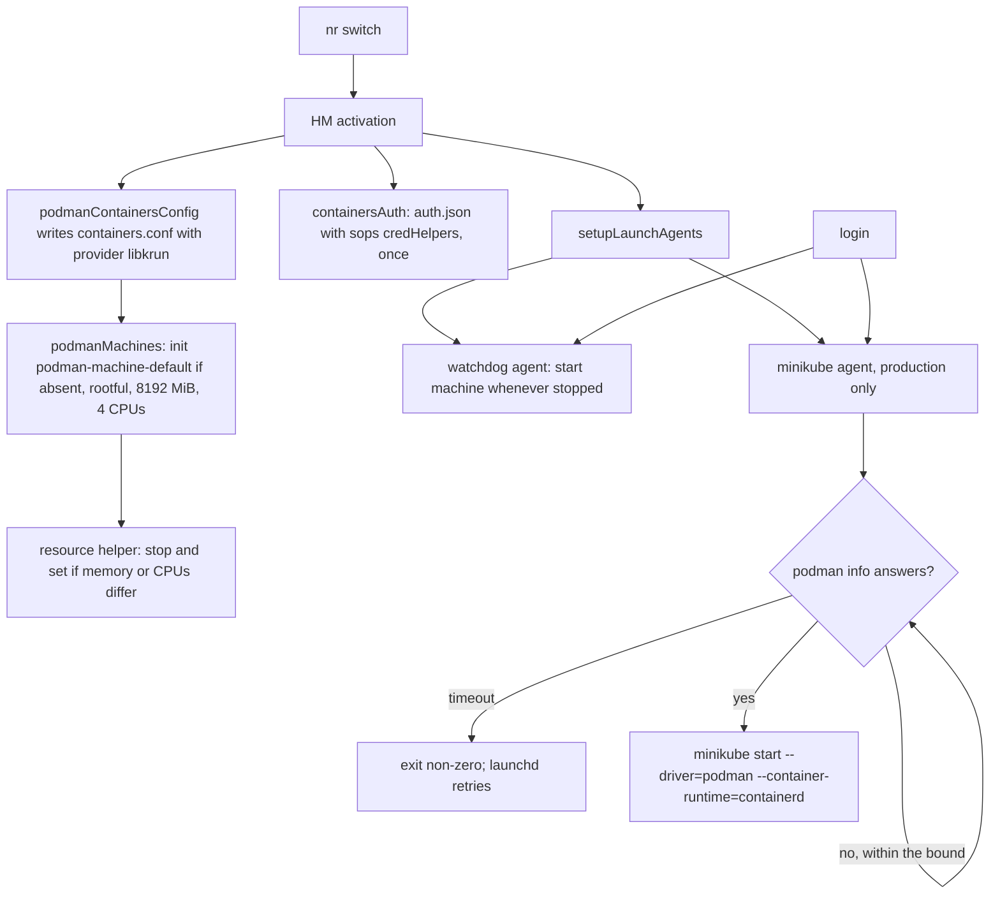

# macOS Podman and minikube - Plan

## Goal Capsule

- **Objective:** On a macOS host, an apply alone leaves containers and a local Kubernetes cluster ready after login, with no app to launch by hand, no account to sign in to, and no license limited to personal use.
- **Means:** Replace OrbStack with one Podman machine VM on the libkrun provider, and run minikube inside it on the Podman driver, the same shape as the NixOS hosts.
- **Product authority:** This plan, then `AGENTS.md`. It supersedes the OrbStack decision of the [macOS hosts plan](2026-10-07-1651-feat-macos-darwin-hosts-plan.md) (its R14, KTD8, and the out-of-scope line for a macOS minikube equivalent). NixOS and non-NixOS Linux hosts are not active scope.
- **Open blockers:** None.
- **Execution profile:** Home Manager configuration for the darwin kind, two shell helpers with their tests, checks, and documentation. No Mac is reachable, so darwin evidence is the `darwin-config` evaluation on Linux and the CI `build-darwin` job. Nothing is activated on any machine, and no `nr switch` or `darwin-rebuild switch` runs.
- **Stop conditions:** Stop and report if any NixOS output's `system.build.toplevel` derivation path changes, if the darwin fixture stops evaluating, or if a new check assertion cannot be made to fail by the mutation it exists to catch.
- **Finishes the work:** `ce-work` implements and verifies. The `lfg` pipeline reviews the work, opens the PR, and watches CI.

---

## Product Contract

Product Contract preservation: Product Contract unchanged. The Outstanding Questions are resolved in place by KTD1 to KTD10, and Dependencies / Assumptions now reflect what research established.

### Summary

macOS hosts drop OrbStack and get one Podman machine VM, created by apply and started at login, with a minikube cluster on the Podman driver inside it. The VM has an 8 GiB memory cap, holds host memory only while the guest uses it, and returns freed memory to macOS. The `docker` command and registry credentials go through Podman, as on NixOS.

### Problem Frame

Every new Mac needs OrbStack launched from Applications and signed in before containers work, so the declarative setup stops one manual step short after each bootstrap. OrbStack's free tier also covers personal use only, which the owner is uneasy relying on. The macOS hosts plan chose OrbStack as a native macOS runtime and left a macOS minikube equivalent out of scope, so Kubernetes on the Mac today means OrbStack's own cluster or nothing declared, while `kubectl`, `helm`, and `minikube` are already installed there through `home/h82/dev/kubernetes.nix`.

### Key Decisions

- **Podman machine on libkrun is the macOS runtime.** Governs R1, R4. Of the runtimes surveyed, only libkrun-based ones return freed guest memory to macOS, and Podman keeps the Mac on the same Podman and minikube stack as NixOS. (session-settled: user-directed — chosen over Colima on krunkit with k3s, and Colima on krunkit with minikube: parity with the NixOS hosts.)
- **OrbStack is dropped.** Governs R1, R11. (session-settled: user-directed — chosen over keeping OrbStack, the macOS hosts plan's earlier decision: it needs a manual launch and sign-in after every bootstrap, and its free tier is personal-use only.)
- **The VM and the cluster both start at login.** Governs R3, R7. (session-settled: user-directed — chosen over starting only Podman at login, or starting both by hand: the same experience as NixOS.)
- **The memory cap is 8 GiB.** Governs R4. Host memory is committed on use, so a generous cap costs little at idle. (session-settled: user-directed — chosen over 4 GiB and half of host RAM.)
- **Existing OrbStack installs are removed by hand.** Governs R11. Homebrew cleanup stays `"none"`, so leaving the cask list does not uninstall it. (session-settled: user-directed — chosen over removing it during apply, or keeping both runtimes: the owner decides when old containers and images can go.)
- **`docker` and registry credentials move to Podman.** Governs R8, R9, R10. (session-settled: user-approved — proposed over keeping the docker CLI and its `~/.docker/config.json` credHelpers merge: one credential path, as on NixOS.)
- **The Podman machine exists from the bootstrap apply; minikube starts only in production.** Governs R2, R7. This matches the NixOS default, where `my.minikube` is off in bootstrap. (session-settled: user-approved — proposed over creating the machine only in production: no manual container step after any apply.)

### Requirements

**Container runtime**

- R1. A macOS host runs containers in one Podman machine VM on the libkrun provider, and the configuration no longer installs OrbStack.
- R2. Apply creates and configures the Podman machine with no manual step, account, or sign-in, starting with the bootstrap apply on a new Mac.
- R3. The Podman machine starts automatically when the user logs in.
- R4. The VM's memory cap is 8 GiB; host memory is held only while the guest uses it, and memory the guest frees is returned to macOS.
- R5. Changing the memory cap in the configuration reaches an existing machine on the next apply, without the user recreating it.

**Kubernetes**

- R6. A minikube cluster runs inside the same Podman machine on the Podman driver, so Kubernetes adds no second VM.
- R7. On a production generation, the cluster starts automatically at login once the Podman machine is up; a bootstrap generation does not start it.

**Docker compatibility and credentials**

- R8. The `docker` command and Docker API clients, such as testcontainers, reach the Podman machine, as `dockerCompat` and `DOCKER_HOST` provide on NixOS.
- R9. Pulls from `ghcr.io`, `registry.gitlab.com`, and `registry.jpi.app` use the sops-backed credential helper with no `docker login`, and `docker.io` pulls stay anonymous, as on the other hosts.
- R10. Configuration that exists only to serve OrbStack is removed, including the `~/.docker/config.json` credHelpers merge.

**Migration and documentation**

- R11. Apply on a Mac that already has OrbStack leaves OrbStack installed, and the macOS documentation gives the manual removal step.
- R12. The repository's statements that OrbStack is the macOS runtime are updated, and the first-setup step that launches OrbStack is removed.
- R13. The hardware verification list covers this runtime on a real Mac: the machine and cluster are up after login, a private `ghcr.io` image pulls without login, and host memory falls after a large workload ends.

### Acceptance Examples

- AE1. **Covers R2, R3, R7.** **Given** a new Mac, **when** the bootstrap apply runs, **then** a Podman machine exists and no minikube cluster starts. **When** the production apply runs and the user logs in again, **then** `podman ps` and `kubectl get nodes` succeed without any app launched or account signed in.
- AE2. **Covers R5.** **Given** a running machine with an 8 GiB cap, **when** the configured cap changes and the next apply runs, **then** the machine reports the new cap, and its containers and images are still there.
- AE3. **Covers R8, R11.** **Given** a Mac where OrbStack is still installed, **when** the apply runs, **then** OrbStack stays installed and `docker` reaches the Podman machine, not OrbStack.

### Scope Boundaries

- Growing VM memory on demand while it runs: no candidate runtime supports it. R4's commit-on-use behavior and memory return are the substitute.
- Podman Desktop or any other GUI front end.
- Migrating containers, images, or volumes out of OrbStack.
- GPU passthrough into the VM.
- Intel Macs, which the repository does not support.
- NixOS and non-NixOS Linux hosts: their container setup is unchanged, and non-NixOS Linux hosts still get no Podman from the flake.
- Considered and not built: a periodic prune of the VM's storage like the NixOS `podman-prune` timer. The machine disk is sparse and nobody asked for it; disk pressure inside the VM would change the call.
- Considered and not built: stopping the cluster at logout, as the NixOS unit's `ExecStop` does. A hard VM stop leaves the node container stopped and restartable; a cluster that fails to come back after logout would change the call.
- Considered and not built: restarting the cluster when the VM restarts mid-session, such as after a memory change. The next login starts it, and `minikube start` by hand covers the gap.
- Pull credentials for images that pods pull inside the cluster: containerd in the minikube node reads neither credential file, as on NixOS.

### Dependencies / Assumptions

- The Fedora CoreOS guest loads `virtio_balloon` and reports free pages to libkrun. libkrun 1.19.4 always attaches a balloon device offering free page reporting, and the Fedora kernel sets `CONFIG_PAGE_REPORTING=y` with `CONFIG_VIRTIO_BALLOON=m`, but no running guest has been checked, so R4's memory return stays unverified until R13 runs on hardware.
- macOS reclaims returned pages lazily (`MADV_FREE`), probably only under memory pressure, so Activity Monitor can lag after a workload ends.
- minikube 1.38.1 still labels its Podman driver experimental on macOS, and its macOS instructions use the rootful machine connection.
- The first apply that creates the machine downloads its image (about 1 GB), so it needs network and takes longer.
- podman#29084, the libkrun VM rebooting about every 60 minutes, is fixed in krunkit 1.3.1; the pinned nixpkgs wraps Podman 5.8.7 with krunkit 1.3.2.

### Sources / Research

- `modules/shared/darwin-apps.nix`: `darwinOnly = [ "orbstack" ]` and its comment.
- `home/h82/dev/containers.nix`: Podman settings gated to `my.kind != "darwin"`, and the darwin `dockerCredHelpers` activation.
- `modules/nixos/services/podman.nix` and `modules/nixos/services/minikube.nix`: the NixOS shape to match; `modules/nixos/profile.nix` defaults `my.minikube` to `my.podman.enable && !my.bootstrap`.
- `home/h82/dev/default.nix` imports `kubernetes.nix` for every host kind.
- `modules/darwin/homebrew.nix`: `cleanup = "none"`.
- Checks and docs naming OrbStack: `tests/darwin-config.nix`, `tests/docker-cred-helpers.sh`, `README.md`, `docs/macos.md`, `docs/provisioning.md`, `docs/verification.md`, `docs/adding-a-host.md`.
- libkrun balloon device with free page reporting: https://github.com/libkrun/libkrun
- Apple's balloon device moves only toward a host-set target: https://developer.apple.com/documentation/virtualization/vzvirtiotraditionalmemoryballoondevice
- Lima PR showing host RSS not dropping on VZ: https://github.com/lima-vm/lima/pull/4828
- minikube Podman driver: https://minikube.sigs.k8s.io/docs/drivers/podman/
- libkrun VM reboot report: https://github.com/podman-container-tools/podman/issues/29084
- Podman 5.8.7 source for the darwin provider default, machine sockets, and remote-client credentials: https://github.com/podman-container-tools/podman (`pkg/machine/provider/platform_darwin.go`, `pkg/machine/vmconfigs/sockets_darwin.go`, `pkg/bindings/images/pull.go`)
- Testcontainers with Podman: https://java.testcontainers.org/supported_docker_environment/
- launchd keys: https://keith.github.io/xcode-man-pages/launchd.plist.5.html

---

## Planning Contract

### Key Technical Decisions

- KTD1. **Use the Home Manager `services.podman` darwin module for the machine and its login agent.** Governs R1, R2, R3. It already creates the machine during activation, guarded by `podman machine list`, and installs a `RunAtLoad` launchd agent whose watchdog starts the machine whenever it is stopped. That covers R2 and R3 with an upstream-maintained init guard and watchdog, where a repository-owned agent would reimplement both. Its two limits are handled by KTD3 (memory only at init) and accepted in KTD9 (unmanaged machines are deleted). It is enabled for every darwin generation, bootstrap included, per the Key Decision on bootstrap.
- KTD2. **Select libkrun in `containers.conf`, not by relying on the default.** Governs R1, R4. Podman 5.8.7, the pinned version, defaults to applehv on macOS; libkrun became the default only in Podman 6.0, and 5.8.7 has no `--provider` flag. Setting `[machine] provider = "libkrun"` through `services.podman.settings.containers` reaches every `podman machine` call: the module's activation (which installs `containers.conf` before `podmanMachines`), the watchdog agent, the helper of KTD3, and the shell. Conflict call-out on the Key Decision "Podman machine on libkrun": the decision holds, but it needs this explicit setting on the pinned Podman.
- KTD3. **A repository helper reconciles memory and CPUs on an existing machine after `podmanMachines`.** Governs R5. It reads `podman machine inspect` for the configured machine. When memory or CPUs differ from the configuration, it stops the machine and runs `podman machine set`, retrying a bounded number of times if the watchdog restarted the machine in between. It leaves the restart to the watchdog, so the VM always runs as a child of the launchd job rather than of the apply terminal. An absent machine, or matching values, is a no-op.
- KTD4. **The machine is rootful, with 8192 MiB and 4 CPUs; the disk keeps Podman's sparse default.** Governs R4, R6. minikube's macOS instructions use the rootful connection, rootless minikube on macOS has an open CoreDNS failure (minikube#18978), and a rootful machine keeps testcontainers' Ryuk working without extra flags. `--rootful` makes `podman-machine-default-root` the default connection, which both `podman` and minikube use.
- KTD5. **minikube starts from a repository launchd agent on production generations only.** Governs R6, R7. The agent runs a helper that waits, with a bounded loop, until `podman info` answers on the default connection, then runs `minikube start --driver=podman --container-runtime=containerd --memory=4096 --cpus=2` for the `minikube` profile, and exits non-zero on timeout so launchd retries it. The plist sets `RunAtLoad`, `KeepAlive.SuccessfulExit = false`, a `ThrottleInterval`, an explicit `PATH`, log files under `~/Library/Logs`, and `AbandonProcessGroup`. The node gets half of the VM's memory so containers outside the cluster keep headroom.
- KTD6. **`AbandonProcessGroup` and `ProcessType = "Interactive"` on the watchdog agent.** Governs R3, R6. Podman starts krunkit and gvproxy as plain children of the job. When an apply changes the watchdog plist, Home Manager boots the agent out and back in, and launchd would kill the VM along with the job's process group. The module sets `ProcessType = "Background"`, whose resource limits would also reach the VM and every container and cluster node inside it.
- KTD7. **`docker` is a symlink to `podman`, and `DOCKER_HOST` names the machine's API socket.** Governs R8, R9. This is the darwin equivalent of NixOS `dockerCompat`, a `runCommand` that links `bin/docker` to `podman`, so `docker pull` resolves credentials from `containers/auth.json` like `podman pull`. The real docker CLI would read `~/.docker/config.json` instead. `DOCKER_HOST` is `unix://${TMPDIR:-/tmp/}podman/podman-machine-default-api.sock`, the path Podman 5.8.7 forwards the API to; nixpkgs ships no `podman-mac-helper`, so `/var/run/docker.sock` does not exist on the host. `TESTCONTAINERS_DOCKER_SOCKET_OVERRIDE=/var/run/docker.sock` names the socket inside the VM that Ryuk mounts. Apps launched from Finder or the Dock never read `hm-session-vars.sh`, so a login agent also publishes `DOCKER_HOST` and `TESTCONTAINERS_DOCKER_SOCKET_OVERRIDE` with `launchctl setenv`, computing the socket path from `getconf DARWIN_USER_TEMP_DIR`; this is the darwin counterpart of the NixOS `systemd.user.sessionVariables`. The Linux Ryuk-privilege variables stay Linux-only.
- KTD8. **`containers/auth.json` with the sops credHelpers is written on every host kind; the `registries.conf.d` drop-in stays Linux-only.** Governs R9. The existing `containersAuth` activation moves out of the non-darwin block unchanged. On darwin, `services.podman` writes `registries.conf` with `docker.io` as the unqualified-search registry, and the drop-in would be a `/nix/store` symlink, dangling inside the VM through the module's forced `~/.config/containers` mount.
- KTD9. **Accept the module's removal of unmanaged machines, and document it.** Governs R2. No machine exists on the Mac today, OrbStack being the runtime, and keeping a hand-made machine would require patching a pinned upstream module.
- KTD10. **Remove the Docker Hub legacy index alias with the OrbStack plumbing.** Governs R10. Only the OrbStack docker CLI asked for that key, and on a non-NixOS host it routes to `docker_token`, which is never published, so it can only return a miss. `docker.io` stays anonymous without it.

### High-Level Technical Design

What runs, and when, on a production generation:

A bootstrap generation runs every step except the minikube agent.

### Assumptions

- The helper of KTD3 and the minikube helper run on a Mac only at apply or login. CI evidence is evaluation, the macOS build, and stubbed-podman script tests; launchd behavior, the socket path, and memory return are hardware checks (R13).
- `TMPDIR` is the same per-user `/var/folders/.../T/` in a login shell and in a launchd job, so the session `DOCKER_HOST` matches where Podman forwards the socket. A mismatch would show as `docker ps` failing while `podman ps` works, which the hardware check catches.
- The pinned Home Manager launchd module supports `AbandonProcessGroup` and `ThrottleInterval` (`modules/launchd/launchd.nix`).

### Risks

| Risk | Mitigation |
| --- | --- |
| A Docker API client that pulls without sending credentials makes the guest Podman read the mounted `auth.json`, whose `docker-credential-sops` helper does not exist in the VM. | Host-side `podman pull` and `docker pull` send credentials themselves. The hardware list checks a private `ghcr.io` pull through `docker`; an API-only private pull is noted as a known limit in the docs. |
| gvproxy can die under load and leave a machine reported running with a dead socket (podman#29411). | `podman machine stop` then start recovers; the macOS troubleshooting section says so. |
| `podman machine init` runs under activation's errexit, so a failed first image download aborts the apply partway, bootstrap included. | The failure is loud and the apply is rerunnable once network returns; the macOS docs say the first apply needs network. |
| The minikube Podman driver is experimental on macOS. | The cluster is a convenience agent; a failure leaves Podman usable, logs go to `~/Library/Logs`, and the hardware list checks `kubectl get nodes`. |
| OrbStack's own `docker` on the path could shadow the symlink on a Mac that still has OrbStack. | The Home Manager profile's `bin` precedes `/usr/local/bin` on nix-darwin's PATH; AE3 is a hardware check, and the docs' removal step clears it. |

### Sequencing

U1 and U4 can land in either order; U2 and U3 build on U1; U5 follows U1 to U4; U6 is last.

---

## Implementation Units

### U1. Podman machine and Docker compatibility on darwin

**Goal:** A darwin generation runs one rootful libkrun Podman machine that its watchdog agent starts at login, and `docker` and `DOCKER_HOST` reach it.

**Requirements:** R1, R2, R3, R4, R8, R9; KTD1, KTD2, KTD4, KTD6, KTD7, KTD8, KTD9.

**Dependencies:** None.

**Files:**

- Modify: `home/h82/dev/containers.nix`
- Create: `packages/docker-podman-compat.nix`
- Test: `tests/darwin-config.nix`, `tests/darwin-outputs.nix` (U5)

**Approach:**

1. Add a `my.kind == "darwin"` block that enables `services.podman`, sets `useDefaultMachine = false`, defines the one machine `podman-machine-default` with the KTD4 values, sets the provider in `settings.containers` (KTD2), and overrides `AbandonProcessGroup` and `ProcessType` on the module's watchdog agent (KTD6). `useDefaultMachine` must be off because the module merges its all-null default over a same-named entry, which would drop `--rootful`, `--memory`, and `--cpus` from `machine init`. The block applies to bootstrap generations too.
2. Add the darwin session variables of KTD7, the GUI `launchctl setenv` agent of KTD7, and the `docker` symlink package to `home.packages`.
3. Move `containersAuth` and `REGISTRY_AUTH_FILE` out of the non-darwin block so every kind gets them (KTD8). Keep `DOCKER_HOST`, the Ryuk variables, `systemd.user.sessionVariables`, and the `registries.conf.d` drop-in non-darwin.
4. Update the block comments that describe OrbStack.

**Patterns to follow:** `modules/nixos/services/podman.nix` for the shape; the `runCommand` behind NixOS `dockerCompat` in nixpkgs `nixos/modules/virtualisation/podman/default.nix` for the symlink; `home/h82/t3code.nix` for a darwin-only `launchd.agents` entry.

**Test scenarios:**

- The production and bootstrap darwin activation scripts both run `podman machine init podman-machine-default` with `--rootful`, `--memory 8192`, and `--cpus 4`, and init no other machine.
- The `containers.conf` file the darwin activation installs contains `provider = "libkrun"` under `[machine]`.
- The watchdog plist in the built generation carries `AbandonProcessGroup` true, `ProcessType` `Interactive`, and `RunAtLoad` true.
- The GUI environment plist runs `launchctl setenv` for `DOCKER_HOST` and `TESTCONTAINERS_DOCKER_SOCKET_OVERRIDE` at load.
- `hm-session-vars.sh` on darwin exports `DOCKER_HOST` ending in `podman/podman-machine-default-api.sock`, `REGISTRY_AUTH_FILE`, and `TESTCONTAINERS_DOCKER_SOCKET_OVERRIDE`, and no `TESTCONTAINERS_RYUK_PRIVILEGED`.
- The darwin `home-path` has `bin/docker` resolving to the same `podman` binary as `bin/podman`.
- The darwin activation script contains `containersAuth`, and no `.config/containers/registries.conf.d` entry is in its home files.
- Every NixOS output's `system.build.toplevel` derivation path is unchanged.

**Verification:** U5's checks pass with these assertions, and the NixOS derivation paths match the base commit.

### U2. Memory and CPU reconciliation helper

**Goal:** A changed memory or CPU value reaches an existing machine on the next apply.

**Requirements:** R5, AE2; KTD3.

**Dependencies:** U1.

**Files:**

- Create: `scripts/podman-machine-resources`, `packages/podman-machine-resources.nix`, `tests/podman-machine-resources.sh`
- Modify: `home/h82/dev/containers.nix` (activation entry after `podmanMachines`), `flake.nix` (register the test as a check)

**Approach:**

1. The helper takes the machine name, memory in MiB, and CPUs. It inspects the machine; when inspection fails, it exits 0.
2. When the values match, it exits 0 without stopping anything.
3. Otherwise it stops the machine and runs `podman machine set --memory <m> --cpus <c>`. If `set` fails because the machine is running again, it stops and retries, up to a small fixed count, then fails loudly.
4. It honors `DRY_RUN` the way other activation steps do, and it never starts the machine (KTD3).

**Patterns to follow:** `scripts/docker-cred-helpers` and its `writeShellApplication` package for script layout; `tests/docker-cred-helpers.sh` for a stubbed-binary shell test registered in `flake.nix`.

**Test scenarios:**

- Covers AE2. With a stub `podman` reporting 8192 MiB and 4 CPUs while the request is 12288 and 4, the helper calls `machine stop`, then `machine set --memory 12288 --cpus 4`, and never `machine start`.
- With matching values, the stub records no `stop` and no `set`.
- With an absent machine (inspect exits non-zero), the helper exits 0 and records nothing else.
- With a stub whose first `set` fails as running and second succeeds, the helper records stop, set, stop, set and exits 0.
- With a stub whose `set` always fails, the helper exits non-zero after the retry bound.
- Under `DRY_RUN`, it prints what it would change and records no `stop` or `set`.

**Verification:** The registered check passes, and each scenario fails under a mutation that removes the behavior it checks.

### U3. minikube login agent

**Goal:** On a production darwin generation, a minikube cluster on the Podman driver starts at login once the machine answers.

**Requirements:** R6, R7, AE1; KTD5.

**Dependencies:** U1.

**Files:**

- Create: `scripts/minikube-darwin-start`, `packages/minikube-darwin-start.nix`, `tests/minikube-darwin-start.sh`
- Modify: `home/h82/dev/kubernetes.nix` (the `launchd.agents` entry and session variables, `my.kind == "darwin" && !my.bootstrap`), `flake.nix`

**Approach:**

1. The helper polls `podman info` with a fixed bound, then runs `minikube start` with the KTD5 flags and the `minikube` profile, and exits non-zero on timeout.
2. The agent's plist carries the KTD5 keys, with `PATH` built from the podman and minikube store paths plus `/usr/bin:/bin`, and log paths under `~/Library/Logs`, which macOS creates for every user.
3. Set the same `MINIKUBE_PROFILE`, `MINIKUBE_DRIVER`, and `MINIKUBE_CONTAINER_RUNTIME` values in the darwin session so a hand-run `minikube start` picks the same cluster, as the NixOS module does; `MINIKUBE_ROOTLESS` is left out because it has no effect on macOS.

**Patterns to follow:** `modules/nixos/services/minikube.nix` for the environment and the comments on why each value is pinned; `home/h82/t3code.nix` for `launchd.agents`.

**Test scenarios:**

- With a stub `podman info` failing twice then succeeding, the helper calls `minikube start` once with `--driver=podman`, `--container-runtime=containerd`, `--memory=4096`, and `--cpus=2`.
- With `podman info` never succeeding inside the bound, the helper exits non-zero and never calls `minikube`.
- With a failing `minikube start`, the helper exits non-zero.
- Covers AE1. The production darwin generation has the minikube plist with `RunAtLoad`, `KeepAlive.SuccessfulExit` false, and `AbandonProcessGroup`; the bootstrap generation has no minikube plist.
- The plist's `PATH` contains the podman and minikube store paths.

**Verification:** The script test and the U5 assertions pass, each failing under its mutation.

### U4. Remove OrbStack plumbing

**Goal:** Nothing in the configuration installs or serves OrbStack.

**Requirements:** R1, R10; KTD10.

**Dependencies:** None.

**Files:**

- Modify: `modules/shared/darwin-apps.nix`, `home/h82/dev/containers.nix`, `home/h82/security/non-nixos-secrets.nix`, `packages/docker-credential-sops.nix` (only if its comment names the alias), `flake.nix`
- Delete: `scripts/docker-cred-helpers`, `packages/docker-cred-helpers.nix`, `tests/docker-cred-helpers.sh`, `modules/shared/docker-hub-index.nix`

**Approach:**

1. Drop `orbstack` from `darwinOnly`, leaving an empty list and a comment that says what the list is for.
2. Remove the `dockerCredHelpers` activation block and the `dockerCredHelpers` binding.
3. Remove the darwin alias from the credential helper's routing table, and the `docker-cred-helpers` check from `flake.nix`.

**Patterns to follow:** the existing `darwinOnly` header comment in `modules/shared/darwin-apps.nix`.

**Test scenarios:**

- The darwin Brewfile casks have no `orbstack`.
- The darwin activation script has no `dockerCredHelpers` step.
- The darwin `docker-credential-sops` routing table equals the Linux one built from `modules/shared/cli-registries.nix`.
- `git grep -i orbstack` outside documentation, plans, and solutions returns nothing.

**Verification:** `nix flake check` evaluates with the check removed, and U5's inverted assertions pass.

### U5. Darwin checks

**Goal:** The checks assert the new darwin container setup from materialized outputs and fail when it regresses.

**Requirements:** R1 to R10; KTD1 to KTD10.

**Dependencies:** U1, U2, U3, U4.

**Files:**

- Modify: `tests/darwin-config.nix`, `tests/darwin-outputs.nix`, `docs/verification.md` (the check descriptions)

**Approach:**

1. In `tests/darwin-config.nix`, replace the "no Podman on macOS" assertions and the OrbStack cask pin with U1 to U4's scenarios, reading the activation script text, the generated plist, and `hm-session-vars.sh` content rather than option values.
2. In `tests/darwin-outputs.nix`, replace the `dockerCredHelpers` order checks with plist presence for the watchdog and minikube agents (production) and their absence (minikube, bootstrap), and the session-variable checks.
3. Mutation-test each new assertion in a scratch copy, per the solutions on mutation testing and copied worktrees.

**Patterns to follow:** `tests/darwin-outputs.nix` LaunchAgents grep (`org.nix-community.home.<name>.plist`); the trait-split helpers in `.compound-engineering/artifacts/solutions/best-practices/trait-split-check-cannot-catch-a-widened-default.md` for the production-only minikube assertion.

**Test scenarios:**

- Each assertion listed in U1, U3, and U4 is present in a check.
- A mutation that enables the minikube agent on bootstrap fails `darwin-config`.
- A mutation that drops the provider line fails `darwin-config`.
- A mutation that drops `AbandonProcessGroup` from either agent, or the watchdog's `ProcessType` override, fails `darwin-config`.
- A mutation that removes `useDefaultMachine = false` fails `darwin-config`.
- A mutation that restores `orbstack` to `darwinOnly` fails `darwin-config`.

**Verification:** `nix flake check` passes, every mutation above fails it, and the PR's `build-darwin` job passes `darwin-outputs`.

### U6. Documentation

**Goal:** The documentation describes Podman and minikube on macOS, the manual OrbStack removal, and the hardware checks.

**Requirements:** R11, R12, R13.

**Dependencies:** U1 to U5.

**Files:**

- Modify: `README.md`, `docs/macos.md`, `docs/provisioning.md`, `docs/verification.md`, `docs/adding-a-host.md`, `AGENTS.md`

**Approach:**

1. Replace every statement that OrbStack is the macOS runtime, and remove the first-setup step that launches OrbStack.
2. Rewrite the macOS "Containers" section: the machine, its 8 GiB cap and memory return, the login agents and their logs, `docker` as Podman, the credential path, the removal of unmanaged machines (KTD9), the first apply's need for network to download the machine image, and the gvproxy recovery.
3. Add the manual OrbStack removal (`brew uninstall --zap orbstack`) to the macOS troubleshooting or migration text, with the note that its containers and images go with it.
4. Add the R13 hardware checks to `docs/verification.md`: the machine and cluster running after login, a private `ghcr.io` pull through `docker` without login, `docker` resolving to Podman while OrbStack is still installed, krunkit surviving an apply that changes the watchdog plist, the `virtio_balloon` module loaded in the guest, and host memory falling after a large workload ends.
5. Link this plan from `AGENTS.md` beside the macOS hosts plan.

**Test expectation:** none -- documentation only.

**Verification:** `git grep -i orbstack` in `README.md` and `docs/` finds only the removal instructions.

---

## Verification Contract

| Gate | Command | Proves |
| --- | --- | --- |
| Format | `nix fmt -- --ci` | Layout |
| Flake checks | `nix flake check` | Every Linux check, including `darwin-config`, the two new script tests, `host-name-guard`, and `check-shards-guard` |
| Shards | `nix build --no-link .#checkShards.<name>` for each shard | The CI shards build |
| VM checks | `nix build --no-link .#vmChecks.all` | NixOS VM tests are unaffected |
| NixOS outputs | the `nixosConfigurations` loop in `AGENTS.md`, plus `nix eval --raw` of each `system.build.toplevel.drvPath` at the base commit and at the head, compared | Every NixOS output builds and is unchanged |
| Other outputs | the `homeConfigurations` and `systemConfigs` loops in `AGENTS.md` | Still empty or still building |
| Darwin evaluation | `nix eval --raw .#darwinConfigurations.<host>.system.drvPath` for each darwin output, on Linux | The darwin outputs evaluate |
| Darwin build | the PR's `build-darwin` job | The darwin systems and `checks.aarch64-darwin` build on macOS |
| Mutations | each U2, U3, and U5 mutation run in a scratch copy | The new assertions are not decorative |

Hardware verification is reported separately per `docs/verification.md`.

## Definition of Done

- Every unit's Verification holds, and every gate in the Verification Contract passes.
- No NixOS `system.build.toplevel` derivation path changed.
- Each new assertion failed under its mutation and passed at baseline.
- The PR body reports the `build-darwin` result and lists the hardware checks still pending.
- No abandoned or experimental code remains in the diff.
