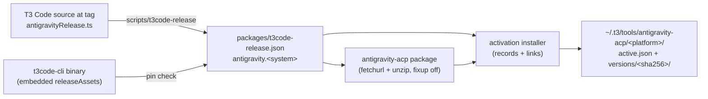

# Declarative T3 Code Settings and Antigravity Runtime - Plan

## Goal Capsule

- **Objective:** On every host that enables T3 Code, one rebuild leaves T3 Code with the user's chosen settings and a ready-to-use Antigravity provider that needs only a Google sign-in, with no manual setup in the app.
- **Means:** Per-file activation merges of the declared non-default keys (KTD1, KTD2), and a preinstalled Antigravity runtime laid out as T3 Code's own managed install, with its binaries linked from a Nix-fetched package (KTD4, KTD5).
- **Authority:** This plan's R-IDs govern behavior and its KTDs govern mechanism. `AGENTS.md` governs repository conventions and verification.
- **Open blockers:** None.
- **Stop conditions:** Stop if T3 Code rejects a managed version directory whose binaries are symlinks into the Nix store (KTD4) and a writable copy is the only alternative, because that doubles about 1 GB of disk per Linux host and the user has not weighed that cost. Stop if the pinned T3 Code source no longer has `apps/server/src/provider/antigravityRelease.ts` in the shape KTD3 parses.
- **Execution profile:** Standard. Six units across a home module, two scripts, one package, two checks, and docs. Verified by unit tests, Nix checks with mutation tests of the new assertions, and the repository's ship builds.
- **Finishing:** The implementer lands and verifies the change and opens the pull request. The settings and runtime reach the machines on the user's own `nr switch`; signing in to Antigravity stays with the user.

---

## Product Contract

Product Contract preservation: requirements, decisions, and scope unchanged. Planning answered the Outstanding Questions, so that section was removed, and Dependencies / Assumptions was updated in place.

### Summary

The repository declares the T3 Code settings that differ from the pinned nightly's schema defaults, including both model selections, and activation merges them into `~/.t3/userdata/settings.json` and `~/.t3/userdata/client-settings.json`.
Activation also installs the Antigravity ACP runtime version that the pinned T3 Code requires, fetched by Nix, so the provider shows as installed right after a rebuild.

### Problem Frame

T3 Code settings are set by hand in the app on each machine.
A new host or a reset of `~/.t3/userdata` loses them, and nothing records which values were changed from the defaults.
The Antigravity provider also needs a manual "Install Antigravity" click per host, which downloads between 110 MB and 335 MB at that moment.
Today the repository only turns on `providers.antigravity.enabled`.

### Key Decisions

- **Merge declared keys at activation; do not own the files.** T3 Code rewrites both files at runtime, so a read-only store symlink would break it. This follows the existing `agent-settings` merge used for `providers.antigravity.enabled`. (session-settled: user-approved — chosen over a read-only store symlink: T3 Code rewrites both files at runtime.) Governs R1, R4.
- **Manage `settings.json` and `client-settings.json` only.** (session-settled: user-directed — chosen over also managing `keybindings.json`: that file holds only the default bindings.) Governs R1.
- **Declare only keys whose value differs from the pinned schema default.** A key left at its default follows any future default change in T3 Code. (session-settled: user-approved — chosen over declaring every current key: defaults should follow upstream changes.) Governs R2.
- **Pin both model selections in the repository.** (session-settled: user-directed — chosen over leaving model choice to the UI or pinning only the text-generation model: one consistent default on every host, changed by a repository commit.) Governs R3.
- **Preinstall the runtime T3 Code pins, fetched by Nix.** Rebuild alone should leave only sign-in. Fetching through Nix keeps activation offline and the hash reviewable. (session-settled: user-directed — chosen over keeping the manual "Install Antigravity" click: rebuild alone should leave only sign-in.) Governs R6, R7.
- **Runtime version follows the T3 Code pin.** The T3 Code bundle fixes the Antigravity release version, URL, and sha256 per platform, so the repository derives its runtime pin from the T3 Code release rather than tracking Antigravity separately. (session-settled: user-approved — chosen over tracking Antigravity separately: T3 Code's bundle fixes version, URL, and sha256 per platform.) Governs R8, R9.

### Requirements

**Settings**

- R1. On any host with `my.t3.cli.enable` or `my.t3.desktop.enable`, activation merges the declared keys into `~/.t3/userdata/settings.json` and `~/.t3/userdata/client-settings.json` and leaves every undeclared key untouched.
- R2. The declared set is every key in the current `settings.json` and `client-settings.json` whose value differs from the pinned T3 Code schema default, minus the app-state keys excluded in Scope Boundaries.
- R3. `defaultModelSelection` (`claudeAgent` / `claude-opus-5-5`) and `textGenerationModelSelection` (`antigravity` / `gemini-3.8-flash-low`) are among the declared keys.
- R4. A declared key changed in the app returns to the declared value on the next activation that runs the merge.
- R5. All hosts that enable T3 Code receive the same declared values, with no per-host overrides.

**Antigravity runtime**

- R6. On any host with `my.t3.cli.enable` or `my.t3.desktop.enable`, after activation T3 Code reports the Antigravity runtime as installed without a download, on x86_64-linux, aarch64-linux, and aarch64-darwin.
- R7. The installed runtime is the exact release (version and sha256) that the pinned T3 Code requires for that platform.
- R8. The repository's T3 Code release update flow (`scripts/t3code-release`) updates the runtime pin together with the T3 Code pin.
- R9. A repository check fails when the runtime pin does not match the Antigravity release the pinned T3 Code requires.

### Acceptance Examples

- AE1. **Covers R1, R4.** Given `client-settings.json` with `fontFamilyCode` changed to `""` in the app and an unrelated key `favorites` set, when activation runs, then `fontFamilyCode` is `"JetBrains Mono"` again and `favorites` is unchanged.
- AE2. **Covers R2.** Given `notificationMode` is `"off"` locally and `"off"` is also the schema default, then the repository does not declare `notificationMode`.
- AE3. **Covers R6.** Given a fresh host with no `~/.t3/tools/antigravity-acp`, when the user enables T3 Code and rebuilds, then the Antigravity provider page shows the runtime as installed and only sign-in remains.
- AE4. **Covers R8, R9.** Given a T3 Code nightly bump whose bundle requires a newer Antigravity release, when the update flow runs, then the runtime pin moves with it; if the runtime pin is left stale, the check fails.

### Scope Boundaries

- App-state keys are not declared even when they differ from the default: `onboardingCompletedAt`, `deviceOnboardingCompleted`, `projectSettingsFolded`, `favorites`, and the app-written `providerInstances.codex`.
- `desktop-settings.json` (window bounds) and `keybindings.json` are not managed.
- Antigravity sign-in and account credentials are not automated.
- Other tools T3 Code downloads into `~/.t3/tools` (`cloudflared`, `agent-device`, `expo-device-hub`) are not preinstalled.
- Deferred: a check that each declared settings key still exists in the pinned T3 Code schema, which would catch a key a nightly renames.
- Deferred: per-host setting values.
- Considered and not built: pruning older Antigravity version directories from `~/.t3/tools`. T3 Code owns that directory and its own installer leaves superseded versions in place too; a pruning step would race a running T3 session that holds a lease on an older version. Evidence that changes this: superseded store-linked versions piling up on a real host.
- Considered and not built: a build-time check that the unpacked binaries match the pinned sizes. The fixed-output archive hash already determines the bytes, and the pin check compares the pinned sizes with the ones T3 Code requires. Evidence that changes this: a release whose archive contents disagree with T3 Code's table.
- Considered and not built: `SSL_CERT_FILE` for the Antigravity server on CLI-only Linux hosts. The preinstalled runtime is the same binary T3 Code downloads today, so this change neither causes nor fixes that gap.

### Dependencies / Assumptions

- T3 Code treats a runtime as installed when `~/.t3/tools/antigravity-acp/<platform>/active.json` names a release whose `versions/<sha256>/` directory holds the executable, the harness, and `.install-complete.json`. It checks each binary with `stat`, which follows symlinks: a regular file of the recorded byte size with an executable bit. Read from the T3 Code `0.0.46-nightly.20261008.2801` bundle (`AntigravityInstallation.completedRelease`).
- T3 Code reports an installed version only for this managed layout; a runtime found through `PATH` or the provider's `binaryPath` setting works but shows no version, which would not meet R6.
- The NixOS desktop wrapper already sets `SSL_CERT_FILE` for the ACP server, and NixOS hosts run its unpatched binaries through nix-ld, as they do for the runtime T3 Code downloads today.

### Sources / Research

- `home/h82/t3code.nix` — the existing `agent-settings` merge of `providers.antigravity.enabled`.
- `scripts/agent-settings` — `set`, `remove`, `setPaths`, and `own`; `setPaths` takes scalar leaves, and `remove` retires only top-level keys.
- `home/h82/dev/vscodium.nix` — the `leaves` helper that flattens an attrset into `setPaths`.
- `packages/t3code-release.json`, `scripts/t3code-release`, `tests/test_t3code_release.py` — the T3 Code nightly pin and its update flow.
- `.github/workflows/update-dependencies.yml` and `tests/update-dependencies-reconcile.sh` — the fail-soft T3 Code bump restores only `packages/t3code-release.json`.
- `packages/t3code.nix` — the NixOS wrapper's `SSL_CERT_FILE` for the ACP server.
- `tests/t3code-traits.nix` — the stub-merger activation test that compares the declared JSON byte for byte.
- `tests/android-sdk-repo-parity.py` — the compare-every-entry, fail-when-nothing-compared parity pattern.
- `.compound-engineering/artifacts/solutions/integration-issues/t3code-antigravity-acp-openssl-missing-ca-bundle-hangs-sessions.md` — why the ACP server needs a CA bundle on NixOS, and why a broken install hangs silently.
- `.compound-engineering/artifacts/solutions/best-practices/home-manager-activation-does-not-run-on-every-rebuild.md` — R4 holds only when activation runs.
- `.compound-engineering/artifacts/solutions/integration-issues/orca-rejects-hardlinked-nix-store-skill-files.md` — why to confirm what a tool checks on disk before linking store files into its directory.
- The pinned T3 Code server bundle: schema defaults come from each key's `withDecodingDefault`, and `apps/server/src/provider/antigravityRelease.ts` (present at tag `v0.0.46-nightly.20261008.2801`) fixes `ANTIGRAVITY_RELEASE_VERSION = "1.3.0"` with a `releaseAssets` map per Node platform key. The same map is embedded as plain text in the CLI binary `libexec/t3code/t3`.

---

## Planning Contract

### Key Technical Decisions

- KTD1. **One `agent-settings` merge per file, built from one attrset each with the `leaves` helper.** Scalars go to `set`, and nested objects to `setPaths` leaves, so a key T3 Code adds inside `storageCleanup` survives. The two model selections are the exception and go to `own` whole: T3 Code writes `textGenerationModelSelection` atomically (`ATOMIC_SETTINGS_KEYS`), with an `options` list that belongs to the selected model, so a leaf merge would leave a previous model's options attached. Two activation entries mirror how `claude.nix` handles two files, and a refusal on one file does not hide the other's. Covers R1, R3, R4.
- KTD2. **The declared set, from the pinned schema.** `settings.json`: `storageCleanup` (`worktreeAfterDays` 8, `worktreeOnMerge`, `worktreeOnDelete`, `worktreeUnchanged` true, `browserArtifactsAfterDays` 8, `logsAfterDays` 8), `defaultAutoPull` true, `defaultModelSelection`, `textGenerationModelSelection`, `enableAgentDeviceAccess` true, `enableDeviceSupport` true, `snoozeLimitedThreads` true, `autoResumeLimitedThreads` true, `defaultThreadEnvMode` `"worktree"`, `addProjectBaseDirectory` `"~/src"`, `branchNamingMode` `"semantic"`, `sourceControlWritingStyle.mode` `"conventional_commits"`, and the existing `providers.antigravity.enabled` true. `client-settings.json`: `fontFamilyCode` `"JetBrains Mono"`. Every other current value equals its schema default, including `providers.{cursor,grok,opencode}.enabled` false. `sendShortcut` has no decoding default; declare it only if the client treats an absent value differently from `"enter"`. Covers R2, R3.
- KTD3. **The runtime pin lives in `packages/t3code-release.json`, read from the T3 Code source at the pinned tag.** A new `antigravity` object keyed by Nix system holds the Node platform key and the `releaseAssets` entry (version, url, sha256 hex, SRI hash, archiveBytes, executable and harness name and bytes). `scripts/t3code-release` fetches `apps/server/src/provider/antigravityRelease.ts` at the selected tag through its existing overridable fetch and parses the map, so the update workflow's fail-soft restore and reconcile test keep covering one file. Fetching the source avoids downloading a 150 MB CLI to read one table. Covers R7, R8.
- KTD4. **Lay the runtime out as T3 Code's managed install, with the two binaries symlinked into the store.** The version directory and both records are real files that T3 Code can write and remove; only `agy_acp_server.par` and `localharness_external` point at the package. `stat` follows the links, so T3 Code's size and executable checks pass, and the Linux runtime (about 1 GB unpacked) is not stored twice. A matching version directory that T3 Code installed itself is valid and left alone. The activation script references the package, so the Home Manager generation roots it against garbage collection. Covers R6, R7.
- KTD5. **Package the runtime by unzipping the pinned archive with fixup off.** `fetchurl` uses the same sha256 T3 Code verifies, so the Nix hash, the version directory name, and T3 Code's pin are one value. Fixup is off because stripping or patching would change byte sizes T3 Code checks, and the `.par` executable carries an appended archive. Covers R7.
- KTD6. **The pin check reads the CLI binary the flake actually builds.** A Linux check extracts the `releaseAssets` map from `self.packages.x86_64-linux.t3code-cli` and compares every pinned platform entry field by field, failing when no entry was compared. The binary is an independent source from the pin file, so the check cannot compare the pin with itself. Covers R9.

### High-Level Technical Design

The runtime pin has one source of truth upstream and three consumers in the repository.

The installer is idempotent across three states of the version directory:

| State of `versions/<sha256>/` | Installer action |
| --- | --- |
| Absent | Stage a real directory beside it with the two links and `.install-complete.json`, rename it into place, then write `active.json` atomically. |
| Present and complete for this release with real binaries (T3 Code's own install) | Leave the directory alone; write `active.json` only if it names another release. |
| Present with both binaries linked to this activation's package path | Leave the directory alone; write `active.json` only if it names another release. |
| Present but incomplete, for another version, or linked to a different package path | Replace it through the same staging and rename. |

Links to an older package path are replaced even while that path still exists, because only the current generation roots its package against garbage collection; an older target disappears once its generation is cleaned up.

### Assumptions

- `client-settings.json` is merged on CLI-only hosts too. Whether the headless server reads it there was not traced; the merge is harmless either way.
- Dropping a nested key from the declared set later leaves its last value in the file, because `agent-settings` retires only top-level keys. This matches the other nested merges in the repository.
- A running T3 Code can overwrite a merged key before it reloads the file; the next activation corrects it, per R4.

### Risks

| Risk | Mitigation |
| --- | --- |
| T3 Code rejects or deletes a version directory whose binaries are store symlinks. | U4 verification runs T3 Code's own resolve and validation against the installed layout on the Mac host; the stop condition covers a hard rejection. |
| The Linux `.par` build fails to start through a symlink into the read-only store, which the Mac smoke check cannot show. | The `docs/verification.md` step from U6 checks it on each Linux host after `nr switch`, and the PR reports it as unverified until then. |
| Linux host builds and CI download a 335 MB archive per architecture. | Accepted: it replaces the same download in the app, and the store caches it. |
| A T3 Code bump changes the shape of `antigravityRelease.ts`. | U2 fails the T3 Code bump, which the update workflow already treats as fail-soft. |

---

## Implementation Units

### U1. Declare the non-default T3 Code settings

**Goal:** Activation merges the KTD2 key set into both settings files.

**Requirements:** R1, R2, R3, R4, R5; KTD1, KTD2.

**Dependencies:** None.

**Files:**

- `home/h82/t3code.nix`
- `tests/t3code-traits.nix`

**Approach:**

1. Replace the single `setPaths` declaration with one attrset per file, rendered through a `leaves` helper as in `home/h82/dev/vscodium.nix`.
2. Keep `home.activation.t3codeSettings` for `settings.json` and add a second entry for `client-settings.json`, same ordering (`entryAfter [ "installPackages" ]`) and `run` wrapper.
3. Before finalizing KTD2, confirm `sendShortcut`'s absent-value behavior in the pinned bundle and confirm each `settings.json` key is read from `settings.json` rather than another file.
4. Update the module's header comment, which now says nothing here touches settings beyond Antigravity.

**Patterns to follow:** `home/h82/dev/vscodium.nix` (`leaves`), `home/h82/agents/claude.nix` (two merges).

**Test scenarios:**

- Covers AE1. The stub merger records two invocations, one per file, each with the expected `--settings` path.
- The `client-settings.json` declaration equals, byte for byte, the expected JSON rendered in the test.
- The `settings.json` declaration owns `defaultModelSelection` whole as `{instanceId: "claudeAgent", model: "claude-opus-5-5"}` and `textGenerationModelSelection` whole as `{instanceId: "antigravity", model: "gemini-3.8-flash-low"}`, so a previous selection's `options` do not survive the merge.
- Covers AE2. The declaration contains no `notificationMode` and no excluded app-state key.
- A failing merge on either file fails the activation, and a dry run invokes neither.
- A host with neither trait gets no T3 Code settings entry.

**Verification:** `t3code-traits` passes, and mutating one declared value or dropping the second entry makes it fail.

### U2. Pin the Antigravity runtime in the T3 Code release flow

**Goal:** `scripts/t3code-release` writes the runtime pin for every T3 Code platform alongside the T3 Code pin.

**Requirements:** R7, R8; KTD3.

**Dependencies:** None.

**Files:**

- `scripts/t3code-release`
- `packages/t3code-release.json`
- `tests/test_t3code_release.py`

**Approach:**

1. After selecting the newest nightly, fetch `apps/server/src/provider/antigravityRelease.ts` at its tag through the same overridable fetch command used for the release list.
2. Parse `ANTIGRAVITY_RELEASE_VERSION` and the `releaseAssets` entries for `linux-x64`, `linux-arm64`, and `darwin-arm64`, mapped to `x86_64-linux`, `aarch64-linux`, and `aarch64-darwin`.
3. Write them under `antigravity` with the SRI hash derived from the hex sha256, and fail the whole run on a missing platform, a malformed sha256, or an unparsable file.
4. Hand-write the current `1.3.0` entries into `packages/t3code-release.json` from the pinned tag.

**Patterns to follow:** the existing fetch override and fixtures in `tests/test_t3code_release.py`; `hex_to_sri`.

**Test scenarios:**

- Covers AE4. A fixture release plus a fixture source file produce a pin whose `antigravity` entries match the fixture's version, url, sha256, SRI hash, archive size, and binary names and sizes.
- The source file is fetched at the selected tag, not the default branch.
- A source file missing one required platform fails without writing.
- A malformed sha256 in the source file fails without writing.
- A not-newer release still writes nothing and fetches no source file.

**Verification:** `t3code-release` check passes; the committed pin holds the three entries the pinned tag's source declares.

### U3. Package the Antigravity runtime

**Goal:** A per-system package holds the two unpacked binaries, byte-identical to the pinned release.

**Requirements:** R6, R7; KTD5.

**Dependencies:** U2.

**Files:**

- `packages/antigravity-acp.nix`
- `flake.nix`

**Approach:**

1. `fetchurl` the pinned url with the pinned SRI hash, unzip, and install both binaries into one output directory.
2. Turn fixup off.
3. Expose it under `packages.<system>` for the three supported systems and pass the pin record through for the installer.

**Patterns to follow:** the darwin branch of `packages/t3code.nix` (unzip with `dontFixup`); `packages/t3code-cli.nix` (per-system pin lookup).

**Test scenarios:**

- Building the package on x86_64-linux yields both binaries with the pinned byte sizes and executable bits.

**Verification:** the package builds on x86_64-linux and, through CI, on aarch64-linux and aarch64-darwin.

### U4. Install the runtime from activation

**Goal:** Activation leaves T3 Code's managed Antigravity layout pointing at the packaged release.

**Requirements:** R6, R7; KTD4.

**Dependencies:** U3.

**Files:**

- `scripts/t3code-antigravity-install`
- `packages/agent-tools.nix`
- `home/h82/t3code.nix`
- `tests/test_t3code_antigravity_install.py`
- `tests/t3code-traits.nix`
- `flake.nix`

**Approach:**

1. Write the installer as a Python helper taking the T3 Code base directory, the Node platform key, the package path, and the pin record; package it through `packages/agent-tools.nix`.
2. Implement the three states of the HTD table, staging inside `versions/` and renaming into place, writing records with mode 0600 like T3 Code does.
3. Never touch other version directories or anything outside `~/.t3/tools/antigravity-acp/<platform>/`.
4. Add `home.activation.t3codeAntigravity` for either trait, ordered after `installPackages` and wrapped in `run`.

**Execution note:** Before landing, run the installer on the Mac host against a scratch `T3CODE_HOME` and confirm T3 Code resolves the runtime as managed with version `1.3.0` and starts an Antigravity session; this is the KTD4 stop-condition check.

**Patterns to follow:** `scripts/agent-plugin-sync` (stage then replace); the removed `home/h82/agents/orca-skills.nix` (`git show cfd6dab^:home/h82/agents/orca-skills.nix`); `tests/retire-orca-skills.nix` (two-pass idempotence).

**Test scenarios:**

- Covers AE3. On an empty base directory, the installer creates `active.json`, the version directory, a record matching the pin, and two symlinks resolving to the package's binaries.
- A second run changes nothing (same inode for the version directory, unchanged record).
- A complete T3-installed directory for the same release with real binaries is left untouched, and `active.json` is pointed at it.
- An `active.json` naming another release is rewritten to this release, and the other version directory survives.
- A version directory missing its record is replaced by a complete one.
- A dangling symlink left by a garbage-collected older package is replaced.
- A complete store-linked directory whose links point at a different, still-existing package path is replaced so both links point at the current package.
- `t3code-traits` sees the runtime entry for each trait and its absence when neither is enabled.

**Verification:** the installer tests pass in a new `t3code-antigravity-install` check, and the Mac smoke check in the execution note shows the runtime as installed without a download.

### U5. Check the runtime pin against the pinned T3 Code

**Goal:** A check fails when the repository's runtime pin differs from what the built T3 Code CLI requires.

**Requirements:** R9; KTD6.

**Dependencies:** U2.

**Files:**

- `tests/t3code-antigravity-pin.py`
- `flake.nix`

**Approach:**

1. Read the CLI binary as bytes, locate the `releaseAssets` map and `ANTIGRAVITY_RELEASE_VERSION`, and extract each platform's fields.
2. Compare version, url, sha256, archiveBytes, and the binary names and sizes for every pinned system; count compared entries and fail on zero.
3. Register the check under `checks.x86_64-linux`; it lands in a light shard automatically.

**Patterns to follow:** `tests/android-sdk-repo-parity.py`; the `t3code` check's use of `self.packages.<system>.t3code-cli`.

**Test scenarios:**

- Covers AE4. With the committed pin, the check passes and reports three compared entries.
- Mutating any one field of one entry in a scratch copy of the pin fails the check, naming the platform and field.
- A binary with no `releaseAssets` text fails the check rather than passing with zero comparisons.

**Verification:** the check passes on the branch and fails under each mutation above, run as a mutation test in a scratch copy per the repository's mutation-testing learnings.

### U6. Update the documentation

**Goal:** The docs describe what the repository now owns in T3 Code and what stays manual.

**Requirements:** R1, R6.

**Dependencies:** U1, U4.

**Files:**

- `docs/provisioning.md`
- `docs/verification.md`

**Approach:**

1. Replace the provisioning note that T3 Code settings stay app-managed with what is declared, what stays app-managed, and that Antigravity sign-in is manual.
2. Add a verification step: after `nr switch`, the Antigravity provider page shows `1.3.0` installed and an Antigravity thread answers.

**Test expectation:** none -- documentation only.

**Verification:** the docs name the same managed files, excluded keys, and manual sign-in as this plan.

---

## Verification Contract

- `nix fmt -- --ci` passes.
- `nix flake check` passes, including `t3code-traits`, `t3code-release`, `t3code-antigravity-install`, `t3code-antigravity-pin`, `check-shards-guard`, and `host-name-guard`.
- Every output under `nixosConfigurations`, `homeConfigurations`, `systemConfigs`, and `darwinConfigurations` builds, production and bootstrap, per `AGENTS.md`; aarch64 and macOS outputs build in CI.
- `nix build --no-link .#vmChecks.all` passes on a host with `/dev/kvm`, or is reported as not run.
- Each new assertion in `t3code-traits`, `t3code-release`, `t3code-antigravity-install`, and `t3code-antigravity-pin` is mutation-tested: the mutated input makes the check fail.
- The U4 execution-note smoke check on the Mac host is reported separately from check evidence.

## Definition of Done

- U1 through U6 are implemented and their verification holds.
- The Verification Contract passes, with any step that could not run reported as such.
- No abandoned-attempt code, scratch fixtures, or debugging output remains in the diff.
- The pull request reports check and build results and states that the runtime reaches hosts on the user's next `nr switch`.
