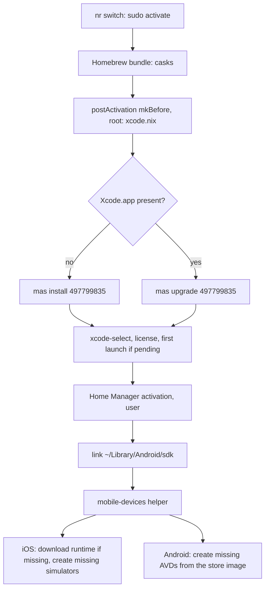

# macOS Mobile Device Emulators for T3 Code - Plan

## Goal Capsule

- **Objective:** On a macOS host, after one apply, T3 Code's Device panel lists the declared iOS Simulators and Android Emulators and opens each of them, for agent-driven checks and for the user's own app development.
- **Means:** A guarded root activation step installs Xcode with `mas` (KTD1). The pinned Android SDK gains arm64 images and a T3-compatible SDK root on macOS (KTD3, KTD4). A tested helper creates the declared devices from Home Manager activation (KTD5, KTD6).
- **Product authority:** This plan, then `AGENTS.md`, then the [macOS hosts plan](2026-10-07-1651-feat-macos-darwin-hosts-plan.md), whose exclusion of Mac App Store apps this plan narrows for Xcode only.
- **Open blockers:** None.
- **Stop conditions:** Stop if the darwin SDK build carries no `arm64-v8a` system image, or if an Xcode or device step can abort an apply.
- **Execution profile:** Nix modules, a Ruby release-helper extension, a shell helper with stubbed tests, Nix checks, and docs. Do not run `nr switch` or `darwin-rebuild switch` as validation, and do not install Xcode, runtimes, or devices on the developer's Mac.
- **Finishes the work:** `ce-work` implements and verifies with `nix flake check`, the shell tests, and the darwin builds a Mac can run. The user runs the hardware checklist in `docs/verification.md` after their own apply.

---

## Product Contract

### Summary

Xcode is declared as a Mac App Store app, and the pinned Android SDK, with its emulator and arm64 system images, reaches the Mac. A device list declared in the repository is created on apply. iOS devices use the newest runtime the installed Xcode supports, and Android devices use the newest pinned API level. `docs/macos.md` explains the App Store sign-in this depends on.

### Problem Frame

T3 Code on the MacBook has device support and agent device access turned on in its declared settings, but it has nothing to show. On 2026-10-09 its `device_list` reported iOS as available with zero devices and Android as unavailable: "Android SDK was not found. Install it with Android Studio or set ANDROID_HOME to your SDK directory."

The Mac lacks several pieces. Xcode 27.0 was installed by hand from the App Store, outside the configuration. No iOS Simulator runtime or device exists. The Android SDK module is inert on every non-x86_64 host, so the Mac gets no SDK, no emulator, and no `ANDROID_HOME`. Even where that module applies, it sets the variables only for shells and the systemd user manager. A Dock-launched app on macOS sees neither.

Earlier plans left all of this out on purpose. The macOS hosts plan excluded Mac App Store apps, and the Android emulator plan excluded AVD creation because AVDs are mutable user state. This plan reverses both, for Xcode and for a declared device list only.

### Key Decisions

- **Xcode is declarative, installed from the Mac App Store.** It adopts the existing App Store install and follows the App Store's current version. (session-settled: user-directed — chosen over keeping Xcode a manual install outside the configuration: the user requires Xcode to be declarative.) (session-settled: user-approved — chosen over pinning a version with xcodes or a Nix-store xip: App Store keeps the current install and needs no Developer-site login or manual 10 GB download per bump.) Governs R1, R2.
- **Devices are a declared list; OS versions default to the newest.** (session-settled: user-directed — chosen over creating one default device per platform or creating only runtimes and images: the user wants the device set in the repository.) Governs R6, R7, R8.
- **A newer OS adds devices and removes nothing.** When the newest iOS runtime or pinned API level changes, apply creates the declared devices on it and leaves older devices and runtimes in place, at roughly 8 GB per iOS runtime. (session-settled: user-approved — chosen over replacing and deleting the old devices, and over freezing devices at their first version: no app data is lost, and the user cleans up by hand.) Governs R9, R10.
- **The Mac gets the full pinned Android SDK, not only the emulator.** The user develops Android apps directly as well as through agents, so build tools, NDK, and a JDK come along, matching Linux x86_64 hosts. Governs R4.
- **The default device list is one current iPhone and one current Pixel phone.** Governs R6.

### Requirements

**Xcode and the iOS Simulator**

- R1. A macOS host installs Xcode from the Mac App Store through the configuration, and the hand-installed Xcode is adopted rather than reinstalled.
- R2. Apply accepts the Xcode license and finishes Xcode's first-launch setup, so `xcrun simctl` works without opening Xcode.
- R3. Apply installs the newest iOS Simulator runtime the installed Xcode supports when it is missing.

**Android SDK on macOS**

- R4. A macOS host gets the same pinned Android SDK as a Linux x86_64 host, built for macOS arm64, including the emulator and an `arm64-v8a` Google APIs system image for each pinned platform.
- R5. T3 Code detects the Android SDK without manual setup, even when launched from the Dock or Finder rather than a shell.

**Declared devices**

- R6. The repository declares the device list for macOS hosts, each entry naming a platform and a device model, with the OS version optional and defaulting to the newest available.
- R7. Apply creates each declared device that does not yet exist and leaves an existing one unchanged.
- R8. Apply never deletes or modifies a device it did not create, nor a device dropped from the declared list.
- R9. When the newest iOS runtime or pinned Android API level changes, apply creates the declared devices for the new version and keeps the old devices and runtimes.
- R10. Device names show the OS version, so devices for two versions of the same model are distinguishable in T3 Code's device list.

**Sign-in and documentation**

- R11. When the Mac App Store is not signed in, apply skips the Xcode install and the iOS device steps with a message naming the sign-in, and the rest of the apply succeeds.
- R12. `docs/macos.md` explains the App Store sign-in: that Xcode needs it, when in first setup to do it, and what apply does without it.
- R13. `docs/macos.md` documents the declared device list, how to add a device, and how to remove old runtimes and devices by hand.

### Acceptance Examples

- AE1. **Covers R7.** Given the declared iPhone already exists on the newest runtime, when the user applies again, then no device is created or changed.
- AE2. **Covers R9, R10.** Given an iPhone exists on iOS 27.0 and the App Store upgrades Xcode to one whose newest runtime is iOS 27.1, when the user applies, then a new iPhone on iOS 27.1 is created and the iOS 27.0 device and runtime remain.
- AE3. **Covers R8.** Given the user created a simulator by hand and removed a Pixel from the declared list, when the user applies, then both devices remain.
- AE4. **Covers R11.** Given a fresh Mac not signed in to the App Store, when the user runs the first apply, then the apply succeeds, Xcode and iOS devices are skipped with a sign-in message, and the Android SDK and Android devices are set up.
- AE5. **Covers R5.** Given a rebuilt Mac with T3 Code started from the Dock after login, when the agent calls `device_list`, then Android is available and the declared Android device is listed.

### Success Criteria

- On the MacBook after an apply, T3 Code's `device_list` reports both platforms available and lists every declared device, and `device_open` boots each one into the Device panel.
- A new Mac reaches that state by following `docs/macos.md` alone, with the App Store sign-in as the only interactive step beyond what first setup already asks.

### Scope Boundaries

- Physical iPhones and Android phones are out of scope.
- Android Studio and other IDEs are out of scope.
- watchOS, tvOS, and visionOS simulators are out of scope.
- Automatic cleanup of old runtimes and devices is out of scope; R13 documents the manual steps.
- Linux hosts are unchanged. aarch64 Linux keeps no Android SDK, and NixOS hosts gain no declared devices.
- Pinning a specific Xcode version is out of scope; the App Store decides it.
- Other Mac App Store apps stay excluded; the exception covers Xcode only.

### Dependencies / Assumptions

- The pinned nixpkgs `androidenv` resolves macOS arm64 archives for the emulator, cmdline-tools, and platform-tools, and accepts `abiVersions = [ "arm64-v8a" ]`. The repository's trimmed pin file has no arm64 images yet, so `scripts/android-sdk-release` must emit them.
- Each apply also upgrades Xcode when the App Store has a newer version (KTD1), so an Xcode update and the R9 runtime download can happen during an apply.
- Downloading an iOS runtime needs network access and no Apple ID beyond the App Store sign-in.

### Sources / Research

- `home/h82/dev/android.nix:23-25`: the module is gated on `isx86_64`. Lines 28-30 set only `home.sessionVariables` and `systemd.user.sessionVariables`.
- `packages/android-sdk.nix:24-31` and `packages/android-sdk-repo.json`: the pin covers the `google_apis` `x86_64` images only.
- `home/h82/t3code.nix:46-47`: `enableAgentDeviceAccess` and `enableDeviceSupport` are on. Lines 126-137 show the launchd `setenv` precedent.
- `modules/darwin/homebrew.nix`: `upgrade = true`, `cleanup = "none"`.
- [macOS hosts plan](2026-10-07-1651-feat-macos-darwin-hosts-plan.md), Scope Boundaries: Mac App Store apps are excluded.
- [Android emulator plan](2026-09-26-1910-feat-orca-android-emulator-plan.md), Scope Boundaries: declarative AVD creation is excluded.
- nixpkgs `pkgs/development/mobile/androidenv/compose-android-packages.nix`: maps `aarch64-darwin` to `macosx`/`aarch64` and filters images by `abiVersions`.
- `docs/macos.md`: "First setup on the Mac" and "App notes" are where R12 and R13 land.

---

## Planning Contract

Product Contract preservation: requirements, acceptance examples, and scope unchanged. Outstanding Questions resolved in place by KTD4 to KTD7, and the Homebrew-upgrade assumption reworded to cite KTD1.

### Key Technical Decisions

- KTD1. **Xcode is installed by a guarded root step that runs `mas`, not by `homebrew.masApps`.** A new `modules/darwin/xcode.nix` adds a step to `system.activationScripts.postActivation` with `lib.mkBefore`. That places it after Homebrew and before Home Manager, the only splice point that runs as root in that position. The step does four things:
  1. Install Xcode (App Store id `497799835`) with `mas` from nixpkgs when `/Applications/Xcode.app` is missing, falling back to `mas get 497799835` when `mas install` fails, because `install` covers only apps the account already obtained.
  2. Run `mas upgrade 497799835` otherwise.
  3. Point `xcode-select` at Xcode when it points at the Command Line Tools or nowhere.
  4. Accept the license and run first launch only when `xcodebuild` reports either as pending.

  Every `mas` call runs in the primary user's session as `launchctl asuser <uid>` with `SUDO_UID` and `SUDO_GID` set to that user. The activate script starts under `env -i`, so `SUDO_UID` never reaches `mas`, and `mas` 7 needs it to drop to the user for App Store access before it installs as root. Without it the App Store calls run as root, which has no account.

  Every failure prints one message naming the App Store sign-in and the step continues, so the apply still succeeds (R11). (session-settled: user-approved — chosen over an xcodes version pin or a Nix-store xip: App Store keeps the current install and needs no Developer-site login or manual 10 GB download per bump.) **Conflict call-out:** the user approved this route as `homebrew.masApps`, and that mechanism cannot meet R11. `mas` 7.0.0 needs root to install or upgrade, but Homebrew Bundle runs it as the user. A failed `brew bundle` aborts the activate script under `set -e`, which takes Home Manager down with it. nix-darwin's `programs.mas` is worse: it runs `exit 0` when not signed in and silently ends the activation. The App Store and `mas` source stays as settled; only the call site moves. Governs R1, R2, R11.
- KTD2. **The iOS runtime is downloaded from Home Manager activation, as the user.** `xcodebuild -downloadPlatform iOS` runs only when `xcrun simctl list runtimes -j` lacks the iOS version that `xcodebuild -showsdks -json` reports for the simulator SDK. Runtimes and devices are per-user state. Home Manager on nix-darwin runs as the user on every apply, because nix-darwin's `postActivation` calls its `activate` unconditionally (home-manager `nix-darwin/default.nix`). That is why an App Store Xcode upgrade with no Nix change still reaches R9. The skip on an unchanged generation in `best-practices/home-manager-activation-does-not-run-on-every-rebuild.md` applies to the NixOS module only. Governs R3, R9.
- KTD3. **The Android SDK pin carries `arm64-v8a` and `x86_64` images, and each platform builds its own ABI.** `scripts/android-sdk-release` turns its single `IMAGE_ABI` into a list and keeps its refusals per ABI. `packages/android-sdk.nix` selects `arm64-v8a` on aarch64-darwin and `x86_64` elsewhere. androidenv silently drops an ABI the pin lacks, so a darwin check must assert that each `system.img` exists. Governs R4.
- KTD4. **On macOS the SDK root is `~/Library/Android/sdk`, a store tree that adds `cmdline-tools/latest`.** T3 Code's device hub reads `ANDROID_HOME`, then `ANDROID_SDK_ROOT`, then `~/Library/Android/sdk`. It needs `cmdline-tools/latest/bin/avdmanager`, `emulator/emulator`, and `platform-tools/adb`, while androidenv installs cmdline-tools at its version (`23.0`). A small derivation links every top-level SDK entry and adds `cmdline-tools/latest` beside the versioned directory. Its `emulator/` is a real directory linking the store emulator's entries, except `emulator/emulator`, which is a wrapper. The wrapper defaults `ANDROID_HOME` and `ANDROID_SDK_ROOT` to `$HOME/Library/Android/sdk`, then execs the store binary. Without it, a Dock-launched T3 Code starts the emulator with neither variable set. The emulator then infers the SDK root from its resolved store path, finds no `platforms/`, and cannot boot an AVD. `home.file` places the tree at `~/Library/Android/sdk`, the only SDK link on macOS. `ANDROID_HOME` and `ANDROID_SDK_ROOT` point there, and the shell `PATH` also gains `emulator/` so the agent-device CLI finds `emulator` beside `adb`. A launchd `setenv` agent was rejected: it reaches only apps started after it runs, and loses the race against apps macOS reopens at login. Governs R5.
- KTD5. **One shell helper, `mobile-devices`, owns device creation for both platforms.** It follows the `writeShellApplication` pattern of `packages/minikube-darwin-start.nix`, takes the declared list and the resolved versions as arguments, and is tested with stubbed `xcrun`, `xcodebuild`, and `avdmanager`. It lists existing devices by name and creates only missing ones. It never calls a delete or erase command. A failure on one platform is reported and does not stop the other or fail activation. Governs R6, R7, R8, R10, R11.
- KTD6. **The device list is a Home Manager option, `my.mobileDevices`, read only on macOS.** It is a list of `{ platform = "ios" | "android"; model; version ? null; }`. A null version means the newest. For iOS, the helper resolves it at run time from the installed Xcode's simulator SDK (`xcodebuild -showsdks -json`). For Android, evaluation resolves it from the pin as the highest platform key with an `arm64-v8a` image, compared as versions rather than strings. It lives in Home Manager rather than `modules/shared/host.nix`, so NixOS and Linux hosts gain no meaningless option, and its module is imported only when `hostKind == "darwin"`. Governs R6.
- KTD7. **Device names carry the OS version.** iOS devices are named `<model> (iOS <version>)`. AVDs, which disallow spaces, are named `<model>_API_<api>`, where `<api>` is the pin's platform key verbatim (`37.0`), the same key the system-image package path uses. A new version produces a new name, so R9 needs no extra state. Governs R9, R10.

### High-Level Technical Design

One apply, in order. Every Xcode and device box is non-fatal; a failure prints a message and the apply continues.



The helper's per-device decision, directional:

```text
for each declared device:
  version := declared version or newest available
  name    := name(model, version)            # KTD7
  if platform tool is missing: report once, skip platform
  if name exists: leave it                   # R7
  else: create it; on failure report and continue
never: delete, erase, rename                 # R8
```

### Assumptions

- `mas` 7 run as root installs with the App Store account signed in to the console user's session. This is untested on this Mac; the existing install only produced "Already installed". The hardware checklist verifies it.
- `xcodebuild -downloadPlatform iOS` run as the user needs no Apple ID.
- androidenv sets `dontStrip`, so the store emulator keeps Google's signature and its Hypervisor entitlement. This is inferred from the derivation; the hardware checklist confirms that an AVD boots.
- The default device models are chosen at implementation from the device types available then: the newest non-Max iPhone Pro (`iPhone 18 Pro` as of Xcode 27.0) and the newest Pixel phone id that `avdmanager list device` reports. Both are pinned as literal names in the repository.
- Device creation also runs on the bootstrap output. Devices hold no secrets, and first setup already downloads casks and a Podman image during bootstrap.

### Sequencing

U1, then U2. U3 is independent. U4, then U5, which also needs U2. U6 lands last.

---

## Implementation Units

### U1. Pin arm64 system images in the release helper

**Goal:** `android-sdk-release` writes a pin that carries the `google_apis` image for both `arm64-v8a` and `x86_64` at each declared platform.

**Requirements:** R4 (KTD3).

**Dependencies:** None.

**Files:**

- `scripts/android-sdk-release`
- `tests/test_android_sdk_release.py`
- `packages/android-sdk-repo.json`

**Approach:**

1. Replace `IMAGE_ABI` with an ABI list and loop `select_images` over it. Each ABI keeps its own missing-image, downgrade, and emulator-minimum refusal.
2. Update the header comment that describes x86_64 only.
3. Regenerate `packages/android-sdk-repo.json` with `nix run .#android-sdk-release -- --output packages/android-sdk-repo.json`, keeping every existing version unchanged.

**Patterns to follow:** the existing `TRACKED`/`DECLARED` constants and `select_images` refusals; the fixture builder `image(api, abi, …)` in `tests/test_android_sdk_release.py`.

**Test scenarios:**

- A repository listing both ABIs for API 36 and 37.0 renders `images.<api>.google_apis` with exactly `arm64-v8a` and `x86_64`.
- Upstream lacking the `arm64-v8a` image for a declared platform makes the helper refuse, naming the API and ABI.
- An `arm64-v8a` image older than the pinned one is refused as a downgrade, independently of the `x86_64` image.
- An `arm64-v8a` image needing a newer emulator than the pin is refused.
- `android-sdk-repo-parity` passes on the regenerated pin.

**Verification:** `checks.android-sdk-release` and `checks.android-sdk-repo-parity` pass, and the pin lists both ABIs for every pinned platform.

### U2. Build the Android SDK for macOS and expose it where T3 Code looks

**Goal:** A macOS host gets the full pinned SDK with arm64 images, at `~/Library/Android/sdk`, in a layout T3 Code's device hub accepts.

**Requirements:** R4, R5 (KTD3, KTD4).

**Dependencies:** U1.

**Files:**

- `packages/android-sdk.nix`
- `home/h82/dev/android.nix`
- `tests/darwin-config.nix`
- `tests/darwin-outputs.nix`
- `tests/non-nixos-outputs.nix` (header comment only, if its wording no longer holds)

**Approach:**

1. In `packages/android-sdk.nix`, derive `abiVersions` from the host platform per KTD3.
2. Export a darwin SDK tree per KTD4: linked store entries, `cmdline-tools/latest`, and the `emulator/emulator` wrapper.
3. In `home/h82/dev/android.nix`, widen the gate from `isx86_64` to x86_64 or `my.kind == "darwin"`, so aarch64 Linux stays excluded.
4. On darwin, set `sdkRoot` to `~/Library/Android/sdk`, link the tree there with `home.file` instead of `xdg.dataFile`, append `emulator` to the `PATH` addition, and gate `systemd.user.sessionVariables` to Linux.
5. Leave NixOS and Linux SDK paths and values unchanged.

**Patterns to follow:** `config.my.kind == "darwin"` value gating in `home/h82/dev/containers.nix`. `darwin-config` reads the user through `config.home-manager.users.${config.my.user.name}`. `darwin-outputs` reads materialized files from the generation.

**Test scenarios:**

- `darwin-config`: the macOS fixture's Home Manager declares `Library/Android/sdk`, sets `ANDROID_HOME` to `<home>/Library/Android/sdk`, and declares no `android-sdk` data file.
- `darwin-config`: the darwin SDK derivation's `abiVersions` is `arm64-v8a`. Read it from the evaluated package arguments, not the module source.
- `non-nixos-outputs` (unchanged): the aarch64 Linux fixture still has no SDK, and the x86_64 Linux fixture still has one.
- `darwin-outputs` on a macOS builder: the generation's `Library/Android/sdk` resolves `cmdline-tools/latest/bin/avdmanager`, `emulator/emulator`, `platform-tools/adb`, and `system-images/android-<api>/google_apis/arm64-v8a/system.img` for each pinned API.
- `darwin-outputs` on a macOS builder: the tree's `emulator/emulator` is the wrapper, defaults both `ANDROID_HOME` and `ANDROID_SDK_ROOT` to `$HOME/Library/Android/sdk`, and execs the store emulator.
- Mutation: dropping `arm64-v8a` from the pin, removing the `latest` link, or replacing the wrapper with a plain link turns `darwin-outputs` red with its own message.

**Verification:** The macOS fixture and `darwinConfigurations.MacBook-Pro-Mac17-9` build on a Mac, `darwin-outputs` passes, and `android-sdk` (NixOS) and `non-nixos-outputs` pass unchanged.

### U3. Install and prepare Xcode from a guarded root step

**Goal:** Every apply on macOS installs or upgrades Xcode from the App Store and completes its license and first-launch setup, never failing the apply.

**Requirements:** R1, R2, R11 (KTD1).

**Dependencies:** None.

**Files:**

- `modules/darwin/xcode.nix` (new)
- `modules/darwin/profile.nix`
- `tests/darwin-config.nix`

**Approach:**

1. Add `modules/darwin/xcode.nix` to the profile's import list.
2. Contribute `system.activationScripts.postActivation.text` with `lib.mkBefore`, calling the steps in KTD1 in order.
3. Call macOS binaries by absolute path (`/usr/bin/xcodebuild`, `/usr/bin/xcode-select`) and `mas` by store path.
4. Wrap each command so a non-zero exit prints one line naming the step and, for `mas`, the App Store sign-in, and never trips `set -e`.

**Patterns to follow:** absolute macOS binary paths in `home/h82/dev/containers.nix`; constraint comments in `modules/darwin/homebrew.nix`.

**Test scenarios:**

- `darwin-config`: the macOS fixture's `system.activationScripts.postActivation.text` contains the Xcode step before Home Manager's activation call.
- `darwin-config`: that text references `mas`'s store path with id `497799835` and guards each command, so no bare `mas install` line can fail the script.
- `darwin-config`: every `mas` line runs through `launchctl asuser` with `SUDO_UID` and `SUDO_GID` set to the primary user's ids, and an install failure falls back to `mas get`.
- Mutation: dropping `SUDO_UID` from a `mas` line turns `darwin-config` red.
- `darwin-config`: `homebrew.masApps` is empty and `programs.mas.enable` is false, so neither nix-darwin route can abort or end activation.
- Mutation: removing the guard around `mas install` turns `darwin-config` red.

**Verification:** `darwin-config` passes, and the hardware checklist item for Xcode passes on the Mac after the user's own apply.

### U4. Write the device helper and its stubbed tests

**Goal:** A tested `mobile-devices` helper that creates missing declared devices and installs a missing iOS runtime, idempotently and without deleting anything.

**Requirements:** R3, R6, R7, R8, R9, R10, R11 (KTD2, KTD5, KTD7).

**Dependencies:** None.

**Files:**

- `scripts/mobile-devices` (new)
- `packages/mobile-devices.nix` (new)
- `tests/mobile-devices.sh` (new)
- `flake.nix` (register `checks.mobile-devices`)

**Approach:**

1. The helper takes the device list and the newest Android API as arguments, and finds the newest iOS version from `xcodebuild -showsdks -json` at run time.
2. On iOS it downloads the runtime when missing (KTD2), picks the device type id whose name matches the declared model from `xcrun simctl list devicetypes -j`, and runs `simctl create` only for missing names (KTD7).
3. On Android it runs `avdmanager create avd` against `system-images;android-<api>;google_apis;arm64-v8a` for missing AVD names, read with `avdmanager list avd -c`.
4. A missing `xcrun` or `avdmanager` skips that platform with one message. Errors per device are reported, and the helper exits 0.

**Execution note:** Read the solutions on PATH stubs, `env … cd &&`, `printf | grep -q` under pipefail, and stdenv nullglob before writing `tests/mobile-devices.sh`.

**Patterns to follow:** `packages/minikube-darwin-start.nix` and `tests/minikube-darwin-start.sh`, registered in `flake.nix` as a `runCommand` over the helper's `getExe`.

**Test scenarios:**

- Happy path: with no devices, the stubs record one runtime download, one `simctl create "iPhone 18 Pro (iOS 27.0)"`, and one `avdmanager create avd` named `<pixel>_API_37.0` against `system-images;android-37.0;google_apis;arm64-v8a`.
- Covers AE1. A second run against the state the first run left creates nothing and downloads nothing.
- Covers AE2. With `iPhone 18 Pro (iOS 27.0)` existing and the SDK reporting 27.1, the helper creates `iPhone 18 Pro (iOS 27.1)` and runs no delete for the 27.0 device.
- Covers AE3. A hand-made simulator and an AVD absent from the list survive. The stub log has no `delete`, `erase`, or `rename` call in any scenario.
- Covers AE4. With `xcrun` failing (no Xcode), Android devices are still created, and the helper exits 0 with a message naming the App Store sign-in.
- A declared model with no matching device type is reported by name and skipped; the other devices are still created.
- An explicit `version` in an entry is used instead of the newest.
- Mutation: adding a delete of unlisted devices, or dropping the existence check, turns the test red.

**Verification:** `checks.mobile-devices` passes and lands in a check shard.

### U5. Declare the device list and run the helper on apply

**Goal:** `my.mobileDevices` holds the default iPhone and Pixel, and every macOS apply runs the helper as the user.

**Requirements:** R6, R7, R9 (KTD5, KTD6).

**Dependencies:** U2, U4.

**Files:**

- `home/h82/dev/mobile-devices.nix` (new)
- `home/h82/dev/default.nix`
- `tests/darwin-config.nix`
- `tests/darwin-outputs.nix`

**Approach:**

1. Declare `options.my.mobileDevices` per KTD6, with the default list from the Assumptions.
2. Import it from `home/h82/dev/default.nix` under `lib.optionals (hostKind == "darwin")`, matching the VSCodium import.
3. Add a `home.activation.mobileDevices` entry after `linkGeneration`, honouring `DRY_RUN`, that calls the helper's store path. Pass the list, the newest pinned API, and the SDK root at `~/Library/Android/sdk`.

**Patterns to follow:** the `DRY_RUN` guard in `home/h82/dev/containers.nix:109-115`, and the HM option precedent in `home/h82/agents/agent-plugins.nix:202-216`.

**Test scenarios:**

- `darwin-config`: the macOS fixture's `home.activation.mobileDevices` exists, orders after `linkGeneration`, and keeps the helper inside the non-dry-run branch.
- `darwin-config`: the default `my.mobileDevices` has one `ios` and one `android` entry, and the API passed to the helper equals the highest pinned API with an `arm64-v8a` image.
- `darwin-config`: no Linux fixture has a `mobileDevices` activation entry.
- `darwin-outputs` on a macOS builder: the generation's activation script calls the helper with both declared devices.

**Verification:** `darwin-config` and `darwin-outputs` pass, and after the user's apply T3 Code's `device_list` shows both devices.

### U6. Document the App Store sign-in, devices, and verification

**Goal:** A reader can set up a new Mac to the Success Criteria from `docs/macos.md` alone, and verify it from `docs/verification.md`.

**Requirements:** R12, R13.

**Dependencies:** U3, U5.

**Files:**

- `docs/macos.md`
- `docs/verification.md`
- `AGENTS.md` (the `modules/darwin/` and `home/h82/` structure lines)

**Approach:**

1. In `docs/macos.md`, add Xcode, Android SDK, and device bullets to "What the configuration manages".
2. Add an App Store sign-in step before the bootstrap apply in "First setup on the Mac", saying what apply does without it (R11).
3. Add an "App notes" entry on `my.mobileDevices`, adding a device, and removing old runtimes and devices by hand (R13).
4. Add a Troubleshooting row for "Xcode skipped: sign in to the App Store".
5. In `docs/verification.md`, add macOS checklist items:
   - Xcode installed by apply.
   - `device_list` shows both platforms.
   - Each declared device opens with `device_open`.
   - With T3 Code started from the Dock, an agent's `device_open` boots the declared AVD and drives it with the agent-device CLI.
   - The emulator's Hypervisor entitlement holds, which that boot proves.
6. Generalize the x86_64-only AVD line.

**Test expectation:** none -- documentation; the pre-commit markdownlint hook and `check-workflow-docs-skip` cover it.

**Verification:** markdownlint passes, and every command and option name in the docs matches the code.

---

## Verification Contract

| Gate | Command | Proves |
| --- | --- | --- |
| Format | `nix fmt -- --ci` | Nix layout |
| Flake checks | `nix flake check` | `android-sdk-release`, `android-sdk-repo-parity`, `mobile-devices`, `darwin-config`, `non-nixos-outputs`, `android-sdk`, `host-name-guard`, `check-shards-guard` |
| Darwin outputs | `nix build --no-link .#checks.aarch64-darwin.darwin-outputs` | Materialized SDK tree, images, activation wiring (U2, U5); Mac or CI `build-darwin` only |
| Host builds | the AGENTS.md loops over `nixosConfigurations`, `homeConfigurations`, `systemConfigs`, `darwinConfigurations` | No host regresses; darwin on a Mac or CI |
| Markdown | `mise run lint-staged-markdown` | Docs lint |
| Hardware | `docs/verification.md` macOS items | R1 to R5 and R7 on the real Mac, run by the user after their own apply |

NixOS VM tests are unaffected; build them with `nix build --no-link .#vmChecks.all` only where `/dev/kvm` exists.

---

## Definition of Done

- U1 to U6 are implemented, with each unit's verification met.
- Every new or changed check was mutation-tested and failed with its own message.
- The gates above pass, except hardware items, which are reported separately as pending the user's apply.
- No `nr switch`, `darwin-rebuild switch`, Xcode install, runtime download, or device creation was run on the developer's Mac as validation.
- Abandoned-attempt code and debug output are removed from the diff.
